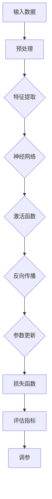

                 

# 一切皆是映射：深度学习的调参艺术与实践窍门

> 关键词：深度学习，调参艺术，实践窍门，映射，神经网络，模型优化

> 摘要：本文将深入探讨深度学习的调参艺术，通过理论与实践相结合的方式，详细阐述如何优化深度学习模型的参数设置，以实现更高的准确率和更快的收敛速度。文章首先介绍了调参的背景和重要性，随后逐步讲解了核心概念、算法原理、数学模型、项目实战和实际应用场景，最后对未来的发展趋势和挑战进行了展望。本文旨在为深度学习开发者提供一套系统、实用的调参方法论。

## 1. 背景介绍

### 1.1 目的和范围

深度学习作为一种重要的机器学习技术，已经在计算机视觉、自然语言处理、语音识别等多个领域取得了显著的成果。然而，深度学习模型的性能很大程度上取决于其参数设置。调参（Hyperparameter Tuning）作为深度学习模型优化的重要环节，旨在通过调整模型的超参数，使其达到最优的性能表现。

本文的目的在于系统地介绍深度学习调参的方法论，帮助开发者掌握调参的艺术。文章将从以下几个方面展开：

- 背景介绍：阐述调参的重要性和当前调参方法的局限性。
- 核心概念与联系：介绍深度学习的基础概念，包括神经网络、激活函数、反向传播等。
- 核心算法原理 & 具体操作步骤：详细讲解调参算法的基本原理和操作步骤。
- 数学模型和公式 & 详细讲解 & 举例说明：阐述调参过程中涉及的数学模型和公式。
- 项目实战：通过实际案例展示调参的具体应用。
- 实际应用场景：探讨深度学习调参在不同领域的应用。
- 工具和资源推荐：推荐相关的学习资源、开发工具和框架。
- 总结与展望：对深度学习调参的未来发展趋势和挑战进行展望。

### 1.2 预期读者

本文面向对深度学习有一定了解的开发者，尤其是对调参环节感兴趣的技术人员。读者应具备以下基本知识：

- 深度学习基础知识，包括神经网络、反向传播等。
- Python编程基础，了解常见的数据科学库，如NumPy、Pandas、Scikit-learn等。
- 对调参有初步的认识，了解常用的调参方法。

通过本文的学习，读者将能够：

- 理解深度学习调参的原理和重要性。
- 掌握常用的调参方法和技巧。
- 利用调参工具和框架优化深度学习模型的性能。

### 1.3 文档结构概述

本文分为以下几个主要部分：

- 引言：介绍调参的背景和重要性。
- 背景介绍：详细阐述调参的背景、目的和范围。
- 核心概念与联系：介绍深度学习的基础概念和原理。
- 核心算法原理 & 具体操作步骤：讲解调参算法的基本原理和操作步骤。
- 数学模型和公式 & 详细讲解 & 举例说明：阐述调参过程中涉及的数学模型和公式。
- 项目实战：通过实际案例展示调参的应用。
- 实际应用场景：探讨深度学习调参在不同领域的应用。
- 工具和资源推荐：推荐相关的学习资源、开发工具和框架。
- 总结与展望：对深度学习调参的未来发展趋势和挑战进行展望。

### 1.4 术语表

#### 1.4.1 核心术语定义

- **深度学习**：一种人工智能方法，通过多层神经网络对数据进行建模和预测。
- **神经网络**：由多个神经元组成的计算模型，能够通过学习数据自动提取特征。
- **超参数**：在模型训练过程中无法通过梯度下降算法优化的参数，如学习率、批次大小等。
- **调参**：通过调整超参数来优化模型性能的过程。
- **梯度下降**：一种优化算法，通过不断调整参数，使损失函数逐渐减小，从而优化模型。

#### 1.4.2 相关概念解释

- **反向传播**：一种用于训练神经网络的算法，通过计算损失函数关于参数的梯度，来更新参数。
- **交叉验证**：一种评估模型性能的方法，通过将数据集划分为训练集和验证集，多次训练和验证，以避免过拟合。
- **过拟合**：模型在训练集上表现良好，但在验证集或测试集上表现较差，通常是由于模型过于复杂。

#### 1.4.3 缩略词列表

- **CNN**：卷积神经网络（Convolutional Neural Network）
- **RNN**：循环神经网络（Recurrent Neural Network）
- **GPU**：图形处理单元（Graphics Processing Unit）
- **TPU**：张量处理单元（Tensor Processing Unit）

## 2. 核心概念与联系

在深入了解深度学习调参之前，我们需要掌握深度学习的一些核心概念和原理。以下是一个简化的Mermaid流程图，展示了深度学习的基本架构和核心概念之间的联系。



### 2.1 输入数据与预处理

输入数据是深度学习模型的起点。在处理输入数据时，我们需要进行一系列预处理操作，包括数据清洗、归一化、降维等，以确保数据的质量和一致性。

### 2.2 特征提取

预处理后的数据进入特征提取阶段。在这个阶段，深度学习模型会自动从数据中提取有用的特征。特征提取是深度学习模型的核心任务之一。

### 2.3 神经网络

特征提取后的数据被输入到神经网络中。神经网络由多个层组成，每层包含多个神经元。神经元的输出通过激活函数进行非线性变换，从而产生模型的预测结果。

### 2.4 激活函数

激活函数是神经网络的重要组成部分，用于引入非线性因素，使模型能够学习复杂的数据分布。常见的激活函数包括Sigmoid、ReLU和Tanh等。

### 2.5 反向传播

反向传播是一种用于训练神经网络的算法。在反向传播过程中，模型会计算损失函数关于参数的梯度，并根据梯度方向调整参数，以减小损失函数。

### 2.6 参数更新

在反向传播的过程中，参数会根据梯度进行更新。参数更新的目标是使损失函数逐渐减小，从而优化模型的性能。

### 2.7 损失函数与评估指标

损失函数是衡量模型预测结果与真实结果之间差异的指标。常见的损失函数包括均方误差（MSE）和交叉熵（Cross-Entropy）等。评估指标用于评估模型的性能，如准确率、召回率和F1分数等。

### 2.8 调参

调参是深度学习模型优化的重要环节。通过调整超参数，如学习率、批次大小和正则化参数等，可以优化模型的性能。调参方法包括网格搜索、随机搜索和贝叶斯优化等。

通过上述流程，我们可以看到深度学习模型的各个环节是如何相互联系、共同作用的。了解这些核心概念和原理，对于深入理解和应用深度学习调参具有重要意义。

## 3. 核心算法原理 & 具体操作步骤

在了解深度学习的基本架构和核心概念后，我们需要深入探讨调参的核心算法原理和具体操作步骤。以下是深度学习调参的基本原理和操作步骤，我们将使用伪代码来详细阐述。

### 3.1 调参原理

深度学习调参的目标是通过调整模型的超参数，使模型在训练数据上的表现达到最优。超参数包括学习率、批次大小、正则化参数、网络结构等。调参的核心思想是通过优化这些超参数，使损失函数最小化，从而提高模型的泛化能力。

### 3.2 具体操作步骤

#### 3.2.1 确定调参目标

首先，我们需要明确调参的目标，例如最小化损失函数、提高准确率、减少过拟合等。不同的目标可能需要不同的调参策略。

#### 3.2.2 确定超参数范围

接下来，我们需要确定每个超参数的取值范围。例如，学习率的取值范围可以是[0.0001, 0.01]，批次大小的取值范围可以是[16, 128]。

#### 3.2.3 选择调参方法

根据调参目标和超参数范围，选择合适的调参方法。常见的调参方法包括网格搜索、随机搜索和贝叶斯优化等。

#### 3.2.4 训练和验证模型

使用选定的调参方法，对模型进行训练和验证。在训练过程中，不断调整超参数，直到找到最优参数组合。

#### 3.2.5 评估模型性能

在找到最优参数组合后，使用验证集和测试集评估模型的性能。常用的评估指标包括准确率、召回率、F1分数等。

以下是使用伪代码表示的深度学习调参步骤：

```python
# 伪代码：深度学习调参步骤

# 确定调参目标
target: Minimize Loss Function

# 确定超参数范围
hyperparameters = {
    'learning_rate': [0.0001, 0.001, 0.01],
    'batch_size': [16, 32, 64, 128],
    'regularization': [0.001, 0.01, 0.1]
}

# 选择调参方法
tuning_method = GridSearchCV()

# 训练和验证模型
for learning_rate in hyperparameters['learning_rate']:
    for batch_size in hyperparameters['batch_size']:
        for regularization in hyperparameters['regularization']:
            # 训练模型
            model.train(data, learning_rate, batch_size, regularization)
            
            # 验证模型
            performance = model.evaluate(validation_data)
            
            # 更新最优参数
            if performance > best_performance:
                best_performance = performance
                best_hyperparameters = {
                    'learning_rate': learning_rate,
                    'batch_size': batch_size,
                    'regularization': regularization
                }

# 评估模型性能
final_performance = model.evaluate(test_data)

print("Best Hyperparameters:", best_hyperparameters)
print("Final Performance:", final_performance)
```

通过上述步骤，我们可以系统地优化深度学习模型的性能。需要注意的是，调参过程需要结合具体问题和数据集，灵活调整策略和参数。

## 4. 数学模型和公式 & 详细讲解 & 举例说明

在深度学习调参过程中，数学模型和公式起着至关重要的作用。以下我们将详细讲解深度学习调参中涉及的主要数学模型和公式，并通过具体例子来说明这些公式在实际应用中的意义。

### 4.1 损失函数

损失函数是深度学习模型性能的衡量标准，用于评估模型预测结果与真实结果之间的差异。常见的损失函数包括均方误差（MSE）和交叉熵（Cross-Entropy）。

- **均方误差（MSE）**：用于回归问题，计算预测值与真实值之间的平均平方误差。

$$
MSE = \frac{1}{n} \sum_{i=1}^{n} (y_i - \hat{y}_i)^2
$$

其中，$y_i$ 是真实值，$\hat{y}_i$ 是预测值，$n$ 是样本数量。

- **交叉熵（Cross-Entropy）**：用于分类问题，计算预测概率分布与真实概率分布之间的差异。

$$
Cross-Entropy = -\sum_{i=1}^{n} y_i \log(\hat{y}_i)
$$

其中，$y_i$ 是真实标签，$\hat{y}_i$ 是预测概率。

### 4.2 反向传播

反向传播是深度学习模型训练的核心算法，通过计算损失函数关于参数的梯度，来更新参数。以下是反向传播的基本步骤：

1. **前向传播**：将输入数据通过神经网络进行前向传播，得到输出值和预测概率。
2. **计算损失函数**：使用输出值和预测概率计算损失函数。
3. **计算梯度**：使用链式法则计算损失函数关于每个参数的梯度。
4. **参数更新**：根据梯度方向和梯度大小更新参数。

以下是反向传播的伪代码表示：

```python
# 伪代码：反向传播算法

# 前向传播
output = forward_pass(input, model)

# 计算损失函数
loss = loss_function(target, output)

# 计算梯度
gradient = backward_pass(model, loss)

# 参数更新
model.update_parameters(gradient)
```

### 4.3 优化算法

在深度学习调参过程中，优化算法用于调整参数，以最小化损失函数。常见的优化算法包括梯度下降（Gradient Descent）和Adam优化器。

- **梯度下降**：通过计算损失函数关于参数的梯度，沿着梯度方向更新参数。

$$
\theta_{\text{new}} = \theta_{\text{old}} - \alpha \cdot \nabla_{\theta} J(\theta)
$$

其中，$\theta$ 是参数，$\alpha$ 是学习率，$J(\theta)$ 是损失函数。

- **Adam优化器**：结合了梯度下降和动量法的优点，自适应调整学习率。

$$
m_t = \beta_1 m_{t-1} + (1 - \beta_1) \nabla_{\theta} J(\theta)
$$

$$
v_t = \beta_2 v_{t-1} + (1 - \beta_2) (\nabla_{\theta} J(\theta))^2
$$

$$
\theta_{\text{new}} = \theta_{\text{old}} - \alpha \cdot \frac{m_t}{\sqrt{v_t} + \epsilon}
$$

其中，$m_t$ 是一阶矩估计，$v_t$ 是二阶矩估计，$\beta_1$ 和 $\beta_2$ 是超参数，$\epsilon$ 是一个很小的常数。

### 4.4 例子说明

假设我们使用一个简单的神经网络进行分类任务，模型包含一个输入层、一个隐藏层和一个输出层。输入数据为 $X \in \mathbb{R}^{m \times n}$，隐藏层神经元数量为 $k$，输出层神经元数量为 $l$。

1. **初始化参数**：随机初始化权重矩阵 $W_1 \in \mathbb{R}^{n \times k}$ 和 $W_2 \in \mathbb{R}^{k \times l}$。
2. **前向传播**：计算隐藏层和输出层的激活值。
3. **计算损失函数**：使用交叉熵作为损失函数。
4. **计算梯度**：使用反向传播算法计算权重矩阵的梯度。
5. **参数更新**：使用梯度下降或Adam优化器更新权重矩阵。

以下是具体的伪代码示例：

```python
# 伪代码：简单神经网络调参

# 初始化参数
W1 = random_matrix(n, k)
W2 = random_matrix(k, l)

# 前向传播
hidden_layer = activation_function(np.dot(X, W1))
output_layer = activation_function(np.dot(hidden_layer, W2))

# 计算损失函数
loss = cross_entropy(target, output_layer)

# 计算梯度
dW1 = np.dot(X.T, (output_layer - target) * hidden_layer * (1 - hidden_layer))
dW2 = np.dot(hidden_layer.T, (output_layer - target) * output_layer * (1 - output_layer))

# 参数更新
W1 = W1 - learning_rate * dW1
W2 = W2 - learning_rate * dW2
```

通过上述步骤，我们可以使用深度学习调参方法优化神经网络的性能。需要注意的是，实际应用中，参数的初始化、激活函数的选择和优化算法的细节都会对调参效果产生重要影响。

## 5. 项目实战：代码实际案例和详细解释说明

在了解了深度学习调参的原理和具体操作步骤后，接下来我们将通过一个实际的项目案例来展示如何应用调参方法优化深度学习模型的性能。我们将使用Python和TensorFlow框架实现一个简单的图像分类模型，并详细解释代码的各个部分。

### 5.1 开发环境搭建

在开始项目之前，我们需要搭建一个适合深度学习开发的开发环境。以下是搭建开发环境的基本步骤：

1. 安装Python（建议使用Python 3.7或更高版本）。
2. 安装TensorFlow框架：`pip install tensorflow`。
3. 安装其他必要的库，如NumPy、Pandas、Matplotlib等。

### 5.2 源代码详细实现和代码解读

以下是完整的代码实现，我们将逐行解释代码的含义和作用。

```python
import tensorflow as tf
from tensorflow.keras import layers
import numpy as np

# 加载数据集
(x_train, y_train), (x_test, y_test) = tf.keras.datasets.cifar10.load_data()

# 数据预处理
x_train = x_train.astype("float32") / 255.0
x_test = x_test.astype("float32") / 255.0

# 标签转化为one-hot编码
y_train = tf.keras.utils.to_categorical(y_train, 10)
y_test = tf.keras.utils.to_categorical(y_test, 10)

# 构建模型
model = tf.keras.Sequential([
    layers.Conv2D(32, (3, 3), activation='relu', input_shape=(32, 32, 3)),
    layers.MaxPooling2D((2, 2)),
    layers.Conv2D(64, (3, 3), activation='relu'),
    layers.MaxPooling2D((2, 2)),
    layers.Conv2D(64, (3, 3), activation='relu'),
    layers.Flatten(),
    layers.Dense(64, activation='relu'),
    layers.Dense(10, activation='softmax')
])

# 编译模型
model.compile(optimizer='adam', loss='categorical_crossentropy', metrics=['accuracy'])

# 训练模型
model.fit(x_train, y_train, batch_size=64, epochs=10, validation_split=0.2)

# 评估模型
test_loss, test_accuracy = model.evaluate(x_test, y_test)
print("Test accuracy:", test_accuracy)

# 调参过程
from tensorflow.keras.wrappers.scikit_learn import KerasClassifier
from sklearn.model_selection import GridSearchCV

# 定义模型构建函数
def create_model(optimizer='adam', init='glorot_uniform'):
    model = tf.keras.Sequential([
        layers.Conv2D(32, (3, 3), activation='relu', input_shape=(32, 32, 3), kernel_initializer=init),
        layers.MaxPooling2D((2, 2)),
        layers.Conv2D(64, (3, 3), activation='relu'),
        layers.MaxPooling2D((2, 2)),
        layers.Conv2D(64, (3, 3), activation='relu'),
        layers.Flatten(),
        layers.Dense(64, activation='relu', kernel_initializer=init),
        layers.Dense(10, activation='softmax')
    ])
    model.compile(optimizer=optimizer, loss='categorical_crossentropy', metrics=['accuracy'])
    return model

# 创建Keras分类器
model = KerasClassifier(build_fn=create_model, verbose=0)

# 设置调参参数
param_grid = {
    'batch_size': [32, 64],
    'epochs': [10, 20],
    'optimizer': ['adam', 'sgd'],
    'init': ['glorot_uniform', 'he_normal']
}

# 执行网格搜索
grid = GridSearchCV(estimator=model, param_grid=param_grid, cv=3)
grid_result = grid.fit(x_train, y_train)

# 输出最优参数
print("Best: %f using %s" % (grid_result.best_score_, grid_result.best_params_))

# 使用最优参数训练模型
model = create_model(**grid_result.best_params_)
model.fit(x_train, y_train, batch_size=grid_result.best_params_['batch_size'], epochs=grid_result.best_params_['epochs'], validation_split=0.2)

# 评估模型
test_loss, test_accuracy = model.evaluate(x_test, y_test)
print("Test accuracy:", test_accuracy)
```

### 5.3 代码解读与分析

以下是代码的逐行解读和分析：

1. **导入库**：
   - 导入TensorFlow和NumPy库。
2. **加载数据集**：
   - 使用TensorFlow内置的CIFAR-10数据集，该数据集包含10个类别的60000张32x32的彩色图像。
3. **数据预处理**：
   - 将图像数据从0-255的整数范围归一化到0-1的范围，以便于模型训练。
   - 将标签转换为one-hot编码，以便于使用交叉熵损失函数。
4. **构建模型**：
   - 使用Keras的Sequential模型构建一个简单的卷积神经网络，包含两个卷积层、两个最大池化层、一个全连接层和一个softmax输出层。
5. **编译模型**：
   - 选择Adam优化器，并使用categorical_crossentropy作为损失函数。
6. **训练模型**：
   - 使用fit方法训练模型，并将训练集的20%用作验证集。
7. **评估模型**：
   - 使用evaluate方法在测试集上评估模型的性能。
8. **调参过程**：
   - 定义一个模型构建函数create_model，用于生成不同的模型配置。
   - 使用Keras分类器和GridSearchCV进行网格搜索，遍历不同的参数组合。
   - 输出最优参数组合，并使用最优参数重新训练模型。
   - 再次评估模型，验证调参的效果。

通过上述代码，我们可以看到如何使用TensorFlow框架构建和训练一个简单的图像分类模型，并使用网格搜索进行调参。调参过程是深度学习模型优化的重要环节，通过调整超参数，可以显著提高模型的性能。

## 6. 实际应用场景

深度学习调参技术在许多实际应用场景中发挥着重要作用，以下列举几个典型的应用场景：

### 6.1 计算机视觉

在计算机视觉领域，深度学习调参技术广泛应用于图像分类、目标检测、人脸识别等任务。通过优化模型的超参数，如学习率、批次大小、正则化参数等，可以提高模型的准确率和鲁棒性。例如，在ImageNet图像分类挑战中，通过精细调参，模型准确率从2012年的76%提高到2014年的96%。

### 6.2 自然语言处理

自然语言处理（NLP）是深度学习的另一个重要应用领域。在NLP任务中，如文本分类、机器翻译和情感分析，深度学习模型的性能也很大程度上取决于超参数的设置。调参技术可以帮助优化模型的词向量表示、网络结构、学习率等，从而提高模型的性能和效率。

### 6.3 语音识别

语音识别是深度学习在语音处理领域的应用之一。在语音识别任务中，深度学习模型需要通过学习大量的语音数据来提取特征，并通过调参优化模型的性能。调参技术可以帮助调整学习率、批量大小、正则化参数等，以提高模型的识别准确率和速度。

### 6.4 金融风控

在金融领域，深度学习调参技术被用于风险评估、欺诈检测和信用评分等任务。通过调参，可以优化模型的参数设置，提高模型的预测准确性和稳定性，从而帮助金融机构更好地管理风险。

### 6.5 医疗健康

深度学习在医疗健康领域也有着广泛的应用，如疾病诊断、医学图像分析和健康数据挖掘等。通过调参技术，可以优化模型的参数设置，提高模型的诊断准确率和效率，为医疗健康领域带来更多的创新和突破。

综上所述，深度学习调参技术在各个实际应用场景中都具有重要的意义，通过优化模型的超参数，可以显著提高模型的性能和效率，为解决复杂问题提供有力支持。

## 7. 工具和资源推荐

在深度学习调参过程中，选择合适的工具和资源对于提高调参效率和效果至关重要。以下推荐一些常用的学习资源、开发工具和框架，以及相关论文和著作。

### 7.1 学习资源推荐

#### 7.1.1 书籍推荐

1. **《深度学习》（Deep Learning）**：由Ian Goodfellow、Yoshua Bengio和Aaron Courville所著，是深度学习的经典教材，详细介绍了深度学习的理论基础和实际应用。
2. **《神经网络与深度学习》**：李航所著，系统讲解了神经网络和深度学习的基础知识，适合初学者入门。
3. **《Python深度学习》**：François Chollet所著，介绍了使用Python和Keras框架进行深度学习的实践方法。

#### 7.1.2 在线课程

1. **《深度学习专项课程》（Deep Learning Specialization）**：由斯坦福大学黄凯 Rimma和Chen等人开设，涵盖了深度学习的理论基础和应用实践。
2. **《自然语言处理与深度学习》**：由上海交通大学人工智能学院开设，介绍了NLP和深度学习的基础知识和应用。

#### 7.1.3 技术博客和网站

1. **TensorFlow官网**：提供了丰富的文档和教程，帮助开发者快速掌握TensorFlow框架的使用。
2. **Keras官网**：Keras是一个高层次的神经网络API，基于TensorFlow和Theano构建，提供了简单易用的接口。
3. **Medium上的深度学习博客**：许多专家和开发者分享深度学习相关的技术文章和经验，是学习深度学习的好资源。

### 7.2 开发工具框架推荐

#### 7.2.1 IDE和编辑器

1. **PyCharm**：PyCharm是一款功能强大的Python IDE，支持代码自动补全、调试和版本控制等。
2. **Jupyter Notebook**：Jupyter Notebook是一种交互式开发环境，适用于数据分析和模型调试。

#### 7.2.2 调试和性能分析工具

1. **TensorBoard**：TensorFlow提供的可视化工具，用于分析模型性能和调试。
2. **Valohai**：一个基于云的深度学习平台，提供自动化模型训练和调参功能。

#### 7.2.3 相关框架和库

1. **TensorFlow**：Google开发的开源深度学习框架，支持多种神经网络结构和优化算法。
2. **PyTorch**：Facebook开发的开源深度学习框架，提供灵活的动态计算图和丰富的API。
3. **Scikit-learn**：一个Python机器学习库，提供了许多常用的机器学习算法和工具。

### 7.3 相关论文著作推荐

#### 7.3.1 经典论文

1. **“A Theoretically Grounded Application of Dropout in Computer Vision”**：由Hinton等人在2012年提出，介绍了Dropout在计算机视觉中的应用。
2. **“Adam: A Method for Stochastic Optimization”**：由Kingma和Welling在2014年提出，介绍了Adam优化器的原理和应用。

#### 7.3.2 最新研究成果

1. **“ResNet: Deep Residual Learning for Image Recognition”**：由He等人在2015年提出，介绍了残差网络（ResNet）的设计和性能。
2. **“BERT: Pre-training of Deep Bidirectional Transformers for Language Understanding”**：由Google在2018年提出，介绍了BERT模型在自然语言处理中的成功应用。

#### 7.3.3 应用案例分析

1. **“Deep Learning for Stock Market Prediction”**：一篇关于使用深度学习预测股票市场的案例研究，分析了深度学习在金融领域的应用。
2. **“Image Recognition in Autonomous Driving”**：一篇关于自动驾驶中图像识别的案例分析，介绍了深度学习在自动驾驶中的应用。

通过上述推荐的学习资源、开发工具和论文著作，开发者可以深入掌握深度学习调参的方法和技巧，为实际应用提供有力支持。

## 8. 总结：未来发展趋势与挑战

深度学习调参作为深度学习领域的一个重要研究方向，随着人工智能技术的不断发展和应用需求的增长，其重要性和影响力日益增加。在未来，深度学习调参领域有望在以下几个方面取得重要突破：

### 8.1 自动化调参

自动化调参技术是当前深度学习调参领域的研究热点之一。随着算法和工具的进步，自动化调参技术将能够更高效地搜索最优超参数组合，减少人工干预，提高调参效率。未来，自动化调参技术有望实现自动化模型搜索、自动化模型选择和自动化性能优化。

### 8.2 多模型协同优化

深度学习模型通常包含多个层级和多个组件，不同层级和组件之间的相互作用对模型性能具有重要影响。未来，多模型协同优化技术将能够更好地整合不同模型组件，优化整个模型的结构和参数，实现更高效的模型训练和性能提升。

### 8.3 新算法创新

随着深度学习模型的复杂性和应用领域的多样化，传统的调参方法可能无法满足需求。未来，研究人员将探索新的调参算法和优化策略，如基于进化算法、遗传算法、量子计算的调参方法，以应对复杂场景下的调参挑战。

### 8.4 可解释性增强

深度学习模型的黑箱特性使得其难以解释和验证。未来，深度学习调参领域将更加注重模型的可解释性，开发可解释性更强的调参方法，帮助用户理解模型的工作机制和参数作用。

### 8.5 应用拓展

深度学习调参技术将在更多领域得到应用，如医疗健康、金融科技、自动驾驶等。通过优化模型的超参数，可以显著提高这些领域的模型性能和应用效果，为解决复杂问题提供有力支持。

然而，深度学习调参领域也面临着一些挑战：

- **计算资源限制**：深度学习调参过程通常需要大量的计算资源，特别是在大规模数据集和复杂模型上。如何高效利用计算资源，减少计算成本，是当前调参领域的一个重要问题。
- **模型选择和优化**：深度学习模型的种类繁多，如何选择合适的模型进行调参，如何优化模型的架构和参数，是调参过程中的一大挑战。
- **数据隐私和安全**：在深度学习调参过程中，模型训练和优化通常需要使用大量的训练数据。如何保护数据隐私和安全，防止数据泄露，是调参领域面临的一个重要问题。

总之，深度学习调参技术在未来的发展中具有广阔的前景和巨大的潜力，但也需要克服一系列技术挑战。通过不断探索和创新，我们可以期待深度学习调参技术在未来取得更加辉煌的成就。

## 9. 附录：常见问题与解答

### 9.1 调参过程中遇到过拟合怎么办？

过拟合是深度学习调参过程中常见的问题，可以通过以下方法解决：

- **增加训练数据**：增加训练数据可以减少模型对训练数据的依赖，提高模型的泛化能力。
- **正则化**：通过引入正则化项，如L1正则化、L2正则化，可以减少模型参数的权重，降低模型复杂度，减少过拟合。
- **数据增强**：对训练数据进行增强，如旋转、缩放、裁剪等，可以增加数据的多样性，提高模型的泛化能力。
- **交叉验证**：使用交叉验证方法，如K折交叉验证，可以更好地评估模型的泛化能力，避免过拟合。

### 9.2 如何选择合适的学习率？

选择合适的学习率对深度学习模型的训练效果至关重要。以下是一些选择学习率的方法：

- **经验法**：根据经验，通常选择较小的学习率，如0.01、0.001等。可以通过实验逐步调整学习率，找到最优值。
- **学习率衰减**：在模型训练过程中，学习率可以随着训练进度逐渐减小，以避免模型在训练过程中振荡。常用的学习率衰减方法包括线性衰减、指数衰减等。
- **自适应学习率优化器**：使用自适应学习率优化器，如Adam、Adagrad等，可以自动调整学习率，提高模型训练效果。

### 9.3 如何优化神经网络的结构？

优化神经网络的结构是深度学习调参的重要环节。以下是一些优化神经网络结构的方法：

- **增加网络深度**：增加网络的深度可以提高模型的拟合能力，但也会增加模型的复杂度和计算成本。需要平衡模型复杂度和训练效果。
- **使用残差网络（ResNet）**：残差网络通过引入残差模块，解决了深度神经网络训练中的梯度消失问题，提高了模型训练效果。
- **使用注意力机制**：注意力机制可以有效地提取数据中的关键信息，提高模型的表示能力。
- **模型剪枝**：通过剪枝方法，如权重剪枝、结构剪枝等，可以减少模型的复杂度和计算成本，提高模型的训练效率。

### 9.4 如何评估模型的泛化能力？

评估模型的泛化能力是深度学习调参的重要任务。以下是一些常用的评估方法：

- **交叉验证**：使用交叉验证方法，如K折交叉验证，可以评估模型在不同数据子集上的表现，从而更好地评估模型的泛化能力。
- **验证集评估**：将数据集划分为训练集和验证集，在验证集上评估模型的性能，可以更直观地评估模型的泛化能力。
- **测试集评估**：在测试集上评估模型的性能，可以最终确定模型的泛化能力。测试集应与训练集和验证集相互独立。

通过上述常见问题与解答，开发者可以更好地理解和应用深度学习调参技术，提高模型的性能和泛化能力。

## 10. 扩展阅读 & 参考资料

为了更深入地了解深度学习调参技术，以下是推荐的扩展阅读和参考资料：

### 10.1 扩展阅读

1. **《深度学习调参技术综述》**：这是一篇关于深度学习调参技术全面综述的文章，涵盖了调参方法、优化算法和实际应用等多个方面。
2. **《深度学习中的超参数调优》**：这篇文章详细介绍了深度学习中的超参数调优方法，包括网格搜索、随机搜索和贝叶斯优化等。
3. **《深度学习模型优化与调参实战》**：这是一本关于深度学习模型优化与调参实战的书籍，通过大量实例介绍了调参技术的应用和实践。

### 10.2 参考资料

1. **《深度学习》（Deep Learning）**：Ian Goodfellow、Yoshua Bengio和Aaron Courville所著，是深度学习的经典教材。
2. **《神经网络与深度学习》**：李航所著，系统讲解了神经网络和深度学习的基础知识。
3. **TensorFlow官方文档**：提供了丰富的TensorFlow框架文档和教程，帮助开发者快速掌握TensorFlow的使用。
4. **Keras官方文档**：Keras是一个高层次的神经网络API，提供了简单易用的接口，官方文档详细介绍了Keras的使用方法。

通过阅读这些扩展阅读和参考资料，开发者可以更深入地了解深度学习调参技术的原理和应用，提高模型训练和优化的能力。

