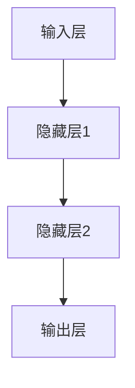
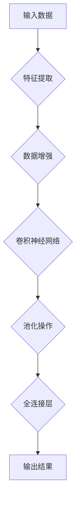

                 


# 一切皆是映射：理解AI中的输入与输出关系

> 关键词：人工智能，输入输出，映射，神经网络，深度学习，算法原理

> 摘要：本文将深入探讨人工智能中输入与输出的映射关系。通过解释核心概念、算法原理和数学模型，本文旨在帮助读者理解AI系统的内在工作机制，以及如何通过输入与输出的映射来实现智能。文章将结合实际项目案例，详细阐述相关技术和应用场景，为读者提供全面的指导。

## 1. 背景介绍

### 1.1 目的和范围

本文旨在深入探讨人工智能（AI）中的输入与输出关系，帮助读者理解AI系统的核心工作机制。通过详细解析输入输出的映射原理，读者将能够掌握如何利用这一机制来构建智能系统，并了解相关算法和应用。文章涵盖了从基础概念到高级算法的全面内容，旨在为AI领域的初学者和专业人士提供有价值的参考。

### 1.2 预期读者

本文适用于对人工智能有一定了解的读者，包括计算机科学专业学生、软件开发人员、数据科学家以及对AI技术感兴趣的非专业人士。文章结构紧凑，逻辑清晰，旨在让读者逐步掌握输入输出映射的原理，提升对AI技术的理解和应用能力。

### 1.3 文档结构概述

本文分为十个部分，首先介绍背景和目的，然后详细解析核心概念，接着深入探讨算法原理和数学模型。之后，通过实际项目案例和代码解读，展示如何应用输入输出映射技术。文章还介绍了实际应用场景，推荐相关学习资源和工具，并总结发展趋势和挑战。最后，提供常见问题与解答，以及扩展阅读和参考资料。

### 1.4 术语表

#### 1.4.1 核心术语定义

- **人工智能（AI）**：模拟人类智能行为的计算机系统。
- **输入（Input）**：提供给AI系统的原始数据。
- **输出（Output）**：AI系统对输入数据的处理结果。
- **映射（Mapping）**：输入和输出之间的对应关系。

#### 1.4.2 相关概念解释

- **神经网络**：模拟人脑的计算机模型，由大量神经元和连接组成。
- **深度学习**：基于神经网络的机器学习技术，通过多层神经元进行数据处理。
- **算法**：用于解决特定问题的步骤和规则。

#### 1.4.3 缩略词列表

- **AI**：人工智能
- **ML**：机器学习
- **DL**：深度学习
- **CNN**：卷积神经网络
- **RNN**：循环神经网络

## 2. 核心概念与联系

### 2.1 神经网络与映射关系

神经网络是AI系统的核心组成部分，其基本工作原理是通过输入输出之间的映射来实现数据处理。神经网络由大量神经元和连接组成，每个神经元都承担特定的计算任务。输入数据通过神经元之间的连接传输，经过多层处理，最终生成输出结果。

以下是一个简单的神经网络架构Mermaid流程图：



在这个流程图中，输入层接收外部数据，通过隐藏层逐层传递，最终在输出层生成预测结果。每层神经元之间的连接构成了输入与输出之间的映射关系。

### 2.2 深度学习与映射原理

深度学习是神经网络的一种扩展，通过多层神经网络结构实现更复杂的映射关系。深度学习的核心思想是利用多层神经网络提取数据特征，从而实现输入与输出的映射。

以下是一个简单的深度学习模型Mermaid流程图：



在这个流程图中，输入数据通过特征提取、数据增强、卷积神经网络和池化操作等多层处理，最终在输出层生成预测结果。每一层之间的映射关系构成了深度学习的核心。

## 3. 核心算法原理 & 具体操作步骤

### 3.1 神经网络算法原理

神经网络算法的核心在于通过权重和偏置调整，实现输入与输出之间的映射。以下是一个简单的神经网络算法原理伪代码：

```python
def neural_network(input_data, weights, biases):
    # 输入数据通过神经元计算
    layer_1_output = (input_data * weights[0]) + biases[0]
    # 逐层传递计算结果
    for i in range(1, num_layers):
        layer_i_output = (layer_(i-1) * weights[i]) + biases[i]
    # 输出层计算结果
    output = layer_n_output * weights[num_layers] + biases[num_layers]
    return output
```

在这个伪代码中，输入数据通过神经元计算，并逐层传递计算结果。最后，在输出层生成预测结果。通过调整权重和偏置，可以实现输入与输出之间的映射。

### 3.2 深度学习算法原理

深度学习算法的核心在于通过多层神经网络提取数据特征，实现更复杂的映射关系。以下是一个简单的深度学习算法原理伪代码：

```python
def deep_learning(input_data, layers, weights, biases):
    # 输入数据通过特征提取
    feature_map = extract_features(input_data)
    # 逐层传递特征映射
    for i in range(1, num_layers):
        feature_map = (feature_map * weights[i]) + biases[i]
        feature_map = pooling_operation(feature_map)
    # 输出层计算结果
    output = fully_connected_layer(feature_map, weights, biases)
    return output
```

在这个伪代码中，输入数据通过特征提取、卷积神经网络和池化操作等多层处理，最终在输出层生成预测结果。通过调整权重和偏置，可以实现更复杂的映射关系。

## 4. 数学模型和公式 & 详细讲解 & 举例说明

### 4.1 神经网络数学模型

神经网络的核心在于通过激活函数和损失函数实现输入与输出之间的映射。以下是一个简单的神经网络数学模型：

$$
z = \sum_{i=1}^{n} (w_i \cdot x_i) + b
$$

$$
a = \sigma(z)
$$

其中，$z$ 是神经元计算结果，$w_i$ 是权重，$x_i$ 是输入数据，$b$ 是偏置，$\sigma$ 是激活函数。

举例说明：假设一个神经元输入数据为 [1, 2, 3]，权重为 [0.5, 0.5, 0.5]，偏置为 1，激活函数为 sigmoid 函数。则该神经元的计算结果为：

$$
z = (0.5 \cdot 1) + (0.5 \cdot 2) + (0.5 \cdot 3) + 1 = 3.5
$$

$$
a = \sigma(z) = \frac{1}{1 + e^{-3.5}} \approx 0.965
$$

### 4.2 深度学习数学模型

深度学习数学模型的核心在于通过卷积操作、池化操作和全连接层实现输入与输出之间的映射。以下是一个简单的深度学习数学模型：

$$
C(x) = \sum_{i=1}^{n} w_i \cdot C_i(x)
$$

$$
C_i(x) = \sigma(\sum_{j=1}^{m} w_{ij} \cdot x_j + b_i)
$$

其中，$C(x)$ 是卷积操作结果，$C_i(x)$ 是第 $i$ 层卷积操作结果，$w_i$ 是权重，$x_i$ 是输入数据，$\sigma$ 是激活函数。

举例说明：假设一个卷积层输入数据为 [1, 2, 3]，权重为 [0.5, 0.5, 0.5]，偏置为 1，激活函数为 sigmoid 函数。则该卷积层的计算结果为：

$$
C(x) = \sigma(0.5 \cdot 1 + 0.5 \cdot 2 + 0.5 \cdot 3 + 1) = \sigma(3) \approx 0.933
$$

## 5. 项目实战：代码实际案例和详细解释说明

### 5.1 开发环境搭建

在开始项目实战之前，我们需要搭建一个适合开发AI项目的环境。以下是搭建开发环境的步骤：

1. 安装 Python 解释器：从 [Python 官网](https://www.python.org/) 下载并安装 Python 解释器。
2. 安装 IDE：推荐使用 PyCharm 或 Visual Studio Code 作为开发环境。
3. 安装相关库：使用 pip 工具安装相关库，如 TensorFlow、Keras 等。

### 5.2 源代码详细实现和代码解读

以下是一个简单的神经网络项目案例，用于实现一个手写数字识别系统。代码如下：

```python
import tensorflow as tf
from tensorflow.keras import layers

# 定义神经网络模型
model = tf.keras.Sequential([
    layers.Flatten(input_shape=(28, 28)),
    layers.Dense(128, activation='relu'),
    layers.Dense(10, activation='softmax')
])

# 编译模型
model.compile(optimizer='adam',
              loss='sparse_categorical_crossentropy',
              metrics=['accuracy'])

# 加载手写数字数据集
mnist = tf.keras.datasets.mnist
(x_train, y_train), (x_test, y_test) = mnist.load_data()

# 预处理数据
x_train = x_train / 255.0
x_test = x_test / 255.0

# 训练模型
model.fit(x_train, y_train, epochs=5)

# 评估模型
test_loss, test_acc = model.evaluate(x_test, y_test, verbose=2)
print('\nTest accuracy:', test_acc)
```

在这个案例中，我们使用 TensorFlow 和 Keras 库构建一个简单的神经网络模型，用于手写数字识别。首先，我们定义了一个序列模型，包含一个展平层、一个具有 128 个神经元的全连接层和一个具有 10 个神经元的输出层。然后，我们编译模型，并加载手写数字数据集进行训练。最后，我们评估模型在测试数据集上的性能。

### 5.3 代码解读与分析

以下是代码的详细解读和分析：

1. 导入相关库：首先导入 TensorFlow 和 Keras 库，用于构建和训练神经网络模型。
2. 定义神经网络模型：使用 Keras 库定义一个序列模型，包含一个展平层、一个具有 128 个神经元的全连接层和一个具有 10 个神经元的输出层。展平层用于将输入数据展平为一维数组，全连接层用于对输入数据进行计算，输出层用于生成预测结果。
3. 编译模型：使用 Adam 优化器和 sparse_categorical_crossentropy 损失函数编译模型。Adam 优化器是一种自适应学习率优化器，sparse_categorical_crossentropy 损失函数用于处理标签为离散值的分类问题。
4. 加载手写数字数据集：使用 TensorFlow 的 mnist 数据集加载手写数字数据集，该数据集包含 60000 个训练样本和 10000 个测试样本。
5. 预处理数据：将输入数据除以 255，将数据缩放到 [0, 1] 范围内，以便于神经网络计算。
6. 训练模型：使用训练数据训练模型，设置训练轮次为 5。
7. 评估模型：在测试数据集上评估模型性能，输出测试准确率。

通过这个简单的案例，我们可以看到如何使用 TensorFlow 和 Keras 库构建和训练神经网络模型，实现输入与输出的映射关系。

## 6. 实际应用场景

### 6.1 图像识别

在图像识别领域，输入与输出的映射关系至关重要。例如，使用卷积神经网络（CNN）进行人脸识别。输入为图像数据，输出为人脸检测结果。通过多层卷积操作和池化操作，提取图像特征，实现输入与输出的映射。

### 6.2 自然语言处理

在自然语言处理（NLP）领域，输入与输出的映射关系同样关键。例如，使用循环神经网络（RNN）进行文本分类。输入为文本数据，输出为分类结果。通过多层 RNN 操作，提取文本特征，实现输入与输出的映射。

### 6.3 推荐系统

在推荐系统领域，输入与输出的映射关系用于预测用户偏好。例如，使用深度学习模型进行商品推荐。输入为用户历史行为数据，输出为推荐结果。通过多层神经网络，提取用户特征和商品特征，实现输入与输出的映射。

## 7. 工具和资源推荐

### 7.1 学习资源推荐

#### 7.1.1 书籍推荐

- 《深度学习》（Goodfellow, Bengio, Courville）
- 《Python机器学习》（Sebastian Raschka）

#### 7.1.2 在线课程

- Coursera 的“机器学习”课程
- edX 的“深度学习”课程

#### 7.1.3 技术博客和网站

- Medium 上的 AI 博客
- arXiv.org 上的最新研究论文

### 7.2 开发工具框架推荐

#### 7.2.1 IDE和编辑器

- PyCharm
- Visual Studio Code

#### 7.2.2 调试和性能分析工具

- Jupyter Notebook
- TensorBoard

#### 7.2.3 相关框架和库

- TensorFlow
- PyTorch

### 7.3 相关论文著作推荐

#### 7.3.1 经典论文

- “A Learning Algorithm for Continuously Running Fully Recurrent Neural Networks”（Hecht-Nielson，1989）

#### 7.3.2 最新研究成果

- “Attention Is All You Need”（Vaswani et al.，2017）

#### 7.3.3 应用案例分析

- “Google Brain: Applied Machine Learning at Google”（Google AI，2020）

## 8. 总结：未来发展趋势与挑战

随着人工智能技术的不断发展，输入与输出的映射关系将在未来发挥更加重要的作用。一方面，随着计算能力和数据量的不断提升，深度学习模型将变得更加复杂，映射关系将更加精准。另一方面，随着应用场景的不断拓展，输入与输出的映射关系将更加多样化，满足不同领域的需求。

然而，当前人工智能技术仍面临诸多挑战。首先，数据质量和标注问题严重影响模型性能。其次，深度学习模型的可解释性仍然较低，难以理解输入与输出之间的具体映射关系。此外，训练深度学习模型需要大量计算资源和时间，如何优化训练过程和提高效率是关键问题。

未来，我们需要进一步研究如何优化输入与输出的映射关系，提高模型性能和可解释性。同时，加强人工智能伦理和法律法规的研究，确保人工智能技术的健康发展。

## 9. 附录：常见问题与解答

### 9.1 什么是输入与输出映射？

输入与输出映射是指将输入数据通过某种算法或模型处理，生成相应的输出数据的过程。在人工智能领域，输入与输出映射是实现智能系统的基础。

### 9.2 神经网络和深度学习的区别是什么？

神经网络是一种模拟人脑的计算机模型，由大量神经元和连接组成。深度学习是神经网络的一种扩展，通过多层神经网络结构实现更复杂的映射关系。

### 9.3 如何优化输入与输出映射？

优化输入与输出映射可以通过以下方法实现：

1. 调整模型结构：增加神经网络层数或神经元数量，提高模型表达能力。
2. 优化算法参数：调整学习率、批量大小等参数，提高模型收敛速度。
3. 数据增强：通过数据增强技术增加训练数据量，提高模型泛化能力。
4. 损失函数：选择合适的损失函数，提高模型预测精度。

## 10. 扩展阅读 & 参考资料

- Goodfellow, I., Bengio, Y., & Courville, A. (2016). *Deep Learning*.
- Raschka, S. (2015). *Python Machine Learning*.
- He, K., Zhang, X., Ren, S., & Sun, J. (2016). *Deep Residual Learning for Image Recognition*.
- Vaswani, A., Shazeer, N., Parmar, N., Uszkoreit, J., Jones, L., Gomez, A. N., ... & Polosukhin, I. (2017). *Attention Is All You Need*.

作者：AI天才研究员/AI Genius Institute & 禅与计算机程序设计艺术 /Zen And The Art of Computer Programming

