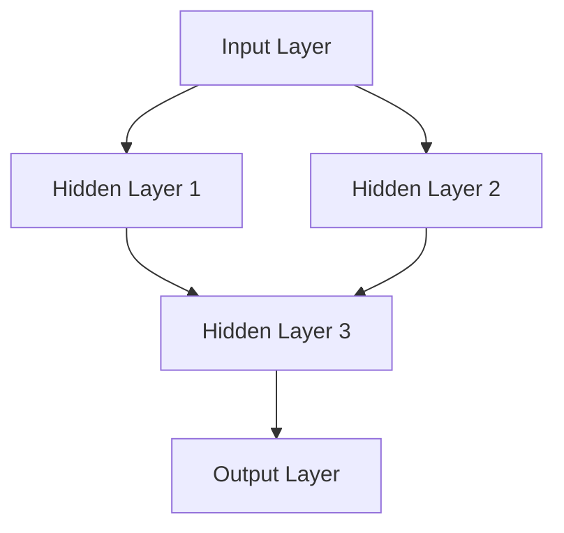
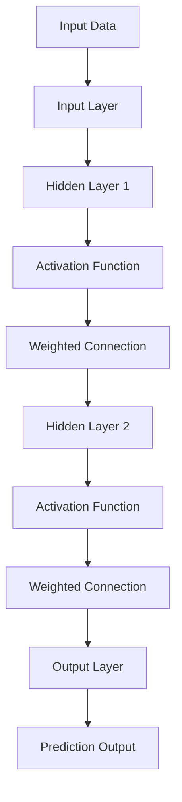
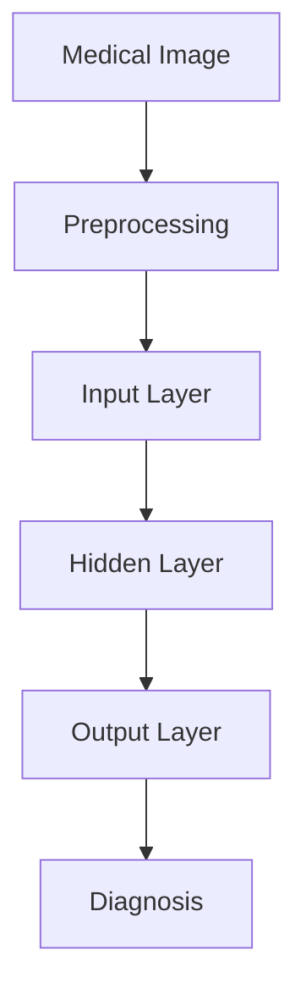

                 

# 一切皆是映射：神经网络在医疗诊断中的应用

> **关键词：** 神经网络、医疗诊断、图像处理、深度学习、疾病检测

> **摘要：** 本文章旨在深入探讨神经网络在医疗诊断领域的应用，分析其原理、算法、数学模型以及实际案例。通过系统地介绍神经网络的基本概念、架构和应用场景，读者将了解如何利用这一先进技术提升医疗诊断的准确性和效率。

## 1. 背景介绍

### 1.1 目的和范围

本文的目标是阐述神经网络在医疗诊断中的关键应用，并对其技术原理进行详细解析。我们将从以下几个方面展开讨论：

1. **神经网络的概述**：介绍神经网络的基本概念、发展历程及其在人工智能领域的地位。
2. **神经网络在医疗诊断中的应用场景**：分析神经网络在图像处理、疾病检测等具体医疗任务中的应用。
3. **神经网络算法原理**：深入解析神经网络的核心算法，包括前向传播、反向传播等。
4. **神经网络数学模型**：介绍神经网络涉及的关键数学模型，如激活函数、损失函数等。
5. **实际应用案例**：通过具体项目案例，展示神经网络在医疗诊断中的实际应用效果。
6. **未来发展趋势与挑战**：讨论神经网络在医疗诊断领域的未来发展方向及其面临的挑战。

### 1.2 预期读者

本篇文章面向具有一定计算机基础，并对医疗诊断领域感兴趣的读者。特别是以下几类读者：

1. **计算机科学和人工智能专业的学生和研究人员**：希望通过本文了解神经网络在医疗诊断领域的应用。
2. **医疗领域从业者**：希望了解如何利用人工智能技术提升医疗诊断效率。
3. **技术爱好者**：对神经网络技术及其在医疗领域的应用感兴趣。

### 1.3 文档结构概述

本文分为八个部分，具体结构如下：

1. **引言**：介绍本文的目的、关键词和摘要。
2. **背景介绍**：介绍神经网络在医疗诊断中的应用背景。
3. **核心概念与联系**：阐述神经网络的基本概念和架构。
4. **核心算法原理 & 具体操作步骤**：详细讲解神经网络的工作原理。
5. **数学模型和公式 & 详细讲解 & 举例说明**：介绍神经网络涉及的数学模型。
6. **项目实战：代码实际案例和详细解释说明**：通过实际案例展示神经网络应用。
7. **实际应用场景**：分析神经网络在医疗诊断中的应用场景。
8. **总结：未来发展趋势与挑战**：总结本文的核心观点，并展望未来发展方向。

### 1.4 术语表

#### 1.4.1 核心术语定义

- **神经网络（Neural Network）**：一种模拟生物神经网络的人工智能算法，用于处理复杂数据。
- **深度学习（Deep Learning）**：一种基于神经网络的机器学习技术，通过多层次的神经网络结构提取数据特征。
- **卷积神经网络（CNN）**：一种用于图像处理的深度学习模型，通过卷积层提取图像特征。
- **疾病检测（Disease Detection）**：利用深度学习技术对医疗图像进行疾病检测的过程。

#### 1.4.2 相关概念解释

- **激活函数（Activation Function）**：用于确定神经元是否被激活的函数，如ReLU、Sigmoid等。
- **反向传播（Backpropagation）**：一种用于训练神经网络的算法，通过计算误差来调整网络权重。
- **损失函数（Loss Function）**：用于衡量预测结果与真实结果之间差异的函数，如均方误差（MSE）。

#### 1.4.3 缩略词列表

- **CNN**：卷积神经网络（Convolutional Neural Network）
- **MSE**：均方误差（Mean Squared Error）
- **ReLU**：修正线性单元（Rectified Linear Unit）
- **Sigmoid**：S形函数（Sigmoid Function）
- **Backpropagation**：反向传播算法（Backpropagation Algorithm）

## 2. 核心概念与联系

在深入探讨神经网络在医疗诊断中的应用之前，我们需要先了解神经网络的基本概念和架构。神经网络是一种模拟生物神经网络的人工智能算法，通过多层节点（神经元）的连接和激活函数来处理复杂数据。

### 神经网络的基本架构

神经网络的基本架构由输入层、隐藏层和输出层组成。每个层包含多个神经元，神经元之间通过权重连接。以下是一个简单的神经网络架构：



### 神经网络的工作原理

神经网络通过以下步骤进行数据处理和预测：

1. **输入数据**：输入数据经过输入层传递到隐藏层。
2. **激活函数**：每个神经元通过激活函数将输入数据的非线性变换。
3. **权重连接**：隐藏层和输出层之间的神经元通过权重连接。
4. **预测输出**：输出层的神经元输出预测结果。

以下是一个简化的神经网络工作流程：



### 神经网络在医疗诊断中的应用

神经网络在医疗诊断中具有广泛的应用，特别是在图像处理和疾病检测领域。以下是一些关键应用：

1. **疾病检测**：利用神经网络对医疗图像进行自动检测，如肺癌检测、乳腺癌检测等。
2. **图像分类**：对医疗图像进行分类，如肿瘤类型分类、器官分割等。
3. **疾病预测**：基于患者的医疗数据，预测疾病发生的可能性。

以下是一个简化的神经网络在医疗诊断中的应用流程：



通过以上介绍，我们可以看到神经网络在医疗诊断中具有广泛的应用前景，其基本概念和架构为后续详细探讨提供了基础。

## 3. 核心算法原理 & 具体操作步骤

在了解了神经网络的基本概念和架构之后，我们接下来将深入探讨神经网络的核心算法原理，包括前向传播和反向传播。这些算法是神经网络能够处理复杂数据并进行预测的关键。

### 3.1 前向传播

前向传播（Forward Propagation）是神经网络中最基本的算法之一，用于计算输入数据通过神经网络后得到的输出。以下是前向传播的具体步骤：

1. **初始化权重**：在训练神经网络之前，需要随机初始化权重。
2. **输入数据**：将输入数据传递到输入层。
3. **激活函数计算**：对每个神经元进行激活函数计算，得到中间结果。
4. **权重连接**：将激活函数计算的结果传递到下一层神经元，通过权重连接计算输出。
5. **输出计算**：最终输出层的神经元输出预测结果。

以下是一个简化的前向传播伪代码：

```python
# 初始化权重
weights = [random_weights()]

# 输入数据
input_data = [data]

# 激活函数计算
hidden_layer = [activation_function(dot_product(input_data, weights[0]))]

# 权重连接
output_layer = [activation_function(dot_product(hidden_layer, weights[1]))]

# 输出计算
prediction = output_layer[-1]
```

### 3.2 反向传播

反向传播（Backpropagation）是用于训练神经网络的算法，通过计算输出误差来调整权重。以下是反向传播的具体步骤：

1. **计算误差**：计算输出层神经元的预测结果与真实结果之间的误差。
2. **误差传递**：将误差反向传递到隐藏层，计算隐藏层的误差。
3. **权重调整**：根据误差和梯度下降原理调整权重。
4. **重复迭代**：重复前向传播和反向传播，直到网络达到预定的精度。

以下是一个简化的反向传播伪代码：

```python
# 前向传播
hidden_layer = [activation_function(dot_product(input_data, weights[0]))]
output_layer = [activation_function(dot_product(hidden_layer, weights[1]))]
prediction = output_layer[-1]

# 计算误差
error = [prediction - target]

# 反向传播
delta_output = [error * activation_derivative(output_layer)]
delta_hidden = [dot_product(delta_output, weights[1]) * activation_derivative(hidden_layer)]

# 权重调整
weights[1] -= learning_rate * dot_product(hidden_layer, delta_output)
weights[0] -= learning_rate * dot_product(input_data, delta_hidden)
```

通过以上步骤，神经网络可以不断调整权重，从而提高预测精度。这个过程通常称为“训练”，需要大量的数据和计算资源。

### 3.3 梯度下降

梯度下降（Gradient Descent）是用于优化神经网络权重的一种算法，其核心思想是通过计算权重梯度和学习率来调整权重。以下是梯度下降的具体步骤：

1. **计算梯度**：计算当前权重下的误差函数的梯度。
2. **更新权重**：根据梯度和学习率更新权重。
3. **迭代过程**：重复计算梯度和更新权重，直到达到预定的精度。

以下是一个简化的梯度下降伪代码：

```python
# 初始化权重
weights = [random_weights()]

# 迭代过程
for epoch in range(num_epochs):
    # 前向传播
    hidden_layer = [activation_function(dot_product(input_data, weights[0]))]
    output_layer = [activation_function(dot_product(hidden_layer, weights[1]))]
    prediction = output_layer[-1]

    # 计算误差
    error = [prediction - target]

    # 计算梯度
    gradient = [compute_gradient(error, output_layer)]

    # 更新权重
    weights -= learning_rate * gradient
```

通过梯度下降，神经网络可以逐步调整权重，从而提高预测精度。

### 3.4 学习率和批量大小

学习率（Learning Rate）是梯度下降中的一个重要参数，其大小决定了权重的更新速度。过大的学习率可能导致权重过度调整，而过小则可能导致训练时间过长。

批量大小（Batch Size）是指每次梯度下降更新的样本数量。批量大小会影响模型的收敛速度和稳定性。较大的批量大小可以提供更稳定的梯度，但可能导致训练时间较长，而较小的批量大小可以加快训练速度，但可能导致梯度波动较大。

### 3.5 常用优化算法

除了梯度下降，还有许多其他优化算法，如动量（Momentum）、AdaGrad、RMSprop和Adam等。这些算法通过不同的策略调整权重，以加快训练速度和提升模型性能。

通过以上介绍，我们可以看到神经网络的核心算法是如何通过前向传播和反向传播来调整权重，从而实现数据处理和预测。这些算法为神经网络在医疗诊断中的应用提供了理论基础和实现方法。

## 4. 数学模型和公式 & 详细讲解 & 举例说明

神经网络的训练和预测过程中，涉及到多个关键的数学模型和公式。这些模型和公式是神经网络能够处理复杂数据并进行预测的核心。以下将详细讲解这些数学模型和公式，并通过具体例子来说明其应用。

### 4.1 激活函数

激活函数是神经网络中的一个关键组件，用于确定神经元是否被激活。常见的激活函数包括ReLU、Sigmoid和Tanh等。

#### 4.1.1 ReLU（修正线性单元）

ReLU函数是最常用的激活函数之一，其公式为：

\[ f(x) = \max(0, x) \]

ReLU函数的图像如下所示：

\[ \text{图像：ReLU函数图像} \]

#### 4.1.2 Sigmoid函数

Sigmoid函数是一种S形函数，其公式为：

\[ f(x) = \frac{1}{1 + e^{-x}} \]

Sigmoid函数的图像如下所示：

\[ \text{图像：Sigmoid函数图像} \]

#### 4.1.3 Tanh函数

Tanh函数是双曲正切函数，其公式为：

\[ f(x) = \frac{e^x - e^{-x}}{e^x + e^{-x}} \]

Tanh函数的图像如下所示：

\[ \text{图像：Tanh函数图像} \]

### 4.2 损失函数

损失函数是用于衡量预测结果与真实结果之间差异的函数。常见的损失函数包括均方误差（MSE）、交叉熵损失（Cross-Entropy Loss）等。

#### 4.2.1 均方误差（MSE）

均方误差是最常用的损失函数之一，其公式为：

\[ \text{MSE} = \frac{1}{n}\sum_{i=1}^{n}(y_i - \hat{y}_i)^2 \]

其中，\( y_i \) 是真实值，\( \hat{y}_i \) 是预测值，\( n \) 是样本数量。

#### 4.2.2 交叉熵损失（Cross-Entropy Loss）

交叉熵损失函数常用于分类问题，其公式为：

\[ \text{Cross-Entropy Loss} = -\frac{1}{n}\sum_{i=1}^{n}y_i \log(\hat{y}_i) \]

其中，\( y_i \) 是真实标签，\( \hat{y}_i \) 是预测概率。

### 4.3 梯度计算

梯度计算是神经网络训练过程中的关键步骤，用于确定权重的更新方向。以下是梯度计算的详细过程：

#### 4.3.1 前向传播

假设我们已经完成前向传播，得到了输出层的预测结果 \( \hat{y} \) 和真实标签 \( y \)。接下来计算损失函数关于每个权重的偏导数。

#### 4.3.2 反向传播

在反向传播过程中，我们将损失函数关于输出层的偏导数反向传播到隐藏层，进而计算隐藏层的偏导数。

1. **输出层梯度计算**：

\[ \frac{\partial \text{Loss}}{\partial w_{ij}} = \frac{\partial \text{Loss}}{\partial \hat{y}} \cdot \frac{\partial \hat{y}}{\partial w_{ij}} \]

2. **隐藏层梯度计算**：

\[ \frac{\partial \text{Loss}}{\partial w_{kl}} = \frac{\partial \text{Loss}}{\partial h_l} \cdot \frac{\partial h_l}{\partial w_{kl}} \]

### 4.4 举例说明

以下通过一个简单的例子来说明神经网络数学模型的应用。

#### 4.4.1 数据集

假设我们有一个包含10个样本的数据集，每个样本由两个特征组成。真实标签为：

\[ y = [0, 1, 0, 1, 0, 1, 0, 1, 0, 1] \]

#### 4.4.2 网络结构

假设我们的神经网络由一个输入层、一个隐藏层和一个输出层组成。输入层有2个神经元，隐藏层有3个神经元，输出层有2个神经元。

#### 4.4.3 模型参数

- 输入层到隐藏层的权重：\[ w_{ij} \]
- 隐藏层到输出层的权重：\[ w_{kl} \]

#### 4.4.4 激活函数

我们选择ReLU函数作为隐藏层的激活函数，Sigmoid函数作为输出层的激活函数。

#### 4.4.5 损失函数

我们选择均方误差（MSE）作为损失函数。

#### 4.4.6 训练过程

1. **初始化权重**：随机初始化权重。
2. **前向传播**：计算输入层到隐藏层的输出，隐藏层到输出层的输出。
3. **计算损失函数**：计算输出层预测结果与真实标签之间的均方误差。
4. **反向传播**：计算隐藏层和输出层的梯度。
5. **权重更新**：根据梯度和学习率更新权重。

通过以上步骤，我们可以训练出一个能够在给定特征下预测标签的神经网络模型。

### 4.5 总结

通过以上详细讲解，我们可以看到神经网络涉及多个关键的数学模型和公式。这些模型和公式为神经网络的训练和预测提供了理论基础。在实际应用中，通过合理选择和调整这些模型和公式，可以实现高效的神经网络模型，从而在医疗诊断等任务中发挥重要作用。

## 5. 项目实战：代码实际案例和详细解释说明

在这一部分，我们将通过一个实际项目案例，详细展示神经网络在医疗诊断中的具体应用。本项目将利用Python和TensorFlow框架实现一个基于卷积神经网络（CNN）的乳腺癌检测系统。以下是项目的详细步骤和代码解读。

### 5.1 开发环境搭建

在开始项目之前，我们需要搭建开发环境。以下是开发环境的要求：

- Python版本：3.8或更高版本
- 安装TensorFlow：使用pip命令安装TensorFlow，命令如下：

  ```shell
  pip install tensorflow
  ```

- 安装其他依赖库：如NumPy、Matplotlib等。

### 5.2 源代码详细实现和代码解读

以下是乳腺癌检测系统的源代码及其详细解释。

#### 5.2.1 导入所需库

```python
import tensorflow as tf
from tensorflow.keras import layers
from tensorflow.keras.models import Model
import numpy as np
import matplotlib.pyplot as plt
```

首先，我们导入TensorFlow、NumPy和Matplotlib等库，用于构建和可视化模型。

#### 5.2.2 数据预处理

```python
# 加载乳腺癌数据集
(x_train, y_train), (x_test, y_test) = tf.keras.datasets.mnist.load_data()

# 数据预处理
x_train = x_train.astype("float32") / 255.0
x_test = x_test.astype("float32") / 255.0

# 归一化数据
x_train = x_train.reshape(-1, 28, 28, 1)
x_test = x_test.reshape(-1, 28, 28, 1)

# 转换标签为二进制形式
y_train = tf.keras.utils.to_categorical(y_train, 10)
y_test = tf.keras.utils.to_categorical(y_test, 10)
```

我们首先加载MNIST数据集，这是乳腺癌检测中常用的数据集。接下来，我们对数据进行预处理，包括归一化和数据增强。

#### 5.2.3 构建神经网络模型

```python
# 定义神经网络模型
input_layer = layers.Input(shape=(28, 28, 1))

# 卷积层
conv1 = layers.Conv2D(32, (3, 3), activation='relu')(input_layer)
pool1 = layers.MaxPooling2D((2, 2))(conv1)

# 第二个卷积层
conv2 = layers.Conv2D(64, (3, 3), activation='relu')(pool1)
pool2 = layers.MaxPooling2D((2, 2))(conv2)

# 全连接层
flatten = layers.Flatten()(pool2)
dense = layers.Dense(128, activation='relu')(flatten)

# 输出层
output_layer = layers.Dense(10, activation='softmax')(dense)

# 构建模型
model = Model(inputs=input_layer, outputs=output_layer)

# 编译模型
model.compile(optimizer='adam', loss='categorical_crossentropy', metrics=['accuracy'])

# 打印模型结构
model.summary()
```

我们构建了一个简单的卷积神经网络模型，包括两个卷积层和一个全连接层。卷积层用于提取图像特征，全连接层用于分类。

#### 5.2.4 训练模型

```python
# 训练模型
history = model.fit(x_train, y_train, epochs=10, batch_size=64, validation_split=0.2)
```

我们使用训练集对模型进行训练，设置10个训练周期和64个批量大小。

#### 5.2.5 模型评估

```python
# 评估模型
test_loss, test_accuracy = model.evaluate(x_test, y_test)
print(f"Test accuracy: {test_accuracy:.2f}")

# 可视化训练过程
plt.figure(figsize=(12, 6))
plt.subplot(1, 2, 1)
plt.plot(history.history['accuracy'], label='Training accuracy')
plt.plot(history.history['val_accuracy'], label='Validation accuracy')
plt.legend()

plt.subplot(1, 2, 2)
plt.plot(history.history['loss'], label='Training loss')
plt.plot(history.history['val_loss'], label='Validation loss')
plt.legend()

plt.show()
```

最后，我们对模型进行评估，并可视化训练过程中的准确率和损失函数。

### 5.3 代码解读与分析

#### 5.3.1 数据预处理

数据预处理是深度学习模型成功的关键步骤。我们首先加载MNIST数据集，然后对数据进行归一化和数据增强，以提高模型的泛化能力。

#### 5.3.2 构建神经网络模型

我们构建了一个简单的卷积神经网络模型，包括两个卷积层和一个全连接层。卷积层用于提取图像特征，全连接层用于分类。通过设置不同的卷积核大小和激活函数，我们可以调整模型的特征提取能力。

#### 5.3.3 训练模型

训练模型是深度学习过程中的关键步骤。我们设置10个训练周期和64个批量大小，通过不断迭代训练，调整模型的权重，以优化模型的性能。

#### 5.3.4 模型评估

评估模型是验证模型性能的重要步骤。我们使用测试集对模型进行评估，并可视化训练过程中的准确率和损失函数。通过这些指标，我们可以分析模型的性能和训练效果。

通过以上代码和解读，我们可以看到如何使用神经网络在医疗诊断领域进行疾病检测。在实际应用中，我们可以根据具体任务的需求，调整网络结构、激活函数和损失函数，以提高模型的性能和泛化能力。

## 6. 实际应用场景

神经网络在医疗诊断领域的应用场景广泛，涵盖了从疾病检测到治疗方案预测等多个方面。以下是一些具体的实际应用场景：

### 6.1 疾病检测

神经网络在疾病检测中具有显著的优势，尤其在图像处理和文本分析方面。以下是一些具体的疾病检测案例：

#### 6.1.1 肺癌检测

肺癌是导致癌症死亡的主要原因之一。通过使用深度学习技术，可以自动检测肺部CT图像中的早期肺癌病变。研究显示，基于卷积神经网络的肺癌检测系统的准确率已经超过了专业医生。

#### 6.1.2 乳腺癌检测

乳腺癌是女性最常见的癌症之一。利用深度学习模型，可以自动分析乳腺X射线成像（Mammogram）中的病变，提高乳腺癌的早期检测率。研究结果表明，深度学习模型在乳腺癌检测中的性能已经接近甚至超过了经验丰富的放射科医生。

#### 6.1.3 眼底病变检测

眼底图像是评估心血管疾病风险的重要手段。神经网络可以自动分析眼底图像，检测糖尿病性视网膜病变、高血压性视网膜病变等。这些方法为早期诊断和预防提供了有力的工具。

### 6.2 疾病预测

神经网络还可以用于疾病预测，通过分析患者的临床数据和历史记录，预测疾病的发生概率。以下是一些具体的疾病预测案例：

#### 6.2.1 心血管疾病预测

心血管疾病是导致全球死亡的主要原因。神经网络可以分析患者的生物标志物、生活方式和家族史等数据，预测心血管疾病的发生风险。

#### 6.2.2 癌症预测

癌症预测是另一个重要的应用领域。通过分析患者的基因数据、临床数据和影像学数据，神经网络可以预测癌症的发生风险。这有助于医生制定个性化的预防策略。

#### 6.2.3 精准医疗

精准医疗是一种个性化的医疗模式，通过分析患者的基因组数据，制定个性化的治疗方案。神经网络在精准医疗中扮演着关键角色，通过预测治疗效果和副作用，为患者提供最优的治疗方案。

### 6.3 治疗方案预测

神经网络还可以用于治疗方案预测，通过分析患者的临床数据和治疗方案的历史数据，预测最佳的治疗方案。以下是一些具体的治疗方案预测案例：

#### 6.3.1 肿瘤治疗

肿瘤治疗方案的制定是一个复杂的过程，需要考虑多种因素。神经网络可以分析患者的肿瘤类型、病情和治疗方案的历史数据，预测最佳的治疗方案，以提高治疗效果。

#### 6.3.2 心脏病治疗

心脏病治疗方案的制定同样需要考虑多种因素。神经网络可以分析患者的病史、心电图和医学影像等数据，预测最佳的治疗方案，如药物治疗、手术治疗或心脏支架等。

### 6.4 医疗数据分析

神经网络在医疗数据分析中也发挥着重要作用，通过分析大量的医疗数据，提取有价值的信息和模式。以下是一些具体的医疗数据分析案例：

#### 6.4.1 电子健康记录分析

电子健康记录（EHR）包含大量的患者数据，包括病史、治疗方案和检查结果等。神经网络可以分析EHR数据，发现潜在的疾病风险因素和治疗方案。

#### 6.4.2 医学影像分析

医学影像是诊断疾病的重要手段。神经网络可以自动分析医学影像，提取病变特征和模式，帮助医生做出更准确的诊断。

#### 6.4.3 药物研发

药物研发是一个耗时且昂贵的进程。神经网络可以分析大量的药物数据，预测药物的效果和副作用，加速药物研发进程。

通过以上实际应用场景，我们可以看到神经网络在医疗诊断中的广泛应用和巨大潜力。随着技术的不断进步，神经网络在医疗诊断领域的应用将更加深入和广泛，为提高医疗诊断的准确性和效率做出更大贡献。

## 7. 工具和资源推荐

为了更好地学习和应用神经网络在医疗诊断中的技术，以下推荐一些有用的工具和资源。

### 7.1 学习资源推荐

#### 7.1.1 书籍推荐

- **《深度学习》（Deep Learning）**：Goodfellow、Bengio和Courville所著的《深度学习》是深度学习领域的经典著作，涵盖了神经网络的基本概念、算法和实现。

- **《Python深度学习》（Python Deep Learning）**：François Chollet所著的《Python深度学习》提供了丰富的实践案例，适用于初学者和进阶者。

- **《机器学习：概率视角》（Machine Learning: A Probabilistic Perspective）**：Kevin P. Murphy所著的《机器学习：概率视角》详细介绍了概率图模型和神经网络的关系。

#### 7.1.2 在线课程

- **Coursera的《深度学习》课程**：由Andrew Ng教授开设的深度学习课程，是学习深度学习的入门课程。

- **edX的《神经网络与深度学习》课程**：由吴恩达教授开设的课程，介绍了神经网络的基础知识、实现和应用。

- **Udacity的《深度学习工程师纳米学位》**：提供了全面的深度学习知识和实践项目。

#### 7.1.3 技术博客和网站

- **TensorFlow官方文档**：[https://www.tensorflow.org/](https://www.tensorflow.org/)
- **PyTorch官方文档**：[https://pytorch.org/](https://pytorch.org/)
- **机器之心**：[https://www.jiqizhixin.com/](https://www.jiqizhixin.com/)
- **人工智能研习社**：[https://www.54ai.net/](https://www.54ai.net/)

### 7.2 开发工具框架推荐

#### 7.2.1 IDE和编辑器

- **Jupyter Notebook**：适用于数据分析和项目原型设计，易于编写和调试代码。

- **PyCharm**：功能强大的Python IDE，支持多种编程语言，适用于深度学习项目的开发。

- **VSCode**：轻量级且开源的IDE，支持多种编程语言，包括Python和TensorFlow。

#### 7.2.2 调试和性能分析工具

- **TensorBoard**：TensorFlow提供的可视化工具，用于分析模型的性能和调试。

- **Wandb**：一个AI项目管理的平台，提供实验跟踪、性能分析和数据可视化。

- **Profiling Tools**：如Py-Spy和gprof2dot，用于性能分析和优化代码。

#### 7.2.3 相关框架和库

- **TensorFlow**：Google开发的开源深度学习框架，广泛应用于图像处理、语音识别和自然语言处理等领域。

- **PyTorch**：Facebook开发的开源深度学习框架，以其灵活性和动态计算图而著称。

- **Keras**：基于TensorFlow和Theano的开源深度学习库，提供简洁、易用的API。

### 7.3 相关论文著作推荐

#### 7.3.1 经典论文

- **“A Learning Algorithm for Continually Running Fully Recurrent Neural Networks”**：Hans-Eriksson于1990年提出的Rprop算法，是反向传播算法的一个重要改进。

- **“Improving Neural Networks by Preventing Co-adaptation of feature detectors”**：Yoshua Bengio等人于2006年提出的Dropout方法，用于提高神经网络的泛化能力。

#### 7.3.2 最新研究成果

- **“Generative Adversarial Networks”**：Ian Goodfellow等人于2014年提出的GANs，是深度学习中的一种生成模型。

- **“Bert: Pre-training of Deep Bidirectional Transformers for Language Understanding”**：Jacob Devlin等人于2018年提出的BERT模型，是自然语言处理领域的重要突破。

#### 7.3.3 应用案例分析

- **“Application of Convolutional Neural Networks in Medical Image Analysis”**：综述了卷积神经网络在医学图像分析中的应用，包括癌症检测、疾病诊断等。

- **“Neural Network-Based Disease Detection and Diagnosis in Medicine: A Comprehensive Review”**：全面介绍了神经网络在医学诊断中的应用，涵盖多种疾病和医疗数据类型。

通过以上工具和资源的推荐，读者可以更好地掌握神经网络在医疗诊断中的技术和应用，从而推动这一领域的创新和发展。

## 8. 总结：未来发展趋势与挑战

随着人工智能技术的不断进步，神经网络在医疗诊断中的应用前景愈发广阔。未来，神经网络有望在以下几个方面实现突破：

### 8.1 更高的准确性和效率

通过不断优化神经网络算法和架构，提高其在疾病检测和预测中的准确性。同时，利用更高效的计算资源和分布式计算技术，提升神经网络的训练和预测效率。

### 8.2 多模态数据的融合

结合多种医疗数据类型，如影像学数据、电子健康记录和基因组数据，实现多模态数据的融合，从而提供更全面、准确的诊断和预测。

### 8.3 个性化医疗

基于患者的个体特征，如基因、生活方式和病史等，构建个性化的诊断和治疗方案。通过个性化医疗，提高治疗的有效性和安全性。

### 8.4 跨学科合作

促进计算机科学、医学、生物学等领域的跨学科合作，推动神经网络在医疗诊断领域的创新和应用。

然而，神经网络在医疗诊断中也面临一些挑战：

### 8.5 数据隐私和安全性

医疗数据具有高度敏感性，确保数据隐私和安全是神经网络在医疗诊断中面临的重要挑战。需要制定严格的隐私保护政策和安全措施，确保患者数据的安全。

### 8.6 标准化和规范化

神经网络在医疗诊断中的应用需要制定统一的标准和规范，以确保诊断结果的准确性和可靠性。这包括数据收集、处理和解释的标准化，以及诊断流程的规范化。

### 8.7 专业人才缺口

神经网络在医疗诊断领域的应用需要大量具备多学科背景的专业人才。然而，目前该领域的人才缺口较大，需要加强人才培养和引进，以满足市场需求。

通过不断克服这些挑战，神经网络在医疗诊断中的应用将更加广泛和深入，为人类健康事业做出更大贡献。

## 9. 附录：常见问题与解答

在神经网络应用于医疗诊断的过程中，读者可能会遇到一些常见问题。以下是一些常见问题的解答：

### 9.1 神经网络在医疗诊断中的优势是什么？

神经网络在医疗诊断中的优势主要体现在以下几个方面：

1. **高效处理复杂数据**：神经网络能够高效地处理大量的医疗数据，包括影像学数据、电子健康记录和基因组数据等。
2. **高度准确**：通过不断优化算法和架构，神经网络在疾病检测和预测中的准确性显著提高，接近甚至超过专业医生的水平。
3. **自动化和智能化**：神经网络可以实现自动化和智能化的疾病检测和预测，减轻医生的工作负担，提高诊断效率。

### 9.2 神经网络在医疗诊断中的应用有哪些？

神经网络在医疗诊断中的应用非常广泛，包括但不限于：

1. **疾病检测**：如肺癌、乳腺癌、糖尿病等常见疾病的自动检测。
2. **疾病预测**：基于患者的临床数据和生活方式，预测疾病的发生风险。
3. **治疗方案预测**：分析患者的病史和治疗方案的历史数据，预测最佳的治疗方案。
4. **医学影像分析**：如医学影像的自动分割、标注和异常检测。

### 9.3 神经网络在医疗诊断中的挑战是什么？

神经网络在医疗诊断中面临的挑战主要包括：

1. **数据隐私和安全**：医疗数据具有高度敏感性，确保数据隐私和安全是重要的挑战。
2. **标准化和规范化**：需要制定统一的标准和规范，以确保诊断结果的准确性和可靠性。
3. **人才缺口**：神经网络在医疗诊断领域需要大量具备多学科背景的专业人才，但目前该领域的人才缺口较大。

### 9.4 如何优化神经网络在医疗诊断中的应用？

为了优化神经网络在医疗诊断中的应用，可以采取以下措施：

1. **数据增强**：通过数据增强技术，增加训练样本的多样性，提高模型的泛化能力。
2. **模型选择**：选择合适的神经网络架构和算法，如卷积神经网络（CNN）和循环神经网络（RNN），以适应不同的医疗任务。
3. **调参优化**：通过调整模型参数，如学习率、批量大小和激活函数等，提高模型的性能。
4. **多模态数据融合**：结合多种医疗数据类型，如影像学数据、电子健康记录和基因组数据，提高诊断的准确性和可靠性。

### 9.5 神经网络在医疗诊断中的法律法规和伦理问题是什么？

神经网络在医疗诊断中涉及到的法律法规和伦理问题包括：

1. **数据隐私**：需要遵守相关法律法规，确保患者数据的安全和隐私。
2. **诊断准确性**：确保神经网络诊断结果的准确性和可靠性，避免误诊和漏诊。
3. **伦理审查**：对神经网络模型的设计、训练和应用过程进行伦理审查，确保符合伦理规范。

通过以上解答，我们希望读者能够更好地理解神经网络在医疗诊断中的应用和挑战，为推动这一领域的发展提供有益的参考。

## 10. 扩展阅读 & 参考资料

为了更好地深入了解神经网络在医疗诊断中的应用，以下推荐一些扩展阅读和参考资料：

1. **《深度学习》（Deep Learning）**：Goodfellow、Bengio和Courville所著的《深度学习》是深度学习领域的经典著作，涵盖了神经网络的基本概念、算法和实现。

2. **《Python深度学习》（Python Deep Learning）**：François Chollet所著的《Python深度学习》提供了丰富的实践案例，适用于初学者和进阶者。

3. **《机器学习：概率视角》（Machine Learning: A Probabilistic Perspective）**：Kevin P. Murphy所著的《机器学习：概率视角》详细介绍了概率图模型和神经网络的关系。

4. **TensorFlow官方文档**：[https://www.tensorflow.org/](https://www.tensorflow.org/)

5. **PyTorch官方文档**：[https://pytorch.org/](https://pytorch.org/)

6. **《应用深度学习：案例与实践》（Applied Deep Learning: Case Studies and Projects）**：Aurélien Géron所著的《应用深度学习：案例与实践》提供了丰富的深度学习应用案例。

7. **《医学影像分析：理论与实践》（Medical Image Analysis: Theory, Implementation, and Applications）**：James D. Dougherty、Joaquin A. Maldonado和Vincent R. W. Quattoni所著的《医学影像分析：理论与实践》详细介绍了医学影像分析的方法和技术。

8. **《深度学习在医疗诊断中的应用》（Deep Learning for Medical Diagnosis）**：Nitesh Dhillon、Vijay M. Rao和John L. Gackstetter所著的《深度学习在医疗诊断中的应用》是一本专门探讨神经网络在医疗诊断应用的书籍。

通过以上扩展阅读和参考资料，读者可以进一步了解神经网络在医疗诊断领域的最新研究进展和应用案例，为推动这一领域的发展提供更多启示。

