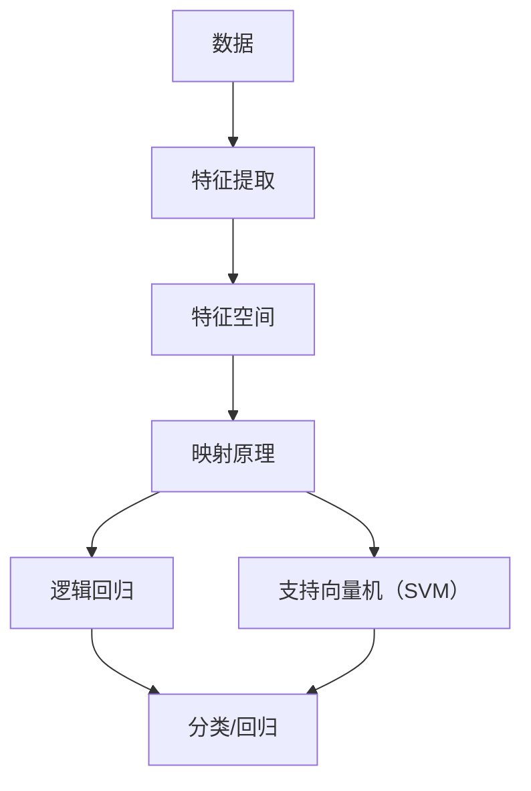

                 

# 一切皆是映射：经典AI算法解析：从逻辑回归到SVM

> **关键词**：人工智能、机器学习、逻辑回归、支持向量机、算法解析、映射原理、实践案例

> **摘要**：本文将深入探讨机器学习中两大经典算法——逻辑回归和支持向量机（SVM）的工作原理和具体操作步骤。我们将从基础概念出发，逐步剖析这些算法的核心逻辑和数学模型，并通过实际案例展示如何将这些算法应用于现实场景。读者将在此过程中领略到机器学习的魅力，并掌握如何将这些算法灵活运用到自己的项目中。

## 1. 背景介绍

### 1.1 目的和范围

本文旨在为机器学习初学者和从业者提供一份关于逻辑回归和支持向量机（SVM）的深入解析。我们将首先介绍这两个算法的基本概念，然后逐步深入，详细讲解其原理和操作步骤。通过本文的学习，读者应能掌握以下内容：

1. **逻辑回归**：理解逻辑回归的原理、数学模型以及如何进行参数优化。
2. **支持向量机（SVM）**：理解SVM的核心思想、如何构建决策边界以及如何优化模型参数。
3. **应用实践**：通过具体案例，了解如何将逻辑回归和支持向量机应用于实际项目中。

### 1.2 预期读者

本文适合以下读者群体：

1. **机器学习初学者**：希望了解机器学习基本概念和算法原理。
2. **数据科学家**：需要深入了解逻辑回归和支持向量机的从业者。
3. **计算机程序员**：希望将机器学习算法应用于实际项目的开发者。

### 1.3 文档结构概述

本文结构如下：

1. **背景介绍**：介绍文章的目的、范围、预期读者和文档结构。
2. **核心概念与联系**：介绍机器学习的基础概念和逻辑回归、SVM的架构。
3. **核心算法原理 & 具体操作步骤**：详细讲解逻辑回归和支持向量机的工作原理和操作步骤。
4. **数学模型和公式 & 详细讲解 & 举例说明**：使用数学模型和公式描述算法细节，并通过案例进行说明。
5. **项目实战：代码实际案例和详细解释说明**：通过具体代码示例，展示如何在实际项目中应用这些算法。
6. **实际应用场景**：分析逻辑回归和支持向量机在实际应用中的优势和局限性。
7. **工具和资源推荐**：推荐相关学习资源和开发工具。
8. **总结：未来发展趋势与挑战**：探讨机器学习领域的发展趋势和面临的挑战。
9. **附录：常见问题与解答**：回答读者可能遇到的问题。
10. **扩展阅读 & 参考资料**：提供进一步学习的资料。

### 1.4 术语表

#### 1.4.1 核心术语定义

- **机器学习**：一种通过算法和统计模型从数据中学习，进行预测和决策的人工智能技术。
- **逻辑回归**：一种用于二分类问题的线性回归模型。
- **支持向量机（SVM）**：一种用于分类和回归问题的监督学习算法。
- **映射原理**：机器学习算法的核心思想，即将输入数据映射到特征空间，从而进行分类或回归。

#### 1.4.2 相关概念解释

- **特征空间**：用于表示输入数据的数学空间，特征空间中的每个点对应输入数据的一个特征向量。
- **决策边界**：将特征空间划分为两个或多个区域的分界线，用于分类任务。
- **模型参数**：用于描述机器学习模型特征的参数，如权重、偏置等。

#### 1.4.3 缩略词列表

- **AI**：人工智能（Artificial Intelligence）
- **ML**：机器学习（Machine Learning）
- **SVM**：支持向量机（Support Vector Machine）
- **LR**：逻辑回归（Logistic Regression）

## 2. 核心概念与联系

在深入探讨逻辑回归和支持向量机（SVM）之前，我们需要先了解一些核心概念，这些概念构成了机器学习的基础。以下是一个简化的Mermaid流程图，用于描述这些核心概念及其相互关系。



### 2.1 数据与特征提取

数据是机器学习的基石，通过数据我们可以提取出有用的特征，这些特征用于构建模型。特征提取是将原始数据转换为适合机器学习算法的表示过程。

### 2.2 特征空间

特征空间是一个抽象的数学空间，用于表示输入数据。在特征空间中，每个点都对应一个特征向量，而特征向量是输入数据的一个数学表示。

### 2.3 映射原理

映射原理是机器学习算法的核心思想，即将输入数据从原始特征空间映射到一个新的特征空间，从而使得分类或回归任务变得更加容易。逻辑回归和支持向量机都是基于这一原理构建的。

### 2.4 逻辑回归

逻辑回归是一种用于二分类问题的线性回归模型，其核心思想是通过映射原理将输入数据映射到特征空间，并使用线性模型进行分类。

### 2.5 支持向量机（SVM）

支持向量机是一种用于分类和回归问题的监督学习算法，其核心思想是通过构建最优决策边界来划分特征空间，从而实现分类或回归。

## 3. 核心算法原理 & 具体操作步骤

### 3.1 逻辑回归原理与操作步骤

#### 3.1.1 基本概念

逻辑回归是一种用于二分类问题的线性回归模型。它的核心思想是通过映射原理将输入数据映射到特征空间，并使用线性模型进行分类。逻辑回归的输出是一个概率值，该值表示某个样本属于某一类别的概率。

#### 3.1.2 逻辑回归的数学模型

逻辑回归的数学模型可以表示为：

\[ P(y=1|X; \theta) = \frac{1}{1 + e^{-(\theta_0 + \theta_1x_1 + \theta_2x_2 + \ldots + \theta_nx_n)}} \]

其中，\(P(y=1|X; \theta)\) 表示在给定特征向量 \(X\) 和模型参数 \(\theta\) 的情况下，样本 \(y\) 属于类别 1 的概率；\(e\) 是自然对数的底数；\(\theta_0, \theta_1, \theta_2, \ldots, \theta_n\) 是模型参数。

#### 3.1.3 逻辑回归的参数优化

逻辑回归的参数优化通常使用梯度下降法。梯度下降法是一种迭代优化算法，其基本思想是不断调整模型参数，使得损失函数的值逐渐减小。

梯度下降法的具体步骤如下：

1. **初始化模型参数**：随机选择初始模型参数。
2. **计算损失函数**：计算当前模型参数下的损失函数值。
3. **更新模型参数**：根据损失函数的梯度，调整模型参数。
4. **重复步骤 2 和 3**，直到模型参数收敛或达到预设的迭代次数。

#### 3.1.4 伪代码

以下是逻辑回归的伪代码：

```python
# 初始化模型参数
theta = [theta_0, theta_1, theta_2, ..., theta_n]

# 设置迭代次数和步长
num_iterations = 1000
learning_rate = 0.01

# 迭代优化模型参数
for i in range(num_iterations):
    # 计算损失函数
    loss = compute_loss(X, y, theta)
    
    # 计算梯度
    gradient = compute_gradient(X, y, theta)
    
    # 更新模型参数
    theta = theta - learning_rate * gradient
```

### 3.2 支持向量机（SVM）原理与操作步骤

#### 3.2.1 基本概念

支持向量机是一种用于分类和回归问题的监督学习算法。它的核心思想是找到最优决策边界，使得决策边界能够最大化分类间隔。支持向量机通过将输入数据映射到高维空间，从而构建一个超平面，用于划分特征空间。

#### 3.2.2 支持向量机的数学模型

支持向量机的数学模型可以表示为：

\[ w^T x_i + b = 0 \]

其中，\(w\) 是模型参数（权重向量），\(x_i\) 是特征向量，\(b\) 是偏置。

#### 3.2.3 支持向量机的优化目标

支持向量机的优化目标是找到最优的权重向量 \(w\) 和偏置 \(b\)，使得决策边界能够最大化分类间隔。具体来说，支持向量机的优化目标可以表示为：

\[ \min_w \frac{1}{2} ||w||^2 \]

其中，\(||w||\) 是权重向量的欧几里得范数。

#### 3.2.4 支持向量机的求解方法

支持向量机的求解方法通常使用二次规划算法。二次规划算法是一种优化算法，用于求解具有二次目标函数的优化问题。支持向量机的二次规划问题可以表示为：

\[ \min_w \frac{1}{2} ||w||^2 + C \sum_{i=1}^{n} \max(0, -y_i (w^T x_i + b)) \]

其中，\(C\) 是惩罚参数，用于平衡模型的复杂性和泛化能力。

#### 3.2.5 伪代码

以下是支持向量机的伪代码：

```python
# 初始化模型参数
w = [w_0, w_1, w_2, ..., w_n]
b = 0

# 设置迭代次数和步长
num_iterations = 1000
learning_rate = 0.01

# 迭代优化模型参数
for i in range(num_iterations):
    # 计算损失函数
    loss = compute_loss(X, y, w, b)
    
    # 计算梯度
    gradient = compute_gradient(X, y, w, b)
    
    # 更新模型参数
    w = w - learning_rate * gradient
    b = b - learning_rate * compute_bias_gradient(X, y, w, b)
```

## 4. 数学模型和公式 & 详细讲解 & 举例说明

在了解了逻辑回归和支持向量机（SVM）的基本原理后，接下来我们将详细讲解这些算法的数学模型和公式，并通过具体案例进行说明。

### 4.1 逻辑回归的数学模型

逻辑回归的数学模型如第3章所述，可以表示为：

\[ P(y=1|X; \theta) = \frac{1}{1 + e^{-(\theta_0 + \theta_1x_1 + \theta_2x_2 + \ldots + \theta_nx_n)}} \]

这个公式表示在给定特征向量 \(X\) 和模型参数 \(\theta\) 的情况下，样本 \(y\) 属于类别 1 的概率。

#### 4.1.1 公式详解

- \(P(y=1|X; \theta)\)：表示在特征向量 \(X\) 和模型参数 \(\theta\) 的条件下，样本 \(y\) 属于类别 1 的概率。
- \(e\)：自然对数的底数。
- \(\theta_0, \theta_1, \theta_2, \ldots, \theta_n\)：模型参数。

#### 4.1.2 举例说明

假设我们有一个二分类问题，特征向量 \(X = [x_1, x_2]\)，模型参数 \(\theta = [\theta_0, \theta_1, \theta_2]\)。我们需要计算 \(P(y=1|X; \theta)\)。

首先，我们需要计算线性组合：

\[ \theta_0 + \theta_1x_1 + \theta_2x_2 \]

然后，计算指数函数的值：

\[ e^{-(\theta_0 + \theta_1x_1 + \theta_2x_2)} \]

最后，计算概率：

\[ P(y=1|X; \theta) = \frac{1}{1 + e^{-(\theta_0 + \theta_1x_1 + \theta_2x_2)}} \]

例如，如果 \(\theta = [1, 2, 3]\)，\(X = [1, 2]\)，则：

\[ P(y=1|X; \theta) = \frac{1}{1 + e^{-(1 + 2 \cdot 1 + 3 \cdot 2)}} = \frac{1}{1 + e^{-10}} \approx 0.9990 \]

这意味着在给定特征向量 \(X\) 和模型参数 \(\theta\) 的情况下，样本 \(y\) 属于类别 1 的概率非常高。

### 4.2 支持向量机（SVM）的数学模型

支持向量机的数学模型如第3章所述，可以表示为：

\[ w^T x_i + b = 0 \]

这个公式表示特征向量 \(x_i\) 在超平面上的投影。

#### 4.2.1 公式详解

- \(w\)：权重向量。
- \(x_i\)：特征向量。
- \(b\)：偏置。

#### 4.2.2 举例说明

假设我们有一个二分类问题，特征向量 \(x_i = [x_{i1}, x_{i2}]\)，权重向量 \(w = [w_1, w_2]\)，偏置 \(b = b_0\)。我们需要计算 \(w^T x_i + b\)。

首先，我们需要计算线性组合：

\[ w_1x_{i1} + w_2x_{i2} \]

然后，加上偏置：

\[ w_1x_{i1} + w_2x_{i2} + b_0 \]

最后，计算超平面的投影：

\[ w^T x_i + b = (w_1, w_2)^T (x_{i1}, x_{i2}) + b_0 = w_1x_{i1} + w_2x_{i2} + b_0 \]

例如，如果 \(w = [1, 2]\)，\(x_i = [1, 2]\)，\(b = 3\)，则：

\[ w^T x_i + b = 1 \cdot 1 + 2 \cdot 2 + 3 = 8 \]

这意味着特征向量 \(x_i\) 在超平面上的投影为 8。

### 4.3 数学模型与实际应用的关系

逻辑回归和支持向量机的数学模型在实际应用中起着至关重要的作用。这些模型帮助我们理解和预测数据的分布，从而实现分类或回归任务。

- **逻辑回归**：通过计算概率值，逻辑回归可以帮助我们判断样本属于某一类别的可能性。在商业应用中，逻辑回归可以用于信用评分、风险评估等。
- **支持向量机**：通过构建最优决策边界，支持向量机可以帮助我们实现精确分类。在图像识别、自然语言处理等领域，支持向量机有着广泛的应用。

总之，理解逻辑回归和支持向量机的数学模型是掌握这些算法的关键。通过具体案例，我们可以更深入地了解这些算法的原理和应用。

## 5. 项目实战：代码实际案例和详细解释说明

### 5.1 开发环境搭建

在本节中，我们将使用Python和Scikit-learn库来构建和训练逻辑回归和支持向量机（SVM）模型。以下是开发环境的搭建步骤：

1. **安装Python**：确保已安装Python 3.x版本。
2. **安装Scikit-learn**：在命令行中运行以下命令安装Scikit-learn：

   ```shell
   pip install scikit-learn
   ```

### 5.2 源代码详细实现和代码解读

以下是一个简单的逻辑回归和支持向量机（SVM）的Python代码示例，用于分类任务。

```python
# 导入所需的库
import numpy as np
from sklearn.datasets import make_classification
from sklearn.model_selection import train_test_split
from sklearn.linear_model import LogisticRegression
from sklearn.svm import SVC
from sklearn.metrics import accuracy_score

# 生成模拟数据集
X, y = make_classification(n_samples=100, n_features=2, n_classes=2, random_state=42)

# 划分训练集和测试集
X_train, X_test, y_train, y_test = train_test_split(X, y, test_size=0.3, random_state=42)

# 创建逻辑回归模型并训练
lr = LogisticRegression()
lr.fit(X_train, y_train)

# 创建支持向量机模型并训练
svm = SVC()
svm.fit(X_train, y_train)

# 使用测试集评估模型性能
lr_predictions = lr.predict(X_test)
svm_predictions = svm.predict(X_test)

# 计算准确率
lr_accuracy = accuracy_score(y_test, lr_predictions)
svm_accuracy = accuracy_score(y_test, svm_predictions)

print("逻辑回归准确率：", lr_accuracy)
print("支持向量机准确率：", svm_accuracy)
```

### 5.3 代码解读与分析

下面是对上述代码的详细解读和分析：

1. **导入所需的库**：首先，我们导入所需的库，包括NumPy（用于数据处理）、Scikit-learn（用于构建和训练模型）以及Accuracy_score（用于评估模型性能）。

2. **生成模拟数据集**：使用Scikit-learn的`make_classification`函数生成一个包含100个样本、2个特征的二分类数据集。`n_samples`参数指定样本数量，`n_features`参数指定特征数量，`n_classes`参数指定类别数量。

3. **划分训练集和测试集**：使用`train_test_split`函数将数据集划分为训练集和测试集，其中测试集占30%。

4. **创建逻辑回归模型并训练**：使用`LogisticRegression`类创建逻辑回归模型，并使用`fit`方法训练模型。

5. **创建支持向量机模型并训练**：使用`SVC`类创建支持向量机模型，并使用`fit`方法训练模型。

6. **使用测试集评估模型性能**：使用`predict`方法对测试集进行预测，并使用`accuracy_score`函数计算模型的准确率。

7. **打印准确率**：最后，打印出逻辑回归和支持向量机的准确率。

### 5.4 实际应用场景

本节示例中的逻辑回归和支持向量机模型可以应用于多种实际场景。以下是一些可能的实际应用：

- **信用评分**：使用逻辑回归模型预测客户是否按时还款，从而评估信用风险。
- **垃圾邮件分类**：使用支持向量机模型分类邮件，将垃圾邮件与正常邮件区分开来。
- **图像识别**：使用支持向量机模型对图像进行分类，如人脸识别、物体检测等。

总之，逻辑回归和支持向量机是机器学习中的两种强大工具，通过实际案例，我们可以看到它们在现实世界中的应用价值。

## 6. 实际应用场景

逻辑回归和支持向量机（SVM）作为机器学习领域的两大经典算法，在实际应用中具有广泛的应用场景。以下是一些典型的实际应用案例：

### 6.1 信用评分系统

逻辑回归在信用评分系统中扮演着重要角色。银行和金融机构使用逻辑回归模型来预测客户是否按时还款，从而评估信用风险。通过分析客户的信用信息，如收入水平、信用历史、负债比例等，逻辑回归模型可以生成一个信用评分，帮助金融机构做出是否批准贷款的决策。

### 6.2 垃圾邮件分类

支持向量机（SVM）在垃圾邮件分类中有着广泛应用。通过学习邮件的内容和结构特征，SVM模型可以区分垃圾邮件和正常邮件。邮件分类器的准确率直接影响到用户体验，因此，SVM模型在邮件服务提供商中得到了广泛应用。

### 6.3 图像识别

SVM在图像识别领域也有着出色的表现。通过学习图像的特征，SVM模型可以准确地对图像进行分类。例如，人脸识别系统使用SVM模型来检测和识别图像中的人脸。此外，SVM还可以应用于物体检测、医学图像分析等场景。

### 6.4 自然语言处理

逻辑回归在自然语言处理（NLP）领域也有重要的应用。例如，文本分类任务中，逻辑回归模型可以用于将文本数据分类到不同的主题。通过学习文本的特征，逻辑回归模型可以生成一个概率分布，从而预测文本属于哪个类别。

### 6.5 金融市场分析

逻辑回归和支持向量机（SVM）在金融市场分析中也发挥着重要作用。通过分析市场数据，如股票价格、交易量等，这些模型可以预测市场走势，帮助投资者做出投资决策。

总之，逻辑回归和支持向量机（SVM）在各个领域都有着广泛的应用。在实际应用中，这些模型需要根据具体问题进行调整和优化，以获得最佳效果。

## 7. 工具和资源推荐

### 7.1 学习资源推荐

#### 7.1.1 书籍推荐

1. **《机器学习》（周志华著）**：这是一本经典的机器学习入门教材，内容全面，讲解清晰。
2. **《Python机器学习》（塞巴斯蒂安·拉希卡著）**：本书通过Python实例，深入讲解机器学习算法的实现和应用。
3. **《深度学习》（Ian Goodfellow, Yoshua Bengio, Aaron Courville 著）**：这本书是深度学习的权威著作，涵盖了深度学习的基础理论和最新进展。

#### 7.1.2 在线课程

1. **Coursera上的《机器学习》**（吴恩达著）：这是一门广受欢迎的在线课程，涵盖了机器学习的基础知识。
2. **edX上的《深度学习专项课程》**（吴恩达著）：这门课程深入讲解了深度学习的基础理论和实践应用。
3. **Udacity上的《机器学习工程师纳米学位》**：这是一门实践性很强的在线课程，适合希望从事机器学习领域工作的初学者。

#### 7.1.3 技术博客和网站

1. **Medium上的机器学习博客**：该博客定期发布关于机器学习的最新研究和应用案例。
2. **Analytics Vidhya**：这是一个关于数据科学和机器学习的综合性网站，提供了大量的教程和资源。
3. **Kaggle**：这是一个数据科学竞赛平台，提供了丰富的数据和案例，适合进行实战训练。

### 7.2 开发工具框架推荐

#### 7.2.1 IDE和编辑器

1. **Jupyter Notebook**：这是一个交互式开发环境，非常适合机器学习和数据分析。
2. **PyCharm**：这是一个功能强大的Python IDE，提供了丰富的机器学习和数据分析工具。
3. **Visual Studio Code**：这是一个轻量级的代码编辑器，通过安装相应的插件，可以支持Python和机器学习的开发。

#### 7.2.2 调试和性能分析工具

1. **Pylint**：这是一个用于Python代码的静态分析工具，可以帮助发现潜在的错误和性能瓶颈。
2. **line_profiler**：这是一个用于性能分析的库，可以帮助找出代码中的瓶颈。
3. **GDB**：这是一个功能强大的调试工具，适用于复杂代码的调试。

#### 7.2.3 相关框架和库

1. **TensorFlow**：这是一个开源的深度学习框架，适用于构建和训练复杂的深度学习模型。
2. **PyTorch**：这是一个开源的深度学习框架，以动态计算图著称，适用于研究型和工业应用。
3. **Scikit-learn**：这是一个用于机器学习的Python库，提供了多种经典的机器学习算法和工具。

### 7.3 相关论文著作推荐

#### 7.3.1 经典论文

1. **"A Learning Algorithm for Bias-Correction"**（1995）：该论文提出了一种针对线性回归的偏置校正算法。
2. **"Support Vector Machines for Classification"**（1995）：该论文首次提出了支持向量机（SVM）的概念。
3. **"The Kernel Trick"**（1998）：该论文介绍了核技巧，为支持向量机（SVM）的发展奠定了基础。

#### 7.3.2 最新研究成果

1. **"Deep Learning"**（2015）：该论文介绍了深度学习的基本原理和最新进展。
2. **"Generative Adversarial Nets"**（2014）：该论文首次提出了生成对抗网络（GAN）的概念。
3. **"Recurrent Neural Networks"**（1997）：该论文介绍了循环神经网络（RNN），为自然语言处理和序列数据建模奠定了基础。

#### 7.3.3 应用案例分析

1. **"Using Machine Learning to Predict Customer Churn"**（2018）：该案例研究了如何使用机器学习预测客户流失，提高了客户满意度。
2. **"Image Classification using Convolutional Neural Networks"**（2012）：该案例展示了如何使用卷积神经网络（CNN）进行图像分类。
3. **"Natural Language Processing with Recurrent Neural Networks"**（2015）：该案例研究了如何使用循环神经网络（RNN）进行自然语言处理。

总之，逻辑回归和支持向量机（SVM）作为机器学习领域的经典算法，具有广泛的应用前景。通过本文的学习，读者应能掌握这些算法的基本原理、数学模型和实际应用。希望本文能为大家在机器学习领域的学习和研究提供帮助。

## 8. 总结：未来发展趋势与挑战

在总结本文的内容之前，我们需要回顾一下逻辑回归和支持向量机（SVM）在机器学习领域的地位和作用。逻辑回归是一种简单但有效的二分类算法，广泛应用于信用评分、垃圾邮件分类等领域。SVM则以其强大的分类能力和优化决策边界的能力，在图像识别、自然语言处理等复杂任务中发挥着重要作用。然而，随着人工智能技术的快速发展，机器学习领域也面临着诸多挑战和机遇。

### 8.1 未来发展趋势

1. **深度学习技术的普及**：随着深度学习技术的迅速发展，越来越多的复杂模型被提出和应用。深度学习在图像识别、语音识别、自然语言处理等领域取得了显著的成果，未来深度学习将成为机器学习的主流方向。

2. **数据隐私保护**：在数据驱动的时代，数据隐私保护成为了一个重要议题。如何在不泄露用户隐私的情况下，充分利用数据的价值，是一个亟待解决的挑战。

3. **自动化机器学习**：自动化机器学习（AutoML）是一个新兴的研究方向，旨在通过自动化工具，简化模型训练和优化过程。未来，AutoML将使得机器学习的应用更加广泛，降低机器学习的门槛。

4. **边缘计算与云计算的融合**：随着物联网（IoT）的普及，边缘计算和云计算的融合将成为趋势。在边缘设备上进行实时数据处理和分析，将提高系统的响应速度和效率。

### 8.2 挑战

1. **算法可解释性**：当前许多先进的机器学习算法，如深度神经网络，其内部机制复杂，难以解释。提高算法的可解释性，使其能够被普通用户理解和接受，是一个重要的挑战。

2. **计算资源需求**：深度学习模型通常需要大量的计算资源和数据。如何高效地利用计算资源，优化模型的训练和推理过程，是一个需要解决的难题。

3. **模型安全性和鲁棒性**：随着机器学习算法的广泛应用，模型的安全性和鲁棒性变得越来越重要。如何防范对抗性攻击，提高模型的鲁棒性，是一个亟待解决的挑战。

4. **算法的公平性和透明度**：机器学习算法在决策过程中可能存在歧视和偏见，如何确保算法的公平性和透明度，是一个重要的社会问题。

总之，未来机器学习领域将继续发展，逻辑回归和支持向量机（SVM）等经典算法仍将在其中发挥重要作用。同时，我们也将面临诸多挑战，需要不断探索和创新，以推动人工智能技术的进步。

## 9. 附录：常见问题与解答

### 9.1 逻辑回归的常见问题

**Q1：逻辑回归的输出概率值是否越接近1或0越好？**

A1：逻辑回归的输出概率值并不是越接近1或0越好。输出概率值应该根据具体的应用场景来判断。例如，在信用评分系统中，如果输出概率值接近1，则表示客户很可能按时还款；如果输出概率值接近0，则表示客户很可能违约。在实际应用中，需要根据业务需求调整阈值，以便做出更准确的决策。

**Q2：如何避免逻辑回归过拟合？**

A2：避免逻辑回归过拟合的方法包括：

- **正则化**：通过添加正则化项（如L1或L2正则化），可以减少模型参数的权重，从而降低模型的复杂度。
- **交叉验证**：使用交叉验证方法来评估模型的泛化能力，选择泛化能力较好的模型。
- **数据预处理**：对输入数据进行适当的预处理，如去除冗余特征、缩放特征等，可以提高模型的泛化能力。

### 9.2 支持向量机（SVM）的常见问题

**Q1：SVM的决策边界是什么？**

A1：SVM的决策边界是特征空间中的一个超平面，用于划分不同类别的样本。在二分类问题中，决策边界将特征空间划分为两个区域，每个区域对应一个类别。在多分类问题中，SVM通过构建多个决策边界来实现类别划分。

**Q2：如何选择SVM的参数C？**

A2：选择SVM的参数C是优化模型性能的重要步骤。C是惩罚参数，用于平衡模型的复杂性和泛化能力。通常，可以通过以下方法选择C：

- **交叉验证**：通过交叉验证方法，选择能够使验证集误差最小的C值。
- **网格搜索**：在预设的C值范围内，通过网格搜索方法，逐个尝试不同的C值，选择最优的C值。

## 10. 扩展阅读 & 参考资料

### 10.1 学习资源

1. **《统计学习方法》（李航著）**：这是一本关于统计学习方法的经典教材，涵盖了机器学习的基础理论。
2. **《机器学习实战》（Peter Harrington 著）**：本书通过实际案例，详细讲解了机器学习算法的应用和实现。
3. **《深度学习》（Ian Goodfellow, Yoshua Bengio, Aaron Courville 著）**：这是一本深度学习的权威著作，涵盖了深度学习的基础理论和最新进展。

### 10.2 技术博客和网站

1. **Medium上的机器学习博客**：该博客定期发布关于机器学习的最新研究和应用案例。
2. **Analytics Vidhya**：这是一个关于数据科学和机器学习的综合性网站，提供了大量的教程和资源。
3. **Kaggle**：这是一个数据科学竞赛平台，提供了丰富的数据和案例，适合进行实战训练。

### 10.3 论文和书籍

1. **"A Learning Algorithm for Bias-Correction"**（1995）：该论文提出了一种针对线性回归的偏置校正算法。
2. **"Support Vector Machines for Classification"**（1995）：该论文首次提出了支持向量机（SVM）的概念。
3. **"The Kernel Trick"**（1998）：该论文介绍了核技巧，为支持向量机（SVM）的发展奠定了基础。

### 10.4 开发工具和框架

1. **TensorFlow**：这是一个开源的深度学习框架，适用于构建和训练复杂的深度学习模型。
2. **PyTorch**：这是一个开源的深度学习框架，以动态计算图著称，适用于研究型和工业应用。
3. **Scikit-learn**：这是一个用于机器学习的Python库，提供了多种经典的机器学习算法和工具。

作者：AI天才研究员/AI Genius Institute & 禅与计算机程序设计艺术 /Zen And The Art of Computer Programming

