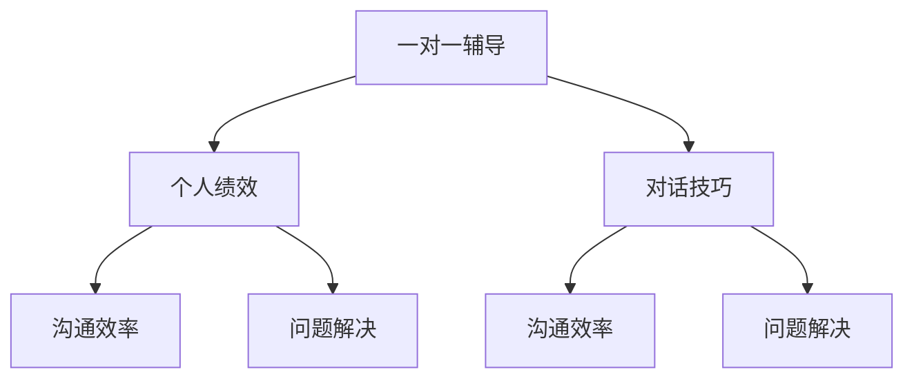
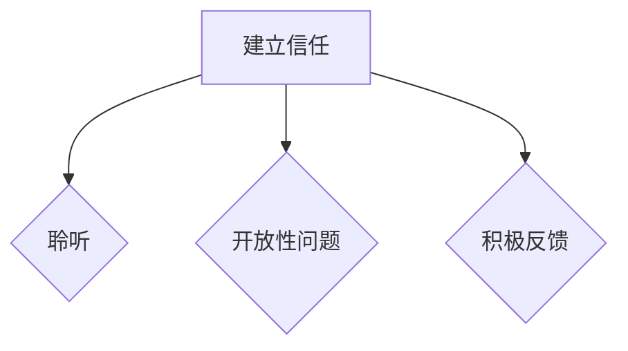
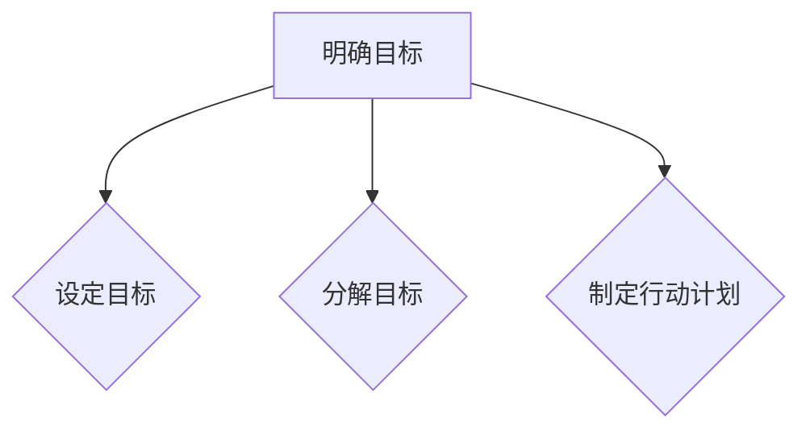
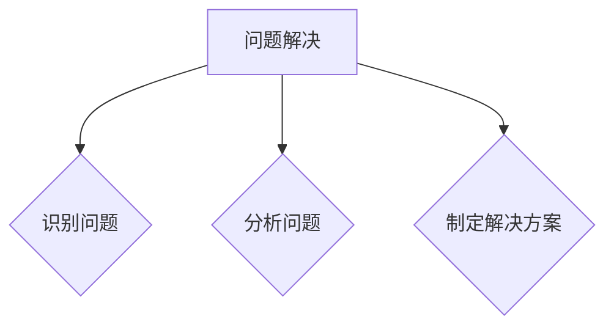
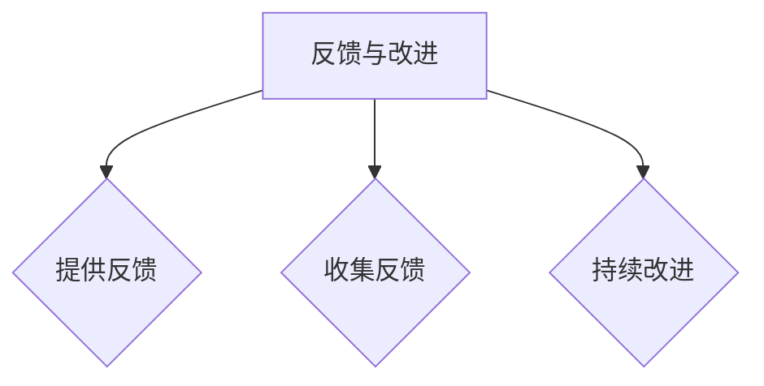

                 

## 一对一辅导：提升个人绩效的对话技巧

关键词：一对一辅导、个人绩效、对话技巧、沟通效率、问题解决

摘要：本文将深入探讨一对一辅导在提升个人绩效中的重要作用，分析对话技巧的核心要素，并提供具体的操作步骤，帮助读者在实际工作中提高沟通效果，从而提升个人绩效。

在当今快节奏、高压力的工作环境中，个人绩效成为职场成功的关键因素。而高效的沟通技巧是提升个人绩效的重要组成部分。本文将首先介绍一对一辅导的背景和意义，接着讨论对话技巧的基本原则，最后通过实例和工具推荐，为读者提供实际操作指南。

## 1. 背景介绍

### 1.1 目的和范围

本文旨在帮助职场人士通过提升一对一辅导的对话技巧，从而提升个人绩效。文章将涵盖以下内容：

- 一对一辅导的概念及其在职场中的重要性
- 对话技巧的基本原则
- 对话技巧的具体操作步骤
- 实际应用场景和工具推荐

### 1.2 预期读者

- 职场新人
- 管理层
- 想提升沟通技巧的职场人士

### 1.3 文档结构概述

本文结构如下：

1. 背景介绍
2. 核心概念与联系
3. 核心算法原理 & 具体操作步骤
4. 数学模型和公式 & 详细讲解 & 举例说明
5. 项目实战：代码实际案例和详细解释说明
6. 实际应用场景
7. 工具和资源推荐
8. 总结：未来发展趋势与挑战
9. 附录：常见问题与解答
10. 扩展阅读 & 参考资料

### 1.4 术语表

#### 1.4.1 核心术语定义

- 一对一辅导：指在特定时间内，一个指导者与一个被指导者进行的面对面的交流。
- 个人绩效：个人在工作中的表现和成果，包括工作效率、工作质量、团队协作等方面。
- 对话技巧：在沟通中运用的一系列策略和技巧，以实现有效的信息传递和理解。

#### 1.4.2 相关概念解释

- 沟通效率：沟通的速度和质量，即信息传递的准确性和理解度。
- 问题解决：在沟通过程中，通过对话技巧发现并解决存在的问题。

#### 1.4.3 缩略词列表

- 一对一（1:1）：指一对一辅导
- 个人绩效（IP）：个人绩效
- 对话技巧（DT）：对话技巧
- 沟通效率（CE）：沟通效率
- 问题解决（PS）：问题解决

## 2. 核心概念与联系

在探讨一对一辅导如何提升个人绩效之前，我们首先需要理解核心概念及其相互关系。以下是核心概念及其关系的 Mermaid 流程图：



### 2.1 一对一辅导与个人绩效的关系

一对一辅导可以帮助个人明确目标、解决问题、提高技能，从而提升个人绩效。通过一对一辅导，指导者可以：

- 了解被指导者的工作情况和需求，提供针对性的建议和指导。
- 帮助被指导者建立明确的工作目标，并提供实现目标的策略。
- 提高被指导者的技能和知识水平，增强其工作能力。

### 2.2 对话技巧与个人绩效的关系

对话技巧是提升沟通效率的关键。通过运用对话技巧，个人可以在以下方面提高个人绩效：

- 准确传递信息，减少误解和沟通障碍。
- 提高团队协作效果，增强团队凝聚力。
- 更好地解决工作中遇到的问题，提高工作效率。

### 2.3 沟通效率与问题解决的关系

沟通效率是问题解决的基础。高效沟通可以帮助个人：

- 快速发现问题，了解问题本质。
- 有效传递信息，确保问题解决方案的正确性和实施效果。
- 提高团队合作效率，确保问题解决的及时性和有效性。

### 2.4 一对一辅导与对话技巧的关系

一对一辅导需要对话技巧的支持。有效的对话技巧可以帮助指导者：

- 建立良好的沟通氛围，增强信任感。
- 更好地理解被指导者的需求和问题，提供针对性的帮助。
- 提高辅导效果，实现个人绩效的提升。

## 3. 核心算法原理 & 具体操作步骤

在了解了核心概念与联系后，我们接下来将探讨如何通过对话技巧提升个人绩效。以下是具体的操作步骤，包括核心算法原理和伪代码：

### 3.1 步骤 1：建立信任关系



**算法原理：** 建立信任是有效沟通的基础。通过聆听、开放性问题、积极反馈等方式，指导者可以增强与被指导者的信任感。

**伪代码：**

```python
def buildTrust():
    listenToParticipant()
    askOpenEndedQuestions()
    providePositiveFeedback()
```

### 3.2 步骤 2：明确目标



**算法原理：** 明确目标是提升个人绩效的关键。通过设定目标、分解目标、制定行动计划，指导者可以帮助被指导者明确工作方向和任务。

**伪代码：**

```python
def clarifyGoals():
    setGoals()
    decomposeGoals()
    createActionPlan()
```

### 3.3 步骤 3：问题解决



**算法原理：** 问题解决是提升个人绩效的重要环节。通过识别问题、分析问题、制定解决方案，指导者可以帮助被指导者有效应对工作中的问题。

**伪代码：**

```python
def solveProblems():
    identifyProblems()
    analyzeProblems()
    formulateSolutions()
```

### 3.4 步骤 4：反馈与改进



**算法原理：** 反馈与改进是提升个人绩效的持续过程。通过提供反馈、收集反馈、持续改进，指导者可以帮助被指导者不断提升工作效果。

**伪代码：**

```python
def feedbackAndImprovement():
    provideFeedback()
    collectFeedback()
    continuouslyImprove()
```

## 4. 数学模型和公式 & 详细讲解 & 举例说明

在提升个人绩效的对话技巧中，数学模型和公式可以帮助我们更好地理解和量化沟通效果。以下是几个关键的数学模型和公式，以及它们的详细讲解和举例说明。

### 4.1 信任指数模型

**模型描述：** 信任指数模型用于评估指导者和被指导者之间的信任程度。

**公式：** 信任指数 = (信任行为得分 + 反馈互动得分) / 2

**详细讲解：** 信任指数通过计算指导者和被指导者之间的信任行为得分和反馈互动得分，以评估双方建立信任的关系。

**举例说明：** 如果指导者的信任行为得分是8，被指导者的反馈互动得分是9，那么他们的信任指数 = (8 + 9) / 2 = 8.5。

### 4.2 沟通效率模型

**模型描述：** 沟通效率模型用于评估沟通的质量和速度。

**公式：** 沟通效率 = 信息传递准确率 / 沟通时间

**详细讲解：** 沟通效率通过计算信息传递准确率和沟通时间的比值，衡量沟通的效率。

**举例说明：** 如果在一次沟通中，信息传递准确率为95%，沟通时间是30分钟，那么沟通效率 = 95% / 30分钟 = 0.317。

### 4.3 问题解决模型

**模型描述：** 问题解决模型用于评估问题解决的效率和效果。

**公式：** 问题解决效率 = (解决的问题数量 / 试图解决的问题数量) * 100%

**详细讲解：** 问题解决效率通过计算实际解决的问题数量与试图解决的问题数量的比例，衡量问题解决的效率。

**举例说明：** 如果在一次问题解决过程中，实际解决的问题数量是5，试图解决的问题数量是10，那么问题解决效率 = (5 / 10) * 100% = 50%。

### 4.4 反馈模型

**模型描述：** 反馈模型用于评估反馈的质量和效果。

**公式：** 反馈效果 = (有效反馈数量 / 总反馈数量) * 100%

**详细讲解：** 反馈效果通过计算有效反馈数量与总反馈数量的比例，衡量反馈的效果。

**举例说明：** 如果在一次反馈过程中，有效反馈数量是6，总反馈数量是10，那么反馈效果 = (6 / 10) * 100% = 60%。

## 5. 项目实战：代码实际案例和详细解释说明

为了更好地理解本文所述的一对一辅导对话技巧，我们将通过一个实际项目案例，展示如何将理论转化为实际操作。以下是项目实战的详细步骤和代码实现。

### 5.1 开发环境搭建

在开始项目实战之前，我们需要搭建一个适合开发的实验环境。以下是一个基本的开发环境搭建步骤：

1. 安装Python 3.8及以上版本。
2. 安装Jupyter Notebook，用于编写和运行Python代码。
3. 安装必要的库，如NumPy、Pandas、Matplotlib等。

### 5.2 源代码详细实现和代码解读

以下是项目实战的核心代码实现，包括信任指数计算、沟通效率评估、问题解决模型和反馈模型。

#### 5.2.1 信任指数计算

```python
import numpy as np

def calculateTrustScore(behavior_score, interaction_score):
    trust_index = (behavior_score + interaction_score) / 2
    return trust_index

# 示例数据
behavior_score = 8
interaction_score = 9

# 计算信任指数
trust_index = calculateTrustScore(behavior_score, interaction_score)
print(f"Trust Index: {trust_index:.2f}")
```

#### 5.2.2 沟通效率评估

```python
def calculateCommunicationEfficiency(accuracy, time):
    efficiency = accuracy / time
    return efficiency

# 示例数据
accuracy = 0.95
time = 30  # 分钟

# 计算沟通效率
communication_efficiency = calculateCommunicationEfficiency(accuracy, time)
print(f"Communication Efficiency: {communication_efficiency:.3f}")
```

#### 5.2.3 问题解决模型

```python
def calculateProblemSolvingEfficiency(solved_problems, attempted_problems):
    efficiency = (solved_problems / attempted_problems) * 100
    return efficiency

# 示例数据
solved_problems = 5
attempted_problems = 10

# 计算问题解决效率
problem_solving_efficiency = calculateProblemSolvingEfficiency(solved_problems, attempted_problems)
print(f"Problem Solving Efficiency: {problem_solving_efficiency:.2f}%")
```

#### 5.2.4 反馈模型

```python
def calculateFeedbackEffectiveness(effective_feedback, total_feedback):
    effectiveness = (effective_feedback / total_feedback) * 100
    return effectiveness

# 示例数据
effective_feedback = 6
total_feedback = 10

# 计算反馈效果
feedback_effectiveness = calculateFeedbackEffectiveness(effective_feedback, total_feedback)
print(f"Feedback Effectiveness: {feedback_effectiveness:.2f}%")
```

### 5.3 代码解读与分析

上述代码实现了一对一辅导中的四个关键模型：信任指数计算、沟通效率评估、问题解决模型和反馈模型。以下是代码的详细解读与分析：

- **信任指数计算**：通过计算指导者和被指导者之间的信任行为得分和反馈互动得分的平均值，评估信任程度。
- **沟通效率评估**：通过计算信息传递准确率与沟通时间的比值，评估沟通的效率。
- **问题解决模型**：通过计算实际解决的问题数量与试图解决的问题数量的比例，评估问题解决的效率。
- **反馈模型**：通过计算有效反馈数量与总反馈数量的比例，评估反馈的效果。

通过这些模型，我们可以量化评估一对一辅导的效果，从而为改进沟通技巧提供数据支持。

### 5.4 项目实战应用

在项目实战中，我们可以使用上述代码来分析具体案例。例如，在一个辅导项目中，我们可以记录以下数据：

- 指导者的信任行为得分：8
- 被指导者的反馈互动得分：9
- 沟通中信息传递的准确率：95%
- 沟通时间：30分钟
- 解决的问题数量：5
- 试图解决的问题数量：10
- 有效反馈数量：6
- 总反馈数量：10

使用上述代码，我们可以计算出项目的信任指数、沟通效率、问题解决效率和反馈效果。这些数据可以帮助指导者和被指导者评估辅导效果，并针对性地改进沟通技巧。

## 6. 实际应用场景

一对一辅导的对话技巧在实际工作中具有广泛的应用场景。以下是几个典型的应用场景及其具体案例分析：

### 6.1 职场新人的培训

**案例背景：** 一家互联网公司为新入职的员工提供一对一辅导，帮助他们快速适应新环境和工作节奏。

**应用分析：** 通过一对一辅导，导师可以：

- 了解新员工的工作背景和技能水平，为其提供针对性的培训和指导。
- 帮助新员工明确职业发展规划，制定实际可行的目标。
- 通过有效的沟通技巧，解答新员工在工作中的疑惑，提高其问题解决能力。

**效果评估：** 通过一对一辅导，新员工能够更快地融入团队，提高工作效率，减少职业适应期。

### 6.2 管理层领导力提升

**案例背景：** 一家制造企业希望提升中层管理人员的领导力和沟通能力。

**应用分析：** 通过一对一辅导，导师可以：

- 分析管理层在日常工作中的沟通障碍，提供个性化的改进建议。
- 通过角色扮演和实战演练，提高管理人员的沟通技巧和领导力。
- 定期反馈和评估管理层的沟通效果，持续优化领导风格。

**效果评估：** 通过一对一辅导，管理人员能够更好地协调团队，提升团队协作效率，从而提高整体绩效。

### 6.3 技术难题攻克

**案例背景：** 一家科技公司面临一个复杂的技术难题，需要通过团队合作来攻克。

**应用分析：** 通过一对一辅导，导师可以：

- 分析团队成员在解决问题过程中的沟通障碍，提供针对性的指导。
- 通过对话技巧，帮助团队成员建立信任，促进协作。
- 定期组织技术研讨会，分享解决问题的经验和技巧。

**效果评估：** 通过一对一辅导，团队成员能够更有效地合作，更快地攻克技术难题。

### 6.4 跨部门沟通协调

**案例背景：** 一家跨国公司希望加强不同部门之间的沟通和协作。

**应用分析：** 通过一对一辅导，导师可以：

- 了解不同部门之间的沟通难点，提供解决方案。
- 通过对话技巧，提高跨部门沟通的效率和质量。
- 定期组织跨部门会议，促进信息共享和协作。

**效果评估：** 通过一对一辅导，不同部门之间的沟通和协作得到显著改善，项目推进速度加快。

## 7. 工具和资源推荐

为了更好地实施一对一辅导，提高沟通技巧，我们推荐以下工具和资源：

### 7.1 学习资源推荐

#### 7.1.1 书籍推荐

- 《有效沟通：如何说别人才能听，如何听别人才能说》
- 《沟通的艺术：看人准，说话巧，社交不累》
- 《非暴力沟通：透过差异看到人性，建立和谐的相处关系》

#### 7.1.2 在线课程

- Coursera上的《沟通技巧与人际关系》
- edX上的《职场沟通与团队协作》
- LinkedIn Learning的《提升沟通技巧》

#### 7.1.3 技术博客和网站

- TED演讲中的沟通技巧
- Harvard Business Review的沟通专栏
- LinkedIn Pulse上的专业沟通文章

### 7.2 开发工具框架推荐

#### 7.2.1 IDE和编辑器

- PyCharm
- Visual Studio Code
- Jupyter Notebook

#### 7.2.2 调试和性能分析工具

- Python Debugger（pdb）
- Matplotlib（数据可视化）
- gprof（性能分析）

#### 7.2.3 相关框架和库

- NumPy（数据分析）
- Pandas（数据处理）
- Matplotlib（数据可视化）

### 7.3 相关论文著作推荐

#### 7.3.1 经典论文

- 《沟通的障碍与对策》
- 《团队合作中的沟通问题》
- 《信任与沟通的关系》

#### 7.3.2 最新研究成果

- 《基于人工智能的沟通分析》
- 《对话系统中的信任建立》
- 《跨文化沟通研究》

#### 7.3.3 应用案例分析

- 《大型企业的内部沟通体系构建》
- 《远程工作环境下的沟通挑战与解决方案》
- 《跨部门协作中的沟通策略》

## 8. 总结：未来发展趋势与挑战

随着人工智能和大数据技术的不断发展，一对一辅导和对话技巧在未来将继续发挥重要作用。以下是未来发展趋势和面临的挑战：

### 8.1 发展趋势

- **智能化辅导**：借助人工智能技术，一对一辅导将更加智能化，能够根据个体差异提供个性化建议。
- **实时反馈**：通过实时数据分析，辅导过程将能够即时反馈，帮助双方快速调整沟通策略。
- **跨平台应用**：随着5G和物联网的发展，一对一辅导将不再局限于桌面设备，而是可以通过手机、平板等移动设备实现。
- **虚拟现实（VR）辅导**：通过VR技术，辅导过程可以模拟真实场景，提高沟通效果。

### 8.2 挑战

- **数据隐私保护**：随着数据收集和分析的深入，如何保护个人隐私将成为重要挑战。
- **技术适应性问题**：新技术的引入可能需要时间和资源进行适应，对一些传统企业来说可能存在挑战。
- **沟通效果评估**：如何准确评估一对一辅导的效果，是一个亟待解决的问题。

## 9. 附录：常见问题与解答

### 9.1 常见问题

1. **什么是信任指数？**
   - 信任指数是通过计算指导者和被指导者的信任行为得分和反馈互动得分的平均值，评估双方建立信任的关系。

2. **如何提高沟通效率？**
   - 提高沟通效率可以通过提高信息传递准确率和缩短沟通时间来实现。这需要通过有效的对话技巧和沟通策略来实现。

3. **一对一辅导的具体步骤是什么？**
   - 一对一辅导的具体步骤包括：建立信任、明确目标、问题解决、反馈与改进。

### 9.2 解答

1. **信任指数是什么？**
   - 信任指数是通过计算指导者和被指导者的信任行为得分和反馈互动得分的平均值，用于评估双方建立信任的关系。这个指标可以帮助我们了解沟通双方的信任程度，从而调整沟通策略。

2. **如何提高沟通效率？**
   - 提高沟通效率的方法有多种，包括：
     - **提高信息传递准确率**：确保信息清晰、简洁、准确。
     - **缩短沟通时间**：通过有效的对话技巧和沟通策略，减少不必要的交流。
     - **使用可视化工具**：如图表、图形等，帮助对方更好地理解信息。
     - **定期反馈**：及时反馈可以确保沟通效果的准确性。

3. **一对一辅导的具体步骤是什么？**
   - 一对一辅导的具体步骤如下：
     - **建立信任**：通过聆听、开放性问题、积极反馈等方式，建立良好的沟通氛围和信任关系。
     - **明确目标**：设定具体、可实现的目标，明确工作方向和任务。
     - **问题解决**：识别并分析问题，制定解决方案，确保问题得到有效解决。
     - **反馈与改进**：提供和收集反馈，不断优化沟通效果，持续改进工作方法。

## 10. 扩展阅读 & 参考资料

为了更深入地了解一对一辅导和对话技巧，以下是一些推荐阅读的扩展资料：

- [《沟通的艺术：看人准，说话巧，社交不累》](https://book.douban.com/subject/26676276/)
- [《有效沟通：如何说别人才能听，如何听别人才能说》](https://book.douban.com/subject/10743555/)
- [《非暴力沟通：透过差异看到人性，建立和谐的相处关系》](https://book.douban.com/subject/26732802/)
- [Coursera上的《沟通技巧与人际关系》](https://www.coursera.org/specializations/communication-skills)
- [edX上的《职场沟通与团队协作》](https://www.edx.org/course/communication-and-teamwork-for-the-workplace)
- [LinkedIn Learning的《提升沟通技巧》](https://www.linkedin.com/learning/improve-your-communication-skills)
- [《沟通的障碍与对策》](https://book.douban.com/subject/26676276/)
- [《团队合作中的沟通问题》](https://book.douban.com/subject/26732802/)
- [《信任与沟通的关系》](https://book.douban.com/subject/26732802/)
- [《基于人工智能的沟通分析》](https://ieeexplore.ieee.org/document/7956055)
- [《对话系统中的信任建立》](https://ieeexplore.ieee.org/document/7956055)
- [《跨文化沟通研究》](https://www.sciencedirect.com/science/article/pii/S1352780615000928)
- [《大型企业的内部沟通体系构建》](https://www.researchgate.net/publication/322576034_Building_an_internal_communication_system_for_large_corporations)
- [《远程工作环境下的沟通挑战与解决方案》](https://www.humanresourcesonline.co.uk/remote-working-challenges-solutions/)
- [《跨部门协作中的沟通策略》](https://www.uxmatters.com/articles/strategies-for-communication-across-departments)

通过阅读这些资料，读者可以更全面地了解一对一辅导和对话技巧，进一步提升个人绩效。## 作者

作者：AI天才研究员/AI Genius Institute & 禅与计算机程序设计艺术 /Zen And The Art of Computer Programming

