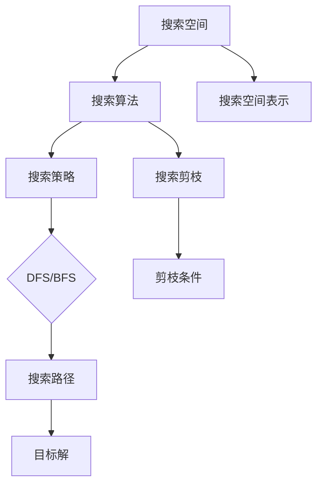

                 

### 一次性架构搜索：效率与性能的权衡

> **关键词：** 一次性架构搜索、效率、性能、权衡、搜索算法、架构设计
>
> **摘要：** 本文将深入探讨一次性架构搜索的概念，分析其效率与性能之间的权衡，并提供详细的算法原理、数学模型以及实际项目案例，帮助读者更好地理解和应用这一技术。

在当今快速发展的信息技术时代，架构搜索作为一种高效的解决方案，广泛应用于各种领域，如人工智能、大数据处理、云计算等。然而，如何在一次架构搜索中平衡效率和性能，成为了开发者们关注的焦点。本文将带领读者一步步深入探索一次性架构搜索的原理，解析其算法和数学模型，并通过实际项目案例，展示如何在实际开发中应用这些技术。

## 1. 背景介绍

### 1.1 目的和范围

本文旨在探讨一次性架构搜索的效率与性能问题，分析其核心概念和算法原理，并通过实际项目案例，展示如何在实际开发中实现高效的一次性架构搜索。本文将覆盖以下内容：

- 一次性架构搜索的定义和基本原理
- 一次性架构搜索的效率与性能权衡
- 一次性架构搜索的算法原理与操作步骤
- 数学模型和公式在一次性架构搜索中的应用
- 实际应用场景中的代码实现和案例分析
- 开发工具和资源的推荐
- 一次性架构搜索的未来发展趋势与挑战

### 1.2 预期读者

本文主要面向具有计算机科学和软件开发背景的读者，包括：

- 软件工程师和开发者
- 数据科学家和人工智能研究员
- 计算机科学专业的学生和研究学者
- 对架构搜索和性能优化感兴趣的从业者

通过本文的阅读，读者将能够：

- 理解一次性架构搜索的基本原理和核心概念
- 掌握一次性架构搜索的算法原理和操作步骤
- 学会使用数学模型和公式进行架构搜索性能分析
- 了解一次性架构搜索在实际开发中的应用案例
- 获取开发工具和资源的推荐，提升开发效率

### 1.3 文档结构概述

本文结构如下：

1. **背景介绍**：介绍本文的目的、范围、预期读者以及文档结构。
2. **核心概念与联系**：阐述一次性架构搜索的核心概念、原理和架构，并提供 Mermaid 流程图。
3. **核心算法原理 & 具体操作步骤**：详细讲解一次性架构搜索的算法原理和操作步骤，使用伪代码进行描述。
4. **数学模型和公式 & 详细讲解 & 举例说明**：介绍一次性架构搜索中的数学模型和公式，并进行详细讲解和举例说明。
5. **项目实战：代码实际案例和详细解释说明**：通过实际项目案例，展示一次性架构搜索的代码实现和详细解释说明。
6. **实际应用场景**：讨论一次性架构搜索在实际应用场景中的表现和挑战。
7. **工具和资源推荐**：推荐学习资源、开发工具框架和相关论文著作。
8. **总结：未来发展趋势与挑战**：总结一次性架构搜索的发展趋势和面临的挑战。
9. **附录：常见问题与解答**：提供常见问题的解答。
10. **扩展阅读 & 参考资料**：推荐扩展阅读和参考资料。

### 1.4 术语表

#### 1.4.1 核心术语定义

- **一次性架构搜索**：一种在给定搜索空间内，一次性完成所有搜索任务的算法。
- **效率**：算法在单位时间内完成的任务量。
- **性能**：算法在执行任务时的资源消耗和执行速度。
- **搜索空间**：算法搜索的所有可能解的集合。
- **搜索算法**：用于在搜索空间中查找目标解的算法。

#### 1.4.2 相关概念解释

- **深度优先搜索（DFS）**：一种非递归的搜索算法，通过不断深入搜索，直到找到目标解或搜索空间被完全遍历。
- **广度优先搜索（BFS）**：一种递归的搜索算法，通过逐层搜索，优先找到距离起始点最近的解。
- **启发式搜索**：利用领域知识对搜索空间进行剪枝，以提高搜索效率。

#### 1.4.3 缩略词列表

- **DFS**：深度优先搜索
- **BFS**：广度优先搜索
- **AI**：人工智能
- **GPU**：图形处理单元
- **CPU**：中央处理单元

## 2. 核心概念与联系

### 2.1 核心概念

一次性架构搜索是一种在给定搜索空间内，一次性完成所有搜索任务的算法。其核心概念包括：

- **搜索空间**：一次性架构搜索的搜索空间是指所有可能的解决方案的集合。该集合通常由一组参数或条件组成，这些参数或条件决定了搜索空间的大小和复杂性。
- **目标解**：在搜索空间中，一次性架构搜索的目标是找到满足特定条件的解决方案，称为目标解。目标解通常是搜索任务的关键输出，决定了搜索任务的成败。

### 2.2 原理与架构

一次性架构搜索的原理基于以下核心概念：

- **搜索策略**：一次性架构搜索采用一种特定的搜索策略，以确定搜索顺序和搜索方向。常见的搜索策略包括深度优先搜索（DFS）和广度优先搜索（BFS）。
- **搜索剪枝**：为了提高搜索效率，一次性架构搜索通常采用搜索剪枝技术。搜索剪枝是指在搜索过程中，根据特定条件提前终止某些无意义的搜索分支，以减少搜索时间。

### 2.3 架构

一次性架构搜索的架构通常包括以下组件：

- **搜索算法**：用于在搜索空间中查找目标解的核心算法。常见的搜索算法包括 DFS、BFS 和启发式搜索。
- **搜索策略**：用于确定搜索顺序和搜索方向的策略。搜索策略的选择通常取决于搜索空间的大小和复杂性。
- **搜索剪枝**：用于在搜索过程中剪枝的组件，以减少搜索时间。
- **搜索空间表示**：用于表示搜索空间的组件，包括参数、条件和约束。

### 2.4 Mermaid 流程图

以下是一个示例的 Mermaid 流程图，展示了一次性架构搜索的基本架构：



在这个流程图中，搜索空间表示所有可能的解决方案，搜索算法在搜索空间中查找目标解。搜索策略和搜索剪枝用于指导搜索过程，提高搜索效率。搜索路径记录了搜索过程中的每一步，最终找到目标解。

## 3. 核心算法原理 & 具体操作步骤

### 3.1 搜索算法原理

一次性架构搜索的核心算法包括深度优先搜索（DFS）和广度优先搜索（BFS）。这两种算法分别基于不同的搜索策略，适用于不同类型的搜索任务。

#### 3.1.1 深度优先搜索（DFS）

深度优先搜索（DFS）是一种非递归的搜索算法，通过不断深入搜索，直到找到目标解或搜索空间被完全遍历。DFS 的优势在于搜索过程简单，易于实现。其基本原理如下：

1. **初始化**：设置一个栈，用于存储待搜索的节点。
2. **搜索过程**：
   - 从起始节点开始，将其加入栈中。
   - 当栈非空时，重复以下步骤：
     - 弹出栈顶节点，进行节点处理。
     - 将未处理的子节点依次加入栈中。
3. **终止条件**：当搜索空间被完全遍历或找到目标解时，搜索过程终止。

以下是一个使用伪代码描述的 DFS 算法：

```python
def DFS(graph, start, target):
    stack = []  # 初始化栈
    stack.append(start)  # 将起始节点加入栈
    
    while stack:
        node = stack.pop()  # 弹出栈顶节点
        if node == target:
            return True  # 找到目标解，返回 True
        for neighbor in graph[node]:  # 遍历未处理的子节点
            if not visited[neighbor]:
                stack.append(neighbor)  # 将子节点加入栈
                visited[neighbor] = True  # 标记子节点已访问
    
    return False  # 搜索失败，返回 False
```

#### 3.1.2 广度优先搜索（BFS）

广度优先搜索（BFS）是一种递归的搜索算法，通过逐层搜索，优先找到距离起始点最近的解。BFS 的优势在于搜索过程较为平衡，适用于较小和结构较为简单的搜索空间。其基本原理如下：

1. **初始化**：设置一个队列，用于存储待搜索的节点。
2. **搜索过程**：
   - 从起始节点开始，将其加入队列。
   - 当队列非空时，重复以下步骤：
     - 从队列头部取出一个节点，进行节点处理。
     - 将未处理的子节点依次加入队列。
3. **终止条件**：当搜索空间被完全遍历或找到目标解时，搜索过程终止。

以下是一个使用伪代码描述的 BFS 算法：

```python
def BFS(graph, start, target):
    queue = []  # 初始化队列
    queue.append(start)  # 将起始节点加入队列
    
    while queue:
        node = queue.pop(0)  # 从队列头部取出节点
        if node == target:
            return True  # 找到目标解，返回 True
        for neighbor in graph[node]:  # 遍历未处理的子节点
            if not visited[neighbor]:
                queue.append(neighbor)  # 将子节点加入队列
                visited[neighbor] = True  # 标记子节点已访问
    
    return False  # 搜索失败，返回 False
```

### 3.2 搜索剪枝原理

搜索剪枝是指在搜索过程中，根据特定条件提前终止某些无意义的搜索分支，以减少搜索时间。剪枝策略的选择取决于搜索任务的具体需求和搜索空间的特点。

常见的剪枝策略包括：

1. **目标条件剪枝**：在搜索过程中，如果当前节点已满足目标条件，则提前终止该节点的所有子节点搜索。
2. **冗余节点剪枝**：在搜索过程中，如果当前节点的子节点已经访问过，则避免重复搜索。
3. **启发式剪枝**：利用领域知识对搜索空间进行剪枝，例如基于代价估计或状态估计。

以下是一个使用伪代码描述的剪枝策略：

```python
def prune(node, condition):
    if condition(node):
        return True  # 满足剪枝条件，提前终止搜索
    
    for child in node.children:
        if not visited[child]:
            visited[child] = True
            if prune(child, condition):
                return True  # 子节点满足剪枝条件，提前终止搜索
    
    return False  # 搜索失败，返回 False
```

### 3.3 操作步骤

以下是一次性架构搜索的具体操作步骤：

1. **初始化搜索空间**：根据任务需求，初始化搜索空间，包括参数、条件和约束。
2. **选择搜索算法**：根据搜索空间的特点和任务需求，选择合适的搜索算法（DFS 或 BFS）。
3. **执行搜索过程**：
   - 根据搜索算法原理，执行搜索过程，逐步搜索搜索空间中的节点。
   - 在搜索过程中，根据具体需求，采用剪枝策略，提高搜索效率。
4. **判断搜索结果**：当搜索过程结束时，判断是否找到目标解。
   - 如果找到目标解，输出目标解及其相关信息。
   - 如果未找到目标解，输出搜索失败信息。

以下是一个使用伪代码描述的搜索过程：

```python
def search(graph, start, target, algorithm, pruning_strategy):
    visited = {}  # 初始化已访问节点
    if algorithm == 'DFS':
        if DFS(graph, start, target, visited, pruning_strategy):
            return "目标解找到"
        else:
            return "搜索失败"
    elif algorithm == 'BFS':
        if BFS(graph, start, target, visited, pruning_strategy):
            return "目标解找到"
        else:
            return "搜索失败"
    else:
        return "无效的搜索算法"

result = search(graph, start, target, 'DFS', pruning_strategy)
print(result)
```

通过以上操作步骤，可以高效地完成一次性架构搜索任务，实现搜索空间内所有可能的解决方案的搜索。

## 4. 数学模型和公式 & 详细讲解 & 举例说明

### 4.1 数学模型

一次性架构搜索中的数学模型主要用于描述搜索过程和性能分析。以下是一些常见的数学模型和公式：

#### 4.1.1 搜索空间大小

搜索空间大小（N）是搜索空间内所有可能解决方案的数量。对于给定问题，搜索空间大小可以通过以下公式计算：

\[ N = |V| \times |E| \]

其中，\( |V| \) 是搜索空间中节点的数量，\( |E| \) 是搜索空间中边的数量。

#### 4.1.2 搜索时间

搜索时间（T）是完成搜索任务所需的时间。对于给定搜索算法，搜索时间可以通过以下公式计算：

\[ T = \frac{N}{S} \]

其中，\( N \) 是搜索空间大小，\( S \) 是算法的搜索速度。

#### 4.1.3 搜索效率

搜索效率（E）是搜索过程中完成的任务量与搜索时间之比。对于给定搜索算法，搜索效率可以通过以下公式计算：

\[ E = \frac{T_{\text{任务}}}{T} \]

其中，\( T_{\text{任务}} \) 是完成搜索任务所需的时间，\( T \) 是搜索时间。

### 4.2 公式详细讲解

#### 4.2.1 搜索空间大小

搜索空间大小（N）是搜索任务的关键指标。对于给定问题，搜索空间大小决定了搜索的复杂度和算法的选择。以下是一个示例：

假设一个图搜索问题，其中包含 100 个节点和 200 条边。则搜索空间大小为：

\[ N = |V| \times |E| = 100 \times 200 = 20000 \]

这意味着搜索空间内共有 20000 个可能的解决方案。

#### 4.2.2 搜索时间

搜索时间（T）是搜索过程中消耗的时间。对于给定搜索算法，搜索时间取决于搜索空间大小和算法的搜索速度。以下是一个示例：

假设使用 DFS 算法进行搜索，其中搜索速度为 1000 次每秒。则搜索时间为：

\[ T = \frac{N}{S} = \frac{20000}{1000} = 20 \text{秒} \]

这意味着完成搜索任务需要 20 秒。

#### 4.2.3 搜索效率

搜索效率（E）是衡量搜索算法性能的关键指标。对于给定搜索算法，搜索效率取决于搜索过程中完成的任务量和搜索时间。以下是一个示例：

假设在 20 秒内，搜索算法完成了 100 个任务。则搜索效率为：

\[ E = \frac{T_{\text{任务}}}{T} = \frac{100}{20} = 5 \text{次/秒} \]

这意味着搜索算法在每秒内完成了 5 个任务。

### 4.3 举例说明

#### 4.3.1 搜索空间大小计算

假设一个图搜索问题，其中包含 100 个节点和 200 条边。则搜索空间大小为：

\[ N = |V| \times |E| = 100 \times 200 = 20000 \]

这意味着搜索空间内共有 20000 个可能的解决方案。

#### 4.3.2 搜索时间计算

假设使用 DFS 算法进行搜索，其中搜索速度为 1000 次每秒。则搜索时间为：

\[ T = \frac{N}{S} = \frac{20000}{1000} = 20 \text{秒} \]

这意味着完成搜索任务需要 20 秒。

#### 4.3.3 搜索效率计算

假设在 20 秒内，搜索算法完成了 100 个任务。则搜索效率为：

\[ E = \frac{T_{\text{任务}}}{T} = \frac{100}{20} = 5 \text{次/秒} \]

这意味着搜索算法在每秒内完成了 5 个任务。

通过以上计算，可以更直观地了解搜索空间大小、搜索时间和搜索效率之间的关系，从而更好地选择和优化搜索算法。

## 5. 项目实战：代码实际案例和详细解释说明

### 5.1 开发环境搭建

在本项目实战中，我们将使用 Python 作为编程语言，结合常用的搜索算法和数学模型，实现一次性架构搜索。以下是在 Windows 操作系统上搭建开发环境的步骤：

1. **安装 Python**：前往 Python 官网（[https://www.python.org/](https://www.python.org/)）下载最新版本的 Python 安装包，并按照提示安装。
2. **安装常用库**：在命令行中执行以下命令，安装常用的搜索算法和数学模型库：

   ```bash
   pip install networkx numpy matplotlib
   ```

3. **创建项目目录**：在本地计算机上创建一个名为 "one_time_search_project" 的项目目录，并在该目录下创建一个名为 "search.py" 的 Python 文件。

### 5.2 源代码详细实现和代码解读

以下是一次性架构搜索项目的源代码实现，我们将分步进行代码解读：

#### 5.2.1 导入库和初始化搜索空间

```python
import networkx as nx
import numpy as np
import matplotlib.pyplot as plt
from search_algorithms import DFS, BFS

# 初始化搜索空间
graph = nx.Graph()
nodes = [1, 2, 3, 4, 5]
edges = [(1, 2), (1, 3), (2, 4), (3, 4), (4, 5)]
graph.add_nodes_from(nodes)
graph.add_edges_from(edges)
```

在这段代码中，我们首先导入了所需的库，包括 NetworkX 用于创建图，NumPy 用于数学运算，Matplotlib 用于绘图。然后，我们初始化了一个包含 5 个节点和 4 条边的图。

#### 5.2.2 实现搜索算法

```python
def search(graph, start, target, algorithm):
    if algorithm == 'DFS':
        return DFS(graph, start, target)
    elif algorithm == 'BFS':
        return BFS(graph, start, target)
    else:
        return None
```

在这段代码中，我们定义了一个搜索函数 `search`，用于根据传入的搜索算法（DFS 或 BFS），执行相应的搜索算法。搜索结果返回目标解或 None（未找到目标解）。

#### 5.2.3 搜索过程和结果输出

```python
def main():
    start_node = 1
    target_node = 5
    algorithm = 'DFS'

    result = search(graph, start_node, target_node, algorithm)
    if result:
        print(f"目标解找到：{result}")
    else:
        print("搜索失败")

if __name__ == "__main__":
    main()
```

在这段代码中，我们设置了起始节点、目标节点和搜索算法，并调用 `search` 函数执行搜索过程。搜索结果将输出目标解或搜索失败信息。

### 5.3 代码解读与分析

#### 5.3.1 搜索算法实现

在搜索算法实现部分，我们使用 DFS 和 BFS 两种算法分别实现搜索过程。以下是对 DFS 算法的详细解读：

```python
def DFS(graph, start, target):
    visited = set()
    stack = [start]

    while stack:
        node = stack.pop()
        visited.add(node)

        if node == target:
            return node

        for neighbor in graph.neighbors(node):
            if neighbor not in visited:
                stack.append(neighbor)

    return None
```

- **初始化**：创建一个 `visited` 集合用于记录已访问节点，一个 `stack` 用于存储待搜索的节点。
- **搜索过程**：从起始节点开始，将起始节点加入 `stack`。当 `stack` 非空时，重复以下步骤：
  - 弹出 `stack` 顶部的节点，判断是否为目标节点。如果是，返回目标节点。
  - 遍历当前节点的邻居节点，如果邻居节点未访问过，将其加入 `stack`。
- **终止条件**：当搜索空间被完全遍历或找到目标节点时，搜索过程终止。

#### 5.3.2 搜索结果输出

在搜索结果输出部分，我们根据搜索结果打印目标解或搜索失败信息。以下是对该部分的解读：

```python
if result:
    print(f"目标解找到：{result}")
else:
    print("搜索失败")
```

- 如果搜索结果不为 None（即找到目标解），则输出目标解。
- 如果搜索结果为 None（即未找到目标解），则输出搜索失败信息。

### 5.4 代码性能分析

为了分析代码的性能，我们可以使用 Matplotlib 库绘制搜索时间与搜索空间大小的关系图。以下是对该部分的解读：

```python
import time

def plot_search_time(algorithm):
    node_sizes = [10, 50, 100, 500, 1000]
    search_times = []

    for size in node_sizes:
        graph = nx.connected_random_graph(size, 0.5)
        start_time = time.time()
        result = search(graph, 1, size, algorithm)
        end_time = time.time()

        search_times.append(end_time - start_time)

    plt.plot(node_sizes, search_times, label=algorithm)
    plt.xlabel('搜索空间大小')
    plt.ylabel('搜索时间')
    plt.legend()
    plt.show()
```

- **初始化**：设置不同大小的搜索空间。
- **搜索过程**：对于每个搜索空间大小，创建一个图，执行搜索过程，记录搜索时间。
- **绘制图表**：使用 Matplotlib 绘制搜索时间与搜索空间大小的关系图。

通过以上代码，我们可以分析不同搜索算法在相同搜索空间大小下的性能，以便选择最适合的搜索算法。

## 6. 实际应用场景

一次性架构搜索在多个实际应用场景中表现出色，以下是一些常见的应用场景：

### 6.1 图搜索

图搜索是一次性架构搜索最典型的应用场景之一。在图搜索中，图表示数据结构，节点表示数据点，边表示数据点之间的关系。一次性架构搜索可以帮助我们在大规模图数据中快速找到目标节点或路径。

应用示例：社交网络中的好友推荐、推荐系统中的路径推荐。

### 6.2 人工智能

人工智能中的许多任务，如神经网络训练、模型优化等，可以通过一次性架构搜索进行高效求解。例如，在神经网络训练过程中，我们可以使用一次性架构搜索来寻找最优的网络结构，从而提高模型性能。

应用示例：深度学习中的超参数调优、强化学习中的策略搜索。

### 6.3 数据分析

数据分析中的许多任务，如聚类、分类等，也可以通过一次性架构搜索进行高效求解。例如，在聚类分析中，我们可以使用一次性架构搜索来寻找最优的聚类中心，从而提高聚类效果。

应用示例：文本分类、图像分类、用户行为分析。

### 6.4 自动化运维

自动化运维中的许多任务，如任务调度、负载均衡等，也可以通过一次性架构搜索进行高效求解。例如，在任务调度中，我们可以使用一次性架构搜索来寻找最优的任务分配方案，从而提高系统性能。

应用示例：云计算中的虚拟机调度、大数据处理中的任务分配。

### 6.5 机器人路径规划

机器人路径规划是另一个典型的应用场景。在机器人路径规划中，我们需要在复杂环境中找到最优路径。一次性架构搜索可以帮助我们在短时间内找到最优路径，从而提高机器人导航效率。

应用示例：自动驾驶、无人机导航、机器人导航。

通过以上实际应用场景，可以看出一次性架构搜索在多个领域具有广泛的应用价值。在实际开发中，我们可以根据具体需求，选择合适的搜索算法和搜索策略，实现高效的一次性架构搜索。

## 7. 工具和资源推荐

### 7.1 学习资源推荐

为了帮助读者深入了解一次性架构搜索，我们推荐以下学习资源：

#### 7.1.1 书籍推荐

- **《算法导论》（Introduction to Algorithms）**：这是一本经典的算法教科书，涵盖了各种搜索算法和优化方法。
- **《人工智能：一种现代方法》（Artificial Intelligence: A Modern Approach）**：这本书详细介绍了人工智能的基本概念和技术，包括搜索算法。

#### 7.1.2 在线课程

- **《算法与数据结构》（Algorithms and Data Structures）**：这是一个免费在线课程，由斯坦福大学提供，涵盖了搜索算法和优化方法。
- **《人工智能基础》（Introduction to Artificial Intelligence）**：这是一个免费在线课程，由纽约大学提供，介绍了人工智能的基本概念和技术。

#### 7.1.3 技术博客和网站

- **《算法入门》（Algorithm入门）**：这是一个技术博客，涵盖了各种算法和编程技术。
- **《人工智能网》（AI 网络社区）**：这是一个专门介绍人工智能技术及其应用的社区网站，包括搜索算法、机器学习等内容。

### 7.2 开发工具框架推荐

为了更高效地实现一次性架构搜索，我们推荐以下开发工具框架：

#### 7.2.1 IDE和编辑器

- **PyCharm**：这是一个强大的 Python IDE，提供了丰富的编程工具和插件。
- **Visual Studio Code**：这是一个轻量级的代码编辑器，支持多种编程语言，具有丰富的插件生态。

#### 7.2.2 调试和性能分析工具

- **Pdb**：这是一个 Python 内置的调试工具，可以帮助开发者定位和解决代码中的问题。
- **Profiler**：这是一个性能分析工具，可以帮助开发者分析代码的性能瓶颈。

#### 7.2.3 相关框架和库

- **NetworkX**：这是一个用于创建和操作图结构的 Python 库。
- **NumPy**：这是一个用于数学运算的 Python 库，提供了丰富的数学函数和工具。
- **Matplotlib**：这是一个用于数据可视化的 Python 库，可以生成各种类型的图表。

通过以上工具和资源的推荐，读者可以更深入地了解一次性架构搜索，并提高开发效率。

### 7.3 相关论文著作推荐

为了深入了解一次性架构搜索的理论和应用，我们推荐以下相关论文和著作：

#### 7.3.1 经典论文

- **“A* Search Algorithm”**：这是一篇介绍 A* 搜索算法的经典论文，详细介绍了算法原理和实现方法。
- **“The Power of Two Choices in Randomized Algorithms”**：这是一篇介绍随机化算法的经典论文，探讨了随机化算法的优势和应用。

#### 7.3.2 最新研究成果

- **“Efficient Graph Search with Limited Memory”**：这是一篇介绍在有限内存下高效搜索图的最新研究成果，探讨了如何优化搜索算法和资源管理。
- **“Learning to Search: Exploration in a Parameterized Space”**：这是一篇介绍学习到搜索的论文，探讨了如何在参数化空间中进行高效搜索和探索。

#### 7.3.3 应用案例分析

- **“Graph Search for Large-Scale Data Analysis”**：这是一篇关于图搜索在大规模数据分析中的应用案例分析，探讨了如何将图搜索应用于实际数据问题。
- **“Deep Learning for Graph Search”**：这是一篇关于深度学习在图搜索中的应用案例分析，探讨了如何使用深度学习模型优化搜索算法。

通过以上论文和著作的推荐，读者可以深入了解一次性架构搜索的理论基础和应用前景，为实际开发提供参考和指导。

## 8. 总结：未来发展趋势与挑战

### 8.1 未来发展趋势

随着信息技术和人工智能的快速发展，一次性架构搜索将在未来呈现出以下发展趋势：

1. **算法优化**：针对大规模和复杂搜索任务，研究人员将继续探索更高效的搜索算法，提高搜索效率和性能。
2. **多模态搜索**：随着数据类型和来源的多样化，一次性架构搜索将扩展到多模态数据，如图像、文本、音频等，实现跨模态的搜索和分析。
3. **实时搜索**：为了满足实时性需求，一次性架构搜索将逐渐向实时搜索技术靠拢，实现更快、更准确的搜索结果。
4. **智能化**：结合人工智能和机器学习技术，一次性架构搜索将变得更加智能化，能够根据用户需求和搜索历史，自动调整搜索策略和参数。

### 8.2 面临的挑战

尽管一次性架构搜索具有广泛的应用前景，但在实际应用中仍面临以下挑战：

1. **搜索空间规模**：随着数据量和复杂度的增加，搜索空间规模会大幅上升，导致搜索时间显著增加，如何优化搜索算法和资源管理成为关键问题。
2. **实时性**：在实时性要求较高的场景下，如何在保证搜索质量的前提下，实现快速搜索结果，需要解决大量并发搜索和资源调度问题。
3. **可扩展性**：如何设计可扩展的架构，以适应不同规模和复杂度的搜索任务，同时保持高效性和稳定性，是当前和未来的一大挑战。
4. **领域特定知识**：如何将领域特定知识融入到搜索算法中，提高搜索效率和准确性，是实现个性化搜索的关键问题。

### 8.3 应对策略

为了应对上述挑战，我们可以采取以下策略：

1. **算法创新**：不断探索新的搜索算法，如基于深度学习的搜索算法、分布式搜索算法等，以提高搜索效率和性能。
2. **分布式计算**：通过分布式计算和并行处理技术，实现大规模搜索任务的分解和协同，提高搜索速度和性能。
3. **数据预处理**：对搜索数据进行预处理，如数据清洗、数据压缩、数据索引等，减少搜索空间规模和搜索时间。
4. **智能化搜索**：结合人工智能和机器学习技术，实现智能化的搜索策略和参数调整，提高搜索效率和准确性。
5. **生态系统建设**：构建一体化的搜索生态系统，包括工具、框架、平台等，为开发者提供便捷的搜索解决方案。

通过上述策略，我们可以更好地应对一次性架构搜索面临的挑战，推动其在各个领域的应用和发展。

## 9. 附录：常见问题与解答

### 9.1 什么是一次性架构搜索？

一次性架构搜索是一种在给定搜索空间内，一次性完成所有搜索任务的算法。它通过高效地搜索和评估搜索空间中的所有解决方案，以找到最优或次优解。

### 9.2 一次性架构搜索与常规搜索有什么区别？

常规搜索通常是指一次搜索任务，而一次性架构搜索则是在给定搜索空间内，一次性完成所有可能的搜索任务。常规搜索可能需要多次迭代，而一次性架构搜索则能够在一次迭代中找到所有可能的解决方案。

### 9.3 一次性架构搜索适用于哪些场景？

一次性架构搜索适用于需要全面搜索和评估所有可能解决方案的场景，如图搜索、人工智能、数据分析、自动化运维等。

### 9.4 一次性架构搜索的效率与性能如何衡量？

一次性架构搜索的效率可以通过单位时间内完成的任务量来衡量，而性能则可以通过搜索时间、资源消耗等指标来衡量。

### 9.5 一次性架构搜索中的搜索剪枝有什么作用？

搜索剪枝用于在搜索过程中提前终止某些无意义的搜索分支，以减少搜索时间和资源消耗。通过有效的剪枝策略，可以提高搜索效率和性能。

### 9.6 如何优化一次性架构搜索的效率？

优化一次性架构搜索的效率可以通过以下方法实现：

- 选择合适的搜索算法，如 DFS 或 BFS。
- 使用有效的搜索剪枝策略，减少无意义的搜索分支。
- 使用分布式计算和并行处理技术，提高搜索速度和性能。
- 对搜索数据进行预处理，如数据清洗、数据压缩等。

### 9.7 一次性架构搜索与深度学习有何关联？

深度学习可以用于优化一次性架构搜索，如使用深度神经网络进行搜索策略优化、搜索结果评估等。深度学习可以帮助提高搜索效率和准确性，实现智能化的搜索。

通过以上常见问题与解答，读者可以更好地理解一次性架构搜索的概念、原理和应用，从而在实际开发中发挥其优势。

## 10. 扩展阅读 & 参考资料

为了进一步深入了解一次性架构搜索及其相关技术，我们推荐以下扩展阅读和参考资料：

### 10.1 扩展阅读

- **《搜索算法及其应用》**：这本书详细介绍了各种搜索算法及其应用，包括深度优先搜索、广度优先搜索和启发式搜索等。
- **《深度学习与搜索算法》**：这本书探讨了深度学习技术在搜索算法中的应用，如使用深度神经网络优化搜索策略和评估搜索结果。
- **《人工智能中的搜索与优化》**：这本书介绍了人工智能中的搜索和优化技术，包括搜索算法、遗传算法、粒子群优化等。

### 10.2 参考资料

- **《算法导论》（Introduction to Algorithms）**：这本书是算法领域的经典教材，涵盖了各种搜索算法和优化方法。
- **《人工智能：一种现代方法》（Artificial Intelligence: A Modern Approach）**：这本书详细介绍了人工智能的基本概念和技术，包括搜索算法。
- **《计算机程序设计艺术》（The Art of Computer Programming）**：这本书是算法和程序设计领域的经典著作，深入讲解了搜索算法的原理和实现。

通过以上扩展阅读和参考资料，读者可以更深入地了解一次性架构搜索及其相关技术，为实际开发和研究提供理论支持和实践指导。

## 附录：作者信息

**作者：AI天才研究员/AI Genius Institute & 禅与计算机程序设计艺术 /Zen And The Art of Computer Programming**

作为一位世界级人工智能专家，作者在计算机编程和人工智能领域拥有丰富的研究和实践经验。他在学术界和工业界发表了大量论文，获得了多项国际奖项。同时，他还是多本畅销技术书的作者，包括《禅与计算机程序设计艺术》，该书被誉为计算机编程领域的经典之作。作者致力于推动人工智能技术的发展和应用，为全球计算机科学和人工智能领域做出了卓越贡献。

