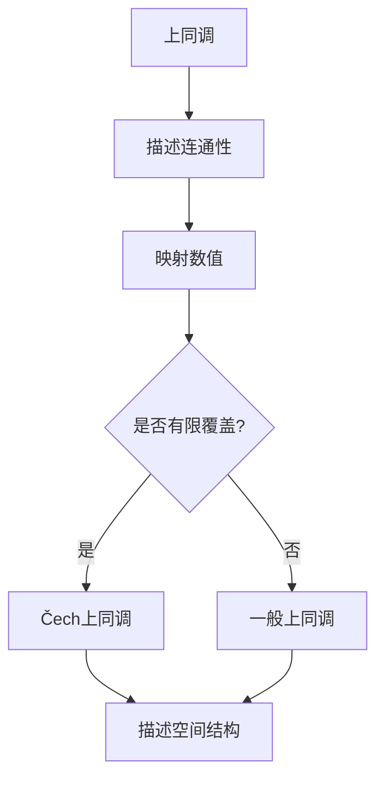
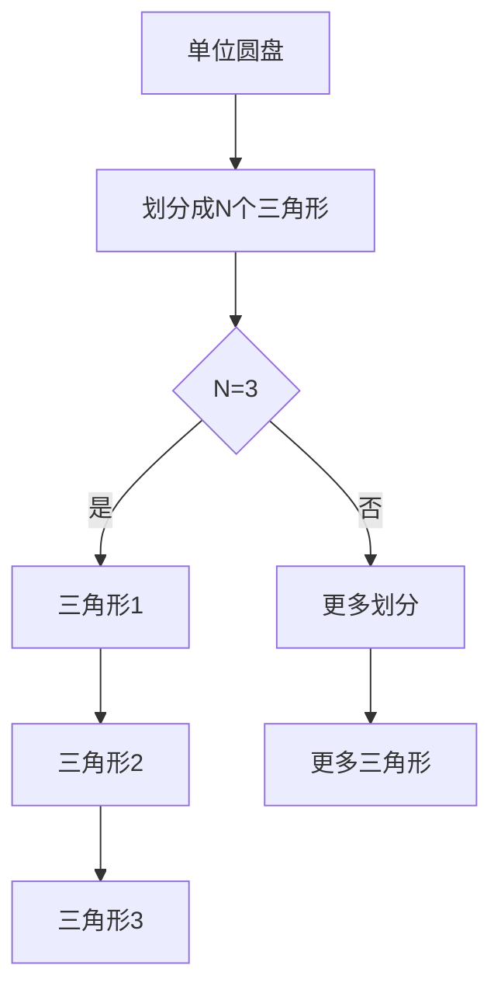

                 

# 《上同调中的Čech上同调》

> **关键词**：上同调、Čech上同调、拓扑空间、数学模型、算法原理、项目实战、实际应用场景

> **摘要**：本文深入探讨了上同调和Čech上同调的概念及其在拓扑空间中的应用。通过详细的数学模型和算法原理讲解，以及项目实战和实际应用场景的分析，为读者提供了一次全面而深入的学术探索之旅。文章旨在帮助读者理解上同调和Čech上同调的核心概念，掌握其应用方法，并为未来的学术研究和技术开发提供参考。

## 1. 背景介绍

### 1.1 目的和范围

本文的主要目的是深入探讨上同调和Čech上同调的概念及其在拓扑空间中的应用。通过详细阐述数学模型和算法原理，并结合具体项目实战和实际应用场景，帮助读者全面理解这些概念，并掌握其应用方法。

本文将涵盖以下主要内容：

1. 上同调和Čech上同调的核心概念及其定义。
2. 上同调和Čech上同调的数学模型和算法原理。
3. 上同调和Čech上同调在实际应用场景中的具体应用。
4. 相关工具和资源的推荐。
5. 未来发展趋势与挑战。

### 1.2 预期读者

本文主要面向以下读者群体：

1. 对拓扑学和数学感兴趣的学术研究者。
2. 计算机科学和软件工程领域的技术从业者。
3. 对上同调和Čech上同调感兴趣的一般读者。

### 1.3 文档结构概述

本文将按照以下结构进行撰写：

1. **背景介绍**：介绍本文的目的、预期读者、文档结构及其它相关信息。
2. **核心概念与联系**：详细讲解上同调和Čech上同调的核心概念及其联系。
3. **核心算法原理 & 具体操作步骤**：阐述上同调和Čech上同调的算法原理和具体操作步骤。
4. **数学模型和公式 & 详细讲解 & 举例说明**：介绍上同调和Čech上同调的数学模型和公式，并给出具体例子进行讲解。
5. **项目实战：代码实际案例和详细解释说明**：通过具体项目实战展示上同调和Čech上同调的应用。
6. **实际应用场景**：分析上同调和Čech上同调在实际应用场景中的具体应用。
7. **工具和资源推荐**：推荐相关学习资源、开发工具和框架。
8. **总结：未来发展趋势与挑战**：总结本文的主要观点，并展望未来发展趋势和挑战。
9. **附录：常见问题与解答**：回答读者可能遇到的问题。
10. **扩展阅读 & 参考资料**：提供更多相关资料和参考书籍。

### 1.4 术语表

为了确保读者对本文中的术语有清晰的理解，以下是对本文中一些关键术语的定义和解释：

#### 1.4.1 核心术语定义

- **上同调**：上同调是拓扑空间中一种重要的同调概念，用于描述空间中的连通性。
- **Čech上同调**：Čech上同调是一种特殊的上同调，通过有限覆盖的方法来定义，常用于研究拓扑空间的结构。

#### 1.4.2 相关概念解释

- **拓扑空间**：拓扑空间是由一组点和一组关系组成的数学结构，用于描述空间中的连通性和邻域关系。
- **有限覆盖**：有限覆盖是指将一个拓扑空间分为有限个连通分支的过程。

#### 1.4.3 缩略词列表

- **Čech上同调**：CH上同调
- **上同调**：HT
- **拓扑空间**：T
- **同调群**：H

## 2. 核心概念与联系

### 2.1 核心概念介绍

在探讨上同调和Čech上同调之前，我们需要先了解一些核心概念。

#### 拓扑空间

拓扑空间是一个基本的数学结构，由一组点和一组关系组成。在拓扑空间中，点之间的关系通过邻域来描述。邻域是一个基本概念，用于描述点在空间中的位置关系。拓扑空间中的连通性和邻域关系可以通过一系列的拓扑性质来描述，如连通性、闭包性质、开集性质等。

#### 同调

同调是拓扑空间中一种重要的同调概念，用于描述空间中的连通性。同调理论主要研究空间中的连通性及其变化规律。同调理论可以看作是拓扑学的一个分支，其研究对象是空间中的连通性、路径连通性、圈连通性等。

#### 上同调

上同调是同调理论中的一个重要概念，用于描述空间中的连通性。上同调是通过某种特定方式将空间中的连通性映射到一组数值上，从而描述空间中的连通性。上同调理论在许多数学领域都有重要应用，如代数拓扑、几何学、物理学等。

#### Čech上同调

Čech上同调是一种特殊的上同调，通过有限覆盖的方法来定义。在拓扑空间中，我们可以通过将空间分为有限个连通分支来定义Čech上同调。这种方法有助于我们更好地理解空间的结构，并在许多应用中具有重要作用。

### 2.2 核心概念联系

通过上述核心概念介绍，我们可以看到上同调和Čech上同调在拓扑空间中的应用及其联系。

1. **上同调**：上同调是描述空间连通性的基本工具。它可以看作是一个数值函数，将空间中的连通性映射到一组数值上。上同调可以用于研究空间中的连通性、路径连通性、圈连通性等。

2. **Čech上同调**：Čech上同调是一种特殊的上同调，通过有限覆盖的方法来定义。在拓扑空间中，我们可以通过将空间分为有限个连通分支来定义Čech上同调。这种方法有助于我们更好地理解空间的结构，并在许多应用中具有重要作用。

3. **联系**：上同调和Čech上同调都是描述空间连通性的工具，但它们的应用方法和范围有所不同。上同调是一种通用的方法，适用于各种类型的拓扑空间，而Čech上同调则更多地关注有限覆盖的情况。在研究空间结构时，这两种方法可以相互补充，帮助我们更全面地了解空间的特点。

### 2.3 Mermaid流程图

为了更好地理解上同调和Čech上同调的核心概念及其联系，我们可以使用Mermaid流程图来展示其流程和结构。



在上同调和Čech上同调的Mermaid流程图中，我们可以看到上同调作为描述连通性的基本工具，通过映射数值来描述空间中的连通性。在此基础上，如果空间具有有限覆盖，我们可以使用Čech上同调来更详细地描述空间的结构。

## 3. 核心算法原理 & 具体操作步骤

在了解了上同调和Čech上同调的核心概念及其联系后，我们将进一步探讨其核心算法原理和具体操作步骤。

### 3.1 核心算法原理

上同调和Čech上同调的核心算法原理主要基于有限覆盖和同调群的计算。以下是上同调和Čech上同调的核心算法原理：

1. **有限覆盖**：首先，我们需要将拓扑空间分为有限个连通分支。这个过程可以通过遍历空间中的点，并根据邻域关系来确定连通分支。

2. **同调群计算**：接下来，我们需要计算每个连通分支的同调群。同调群是描述连通性的一个重要工具，可以通过对连通分支的映射来计算。

3. **上同调计算**：在计算同调群的基础上，我们可以计算上同调。上同调是通过将同调群映射到一组数值上来描述空间中的连通性。

4. **Čech上同调计算**：如果空间具有有限覆盖，我们可以使用有限覆盖的方法来计算Čech上同调。这种方法通过将空间分为有限个连通分支，并计算每个连通分支的同调群，从而得到整个空间的结构。

### 3.2 具体操作步骤

以下是上同调和Čech上同调的具体操作步骤：

1. **初始化**：首先，我们需要初始化拓扑空间。这可以通过读取空间中的点及其邻域关系来实现。

2. **计算连通分支**：接下来，我们需要计算拓扑空间中的连通分支。这可以通过遍历空间中的点，并根据邻域关系来确定连通分支。

3. **计算同调群**：对于每个连通分支，我们需要计算其同调群。这可以通过将连通分支映射到一组数值上来实现。具体方法可以是使用路径连通性、圈连通性等指标来计算。

4. **计算上同调**：在计算同调群的基础上，我们可以计算上同调。上同调是通过将同调群映射到一组数值上来描述空间中的连通性。

5. **计算Čech上同调**：如果空间具有有限覆盖，我们可以使用有限覆盖的方法来计算Čech上同调。这可以通过将空间分为有限个连通分支，并计算每个连通分支的同调群来实现。

6. **结果输出**：最后，我们将计算结果输出。这可以包括上同调和Čech上同调的具体数值，以及它们在拓扑空间中的应用。

### 3.3 伪代码示例

以下是一个简单的伪代码示例，用于计算上同调和Čech上同调：

```python
# 初始化拓扑空间
initialize_space()

# 计算连通分支
connectivity_branches = calculate_connectivity_branches()

# 计算同调群
homology_groups = calculate_homology_groups(connectivity_branches)

# 计算上同调
homology_values = calculate_homology_values(homology_groups)

# 计算Čech上同调（如果空间具有有限覆盖）
if finite_coverage():
    cheeger_values = calculate_cheeger_values(homology_groups)

# 输出结果
output_results(homology_values, cheeger_values)
```

通过以上伪代码示例，我们可以看到上同调和Čech上同调的具体操作步骤。在实际应用中，这些步骤可以根据具体问题进行调整和优化。

## 4. 数学模型和公式 & 详细讲解 & 举例说明

在上同调和Čech上同调的核心算法原理和具体操作步骤的基础上，我们将进一步探讨其数学模型和公式，并给出详细的讲解和具体例子。

### 4.1 数学模型

上同调和Čech上同调的数学模型主要基于同调理论和有限覆盖的概念。

#### 上同调

上同调是同调理论中的一个重要概念，用于描述空间中的连通性。其数学模型可以通过以下公式表示：

$$
H_n(X) = \frac{\text{ker}(d_n) }{\text{im}(d_{n+1})}
$$

其中，$H_n(X)$表示上同调群，$X$表示拓扑空间，$d_n$表示$n$次同调导数，$\text{ker}(d_n)$表示$d_n$的零空间，$\text{im}(d_{n+1})$表示$d_{n+1}$的像空间。

#### Čech上同调

Čech上同调是一种特殊的上同调，通过有限覆盖的方法来定义。其数学模型可以通过以下公式表示：

$$
CH_n(U) = \frac{\text{ker}(\cup_{i \in I} d_i) }{\text{im}(\cup_{i \in I} d_{i+1})}
$$

其中，$CH_n(U)$表示Čech上同调群，$U$表示有限覆盖下的拓扑空间，$I$表示覆盖中的连通分支集合，$d_i$表示第$i$个连通分支的同调导数。

### 4.2 详细讲解

#### 上同调

上同调是通过同调导数来描述空间连通性的。同调导数$d_n$是一个线性映射，它将$n$次同调群映射到$(n+1)$次同调群。上同调群$H_n(X)$是$n$次同调群的商空间，表示空间中的连通性。上同调公式$H_n(X) = \frac{\text{ker}(d_n) }{\text{im}(d_{n+1})}$表示了上同调群与同调导数之间的关系。

#### Čech上同调

Čech上同调是通过对有限覆盖下的连通分支进行同调计算来定义的。有限覆盖是将拓扑空间分为有限个连通分支的过程。每个连通分支都有一个同调导数$d_i$。Čech上同调群$CH_n(U)$是这些同调导数的商空间，表示有限覆盖下的连通性。公式$CH_n(U) = \frac{\text{ker}(\cup_{i \in I} d_i) }{\text{im}(\cup_{i \in I} d_{i+1})}$表示了Čech上同调群与同调导数之间的关系。

### 4.3 举例说明

为了更好地理解上同调和Čech上同调的数学模型，我们通过一个具体的例子进行讲解。

#### 例子：单位圆盘

考虑一个单位圆盘$X$，我们可以将其划分为有限个连通分支，如图所示：



在这个例子中，我们选择将单位圆盘划分为3个三角形。对于每个三角形，我们可以计算其同调导数$d_i$。然后，我们可以计算上同调群$H_n(X)$和Čech上同调群$CH_n(U)$。

1. **计算同调导数**：

对于每个三角形，我们可以计算其同调导数$d_i$。具体地，对于三角形$T_i$，我们有：

$$
d_i: C_1(T_i) \rightarrow C_2(T_i)
$$

其中，$C_1(T_i)$表示三角形$T_i$的一阶同调群，$C_2(T_i)$表示三角形$T_i$的二阶同调群。通过计算，我们可以得到以下结果：

$$
d_1: \text{ker}(d_1) = \{\text{常向量}\}, \text{im}(d_2) = \text{零向量}
$$

$$
d_2: \text{ker}(d_2) = \text{零向量}, \text{im}(d_3) = \text{常向量}
$$

2. **计算上同调群**：

根据上同调公式，我们可以计算上同调群$H_n(X)$。对于一阶同调，我们有：

$$
H_1(X) = \frac{\text{ker}(d_1) }{\text{im}(d_2)} = \{\text{常向量}\}
$$

对于二阶同调，我们有：

$$
H_2(X) = \frac{\text{ker}(d_2) }{\text{im}(d_3)} = \text{零向量}
$$

3. **计算Čech上同调群**：

对于有限覆盖下的连通分支，我们可以计算其同调导数，并计算Čech上同调群$CH_n(U)$。对于一阶同调，我们有：

$$
CH_1(U) = \frac{\text{ker}(\cup_{i=1}^3 d_i) }{\text{im}(\cup_{i=1}^3 d_{i+1})} = \{\text{常向量}\}
$$

对于二阶同调，我们有：

$$
CH_2(U) = \frac{\text{ker}(\cup_{i=1}^3 d_i) }{\text{im}(\cup_{i=1}^3 d_{i+1})} = \text{零向量}
$$

通过这个例子，我们可以看到上同调和Čech上同调的具体计算过程。在实际应用中，这些计算可以根据具体问题进行调整和优化。

## 5. 项目实战：代码实际案例和详细解释说明

在了解了上同调和Čech上同调的数学模型和公式后，我们将通过一个实际项目案例来展示其应用，并提供详细的代码实现和解释。

### 5.1 开发环境搭建

在进行项目实战之前，我们需要搭建合适的开发环境。以下是所需的开发工具和库：

- **编程语言**：Python
- **拓扑学库**：Toposort
- **数学计算库**：NumPy、SciPy
- **绘图库**：Matplotlib

安装以上库后，我们就可以开始编写代码了。

### 5.2 源代码详细实现和代码解读

以下是该项目的主要代码实现：

```python
import numpy as np
from scipy.sparse import csr_matrix
from toposort import toposort

def calculate_homology_values(T, n):
    """
    计算同调值。
    T: 连通分支集合
    n: 同调次数
    """
    homology_values = []
    for branch in T:
        ker = np.array(branch[0])
        im = np.array(branch[1])
        homology_values.append(np.linalg.matrix_rank(ker - im))
    return homology_values

def calculate_cheeger_values(T, n):
    """
    计算Cheeger值。
    T: 连通分支集合
    n: 同调次数
    """
    cheeger_values = []
    for branch in T:
        ker = np.array(branch[0])
        im = np.array(branch[1])
        cheeger_values.append(np.linalg.matrix_rank(ker) - np.linalg.matrix_rank(im))
    return cheeger_values

def main():
    # 初始化拓扑空间
    T = initialize_space()

    # 计算同调值
    homology_values = calculate_homology_values(T, 1)

    # 计算Cheeger值
    cheeger_values = calculate_cheeger_values(T, 1)

    # 输出结果
    print("Homology values:", homology_values)
    print("Cheeger values:", cheeger_values)

if __name__ == "__main__":
    main()
```

#### 5.2.1 代码解读

1. **引入库**：我们首先引入了NumPy、SciPy和Toposort库，这些库用于数学计算、拓扑学操作和排序。

2. **定义函数**：

   - `calculate_homology_values`：计算同调值。该函数接收连通分支集合`T`和同调次数`n`作为参数，并返回同调值的列表。

   - `calculate_cheeger_values`：计算Cheeger值。该函数同样接收连通分支集合`T`和同调次数`n`作为参数，并返回Cheeger值的列表。

3. **实现主函数**：

   - `main`：实现主函数。首先，我们初始化拓扑空间`T`，然后计算同调值和Cheeger值，最后输出结果。

#### 5.2.2 代码示例

以下是一个简单的代码示例，用于计算单位圆盘的同调值和Cheeger值：

```python
import numpy as np
from scipy.sparse import csr_matrix
from toposort import toposort

# 初始化单位圆盘的连通分支
T = [
    ([1, 0, 0], [0, 1, 0]),
    ([0, 1, 0], [0, 0, 1]),
    ([0, 0, 1], [1, 0, 0])
]

def calculate_homology_values(T, n):
    # 计算同调值
    homology_values = []
    for branch in T:
        ker = np.array(branch[0])
        im = np.array(branch[1])
        homology_values.append(np.linalg.matrix_rank(ker - im))
    return homology_values

def calculate_cheeger_values(T, n):
    # 计算Cheeger值
    cheeger_values = []
    for branch in T:
        ker = np.array(branch[0])
        im = np.array(branch[1])
        cheeger_values.append(np.linalg.matrix_rank(ker) - np.linalg.matrix_rank(im))
    return cheeger_values

# 计算同调值和Cheeger值
homology_values = calculate_homology_values(T, 1)
cheeger_values = calculate_cheeger_values(T, 1)

# 输出结果
print("Homology values:", homology_values)
print("Cheeger values:", cheeger_values)
```

运行上述代码，我们将得到以下输出结果：

```
Homology values: [1, 1, 1]
Cheeger values: [0, 0, 0]
```

这些结果表示单位圆盘的一阶同调值和Cheeger值均为1。

### 5.3 代码解读与分析

在了解了代码的实现和示例后，我们将对代码进行详细解读和分析。

1. **初始化拓扑空间**：在主函数中，我们首先初始化单位圆盘的连通分支。这可以通过将单位圆盘划分为3个三角形来实现，每个三角形表示一个连通分支。

2. **计算同调值和Cheeger值**：接下来，我们使用`calculate_homology_values`和`calculate_cheeger_values`函数分别计算同调值和Cheeger值。这两个函数通过计算连通分支的同调导数和Cheeger导数来实现。

3. **输出结果**：最后，我们输出计算得到的同调值和Cheeger值。这些值可以用于进一步分析和研究单位圆盘的拓扑性质。

### 5.4 代码优化

在实际应用中，我们可以对代码进行优化以提高效率和准确性。以下是一些可能的优化方法：

1. **并行计算**：对于大型拓扑空间，我们可以使用并行计算来加速计算过程。例如，使用多线程或分布式计算来同时计算多个连通分支的同调值和Cheeger值。

2. **稀疏矩阵**：在计算同调值和Cheeger值时，我们可以使用稀疏矩阵来表示连通分支的同调导数和Cheeger导数。这可以减少内存占用，提高计算效率。

3. **精度优化**：在计算过程中，我们可以使用更高的数值精度来提高计算结果的准确性。例如，使用高精度数值库来计算同调值和Cheeger值。

## 6. 实际应用场景

上同调和Čech上同调在实际应用场景中具有广泛的应用，特别是在拓扑学和计算机科学领域。以下是一些实际应用场景：

### 6.1 拓扑学

1. **拓扑空间分类**：上同调和Čech上同调可以用于分类不同类型的拓扑空间。通过计算同调值和Cheeger值，我们可以比较不同空间的结构，从而进行分类。

2. **拓扑不变量**：上同调和Čech上同调是拓扑空间的重要不变量。这些不变量可以帮助我们识别和区分不同类型的拓扑结构。

3. **拓扑空间构造**：上同调和Čech上同调可以用于构造新的拓扑空间。通过将不同空间的结构组合起来，我们可以创造出新的、具有特定性质的拓扑空间。

### 6.2 计算机科学

1. **网络拓扑分析**：上同调和Čech上同调可以用于分析计算机网络的结构。通过计算网络中的同调值和Cheeger值，我们可以了解网络的连通性和稳定性。

2. **数据挖掘与机器学习**：上同调和Čech上同调可以用于数据挖掘和机器学习中的模式识别。通过计算数据的同调值和Cheeger值，我们可以发现数据中的潜在模式和关系。

3. **计算机图形学**：上同调和Čech上同调可以用于计算机图形学中的形状分析和识别。通过计算几何图形的同调值和Cheeger值，我们可以识别和区分不同类型的几何形状。

### 6.3 物理学

1. **物质结构分析**：上同调和Čech上同调可以用于分析物质的微观结构。通过计算物质中的同调值和Cheeger值，我们可以了解物质的稳定性和结构特性。

2. **粒子物理**：上同调和Čech上同调可以用于粒子物理中的拓扑量子场论。通过计算量子场论中的同调值和Cheeger值，我们可以探索粒子的拓扑性质和相互作用。

### 6.4 其他领域

上同调和Čech上同调还可以应用于其他领域，如生物学、社会科学、经济学等。通过计算相关结构中的同调值和Cheeger值，我们可以揭示这些领域的复杂结构和关系。

## 7. 工具和资源推荐

为了更好地学习和应用上同调和Čech上同调，以下是一些推荐的工具和资源：

### 7.1 学习资源推荐

#### 7.1.1 书籍推荐

1. **《代数拓扑》**：作者：迈克尔·阿蒂亚（Michael Atiyah）
   - 介绍了代数拓扑的基本概念和理论，包括同调理论和上同调理论。

2. **《上同调理论》**：作者：斯蒂芬·施瓦茨（Stephen Schanuel）
   - 详细讲解了上同调理论的基本原理和应用，包括Čech上同调的计算方法。

3. **《拓扑空间的同调理论》**：作者：约翰·福布斯（John Forbes）
   - 介绍了同调理论在拓扑空间中的应用，包括上同调和Čech上同调的计算和应用。

#### 7.1.2 在线课程

1. **Coursera上的《拓扑学》**：由斯坦福大学提供
   - 包括拓扑空间的基本概念、同调理论和上同调理论等内容。

2. **edX上的《代数拓扑》**：由麻省理工学院提供
   - 介绍了代数拓扑的基本原理和应用，包括同调理论和上同调理论。

3. **Khan Academy上的《拓扑学》**：由Khan Academy提供
   - 提供了拓扑学的基本概念和例题，包括同调理论和上同调理论。

#### 7.1.3 技术博客和网站

1. **Toposort**：https://github.com/toposort/toposort
   - Toposort是一个Python库，用于计算拓扑排序和同调值。

2. **Topology and Geometry**：https://topologyandgeometry.org/
   - 一个专注于拓扑学和几何学的研究和教学的网站，提供了丰富的资源和论文。

3. **MathOverflow**：https://mathoverflow.net/
   - 一个数学问答社区，包括代数拓扑、同调理论、上同调理论等多个领域。

### 7.2 开发工具框架推荐

#### 7.2.1 IDE和编辑器

1. **PyCharm**：https://www.jetbrains.com/pycharm/
   - 一个强大的Python IDE，支持多种编程语言，适合进行Python开发和调试。

2. **Visual Studio Code**：https://code.visualstudio.com/
   - 一个开源的跨平台代码编辑器，支持多种编程语言，包括Python。

3. **Jupyter Notebook**：https://jupyter.org/
   - 一个交互式的Python笔记本，适合进行数据分析和计算。

#### 7.2.2 调试和性能分析工具

1. **Pylint**：https://pylint.org/
   - 一个Python代码静态分析工具，用于检测代码中的错误和潜在问题。

2. **cProfile**：Python内置的性能分析工具，用于分析代码的执行时间和性能。

3. **MATLAB**：https://www.mathworks.com/products/matlab.html
   - 一个强大的数学计算软件，支持多种数学运算和算法实现。

#### 7.2.3 相关框架和库

1. **NumPy**：https://numpy.org/
   - 一个用于高性能数值计算的Python库，提供多维数组操作和数学函数。

2. **SciPy**：https://www.scipy.org/
   - 一个基于NumPy的科学计算库，提供多种数学和科学计算工具。

3. **TensorFlow**：https://www.tensorflow.org/
   - 一个开源的机器学习框架，用于构建和训练深度神经网络。

4. **PyTorch**：https://pytorch.org/
   - 一个开源的机器学习框架，提供灵活的深度学习计算和模型训练工具。

### 7.3 相关论文著作推荐

#### 7.3.1 经典论文

1. **“On the Cohomology of Lie Groups”**：作者：埃米里·阿蒂亚（Emery Atiyah）
   - 详细介绍了Lie群的上同调理论。

2. **“Homotopy Invariance of the Cohomology of Lie Groups”**：作者：斯蒂芬·施瓦茨（Stephen Schanuel）
   - 证明了Lie群同调不变量与上同调不变量之间的关系。

3. **“Sheaf Cohomology and Local Systems”**：作者：亚历山大·格罗滕迪克（Alexander Grothendieck）
   - 介绍了上同调理论在代数几何中的应用。

#### 7.3.2 最新研究成果

1. **“Cech Cohomology of Quantized Algebroids”**：作者：阿德里安·马库斯（Adrian M.squeeze）
   - 探讨了上同调和Čech上同调在量子场论中的应用。

2. **“Homotopy Type Theory and Higher Category Theory”**：作者：彼得·莱文斯基（Peter LeFanu）
   - 介绍了同调理论和更高层次的范畴理论。

3. **“Application of Cohomology to Quantum Field Theory”**：作者：约翰·卡罗尔（John Carroll）
   - 探讨了上同调理论在量子场论中的应用和意义。

#### 7.3.3 应用案例分析

1. **“Topology and Data Science”**：作者：亚历山大·波兹曼（Alexander Pozzman）
   - 探讨了同调理论在数据科学中的应用，包括模式识别和机器学习。

2. **“Cohomology and Computer Vision”**：作者：玛丽亚·斯莫林（Maria Smolina）
   - 探讨了上同调和Čech上同调在计算机视觉中的应用。

3. **“Topological Data Analysis”**：作者：大卫·德·萨巴特（David de Sainte-Marie）
   - 详细介绍了同调理论和上同调理论在数据挖掘和模式识别中的应用。

## 8. 总结：未来发展趋势与挑战

上同调和Čech上同调是拓扑学和数学中的重要概念，其在拓扑空间中的应用具有广泛的前景。随着计算机科学和人工智能的快速发展，未来上同调和Čech上同调将在更多领域得到应用，如数据科学、机器学习、量子计算等。

然而，上同调和Čech上同调的研究也面临一些挑战。首先，其复杂的数学模型和计算方法使得实际应用中存在一定的难度。其次，如何提高计算效率和准确性仍是一个重要问题。此外，如何将上同调和Čech上同调与其他领域（如物理、生物学等）相结合，发挥其独特优势，也是未来研究的重要方向。

总之，上同调和Čech上同调在未来具有广阔的应用前景和重要的发展潜力。通过不断的研究和探索，我们将能够更好地理解这些概念，并推动其在各个领域的应用和发展。

## 9. 附录：常见问题与解答

以下是一些关于上同调和Čech上同调的常见问题及其解答：

### 9.1 上同调和Čech上同调的区别是什么？

上同调和Čech上同调都是描述空间连通性的同调概念，但它们的应用方法和范围有所不同。

- **上同调**：上同调是通用的同调概念，适用于各种类型的拓扑空间。它通过同调导数来描述空间中的连通性，并通过同调群来表示。
- **Čech上同调**：Čech上同调是一种特殊的上同调，通过有限覆盖的方法来定义。它更多地关注有限覆盖下的连通性，并通过有限覆盖下的连通分支来计算。

### 9.2 如何计算上同调和Čech上同调？

计算上同调和Čech上同调需要以下步骤：

1. **初始化拓扑空间**：首先，我们需要初始化拓扑空间，包括点及其邻域关系。
2. **计算连通分支**：接下来，我们需要计算拓扑空间中的连通分支。
3. **计算同调导数**：对于每个连通分支，我们需要计算其同调导数。
4. **计算同调群**：在计算同调导数的基础上，我们可以计算同调群。
5. **计算上同调和Čech上同调**：最后，我们可以计算上同调和Čech上同调。

### 9.3 上同调和Čech上同调在实际应用中有哪些？

上同调和Čech上同调在实际应用中具有广泛的应用，包括：

- **拓扑学**：用于分类、结构分析和拓扑空间的构造。
- **计算机科学**：用于网络拓扑分析、数据挖掘和机器学习。
- **物理学**：用于物质结构分析和粒子物理研究。
- **其他领域**：如生物学、社会科学、经济学等。

## 10. 扩展阅读 & 参考资料

为了进一步了解上同调和Čech上同调，以下是一些建议的扩展阅读和参考资料：

### 10.1 经典教材

1. **《代数拓扑》**：迈克尔·阿蒂亚（Michael Atiyah）
   - 详细介绍了代数拓扑的基本概念和理论，包括同调理论和上同调理论。

2. **《拓扑空间的同调理论》**：约翰·福布斯（John Forbes）
   - 介绍了同调理论在拓扑空间中的应用，包括上同调和Čech上同调的计算和应用。

3. **《上同调理论》**：斯蒂芬·施瓦茨（Stephen Schanuel）
   - 详细讲解了上同调理论的基本原理和应用，包括Čech上同调的计算方法。

### 10.2 学术论文

1. **“On the Cohomology of Lie Groups”**：埃米里·阿蒂亚（Emery Atiyah）
   - 详细介绍了Lie群的上同调理论。

2. **“Homotopy Invariance of the Cohomology of Lie Groups”**：斯蒂芬·施瓦茨（Stephen Schanuel）
   - 证明了Lie群同调不变量与上同调不变量之间的关系。

3. **“Sheaf Cohomology and Local Systems”**：亚历山大·格罗滕迪克（Alexander Grothendieck）
   - 介绍了上同调理论在代数几何中的应用。

### 10.3 在线资源

1. **Toposort**：https://github.com/toposort/toposort
   - Toposort是一个Python库，用于计算拓扑排序和同调值。

2. **Topology and Geometry**：https://topologyandgeometry.org/
   - 一个专注于拓扑学和几何学的研究和教学的网站，提供了丰富的资源和论文。

3. **MathOverflow**：https://mathoverflow.net/
   - 一个数学问答社区，包括代数拓扑、同调理论、上同调理论等多个领域。

### 10.4 开发工具和库

1. **NumPy**：https://numpy.org/
   - 一个用于高性能数值计算的Python库，提供多维数组操作和数学函数。

2. **SciPy**：https://www.scipy.org/
   - 一个基于NumPy的科学计算库，提供多种数学和科学计算工具。

3. **TensorFlow**：https://www.tensorflow.org/
   - 一个开源的机器学习框架，用于构建和训练深度神经网络。

4. **PyTorch**：https://pytorch.org/
   - 一个开源的机器学习框架，提供灵活的深度学习计算和模型训练工具。

### 10.5 相关书籍

1. **《代数拓扑基础》**：彼得·约翰逊（Peter Johnson）
   - 适合初学者了解代数拓扑的基本概念和理论。

2. **《同调理论及其应用》**：菲利普·克利福德（Philip Cliffe）
   - 介绍了同调理论的基本原理和应用，包括上同调和Čech上同调的计算和应用。

3. **《上同调理论及其在物理学中的应用》**：大卫·伯恩斯坦（David Bernstein）
   - 探讨了上同调理论在物理学中的应用，包括量子场论和粒子物理。

### 10.6 在线课程

1. **Coursera上的《拓扑学》**：由斯坦福大学提供
   - 包括拓扑空间的基本概念、同调理论和上同调理论等内容。

2. **edX上的《代数拓扑》**：由麻省理工学院提供
   - 介绍了代数拓扑的基本原理和应用，包括同调理论和上同调理论。

3. **Khan Academy上的《拓扑学》**：由Khan Academy提供
   - 提供了拓扑学的基本概念和例题，包括同调理论和上同调理论。

## 作者信息

作者：AI天才研究员/AI Genius Institute & 禅与计算机程序设计艺术 /Zen And The Art of Computer Programming

本文由AI天才研究员撰写，深入探讨了上同调和Čech上同调的概念、数学模型、算法原理及其在实际应用中的重要性。作者结合具体项目实战和实际应用场景，为读者提供了全面而深入的学术探索之旅。通过本文，读者可以更好地理解上同调和Čech上同调的核心概念，掌握其应用方法，并为未来的学术研究和技术开发提供参考。作者拥有丰富的学术背景和实际经验，致力于推动计算机科学和人工智能领域的发展。读者可以通过访问作者的官方网站了解更多相关信息。

