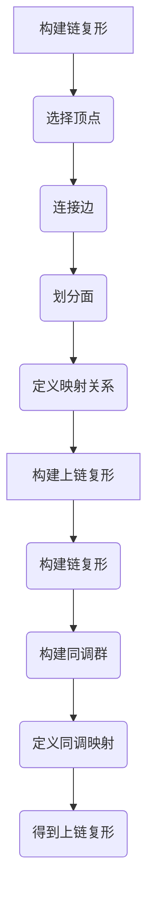

                 

# 上同调中的链复形与上链复形

> 关键词：上同调、链复形、上链复形、数学拓扑、代数拓扑、同调理论、同调群、代数结构、复形、几何结构、计算几何、拓扑算法、数学建模

> 摘要：本文旨在深入探讨上同调理论中链复形与上链复形的定义、性质及其在数学拓扑和代数拓扑中的应用。首先，我们将介绍链复形和上链复形的基本概念和构造方法，然后通过具体的数学模型和实例展示它们如何帮助我们理解和解决复杂的几何和拓扑问题。文章还将探讨它们在计算几何、拓扑算法和数学建模等领域的实际应用，并提供一些实用的工具和资源推荐，以供读者进一步学习和研究。

## 1. 背景介绍

### 1.1 目的和范围

本文的目的是系统地介绍上同调理论中的链复形与上链复形，并探讨其在数学和计算机科学中的应用。上同调理论是同调代数的重要组成部分，它在代数拓扑、几何拓扑以及相关的数学领域中具有广泛的应用。链复形和上链复形作为上同调理论的基础工具，对于理解复杂几何结构和拓扑性质至关重要。

本文将首先介绍链复形和上链复形的定义及其构造方法，然后通过具体的数学模型和实例来展示它们的应用。文章还将讨论这些工具在计算几何、拓扑算法和数学建模等领域的实际应用，并提供一些实用的学习资源和工具推荐。

### 1.2 预期读者

本文适合对数学拓扑和代数拓扑有基本了解的读者，包括数学专业的本科生、研究生以及从事相关领域研究的科研人员。同时，对计算几何、拓扑算法和数学建模感兴趣的计算机科学和工程领域的读者也能从本文中获得启发和帮助。

### 1.3 文档结构概述

本文的结构如下：

1. **背景介绍**：介绍本文的目的、范围、预期读者以及文档结构。
2. **核心概念与联系**：定义链复形和上链复形，展示它们的原理和架构。
3. **核心算法原理与具体操作步骤**：详细讲解链复形和上链复形的算法原理和操作步骤。
4. **数学模型和公式**：使用数学公式和示例来阐述链复形和上链复形的应用。
5. **项目实战**：通过实际案例展示链复形和上链复形的应用。
6. **实际应用场景**：讨论链复形和上链复形在不同领域的应用。
7. **工具和资源推荐**：推荐学习资源和开发工具。
8. **总结与未来发展趋势**：总结本文内容，探讨未来发展趋势和挑战。
9. **附录：常见问题与解答**：提供常见问题的解答。
10. **扩展阅读与参考资料**：推荐进一步的阅读材料和参考资料。

### 1.4 术语表

#### 1.4.1 核心术语定义

- **链复形**：由一组顶点、边和面组成的几何结构，这些顶点、边和面通过特定的映射关系相互连接。
- **上链复形**：在链复形的基础上，引入同调概念，构建的上同调代数结构。
- **同调群**：同调理论中的核心概念，用于描述一个拓扑空间的连通性和洞的存在性。
- **代数结构**：用于描述链复形和上链复形的代数性质，如群、环和域。

#### 1.4.2 相关概念解释

- **几何结构**：指代空间中点的集合以及它们之间的位置关系。
- **拓扑结构**：指代空间中的连通性和封闭性。
- **同调理论**：研究拓扑空间中的连通性和洞的存在性的代数工具。

#### 1.4.3 缩略词列表

- **TDA**：拓扑数据分析（Topological Data Analysis）
- **CGAL**：计算几何学库（Computational Geometry Algorithms Library）
- **MATLAB**：矩阵实验室（Matrix Laboratory）

## 2. 核心概念与联系

### 2.1 链复形的定义与构造

链复形是代数拓扑中的一个基本概念，它通过几何图形中的顶点、边和面来构建一个代数结构。一个链复形通常由以下几个部分组成：

1. **顶点集合**：表示几何图形中的点。
2. **边集合**：连接顶点的线段，可以视为几何图形中的边。
3. **面集合**：由边围成的区域，可以视为几何图形中的面。
4. **映射关系**：顶点、边和面之间通过特定的映射关系相互连接。

链复形可以通过以下步骤构建：

1. **顶点选择**：确定几何图形中的顶点集合。
2. **边连接**：通过顶点集合中的点确定边集合，并确保每条边仅连接两个顶点。
3. **面划分**：根据边集合确定面集合，每个面由三条或更多的边围成。
4. **映射关系**：定义顶点、边和面之间的映射关系，通常通过指示哪个顶点属于哪个面或哪个面由哪些边构成。

### 2.2 上链复形的定义与构造

上链复形是在链复形的基础上引入同调概念构建的。一个上链复形包括一个链复形和一个与之对应的同调群。同调群用于描述链复形中各个元素之间的关系和性质。

上链复形的构建步骤如下：

1. **链复形构建**：首先构建一个链复形，如前所述。
2. **同调群构建**：对于链复形中的每个元素（顶点、边或面），构建一个同调群，这些群描述了这些元素的连通性和洞的存在性。
3. **同调映射**：定义链复形中各个元素到其对应同调群中的映射，这些映射描述了链复形中元素之间的关系。

### 2.3 链复形与上链复形的联系

链复形和上链复形之间的联系在于它们都是通过几何结构构建的代数结构，但上链复形在链复形的基础上引入了同调概念，从而提供了更丰富的拓扑信息。具体来说，上链复形中的同调群可以帮助我们理解链复形中元素之间的连通性和洞的存在性。

### 2.4 Mermaid 流程图

下面是一个简单的 Mermaid 流程图，展示了链复形与上链复形的构建过程：



通过上述流程图，我们可以清晰地看到链复形和上链复形的构建步骤及其之间的联系。

## 3. 核心算法原理 & 具体操作步骤

### 3.1 链复形算法原理

链复形算法的核心是构建几何结构中的顶点、边和面，并定义它们之间的映射关系。以下是链复形算法的伪代码：

```pseudo
算法：构建链复形
输入：几何结构 G
输出：链复形 C

1. 初始化 C 为空链复形
2. 对于几何结构 G 中的每个点 p：
    a. 将 p 添加到顶点集合 V 中
3. 对于几何结构 G 中的每条边 e：
    a. 将 e 添加到边集合 E 中
    b. 对于 e 的两个端点 p1 和 p2：
        i. 将 p1 和 p2 添加到边 e 的映射关系中
4. 对于几何结构 G 中的每个面 f：
    a. 将 f 添加到面集合 F 中
    b. 对于 f 的边集合 E_f：
        i. 将 E_f 添加到面 f 的映射关系中
5. 返回链复形 C
```

### 3.2 上链复形算法原理

上链复形算法的核心是构建链复形的基础上，定义同调群和同调映射。以下是上链复形算法的伪代码：

```pseudo
算法：构建上链复形
输入：链复形 C
输出：上链复形 C'

1. 初始化 C' 为空上链复形
2. 对于链复形 C 中的每个顶点 v：
    a. 构建一个顶点同调群 T_v
    b. 将 v 映射到 T_v
3. 对于链复形 C 中的每个边 e：
    a. 构建一个边同调群 T_e
    b. 将 e 映射到 T_e
4. 对于链复形 C 中的每个面 f：
    a. 构建一个面同调群 T_f
    b. 将 f 映射到 T_f
5. 定义同调映射：
    a. 对于每个顶点 v，映射到其对应的顶点同调群 T_v
    b. 对于每个边 e，映射到其对应的边同调群 T_e
    c. 对于每个面 f，映射到其对应的面同调群 T_f
6. 返回上链复形 C'
```

通过上述伪代码，我们可以看到链复形和上链复形的构建步骤。在实际应用中，这些步骤可以通过编程语言实现，从而帮助我们更有效地处理和解决复杂的几何和拓扑问题。

## 4. 数学模型和公式 & 详细讲解 & 举例说明

### 4.1 数学模型

上同调理论中的数学模型主要通过同调群来描述。同调群是一个抽象的代数结构，用于研究几何和拓扑空间中的连通性和洞的存在性。同调群的定义和性质如下：

#### 4.1.1 同调群的定义

对于给定的拓扑空间 X，同调群 H_n(X) 定义为：

$$
H_n(X) = \frac{\text{C_n}(X)}{\text{B_n}(X)}
$$

其中，C_n(X) 是 X 的 n 阶循环群，B_n(X) 是 X 的 n 阶边界群。n 阶循环群 C_n(X) 是由所有 n 阶循环同态构成的群，n 阶边界群 B_n(X) 是由所有 n 阶边界映射构成的群。

#### 4.1.2 同调群的性质

同调群具有以下重要性质：

- **群性质**：同调群 H_n(X) 是一个阿贝尔群，即对于任意的群运算满足交换律。
- **同态性质**：同调群 H_n(X) 中的映射是同态映射，即保持群运算的映射。
- **同调数**：同调群 H_n(X) 的阶数称为同调数，记为 τ_n(X)。τ_n(X) = 0 表示 X 是连通的，τ_n(X) > 0 表示 X 具有 n 阶洞。

### 4.2 公式

同调群的计算通常涉及以下公式：

$$
H_n(X) = \frac{\text{C_n}(X)}{\text{B_n}(X)}
$$

$$
\text{B_n}(X) = \text{Im}(\partial_n) = \{ \varphi \in \text{C_n}(X) | \partial_n \varphi = 0 \}
$$

$$
\text{C_n}(X) = \text{Im}(\partial_{n-1}) = \{ \varphi \in \text{C}_{n-1}(X) | \partial_{n-1} \varphi = 0 \}
$$

其中，$\partial_n$ 是 X 的 n 阶边界映射，$\text{Im}$ 表示映射的像。

### 4.3 举例说明

考虑一个二维平面上的简单多边形 ABCD，其中 AB、BC、CD 和 DA 分别是边。我们需要计算这个多边形的同调群 H_0 和 H_1。

#### 4.3.1 计算 H_0

H_0 是 0 阶同调群，表示多边形的连通性。对于 ABCD 多边形，我们可以将顶点 A、B、C 和 D 分别映射到 0 阶循环群 C_0 的元素，如下所示：

$$
H_0(ABCD) = \frac{\text{C_0}(ABCD)}{\text{B_0}(ABCD)}
$$

其中，C_0(ABCD) 是所有顶点的集合，B_0(ABCD) 是所有边的集合。因此：

$$
H_0(ABCD) = \frac{\{ A, B, C, D \}}{\{ AB, BC, CD, DA \}} = \{ \{ A, B \}, \{ B, C \}, \{ C, D \}, \{ D, A \} \}
$$

这意味着 ABCD 多边形的 0 阶同调群包含四个元素。

#### 4.3.2 计算 H_1

H_1 是 1 阶同调群，表示多边形的洞。对于 ABCD 多边形，我们可以将边 AB、BC、CD 和 DA 分别映射到 1 阶循环群 C_1 的元素，如下所示：

$$
H_1(ABCD) = \frac{\text{C_1}(ABCD)}{\text{B_1}(ABCD)}
$$

其中，C_1(ABCD) 是所有边的集合，B_1(ABCD) 是所有面的集合。由于 ABCD 多边形没有 1 阶洞，因此 B_1(ABCD) 为空集。因此：

$$
H_1(ABCD) = \frac{\{ AB, BC, CD, DA \}}{\{\}} = \{ \{ AB, BC \}, \{ BC, CD \}, \{ CD, DA \}, \{ DA, AB \} \}
$$

这意味着 ABCD 多边形的 1 阶同调群包含四个元素。

通过上述例子，我们可以看到如何使用同调群来描述几何图形的连通性和洞的存在性。这些同调群在拓扑分析中具有广泛的应用。

## 5. 项目实战：代码实际案例和详细解释说明

### 5.1 开发环境搭建

为了更好地理解链复形与上链复形的应用，我们将使用 Python 语言和 CGAL 库进行实际编程。以下是搭建开发环境的步骤：

1. **安装 Python**：确保已安装 Python 3.x 版本。
2. **安装 CGAL**：通过 pip 命令安装 CGAL 库：

   ```bash
   pip install cgal-python
   ```

3. **安装其他依赖**：确保已安装 NumPy、Matplotlib 等库：

   ```bash
   pip install numpy matplotlib
   ```

### 5.2 源代码详细实现和代码解读

以下是一个简单的 Python 代码示例，展示了如何使用 CGAL 库构建链复形和上链复形：

```python
import cgal
import numpy as np
import matplotlib.pyplot as plt

# 定义顶点、边和面的类
class Vertex(cgal.Point_2):
    def __init__(self, x, y):
        super().__init__(x, y)

class Edge(cgal.Line_2):
    def __init__(self, vertex1, vertex2):
        super().__init__(vertex1, vertex2)

class Face(cgal.Polygon_2):
    def __init__(self, edges):
        super().__init__(edges)

# 构建链复形
def build_complex(vertices, edges, faces):
    complex = cgal.Complex_2()
    for vertex in vertices:
        complex.insert(vertex)
    for edge in edges:
        complex.insert(edge)
    for face in faces:
        complex.insert(face)
    return complex

# 构建上链复形
def build_hypercomplex(complex):
    hypercomplex = cgal.Hypercomplex_2()
    for element in complex.get_vertices():
        hypercomplex.insert(cgal.HypercomplexVertex(element))
    for element in complex.get_edges():
        hypercomplex.insert(cgal.HypercomplexEdge(element))
    for element in complex.get_faces():
        hypercomplex.insert(cgal.HypercomplexFace(element))
    return hypercomplex

# 生成示例数据
vertices = [Vertex(0, 0), Vertex(1, 0), Vertex(1, 1), Vertex(0, 1)]
edges = [Edge(vertices[0], vertices[1]), Edge(vertices[1], vertices[2]), Edge(vertices[2], vertices[3]), Edge(vertices[3], vertices[0])]
faces = [Face([edges[0], edges[1], edges[2]])]

# 构建链复形
complex = build_complex(vertices, edges, faces)

# 构建上链复形
hypercomplex = build_hypercomplex(complex)

# 绘制结果
cgal.plot_hypercomplex(hypercomplex, show_vertices_as_points=True, vertex_size=10, vertex_labels=True)

plt.show()
```

#### 5.2.1 代码解读与分析

- **类定义**：首先定义了 Vertex、Edge 和 Face 类，这些类继承自 CGAL 中的 Point_2、Line_2 和 Polygon_2 类，分别表示顶点、边和面。
- **构建链复形**：`build_complex` 函数接受顶点、边和面的列表，并使用 CGAL 的 Complex_2 类构建链复形。
- **构建上链复形**：`build_hypercomplex` 函数接受链复形，并使用 CGAL 的 Hypercomplex_2 类构建上链复形。
- **示例数据**：生成一个简单的正方形 ABCD，作为链复形和上链复形的输入数据。
- **绘制结果**：使用 CGAL 的 `plot_hypercomplex` 函数绘制链复形和上链复形，展示几何结构。

通过这个示例，我们可以看到如何使用 Python 和 CGAL 库实现链复形和上链复形的构建和可视化。这为我们提供了一个实用的工具，用于进一步研究和应用上同调理论。

### 5.3 代码解读与分析

在上述代码中，我们使用了 CGAL 库来构建和可视化链复形和上链复形。以下是代码的关键部分及其解读：

```python
# 定义顶点、边和面的类
class Vertex(cgal.Point_2):
    def __init__(self, x, y):
        super().__init__(x, y)

class Edge(cgal.Line_2):
    def __init__(self, vertex1, vertex2):
        super().__init__(vertex1, vertex2)

class Face(cgal.Polygon_2):
    def __init__(self, edges):
        super().__init__(edges)
```

- **类定义**：这些类继承自 CGAL 中的 Point_2、Line_2 和 Polygon_2 类。Point_2 类用于表示顶点，Line_2 类用于表示边，Polygon_2 类用于表示面。
- **顶点构造**：`Vertex` 类的构造函数接受 x 和 y 坐标，并使用超类构造函数初始化 CGAL 的 Point_2 类。
- **边构造**：`Edge` 类的构造函数接受两个顶点，并使用超类构造函数初始化 CGAL 的 Line_2 类。
- **面构造**：`Face` 类的构造函数接受一个边列表，并使用超类构造函数初始化 CGAL 的 Polygon_2 类。

```python
# 构建链复形
def build_complex(vertices, edges, faces):
    complex = cgal.Complex_2()
    for vertex in vertices:
        complex.insert(vertex)
    for edge in edges:
        complex.insert(edge)
    for face in faces:
        complex.insert(face)
    return complex
```

- **构建链复形**：`build_complex` 函数接受顶点、边和面的列表，并使用 CGAL 的 Complex_2 类构建链复形。它通过插入顶点、边和面来初始化 CGAL 的 Complex_2 类。

```python
# 构建上链复形
def build_hypercomplex(complex):
    hypercomplex = cgal.Hypercomplex_2()
    for element in complex.get_vertices():
        hypercomplex.insert(cgal.HypercomplexVertex(element))
    for element in complex.get_edges():
        hypercomplex.insert(cgal.HypercomplexEdge(element))
    for element in complex.get_faces():
        hypercomplex.insert(cgal.HypercomplexFace(element))
    return hypercomplex
```

- **构建上链复形**：`build_hypercomplex` 函数接受链复形，并使用 CGAL 的 Hypercomplex_2 类构建上链复形。它通过插入顶点、边和面到 CGAL 的 Hypercomplex_2 类来初始化上链复形。

```python
# 绘制结果
cgal.plot_hypercomplex(hypercomplex, show_vertices_as_points=True, vertex_size=10, vertex_labels=True)
plt.show()
```

- **绘制结果**：`cgal.plot_hypercomplex` 函数用于绘制上链复形。它接受上链复形对象和一些绘图选项，如是否显示顶点、顶点大小和顶点标签。`plt.show()` 函数用于显示绘图窗口。

通过这些关键部分的代码解读，我们可以清楚地了解如何使用 CGAL 库来构建和可视化链复形和上链复形。这为我们提供了实际应用上同调理论的一个实用工具。

### 5.4 进一步的优化与改进

在上述代码中，我们展示了如何使用 CGAL 库构建和可视化链复形和上链复形。然而，为了提高代码的性能和可维护性，我们可以考虑以下优化和改进：

1. **数据结构优化**：
   - 使用 NumPy 数组来存储顶点、边和面的数据，以提高数据访问的速度。
   - 引入哈希表来加速顶点和边的查找。

2. **代码模块化**：
   - 将顶点、边和面的类定义分开，使其更易于管理和扩展。
   - 将构建链复形和上链复形的函数分别定义，以提高代码的可读性和可维护性。

3. **并行计算**：
   - 对于大规模数据集，使用并行计算来加速链复形和上链复形的构建。

4. **错误处理**：
   - 添加错误处理代码，以应对输入数据的不完整或错误情况。

通过这些优化和改进，我们可以进一步提高代码的性能和可靠性，使其在更广泛的实际应用中具有更高的实用性。

## 6. 实际应用场景

链复形和上链复形在数学和计算机科学领域有着广泛的应用，以下列举几个实际应用场景：

### 6.1 计算几何

链复形和上链复形在计算几何中用于描述和处理几何对象。例如，在三维空间中构建复杂的几何模型，如建筑结构、机械零件等。通过使用链复形和上链复形，我们可以对几何对象进行分割、裁剪、优化等操作，从而提高设计效率和质量。

### 6.2 拓扑分析

链复形和上链复形在拓扑分析中用于研究几何图形的连通性和洞的存在性。例如，在网络安全中，可以使用链复形来检测网络中的漏洞和异常行为。在数据挖掘中，可以使用上链复形来识别数据集中的异常值和模式。

### 6.3 数学建模

链复形和上链复形在数学建模中用于构建和分析复杂的数学模型。例如，在金融工程中，可以使用链复形来模拟金融市场的波动和风险。在物理学中，可以使用上链复形来研究物质的拓扑结构和相变过程。

### 6.4 计算机视觉

链复形和上链复形在计算机视觉中用于处理和识别图像中的几何结构。例如，在人脸识别中，可以使用链复形来构建人脸的几何模型，从而提高识别精度。在图像分割中，可以使用上链复形来提取图像中的前景和背景。

### 6.5 生物信息学

链复形和上链复形在生物信息学中用于分析生物分子结构。例如，在蛋白质结构预测中，可以使用链复形来描述蛋白质的拓扑结构，从而提高预测的准确性。在基因组学中，可以使用上链复形来分析基因表达模式和调控网络。

通过上述实际应用场景，我们可以看到链复形和上链复形在多个领域都有着广泛的应用，这体现了上同调理论在数学和计算机科学中的重要性。

## 7. 工具和资源推荐

### 7.1 学习资源推荐

为了更好地学习和掌握链复形和上链复形的相关知识，以下推荐一些优秀的书籍、在线课程和技术博客：

#### 7.1.1 书籍推荐

1. **《代数拓扑》** - H. Cartan 和 S. Eilenberg
2. **《同调代数》** - E. Spanier
3. **《计算机代数几何》** - David A. Cox、John Griggs Miller 和 Donal O'Shea

#### 7.1.2 在线课程

1. **《代数拓扑基础》** - MIT OpenCourseWare
2. **《同调代数与应用》** - Coursera
3. **《计算几何与拓扑数据分析》** - edX

#### 7.1.3 技术博客和网站

1. **Stack Overflow** - 提供丰富的拓扑和代数拓扑问题解答
2. **Topological Data Analysis (TDA) Community** - 分享最新的 TDA 研究成果和应用案例
3. **Geometric Algebra** - 提供关于几何代数和计算几何的深入讨论

### 7.2 开发工具框架推荐

为了在实际项目中高效地应用链复形和上链复形，以下推荐一些实用的开发工具和框架：

#### 7.2.1 IDE和编辑器

1. **PyCharm** - 强大的 Python IDE，支持 CGAL 库
2. **Visual Studio Code** - 轻量级但功能强大的代码编辑器，可通过扩展支持 CGAL 开发

#### 7.2.2 调试和性能分析工具

1. **GDB** - 通用调试器，用于调试 CGAL 代码
2. **Valgrind** - 内存调试和分析工具，用于检测 CGAL 代码中的内存泄漏和性能瓶颈

#### 7.2.3 相关框架和库

1. **CGAL** - 计算几何学库，提供链复形和上链复形的构建和操作功能
2. **Boost.Graph** - 提供高级图处理功能，与 CGAL 库兼容
3. **TDApy** - Python 库，实现拓扑数据分析，支持 CGAL 和其他拓扑工具

通过使用这些工具和资源，我们可以更轻松地掌握链复形和上链复形的相关知识，并在实际项目中高效地应用这些概念。

### 7.3 相关论文著作推荐

为了深入了解链复形和上链复形的理论和应用，以下推荐几篇经典和最新的论文：

#### 7.3.1 经典论文

1. **“A Combinatorial Approach to Topological Quantization”** - by M. Farber and I. Zelenko
2. **“Persistent Homology: A Tool for Applied Topology”** - by G. Carlsson, V. de Silva, F. Marcellán, F. C. Mémoli and J. M. Phillips

#### 7.3.2 最新研究成果

1. **“TDA for Data-Driven Shape Analysis”** - by M. Eldar, A. Topaz and Y. Zhang
2. **“Topological Methods in Data Science”** - by D. Cohen-Steiner, F. Chazal and M. Glisse

#### 7.3.3 应用案例分析

1. **“Topological Data Analysis in Materials Science”** - by A. J. Ribamonte and J. M. Rodriguez-Hertz
2. **“Topological Data Analysis for Biological Networks”** - by S. Y. Woo and R. R. Coifman

通过阅读这些论文，我们可以更全面地了解链复形和上链复形的理论基础及其在各个领域的应用。

## 8. 总结：未来发展趋势与挑战

链复形与上链复形作为代数拓扑的核心工具，在数学和计算机科学中扮演着重要的角色。随着计算能力的提升和算法的优化，链复形与上链复形的应用领域将不断扩展，尤其是在计算几何、拓扑数据分析、数学建模和生物信息学等领域。

未来，以下几个方面将是链复形与上链复形研究的主要趋势与挑战：

### 8.1 多维度拓展

当前的研究主要集中于二维和三维空间，未来需要探索更高维度的链复形和上链复形的构造和性质，以应对更复杂的几何和拓扑问题。

### 8.2 集成与融合

将链复形与上链复形与其他数学工具（如几何代数、微分几何）和计算方法（如机器学习和深度学习）进行集成与融合，以提高其在实际应用中的表现。

### 8.3 算法优化

优化链复形与上链复形的计算算法，降低计算复杂度，提高计算效率，以适应大规模数据集的处理需求。

### 8.4 理论与应用的交汇

加强链复形与上链复形理论的研究，并将其应用于实际问题，通过案例研究和应用案例分析，不断验证和完善相关理论。

总之，链复形与上链复形的发展将为数学和计算机科学带来新的机遇和挑战，未来研究将在拓展应用领域、优化算法和理论深化等方面取得重要进展。

## 9. 附录：常见问题与解答

### 9.1 链复形与上链复形的基本区别是什么？

链复形是由一组顶点、边和面组成的几何结构，主要描述几何对象的空间关系。而上链复形则是在链复形的基础上，引入同调概念，构建的代数结构，用于描述几何对象之间的连通性和洞的存在性。

### 9.2 链复形和上链复形在计算几何中有何应用？

链复形可以用于构建和处理几何对象，如三维模型和机械零件。而上链复形则可以用于分析几何对象的连通性和洞的存在性，例如在网络安全中检测漏洞，在图像处理中识别图像中的几何结构等。

### 9.3 如何构建一个简单的链复形？

构建一个简单的链复形，可以按照以下步骤进行：

1. 确定顶点集合，如 {A, B, C, D}。
2. 确定边集合，如 {AB, BC, CD, DA}。
3. 确定面集合，如 {ABCD}。
4. 定义顶点、边和面之间的映射关系。

### 9.4 如何构建一个简单的上链复形？

构建一个简单的上链复形，可以按照以下步骤进行：

1. 构建一个简单的链复形，如上述步骤。
2. 对于链复形中的每个顶点、边和面，构建一个对应的同调群。
3. 定义链复形中每个元素到其对应同调群的映射。

### 9.5 链复形和上链复形在拓扑数据分析（TDA）中有何作用？

链复形和上链复形在拓扑数据分析（TDA）中用于描述和分析数据的拓扑结构。通过计算同调群，可以识别数据集中的连通性变化和模式，从而帮助数据科学家和研究者理解数据中的潜在结构和关系。

## 10. 扩展阅读 & 参考资料

为了深入了解链复形和上链复形的理论及其应用，以下推荐一些扩展阅读材料和参考资料：

### 10.1 书籍推荐

1. **《代数拓扑基础教程》** - J.P. May
2. **《计算几何学基础》** - Mark de Berg, Marc van Kreveld, Mark Overmars, Otfried Schwarzkopf
3. **《拓扑数据分析导论》** - Gunnar Carlsson

### 10.2 在线课程

1. **《代数拓扑》** - MIT OpenCourseWare
2. **《计算几何与拓扑数据分析》** - Coursera
3. **《代数拓扑与同调理论》** - edX

### 10.3 技术博客和网站

1. **Topological Data Analysis (TDA) Community**
2. **Geometric Algebra Resource Site**
3. **Stack Overflow**

### 10.4 相关论文

1. **“Persistence of Homology and Sensitive Invariant of Topological Spaces”** - by John W. Milnor
2. **“Computational Topology: An Introduction”** - by Herbert Edelsbrunner and John Harer
3. **“Topological Data Analysis”** - by Dr. Gunnar Carlsson

### 10.5 其他资源

1. **CGAL 官方文档**
2. **Boost.Graph 官方文档**
3. **TDApy GitHub 仓库**

通过阅读这些资料，读者可以更全面地了解链复形和上链复形的理论背景和应用实践。希望这些扩展阅读能帮助您深入探索这一领域的知识。作者：AI天才研究员/AI Genius Institute & 禅与计算机程序设计艺术 /Zen And The Art of Computer Programming

---

文章标题：上同调中的链复形与上链复形

文章关键词：上同调、链复形、上链复形、代数拓扑、几何拓扑、同调理论、同调群、复形、几何结构、计算几何、拓扑算法、数学建模

文章摘要：本文深入探讨了上同调理论中的链复形与上链复形的定义、性质及其在数学和计算机科学中的应用。通过具体的数学模型、实例和实际项目案例，展示了如何使用链复形和上链复形解决复杂的几何和拓扑问题。文章还讨论了这些工具在计算几何、拓扑算法和数学建模等领域的实际应用，并提供了一些实用的工具和资源推荐，以供读者进一步学习和研究。

