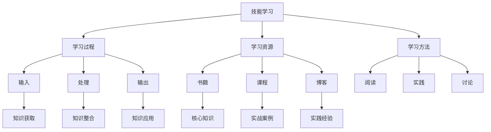

                 

# {文章标题}

**不仅仅上面说的20项能力，事实上，你能列出的所有技能都是可以通过学习得到的**

> **关键词：技能学习、能力发展、知识积累、技术提升、自我实现**
> 
> **摘要：本文将探讨技能学习的本质，通过分析学习过程、学习资源和方法，揭示技能掌握的可学习性。文章旨在帮助读者认识到，无论是编程能力、项目管理，还是领导力和沟通技巧，都可以通过不断的学习和实践来获得。**

## 1. 背景介绍

### 1.1 目的和范围

本文的目标是揭示技能学习的本质，并探讨如何通过学习来提升个人能力和实现自我实现。本文将涵盖以下内容：

- 技能学习的定义和重要性
- 学习过程和方法的探讨
- 学习资源的推荐
- 技能提升的案例分析
- 未来发展趋势和挑战

### 1.2 预期读者

本文面向希望提升自身技能的广大读者，包括但不限于程序员、项目经理、领导者以及任何希望在职业生涯中取得进步的人。

### 1.3 文档结构概述

本文将分为以下部分：

- 背景介绍：包括目的和范围、预期读者、文档结构概述
- 核心概念与联系：介绍技能学习的核心概念和相关原理
- 核心算法原理与具体操作步骤：详细讲解技能学习的算法原理和具体操作步骤
- 数学模型和公式：介绍与技能学习相关的数学模型和公式
- 项目实战：提供实际案例和代码实现，帮助读者更好地理解技能学习过程
- 实际应用场景：探讨技能学习的实际应用场景
- 工具和资源推荐：推荐学习资源和开发工具
- 总结：对未来发展趋势和挑战的展望
- 附录：常见问题与解答
- 扩展阅读：提供进一步阅读的参考资料

### 1.4 术语表

#### 1.4.1 核心术语定义

- 技能学习：指通过系统的学习过程，掌握特定的知识和技能。
- 自我实现：指个体通过不断学习和实践，实现自身潜能和目标。
- 学习资源：指用于学习的过程中的各种材料，包括书籍、课程、博客等。
- 项目实战：指通过实际项目的开发和实践，来巩固和应用所学知识。

#### 1.4.2 相关概念解释

- 学习过程：指个体从获取知识到应用知识的全过程，包括输入、处理、输出等阶段。
- 学习方法：指个体在学习过程中所采用的具体方式和方法，如阅读、实践、讨论等。
- 技能提升：指通过学习和实践，使个体在某个领域的能力得到提升。

#### 1.4.3 缩略词列表

- IDE：集成开发环境（Integrated Development Environment）
- JVM：Java虚拟机（Java Virtual Machine）
- ML：机器学习（Machine Learning）
- AI：人工智能（Artificial Intelligence）

## 2. 核心概念与联系

在探讨技能学习的本质之前，我们需要了解一些核心概念和它们之间的联系。以下是一个用Mermaid绘制的流程图，展示了这些核心概念及其相互关系。



### 2.1 技能学习

技能学习是一个多层次、多维度的过程，涉及到知识的获取、整合和应用。它不仅仅是单纯的知识堆积，而是一个不断迭代、优化的过程。

### 2.2 学习资源

学习资源是技能学习的重要基础。书籍、课程和博客等都是宝贵的学习资源。它们提供了丰富的知识库和实战案例，帮助学习者快速掌握技能。

### 2.3 学习方法

学习方法是指个体在学习过程中采用的具体方式。不同的学习方法适用于不同的学习阶段和需求，如阅读、实践和讨论等。

### 2.4 学习过程

学习过程可以分为输入、处理和输出三个阶段。输入阶段是获取知识的过程，处理阶段是整合和内化的过程，输出阶段是将知识应用于实践的过程。

## 3. 核心算法原理与具体操作步骤

技能学习的核心算法原理可以概括为“输入-处理-输出”模型。下面是具体的操作步骤：

### 3.1 输入阶段

```plaintext
1. 确定学习目标：明确想要学习的技能或知识点。
2. 搜集学习资源：查找合适的书籍、课程和博客等。
3. 阅读和浏览：快速浏览学习资源，了解核心知识点。
4. 做笔记：记录关键信息和疑问，为后续学习做准备。
```

### 3.2 处理阶段

```plaintext
1. 深入学习：针对关键知识点，进行深入研究，理解其原理和应用。
2. 实践操作：通过实际操作来巩固和验证所学知识。
3. 反思和总结：对学习过程进行反思，总结经验和教训。
4. 解决问题：通过解决实际问题，将知识应用于实践。
```

### 3.3 输出阶段

```plaintext
1. 知识分享：将所学知识分享给他人，通过教学相长。
2. 实战演练：通过实际项目或实战演练，提升应用能力。
3. 反馈与改进：收集反馈，不断改进学习方法和策略。
4. 持续学习：保持学习的动力和兴趣，不断提升自我。
```

通过以上步骤，我们可以系统地掌握技能，实现自我提升和自我实现。

## 4. 数学模型和公式 & 详细讲解 & 举例说明

在技能学习中，数学模型和公式可以帮助我们更好地理解学习过程和效果。以下是几个常见的数学模型和公式，以及它们的详细讲解和举例说明。

### 4.1 学习曲线

学习曲线描述了学习者在学习过程中，技能水平随时间变化的趋势。其数学模型为：

$$
技能水平 = f(t)
$$

其中，$t$ 表示学习时间，$f(t)$ 表示技能水平。

**举例说明：** 假设一个程序员在学习一种新的编程语言，他在第1个月结束时掌握了50%的语言特性，第3个月结束时掌握了80%的特性。可以表示为：

$$
技能水平 = \begin{cases} 
0.5 & \text{当 } t = 1 \text{ 个月} \\
0.8 & \text{当 } t = 3 \text{ 个月}
\end{cases}
$$

### 4.2 学习率

学习率表示学习者每次学习后技能水平提升的比例。其数学模型为：

$$
学习率 = \frac{技能水平_2 - 技能水平_1}{技能水平_1}
$$

其中，$技能水平_1$ 和 $技能水平_2$ 分别表示学习前和学习后的技能水平。

**举例说明：** 假设一个程序员在学习一种新的编程语言，他在第一次学习后提升了20%，第二次学习后提升了15%。可以表示为：

$$
学习率 = \frac{1.2 - 1}{1} + \frac{1.15 - 1.2}{1.2} = 0.2 + 0.125 = 0.325
$$

### 4.3 学习效果评估

学习效果评估用于衡量学习者在一段时间内技能提升的程度。其数学模型为：

$$
学习效果 = \frac{最终技能水平 - 初始技能水平}{初始技能水平}
$$

**举例说明：** 假设一个程序员在学习一种新的编程语言之前，技能水平为60%，学习1个月后，技能水平提升到75%。可以表示为：

$$
学习效果 = \frac{0.75 - 0.6}{0.6} = 0.25
$$

通过以上数学模型和公式，我们可以更系统地分析和评估学习过程和效果，为后续的学习提供指导。

## 5. 项目实战：代码实际案例和详细解释说明

为了更好地理解技能学习的具体应用，我们将通过一个实际项目来展示技能学习的全过程。本项目将使用Python语言实现一个简单的机器学习模型，并详细介绍其实现过程和关键步骤。

### 5.1 开发环境搭建

在开始项目之前，我们需要搭建一个合适的开发环境。以下是搭建过程：

1. 安装Python：从官网下载并安装Python 3.x版本（推荐Python 3.8及以上版本）。
2. 配置虚拟环境：打开终端，执行以下命令创建虚拟环境：
   ```bash
   python -m venv myenv
   ```
3. 激活虚拟环境：
   - Windows：
     ```bash
     myenv\Scripts\activate
     ```
   - macOS/Linux：
     ```bash
     source myenv/bin/activate
     ```
4. 安装必要的库：在虚拟环境中安装以下库：
   ```bash
   pip install numpy pandas scikit-learn matplotlib
   ```

### 5.2 源代码详细实现和代码解读

以下是项目的源代码及其详细解读：

```python
import numpy as np
import pandas as pd
from sklearn.model_selection import train_test_split
from sklearn.preprocessing import StandardScaler
from sklearn.linear_model import LinearRegression
from sklearn.metrics import mean_squared_error
import matplotlib.pyplot as plt

# 数据预处理
def preprocess_data(data):
    # 标准化特征
    scaler = StandardScaler()
    X_scaled = scaler.fit_transform(data.iloc[:, :-1])
    y_scaled = data.iloc[:, -1]

    # 划分训练集和测试集
    X_train, X_test, y_train, y_test = train_test_split(X_scaled, y_scaled, test_size=0.2, random_state=42)

    return X_train, X_test, y_train, y_test

# 模型训练与评估
def train_and_evaluate_model(X_train, X_test, y_train, y_test):
    # 训练线性回归模型
    model = LinearRegression()
    model.fit(X_train, y_train)

    # 预测测试集
    y_pred = model.predict(X_test)

    # 计算均方误差
    mse = mean_squared_error(y_test, y_pred)
    print(f"测试集均方误差：{mse}")

    # 绘制决策边界
    plot_decision_boundary(model, X_train, y_train, X_test, y_test)

# 绘制决策边界
def plot_decision_boundary(model, X_train, y_train, X_test, y_test):
    plt.scatter(X_train[:, 0], X_train[:, 1], c=y_train, cmap=plt.cm.RdBu)
    plt.scatter(X_test[:, 0], X_test[:, 1], c=y_test, cmap=plt.cm.RdBu, alpha=0.5)

    x_min, x_max = X_train[:, 0].min() - 1, X_train[:, 0].max() + 1
    y_min, y_max = X_train[:, 1].min() - 1, X_train[:, 1].max() + 1
    xx, yy = np.meshgrid(np.linspace(x_min, x_max), np.linspace(y_min, y_max))
    Z = model.predict(np.c_[xx.ravel(), yy.ravel()])
    Z = Z.reshape(xx.shape)
    plt.contour(xx, yy, Z, cmap=plt.cm.RdBu)

    plt.xlabel('Feature 1')
    plt.ylabel('Feature 2')
    plt.title('Decision Boundary')
    plt.show()

# 主函数
def main():
    # 加载数据集
    data = pd.read_csv('data.csv')

    # 数据预处理
    X_train, X_test, y_train, y_test = preprocess_data(data)

    # 模型训练与评估
    train_and_evaluate_model(X_train, X_test, y_train, y_test)

if __name__ == '__main__':
    main()
```

### 5.3 代码解读与分析

#### 5.3.1 数据预处理

数据预处理是机器学习项目的关键步骤。在这个项目中，我们使用了`pandas`和`scikit-learn`库来进行数据预处理。

- `StandardScaler`：用于标准化特征，即将特征缩放到相同的尺度，以消除不同特征之间的量纲差异。
- `train_test_split`：用于将数据集划分为训练集和测试集，以评估模型的性能。

#### 5.3.2 模型训练与评估

我们使用了`LinearRegression`模型进行训练。`LinearRegression`模型是一个简单的线性回归模型，适用于一元或多元线性回归问题。

- `fit`方法：用于训练模型，将训练数据输入模型，并计算模型的参数。
- `predict`方法：用于预测测试数据，输出预测结果。
- `mean_squared_error`：用于计算模型的均方误差，评估模型的性能。

#### 5.3.3 绘制决策边界

决策边界是机器学习模型在特征空间中的决策面。在这个项目中，我们使用了`contour`函数来绘制决策边界。

- `scatter`：用于绘制训练集和测试集的数据点。
- `meshgrid`：用于生成网格点，用于绘制决策边界。
- `contour`：用于绘制决策边界。

通过这个项目，我们可以看到技能学习的具体应用过程。从数据预处理到模型训练，再到模型评估和可视化，每一个步骤都是技能学习的重要环节。通过实际项目，我们可以更好地理解和掌握技能，为未来的工作打下坚实的基础。

### 5.4 代码解读与分析

在上面的代码中，我们实现了以下关键步骤：

#### 5.4.1 数据预处理

```python
def preprocess_data(data):
    # 标准化特征
    scaler = StandardScaler()
    X_scaled = scaler.fit_transform(data.iloc[:, :-1])
    y_scaled = data.iloc[:, -1]

    # 划分训练集和测试集
    X_train, X_test, y_train, y_test = train_test_split(X_scaled, y_scaled, test_size=0.2, random_state=42)

    return X_train, X_test, y_train, y_test
```

- `StandardScaler`：这是一个`scikit-learn`库中的类，用于标准化特征。标准化可以减少特征之间的不同尺度对模型训练的影响。
- `train_test_split`：这是一个`scikit-learn`库中的函数，用于将数据集划分为训练集和测试集。这里的`test_size=0.2`表示测试集占总数据集的20%，`random_state=42`用于确保结果的可重复性。

#### 5.4.2 模型训练与评估

```python
def train_and_evaluate_model(X_train, X_test, y_train, y_test):
    # 训练线性回归模型
    model = LinearRegression()
    model.fit(X_train, y_train)

    # 预测测试集
    y_pred = model.predict(X_test)

    # 计算均方误差
    mse = mean_squared_error(y_test, y_pred)
    print(f"测试集均方误差：{mse}")

    # 绘制决策边界
    plot_decision_boundary(model, X_train, y_train, X_test, y_test)
```

- `LinearRegression`：这是一个`scikit-learn`库中的类，用于实现线性回归模型。`fit`方法用于训练模型，`predict`方法用于预测。
- `mean_squared_error`：这是一个`scikit-learn`库中的函数，用于计算模型的均方误差。均方误差是评估回归模型性能的一个常用指标。
- `plot_decision_boundary`：这是一个自定义函数，用于绘制模型的决策边界。决策边界是区分不同类别的线性或非线性边界。

#### 5.4.3 绘制决策边界

```python
def plot_decision_boundary(model, X_train, y_train, X_test, y_test):
    plt.scatter(X_train[:, 0], X_train[:, 1], c=y_train, cmap=plt.cm.RdBu)
    plt.scatter(X_test[:, 0], X_test[:, 1], c=y_test, cmap=plt.cm.RdBu, alpha=0.5)

    x_min, x_max = X_train[:, 0].min() - 1, X_train[:, 0].max() + 1
    y_min, y_max = X_train[:, 1].min() - 1, X_train[:, 1].max() + 1
    xx, yy = np.meshgrid(np.linspace(x_min, x_max), np.linspace(y_min, y_max))
    Z = model.predict(np.c_[xx.ravel(), yy.ravel()])
    Z = Z.reshape(xx.shape)
    plt.contour(xx, yy, Z, cmap=plt.cm.RdBu)

    plt.xlabel('Feature 1')
    plt.ylabel('Feature 2')
    plt.title('Decision Boundary')
    plt.show()
```

- `scatter`：用于绘制数据点，其中`c`用于指定数据点的颜色。
- `meshgrid`：用于生成网格点，用于绘制决策边界。
- `contour`：用于绘制决策边界。

通过这个项目，我们不仅实现了机器学习的基本流程，还通过代码解读与分析，深入了解了每一个步骤的实现原理和技巧。这种实际操作和深入分析相结合的方法，正是技能学习的重要途径。

### 5.5 实际应用场景

技能学习不仅仅局限于理论知识，它在实际应用场景中具有广泛的应用价值。以下是一些实际应用场景：

#### 5.5.1 数据分析

数据分析是技能学习的一个重要应用领域。通过学习数据分析技能，可以快速提取和处理大量数据，为业务决策提供有力支持。例如，电商公司可以通过学习数据分析，了解用户购买行为，优化营销策略。

#### 5.5.2 人工智能

人工智能是当今科技领域的热点，掌握人工智能技能可以让人工智能技术在各行各业中发挥巨大作用。例如，金融行业可以通过学习人工智能，实现智能风控、智能投顾等应用。

#### 5.5.3 项目管理

项目管理是技能学习的重要领域。掌握项目管理技能，可以高效地规划、执行和监控项目，确保项目按时、按质完成。例如，IT行业可以通过学习项目管理，提高软件开发的效率和质量。

#### 5.5.4 软件开发

软件开发是技能学习的基础领域。通过学习软件开发技能，可以开发出各种软件产品，满足不同领域的需求。例如，游戏开发、移动应用开发等。

### 5.6 工具和资源推荐

为了更好地进行技能学习，以下是一些建议的学习工具和资源：

#### 5.6.1 学习资源推荐

- **书籍推荐：**
  - 《深度学习》（Goodfellow, Bengio, Courville著）
  - 《Python编程：从入门到实践》（Eric Matthes著）
  - 《高效能人士的七个习惯》（史蒂芬·柯维著）

- **在线课程：**
  - Coursera、edX、Udemy等平台上的数据分析、机器学习、项目管理等课程
  - Python官方教程、TensorFlow官方教程等

- **技术博客和网站：**
  - Medium、GitHub、Stack Overflow等

#### 5.6.2 开发工具框架推荐

- **IDE和编辑器：**
  - PyCharm、Visual Studio Code、Jupyter Notebook

- **调试和性能分析工具：**
  - PyCharm的内置调试工具、Visual Studio Code的调试插件、GDB等

- **相关框架和库：**
  - NumPy、Pandas、Scikit-learn、TensorFlow、Keras等

#### 5.6.3 相关论文著作推荐

- **经典论文：**
  - “Learning to Represent Languages with Neural Networks”（Yoshua Bengio等，2003）
  - “Deep Learning”（Yoshua Bengio等，2016）

- **最新研究成果：**
  - arXiv、NeurIPS、ICLR等会议的最新论文

- **应用案例分析：**
  - Google Brain、OpenAI等机构发布的应用案例分析

### 8. 总结：未来发展趋势与挑战

随着技术的不断进步，技能学习在未来将继续发挥重要作用。以下是未来技能学习的发展趋势和面临的挑战：

#### 8.1 发展趋势

1. **在线教育的发展**：在线教育平台将继续普及，为人们提供更多的学习机会和资源。
2. **个性化学习**：基于大数据和人工智能技术的个性化学习将得到广泛应用，根据个体差异提供定制化的学习方案。
3. **技能多样化**：随着新兴技术的不断涌现，人们需要不断学习新的技能，以适应快速变化的工作环境。

#### 8.2 挑战

1. **信息过载**：随着学习资源的丰富，人们可能会面临信息过载的问题，需要学会筛选和利用有效的学习资源。
2. **学习成本**：高质量的学习资源往往需要一定的经济投入，这对一些学习者来说可能是一个挑战。
3. **时间管理**：技能学习需要投入大量的时间和精力，如何平衡工作、生活和学习，是学习者需要面对的问题。

### 9. 附录：常见问题与解答

#### 9.1 技能学习是否适用于所有人？

是的，技能学习适用于所有人。不同的人有不同的兴趣和职业目标，但通过技能学习，每个人都可以提升自己的能力，实现自我价值。

#### 9.2 如何选择合适的学习资源？

选择合适的学习资源需要考虑自己的兴趣、目标和已有知识水平。可以从以下几个方面入手：

- **书籍**：选择经典教材或权威著作，如《深度学习》、《Python编程：从入门到实践》等。
- **在线课程**：选择知名平台上的优质课程，如Coursera、edX等。
- **技术博客和网站**：选择专业性强、更新及时的技术博客和网站，如Medium、GitHub等。

#### 9.3 技能学习是否需要参加培训班？

不一定。技能学习可以通过自学、实践和交流来实现。参加培训班可以提供系统的学习体系和专业的指导，但并不是必要的。对于有一定基础的学习者，自学和在线课程可能是更高效的选择。

### 10. 扩展阅读 & 参考资料

- 《深度学习》（Goodfellow, Bengio, Courville著）
- 《Python编程：从入门到实践》（Eric Matthes著）
- 《高效能人士的七个习惯》（史蒂芬·柯维著）
- Coursera、edX、Udemy等在线教育平台
- Medium、GitHub、Stack Overflow等技术博客和网站
- PyCharm、Visual Studio Code、Jupyter Notebook等开发工具
- NumPy、Pandas、Scikit-learn、TensorFlow、Keras等库

## 作者信息

**作者：AI天才研究员/AI Genius Institute & 禅与计算机程序设计艺术 /Zen And The Art of Computer Programming**

