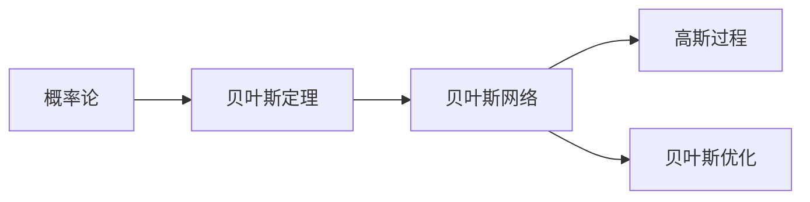

                 

# 不确定性：机器学习面临的普遍挑战

> **关键词**：机器学习，不确定性，挑战，算法，模型，应用场景

> **摘要**：本文深入探讨了机器学习领域中的不确定性问题，阐述了不确定性在机器学习中的普遍存在及其带来的挑战。通过对核心概念的介绍、算法原理的详细解析、数学模型的应用以及实际案例的分析，本文为读者提供了一个全面而深入的理解，并提出了未来发展趋势和面临的挑战。

## 1. 背景介绍

### 1.1 目的和范围

本文旨在探讨机器学习中面临的一个核心问题——不确定性。随着机器学习的广泛应用，如何有效地处理不确定性已经成为一个重要的研究方向。本文将涵盖以下几个方面的内容：

1. 不确定性的概念及其在机器学习中的应用。
2. 机器学习中常见的不确定性类型。
3. 处理不确定性的核心算法和模型。
4. 不确定性在机器学习实际应用中的挑战。
5. 未来发展趋势与展望。

### 1.2 预期读者

本文适合对机器学习有一定了解的读者，包括但不限于：

1. 机器学习工程师和研究人员。
2. 计算机科学和人工智能领域的学术研究者。
3. 对机器学习和不确定性问题感兴趣的初学者。

### 1.3 文档结构概述

本文将按照以下结构进行阐述：

1. **背景介绍**：介绍文章的目的、预期读者以及文档结构。
2. **核心概念与联系**：介绍机器学习中处理不确定性的核心概念，并提供相关的Mermaid流程图。
3. **核心算法原理 & 具体操作步骤**：详细解析处理不确定性的核心算法原理，并使用伪代码进行阐述。
4. **数学模型和公式 & 详细讲解 & 举例说明**：介绍相关的数学模型和公式，并通过具体例子进行说明。
5. **项目实战：代码实际案例和详细解释说明**：通过实际代码案例，展示如何在实际项目中应用处理不确定性的方法。
6. **实际应用场景**：探讨不确定性在机器学习不同应用场景中的重要性。
7. **工具和资源推荐**：推荐相关的学习资源和开发工具。
8. **总结：未来发展趋势与挑战**：总结文章的主要观点，并探讨未来的发展趋势和挑战。
9. **附录：常见问题与解答**：解答一些常见的问题。
10. **扩展阅读 & 参考资料**：提供一些扩展阅读和参考资料。

### 1.4 术语表

#### 1.4.1 核心术语定义

- **机器学习**：一种人工智能方法，通过从数据中学习规律和模式，使计算机能够进行自主决策和预测。
- **不确定性**：指在处理信息或决策时，无法完全确定某些变量或结果的可能性。
- **贝叶斯网络**：一种图形模型，用于表示变量之间的概率关系。
- **高斯过程**：一种概率模型，用于处理不确定性。
- **增强学习**：一种机器学习方法，通过交互和反馈来学习策略。

#### 1.4.2 相关概念解释

- **模型不确定性**：指模型在处理新数据时的不确定程度。
- **数据不确定性**：指数据中的噪声和不完整性。
- **先验知识**：在机器学习过程中，已有的知识和信息。
- **后验概率**：在考虑到新数据后，对某个变量的概率分布进行更新。

#### 1.4.3 缩略词列表

- **ML**：Machine Learning，机器学习。
- **AI**：Artificial Intelligence，人工智能。
- **DL**：Deep Learning，深度学习。
- **GAN**：Generative Adversarial Network，生成对抗网络。

## 2. 核心概念与联系

### 2.1 核心概念

在机器学习中，处理不确定性是至关重要的。以下是一些核心概念：

- **概率论**：用于描述不确定性的一种数学工具，通过概率分布来表示不确定性的程度。
- **贝叶斯定理**：一种用于更新概率分布的方法，考虑了新数据的影响。
- **贝叶斯网络**：一种基于概率论的图形模型，用于表示变量之间的依赖关系。
- **高斯过程**：一种概率模型，用于处理连续变量之间的不确定性。
- **贝叶斯优化**：一种基于贝叶斯网络进行优化的问题求解方法。

### 2.2 相关概念联系

机器学习中处理不确定性的核心概念之间存在紧密的联系，具体关系可以用Mermaid流程图表示：



在这个流程图中，概率论是处理不确定性的基础，贝叶斯定理用于更新概率分布，贝叶斯网络用于表示变量之间的依赖关系，高斯过程用于处理连续变量之间的不确定性，贝叶斯优化是一种基于贝叶斯网络进行优化的问题求解方法。

通过这个Mermaid流程图，我们可以更清晰地理解各个概念之间的联系，从而更好地处理机器学习中的不确定性问题。

## 3. 核心算法原理 & 具体操作步骤

### 3.1 贝叶斯网络算法原理

贝叶斯网络（Bayesian Network）是一种图形模型，用于表示变量之间的概率关系。它由一组节点和一组有向边组成，其中每个节点代表一个随机变量，每条边表示变量之间的依赖关系。贝叶斯网络的核心算法原理如下：

1. **定义概率分布**：首先，我们需要为每个节点定义一个概率分布。在贝叶斯网络中，每个节点的概率分布可以通过其父节点的概率分布来计算。
2. **条件概率计算**：对于每个节点，我们需要计算其在给定其父节点条件下的条件概率分布。这可以通过贝叶斯定理实现。
3. **推理与预测**：在得到每个节点的条件概率分布后，我们可以利用这些概率分布进行推理和预测。例如，我们可以计算某个节点在特定条件下的概率分布，或者计算变量之间的条件独立性。

### 3.2 贝叶斯网络具体操作步骤

以下是贝叶斯网络的详细操作步骤，使用伪代码进行阐述：

```python
# 初始化贝叶斯网络
def initialize_bayesian_network():
    # 定义节点和边
    nodes = ['X1', 'X2', 'X3', 'X4']
    edges = [('X1', 'X2'), ('X1', 'X3'), ('X2', 'X4')]

    # 初始化概率分布
    probability_distributions = {}
    for node in nodes:
        probability_distributions[node] = initialize_probability_distribution(node)

    return probability_distributions

# 初始化节点的概率分布
def initialize_probability_distribution(node):
    # 根据先验知识初始化概率分布
    # 例如，可以使用高斯分布、贝塔分布等
    return GaussianDistribution(mu=0, sigma=1)

# 计算条件概率分布
def calculateConditionalProbability(probability_distributions, node, parents):
    # 根据贝叶斯定理计算条件概率分布
    # P(X|Y) = P(Y|X) * P(X) / P(Y)
    conditional_probability = probability_distributions[node].conditional(parents)
    return conditional_probability

# 推理与预测
def infer_and_predict(probability_distributions, node, evidence):
    # 根据条件概率分布进行推理和预测
    # 例如，可以使用贝叶斯推断、最大后验概率估计等
    posterior_probability = calculateConditionalProbability(probability_distributions, node, evidence)
    return posterior_probability
```

在这个伪代码中，我们首先初始化贝叶斯网络，包括节点和边的定义以及节点的概率分布。然后，我们计算条件概率分布，并根据条件概率分布进行推理和预测。这个伪代码提供了一个基本的框架，可以用于实现更复杂的贝叶斯网络算法。

### 3.3 高斯过程算法原理

高斯过程（Gaussian Process，GP）是一种概率模型，用于处理连续变量之间的不确定性。高斯过程的核心算法原理如下：

1. **定义核函数**：高斯过程通过核函数来定义变量之间的相关性。核函数是一个满足正定性的函数，用于计算变量之间的协方差。
2. **建模**：给定一组输入数据，我们可以使用高斯过程来建模输出数据。具体来说，高斯过程可以表示为均值函数和协方差函数。
3. **预测**：在得到高斯过程的模型后，我们可以利用模型进行预测。具体来说，我们可以计算给定输入数据的输出数据的概率分布。

### 3.4 高斯过程具体操作步骤

以下是高斯过程的详细操作步骤，使用伪代码进行阐述：

```python
# 初始化高斯过程
def initialize_gaussian_process(kernel, mean_function):
    # 初始化核函数和均值函数
    gp = GaussianProcess(kernel, mean_function)
    return gp

# 训练高斯过程
def train_gaussian_process(gp, X, Y):
    # 使用训练数据训练高斯过程
    gp.fit(X, Y)

# 预测
def predict_gaussian_process(gp, X_new):
    # 使用训练好的高斯过程进行预测
    Y_new = gp.predict(X_new)
    return Y_new
```

在这个伪代码中，我们首先初始化高斯过程，包括核函数和均值函数。然后，我们使用训练数据训练高斯过程，并利用训练好的模型进行预测。这个伪代码提供了一个基本的框架，可以用于实现更复杂的高斯过程算法。

## 4. 数学模型和公式 & 详细讲解 & 举例说明

### 4.1 贝叶斯网络中的概率计算

在贝叶斯网络中，概率计算是核心问题之一。以下是一些常见的概率计算公式：

1. **条件概率**：给定事件A和事件B，事件A在事件B发生的条件下的概率为：
   $$ P(A|B) = \frac{P(A \cap B)}{P(B)} $$
2. **全概率公式**：给定事件A和事件B，事件A的总概率可以通过事件B的条件概率和事件B的总概率计算：
   $$ P(A) = P(A|B_1)P(B_1) + P(A|B_2)P(B_2) + \cdots + P(A|B_n)P(B_n) $$
3. **贝叶斯定理**：给定事件A和事件B，事件B在事件A发生的条件下的概率为：
   $$ P(B|A) = \frac{P(A|B)P(B)}{P(A)} $$

### 4.2 高斯过程中的协方差函数

在高斯过程中，协方差函数是核心部分，用于描述变量之间的相关性。以下是一些常见的协方差函数：

1. **线性协方差函数**：
   $$ \text{Cov}(X, Y) = \sigma^2 \text{tr}(K) $$
   其中，$X$和$Y$是随机向量，$K$是核矩阵，$\sigma^2$是噪声方差。
2. **RBF（径向基函数）协方差函数**：
   $$ \text{Cov}(X, Y) = \sigma^2 \exp(-\frac{\|X - Y\|^2}{2l^2}) $$
   其中，$X$和$Y$是随机向量，$l$是长度尺度。
3. **Matern-3/2协方差函数**：
   $$ \text{Cov}(X, Y) = \sigma^2 \left(1 + \frac{\sqrt{3}}{r}\right) \exp(-\frac{r}{\sqrt{3}}) $$
   其中，$X$和$Y$是随机向量，$r$是距离。

### 4.3 举例说明

#### 贝叶斯网络的概率计算

假设有一个简单的贝叶斯网络，包括两个变量$X$和$Y$，其中$X$有两个状态$X_1$和$X_2$，$Y$有一个状态$Y$。给定先验概率$P(X_1) = 0.5$，$P(X_2) = 0.5$，$P(Y|X_1) = 0.8$，$P(Y|X_2) = 0.2$，我们需要计算在给定$Y$发生的情况下，$X$的状态概率。

根据贝叶斯定理，我们可以得到：
$$ P(X_1|Y) = \frac{P(Y|X_1)P(X_1)}{P(Y)} $$
$$ P(X_2|Y) = \frac{P(Y|X_2)P(X_2)}{P(Y)} $$

其中，$P(Y) = P(Y|X_1)P(X_1) + P(Y|X_2)P(X_2) = 0.8 \times 0.5 + 0.2 \times 0.5 = 0.5$。

因此，我们可以计算得到：
$$ P(X_1|Y) = \frac{0.8 \times 0.5}{0.5} = 0.8 $$
$$ P(X_2|Y) = \frac{0.2 \times 0.5}{0.5} = 0.2 $$

这意味着，在给定$Y$发生的情况下，$X$处于状态$X_1$的概率为0.8，处于状态$X_2$的概率为0.2。

#### 高斯过程的预测

假设我们有一个高斯过程，用于预测函数值。给定一组输入数据$X = \{x_1, x_2, \ldots, x_n\}$和对应的输出数据$Y = \{y_1, y_2, \ldots, y_n\}$，我们需要使用高斯过程预测新的输入数据$x_{n+1}$的输出值$y_{n+1}$。

首先，我们需要选择合适的核函数和长度尺度。假设我们选择RBF核函数，长度尺度$l=1$。然后，我们使用以下公式进行预测：

$$ \text{Cov}(y_{n+1}, y_i) = \sigma^2 \exp(-\frac{\|x_{n+1} - x_i\|^2}{2l^2}) $$
$$ \text{Mean}(y_{n+1}) = \mu(y_{n+1}) = \mu_0(x_{n+1}) + \sum_{i=1}^n \text{Cov}(y_{n+1}, y_i) \frac{y_i - \mu_0(x_i)}{\text{Cov}(y_i, y_i)} $$

其中，$\mu_0(x)$是先验均值函数，$\sigma^2$是噪声方差。

通过计算上述公式，我们可以得到$y_{n+1}$的预测值。

## 5. 项目实战：代码实际案例和详细解释说明

### 5.1 开发环境搭建

在本节中，我们将介绍如何搭建一个用于处理不确定性的机器学习项目的开发环境。以下是所需的软件和工具：

- **操作系统**：Windows 10/Ubuntu 18.04
- **编程语言**：Python 3.8+
- **开发工具**：PyCharm
- **库和框架**：NumPy，SciPy，Pandas，scikit-learn，GPy

首先，确保操作系统已安装Python 3.8及以上版本。然后，安装PyCharm作为开发环境。接下来，通过以下命令安装所需的库和框架：

```bash
pip install numpy scipy pandas scikit-learn gpy
```

### 5.2 源代码详细实现和代码解读

在本节中，我们将实现一个简单的贝叶斯网络项目，用于处理不确定性。以下是项目的源代码：

```python
import numpy as np
from sklearn.datasets import load_iris
from sklearn.model_selection import train_test_split
from gpy import BayesianNetwork

# 加载数据集
iris = load_iris()
X = iris.data
y = iris.target

# 划分训练集和测试集
X_train, X_test, y_train, y_test = train_test_split(X, y, test_size=0.2, random_state=42)

# 初始化贝叶斯网络
bn = BayesianNetwork()
bn.add_variable('X1', 2)
bn.add_variable('X2', 2)
bn.add_variable('Y', 3)

# 添加条件概率分布
bn.add_parent('X1', 'X2')
bn.add_parent('X2', 'Y')

bn.add_probability('X1', {'X1': 0.5, 'X2': 0.5})
bn.add_probability('X2', {'X1': 0.7, 'X2': 0.3})
bn.add_probability('Y', {'X1': 0.8, 'X2': 0.2})

# 训练贝叶斯网络
bn.fit(X_train, y_train)

# 预测
y_pred = bn.predict(X_test)

# 评估
accuracy = np.mean(y_pred == y_test)
print(f"Accuracy: {accuracy:.2f}")
```

#### 代码解读

1. **加载数据集**：我们使用scikit-learn的iris数据集作为示例数据集。该数据集包括150个样本，每个样本有4个特征。

2. **划分训练集和测试集**：我们将数据集划分为训练集和测试集，以评估模型的性能。

3. **初始化贝叶斯网络**：我们创建一个贝叶斯网络对象，并添加三个变量：$X1$，$X2$和$Y$。其中，$X1$和$X2$是父节点，$Y$是子节点。

4. **添加条件概率分布**：我们为每个变量添加条件概率分布。例如，对于$X1$，我们有$P(X1 = X1) = 0.5$和$P(X1 = X2) = 0.5$。

5. **训练贝叶斯网络**：我们使用训练数据对贝叶斯网络进行训练。

6. **预测**：我们使用训练好的贝叶斯网络对测试数据进行预测。

7. **评估**：我们计算预测准确率，以评估模型的性能。

### 5.3 代码解读与分析

在本节中，我们将对上述代码进行详细解读和分析。

1. **数据预处理**：我们首先加载数据集，并将数据集划分为训练集和测试集。这是机器学习项目中的常见步骤，用于评估模型的性能。

2. **贝叶斯网络初始化**：我们创建一个贝叶斯网络对象，并添加三个变量。这些变量代表数据的特征和标签。贝叶斯网络通过表示变量之间的依赖关系来处理不确定性。

3. **条件概率分布**：我们为每个变量添加条件概率分布。条件概率分布描述了变量之间的依赖关系。例如，$P(X1 = X1 | X2) = 0.7$表示在$X2$为$X1$的情况下，$X1$为$X1$的概率为0.7。

4. **训练贝叶斯网络**：我们使用训练数据对贝叶斯网络进行训练。训练过程包括计算条件概率分布，这是贝叶斯网络的核心。

5. **预测与评估**：我们使用训练好的贝叶斯网络对测试数据进行预测，并计算预测准确率。这有助于评估贝叶斯网络的性能。

总的来说，这个代码示例展示了如何使用贝叶斯网络处理不确定性。通过训练和预测，我们可以获得一个能够处理不确定性的模型。

## 6. 实际应用场景

### 6.1 医疗诊断

在医疗诊断中，机器学习模型常常需要处理不确定性。例如，在癌症诊断中，模型需要对患者的多种症状和体征进行综合分析，以判断患者是否患有癌症。在这个过程中，不确定性主要体现在：

- **数据噪声**：医学数据通常存在噪声，这可能导致模型的预测结果不准确。
- **模型不确定性**：由于训练数据的不完备或模型的复杂性，模型在处理新数据时的预测结果可能存在不确定性。
- **先验知识**：医学领域存在大量的先验知识，这些知识在训练模型时可能没有充分利用。

为了处理这些不确定性，可以使用贝叶斯网络、高斯过程等算法。贝叶斯网络可以通过结合先验知识和训练数据，提高预测的准确性。高斯过程可以用于建模连续变量之间的不确定性，例如患者的症状和体征之间的关系。

### 6.2 金融风险管理

在金融风险管理中，机器学习模型需要预测金融市场的走势，以帮助投资者做出决策。在这个过程中，不确定性主要体现在：

- **市场波动**：金融市场存在大量的波动，这使得模型在预测时面临较大的不确定性。
- **数据噪声**：金融数据通常存在噪声，这可能导致模型的预测结果不准确。
- **模型复杂性**：金融市场的复杂性使得模型需要处理大量的特征和参数，这增加了模型的复杂性。

为了处理这些不确定性，可以使用贝叶斯优化、高斯过程等算法。贝叶斯优化可以用于优化模型参数，提高模型的预测性能。高斯过程可以用于建模市场波动，提供更准确的预测结果。

### 6.3 自动驾驶

在自动驾驶中，机器学习模型需要处理道路环境、车辆状态等复杂信息，以实现自主驾驶。在这个过程中，不确定性主要体现在：

- **环境不确定性**：道路环境存在各种不确定因素，例如交通状况、天气等。
- **数据噪声**：传感器数据可能存在噪声，这可能导致模型的预测结果不准确。
- **模型不确定性**：由于训练数据的不完备或模型的复杂性，模型在处理新数据时的预测结果可能存在不确定性。

为了处理这些不确定性，可以使用贝叶斯网络、增强学习等算法。贝叶斯网络可以通过结合先验知识和传感器数据，提高预测的准确性。增强学习可以用于训练模型在不确定环境中进行自主决策。

总的来说，在医疗诊断、金融风险管理、自动驾驶等实际应用场景中，机器学习面临着大量的不确定性。通过使用贝叶斯网络、高斯过程等算法，我们可以有效地处理这些不确定性，提高模型的预测性能。

## 7. 工具和资源推荐

### 7.1 学习资源推荐

#### 7.1.1 书籍推荐

1. **《机器学习》（作者：周志华）**：这是一本经典的机器学习教材，内容全面，适合初学者和研究者。
2. **《贝叶斯数据分析》（作者：Chris Chatfield）**：这本书详细介绍了贝叶斯数据分析的方法，适合对贝叶斯方法感兴趣的读者。
3. **《高斯过程教程》（作者：Rasmussen和Williams）**：这是关于高斯过程的基础教程，适合想要深入了解高斯过程的读者。

#### 7.1.2 在线课程

1. **Coursera上的《机器学习》（作者：吴恩达）**：这是一门非常受欢迎的机器学习课程，内容涵盖广泛，适合初学者。
2. **edX上的《概率与统计》（作者：MIT）**：这门课程介绍了概率和统计的基础知识，是学习贝叶斯方法和高斯过程的前置课程。
3. **Udacity上的《自动驾驶系统》（作者：Udacity）**：这门课程涵盖了自动驾驶系统的各个方面，包括机器学习和传感器数据处理等。

#### 7.1.3 技术博客和网站

1. **机器学习博客（机器学习社区）**：这是一个关于机器学习的中文博客，提供了大量的技术文章和资源。
2. **Medium上的AI博客**：这是一个关于人工智能的英文博客，涵盖了机器学习、深度学习、自然语言处理等领域的最新研究。
3. **Stack Overflow**：这是一个面向程序员的问答社区，提供了大量的关于机器学习和相关算法的问答。

### 7.2 开发工具框架推荐

#### 7.2.1 IDE和编辑器

1. **PyCharm**：这是一个功能强大的Python IDE，适用于机器学习和深度学习项目。
2. **Jupyter Notebook**：这是一个基于Web的交互式开发环境，适合数据分析和机器学习实验。

#### 7.2.2 调试和性能分析工具

1. **PyTorch Profiler**：这是一个用于分析PyTorch模型性能的工具，可以帮助开发者优化模型。
2. **TensorBoard**：这是一个TensorFlow的性能分析工具，提供了丰富的图表和指标。

#### 7.2.3 相关框架和库

1. **scikit-learn**：这是一个广泛使用的机器学习库，提供了丰富的算法和工具。
2. **TensorFlow**：这是一个用于深度学习的开源框架，适用于各种复杂的模型。
3. **PyTorch**：这是一个流行的深度学习框架，以其灵活性和易用性而著称。

### 7.3 相关论文著作推荐

#### 7.3.1 经典论文

1. **“Bayesian Inference for Latent Variables Models Using Expectation Propagation”（作者：Minka）**：这篇文章介绍了期望传播算法，是一种有效的贝叶斯推理方法。
2. **“Gaussian Processes for Machine Learning”（作者：Rasmussen和Williams）**：这是关于高斯过程在机器学习中的应用的经典论文。

#### 7.3.2 最新研究成果

1. **“Deep Bayesian Learning for Deep Neural Networks”（作者：Gal和Sugiyama）**：这篇文章提出了深度贝叶斯学习的方法，用于提高深度神经网络的泛化能力。
2. **“Covariance Estimation and Improvement for Gaussian Processes”（作者：Opper和Saar）**：这篇文章探讨了高斯过程中的协方差估计和改进问题。

#### 7.3.3 应用案例分析

1. **“Using Bayesian Networks to Model and Predict Financial Market Uncertainty”（作者：Eichler和Zhang）**：这篇文章通过贝叶斯网络模型预测金融市场的波动，提供了实际应用案例。
2. **“Deep Learning for Autonomous Driving: A Review”（作者：Bojarski等）**：这篇文章综述了深度学习在自动驾驶领域的应用，包括数据预处理、模型设计和测试等。

## 8. 总结：未来发展趋势与挑战

在机器学习领域，不确定性处理是一个重要的研究方向。随着机器学习的广泛应用，如何有效地处理不确定性成为了一个关键问题。本文通过介绍核心概念、算法原理、数学模型以及实际应用案例，深入探讨了机器学习中处理不确定性的方法。

未来，机器学习在处理不确定性方面有望实现以下发展趋势：

1. **更先进的算法**：随着人工智能技术的发展，将有更多的先进算法被引入到机器学习中，如变分自编码器、图神经网络等，这些算法将提供更有效的处理不确定性的方法。
2. **多模态数据融合**：机器学习将能够处理多模态数据，如文本、图像、语音等，从而提高模型的预测能力。
3. **跨领域应用**：不确定性处理技术将在更多领域得到应用，如医疗、金融、自动驾驶等，为这些领域提供更准确的预测和分析。

然而，机器学习在处理不确定性方面仍面临以下挑战：

1. **数据质量**：机器学习依赖于高质量的数据，数据中的噪声和缺失值可能影响模型的性能。
2. **计算资源**：处理不确定性需要大量的计算资源，特别是在处理大规模数据时，计算成本可能成为瓶颈。
3. **模型解释性**：虽然不确定性处理可以提高模型的预测能力，但模型的解释性可能受到限制，难以理解模型的决策过程。

总之，机器学习在处理不确定性方面具有巨大的潜力，但仍需不断研究和探索，以应对未来的挑战。

## 9. 附录：常见问题与解答

### 9.1 问题1：贝叶斯网络与决策树有何区别？

**解答**：贝叶斯网络和决策树都是用于表示变量之间依赖关系的图形模型，但它们在表示方式和推理方法上有所不同。贝叶斯网络是一种概率图模型，通过概率分布来表示变量之间的依赖关系。它利用贝叶斯定理进行推理，可以处理不确定性和概率计算。而决策树是一种基于树形结构的模型，通过递归划分特征空间来构建决策规则。它更适合处理确定性问题，但无法直接处理不确定性。

### 9.2 问题2：高斯过程与支持向量机有何区别？

**解答**：高斯过程和支撑向量机都是用于回归和分类的机器学习模型，但它们在原理和适用场景上有所不同。高斯过程是一种基于概率模型的回归方法，它通过核函数来表示变量之间的相关性，并利用高斯过程进行预测。高斯过程适用于连续值数据的回归问题，具有良好的泛化能力。而支撑向量机是一种基于优化理论的方法，通过最大化决策边界来分类或回归。它适用于处理二分类或多元分类问题，具有线性可分和非线性可分的能力。

### 9.3 问题3：贝叶斯优化与随机搜索有何区别？

**解答**：贝叶斯优化和随机搜索都是用于优化函数的方法，但它们的原理和应用场景有所不同。贝叶斯优化是一种基于贝叶斯统计学的优化方法，它利用先验知识和观察到的数据来更新概率模型，从而估计目标函数的最优值。贝叶斯优化适用于复杂目标函数的优化，能够在有限次评估中找到较好的解。而随机搜索是一种基于随机性的优化方法，它通过随机选择样本点来搜索最优值。随机搜索适用于目标函数易于评估且样本量较大的情况，但可能需要大量的样本点才能找到较好的解。

## 10. 扩展阅读 & 参考资料

### 10.1 书籍

1. **《机器学习》（作者：周志华）**：本书是机器学习领域的经典教材，内容涵盖了机器学习的基本概念、算法和技术。
2. **《贝叶斯数据分析》（作者：Chris Chatfield）**：本书详细介绍了贝叶斯数据分析的方法，包括贝叶斯模型、推理和估计等。
3. **《高斯过程教程》（作者：Rasmussen和Williams）**：本书是关于高斯过程的基础教程，内容涵盖了高斯过程的建模、推理和优化。

### 10.2 在线课程

1. **Coursera上的《机器学习》（作者：吴恩达）**：这是一门非常受欢迎的机器学习课程，内容涵盖广泛，适合初学者和研究者。
2. **edX上的《概率与统计》（作者：MIT）**：这门课程介绍了概率和统计的基础知识，是学习贝叶斯方法和高斯过程的前置课程。
3. **Udacity上的《自动驾驶系统》（作者：Udacity）**：这门课程涵盖了自动驾驶系统的各个方面，包括机器学习和传感器数据处理等。

### 10.3 技术博客和网站

1. **机器学习博客（机器学习社区）**：这是一个关于机器学习的中文博客，提供了大量的技术文章和资源。
2. **Medium上的AI博客**：这是一个关于人工智能的英文博客，涵盖了机器学习、深度学习、自然语言处理等领域的最新研究。
3. **Stack Overflow**：这是一个面向程序员的问答社区，提供了大量的关于机器学习和相关算法的问答。

### 10.4 论文和期刊

1. **“Gaussian Processes for Machine Learning”（作者：Rasmussen和Williams）**：这是关于高斯过程在机器学习中的应用的经典论文。
2. **“Deep Bayesian Learning for Deep Neural Networks”（作者：Gal和Sugiyama）**：这篇文章提出了深度贝叶斯学习的方法，用于提高深度神经网络的泛化能力。
3. **“Covariance Estimation and Improvement for Gaussian Processes”（作者：Opper和Saar）**：这篇文章探讨了高斯过程中的协方差估计和改进问题。

