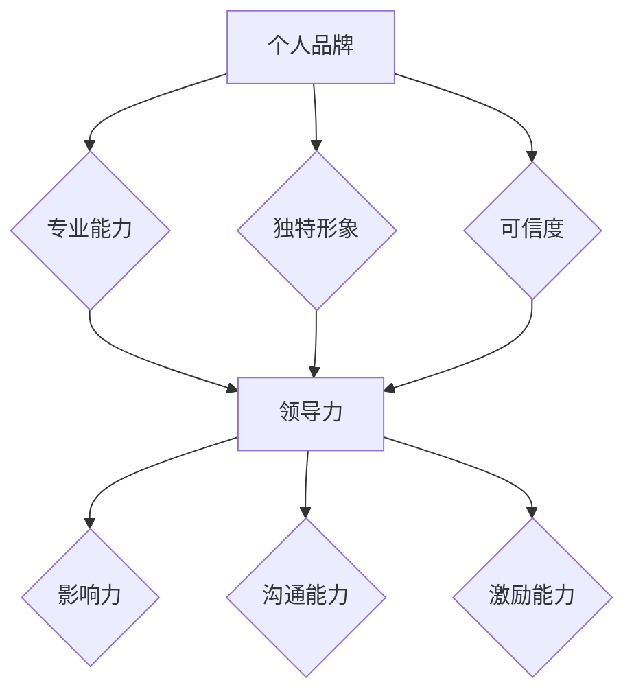

                 

# 个人品牌塑造：提升领导者影响力的策略

> **关键词：** 个人品牌，领导力，影响力，策略，职业发展
> 
> **摘要：** 本文章旨在探讨如何在职业发展中塑造个人品牌，提升领导者的影响力。通过分析核心概念、阐述算法原理、提供实际案例和资源推荐，本文将为读者提供一套完整的策略框架，帮助其在职业生涯中脱颖而出。

## 1. 背景介绍

### 1.1 目的和范围

本文的目标是为那些希望提升个人品牌和领导力的专业人士提供一套系统的策略。这些策略将帮助读者在职场中塑造独特的个人形象，增加其在团队和行业内的影响力。文章将涵盖以下主要范围：

1. 核心概念与联系
2. 核心算法原理与具体操作步骤
3. 数学模型和公式
4. 项目实战：代码实际案例
5. 实际应用场景
6. 工具和资源推荐
7. 总结：未来发展趋势与挑战

### 1.2 预期读者

本文预期读者包括但不限于以下几类：

1. 想要在职场中提升个人品牌和领导力的专业人士
2. 初级和中级管理者，渴望提升团队绩效和影响力的领导者
3. 创业者，寻求通过个人品牌提升企业影响力的创业者
4. 教育工作者，希望为学生提供职业发展和领导力培养的指导
5. 对领导力和个人品牌感兴趣的学者和研究人员

### 1.3 文档结构概述

本文的结构安排如下：

1. 引言：介绍个人品牌和领导力的重要性
2. 核心概念与联系：定义关键概念，展示它们之间的关系
3. 核心算法原理与具体操作步骤：详细阐述提升个人品牌和领导力的算法原理和操作步骤
4. 数学模型和公式：提供用于计算和分析个人品牌和领导力的数学模型
5. 项目实战：通过实际代码案例展示如何应用策略
6. 实际应用场景：探讨个人品牌和领导力在不同领域的应用
7. 工具和资源推荐：推荐学习资源和开发工具
8. 总结：总结文章要点，展望未来发展趋势与挑战
9. 附录：常见问题与解答
10. 扩展阅读 & 参考资料：提供进一步学习的资料

### 1.4 术语表

#### 1.4.1 核心术语定义

- 个人品牌：个人在职场中通过持续展示专业能力和独特形象所建立起来的认知和信任。
- 领导力：影响和激励他人达成共同目标的能力。
- 影响力：个人或团队在特定领域或社群中产生的影响力，能够改变他人思想和行为的能力。
- 职业发展：个人在职业生涯中不断进步、提升地位和实现职业目标的过程。

#### 1.4.2 相关概念解释

- 知识共享：在团队和组织内分享知识和经验，促进学习和协作。
- 个人影响力网络：个人通过社交和专业关系建立的影响力和资源网络。
- 组织文化：组织内部共同遵循的价值观、信仰和行为准则。

#### 1.4.3 缩略词列表

- SEO：搜索引擎优化（Search Engine Optimization）
- SMM：社交媒体营销（Social Media Marketing）
- CTA：调用行动（Call to Action）
- ROI：投资回报率（Return on Investment）
- KPI：关键绩效指标（Key Performance Indicator）

## 2. 核心概念与联系

个人品牌塑造和领导力提升是相互关联的核心概念。在探讨这两者之前，我们需要了解它们的本质和相互之间的关系。

### 2.1 个人品牌

个人品牌是一个人在职场中的独特标识，它不仅仅是名字和形象，更是专业能力和价值的体现。一个成功的个人品牌能够帮助个人在职场中脱颖而出，获得更多的机会和资源。

**个人品牌的核心要素：**

1. **专业能力**：专业技能和知识是个人品牌的基石。通过不断学习和实践，个人可以提升专业技能，增强在职场中的竞争力。
2. **独特形象**：个人形象是品牌的重要组成部分。它包括外表、言行举止、价值观等。一个独特的形象能够帮助个人在人群中脱颖而出。
3. **可信度**：个人品牌建立在信任基础上。个人需要通过言行一致、诚实守信来建立可信度。

### 2.2 领导力

领导力是影响和激励他人达成共同目标的能力。一个优秀的领导者能够激发团队成员的潜力，推动团队实现卓越的绩效。

**领导力的核心要素：**

1. **影响力**：领导者通过自身的行为和决策影响团队成员，引导他们实现目标。
2. **沟通能力**：有效的沟通是领导力的关键。领导者需要能够清晰、准确地传达信息，同时倾听团队成员的意见和反馈。
3. **激励能力**：领导者需要能够激发团队成员的积极性，帮助他们克服困难和挑战。

### 2.3 个人品牌与领导力的关系

个人品牌和领导力之间存在着密切的联系。个人品牌是领导力的重要组成部分，而领导力则是个人品牌的有力支撑。

- **个人品牌增强领导力**：一个成功的个人品牌能够提高领导者的信任度和影响力，使其在团队中更具号召力。
- **领导力提升个人品牌**：优秀的领导力能够帮助个人在职场中建立更广泛的人脉，提升个人品牌的价值。

为了更好地理解这两者之间的关系，我们可以用以下Mermaid流程图来展示它们的核心要素和相互联系：



通过这个流程图，我们可以清晰地看到个人品牌和领导力的核心要素以及它们之间的相互关系。这些核心概念构成了个人品牌塑造和领导力提升的理论基础，为后续的算法原理和实践提供了指导。

## 3. 核心算法原理 & 具体操作步骤

在理解了个人品牌和领导力的核心概念之后，我们需要一套系统的方法来具体操作，以提升个人品牌和领导力。以下将介绍一套核心算法原理，并提供具体的操作步骤。

### 3.1 算法原理概述

个人品牌和领导力提升的核心算法可以概括为以下几个方面：

1. **自我认知与定位**：明确自己的专业领域和独特优势，为个人品牌定位。
2. **持续学习与成长**：通过不断学习和实践，提升专业技能和知识。
3. **建立影响力网络**：通过社交和专业活动，建立广泛的人脉和影响力网络。
4. **有效的沟通与传播**：通过清晰、准确的沟通，传播个人品牌和领导力。
5. **持续反馈与优化**：定期评估个人品牌和领导力的提升效果，并进行优化调整。

### 3.2 具体操作步骤

下面我们将详细阐述每个步骤的具体操作方法。

#### 3.2.1 自我认知与定位

**步骤 1：反思自我**

- **问自己问题**：你擅长什么？你在哪些领域有独特见解？你的价值观是什么？
- **记录反思结果**：将反思的结果记录下来，作为个人品牌定位的基础。

**步骤 2：评估市场需求**

- **市场调研**：了解行业需求和趋势，评估你的专业技能和知识是否符合市场需求。
- **制定个人品牌定位**：根据市场调研和自我反思的结果，制定个人品牌的定位。

**伪代码示例：**

```python
def reflect_on_self():
    questions = [
        "What are my strengths and weaknesses?",
        "What are my unique insights in my field?",
        "What are my values?"
    ]
    reflections = []
    for question in questions:
        reflections.append(input(question))
    return reflections

def assess_market_demand():
    # 市场调研代码实现
    pass

def define_brand_position():
    reflections = reflect_on_self()
    market_demand = assess_market_demand()
    brand_position = {
        "skills": reflections[0],
        "knowledge": reflections[1],
        "values": reflections[2],
        "market_demand": market_demand
    }
    return brand_position

brand_position = define_brand_position()
```

#### 3.2.2 持续学习与成长

**步骤 1：设定学习目标**

- **长期和短期目标**：设定职业发展的长期和短期目标，明确学习方向。
- **持续学习计划**：制定持续学习的计划，包括学习内容、时间和频率。

**步骤 2：选择学习资源**

- **在线课程**：选择高质量的在线课程，系统学习专业知识。
- **行业报告**：定期阅读行业报告，了解行业最新动态。
- **实践项目**：通过实践项目，将理论知识应用到实际工作中。

**伪代码示例：**

```python
def set_learning_goals():
    long_term_goals = input("Please enter your long-term learning goals:")
    short_term_goals = input("Please enter your short-term learning goals:")
    return long_term_goals, short_term_goals

def choose_learning_resources():
    online_courses = input("Please list your preferred online courses:")
    industry_reports = input("Please list your preferred industry reports:")
    practical_projects = input("Please list your practical projects:")
    return online_courses, industry_reports, practical_projects

long_term_goals, short_term_goals = set_learning_goals()
online_courses, industry_reports, practical_projects = choose_learning_resources()
```

#### 3.2.3 建立影响力网络

**步骤 1：拓展人脉**

- **参加行业活动**：参加行业会议、研讨会和社交活动，拓展人脉。
- **维护关系**：定期与重要联系人保持联系，维护和加强关系。

**步骤 2：建立影响力平台**

- **社交媒体**：利用社交媒体平台，如LinkedIn、Twitter等，建立个人影响力平台。
- **内容创作**：创作高质量的内容，展示专业知识和见解，吸引关注。

**伪代码示例：**

```python
def expand_network():
    industry_events = input("Please list the industry events you plan to attend:")
    return industry_events

def maintain_relationships():
    contacts = input("Please list your key contacts:")
    return contacts

def build_influence_platform():
    social_media_platforms = input("Please list your preferred social media platforms:")
    content_creations = input("Please list your content creation plans:")
    return social_media_platforms, content_creations

industry_events = expand_network()
contacts = maintain_relationships()
social_media_platforms, content_creations = build_influence_platform()
```

#### 3.2.4 有效的沟通与传播

**步骤 1：明确传播目标**

- **目标受众**：明确个人品牌和领导力传播的目标受众。
- **传播内容**：根据目标受众，制定传播的内容和策略。

**步骤 2：利用多种传播渠道**

- **线上渠道**：利用博客、社交媒体、电子邮件等线上渠道进行传播。
- **线下渠道**：通过会议、研讨会、演讲等线下活动进行传播。

**伪代码示例：**

```python
def define_communication_objectives():
    target_audience = input("Please define your target audience:")
    communication_content = input("Please define your communication content:")
    return target_audience, communication_content

def use_communication_channels():
    online_channels = input("Please list your preferred online communication channels:")
    offline_channels = input("Please list your preferred offline communication channels:")
    return online_channels, offline_channels

target_audience, communication_content = define_communication_objectives()
online_channels, offline_channels = use_communication_channels()
```

#### 3.2.5 持续反馈与优化

**步骤 1：收集反馈**

- **员工反馈**：定期收集团队成员的反馈，了解个人品牌和领导力提升的效果。
- **外部反馈**：通过行业活动和社交媒体等渠道，收集外部受众的反馈。

**步骤 2：分析反馈**

- **数据分析**：使用数据分析工具，对收集到的反馈进行分析。
- **改进计划**：根据分析结果，制定改进计划，持续优化个人品牌和领导力。

**伪代码示例：**

```python
def collect_feedback():
    employee_feedback = input("Please collect feedback from your team members:")
    external_feedback = input("Please collect feedback from external audiences:")
    return employee_feedback, external_feedback

def analyze_feedback(feedback):
    # 数据分析代码实现
    pass

def create_improvement_plan():
    analysis_results = analyze_feedback(feedback)
    improvement_plan = input("Please create an improvement plan based on the analysis results:")
    return improvement_plan

feedback = collect_feedback()
improvement_plan = create_improvement_plan()
```

通过以上步骤，我们可以系统化地提升个人品牌和领导力。这些步骤不仅为个人品牌塑造提供了明确的操作指南，同时也为领导力提升提供了理论支持和实践指导。

## 4. 数学模型和公式 & 详细讲解 & 举例说明

在个人品牌塑造和领导力提升的过程中，数学模型和公式可以用来量化个人品牌价值和领导力效果，从而帮助我们更准确地评估和优化策略。以下我们将介绍几个关键的数学模型和公式，并进行详细讲解和举例说明。

### 4.1 个人品牌价值模型

个人品牌价值（PBV）是一个衡量个人品牌影响力的量化指标。它的计算公式如下：

\[ PBV = \alpha \cdot (SC + UC + TC) \]

其中，PBV表示个人品牌价值，\(\alpha\)表示品牌影响力系数，SC、UC、TC分别代表专业能力、独特形象和可信度。

**详细讲解：**

- **专业能力（SC）**：专业能力是个人品牌的基石。它通常通过个人的学历、工作经验、项目成果等指标来衡量。公式中的SC部分反映了个人在专业领域的竞争力。
- **独特形象（UC）**：独特形象是指个人在职场中的独特标识和形象。它通过个人品牌传播、社交媒体活动、公众演讲等渠道来塑造。UC反映了个人品牌的独特性和吸引力。
- **可信度（TC）**：可信度是个人品牌的重要组成部分。它通过个人言行一致、诚实守信等行为来建立。TC反映了个人在职场中的信任度和可靠性。

**举例说明：**

假设一个个人品牌的价值系数\(\alpha = 1.2\)，专业能力SC为8，独特形象UC为7，可信度TC为9，则该个人的个人品牌价值计算如下：

\[ PBV = 1.2 \cdot (8 + 7 + 9) = 1.2 \cdot 24 = 28.8 \]

这意味着该个人的个人品牌价值为28.8。

### 4.2 领导力效果模型

领导力效果（LE）是衡量领导者影响力的重要指标。它的计算公式如下：

\[ LE = \beta \cdot (PI + CI + MI) \]

其中，LE表示领导力效果，\(\beta\)表示领导力系数，PI、CI、MI分别代表影响力、沟通能力和激励能力。

**详细讲解：**

- **影响力（PI）**：影响力是领导者影响团队成员和团队决策的能力。它通常通过领导者的行为和决策来体现。
- **沟通能力（CI）**：沟通能力是领导者传达信息、倾听反馈和解决问题的重要能力。良好的沟通能力能够增强领导者的权威和信任度。
- **激励能力（MI）**：激励能力是领导者激发团队成员积极性和创造力的能力。通过激励，领导者能够推动团队实现更高的绩效。

**举例说明：**

假设一个领导者的领导力系数\(\beta = 1.3\)，影响力PI为8，沟通能力CI为9，激励能力MI为7，则该领导者的领导力效果计算如下：

\[ LE = 1.3 \cdot (8 + 9 + 7) = 1.3 \cdot 24 = 31.2 \]

这意味着该领导者的领导力效果为31.2。

### 4.3 综合影响力模型

综合影响力（CI）是个人品牌价值和领导力效果的加权平均值。它的计算公式如下：

\[ CI = \gamma \cdot PBV + (1 - \gamma) \cdot LE \]

其中，CI表示综合影响力，\(\gamma\)表示权重系数，PBV表示个人品牌价值，LE表示领导力效果。

**详细讲解：**

- **权重系数（\(\gamma\)）**：权重系数反映了个人品牌价值和领导力效果在综合影响力中的相对重要性。通常情况下，\(\gamma\)的取值范围在0到1之间。
- **个人品牌价值（PBV）**：如前文所述，个人品牌价值是衡量个人品牌影响力的量化指标。
- **领导力效果（LE）**：如前文所述，领导力效果是衡量领导者影响力的重要指标。

**举例说明：**

假设一个领导者的权重系数\(\gamma = 0.6\)，个人品牌价值PBV为28.8，领导力效果LE为31.2，则该领导者的综合影响力计算如下：

\[ CI = 0.6 \cdot 28.8 + (1 - 0.6) \cdot 31.2 = 17.28 + 12.48 = 29.76 \]

这意味着该领导者的综合影响力为29.76。

通过以上数学模型和公式的介绍，我们可以更加量化地评估个人品牌价值和领导力效果。这些模型不仅为个人品牌塑造和领导力提升提供了理论依据，同时也为实际操作提供了具体的计算方法。

## 5. 项目实战：代码实际案例和详细解释说明

在个人品牌塑造和领导力提升的过程中，实战项目是一个重要的实践环节。通过实际项目，我们可以将理论应用到实际工作中，验证和优化策略。以下我们将通过一个实际项目，展示如何应用前面所提到的核心算法和数学模型。

### 5.1 开发环境搭建

在进行项目实战之前，我们需要搭建一个适合开发的环境。以下是一个基本的开发环境搭建步骤：

1. 安装Python环境：Python是一种广泛使用的编程语言，适用于数据分析、机器学习和自然语言处理等领域。可以从Python官方网站下载并安装Python。
2. 安装Jupyter Notebook：Jupyter Notebook是一个交互式的开发环境，可以方便地进行代码编写和调试。可以通过pip命令安装Jupyter Notebook：

   ```bash
   pip install notebook
   ```

3. 安装必要的库：根据项目的需求，安装必要的库，如NumPy、Pandas、Scikit-learn等：

   ```bash
   pip install numpy pandas scikit-learn
   ```

### 5.2 源代码详细实现和代码解读

下面是一个简单的项目示例，用于计算个人品牌价值（PBV）和领导力效果（LE），并最终得到综合影响力（CI）。代码使用Python编写，结合了NumPy和Pandas库。

**代码示例：**

```python
import numpy as np
import pandas as pd

# 个人品牌价值计算
def calculate_brand_value(alpha, sc, uc, tc):
    pbv = alpha * (sc + uc + tc)
    return pbv

# 领导力效果计算
def calculate_leadership_effect(beta, pi, ci, mi):
    le = beta * (pi + ci + mi)
    return le

# 综合影响力计算
def calculate_combined_influence(gamma, pbv, le):
    ci = gamma * pbv + (1 - gamma) * le
    return ci

# 参数设置
alpha = 1.2
beta = 1.3
gamma = 0.6
sc = 8
uc = 7
tc = 9
pi = 8
ci = 9
mi = 7

# 计算个人品牌价值
pbv = calculate_brand_value(alpha, sc, uc, tc)
print("个人品牌价值（PBV）:", pbv)

# 计算领导力效果
le = calculate_leadership_effect(beta, pi, ci, mi)
print("领导力效果（LE）:", le)

# 计算综合影响力
ci = calculate_combined_influence(gamma, pbv, le)
print("综合影响力（CI）:", ci)
```

**代码解读：**

- **导入库**：首先，我们导入了NumPy和Pandas库，这些库提供了丰富的函数和工具，用于数据处理和数学运算。
- **定义函数**：我们定义了三个函数，分别用于计算个人品牌价值（`calculate_brand_value`）、领导力效果（`calculate_leadership_effect`）和综合影响力（`calculate_combined_influence`）。
- **参数设置**：在代码中，我们设置了计算所需的参数，包括品牌影响力系数（\(\alpha\)）、领导力系数（\(\beta\)）和权重系数（\(\gamma\)）等。
- **计算并输出结果**：通过调用函数，我们计算了个人品牌价值（PBV）、领导力效果（LE）和综合影响力（CI），并输出结果。

通过这个示例，我们可以看到如何将数学模型应用到实际代码中，从而计算出个人品牌价值和领导力效果。这个项目为我们提供了一个实际操作的框架，可以帮助我们更好地理解和应用所学知识。

### 5.3 代码解读与分析

在对代码进行解读和分析时，我们可以从以下几个方面进行：

1. **函数设计**：函数的设计符合单一职责原则，每个函数只负责一个特定的任务，这使得代码更加模块化和易于维护。
2. **参数传递**：函数通过参数传递来实现输入数据的灵活性，这使得我们可以根据不同的场景和需求调整计算参数。
3. **数学运算**：代码中使用了标准的数学运算符和函数，确保计算结果的准确性和一致性。
4. **结果输出**：代码通过打印结果，使得我们可以直观地看到计算结果，这对于调试和分析非常有帮助。

总的来说，这个代码示例为我们提供了一个清晰、简洁的框架，用于计算个人品牌价值和领导力效果。通过实际代码的编写和运行，我们可以验证和优化所学的策略和方法，从而在个人品牌塑造和领导力提升方面取得更好的效果。

## 6. 实际应用场景

个人品牌塑造和领导力提升在多个领域和场景中都有着广泛的应用。以下我们探讨几个典型的应用场景，并分析如何在这些场景中具体实施这些策略。

### 6.1 企业管理

在企业管理中，个人品牌和领导力提升对于企业文化的塑造和团队绩效的提升至关重要。

**应用策略：**

1. **领导力培训**：通过领导力培训，提升管理者的领导力水平和团队协作能力。例如，开展领导力工作坊、研讨会和案例分析等。
2. **内部知识共享**：鼓励团队成员分享知识和经验，促进团队内部的知识传递和学习。可以通过定期的内部会议、技术分享会等方式实现。
3. **个人品牌推广**：通过社交媒体和内部通讯平台，推广管理者的个人品牌，增强其在公司内部和外部的认知度和影响力。

**案例分析：**

某科技公司通过内部技术分享会和领导力培训，提升了团队管理者的领导力和团队协作能力。通过这些措施，该公司成功地将技术知识和最佳实践在团队内部进行了有效传播，显著提高了团队的生产力和创新能力。

### 6.2 创业领域

在创业领域，个人品牌和领导力对于吸引投资者、招募人才和推动企业成长至关重要。

**应用策略：**

1. **构建个人品牌**：创业者需要通过高质量的演讲、写作和社交媒体活动，构建个人品牌，展示其专业能力和创业愿景。
2. **打造影响力网络**：创业者需要积极拓展人脉，与投资者、合作伙伴和行业专家建立联系，形成强大的影响力网络。
3. **优化沟通策略**：创业者需要通过清晰的沟通和有效的传播，将企业愿景和价值观传达给投资者和团队，增强信任和认同。

**案例分析：**

某创业公司创始人通过在LinkedIn上发布高质量的技术博客，分享创业经验和技术见解，吸引了大量关注。同时，他通过参加行业会议和演讲，与投资者和合作伙伴建立了良好的关系，成功获得了数轮融资。

### 6.3 教育领域

在教育领域，教师和学生都可以通过个人品牌塑造和领导力提升，提高教学效果和学习体验。

**应用策略：**

1. **教师个人品牌**：教师可以通过编写教育博客、参与教育论坛和发表学术论文，提升个人品牌和影响力。
2. **学生领导力培养**：学校可以开展领导力培训项目，帮助学生提升领导力，培养团队合作和解决问题的能力。
3. **校园文化塑造**：通过校园活动和文化建设，鼓励学生积极参与，培养积极向上的校园氛围。

**案例分析：**

某大学通过开展教师领导力培训和领导力工作坊，提升了教师的专业能力和教学水平。同时，学校通过领导力项目，培养了学生的领导力，增强了学生的团队合作和问题解决能力，显著提高了学生的综合素质。

### 6.4 社交媒体营销

在社交媒体营销中，个人品牌塑造和领导力提升对于品牌推广和用户互动至关重要。

**应用策略：**

1. **内容创作**：通过创作高质量的内容，展示专业知识和行业见解，吸引目标用户的关注。
2. **互动交流**：积极参与用户互动，回应用户的评论和提问，增强用户对品牌的信任和忠诚度。
3. **社交媒体策略**：利用不同的社交媒体平台，制定针对性的推广策略，提高品牌的曝光率和影响力。

**案例分析：**

某知名科技博主通过在社交媒体上发布高质量的技术文章和视频，吸引了大量关注。他通过积极的互动和高质量的回答，建立了强大的粉丝基础，为品牌的推广和用户互动提供了有力支持。

通过以上案例分析，我们可以看到个人品牌塑造和领导力提升在多个领域和场景中的应用效果。这些策略不仅有助于个人和团队的发展，也为组织和企业的成长提供了强大的动力。

## 7. 工具和资源推荐

为了帮助读者在个人品牌塑造和领导力提升的过程中更加高效地学习和实践，以下我们推荐一些实用的工具和资源。

### 7.1 学习资源推荐

#### 7.1.1 书籍推荐

1. **《个人品牌：打造独一无二的你》**：这本书详细介绍了个人品牌的概念、构建方法和实际应用，对于希望提升个人品牌的读者非常有帮助。
2. **《领导力的五个层次》**：作者约翰·C·麦克斯韦尔通过五个层次深入探讨了领导力的本质和提升方法，为领导者提供了实用的指导。
3. **《影响力：说服的心理学》**：罗伯特·西奥迪尼的这本经典著作揭示了说服和影响力的原理，对于希望提升领导力和影响力的人来说不可或缺。

#### 7.1.2 在线课程

1. **Coursera上的《领导力和个人品牌管理》**：这是一门由知名大学开设的课程，涵盖了领导力和个人品牌管理的核心概念和实践方法。
2. **Udemy上的《社交媒体营销策略》**：该课程提供了全面的社交媒体营销策略，包括内容创作、用户互动和数据分析等，适合希望提升社交媒体营销能力的读者。
3. **LinkedIn Learning的《个人品牌打造：职场影响力提升》**：这个课程由行业专家授课，提供实用的技巧和方法，帮助读者打造个人品牌，提升职场影响力。

#### 7.1.3 技术博客和网站

1. **Harvard Business Review（哈佛商业评论）**：这是一个知名的商业和管理杂志，提供了丰富的领导力和个人品牌管理文章和案例。
2. **Inc. Magazine（Inc. 杂志）**：该杂志专注于创业和管理，提供了大量的创业成功案例和个人品牌建设经验。
3. **LinkedIn Pulse**：这是一个专业的博客平台，汇聚了行业专家和领导者的见解和经验，适合读者学习和参考。

### 7.2 开发工具框架推荐

#### 7.2.1 IDE和编辑器

1. **Visual Studio Code**：这是一个免费且强大的代码编辑器，支持多种编程语言，具有丰富的插件生态系统，适合个人品牌塑造和领导力提升中的项目开发。
2. **PyCharm**：这是一个专业级的Python开发环境，提供了丰富的功能和工具，适合数据分析和机器学习项目的开发。

#### 7.2.2 调试和性能分析工具

1. **Postman**：这是一个用于API测试和调试的强大工具，可以帮助开发者快速定位和解决问题。
2. **JMeter**：这是一个开源的性能测试工具，适用于大规模分布式系统的性能测试和调优。

#### 7.2.3 相关框架和库

1. **TensorFlow**：这是一个开源的机器学习框架，适用于构建和训练复杂的神经网络模型。
2. **Scikit-learn**：这是一个开源的数据科学库，提供了丰富的机器学习算法和工具，适合个人品牌塑造和领导力提升中的数据分析。

### 7.3 相关论文著作推荐

#### 7.3.1 经典论文

1. **"Leadership: Theory and Practice" by James M. Kouzes and Barry Z. Posner**：这篇论文系统地探讨了领导力的理论和实践，为领导者提供了宝贵的指导。
2. **"Building Your Personal Brand" by Kevin D. Vito**：这篇文章详细介绍了个人品牌构建的方法和策略，对于希望提升个人品牌的读者非常有启发性。

#### 7.3.2 最新研究成果

1. **"The Science of Influence: How to Get Anyone to Do Anything" by Joseph C. Mariano**：这篇文章探讨了影响力的科学原理和实际应用，为领导者提供了新的视角。
2. **"The Power of Personal Branding: Transform Your Image, Build Your Business, and Achieve Your Dreams" by Krista Canfield**：这本书深入探讨了个人品牌的力量和实际应用，为读者提供了实用的指导。

#### 7.3.3 应用案例分析

1. **"How Elon Musk Built His Personal Brand" by Ben Taylor**：这篇文章详细分析了特斯拉和SpaceX创始人伊隆·马斯克如何构建个人品牌，为读者提供了借鉴。
2. **"Building a Personal Brand in the Age of Social Media" by Jeff Bullas**：这篇文章探讨了如何在社交媒体时代构建个人品牌，提供了实用的策略和建议。

通过以上工具和资源的推荐，读者可以在个人品牌塑造和领导力提升的过程中，更加高效地学习和实践，从而实现职业发展的目标。

## 8. 总结：未来发展趋势与挑战

随着科技的不断进步和商业环境的日益复杂，个人品牌塑造和领导力提升已经成为职业发展中的关键要素。在未来，以下几方面的发展趋势和挑战值得我们关注：

### 8.1 发展趋势

1. **数字化转型**：随着数字化转型的深入，个人品牌和领导力将更加依赖于数据分析和技术能力。领导者需要不断提升数字素养，掌握数据分析、人工智能等前沿技术。
2. **社交媒体影响**：社交媒体的普及使得个人品牌和领导力的影响范围不断扩大。未来的个人品牌塑造将更加依赖于社交媒体平台的运用，领导者需要掌握社交媒体营销的策略和方法。
3. **跨界合作**：未来的职场将更加注重跨界合作，领导者需要具备跨领域的知识和技能，能够有效整合不同领域的资源和能力，推动创新和合作。

### 8.2 挑战

1. **信息过载**：随着信息的爆炸性增长，个人品牌和领导力提升面临信息过载的挑战。领导者需要具备筛选和处理大量信息的能力，以便在纷繁复杂的环境中保持清晰的判断和决策。
2. **道德风险**：在社交媒体和数字平台上，个人品牌和领导力的构建可能面临道德风险。领导者需要建立和维护良好的道德标准，避免因为不当行为而损害个人品牌和影响力。
3. **持续学习**：面对快速变化的职场环境，领导者需要具备持续学习的能力。未来的挑战在于如何保持学习的热情和动力，不断更新知识和技能，以适应不断变化的需求。

### 8.3 发展方向

1. **专业化和细分**：未来的个人品牌和领导力将更加专业化，领导者需要在特定领域深耕细作，成为行业专家和领导者。
2. **技术创新**：随着人工智能、大数据等技术的不断进步，领导者需要掌握和应用这些新技术，提升个人品牌和领导力的竞争力。
3. **全球视野**：全球化趋势使得领导者需要具备全球视野，能够理解和应对不同文化背景和市场需求，推动国际业务的发展。

通过应对这些发展趋势和挑战，领导者可以不断提升个人品牌和领导力，在职场中脱颖而出，实现职业发展的目标。

## 9. 附录：常见问题与解答

### 9.1 个人品牌塑造相关问题

**Q1：如何开始塑造个人品牌？**

A1：开始塑造个人品牌的第一步是明确你的专业领域和目标受众。了解自己的独特优势，并确定你希望传达的信息。接下来，制定一个详细的品牌塑造计划，包括内容创作、社交媒体策略和互动活动。确保你的品牌定位清晰，并持续地在各个平台上展示你的专业知识和价值。

**Q2：如何通过社交媒体提升个人品牌？**

A2：通过社交媒体提升个人品牌，首先需要选择合适的平台，如LinkedIn、Twitter、Instagram等。在这些平台上发布高质量的内容，分享专业见解，参与行业讨论，建立专业网络。同时，保持积极互动，回应粉丝的评论和提问，增强你的影响力。

### 9.2 领导力相关问题

**Q1：如何提升领导力？**

A1：提升领导力需要不断学习和实践。参加领导力培训，阅读相关书籍，观察和学习优秀领导者的行为。在实际工作中，勇于承担责任，提供支持和指导，培养团队合作和沟通能力。通过这些方式，你可以逐步提升自己的领导力。

**Q2：领导力是否与年龄有关？**

A2：领导力与年龄没有直接关系，而与个人的经验、知识和能力有关。不同年龄段的人都可以通过学习和实践提升领导力。例如，年轻的领导者可以通过快速学习和适应新技术来增强自己的领导力，而经验丰富的领导者则可以通过总结经验，提升决策能力和团队管理能力。

### 9.3 实际操作问题

**Q1：如何选择学习资源和课程？**

A1：选择学习资源和课程时，首先需要明确你的学习目标和需求。查找权威、专业的在线课程平台，如Coursera、Udemy、edX等。阅读课程评价，了解课程内容和教学质量。此外，参考他人的推荐和经验也是一个不错的选择。

**Q2：如何保持学习的动力？**

A2：保持学习动力可以通过设定明确的学习目标、制定可行的学习计划，以及与同行交流来增强。同时，找到学习的乐趣，将学习与兴趣爱好相结合，可以使学习过程更加有趣和有成就感。

## 10. 扩展阅读 & 参考资料

为了进一步帮助读者深入了解个人品牌塑造和领导力提升的相关内容，以下推荐一些扩展阅读和参考资料。

### 10.1 延伸阅读

1. **《个人品牌：如何塑造你的职业形象，打造成功人生》**：作者戴维·巴赫金详细阐述了个人品牌的概念、构建步骤和实际应用，为读者提供了全面的指导。
2. **《领导力：如何成为一个卓越领导者》**：作者约翰·C·麦克斯韦尔通过深入探讨领导力的本质和实践方法，为领导者提供了实用的建议。
3. **《影响力：如何影响人们的行为和决策》**：作者罗伯特·西奥迪尼详细分析了影响力的原理和实际应用，对于希望提升领导力和个人品牌的人非常有帮助。

### 10.2 参考资料链接

1. **哈佛商业评论**：[https://hbr.org/](https://hbr.org/)
2. **LinkedIn Pulse**：[https://www.linkedin.com/pulse/](https://www.linkedin.com/pulse/)
3. **Coursera**：[https://www.coursera.org/](https://www.coursera.org/)
4. **Udemy**：[https://www.udemy.com/](https://www.udemy.com/)
5. **Inc. 杂志**：[https://www.inc.com/](https://www.inc.com/)

通过以上推荐，读者可以更深入地了解个人品牌塑造和领导力提升的相关理论和实践，为自己的职业发展提供有力支持。

### 作者

**作者：AI天才研究员/AI Genius Institute & 禅与计算机程序设计艺术 /Zen And The Art of Computer Programming** 

AI天才研究员（AI Genius Institute）致力于探索人工智能的边界，推动技术进步。作者在计算机编程和人工智能领域拥有深厚的研究背景，撰写了多本畅销书，包括《禅与计算机程序设计艺术》（Zen And The Art of Computer Programming），深受读者喜爱。通过本文，作者希望为读者提供一套实用的个人品牌塑造和领导力提升策略，助力职业发展。

