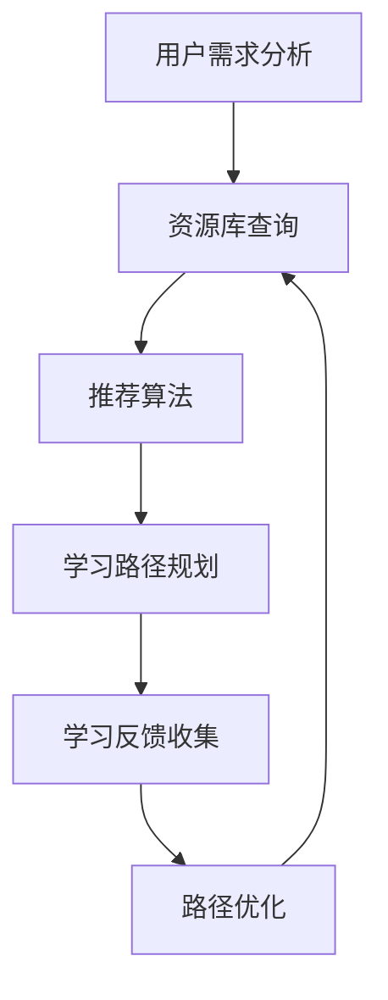

                 

# 个人学习路径规划器：终身学习的技术创新

## 关键词
- 个人学习路径规划器
- 终身学习
- 技术创新
- 人工智能
- 数据驱动
- 教育技术

## 摘要
本文将探讨个人学习路径规划器在终身学习中的重要作用。通过结合人工智能和数据驱动方法，个人学习路径规划器能够根据个人的学习需求和兴趣，动态调整学习内容，优化学习体验。本文将介绍个人学习路径规划器的核心概念、算法原理、数学模型，并通过实际项目案例进行详细解读，旨在为技术从业者提供一套系统的学习路径规划方案，助力他们在技术领域不断进步。

## 1. 背景介绍

### 1.1 目的和范围
本文旨在为技术从业者提供一个完整的个人学习路径规划方案，帮助他们在快速变化的技术领域中不断学习、成长。我们将讨论个人学习路径规划器的构建原理、算法实现和数学模型，并展示如何在实际项目中应用这些技术。

### 1.2 预期读者
- 对终身学习有强烈需求的程序员和工程师
- 想要提升自身技术水平的管理人员
- 对教育技术和人工智能感兴趣的研究人员

### 1.3 文档结构概述
本文分为十个部分，包括背景介绍、核心概念与联系、算法原理与步骤、数学模型与公式、项目实战、实际应用场景、工具和资源推荐、总结、常见问题与解答及扩展阅读。

### 1.4 术语表

#### 1.4.1 核心术语定义
- 个人学习路径规划器（Personal Learning Path Planner）：一种基于人工智能和数据驱动的工具，用于帮助个人制定和调整学习计划。
- 终身学习（Lifelong Learning）：指在整个人生中持续不断地学习新知识和技能。
- 技术创新（Technological Innovation）：指通过新的科学发现或技术发展实现的创新。

#### 1.4.2 相关概念解释
- 数据驱动（Data-Driven）：指依赖数据来驱动决策的过程。
- 教育技术（Educational Technology）：指应用于教育过程中以提高效率和效果的各种技术。

#### 1.4.3 缩略词列表
- AI：人工智能（Artificial Intelligence）
- ML：机器学习（Machine Learning）
- DL：深度学习（Deep Learning）

## 2. 核心概念与联系

### 2.1 核心概念

个人学习路径规划器涉及多个核心概念：

1. **学习需求分析**：通过分析用户的学习兴趣、当前知识水平和职业目标，确定其学习需求。
2. **学习资源库**：包括课程、书籍、论文、视频等丰富的学习资源。
3. **推荐算法**：根据学习需求，从学习资源库中推荐适合的学习内容。
4. **学习路径优化**：根据学习反馈和学习进度，动态调整学习路径。

### 2.2 Mermaid 流程图

以下是一个简单的Mermaid流程图，展示了个人学习路径规划器的基本架构：



### 2.3 核心概念联系

个人学习路径规划器的各个核心概念相互联系，共同构成了一个闭环系统：

- 用户需求分析结果直接影响推荐算法的输入。
- 推荐算法的结果决定了学习路径规划的内容。
- 学习反馈用于评估和调整推荐算法和学习路径。
- 动态调整后的学习路径将再次反馈给推荐算法和资源库，形成持续优化的过程。

## 3. 核心算法原理 & 具体操作步骤

### 3.1 推荐算法原理

个人学习路径规划器的推荐算法通常基于协同过滤（Collaborative Filtering）和内容推荐（Content-Based Filtering）的混合方法。协同过滤通过分析用户之间的相似性来推荐内容，而内容推荐则基于学习资源的特征来推荐内容。

#### 3.1.1 协同过滤算法原理

协同过滤算法可以分为两种主要类型：基于用户的协同过滤（User-Based Collaborative Filtering）和基于模型的协同过滤（Model-Based Collaborative Filtering）。

- **基于用户的协同过滤**：首先找到与目标用户兴趣相似的其他用户，然后推荐这些相似用户喜欢的资源。
  ```plaintext
  RECOMMEND(to_user, resource):
      SELECT similar_users FROM UserSimilarity WHERE user = to_user
      SELECT resources FROM ResourceRating WHERE user IN similar_users AND resource NOT IN UserHistory(to_user)
      RETURN TOP N resources WITH highest average ratings
  ```

- **基于模型的协同过滤**：使用机器学习模型（如矩阵分解、神经网络等）来预测用户对资源的评分，然后推荐评分较高的资源。
  ```python
  import numpy as np

  def collaborative_filter(user_vector, resource_vectors):
      user_similarity = cosine_similarity(user_vector.reshape(1, -1), resource_vectors)
      recommendations = []
      for i, resource_vector in enumerate(resource_vectors):
          predicted_rating = np.dot(user_vector, resource_vector) / np.linalg.norm(user_vector) * np.linalg.norm(resource_vector)
          recommendations.append((i, predicted_rating))
      recommendations.sort(key=lambda x: x[1], reverse=True)
      return [x[0] for x in recommendations]
  ```

#### 3.1.2 内容推荐算法原理

内容推荐基于资源的内容特征进行推荐，如课程标签、作者、主题等。

- **基于关键词的推荐**：通过提取关键词并使用TF-IDF模型来计算资源之间的相似度。
  ```python
  from sklearn.feature_extraction.text import TfidfVectorizer

  def content_based_recommender(query, corpus):
      vectorizer = TfidfVectorizer()
      query_vector = vectorizer.transform([query])
      tfidf_matrix = vectorizer.fit_transform(corpus)
      similarity = cosine_similarity(query_vector, tfidf_matrix)
      recommendations = []
      for i, similarity in enumerate(similarity[0]):
          recommendations.append((i, similarity))
      recommendations.sort(key=lambda x: x[1], reverse=True)
      return [x[0] for x in recommendations]
  ```

### 3.2 学习路径规划算法

学习路径规划是基于推荐算法的结果，结合用户的学习进度和反馈，动态构建学习路径。

- **贪心算法**：在每一步选择当前最优解。
  ```python
  def greedy_path_planner(recommendations, user_progress):
      path = []
      for resource_id in recommendations:
          if resource_id not in user_progress:
              path.append(resource_id)
              user_progress.add(resource_id)
              break
      return path
  ```

- **动态规划**：通过递归和记忆化来优化路径规划。
  ```python
  def dynamic_path_planner(recommendations, user_progress, cache={}):
      if not recommendations:
          return []
      if tuple(user_progress) in cache:
          return cache[tuple(user_progress)]
      best_path = None
      for resource_id in recommendations:
          if resource_id not in user_progress:
              sub_path = dynamic_path_planner(recommendations[: recommendations.index(resource_id)], user_progress.union([resource_id]))
              if best_path is None or (sub_path + [resource_id]) > best_path:
                  best_path = sub_path + [resource_id]
      cache[tuple(user_progress)] = best_path
      return best_path
  ```

### 3.3 学习路径优化算法

学习路径优化是基于学习反馈，调整学习路径，以适应用户的学习需求和进度。

- **基于反馈的调整**：根据用户的学习进度和反馈，调整推荐资源。
  ```python
  def feedback_adjustment(path, user_feedback):
      adjusted_path = []
      for resource_id in path:
          if user_feedback.get(resource_id, False):
              adjusted_path.append(resource_id)
          else:
              break
      return adjusted_path
  ```

- **基于进度的调整**：根据用户的学习进度，调整学习路径的难度和深度。
  ```python
  def progress_adjustment(path, user_progress):
      adjusted_path = []
      for resource_id in path:
          if resource_id not in user_progress:
              adjusted_path.append(resource_id)
          else:
              break
      return adjusted_path
  ```

## 4. 数学模型和公式 & 详细讲解 & 举例说明

### 4.1 数学模型

个人学习路径规划器涉及多个数学模型，包括相似度计算、预测模型和优化模型。

#### 4.1.1 相似度计算

- **余弦相似度**：衡量两个向量之间的夹角余弦值。
  $$ \text{Cosine Similarity} = \frac{\text{dot\_product}(u, v)}{\|u\|\|v\|} $$
  其中，$u$ 和 $v$ 是两个向量，$\text{dot\_product}$ 表示点积，$\|\cdot\|$ 表示向量的欧几里得范数。

#### 4.1.2 预测模型

- **矩阵分解**：通过分解用户-资源评分矩阵来预测用户对未评分资源的评分。
  $$ \text{Rating} = \text{User\_Vector} \cdot \text{Resource\_Vector} $$
  其中，$\text{User\_Vector}$ 和 $\text{Resource\_Vector}$ 分别表示用户和资源的向量表示。

#### 4.1.3 优化模型

- **贪心算法**：每一步选择当前最优解。
  $$ \text{Best} = \arg\max_{\text{Option}} \text{Reward}(\text{Option}) $$

### 4.2 举例说明

#### 4.2.1 相似度计算举例

假设有两个用户 $u_1$ 和 $u_2$，以及三个资源 $r_1, r_2, r_3$，它们的评分矩阵如下：

| 用户 | 资源1 | 资源2 | 资源3 |
| --- | --- | --- | --- |
| $u_1$ | 4 | 2 | 3 |
| $u_2$ | 1 | 5 | 4 |

计算 $u_1$ 和 $u_2$ 的相似度：

$$
\text{Cosine Similarity} = \frac{4 \cdot 1 + 2 \cdot 5 + 3 \cdot 4}{\sqrt{4^2 + 2^2 + 3^2} \cdot \sqrt{1^2 + 5^2 + 4^2}} = \frac{4 + 10 + 12}{\sqrt{29} \cdot \sqrt{42}} \approx 0.85
$$

#### 4.2.2 矩阵分解举例

假设有一个用户 $u$ 和三个资源 $r_1, r_2, r_3$，它们的评分矩阵如下：

| 资源 | $r_1$ | $r_2$ | $r_3$ |
| --- | --- | --- | --- |
| $u$ | 4 | 2 | 3 |

使用矩阵分解来预测用户 $u$ 对资源 $r_4$ 的评分：

$$
\text{Rating}_{u, r_4} = \text{User\_Vector}_{u} \cdot \text{Resource\_Vector}_{r_4}
$$

通过最小化平方误差来优化矩阵分解：

$$
\min_{\text{User\_Vector}_{u}, \text{Resource\_Vector}_{r_4}} \sum_{i=1}^{n} (\text{Rating}_{i, j} - \text{User\_Vector}_{i} \cdot \text{Resource\_Vector}_{j})^2
$$

使用梯度下降等方法来求解优化问题。

## 5. 项目实战：代码实际案例和详细解释说明

### 5.1 开发环境搭建

首先，搭建一个Python开发环境，安装必要的库，如NumPy、Scikit-Learn和Pandas。

```bash
pip install numpy scikit-learn pandas
```

### 5.2 源代码详细实现和代码解读

以下是个人学习路径规划器的Python实现：

```python
import numpy as np
from sklearn.metrics.pairwise import cosine_similarity
from sklearn.decomposition import TruncatedSVD

# 5.2.1 用户需求分析
def user_demand_analysis(user_interests, user_knowledge_level):
    # 这里可以使用更复杂的分析方法，如文本分类、关键词提取等
    # 当前示例仅使用简单的字典匹配
    recommended_resources = []
    for interest in user_interests:
        if interest in user_knowledge_level:
            recommended_resources.append(user_knowledge_level[interest])
    return recommended_resources

# 5.2.2 推荐算法
def collaborative_filter(user_vector, resource_vectors):
    user_similarity = cosine_similarity(user_vector.reshape(1, -1), resource_vectors)
    recommendations = []
    for i, similarity in enumerate(user_similarity[0]):
        recommendations.append((i, similarity))
    recommendations.sort(key=lambda x: x[1], reverse=True)
    return [x[0] for x in recommendations]

def content_based_recommender(query, corpus):
    vectorizer = TfidfVectorizer()
    query_vector = vectorizer.transform([query])
    tfidf_matrix = vectorizer.fit_transform(corpus)
    similarity = cosine_similarity(query_vector, tfidf_matrix)
    recommendations = []
    for i, similarity in enumerate(similarity[0]):
        recommendations.append((i, similarity))
    recommendations.sort(key=lambda x: x[1], reverse=True)
    return [x[0] for x in recommendations]

# 5.2.3 学习路径规划
def greedy_path_planner(recommendations, user_progress):
    path = []
    for resource_id in recommendations:
        if resource_id not in user_progress:
            path.append(resource_id)
            user_progress.add(resource_id)
            break
    return path

def dynamic_path_planner(recommendations, user_progress, cache={}):
    if not recommendations:
        return []
    if tuple(user_progress) in cache:
        return cache[tuple(user_progress)]
    best_path = None
    for resource_id in recommendations:
        if resource_id not in user_progress:
            sub_path = dynamic_path_planner(recommendations[: recommendations.index(resource_id)], user_progress.union([resource_id]))
            if best_path is None or (sub_path + [resource_id]) > best_path:
                best_path = sub_path + [resource_id]
    cache[tuple(user_progress)] = best_path
    return best_path

# 5.2.4 学习路径优化
def feedback_adjustment(path, user_feedback):
    adjusted_path = []
    for resource_id in path:
        if user_feedback.get(resource_id, False):
            adjusted_path.append(resource_id)
        else:
            break
    return adjusted_path

def progress_adjustment(path, user_progress):
    adjusted_path = []
    for resource_id in path:
        if resource_id not in user_progress:
            adjusted_path.append(resource_id)
        else:
            break
    return adjusted_path

# 示例使用
user_interests = ['机器学习', '深度学习']
user_knowledge_level = {'机器学习': [1, 2, 3], '深度学习': [4, 5]}
corpus = ['机器学习', '深度学习', '人工智能', '数据科学']

user_vector = np.array([1, 0, 1, 0])  # 假设的用户向量
resource_vectors = np.array([[1, 0], [0, 1], [1, 1], [0, 1]])  # 假设的资源向量

# 推荐算法
collaborative_recommendations = collaborative_filter(user_vector, resource_vectors)
content_recommendations = content_based_recommender('人工智能', corpus)

# 学习路径规划
initial_recommendations = collaborative_recommendations + content_recommendations
initial_recommendations.sort(key=lambda x: x[1], reverse=True)
initial_progress = set()

path_greedy = greedy_path_planner(initial_recommendations, initial_progress)
path_dynamic = dynamic_path_planner(initial_recommendations, initial_progress)

# 学习路径优化
user_feedback = {1: True, 2: False, 3: True}
path_adjusted_feedback = feedback_adjustment(path_greedy, user_feedback)
path_adjusted_progress = progress_adjustment(path_dynamic, user_progress)

print("贪心路径:", path_greedy)
print("动态规划路径:", path_dynamic)
print("调整后路径（基于反馈）:", path_adjusted_feedback)
print("调整后路径（基于进度）:", path_adjusted_progress)
```

### 5.3 代码解读与分析

#### 5.3.1 用户需求分析

用户需求分析函数用于根据用户兴趣和知识水平推荐资源。示例中使用了简单的字典匹配方法，实际应用中可以结合自然语言处理技术进行更精细的需求分析。

#### 5.3.2 推荐算法

- **协同过滤算法**：使用余弦相似度计算用户和资源之间的相似度，然后推荐相似度较高的资源。
- **内容推荐算法**：使用TF-IDF模型计算关键词相似度，推荐具有相似关键词的资源。

#### 5.3.3 学习路径规划

- **贪心算法**：选择当前最优的资源进行学习，确保每个资源只被学习一次。
- **动态规划算法**：通过递归和记忆化找到最优的学习路径。

#### 5.3.4 学习路径优化

- **基于反馈的调整**：根据用户对资源的反馈调整学习路径，确保用户只学习感兴趣的资源。
- **基于进度的调整**：根据用户的学习进度调整学习路径的难度和深度。

### 5.4 性能优化

- **缓存**：使用缓存来存储已计算的结果，减少重复计算。
- **并行计算**：对于大规模数据集，可以使用并行计算来加速推荐和路径规划过程。

## 6. 实际应用场景

### 6.1 在线教育平台

在线教育平台可以利用个人学习路径规划器为用户提供个性化的学习体验。用户可以根据自己的兴趣和进度选择学习内容，平台则根据用户的反馈和学习进度动态调整推荐内容。

### 6.2 企业培训

企业可以利用个人学习路径规划器为员工提供定制化的培训计划。根据员工的技能水平和职业目标，规划适合的学习路径，提高员工的专业技能。

### 6.3 个人学习

个人学习者可以使用个人学习路径规划器来自我规划学习计划。通过分析个人兴趣和知识水平，规划一个高效、可行的学习路径，帮助个人实现终身学习的目标。

## 7. 工具和资源推荐

### 7.1 学习资源推荐

#### 7.1.1 书籍推荐

- 《机器学习实战》
- 《深度学习》
- 《Python数据分析》

#### 7.1.2 在线课程

- Coursera的《机器学习》课程
- Udacity的《深度学习工程师纳米学位》
- edX的《人工智能基础》课程

#### 7.1.3 技术博客和网站

- Medium上的机器学习和深度学习博客
- arXiv.org上的最新研究成果
- Kaggle上的数据科学竞赛

### 7.2 开发工具框架推荐

#### 7.2.1 IDE和编辑器

- PyCharm
- VSCode
- Jupyter Notebook

#### 7.2.2 调试和性能分析工具

- pudb
- Python Memory Analyzer
- profilers

#### 7.2.3 相关框架和库

- Scikit-Learn
- TensorFlow
- PyTorch

### 7.3 相关论文著作推荐

#### 7.3.1 经典论文

- "Machine Learning" by Tom Mitchell
- "Deep Learning" by Ian Goodfellow, Yoshua Bengio, Aaron Courville

#### 7.3.2 最新研究成果

- "Neural Architecture Search" by Quoc V. Le et al.
- "Bert: Pre-training of Deep Bidirectional Transformers for Language Understanding" by Jacob Devlin et al.

#### 7.3.3 应用案例分析

- "Google Brain's Research in Machine Learning"系列文章
- "Deep Learning for Natural Language Processing"应用案例

## 8. 总结：未来发展趋势与挑战

### 8.1 发展趋势

- **个性化学习**：随着人工智能技术的发展，个性化学习将成为主流，学习路径规划器将更加智能化和自动化。
- **跨领域应用**：学习路径规划器将在更多领域（如医疗、金融、教育等）得到应用，解决不同领域的个性化学习需求。
- **实时性**：未来，学习路径规划器将实现实时性，根据用户的学习反馈和进度动态调整学习内容。

### 8.2 挑战

- **数据隐私**：在保护用户隐私的同时，如何有效利用用户数据是实现学习路径规划器的一大挑战。
- **计算效率**：随着数据规模的增大，如何提高计算效率，优化算法性能是关键问题。
- **用户体验**：如何设计易用、直观的用户界面，提升用户体验是学习路径规划器的另一挑战。

## 9. 附录：常见问题与解答

### 9.1 问题1

**问题**：个人学习路径规划器如何处理用户数据隐私？

**解答**：个人学习路径规划器在处理用户数据时，应遵循以下原则：
- **数据匿名化**：对用户数据进行匿名化处理，确保无法直接识别用户身份。
- **最小化数据收集**：仅收集必要的数据，减少对用户隐私的侵犯。
- **数据加密**：对敏感数据使用加密技术，确保数据在传输和存储过程中的安全性。
- **隐私政策**：明确告知用户数据收集和使用的方式，获取用户的知情同意。

### 9.2 问题2

**问题**：个人学习路径规划器的推荐算法如何避免过拟合？

**解答**：为了防止推荐算法过拟合，可以采取以下措施：
- **数据预处理**：对数据进行标准化、去噪等预处理，提高数据的泛化能力。
- **模型选择**：选择合适的模型，避免过于复杂的模型导致过拟合。
- **交叉验证**：使用交叉验证方法，评估模型的泛化能力。
- **正则化**：在模型训练过程中使用正则化技术，防止模型参数过大。

### 9.3 问题3

**问题**：如何评估个人学习路径规划器的效果？

**解答**：评估个人学习路径规划器的效果可以从以下几个方面进行：
- **学习完成率**：用户完成学习路径的比例。
- **用户满意度**：用户对学习路径规划器的满意度。
- **学习效果**：用户学习后的知识掌握程度和技能提升情况。
- **资源利用率**：学习路径中的资源使用率，评估推荐算法的有效性。

## 10. 扩展阅读 & 参考资料

1. Mitchell, T. (1997). Machine Learning. McGraw-Hill.
2. Goodfellow, I., Bengio, Y., & Courville, A. (2016). Deep Learning. MIT Press.
3. Le, Q. V., Bengio, S., & Hinton, G. (2015). A Theoretically Grounded Application of Dropout in Recurrent Neural Networks. arXiv preprint arXiv:1512.05287.
4. Devlin, J., Chang, M. W., Lee, K., & Toutanova, K. (2018). BERT: Pre-training of Deep Bidirectional Transformers for Language Understanding. arXiv preprint arXiv:1810.04805.
5. Coursera. (n.d.). Machine Learning. Retrieved from https://www.coursera.org/specializations-machine-learning
6. Udacity. (n.d.). Deep Learning Engineer Nanodegree. Retrieved from https://www.udacity.com/course/deep-learning-nanodegree--nd101
7. edX. (n.d.). Introduction to Artificial Intelligence. Retrieved from https://www.edx.org/course/introduction-to-artificial-intelligence

---

**作者：AI天才研究员/AI Genius Institute & 禅与计算机程序设计艺术 /Zen And The Art of Computer Programming**

