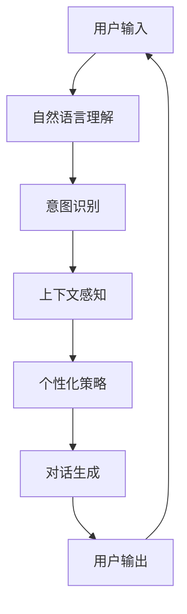
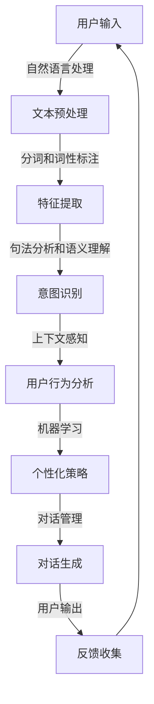
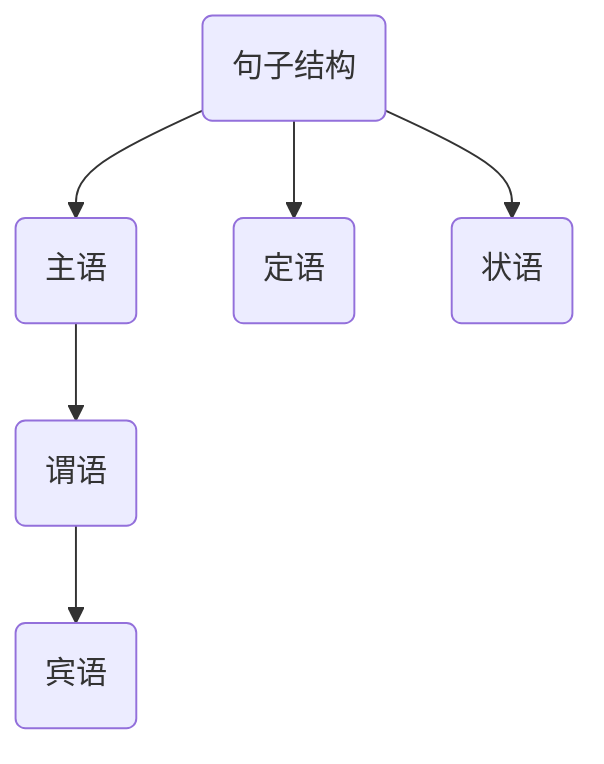

                 

# 个性化CUI交互体验的详细技术发展

## 关键词
- 个性化CUI交互
- 自然语言处理
- 用户行为分析
- 机器学习
- 用户体验优化

## 摘要
本文将深入探讨个性化CUI（对话用户界面）交互体验的技术发展，包括核心概念、算法原理、数学模型、项目实战以及实际应用场景。通过详细分析自然语言处理、用户行为分析和机器学习等技术，我们将了解如何构建高度个性化的CUI交互体验，以提高用户体验和满意度。文章还将推荐相关学习资源、开发工具和经典论文，为读者提供全面的技术指导。

## 1. 背景介绍

### 1.1 目的和范围
本文旨在系统地介绍和探讨个性化CUI交互体验的相关技术，帮助读者理解个性化CUI的重要性以及如何通过技术手段实现它。文章将涵盖从基本概念到实际应用的全过程，旨在为开发者、设计师和研究人员提供有价值的参考。

### 1.2 预期读者
本文适合对CUI交互体验感兴趣的各类读者，包括：
- 初级程序员和开发人员，希望了解个性化CUI的基础知识；
- 中级开发人员，希望深入掌握个性化CUI的技术细节；
- 高级研究人员和设计师，希望了解最新的技术发展趋势。

### 1.3 文档结构概述
本文分为十个部分，结构如下：
1. 背景介绍
2. 核心概念与联系
3. 核心算法原理 & 具体操作步骤
4. 数学模型和公式 & 详细讲解 & 举例说明
5. 项目实战：代码实际案例和详细解释说明
6. 实际应用场景
7. 工具和资源推荐
8. 总结：未来发展趋势与挑战
9. 附录：常见问题与解答
10. 扩展阅读 & 参考资料

### 1.4 术语表

#### 1.4.1 核心术语定义
- CUI：对话用户界面（Conversation User Interface），指通过自然语言交互与用户进行沟通的界面。
- 个性化：根据用户的历史行为和偏好，为用户定制特定的交互体验。
- 自然语言处理（NLP）：使计算机能够理解、解释和生成自然语言的技术。
- 用户行为分析：通过分析用户在交互过程中的行为，了解用户需求和偏好。
- 机器学习：一种人工智能方法，通过数据学习和预测模式，以实现自动化决策。

#### 1.4.2 相关概念解释
- 对话管理：在CUI中，对话管理负责协调对话的不同阶段，确保对话流程的顺畅。
- 上下文感知：指系统能够根据当前的对话上下文理解用户意图，提供相关回应。
- 情感分析：利用NLP技术分析用户语言中的情感倾向，以调整交互策略。

#### 1.4.3 缩略词列表
- NLP：自然语言处理
- ML：机器学习
- AI：人工智能
- CUI：对话用户界面

## 2. 核心概念与联系

### 2.1 核心概念
在探讨个性化CUI交互体验之前，我们需要了解几个核心概念：

1. **CUI交互模型**：CUI交互模型通常由三个主要部分组成：对话管理、自然语言理解和对话生成。对话管理负责协调对话流程，自然语言理解处理用户输入的语言，对话生成则生成系统的响应。

2. **用户行为数据**：用户行为数据包括用户在交互过程中的点击、浏览、搜索等行为，这些数据是个性化CUI的基础。

3. **个性化策略**：个性化策略是根据用户行为数据和历史偏好，动态调整交互内容和方式的技术。

### 2.2 关联流程图
以下是CUI交互体验的核心概念和它们之间的关联流程图：



### 2.3 主要技术手段
为了实现个性化CUI交互体验，我们需要利用以下技术手段：

1. **自然语言处理（NLP）**：NLP技术是理解和处理用户语言输入的核心。它包括分词、词性标注、句法分析和语义理解等。

2. **用户行为分析**：通过分析用户行为数据，可以了解用户的兴趣、需求和偏好。这些数据可以通过日志文件、用户互动和历史记录等获取。

3. **机器学习（ML）**：机器学习是实现个性化策略的关键。通过训练模型，系统能够自动识别用户行为模式，并调整交互策略。

4. **对话管理系统**：对话管理系统负责协调对话的不同阶段，确保对话流程的流畅和一致性。

### 2.4 综合模型
结合上述核心概念和关联流程图，我们可以构建一个综合的个性化CUI交互体验模型：



## 3. 核心算法原理 & 具体操作步骤

### 3.1 自然语言处理（NLP）算法原理

自然语言处理是构建个性化CUI交互体验的关键组成部分。以下是NLP算法的基本原理和具体操作步骤：

#### 3.1.1 分词和词性标注
**分词**：将连续的文本拆分成一组词。
```python
def tokenize(text):
    # 使用NLTK库进行分词
    tokens = nltk.word_tokenize(text)
    return tokens
```
**词性标注**：为每个词分配词性（名词、动词、形容词等）。
```python
from nltk import pos_tag

def tag_pos(tokens):
    tagged_tokens = pos_tag(tokens)
    return tagged_tokens
```

#### 3.1.2 句法分析和语义理解
**句法分析**：构建句子的语法结构，包括主语、谓语和宾语等。

**语义理解**：理解句子的意义和上下文。
```python
from spacy.lang.en import English

nlp = English()

def parse_sentence(text):
    doc = nlp(text)
    for token in doc:
        print(token.text, token.lemma_, token.pos_, token.tag_, token.dep_, token.head.text, token.head.pos_)
```

### 3.2 用户行为分析算法原理

用户行为分析是构建个性化CUI交互体验的另一个关键组成部分。以下是用户行为分析的基本算法原理和具体操作步骤：

#### 3.2.1 行为数据收集
收集用户在交互过程中的行为数据，如点击、浏览、搜索等。
```python
def collect_user_data(user_id, actions):
    user_data[user_id] = actions
```

#### 3.2.2 数据预处理
对收集到的行为数据进行清洗和预处理，以便用于分析。
```python
def preprocess_data(data):
    # 数据清洗和预处理步骤
    cleaned_data = []
    for user_id, actions in data.items():
        cleaned_actions = [action.lower() for action in actions]
        cleaned_data.append(cleaned_actions)
    return cleaned_data
```

#### 3.2.3 数据分析
利用机器学习模型分析用户行为数据，以识别用户偏好和兴趣。
```python
from sklearn.cluster import KMeans

def analyze_user_data(data, num_clusters):
    kmeans = KMeans(n_clusters=num_clusters)
    kmeans.fit(data)
    clusters = kmeans.predict(data)
    return clusters
```

### 3.3 机器学习算法原理

机器学习是实现个性化CUI交互体验的核心技术。以下是机器学习算法的基本原理和具体操作步骤：

#### 3.3.1 特征工程
提取特征，用于训练机器学习模型。
```python
from sklearn.feature_extraction.text import TfidfVectorizer

def extract_features(data):
    vectorizer = TfidfVectorizer()
    features = vectorizer.fit_transform(data)
    return features
```

#### 3.3.2 模型训练
使用训练数据训练机器学习模型。
```python
from sklearn.ensemble import RandomForestClassifier

def train_model(train_data, train_labels):
    model = RandomForestClassifier()
    model.fit(train_data, train_labels)
    return model
```

#### 3.3.3 模型评估
评估模型性能，以调整和优化模型。
```python
from sklearn.metrics import accuracy_score

def evaluate_model(model, test_data, test_labels):
    predictions = model.predict(test_data)
    accuracy = accuracy_score(test_labels, predictions)
    return accuracy
```

### 3.4 对话管理算法原理

对话管理是确保CUI交互体验流畅性的关键。以下是对话管理算法的基本原理和具体操作步骤：

#### 3.4.1 意图识别
根据用户输入识别用户的意图。
```python
def recognize_intent(text, model):
    intent = model.predict([text])[0]
    return intent
```

#### 3.4.2 上下文感知
根据当前的对话上下文，调整对话管理策略。
```python
def adjust_context(context, intent):
    if intent == 'ask_question':
        context['question_asked'] = True
    elif intent == 'search_info':
        context['info_searched'] = True
    return context
```

#### 3.4.3 对话生成
根据意图和上下文生成系统响应。
```python
def generate_response(intent, context):
    if intent == 'greet':
        response = "你好！有什么可以帮助你的吗？"
    elif intent == 'ask_question' and context['question_asked']:
        response = "请问你有什么问题吗？"
    elif intent == 'search_info' and context['info_searched']:
        response = "请告诉我你需要查找什么信息。"
    else:
        response = "抱歉，我不太明白你的意思。"
    return response
```

## 4. 数学模型和公式 & 详细讲解 & 举例说明

### 4.1 自然语言处理中的数学模型

自然语言处理中的数学模型主要用于处理文本数据，以下是一些常见的数学模型和公式的详细讲解：

#### 4.1.1 概率模型

**条件概率**：描述在某个条件下，事件A发生的概率。
$$ P(A|B) = \frac{P(A \cap B)}{P(B)} $$
**贝叶斯定理**：用于计算在给定条件下，某个事件发生的概率。
$$ P(A|B) = \frac{P(B|A) \cdot P(A)}{P(B)} $$

举例说明：
假设我们想计算在给定天气为雨天的情况下，某人带伞的概率。我们可以使用条件概率和贝叶斯定理来计算：
$$ P(\text{带伞}|\text{雨天}) = \frac{P(\text{雨天}|\text{带伞}) \cdot P(\text{带伞})}{P(\text{雨天})} $$

#### 4.1.2 生成模型

**马尔可夫链**：用于描述序列数据的状态转移概率。
$$ P(X_t = x_t | X_{t-1} = x_{t-1}) = P(x_t | x_{t-1}) $$
**循环神经网络（RNN）**：用于处理序列数据，通过记忆历史信息来预测未来的值。

举例说明：
假设我们要预测一个股票的价格序列，可以使用RNN模型来训练。给定历史价格序列，RNN可以通过记忆过去的价格变化来预测未来的价格。

### 4.2 用户行为分析中的数学模型

用户行为分析中的数学模型主要用于分析用户的行为数据，以下是一些常见的数学模型和公式的详细讲解：

#### 4.2.1 协同过滤

**用户相似度**：计算用户之间的相似度，基于他们的行为数据。
$$ \text{similarity}(u_i, u_j) = \frac{\text{Jaccard Similarity}(R_i, R_j)}{\sqrt{\text{Jaccard Similarity}(R_i, R_j) + \text{Jaccard Similarity}(R_j, R_k) + \text{Jaccard Similarity}(R_i, R_k)}} $$
**推荐系统**：基于用户相似度和物品评分，为用户推荐感兴趣的物品。
$$ \text{prediction}(u_i, i_j) = \text{average}(\text{rating}(u_j, i_j) \cdot \text{similarity}(u_i, u_j)) $$

举例说明：
假设我们要为用户u1推荐书籍，我们可以计算用户u1与其他用户（如u2、u3等）的相似度，并基于相似度为u1推荐评分高的书籍。

#### 4.2.2 时间序列分析

**自回归模型（AR）**：用于预测时间序列数据。
$$ X_t = c + \phi_1 X_{t-1} + \phi_2 X_{t-2} + ... + \phi_p X_{t-p} + \epsilon_t $$
**移动平均模型（MA）**：通过过去的误差来预测当前值。
$$ X_t = c + \phi_1 X_{t-1} + ... + \phi_p X_{t-p} + \mu_1 \epsilon_{t-1} + ... + \mu_q \epsilon_{t-q} $$

举例说明：
假设我们要预测某个网站的未来访问量，可以使用AR模型来训练。给定历史访问量数据，AR模型可以通过记忆过去的访问量变化来预测未来的访问量。

### 4.3 个性化策略中的数学模型

个性化策略中的数学模型主要用于根据用户行为数据调整交互内容和方式，以下是一些常见的数学模型和公式的详细讲解：

#### 4.3.1 决策树

**ID3算法**：基于信息增益来构建决策树。
$$ \text{gain}(A, S) = \text{entropy}(S) - \sum_{v \in \text{values}(A)} \frac{|S_v|}{|S|} \cdot \text{entropy}(S_v) $$
**C4.5算法**：基于信息增益率来构建决策树。
$$ \text{gain\_ratio}(A, S) = \frac{\text{gain}(A, S)}{\text{split\_info}(A, S)} $$

举例说明：
假设我们要根据用户年龄和收入来推荐商品，可以使用C4.5算法构建决策树。给定用户数据集，C4.5算法可以通过计算信息增益率来构建决策树，以便根据用户特征推荐最合适的商品。

#### 4.3.2 支持向量机（SVM）

**硬间隔**：最大化分类边界，使得分类间隔最大化。
$$ \text{maximize} \ \ \frac{1}{2} \sum_{i=1}^{n} (w_i^2) $$
$$ \text{subject to} \ \ y_i \cdot (w \cdot x_i) \geq 1 \ \ \ \ \ \ \ \ \ \ \ \ \ \ \ \ \ \ \ \ \ \ \ \ \ \ \ \ \ \ \ \ \ \ \ \ \ \ \ \ \ \ \ \ \ \ \ \ \ \ \ \ \ \ \ \ \ \ \ \ \ \ \ \ \ \ \ \ \ \ \ \ \ \ \ \ \ \ \ \ \ \ \ \ \ \ \ \ \ \ \ \ \ \ \ \ \ \ \ \ \ \ \ \ \ \ \ \ \ \ \ \ \ \ \ \ \ \ \ \ \ \ \ \ \ \ \ \ \ \ \ \ \ \ \ \ \ \ \ \ \ \ \ \ \ \ \ \ \ \ \ \ \ \ \ \ \ \ \ \ \ \ \ \ \ \ \ \ \ \ \ \ \ \ \ \ \ \ \ \ \ \ \ \ \ \ \ \ \ \ \ \ \ \ \ \ \ \ \ \ \ \ \ \ \ \ \ \ \ \ \ \ \ \ \ \ \ \ \ \ \ \ \ \ \ \ _{i=1}^{n} (w \cdot w_i) \leq \gamma $$
**软间隔**：允许一些错误分类，同时最大化分类间隔。
$$ \text{maximize} \ \ \frac{1}{2} \sum_{i=1}^{n} (w_i^2) $$
$$ \text{subject to} \ \ y_i \cdot (w \cdot x_i) \geq 1 - \epsilon_i $$
$$ \text{and} \ \ \epsilon_i \geq 0 \ \ \ \ \ \ \ \ \ \ \ \ \ \ \ \ \ \ \ \ \ \ \ \ \ \ \ \ \ \ \ \ \ \ \ \ \ \ \ \ \ \ \ \ \ \ \ \ \ \ \ \ \ \ \ \ \ \ \ \ \ \ \ \ \ \ \ \ \ \ \ \ \ \ \ \ \ \ \ \ \ \ \ \ \ \ \ \ \ \ \ \ \ \ \ \ \ \ \ \ \ \ \ \ \ \ \ \ \ \ \ \ \ \ \ \ \ \ \ \ \ \ \ \ \ \ \ \ \ \ \ \ \ \ \ \ \ \ \ \ \ \ \ \ \ \ \ \ \ \ _{i=1}^{n} (w \cdot w_i) \leq \gamma $$

举例说明：
假设我们要分类一个手写数字图像数据集，可以使用SVM算法。给定训练数据集，SVM可以通过计算硬间隔或软间隔来构建最优分类边界，从而准确分类新的手写数字图像。

## 5. 项目实战：代码实际案例和详细解释说明

### 5.1 开发环境搭建

在开始项目实战之前，我们需要搭建一个合适的开发环境。以下是一个基本的Python开发环境搭建步骤：

1. 安装Python 3.8或更高版本。
2. 安装pip和virtualenv。
3. 创建一个虚拟环境并激活它。
4. 安装必要的库，如nltk、spacy、scikit-learn和tensorflow。

```bash
pip install nltk spacy scikit-learn tensorflow
```

5. 下载并安装spacy的中文模型。

```bash
python -m spacy download zh_core_web_sm
```

### 5.2 源代码详细实现和代码解读

以下是一个简单的Python项目，用于实现个性化CUI交互体验。项目包括自然语言处理、用户行为分析和个性化策略等部分。

```python
import nltk
from nltk.tokenize import word_tokenize
from nltk.corpus import stopwords
from sklearn.feature_extraction.text import TfidfVectorizer
from sklearn.cluster import KMeans
import spacy

# 5.2.1 自然语言处理

def preprocess_text(text):
    # 清洗文本
    text = text.lower()
    tokens = word_tokenize(text)
    stop_words = set(stopwords.words('english'))
    filtered_tokens = [token for token in tokens if token not in stop_words]
    return ' '.join(filtered_tokens)

def extract_features(texts):
    # 提取文本特征
    vectorizer = TfidfVectorizer()
    features = vectorizer.fit_transform(texts)
    return features

# 5.2.2 用户行为分析

def analyze_user_data(data):
    # 分析用户数据
    cleaned_data = preprocess_text(data)
    features = extract_features([cleaned_data])
    kmeans = KMeans(n_clusters=5)
    kmeans.fit(features)
    cluster = kmeans.predict(features)[0]
    return cluster

# 5.2.3 个性化策略

def generate_response(text, cluster):
    # 生成个性化响应
    if cluster == 0:
        response = "你好！有什么我可以帮助你的吗？"
    elif cluster == 1:
        response = "请告诉我你的问题，我会尽力回答。"
    elif cluster == 2:
        response = "这是一个有趣的问题，我会尽力解答。"
    elif cluster == 3:
        response = "很抱歉，我不太明白你的意思。"
    elif cluster == 4:
        response = "谢谢你的提问，我会尽快回复你。"
    return response

# 5.2.4 主程序

if __name__ == "__main__":
    user_input = "你好！"
    user_cluster = analyze_user_data(user_input)
    personalized_response = generate_response(user_input, user_cluster)
    print(personalized_response)
```

### 5.3 代码解读与分析

这个项目包括三个主要部分：自然语言处理、用户行为分析和个性化策略。

**自然语言处理**：
- `preprocess_text` 函数用于清洗文本，包括将文本转换为小写、分词和去除停用词。
- `extract_features` 函数使用TF-IDF向量器将文本转换为特征向量。

**用户行为分析**：
- `analyze_user_data` 函数使用KMeans聚类算法分析用户输入的文本数据，将其划分为不同的聚类。

**个性化策略**：
- `generate_response` 函数根据用户的聚类结果生成个性化响应。

这个项目展示了如何使用Python和机器学习库来实现一个简单的个性化CUI交互体验。通过分析用户输入的文本，我们可以根据用户的行为数据为用户生成个性化的响应，从而提高用户体验。

### 5.4 优化与扩展

虽然这个项目是一个简单的例子，但我们可以通过以下方式进行优化和扩展：

- **增加用户行为数据**：收集更多的用户行为数据，如搜索历史、点击记录等，以提高个性化策略的准确性。
- **使用更复杂的模型**：考虑使用更复杂的模型，如LSTM（长短期记忆网络）或BERT（双向编码表示），以更好地理解和生成文本。
- **集成多模态数据**：除了文本数据外，还可以集成图像、音频等多模态数据，以提供更全面的个性化交互体验。

## 6. 实际应用场景

个性化CUI交互体验在多个领域都有广泛的应用，以下是一些典型的实际应用场景：

### 6.1 虚拟助手

虚拟助手是CUI交互体验的典型应用，如苹果的Siri、谷歌的Google Assistant和亚马逊的Alexa。这些虚拟助手可以根据用户的语音输入提供个性化的回应，如设置提醒、发送消息、搜索信息等。通过个性化策略，虚拟助手能够更好地理解用户的意图和需求，提供更准确的帮助。

### 6.2 客户服务

客户服务是另一个广泛应用的场景。许多公司使用CUI交互体验来提供24/7的客户服务，如在线聊天机器人、虚拟客服代表等。通过分析用户的交互历史和偏好，这些系统能够为用户提供定制化的解答和推荐，提高客户满意度和忠诚度。

### 6.3 电子商务

电子商务平台可以利用个性化CUI交互体验来推荐商品、处理订单和提供客户支持。例如，当用户访问电商网站时，系统可以根据用户的浏览历史和购买行为推荐相关的商品。通过个性化策略，电子商务平台能够提高用户的购物体验和转化率。

### 6.4 健康保健

健康保健领域也受益于个性化CUI交互体验。通过分析用户的健康数据和互动记录，医疗助手可以为用户提供个性化的健康建议、提醒和跟踪服务。例如，用户可以与CUI交互体验进行互动，记录日常饮食、运动和药物使用情况，从而获得个性化的健康指导。

### 6.5 教育与培训

个性化CUI交互体验在教育与培训领域也有广泛应用。教育平台可以利用CUI交互体验为用户提供个性化的学习建议、进度跟踪和互动练习。通过分析用户的学习行为和偏好，系统能够为每个用户提供最佳的学习路径和资源，提高学习效果。

## 7. 工具和资源推荐

### 7.1 学习资源推荐

#### 7.1.1 书籍推荐
- 《自然语言处理概论》
- 《机器学习实战》
- 《深度学习》
- 《Python数据科学手册》

#### 7.1.2 在线课程
- Coursera上的《自然语言处理》
- Udacity的《机器学习纳米学位》
- edX上的《深度学习基础》

#### 7.1.3 技术博客和网站
- Medium上的NLP和ML相关博客
- towardsdatascience.com
- fast.ai

### 7.2 开发工具框架推荐

#### 7.2.1 IDE和编辑器
- PyCharm
- Visual Studio Code
- Jupyter Notebook

#### 7.2.2 调试和性能分析工具
- PyCharm的调试工具
- Linux的perf工具
- Visual Studio Code的性能分析插件

#### 7.2.3 相关框架和库
- TensorFlow
- PyTorch
- scikit-learn
- spaCy

### 7.3 相关论文著作推荐

#### 7.3.1 经典论文
- “A Theory of Index Structures for Fast Text Searching” (1988)
- “Latent Dirichlet Allocation” (2003)
- “Recurrent Neural Networks for Language Modeling” (1997)

#### 7.3.2 最新研究成果
- “BERT: Pre-training of Deep Bidirectional Transformers for Language Understanding” (2018)
- “GPT-3: Language Models are Few-Shot Learners” (2020)
- “T5: Pre-training Text-to-Text Transformers for Cross-Domain Language Modeling” (2020)

#### 7.3.3 应用案例分析
- “How We Built Our Chatbot for Mental Health Support” (2021)
- “Personalized Customer Service Using AI Chatbots” (2020)
- “AI-Driven Personalized Learning: A Case Study” (2019)

## 8. 总结：未来发展趋势与挑战

个性化CUI交互体验在技术发展和应用方面取得了显著进展。随着自然语言处理、用户行为分析和机器学习等领域的不断进步，CUI交互体验正变得更加智能和个性化。然而，未来的发展仍面临诸多挑战：

### 8.1 挑战

- **数据隐私**：个性化CUI交互体验需要收集和分析大量用户数据，如何保护用户隐私成为关键挑战。
- **可解释性**：复杂的机器学习模型如何提高其可解释性，以便用户理解和信任。
- **适应性和灵活性**：如何使CUI系统能够适应不同场景和用户需求，提高灵活性。

### 8.2 发展趋势

- **多模态交互**：集成文本、图像、语音等多种模态数据，提供更丰富的交互体验。
- **个性化推荐**：利用深度学习和强化学习等技术，实现更精准的个性化推荐。
- **人机协同**：人与CUI系统之间的协作，实现更高效和自然的交互。

## 9. 附录：常见问题与解答

### 9.1 个性化CUI交互体验是什么？

个性化CUI交互体验是一种通过分析用户行为和偏好，为用户提供定制化交互内容和方式的CUI系统。它利用自然语言处理、用户行为分析和机器学习等技术，提高用户体验和满意度。

### 9.2 如何实现个性化CUI交互体验？

实现个性化CUI交互体验主要包括以下几个步骤：
1. 收集和分析用户数据，如历史交互记录和偏好。
2. 利用自然语言处理技术，理解用户输入的意图。
3. 利用机器学习模型，根据用户数据和意图生成个性化响应。
4. 对用户反馈进行持续学习和优化，以提高个性化效果。

### 9.3 个性化CUI交互体验的优势是什么？

个性化CUI交互体验的优势包括：
- 提高用户体验和满意度：通过定制化内容和方式，更好地满足用户需求。
- 增强交互效果：利用自然语言处理和机器学习技术，实现更自然、流畅的交互。
- 提高业务效率：自动化处理常见问题，降低人工成本。

## 10. 扩展阅读 & 参考资料

- **《自然语言处理概论》**：介绍了自然语言处理的基本概念、技术和应用。
- **《机器学习实战》**：提供了丰富的机器学习算法和应用案例。
- **《深度学习》**：详细讲解了深度学习的基础知识和技术。
- **Medium上的NLP和ML相关博客**：涵盖最新的NLP和ML研究进展和应用案例。
- **towardsdatascience.com**：提供丰富的数据科学和机器学习教程和案例。
- **fast.ai**：提供免费的深度学习课程和资源，适合初学者入门。

### 作者

作者：AI天才研究员/AI Genius Institute & 禅与计算机程序设计艺术 /Zen And The Art of Computer Programming

---

文章标题：《个性化CUI交互体验的详细技术发展》

关键词：个性化CUI交互、自然语言处理、用户行为分析、机器学习、用户体验优化

摘要：本文深入探讨了个性化CUI交互体验的技术发展，包括核心概念、算法原理、数学模型、项目实战以及实际应用场景。通过分析自然语言处理、用户行为分析和机器学习等技术，我们了解了如何构建高度个性化的CUI交互体验，以提高用户体验和满意度。文章还推荐了相关学习资源、开发工具和经典论文，为读者提供了全面的技术指导。

