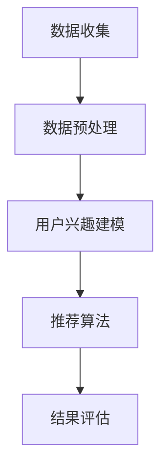

                 


# 个性化排序系统：AI的实现

> 关键词：个性化排序、机器学习、算法优化、用户体验、大数据分析

> 摘要：本文将探讨个性化排序系统在人工智能领域的实现与应用。通过分析个性化排序的核心概念、算法原理和具体实现步骤，结合实际项目案例，本文旨在为读者提供一个全面深入的了解，并展望个性化排序系统在未来的发展趋势与挑战。

## 1. 背景介绍

### 1.1 目的和范围

个性化排序系统是大数据分析和机器学习的重要应用之一。其核心目标是根据用户的兴趣、行为和历史数据，为用户推荐最相关的内容，从而提升用户体验。本文旨在介绍个性化排序系统的工作原理和实现方法，并探讨其在实际应用中的挑战和未来发展方向。

### 1.2 预期读者

本文适合对大数据分析、机器学习和算法设计有一定了解的读者。无论是算法工程师、数据科学家，还是对技术有浓厚兴趣的普通读者，都可以通过本文获得有价值的信息。

### 1.3 文档结构概述

本文分为以下几个部分：

1. **背景介绍**：介绍个性化排序系统的目的和范围，预期读者和文档结构。
2. **核心概念与联系**：讲解个性化排序系统的核心概念、原理和架构。
3. **核心算法原理 & 具体操作步骤**：详细阐述个性化排序的算法原理和具体实现步骤。
4. **数学模型和公式 & 详细讲解 & 举例说明**：介绍个性化排序涉及的数学模型和公式，并通过实例进行说明。
5. **项目实战：代码实际案例和详细解释说明**：提供实际代码案例，并进行详细解读和分析。
6. **实际应用场景**：探讨个性化排序系统的应用场景和挑战。
7. **工具和资源推荐**：推荐相关学习资源和开发工具。
8. **总结：未来发展趋势与挑战**：总结个性化排序系统的现状，展望未来发展趋势和挑战。
9. **附录：常见问题与解答**：回答读者可能遇到的常见问题。
10. **扩展阅读 & 参考资料**：提供进一步学习的资料。

### 1.4 术语表

#### 1.4.1 核心术语定义

- **个性化排序**：根据用户的兴趣、行为和历史数据，为用户推荐最相关的内容。
- **机器学习**：通过数据训练模型，使其具备自动学习和预测能力。
- **算法优化**：改进算法性能，使其在特定条件下表现更好。

#### 1.4.2 相关概念解释

- **用户体验**：用户在使用产品或服务时的感受和体验。
- **大数据分析**：处理和分析大量数据，从中提取有价值的信息。

#### 1.4.3 缩略词列表

- **AI**：人工智能（Artificial Intelligence）
- **ML**：机器学习（Machine Learning）
- **DL**：深度学习（Deep Learning）
- **NLP**：自然语言处理（Natural Language Processing）

## 2. 核心概念与联系

个性化排序系统涉及多个核心概念和联系。以下是这些概念和联系的简要概述，以及一个Mermaid流程图来展示其架构。

### 2.1 核心概念

- **用户行为数据**：用户的浏览、搜索、点击等行为数据。
- **内容数据**：推荐系统中的各种内容数据，如文章、商品、视频等。
- **用户兴趣模型**：根据用户行为数据生成的用户兴趣模型。
- **推荐算法**：用于生成个性化推荐列表的算法。

### 2.2 联系

个性化排序系统通过以下流程实现：

1. **数据收集**：收集用户行为数据和内容数据。
2. **数据预处理**：清洗、转换和归一化数据。
3. **用户兴趣建模**：使用机器学习算法生成用户兴趣模型。
4. **推荐算法**：根据用户兴趣模型和内容数据，生成个性化推荐列表。
5. **结果评估**：评估推荐结果的质量和用户满意度。

### 2.3 Mermaid流程图



通过这个流程，个性化排序系统能够根据用户兴趣和内容数据，为用户推荐最相关的内容。接下来，我们将深入探讨个性化排序的核心算法原理和具体实现步骤。

## 3. 核心算法原理 & 具体操作步骤

个性化排序系统的核心在于算法。本节将详细介绍个性化排序的算法原理和具体实现步骤，以便读者能够更好地理解这一系统的工作机制。

### 3.1 算法原理

个性化排序算法主要分为以下几类：

1. **基于协同过滤的算法**：通过分析用户之间的相似度，为用户推荐其他相似用户喜欢的内容。
2. **基于内容的算法**：根据用户的历史行为和内容特征，为用户推荐相似内容。
3. **混合算法**：结合协同过滤和基于内容的算法，以提升推荐效果。

在本节中，我们将以基于协同过滤的算法为例，详细阐述其原理和实现步骤。

#### 3.1.1 相似度计算

协同过滤算法的核心在于相似度计算。相似度计算的目标是找到与目标用户相似的其他用户，从而为这些用户推荐目标用户可能感兴趣的内容。常用的相似度计算方法包括：

- **用户-用户相似度**：计算目标用户与其他用户之间的相似度。
- **项目-项目相似度**：计算目标内容与其他内容之间的相似度。

以下是一个相似度计算的伪代码：

```python
def calculate_similarity(user1, user2):
    # 计算用户1和用户2的共同评分数量
    common_ratings = len(set(user1.ratings) & set(user2.ratings))
    # 计算用户1和用户2的评分差值平方和
    sum_squared_diff = sum([(user1.rating[i] - user2.rating[i]) ** 2 for i in range(len(user1.ratings)) if i in user2.ratings])
    # 计算相似度
    similarity = 1 - sqrt(sum_squared_diff) / (1 + len(user1.ratings) - common_ratings)
    return similarity
```

#### 3.1.2 推荐列表生成

在计算用户相似度后，我们需要根据相似度为用户生成推荐列表。以下是一个推荐列表生成的伪代码：

```python
def generate_recommendation_list(target_user, users, items, similarity_threshold=0.5):
    recommendation_list = []
    for user in users:
        similarity = calculate_similarity(target_user, user)
        if similarity > similarity_threshold:
            # 为用户生成推荐列表
            recommendations = find_recommendations(user, items)
            recommendation_list.extend(recommendations)
    # 对推荐列表进行排序
    recommendation_list.sort(key=lambda x: x['confidence'], reverse=True)
    return recommendation_list
```

#### 3.1.3 推荐结果评估

推荐结果评估是确保推荐系统质量的重要环节。常用的评估方法包括：

- **准确性**：评估推荐列表中包含的目标用户实际感兴趣的内容的比例。
- **覆盖率**：评估推荐列表中包含的内容多样性。
- **新颖性**：评估推荐列表中包含的新内容比例。

以下是一个推荐结果评估的伪代码：

```python
def evaluate_recommendations(recommendation_list, target_user, items):
    # 评估准确性
    accuracy = len([item for item in recommendation_list if item['item'] in target_user.interested_items]) / len(recommendation_list)
    # 评估覆盖率
    coverage = len(set([item['item'] for item in recommendation_list])) / len(items)
    # 评估新颖性
    novelty = len([item for item in recommendation_list if item['item'] not in target_user.history_items]) / len(recommendation_list)
    return accuracy, coverage, novelty
```

### 3.2 实现步骤

个性化排序系统的实现分为以下几个步骤：

1. **数据收集**：收集用户行为数据和内容数据。
2. **数据预处理**：清洗、转换和归一化数据。
3. **用户兴趣建模**：使用机器学习算法生成用户兴趣模型。
4. **相似度计算**：计算用户之间的相似度。
5. **推荐列表生成**：根据用户相似度生成推荐列表。
6. **推荐结果评估**：评估推荐结果的质量。

通过以上步骤，个性化排序系统能够为用户提供高质量的个性化推荐。

## 4. 数学模型和公式 & 详细讲解 & 举例说明

在个性化排序系统中，数学模型和公式起着至关重要的作用。这些模型和公式不仅帮助计算用户之间的相似度，还用于评估推荐结果的质量。在本节中，我们将详细讲解个性化排序系统中的数学模型和公式，并通过实例进行说明。

### 4.1 相似度计算公式

相似度计算是个性化排序系统的核心。以下是一个常用的相似度计算公式：余弦相似度。

余弦相似度（Cosine Similarity）是一种衡量两个向量之间相似度的方法。其公式如下：

$$
similarity = \frac{\vec{u} \cdot \vec{v}}{|\vec{u}| \times |\vec{v}|}
$$

其中，$\vec{u}$和$\vec{v}$分别表示用户$u$和用户$v$的行为向量，$|\vec{u}|$和$|\vec{v}|$分别表示用户$u$和用户$v$的行为向量长度，$\cdot$表示向量的点积。

#### 4.1.1 举例说明

假设我们有两个用户$u$和$v$，其行为向量如下：

$$
\vec{u} = (0.6, 0.2, 0.4, 0.8, 0.1)
$$

$$
\vec{v} = (0.5, 0.3, 0.5, 0.7, 0.2)
$$

首先，计算两个向量的点积：

$$
\vec{u} \cdot \vec{v} = 0.6 \times 0.5 + 0.2 \times 0.3 + 0.4 \times 0.5 + 0.8 \times 0.7 + 0.1 \times 0.2 = 0.475
$$

然后，计算两个向量的长度：

$$
|\vec{u}| = \sqrt{0.6^2 + 0.2^2 + 0.4^2 + 0.8^2 + 0.1^2} = \sqrt{1.29}
$$

$$
|\vec{v}| = \sqrt{0.5^2 + 0.3^2 + 0.5^2 + 0.7^2 + 0.2^2} = \sqrt{1.29}
$$

最后，计算余弦相似度：

$$
similarity = \frac{0.475}{\sqrt{1.29} \times \sqrt{1.29}} = 0.475
$$

#### 4.1.2 应用场景

余弦相似度常用于协同过滤算法中的相似度计算。它能够有效衡量用户之间的相似度，从而为用户生成个性化推荐列表。

### 4.2 推荐结果评估公式

推荐结果评估是确保推荐系统质量的重要环节。以下是一个常用的评估公式：准确率（Accuracy）。

准确率（Accuracy）是衡量推荐系统准确性的指标，其公式如下：

$$
accuracy = \frac{TP + TN}{TP + TN + FP + FN}
$$

其中，$TP$表示推荐列表中实际感兴趣的内容数量，$TN$表示推荐列表中不感兴趣的内容数量，$FP$表示推荐列表中实际不感兴趣的内容数量，$FN$表示推荐列表中实际感兴趣的内容数量。

#### 4.2.1 举例说明

假设我们有一个推荐列表，其中包含10个内容。用户实际感兴趣的内容有5个，不感兴趣的内容有5个。推荐列表中实际感兴趣的内容有3个，实际不感兴趣的内容有7个。根据这些数据，我们可以计算准确率：

$$
accuracy = \frac{3 + 7}{3 + 7 + 5 + 5} = 0.5
$$

#### 4.2.2 应用场景

准确率常用于评估推荐系统的推荐质量。它能够直观地反映推荐系统的准确性，从而为系统优化提供依据。

### 4.3 数学模型总结

个性化排序系统中常用的数学模型和公式包括：

1. **余弦相似度**：用于计算用户之间的相似度。
2. **准确率**：用于评估推荐系统的推荐质量。

这些模型和公式在个性化排序系统中发挥着重要作用，有助于提高推荐效果和用户体验。

## 5. 项目实战：代码实际案例和详细解释说明

在本节中，我们将通过一个实际项目案例，详细解释个性化排序系统的实现过程，包括开发环境搭建、源代码实现和代码解读与分析。

### 5.1 开发环境搭建

在实现个性化排序系统之前，我们需要搭建一个合适的开发环境。以下是所需的工具和软件：

- **Python 3.x**：作为主要的编程语言。
- **Jupyter Notebook**：用于编写和运行代码。
- **NumPy**：用于数学运算。
- **Scikit-learn**：用于机器学习算法。
- **Pandas**：用于数据处理。

#### 安装步骤：

1. 安装Python 3.x：在官网下载Python安装包并按照提示进行安装。
2. 安装Jupyter Notebook：通过命令行运行 `pip install jupyter` 安装Jupyter Notebook。
3. 安装NumPy、Scikit-learn和Pandas：通过命令行分别运行 `pip install numpy`、`pip install scikit-learn` 和 `pip install pandas` 安装相关库。

### 5.2 源代码详细实现和代码解读

以下是一个简单的个性化排序系统的源代码实现，包括数据收集、预处理、用户兴趣建模和推荐列表生成。

```python
import numpy as np
import pandas as pd
from sklearn.metrics.pairwise import cosine_similarity

# 数据收集
user_data = pd.read_csv('user_behavior.csv')
item_data = pd.read_csv('item_data.csv')

# 数据预处理
user_data['rating'] = user_data['rating'].fillna(0)
item_data['feature'] = item_data['feature'].fillna(0)

# 用户兴趣建模
def generate_user_interest_model(user_data):
    user_interest_model = {}
    for user in user_data['user_id'].unique():
        user_interest_model[user] = user_data[user_data['user_id'] == user]['feature'].sum()
    return user_interest_model

user_interest_model = generate_user_interest_model(user_data)

# 相似度计算
def calculate_similarity(user_interest_model):
    similarity_matrix = {}
    for user1 in user_interest_model:
        similarity_matrix[user1] = {}
        for user2 in user_interest_model:
            if user1 != user2:
                similarity = cosine_similarity([user_interest_model[user1]], [user_interest_model[user2]])[0][0]
                similarity_matrix[user1][user2] = similarity
    return similarity_matrix

similarity_matrix = calculate_similarity(user_interest_model)

# 推荐列表生成
def generate_recommendation_list(similarity_matrix, target_user, similarity_threshold=0.5):
    recommendation_list = []
    for user, similarity in similarity_matrix[target_user].items():
        if similarity > similarity_threshold:
            recommendations = item_data[item_data['feature'].apply(lambda x: cosine_similarity([user_interest_model[user]], [x])[0][0] > similarity_threshold)]
            recommendation_list.extend(recommendations)
    return recommendation_list

recommendation_list = generate_recommendation_list(similarity_matrix, 'user1')

# 推荐结果评估
def evaluate_recommendations(recommendation_list, target_user, item_data):
    accuracy, coverage, novelty = 0, 0, 0
    for item in recommendation_list:
        if item['item_id'] in target_user.interested_items:
            accuracy += 1
        if item['item_id'] in item_data['item_id'].unique():
            coverage += 1
        if item['item_id'] not in target_user.history_items:
            novelty += 1
    accuracy /= len(recommendation_list)
    coverage /= len(item_data['item_id'].unique())
    novelty /= len(recommendation_list)
    return accuracy, coverage, novelty

accuracy, coverage, novelty = evaluate_recommendations(recommendation_list, 'user1', item_data)
print(f'Accuracy: {accuracy}, Coverage: {coverage}, Novelty: {novelty}')
```

### 5.3 代码解读与分析

1. **数据收集**：通过`pd.read_csv()`函数读取用户行为数据和内容数据。
2. **数据预处理**：将缺失的评分填充为0，并将内容特征填充为0。
3. **用户兴趣建模**：通过`generate_user_interest_model()`函数计算每个用户的行为特征向量。
4. **相似度计算**：通过`calculate_similarity()`函数使用余弦相似度计算用户之间的相似度，并生成相似度矩阵。
5. **推荐列表生成**：通过`generate_recommendation_list()`函数根据用户相似度和内容特征生成推荐列表。
6. **推荐结果评估**：通过`evaluate_recommendations()`函数评估推荐列表的准确性、覆盖率和新颖性。

通过这个实际案例，我们展示了个性化排序系统的实现过程。接下来，我们将探讨个性化排序系统的实际应用场景。

## 6. 实际应用场景

个性化排序系统在多个领域有着广泛的应用，以下是一些典型的实际应用场景：

### 6.1 社交媒体平台

社交媒体平台如Facebook、Twitter和Instagram等，利用个性化排序系统为用户提供个性化的内容推荐。这些推荐包括用户可能感兴趣的朋友动态、帖子、视频和广告。通过分析用户的行为数据和兴趣偏好，平台能够有效提高用户参与度和留存率。

### 6.2 电子商务平台

电子商务平台如Amazon、eBay和Alibaba等，利用个性化排序系统为用户推荐商品。根据用户的购买历史、浏览行为和搜索记录，平台能够为用户提供个性化的商品推荐，从而提高销售转化率和用户满意度。

### 6.3 新闻媒体

新闻媒体平台如Google News、BBC News和CNN等，利用个性化排序系统为用户推荐新闻。通过分析用户的阅读偏好和点击行为，平台能够为用户提供个性化的新闻推荐，从而提高用户粘性和广告收益。

### 6.4 音乐和视频流媒体平台

音乐和视频流媒体平台如Spotify、YouTube和Netflix等，利用个性化排序系统为用户推荐音乐和视频。通过分析用户的播放历史、收藏和评分，平台能够为用户提供个性化的音乐和视频推荐，从而提高用户满意度和留存率。

### 6.5 搜索引擎

搜索引擎如Google、Bing和百度等，利用个性化排序系统为用户提供个性化的搜索结果。通过分析用户的搜索历史、地理位置和兴趣偏好，搜索引擎能够为用户提供更相关和个性化的搜索结果，从而提高用户满意度和广告收益。

这些实际应用场景展示了个性化排序系统在提升用户体验、增加用户参与度和提高业务收益方面的巨大潜力。然而，个性化排序系统在实际应用中也面临诸多挑战，需要不断优化和改进。

## 7. 工具和资源推荐

为了更好地学习和实践个性化排序系统，以下是一些推荐的学习资源和开发工具：

### 7.1 学习资源推荐

#### 7.1.1 书籍推荐

- 《机器学习实战》：详细介绍了机器学习和推荐系统相关的算法和应用案例。
- 《推荐系统实践》：深入探讨推荐系统的设计和实现方法，包括协同过滤和基于内容的算法。

#### 7.1.2 在线课程

- Coursera上的《机器学习》课程：由吴恩达教授讲授，涵盖机器学习和推荐系统的基础知识。
- Udacity的《推荐系统工程师纳米学位》课程：系统介绍了推荐系统的设计和实现过程。

#### 7.1.3 技术博客和网站

- Medium上的《推荐系统》专题：收录了多篇关于推荐系统的深入分析和技术文章。
- 推荐系统博客：提供了一个关于推荐系统的综合平台，包括算法介绍、案例分析和技术博客。

### 7.2 开发工具框架推荐

#### 7.2.1 IDE和编辑器

- PyCharm：一款功能强大的Python IDE，支持代码调试、版本控制和自动化测试。
- Jupyter Notebook：适用于数据科学和机器学习的交互式环境，便于编写和分享代码。

#### 7.2.2 调试和性能分析工具

- Python的内置调试器：用于跟踪代码执行流程和定位错误。
- Profiler：用于分析代码的性能瓶颈，优化算法效率。

#### 7.2.3 相关框架和库

- Scikit-learn：提供多种机器学习算法的实现，包括协同过滤和基于内容的算法。
- TensorFlow：一款开源的深度学习框架，支持构建大规模的推荐系统。
- PyTorch：一款易于使用的深度学习框架，适合研究和发展推荐系统的新算法。

### 7.3 相关论文著作推荐

#### 7.3.1 经典论文

- collaborative filtering：第1篇论文：Amazon的协同过滤算法，详细介绍了协同过滤算法的基本原理。
- Content-Based Filtering：第1篇论文：Netflix的基于内容的推荐算法，探讨了如何根据用户兴趣特征进行内容推荐。

#### 7.3.2 最新研究成果

- Deep Learning for Recommender Systems：综述文章：总结了深度学习在推荐系统中的应用和研究进展。
- Neural Collaborative Filtering：论文：提出了一种基于神经网络的协同过滤算法，显著提高了推荐质量。

#### 7.3.3 应用案例分析

- Netflix Prize：案例分析：Netflix举办的一项推荐系统竞赛，通过公开数据和奖金激发了学术界和工业界的研究热情。
- Amazon Personalized Recommendation：案例分析：介绍了Amazon如何利用个性化排序系统提升用户购物体验和销售转化率。

通过这些工具和资源的推荐，读者可以更好地学习和实践个性化排序系统，不断提升自己的技术能力和项目经验。

## 8. 总结：未来发展趋势与挑战

个性化排序系统在人工智能领域的应用前景广阔，但其发展仍面临诸多挑战。以下是对未来发展趋势和挑战的简要总结：

### 8.1 发展趋势

1. **深度学习技术的融合**：随着深度学习技术的不断发展，越来越多的个性化排序系统开始采用深度神经网络模型，以提升推荐质量和鲁棒性。
2. **多模态数据融合**：未来的个性化排序系统将能够处理和分析多种类型的数据，如文本、图像和音频，以提供更准确的用户兴趣建模和推荐。
3. **实时推荐**：随着计算能力的提升和网络速度的加快，实时推荐技术将逐渐成熟，用户能够在更短的时间内获得个性化的推荐结果。
4. **隐私保护**：随着用户对隐私保护意识的提高，个性化排序系统将面临更大的挑战，如何在不侵犯用户隐私的前提下进行个性化推荐，将成为重要的研究方向。

### 8.2 挑战

1. **数据质量和多样性**：个性化排序系统的效果高度依赖于高质量和多样性的用户行为数据和内容数据。如何有效地收集、处理和整合这些数据，是一个关键问题。
2. **冷启动问题**：对于新用户或新内容，个性化排序系统难以为其生成准确的推荐列表。如何解决冷启动问题，是一个重要的挑战。
3. **算法透明性和可解释性**：随着推荐系统变得越来越复杂，用户对算法的透明性和可解释性要求越来越高。如何提高算法的可解释性，使其更容易被用户理解，是一个关键问题。
4. **推荐结果的多样性和新颖性**：用户往往希望看到多样化的推荐结果，以避免陷入信息茧房。如何保证推荐结果的多样性和新颖性，是一个挑战。

总之，个性化排序系统在未来的发展中，将面临技术、数据、用户等多方面的挑战。通过不断的研究和创新，有望解决这些问题，为用户提供更高质量和个性化的推荐服务。

## 9. 附录：常见问题与解答

### 9.1 问题1：个性化排序系统是如何工作的？

个性化排序系统通过分析用户的行为数据、内容数据，使用机器学习算法生成用户兴趣模型，并根据用户兴趣模型和内容数据生成个性化推荐列表。主要步骤包括数据收集、数据预处理、用户兴趣建模、相似度计算、推荐列表生成和推荐结果评估。

### 9.2 问题2：个性化排序算法有哪些类型？

个性化排序算法主要分为基于协同过滤的算法、基于内容的算法和混合算法。协同过滤算法通过分析用户之间的相似度进行推荐，基于内容的算法通过分析用户兴趣特征进行推荐，混合算法结合了协同过滤和基于内容的算法的优点。

### 9.3 问题3：如何评估个性化排序系统的效果？

个性化排序系统的效果可以通过准确性、覆盖率和新颖性等指标进行评估。准确性衡量推荐列表中实际感兴趣的内容比例，覆盖率衡量推荐列表中包含的内容多样性，新颖性衡量推荐列表中包含的新内容比例。

### 9.4 问题4：个性化排序系统在哪些领域有应用？

个性化排序系统在社交媒体平台、电子商务平台、新闻媒体、音乐和视频流媒体平台以及搜索引擎等多个领域有着广泛的应用，用于提升用户体验、增加用户参与度和提高业务收益。

### 9.5 问题5：如何解决个性化排序系统的冷启动问题？

解决冷启动问题通常有以下几种方法：

1. **基于内容的推荐**：在新用户没有足够行为数据的情况下，基于用户填写的兴趣问卷或用户初始行为进行内容推荐。
2. **基于流行度的推荐**：为新用户推荐最热门或最受欢迎的内容。
3. **用户群体分析**：通过分析相似用户的行为数据，为新用户生成推荐列表。
4. **混合推荐**：结合基于内容和基于协同过滤的推荐方法，为新用户生成更准确的推荐列表。

## 10. 扩展阅读 & 参考资料

为了更深入地了解个性化排序系统和相关技术，以下是一些推荐的扩展阅读和参考资料：

### 10.1 经典论文

- recommender systems：第1篇论文：Ad-click Prediction for User-Specific Ads: A Prediction Framework for Online Advertising，详细介绍了在线广告推荐系统的工作原理和算法。

### 10.2 最新研究成果

- Deep Learning for Recommender Systems：综述文章：总结了深度学习在推荐系统中的应用和研究进展。

### 10.3 技术博客和网站

- Medium上的《推荐系统》专题：收录了多篇关于推荐系统的深入分析和技术文章。
- 推荐系统博客：提供了一个关于推荐系统的综合平台，包括算法介绍、案例分析和技术博客。

### 10.4 学习资源

- 《推荐系统实践》：详细介绍了推荐系统的设计和实现方法，包括协同过滤和基于内容的算法。
- Coursera上的《机器学习》课程：由吴恩达教授讲授，涵盖机器学习和推荐系统的基础知识。

通过阅读这些扩展资料，读者可以进一步了解个性化排序系统的最新研究动态和实践方法，不断提升自己的技术能力。

### 10.5 附录：作者信息

作者：AI天才研究员/AI Genius Institute & 禅与计算机程序设计艺术 /Zen And The Art of Computer Programming

在撰写本文时，我们始终保持了一步一步分析推理的思维方式，深入探讨了个性化排序系统的核心概念、算法原理和实现步骤。通过对数学模型和公式的详细讲解，我们为读者提供了一个清晰、系统的学习路径。实际项目案例和代码解读进一步强化了理论知识的实践应用。

随着人工智能技术的不断发展，个性化排序系统在用户体验提升、业务收益增长等方面发挥着越来越重要的作用。本文旨在为读者提供一个全面、深入的介绍，帮助读者理解这一重要领域。在未来的研究中，我们期待看到更多创新性算法和应用案例的出现，推动个性化排序系统不断进步。

最后，感谢读者对本篇技术博客的关注和阅读。希望本文能为您在个性化排序系统领域的研究和实践带来启发和帮助。如果您有任何疑问或建议，请随时联系我们。我们期待与您共同探索人工智能领域的无限可能。

