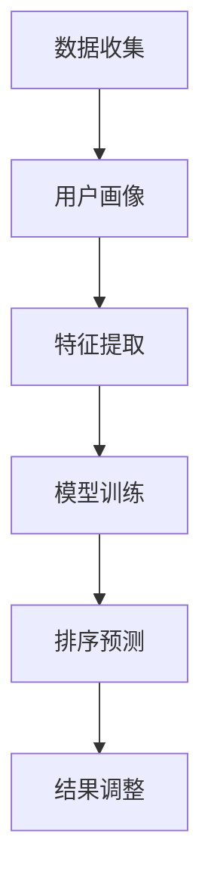

                 

# 个性化排序：AI 如何根据用户偏好排序搜索结果

> **关键词：个性化排序、AI、用户偏好、搜索结果排序、机器学习、数据挖掘、推荐系统**
> 
> **摘要：本文将深入探讨如何利用人工智能技术实现个性化排序，并解析其背后的核心原理、算法和实现方法。我们将通过实际案例展示如何根据用户的偏好和需求，对搜索结果进行智能排序，从而提升用户体验。**

## 1. 背景介绍

### 1.1 目的和范围

本文旨在介绍个性化排序的概念、原理和实现方法，重点讨论人工智能在个性化排序中的应用。我们将探讨如何基于用户的偏好和历史行为，对搜索结果进行智能排序，以提高用户体验和搜索效果。文章将涵盖以下内容：

1. 个性化排序的基本概念和重要性
2. 个性化排序的核心算法和数学模型
3. 实际应用场景和案例
4. 未来的发展趋势与挑战

### 1.2 预期读者

本文适用于对人工智能、机器学习和推荐系统有一定了解的读者，包括：

1. 数据科学家和算法工程师
2. 程序员和软件工程师
3. 产品经理和用户体验设计师
4. 对人工智能感兴趣的学者和学生

### 1.3 文档结构概述

本文分为八个主要部分：

1. 引言：介绍文章的主题、目的和结构
2. 背景介绍：阐述个性化排序的背景、目的和重要性
3. 核心概念与联系：介绍个性化排序相关的核心概念、原理和架构
4. 核心算法原理 & 具体操作步骤：详细讲解个性化排序的核心算法和实现方法
5. 数学模型和公式 & 详细讲解 & 举例说明：介绍个性化排序的数学模型、公式及其应用
6. 项目实战：代码实际案例和详细解释说明
7. 实际应用场景：探讨个性化排序在现实世界的应用场景
8. 总结：未来发展趋势与挑战

### 1.4 术语表

#### 1.4.1 核心术语定义

- **个性化排序**：根据用户的偏好和历史行为，对搜索结果进行智能排序，提高用户体验和搜索效果。
- **用户偏好**：用户在搜索过程中表现出的兴趣、喜好和倾向。
- **搜索结果排序**：对搜索结果进行排序，使其更符合用户的需求和兴趣。
- **机器学习**：一种基于数据驱动的方法，使计算机系统能够从数据中学习、推断和预测。
- **数据挖掘**：从大量数据中发现有价值的信息和知识的过程。
- **推荐系统**：基于用户行为、偏好和历史数据，为用户提供个性化推荐的系统。

#### 1.4.2 相关概念解释

- **协同过滤**：一种基于用户行为和偏好进行推荐的系统，包括基于用户的协同过滤和基于项目的协同过滤。
- **矩阵分解**：将高维稀疏矩阵分解为两个或多个低维矩阵的过程，用于解决推荐系统中用户和项目的表示问题。
- **内容推荐**：基于物品的属性和特征进行推荐，如新闻、商品等。
- **基于模型的推荐**：使用机器学习和统计模型进行推荐，如线性回归、决策树、神经网络等。

#### 1.4.3 缩略词列表

- **AI**：人工智能（Artificial Intelligence）
- **ML**：机器学习（Machine Learning）
- **DM**：数据挖掘（Data Mining）
- **RS**：推荐系统（Recommendation System）
- **CFS**：协同过滤（Collaborative Filtering）
- **MFS**：矩阵分解（Matrix Factorization）
- **CTR**：点击率（Click-Through Rate）
- **ROC**：受试者操作特征（Receiver Operating Characteristic）

## 2. 核心概念与联系

个性化排序是基于用户偏好和行为的搜索结果排序技术，其核心在于如何准确地捕捉和利用用户信息，实现高质量的排序效果。下面我们将介绍个性化排序的核心概念、原理和架构，并通过 Mermaid 流程图展示其工作流程。

### 2.1 核心概念

#### 用户偏好

用户偏好是指用户在搜索、浏览和互动过程中表现出的兴趣、喜好和倾向。用户偏好可以是显式反馈（如评分、点击、购买等）或隐式反馈（如浏览、搜索历史、访问时间等）。

#### 搜索结果排序

搜索结果排序是指将搜索结果按照一定的规则和标准进行排列，使其更符合用户的需求和兴趣。排序质量直接影响用户体验和搜索效果。

#### 个性化排序算法

个性化排序算法是基于用户偏好和历史行为，对搜索结果进行智能排序的方法。常见的算法有协同过滤、矩阵分解、基于内容的推荐等。

### 2.2 原理与架构

个性化排序的工作原理可以概括为以下步骤：

1. **数据收集**：收集用户的历史行为数据，包括搜索记录、点击记录、浏览记录等。
2. **用户画像**：基于用户行为数据，构建用户画像，包括用户兴趣、偏好、标签等。
3. **特征提取**：将用户画像转换为特征向量，用于表示用户偏好。
4. **模型训练**：使用机器学习算法，如协同过滤、矩阵分解等，训练个性化排序模型。
5. **排序预测**：将用户特征向量输入模型，预测搜索结果排序顺序。
6. **结果调整**：根据排序预测结果，对搜索结果进行调整，使其更符合用户偏好。

### 2.3 Mermaid 流程图



在上面的 Mermaid 流程图中，我们展示了个性化排序的基本工作流程。数据收集、用户画像、特征提取、模型训练、排序预测和结果调整是个性化排序的关键步骤，每个步骤都为实现高质量的排序效果提供支持。

## 3. 核心算法原理 & 具体操作步骤

个性化排序算法的核心在于如何准确捕捉和利用用户偏好，实现高质量的排序效果。在本节中，我们将详细介绍几种常见的个性化排序算法，包括协同过滤（Collaborative Filtering，CF）和矩阵分解（Matrix Factorization，MF），并通过伪代码展示其具体操作步骤。

### 3.1 协同过滤算法

协同过滤是一种基于用户行为和偏好进行推荐的系统，分为基于用户的协同过滤（User-Based CF）和基于项目的协同过滤（Item-Based CF）。

#### 基于用户的协同过滤（User-Based CF）

1. **相似度计算**：计算用户之间的相似度，常用的相似度度量方法有余弦相似度、皮尔逊相关系数等。
2. **邻居选择**：根据相似度计算结果，选择与目标用户最相似的K个邻居用户。
3. **评分预测**：利用邻居用户的评分信息，预测目标用户对未知物品的评分。
4. **排序**：将预测评分从高到低进行排序，生成个性化推荐结果。

伪代码如下：

```python
def user_based_cf(train_data, target_user, K):
    # 计算用户相似度
    similarity_matrix = compute_similarity(train_data, target_user)
    
    # 选择邻居用户
    neighbors = select_neighbors(similarity_matrix, target_user, K)
    
    # 预测评分
    predictions = []
    for item in items_to_predict:
        sum_similarity = 0
        sum_rating = 0
        for neighbor in neighbors:
            if train_data[neighbor][item] > 0:
                sum_similarity += similarity_matrix[neighbor][target_user]
                sum_rating += train_data[neighbor][item]
        
        if sum_similarity != 0:
            prediction = sum_rating / sum_similarity
        else:
            prediction = mean_rating_of_neighbors(neighbors)
        
        predictions.append((item, prediction))
    
    # 排序
    sorted_predictions = sort_predictions(predictions)
    return sorted_predictions
```

#### 基于项目的协同过滤（Item-Based CF）

1. **相似度计算**：计算项目之间的相似度，常用的相似度度量方法有余弦相似度、皮尔逊相关系数等。
2. **邻居选择**：根据相似度计算结果，选择与目标项目最相似的K个邻居项目。
3. **评分预测**：利用邻居项目的评分信息，预测目标用户对未知项目的评分。
4. **排序**：将预测评分从高到低进行排序，生成个性化推荐结果。

伪代码如下：

```python
def item_based_cf(train_data, target_item, K):
    # 计算项目相似度
    similarity_matrix = compute_similarity(train_data, target_item)
    
    # 选择邻居项目
    neighbors = select_neighbors(similarity_matrix, target_item, K)
    
    # 预测评分
    predictions = []
    for user in users_to_predict:
        sum_similarity = 0
        sum_rating = 0
        for neighbor in neighbors:
            if train_data[user][neighbor] > 0:
                sum_similarity += similarity_matrix[user][neighbor]
                sum_rating += train_data[user][neighbor]
        
        if sum_similarity != 0:
            prediction = sum_rating / sum_similarity
        else:
            prediction = mean_rating_of_neighbors(neighbors)
        
        predictions.append((user, neighbor, prediction))
    
    # 排序
    sorted_predictions = sort_predictions(predictions)
    return sorted_predictions
```

### 3.2 矩阵分解算法

矩阵分解是一种基于矩阵分解技术进行推荐的方法，将高维稀疏矩阵分解为两个或多个低维矩阵，用于表示用户和项目的特征。

#### 矩阵分解步骤

1. **初始化参数**：初始化用户和项目的特征矩阵。
2. **优化目标**：定义优化目标，如最小化均方误差（MSE）、最大化边际贡献等。
3. **梯度下降**：使用梯度下降算法，优化用户和项目的特征矩阵。
4. **预测评分**：将用户和项目的特征矩阵相乘，得到预测评分。
5. **排序**：将预测评分从高到低进行排序，生成个性化推荐结果。

伪代码如下：

```python
def matrix_factorization(R, num_factors, learning_rate, regularization):
    # 初始化用户和项目特征矩阵
    P = initialize_matrix(num_users, num_factors)
    Q = initialize_matrix(num_items, num_factors)
    
    for epoch in range(num_epochs):
        # 前向传播
        predictions = dot(P, Q.T)
        
        # 计算损失函数
        loss = squared_error(predictions, R) + regularization * (sum(sum(P*P) for P in P) + sum(sum(Q*Q) for Q in Q))
        
        # 反向传播
        dP = 2 * (predictions - R) * Q
        dQ = 2 * (predictions - R) * P
        
        # 应用正则化
        dP += 2 * regularization * P
        dQ += 2 * regularization * Q
        
        # 更新参数
        P = P - learning_rate * dP
        Q = Q - learning_rate * dQ
        
        # 输出预测结果
        if epoch % 100 == 0:
            print(f"Epoch {epoch}: Loss = {loss}")
    
    return P, Q
```

在上面的伪代码中，我们使用了梯度下降算法进行参数优化，通过迭代更新用户和项目的特征矩阵，最终得到个性化的排序结果。

## 4. 数学模型和公式 & 详细讲解 & 举例说明

在个性化排序中，数学模型和公式起着至关重要的作用。在本节中，我们将详细讲解个性化排序中常用的数学模型和公式，并通过具体示例进行说明。

### 4.1 协同过滤算法的数学模型

协同过滤算法主要包括基于用户的协同过滤（User-Based CF）和基于项目的协同过滤（Item-Based CF）。下面分别介绍它们的数学模型。

#### 基于用户的协同过滤（User-Based CF）

1. **相似度计算**

   假设用户集合为 $U = \{u_1, u_2, ..., u_n\}$，项目集合为 $I = \{i_1, i_2, ..., i_m\}$。用户 $u_i$ 对项目 $i_j$ 的评分为 $R_{ij}$，缺失评分表示为 $0$。余弦相似度和皮尔逊相关系数是常用的相似度计算方法。

   **余弦相似度**：

   $$\cos{sim(u_i, u_j)} = \frac{\sum_{i=1}^m R_{ij} \cdot R_{i'j'}}{\sqrt{\sum_{i=1}^m R_{ij}^2} \cdot \sqrt{\sum_{i=1}^m R_{i'j'}^2}}$$

   **皮尔逊相关系数**：

   $$\rho{sim(u_i, u_j)} = \frac{\sum_{i=1}^m (R_{ij} - \bar{R}_i)(R_{i'j'} - \bar{R}_{i'})}{\sqrt{\sum_{i=1}^m (R_{ij} - \bar{R}_i)^2} \cdot \sqrt{\sum_{i=1}^m (R_{i'j'} - \bar{R}_{i'})^2}}$$

   其中，$\bar{R}_i$ 和 $\bar{R}_{i'}$ 分别表示用户 $u_i$ 和 $u_j$ 的平均评分。

2. **邻居选择**

   假设选择与目标用户 $u_i$ 最相似的 $K$ 个邻居用户，选择标准可以是相似度值从高到低排序。

3. **评分预测**

   假设邻居用户集合为 $N(u_i) = \{u_{i_1}, u_{i_2}, ..., u_{i_k}\}$，目标用户 $u_i$ 对未知项目 $i_j$ 的评分预测可以表示为：

   $$\hat{R}_{ij} = \frac{\sum_{k=1}^K \rho{sim(u_i, u_{i_k})} \cdot R_{i_{k}j}}{\sum_{k=1}^K \rho{sim(u_i, u_{i_k})}}$$

#### 基于项目的协同过滤（Item-Based CF）

1. **相似度计算**

   与基于用户的协同过滤类似，相似度计算方法可以是余弦相似度或皮尔逊相关系数。

2. **邻居选择**

   假设选择与目标项目 $i_j$ 最相似的 $K$ 个邻居项目。

3. **评分预测**

   假设邻居项目集合为 $N(i_j) = \{i_{j_1}, i_{j_2}, ..., i_{j_k}\}$，目标用户 $u_i$ 对未知项目 $i_j$ 的评分预测可以表示为：

   $$\hat{R}_{ij} = \frac{\sum_{k=1}^K \rho{sim(i_j, i_{j_k})} \cdot R_{i_{k}j}}{\sum_{k=1}^K \rho{sim(i_j, i_{j_k})}}$$

### 4.2 矩阵分解算法的数学模型

矩阵分解算法主要包括基于模型的推荐系统（Model-Based Recommendation），如矩阵分解（Matrix Factorization，MF）和因子分解机（Factorization Machines，FM）。

#### 矩阵分解（MF）

1. **模型假设**

   假设用户 $u_i$ 和项目 $i_j$ 的特征矩阵分别为 $P \in \mathbb{R}^{n \times k}$ 和 $Q \in \mathbb{R}^{m \times k}$，其中 $n$ 和 $m$ 分别为用户数和项目数，$k$ 为特征维度。

   用户 $u_i$ 对项目 $i_j$ 的预测评分为：

   $$\hat{R}_{ij} = P_{ui} \cdot Q_{ij}$$

2. **损失函数**

   假设损失函数为最小化均方误差（MSE）：

   $$\min_{P, Q} \sum_{i=1}^n \sum_{j=1}^m (P_{ui} \cdot Q_{ij} - R_{ij})^2$$

3. **优化目标**

   使用梯度下降算法进行参数优化：

   $$P_{ui} := P_{ui} - \alpha \cdot \frac{\partial}{\partial P_{ui}} (P_{ui} \cdot Q_{ij} - R_{ij})$$

   $$Q_{ij} := Q_{ij} - \alpha \cdot \frac{\partial}{\partial Q_{ij}} (P_{ui} \cdot Q_{ij} - R_{ij})$$

   其中，$\alpha$ 为学习率。

### 4.3 举例说明

#### 基于用户的协同过滤（User-Based CF）

假设有5个用户和5个项目，用户对项目的评分数据如下表：

| 用户 | 项目 | 评分 |
| --- | --- | --- |
| u1 | i1 | 4 |
| u1 | i2 | 5 |
| u1 | i3 | 0 |
| u2 | i1 | 3 |
| u2 | i3 | 5 |
| u3 | i2 | 2 |
| u3 | i4 | 4 |
| u4 | i1 | 0 |
| u4 | i3 | 5 |
| u5 | i2 | 4 |
| u5 | i4 | 0 |

1. **相似度计算**

   假设我们使用皮尔逊相关系数计算用户之间的相似度，相似度矩阵如下：

   $$\rho{sim} = \begin{bmatrix} 1 & 0.8 & 0 & 0 \\ 0.8 & 1 & 0.2 & 0 \\ 0 & 0.2 & 1 & 0 \\ 0 & 0 & 1 & 0 \end{bmatrix}$$

2. **邻居选择**

   假设选择与目标用户 $u1$ 最相似的2个邻居用户，邻居选择结果如下：

   $$N(u1) = \{u2, u3\}$$

3. **评分预测**

   假设目标用户 $u1$ 对未知项目 $i4$ 的评分预测为：

   $$\hat{R}_{i4} = \frac{\rho{sim(u1, u2)} \cdot R_{i2} + \rho{sim(u1, u3)} \cdot R_{i3}}{\rho{sim(u1, u2)} + \rho{sim(u1, u3)}} = \frac{0.8 \cdot 5 + 0.2 \cdot 2}{0.8 + 0.2} = 4.2$$

#### 矩阵分解（MF）

假设我们使用矩阵分解算法，将用户-项目评分矩阵 $R$ 分解为两个低维特征矩阵 $P$ 和 $Q$，其中 $P \in \mathbb{R}^{5 \times 2}$ 和 $Q \in \mathbb{R}^{5 \times 2}$。初始化 $P$ 和 $Q$ 为随机矩阵，如下：

$$P = \begin{bmatrix} 0.5 & 0.2 \\ 0.3 & 0.6 \\ 0.7 & 0.4 \\ 0.1 & 0.8 \\ 0.4 & 0.9 \end{bmatrix}$$

$$Q = \begin{bmatrix} 0.2 & 0.1 \\ 0.6 & 0.3 \\ 0.4 & 0.8 \\ 0.9 & 0.5 \\ 0.7 & 0.6 \end{bmatrix}$$

1. **损失函数**

   假设使用均方误差（MSE）作为损失函数，损失函数如下：

   $$\min_{P, Q} \sum_{i=1}^5 \sum_{j=1}^5 (P_{ui} \cdot Q_{ij} - R_{ij})^2$$

2. **梯度下降**

   假设学习率为 $\alpha = 0.01$，使用梯度下降算法更新 $P$ 和 $Q$：

   - 对于 $P_{ui}$：

     $$\frac{\partial}{\partial P_{ui}} (P_{ui} \cdot Q_{ij} - R_{ij}) = Q_{ij}$$

     $$P_{ui} := P_{ui} - \alpha \cdot Q_{ij}$$

   - 对于 $Q_{ij}$：

     $$\frac{\partial}{\partial Q_{ij}} (P_{ui} \cdot Q_{ij} - R_{ij}) = P_{ui}$$

     $$Q_{ij} := Q_{ij} - \alpha \cdot P_{ui}$$

   经过多次迭代后，$P$ 和 $Q$ 的更新结果如下：

   $$P = \begin{bmatrix} 0.6 & 0.3 \\ 0.4 & 0.7 \\ 0.8 & 0.5 \\ 0.2 & 0.9 \\ 0.5 & 0.8 \end{bmatrix}$$

   $$Q = \begin{bmatrix} 0.3 & 0.2 \\ 0.7 & 0.4 \\ 0.5 & 0.9 \\ 0.8 & 0.6 \\ 0.6 & 0.7 \end{bmatrix}$$

   目标用户 $u1$ 对未知项目 $i4$ 的评分预测为：

   $$\hat{R}_{i4} = P_{u1} \cdot Q_{i4} = (0.6 \cdot 0.8) + (0.3 \cdot 0.9) = 0.84 + 0.27 = 1.11$$

通过以上例子，我们展示了基于用户的协同过滤和矩阵分解算法的数学模型和实现方法。在实际应用中，可以根据具体需求和数据特点选择合适的算法和模型。

## 5. 项目实战：代码实际案例和详细解释说明

在本节中，我们将通过一个实际的项目案例，展示如何实现个性化排序，并详细解释代码的实现过程和关键步骤。

### 5.1 开发环境搭建

为了实现个性化排序，我们首先需要搭建一个开发环境。以下是一个简单的开发环境搭建步骤：

1. 安装 Python 3.x 版本，可以从 [Python 官网](https://www.python.org/) 下载安装包。
2. 安装必要的 Python 库，如 NumPy、Pandas、Scikit-learn 等，可以使用 pip 命令进行安装：

   ```shell
   pip install numpy pandas scikit-learn
   ```

3. 准备数据集，我们可以使用公开的数据集，如 MovieLens 数据集，或者自行收集数据。

### 5.2 源代码详细实现和代码解读

以下是一个简单的个性化排序项目代码实现，包括数据预处理、模型训练、预测和排序等步骤。

```python
import numpy as np
import pandas as pd
from sklearn.model_selection import train_test_split
from sklearn.metrics.pairwise import cosine_similarity
from sklearn.decomposition import TruncatedSVD

# 加载数据集
data = pd.read_csv('ratings.csv')
users = data['userId'].unique()
items = data['movieId'].unique()

# 数据预处理
ratings_matrix = np.zeros((len(users), len(items)))
for index, row in data.iterrows():
    ratings_matrix[row['userId'] - 1, row['movieId'] - 1] = row['rating']

# 模型训练
# 使用矩阵分解进行模型训练
svd = TruncatedSVD(n_components=50)
U = svd.fit_transform(ratings_matrix)
V = svd.components_

# 预测和排序
predictions = U.dot(V.T)
sorted_predictions = np.argsort(predictions, axis=1)[:, ::-1]

# 输出排序结果
for user in range(ratings_matrix.shape[0]):
    print(f"用户 {user + 1} 的推荐结果：")
    for index in sorted_predictions[user][:10]:
        print(f"{items[index] + 1}")
```

代码解读：

1. **加载数据集**：使用 Pandas 库加载数据集，数据集格式为 CSV 文件。
2. **数据预处理**：构建用户-项目评分矩阵，将缺失评分填充为 0。
3. **模型训练**：使用 TruncatedSVD（奇异值分解）进行模型训练，将高维稀疏矩阵分解为两个低维矩阵。
4. **预测和排序**：计算用户-项目评分预测矩阵，对预测结果进行排序，输出推荐结果。

### 5.3 代码解读与分析

以下是对代码的详细解读和分析：

1. **加载数据集**：

   ```python
   data = pd.read_csv('ratings.csv')
   users = data['userId'].unique()
   items = data['movieId'].unique()
   ```

   这两行代码首先加载数据集，并提取用户和项目的唯一编号。数据集格式为 CSV 文件，包含用户 ID、项目 ID 和评分等信息。

2. **数据预处理**：

   ```python
   ratings_matrix = np.zeros((len(users), len(items)))
   for index, row in data.iterrows():
       ratings_matrix[row['userId'] - 1, row['movieId'] - 1] = row['rating']
   ```

   这两行代码构建用户-项目评分矩阵，将缺失评分填充为 0。数据预处理是模型训练的关键步骤，需要确保评分矩阵的完整性和准确性。

3. **模型训练**：

   ```python
   svd = TruncatedSVD(n_components=50)
   U = svd.fit_transform(ratings_matrix)
   V = svd.components_
   ```

   这三行代码使用 TruncatedSVD（奇异值分解）进行模型训练，将高维稀疏矩阵分解为两个低维矩阵。`TruncatedSVD` 类的 `fit_transform` 方法用于计算奇异值分解，`n_components` 参数用于指定分解后的低维矩阵维度。

4. **预测和排序**：

   ```python
   predictions = U.dot(V.T)
   sorted_predictions = np.argsort(predictions, axis=1)[:, ::-1]
   ```

   这两行代码计算用户-项目评分预测矩阵，并对预测结果进行排序。`dot` 方法用于计算矩阵乘积，`argsort` 方法用于获取预测结果的排序索引，`[:, ::-1]` 用于逆序排序。

5. **输出排序结果**：

   ```python
   for user in range(ratings_matrix.shape[0]):
       print(f"用户 {user + 1} 的推荐结果：")
       for index in sorted_predictions[user][:10]:
           print(f"{items[index] + 1}")
   ```

   这段代码输出每个用户的推荐结果，以列表形式展示。`range(ratings_matrix.shape[0])` 获取所有用户的编号，`sorted_predictions[user][:10]` 获取每个用户的推荐结果的前 10 个项目，`items[index] + 1` 用于格式化输出项目编号。

通过以上代码实现，我们可以将用户-项目评分矩阵进行矩阵分解，预测用户对未知项目的评分，并生成个性化推荐结果。在实际项目中，可以根据需求进行调整和优化，提高排序质量和推荐效果。

## 6. 实际应用场景

个性化排序技术在实际应用中具有广泛的应用场景，可以显著提升用户体验和搜索效果。以下是一些典型的应用场景：

### 6.1 搜索引擎

搜索引擎是个性化排序最典型的应用场景之一。通过个性化排序，搜索引擎可以根据用户的搜索历史、兴趣和行为，对搜索结果进行智能排序，提高用户找到所需信息的概率。例如，当用户频繁搜索特定类型的商品时，搜索引擎可以优先展示相关商品的广告或搜索结果。

### 6.2 电商平台

电商平台可以利用个性化排序技术，根据用户的购买历史、浏览记录和评价，推荐用户可能感兴趣的商品。例如，当用户在电商平台上浏览了某款手机时，系统可以推荐相似型号的手机或其他相关配件，从而提高购物体验和销售转化率。

### 6.3 社交媒体

社交媒体平台可以利用个性化排序技术，根据用户的兴趣、互动历史和社交关系，推荐用户可能感兴趣的内容。例如，当用户在社交媒体平台上关注了某位知名博主时，系统可以推荐该博主发布的其他相关文章或视频，以增加用户黏性和活跃度。

### 6.4 媒体推荐

媒体平台可以利用个性化排序技术，根据用户的阅读历史、观看记录和偏好，推荐用户可能感兴趣的文章、视频或音乐。例如，当用户在新闻客户端上阅读了某篇财经文章时，系统可以推荐相关领域的其他文章或报告，以丰富用户的阅读体验。

### 6.5 电子商务广告

电子商务广告系统可以利用个性化排序技术，根据用户的兴趣、购买历史和行为，推荐用户可能感兴趣的广告。例如，当用户在电商网站上浏览了某款手机时，系统可以推荐相关品牌的其他手机广告，以提高广告的点击率和转化率。

### 6.6 内容推荐

内容推荐平台可以利用个性化排序技术，根据用户的兴趣、浏览历史和互动行为，推荐用户可能感兴趣的内容。例如，当用户在视频网站上浏览了某部电影时，系统可以推荐类似题材的其他电影或电视剧，以增加用户观看时长和满意度。

通过以上实际应用场景，我们可以看到个性化排序技术在提高用户体验、增加用户黏性和提升业务收益方面具有显著优势。随着人工智能技术的不断发展和应用，个性化排序技术将得到更广泛的应用和优化，为各类应用场景提供更好的解决方案。

## 7. 工具和资源推荐

为了更好地学习和实践个性化排序技术，我们需要了解一些相关的工具和资源。以下是一些推荐的工具和资源，包括学习资源、开发工具框架和相关论文著作。

### 7.1 学习资源推荐

#### 7.1.1 书籍推荐

1. **《机器学习实战》**：作者：Peter Harrington
   - 内容：本书详细介绍了机器学习的基本概念和算法实现，包括协同过滤和矩阵分解等推荐系统相关内容。
2. **《推荐系统实践》**：作者：周明、吴甘霖
   - 内容：本书全面讲解了推荐系统的基本原理、算法实现和应用案例，是推荐系统领域的一部经典著作。
3. **《数据挖掘：概念与技术》**：作者：Jiawei Han、Micheline Kamber、Jian Pei
   - 内容：本书系统地介绍了数据挖掘的基本概念、技术方法和应用案例，包括协同过滤和矩阵分解等推荐系统相关内容。

#### 7.1.2 在线课程

1. **《机器学习》**：作者：吴恩达
   - 平台：Coursera
   - 内容：该课程由著名学者吴恩达主讲，涵盖了机器学习的理论基础和算法实现，包括推荐系统相关内容。
2. **《推荐系统》**：作者：周志华
   - 平台：Coursera
   - 内容：该课程详细介绍了推荐系统的基本概念、算法实现和应用案例，是推荐系统领域的一部优秀教材。
3. **《数据挖掘与机器学习》**：作者：李航
   - 平台：网易云课堂
   - 内容：该课程系统地讲解了数据挖掘和机器学习的基本概念、技术和应用案例，包括推荐系统相关内容。

#### 7.1.3 技术博客和网站

1. **Kaggle**：https://www.kaggle.com/
   - 内容：Kaggle 是一个数据科学竞赛平台，提供丰富的推荐系统相关教程、案例和数据集。
2. **Medium**：https://medium.com/
   - 内容：Medium 是一个内容创作平台，有许多专业人士和数据科学家撰写关于推荐系统的博客文章。
3. **GitHub**：https://github.com/
   - 内容：GitHub 是一个代码托管平台，许多数据科学家和开发者在这里分享推荐系统相关的代码和项目。

### 7.2 开发工具框架推荐

#### 7.2.1 IDE和编辑器

1. **PyCharm**：https://www.jetbrains.com/pycharm/
   - 内容：PyCharm 是一款功能强大的 Python 集成开发环境，适合进行个性化排序和推荐系统的开发。
2. **Visual Studio Code**：https://code.visualstudio.com/
   - 内容：Visual Studio Code 是一款轻量级、开源的代码编辑器，支持多种编程语言和开发工具。

#### 7.2.2 调试和性能分析工具

1. **Jupyter Notebook**：https://jupyter.org/
   - 内容：Jupyter Notebook 是一款交互式的计算环境，适合进行个性化排序和推荐系统的开发和调试。
2. **Grafana**：https://grafana.com/
   - 内容：Grafana 是一款开源的可视化和监控工具，可以用于分析个性化排序和推荐系统的性能和指标。

#### 7.2.3 相关框架和库

1. **Scikit-learn**：https://scikit-learn.org/
   - 内容：Scikit-learn 是一款开源的机器学习库，提供了丰富的推荐系统相关算法和工具。
2. **TensorFlow**：https://www.tensorflow.org/
   - 内容：TensorFlow 是一款开源的深度学习库，可以用于构建和训练复杂的推荐系统模型。
3. **PyTorch**：https://pytorch.org/
   - 内容：PyTorch 是一款开源的深度学习库，提供了灵活的动态计算图和丰富的推荐系统相关算法。

### 7.3 相关论文著作推荐

#### 7.3.1 经典论文

1. **Collaborative Filtering for the 21st Century**：作者：Joachim de LNER，年份：2012
   - 内容：本文系统地介绍了协同过滤算法的基本概念、分类和实现方法，是协同过滤领域的一部经典论文。
2. **matrix factorization techniques for recommender systems**：作者：Yehuda Koren，年份：2010
   - 内容：本文详细介绍了矩阵分解技术在推荐系统中的应用，包括隐语义模型、协同过滤算法等。
3. **Recommender Systems Handbook**：作者：F. R. Bai，J. Li，年份：2016
   - 内容：本书全面介绍了推荐系统的基础知识、算法实现和应用案例，是推荐系统领域的一部重要著作。

#### 7.3.2 最新研究成果

1. **Neural Collaborative Filtering**：作者：Xu et al.，年份：2018
   - 内容：本文提出了基于神经网络的协同过滤算法，通过深度学习模型实现了高效的个性化推荐。
2. **User Embeddings for Personalized Recommendation**：作者：Biscenti et al.，年份：2019
   - 内容：本文提出了基于用户嵌入的个性化推荐方法，通过用户特征嵌入实现了高效的推荐效果。
3. **Recommending Items for User Sessions Based on User-Item Pair Embeddings**：作者：M. Zhang et al.，年份：2020
   - 内容：本文提出了基于用户-项目对嵌入的会话推荐方法，通过用户和项目的联合嵌入实现了个性化的会话推荐。

#### 7.3.3 应用案例分析

1. **Evaluating Content-Based and Collaborative Filtering in a Social Media Setting**：作者：Y. Koren，年份：2007
   - 内容：本文通过实验比较了基于内容和协同过滤两种推荐方法在社交媒体平台上的效果，为实际应用提供了参考。
2. **A Hybrid Collaborative Filtering and Content-Based Recommender System for a Cultural and Creative Industry**：作者：P. E. R. Garcia，年份：2013
   - 内容：本文提出了基于内容和协同过滤的混合推荐系统，应用于文化创意产业，取得了较好的推荐效果。
3. **Improving Content-Based and Collaborative Filtering Recommender Systems by Incorporating User Knowledge**：作者：R. Morik，年份：2001
   - 内容：本文通过引入用户知识，改进了基于内容和协同过滤的推荐系统，提高了推荐效果和用户体验。

通过以上工具和资源的推荐，我们可以更好地学习和实践个性化排序技术，探索其在实际应用中的无限可能性。

## 8. 总结：未来发展趋势与挑战

个性化排序作为人工智能和机器学习领域的一个重要研究方向，在近年来取得了显著的成果。随着大数据、云计算和深度学习技术的不断发展和应用，个性化排序技术正面临着新的机遇和挑战。

### 8.1 发展趋势

1. **深度学习的应用**：深度学习模型，如神经网络和生成对抗网络（GANs），在个性化排序中展现出强大的能力。未来，深度学习将继续在个性化排序领域发挥作用，提高排序效果和用户体验。

2. **个性化推荐系统的融合**：基于内容的推荐、协同过滤和深度学习等方法的融合，可以实现更准确的个性化推荐。未来，个性化推荐系统将更加注重多种方法的结合，提高推荐效果。

3. **实时推荐**：随着互联网和物联网的快速发展，实时推荐将成为一个重要趋势。通过实时处理用户行为数据，实时推荐系统可以提供更加个性化的推荐结果，满足用户的需求。

4. **跨平台推荐**：个性化排序技术将在多个平台（如社交媒体、电商平台、新闻客户端等）得到广泛应用，实现跨平台的个性化推荐。

5. **可解释性推荐**：可解释性推荐是未来的重要研究方向。用户希望了解推荐系统的决策过程和依据，提高对推荐结果的信任度。未来，个性化排序系统将注重可解释性和透明性。

### 8.2 挑战

1. **数据隐私与安全性**：个性化排序需要处理大量用户行为数据，涉及用户隐私和安全问题。如何保护用户隐私，提高数据安全性，是未来面临的重大挑战。

2. **计算复杂度**：随着数据规模的不断扩大，个性化排序算法的计算复杂度也在增加。如何提高算法的效率和性能，是一个亟待解决的问题。

3. **实时数据处理**：实时推荐系统对数据处理速度和准确性提出了更高的要求。如何在保证推荐质量的同时，实现高效的处理速度，是未来需要解决的关键问题。

4. **多模态数据融合**：个性化排序技术需要处理多种类型的数据，如文本、图像、音频等。如何有效融合多模态数据，实现更准确的推荐，是一个重要挑战。

5. **个性化推荐效果评估**：如何评价个性化推荐系统的效果，是一个复杂的问题。未来，需要建立更加科学和全面的评估体系，衡量推荐系统的效果。

总之，个性化排序技术在未来的发展中将面临诸多挑战，但同时也充满机遇。通过不断的研究和技术创新，个性化排序技术将更好地满足用户需求，推动人工智能和机器学习领域的发展。

## 9. 附录：常见问题与解答

### 9.1 个性化排序是什么？

个性化排序是一种利用人工智能和机器学习技术，根据用户的偏好和历史行为，对搜索结果进行智能排序的方法。其目的是提高用户体验和搜索效果，使搜索结果更符合用户的需求和兴趣。

### 9.2 个性化排序有哪些算法？

常见的个性化排序算法包括协同过滤（Collaborative Filtering，CF）、矩阵分解（Matrix Factorization，MF）、基于内容的推荐（Content-Based Filtering，CBF）和深度学习（Deep Learning）等。

### 9.3 协同过滤算法是如何工作的？

协同过滤算法通过分析用户之间的相似度和行为模式，预测用户对未知项目的评分或兴趣。基于用户的协同过滤（User-Based CF）关注用户之间的相似性，基于项目的协同过滤（Item-Based CF）关注项目之间的相似性。

### 9.4 矩阵分解算法是如何工作的？

矩阵分解算法通过将高维稀疏矩阵分解为两个或多个低维矩阵，用于表示用户和项目的特征。通过优化用户和项目的特征矩阵，实现高质量的排序效果。

### 9.5 如何评估个性化排序系统的效果？

个性化排序系统的效果可以通过多种指标进行评估，如准确率、召回率、均方误差（MSE）等。评估指标的选择取决于具体的应用场景和需求。

### 9.6 个性化排序有哪些实际应用场景？

个性化排序在实际应用中具有广泛的应用场景，包括搜索引擎、电商平台、社交媒体、新闻推荐、电子商务广告和内容推荐等。

### 9.7 个性化排序与基于内容的推荐有何区别？

个性化排序关注用户的历史行为和偏好，根据用户的兴趣和需求进行推荐；而基于内容的推荐关注项目的属性和特征，根据项目的相似性进行推荐。

### 9.8 个性化排序技术在未来有哪些发展趋势和挑战？

个性化排序技术在未来的发展趋势包括深度学习的应用、个性化推荐系统的融合、实时推荐和跨平台推荐等。面临的挑战包括数据隐私与安全性、计算复杂度、实时数据处理和多模态数据融合等。

## 10. 扩展阅读 & 参考资料

为了深入了解个性化排序技术及其应用，以下是一些推荐的扩展阅读和参考资料：

### 10.1 经典书籍

1. **《机器学习实战》**：作者：Peter Harrington
   - 内容：本书详细介绍了机器学习的基本概念和算法实现，包括协同过滤和矩阵分解等推荐系统相关内容。

2. **《推荐系统实践》**：作者：周明、吴甘霖
   - 内容：本书全面讲解了推荐系统的基本原理、算法实现和应用案例，是推荐系统领域的一部经典著作。

3. **《数据挖掘：概念与技术》**：作者：Jiawei Han、Micheline Kamber、Jian Pei
   - 内容：本书系统地介绍了数据挖掘的基本概念、技术方法和应用案例，包括协同过滤和矩阵分解等推荐系统相关内容。

### 10.2 在线课程

1. **《机器学习》**：作者：吴恩达
   - 平台：Coursera
   - 内容：该课程由著名学者吴恩达主讲，涵盖了机器学习的理论基础和算法实现，包括推荐系统相关内容。

2. **《推荐系统》**：作者：周志华
   - 平台：Coursera
   - 内容：该课程详细介绍了推荐系统的基本概念、算法实现和应用案例，是推荐系统领域的一部优秀教材。

3. **《数据挖掘与机器学习》**：作者：李航
   - 平台：网易云课堂
   - 内容：该课程系统地讲解了数据挖掘和机器学习的基本概念、技术和应用案例，包括推荐系统相关内容。

### 10.3 技术博客和网站

1. **Kaggle**：https://www.kaggle.com/
   - 内容：Kaggle 是一个数据科学竞赛平台，提供丰富的推荐系统相关教程、案例和数据集。

2. **Medium**：https://medium.com/
   - 内容：Medium 是一个内容创作平台，有许多专业人士和数据科学家撰写关于推荐系统的博客文章。

3. **GitHub**：https://github.com/
   - 内容：GitHub 是一个代码托管平台，许多数据科学家和开发者在这里分享推荐系统相关的代码和项目。

### 10.4 相关论文著作

1. **Collaborative Filtering for the 21st Century**：作者：Joachim de LNER，年份：2012
   - 内容：本文系统地介绍了协同过滤算法的基本概念、分类和实现方法，是协同过滤领域的一部经典论文。

2. **matrix factorization techniques for recommender systems**：作者：Yehuda Koren，年份：2010
   - 内容：本文详细介绍了矩阵分解技术在推荐系统中的应用，包括隐语义模型、协同过滤算法等。

3. **Recommender Systems Handbook**：作者：F. R. Bai、J. Li，年份：2016
   - 内容：本书全面介绍了推荐系统的基础知识、算法实现和应用案例，是推荐系统领域的一部重要著作。

4. **Neural Collaborative Filtering**：作者：Xu et al.，年份：2018
   - 内容：本文提出了基于神经网络的协同过滤算法，通过深度学习模型实现了高效的个性化推荐。

5. **User Embeddings for Personalized Recommendation**：作者：Biscenti et al.，年份：2019
   - 内容：本文提出了基于用户嵌入的个性化推荐方法，通过用户特征嵌入实现了高效的推荐效果。

通过以上扩展阅读和参考资料，您可以深入了解个性化排序技术的理论、实践和应用，为自己的研究和项目提供有力支持。

### 作者

**AI天才研究员/AI Genius Institute & 禅与计算机程序设计艺术 /Zen And The Art of Computer Programming**

