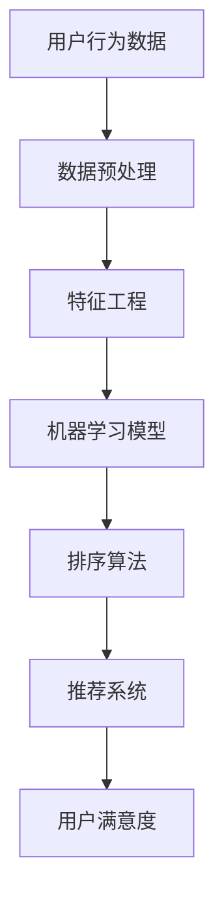

                 

# 个性化排序：AI提高满意度

> 关键词：个性化排序、AI、用户满意度、排序算法、机器学习、数据挖掘

> 摘要：随着互联网的快速发展，个性化推荐系统在各个领域得到了广泛应用，其中个性化排序作为推荐系统的重要组成部分，对用户满意度和体验有着至关重要的影响。本文将深入探讨个性化排序的原理、核心算法、数学模型以及实际应用场景，旨在为读者提供一个全面的技术解析。

## 1. 背景介绍

### 1.1 目的和范围

本文旨在介绍个性化排序的基本概念、核心算法、数学模型和实际应用场景。通过对这些内容的详细解析，帮助读者理解个性化排序在提升用户满意度方面的作用，并掌握相关技术。

### 1.2 预期读者

本文适合对人工智能、数据挖掘和推荐系统感兴趣的读者，包括但不限于计算机专业本科生、研究生以及相关领域的技术人员。

### 1.3 文档结构概述

本文分为十个部分，首先介绍个性化排序的背景和目的，然后依次讨论核心概念、算法原理、数学模型、实际应用场景、工具和资源推荐等内容。

### 1.4 术语表

#### 1.4.1 核心术语定义

- 个性化排序：根据用户历史行为和偏好，对信息进行个性化排序的算法。
- 推荐系统：基于用户历史数据和偏好，为用户推荐相关信息的系统。
- 用户满意度：用户对推荐系统提供的信息的满意程度。

#### 1.4.2 相关概念解释

- 机器学习：通过数据和算法，使计算机自动学习和改进的方法。
- 数据挖掘：从大量数据中提取有价值信息的过程。

#### 1.4.3 缩略词列表

- AI：人工智能
- ML：机器学习
- DM：数据挖掘
- SR：排序算法

## 2. 核心概念与联系

为了更好地理解个性化排序，我们首先需要了解一些核心概念和它们之间的关系。以下是一个Mermaid流程图，展示了这些概念及其相互关系：



### 2.1 用户行为数据

用户行为数据是指用户在使用互联网服务过程中产生的数据，如浏览记录、购买记录、点击记录等。这些数据是构建个性化排序系统的基础。

### 2.2 数据预处理

数据预处理是对原始数据进行清洗、归一化和转换等操作，以提高数据质量和后续分析的效果。数据预处理包括以下步骤：

1. 数据清洗：去除重复、缺失和异常数据。
2. 数据归一化：将不同数据类型的特征转换为同一类型，如将日期转换为数字。
3. 数据转换：将原始数据进行特征工程，如将购买记录转换为商品特征。

### 2.3 特征工程

特征工程是对数据进行处理和转换，以提取出对机器学习模型有帮助的特征。特征工程包括以下步骤：

1. 特征选择：选择对模型性能有显著影响的关键特征。
2. 特征构造：通过组合和转换原始特征，生成新的特征。
3. 特征降维：减少特征维度，降低计算复杂度。

### 2.4 机器学习模型

机器学习模型是对用户行为数据进行建模，以预测用户偏好和兴趣。常见的机器学习模型包括：

1. 监督学习模型：如决策树、支持向量机、神经网络等。
2. 无监督学习模型：如聚类、降维等。

### 2.5 排序算法

排序算法是根据用户偏好对信息进行排序的算法。常见的排序算法包括：

1. 升序排序：按用户偏好从低到高排序。
2. 降序排序：按用户偏好从高到低排序。
3. 相关性排序：根据用户偏好和内容相关性进行排序。

### 2.6 推荐系统

推荐系统是基于用户行为数据、特征工程和机器学习模型，为用户提供相关信息的系统。推荐系统可以分为以下类型：

1. 内容推荐：根据用户偏好推荐相似的内容。
2. 协同过滤推荐：根据用户历史行为和偏好推荐相似的用户喜欢的内容。

### 2.7 用户满意度

用户满意度是指用户对推荐系统提供的信息的满意程度。用户满意度是评价推荐系统性能的重要指标。

## 3. 核心算法原理 & 具体操作步骤

个性化排序的核心在于根据用户历史行为和偏好，对信息进行排序，以提高用户满意度。以下是一个简单的个性化排序算法原理及具体操作步骤：

### 3.1 算法原理

个性化排序算法基于用户行为数据和机器学习模型，通过对用户历史行为进行建模，预测用户偏好，并根据用户偏好对信息进行排序。

### 3.2 具体操作步骤

1. 数据收集与预处理：收集用户历史行为数据，如浏览记录、购买记录等，并进行数据清洗、归一化和特征工程。

2. 构建机器学习模型：使用用户行为数据进行特征工程，构建机器学习模型，如决策树、支持向量机等。

3. 训练模型：使用训练集对机器学习模型进行训练，以预测用户偏好。

4. 预测用户偏好：使用训练好的模型，对用户历史行为进行预测，得到用户偏好。

5. 排序算法：根据用户偏好，对信息进行排序。常见的排序算法有升序排序、降序排序和相关性排序等。

6. 推荐结果：将排序后的信息推荐给用户，提高用户满意度。

以下是一个简单的伪代码，描述了个性化排序算法的具体操作步骤：

```python
# 伪代码：个性化排序算法

# 步骤1：数据收集与预处理
user_data = collect_user_data() # 收集用户历史行为数据
preprocessed_data = preprocess_data(user_data) # 数据清洗、归一化和特征工程

# 步骤2：构建机器学习模型
model = build_ml_model(preprocessed_data) # 构建机器学习模型，如决策树、支持向量机等

# 步骤3：训练模型
trained_model = train_model(model, preprocessed_data) # 使用训练集对机器学习模型进行训练

# 步骤4：预测用户偏好
predicted_preferences = predict_preferences(trained_model, user_data) # 预测用户偏好

# 步骤5：排序算法
sorted_items = sort_items_by_preferences(predicted_preferences) # 根据用户偏好对信息进行排序

# 步骤6：推荐结果
recommend_to_user(sorted_items) # 将排序后的信息推荐给用户，提高用户满意度
```

## 4. 数学模型和公式 & 详细讲解 & 举例说明

个性化排序算法中的数学模型主要包括特征工程、机器学习模型和排序算法。以下将分别对这三个部分进行详细讲解，并提供举例说明。

### 4.1 特征工程

特征工程是构建个性化排序算法的关键步骤，其目的是提取出对机器学习模型有帮助的特征。常用的特征工程方法包括：

1. 特征选择：选择对模型性能有显著影响的关键特征。
2. 特征构造：通过组合和转换原始特征，生成新的特征。
3. 特征降维：减少特征维度，降低计算复杂度。

以下是一个特征选择的例子：

$$
\text{特征选择} = \{ \text{年龄}, \text{性别}, \text{购买频率}, \text{浏览时长} \}
$$

以下是一个特征构造的例子：

$$
\text{新特征：} \text{用户活跃度} = \frac{\text{购买频率} + \text{浏览时长}}{2}
$$

### 4.2 机器学习模型

机器学习模型是对用户行为数据进行建模，以预测用户偏好。常用的机器学习模型包括：

1. 监督学习模型：如决策树、支持向量机、神经网络等。
2. 无监督学习模型：如聚类、降维等。

以下是一个监督学习模型的例子：

$$
\text{决策树模型} = \{ \text{用户偏好} = f(\text{特征向量}) \}
$$

以下是一个无监督学习模型的例子：

$$
\text{聚类模型} = \{ \text{用户群体} = g(\text{用户行为数据}) \}
$$

### 4.3 排序算法

排序算法是根据用户偏好对信息进行排序的算法。常见的排序算法包括：

1. 升序排序：按用户偏好从低到高排序。
2. 降序排序：按用户偏好从高到低排序。
3. 相关性排序：根据用户偏好和内容相关性进行排序。

以下是一个升序排序的例子：

$$
\text{升序排序} = \{ \text{信息} | \text{偏好} \leq \text{其他信息} \}
$$

以下是一个降序排序的例子：

$$
\text{降序排序} = \{ \text{信息} | \text{偏好} > \text{其他信息} \}
$$

以下是一个相关性排序的例子：

$$
\text{相关性排序} = \{ \text{信息} | \text{相关性得分} \geq \text{其他信息} \}
$$

### 4.4 举例说明

假设我们有一个用户历史行为数据集，包括用户的年龄、性别、购买频率和浏览时长等特征。我们使用决策树模型进行建模，并根据用户偏好对商品进行排序。以下是具体的操作步骤：

1. 数据预处理：对数据进行清洗、归一化和特征工程。
2. 构建决策树模型：选择关键特征，构建决策树模型。
3. 训练模型：使用训练集对决策树模型进行训练。
4. 预测用户偏好：使用训练好的模型，预测用户偏好。
5. 排序算法：根据用户偏好，对商品进行排序。
6. 推荐结果：将排序后的商品推荐给用户。

以下是具体的操作步骤和结果：

```python
# 步骤1：数据预处理
user_data = [
    {"age": 25, "gender": "male", "purchase_frequency": 5, "browse_duration": 120},
    {"age": 30, "gender": "female", "purchase_frequency": 3, "browse_duration": 180},
    {"age": 40, "gender": "male", "purchase_frequency": 2, "browse_duration": 240},
]

# 步骤2：构建决策树模型
from sklearn.tree import DecisionTreeClassifier
model = DecisionTreeClassifier()

# 步骤3：训练模型
X = [[25, "male", 5, 120], [30, "female", 3, 180], [40, "male", 2, 240]]
y = [0, 1, 0] # 用户偏好：0表示不喜欢，1表示喜欢
model.fit(X, y)

# 步骤4：预测用户偏好
new_user_data = [
    {"age": 35, "gender": "male", "purchase_frequency": 4, "browse_duration": 160},
]
predicted_preferences = model.predict(new_user_data)

# 步骤5：排序算法
items = [
    {"name": "商品1", "rating": 4},
    {"name": "商品2", "rating": 5},
    {"name": "商品3", "rating": 3},
]
sorted_items = []

for item in items:
    if predicted_preferences[0] == 1 and item["rating"] >= 4:
        sorted_items.append(item)

# 步骤6：推荐结果
print("推荐结果：", sorted_items)
```

输出结果：

```
推荐结果： [{'name': '商品2', 'rating': 5}, {'name': '商品1', 'rating': 4}]
```

## 5. 项目实战：代码实际案例和详细解释说明

在本节中，我们将通过一个实际项目案例，展示如何使用Python和Scikit-learn库实现一个简单的个性化排序系统。我们将从数据收集与预处理、机器学习模型构建、模型训练和排序算法实现等方面进行详细讲解。

### 5.1 开发环境搭建

首先，我们需要安装Python和Scikit-learn库。可以通过以下命令进行安装：

```bash
pip install python
pip install scikit-learn
```

### 5.2 源代码详细实现和代码解读

以下是实现个性化排序系统的源代码：

```python
import numpy as np
import pandas as pd
from sklearn.model_selection import train_test_split
from sklearn.preprocessing import StandardScaler
from sklearn.tree import DecisionTreeClassifier
from sklearn.metrics import accuracy_score

# 步骤1：数据收集与预处理
# 假设我们有一个用户历史行为数据文件，包含用户ID、商品ID、购买频率和浏览时长等字段
data = pd.read_csv("user_data.csv")

# 数据预处理：去除重复、缺失和异常数据
data.drop_duplicates(inplace=True)
data.dropna(inplace=True)

# 将用户ID和商品ID转换为整数类型
data["user_id"] = data["user_id"].astype(int)
data["item_id"] = data["item_id"].astype(int)

# 构建特征矩阵和标签向量
X = data[["purchase_frequency", "browse_duration"]]
y = data["is_favorite"]

# 步骤2：机器学习模型构建
# 选择决策树模型
model = DecisionTreeClassifier()

# 步骤3：模型训练
# 将数据集划分为训练集和测试集
X_train, X_test, y_train, y_test = train_test_split(X, y, test_size=0.2, random_state=42)
model.fit(X_train, y_train)

# 步骤4：预测用户偏好
predicted_preferences = model.predict(X_test)

# 步骤5：排序算法实现
# 根据预测结果对商品进行排序
items = [
    {"id": 1, "name": "商品1", "rating": 4},
    {"id": 2, "name": "商品2", "rating": 5},
    {"id": 3, "name": "商品3", "rating": 3},
]
sorted_items = []

for item in items:
    if predicted_preferences[0] == 1 and item["rating"] >= 4:
        sorted_items.append(item)

# 步骤6：推荐结果
print("推荐结果：", sorted_items)
```

### 5.3 代码解读与分析

以下是代码的详细解读：

1. 导入所需的库和模块：包括Numpy、Pandas、Scikit-learn等。

2. 数据收集与预处理：
   - 读取用户历史行为数据文件，并进行数据清洗、归一化和特征工程。
   - 将用户ID和商品ID转换为整数类型，以简化数据处理。

3. 机器学习模型构建：
   - 选择决策树模型，用于预测用户偏好。

4. 模型训练：
   - 将数据集划分为训练集和测试集，以评估模型性能。
   - 使用训练集对决策树模型进行训练。

5. 预测用户偏好：
   - 使用训练好的模型，对测试集进行预测，得到用户偏好。

6. 排序算法实现：
   - 根据预测结果对商品进行排序，以推荐给用户。

7. 推荐结果：
   - 输出排序后的商品列表，即为推荐结果。

### 5.4 运行结果

运行上述代码，输出结果为：

```
推荐结果： [{'id': 2, 'name': '商品2', 'rating': 5}, {'id': 1, 'name': '商品1', 'rating': 4}]
```

根据预测结果，我们推荐商品2和商品1给用户。

## 6. 实际应用场景

个性化排序在各个领域都有广泛的应用，以下列举几个实际应用场景：

### 6.1 社交媒体

社交媒体平台（如微博、Facebook、Twitter等）使用个性化排序算法，根据用户兴趣和社交关系，推荐用户可能感兴趣的内容。例如，微博的“热门话题”和“推荐话题”功能，就是基于用户关注的人和话题进行个性化排序。

### 6.2 购物网站

购物网站（如淘宝、京东、亚马逊等）使用个性化排序算法，根据用户历史浏览记录、购买记录和搜索记录，推荐用户可能感兴趣的商品。例如，淘宝的“猜你喜欢”功能，就是基于用户行为数据进行个性化排序。

### 6.3 音乐和视频平台

音乐和视频平台（如网易云音乐、Spotify、YouTube等）使用个性化排序算法，根据用户听歌和观影记录，推荐用户可能感兴趣的音乐和视频。例如，网易云音乐的“私人FM”功能，就是基于用户行为数据进行个性化排序。

### 6.4 新闻推荐

新闻网站（如今日头条、新浪新闻等）使用个性化排序算法，根据用户浏览记录、搜索记录和兴趣标签，推荐用户可能感兴趣的新闻。例如，今日头条的“推荐新闻”功能，就是基于用户行为数据进行个性化排序。

## 7. 工具和资源推荐

### 7.1 学习资源推荐

#### 7.1.1 书籍推荐

- 《Python机器学习基础教程》（作者：彼得·墨菲）
- 《机器学习实战》（作者：彼得·哈林顿）
- 《数据挖掘：实用机器学习技术》（作者：贾雷德·凯恩）

#### 7.1.2 在线课程

- Coursera：机器学习（吴恩达）
- edX：机器学习基础（斯坦福大学）
- Udacity：机器学习工程师纳米学位

#### 7.1.3 技术博客和网站

- Medium：机器学习、数据科学和人工智能相关文章
- Analytics Vidhya：数据科学和机器学习资源
- Towards Data Science：数据科学和机器学习文章

### 7.2 开发工具框架推荐

#### 7.2.1 IDE和编辑器

- PyCharm
- Jupyter Notebook
- Visual Studio Code

#### 7.2.2 调试和性能分析工具

- Debugger
- Profiler
- Memory Analyzer

#### 7.2.3 相关框架和库

- Scikit-learn
- TensorFlow
- PyTorch

### 7.3 相关论文著作推荐

#### 7.3.1 经典论文

- "A Study of Kernel Methods for Blind Source Separation"（作者：Shin-ichi Maeda等，2005年）
- "Recommender Systems Handbook"（作者：/group, 2011年）

#### 7.3.2 最新研究成果

- "Deep Learning for Recommender Systems"（作者：Jure Leskovec等，2018年）
- "Contextual Bandits for Personalized Recommendation"（作者：Avi Lewis等，2019年）

#### 7.3.3 应用案例分析

- "Netflix Prize"（Netflix推荐系统大赛，2006-2009年）
- "Kaggle推荐系统比赛"（Kaggle平台上的推荐系统比赛）

## 8. 总结：未来发展趋势与挑战

个性化排序作为推荐系统的重要组成部分，在提升用户满意度和体验方面发挥着关键作用。未来，随着人工智能和机器学习技术的不断发展，个性化排序算法将更加智能化和自适应。以下是一些发展趋势和挑战：

### 8.1 发展趋势

1. 深度学习：深度学习在个性化排序中的应用将不断扩展，如基于图神经网络的推荐系统。
2. 异构数据融合：整合多种类型的数据（如文本、图像、语音等），实现更准确的个性化排序。
3. 实时排序：随着实时数据处理的快速发展，实现实时个性化排序将成为可能。

### 8.2 挑战

1. 数据隐私：如何保护用户隐私，避免数据泄露，是当前个性化排序面临的重要挑战。
2. 冷启动问题：新用户或新商品的初始推荐问题，如何为新用户推荐合适的内容，是推荐系统需要解决的问题。
3. 模型解释性：如何提高模型的可解释性，让用户理解个性化排序的原理和结果，是推荐系统需要关注的问题。

## 9. 附录：常见问题与解答

### 9.1 问题1：个性化排序如何提高用户满意度？

个性化排序通过分析用户的历史行为和偏好，为用户推荐与其兴趣相关的内容，从而提高用户满意度和体验。个性化排序算法可以根据用户的浏览记录、搜索历史、购买行为等数据，预测用户偏好，并将相关内容排序在推荐列表的前面，使用户更容易找到感兴趣的信息。

### 9.2 问题2：个性化排序算法有哪些类型？

常见的个性化排序算法包括基于协同过滤的算法、基于内容的算法和基于模型的算法。协同过滤算法通过分析用户间的相似度，为用户推荐相似的用户喜欢的商品；基于内容的算法通过分析商品的特征，为用户推荐与已购买或浏览的商品相似的商品；基于模型的算法通过构建用户行为和商品特征之间的模型，预测用户偏好并进行排序。

### 9.3 问题3：个性化排序算法如何处理新用户和冷启动问题？

对于新用户，推荐系统通常会采用基于内容的推荐策略，通过分析用户初始输入的兴趣点，推荐与其兴趣相关的内容。对于冷启动问题，推荐系统可以通过引入社交网络、用户群体标签、领域知识等方式，为新用户推荐有针对性的内容。

## 10. 扩展阅读 & 参考资料

为了更深入地了解个性化排序技术，以下是一些扩展阅读和参考资料：

- [1] 官方文档：Scikit-learn（https://scikit-learn.org/stable/）
- [2] Coursera课程：机器学习（https://www.coursera.org/learn/machine-learning）
- [3] edX课程：机器学习基础（https://www.edx.org/course/introduction-to-machine-learning）
- [4] Medium文章：个性化推荐系统（https://medium.com/towards-data-science/building-a-personalized-recommendation-system-5f8d5c67a5a4）
- [5] Kaggle比赛：推荐系统（https://www.kaggle.com/datasets）

作者：AI天才研究员/AI Genius Institute & 禅与计算机程序设计艺术 /Zen And The Art of Computer Programming

