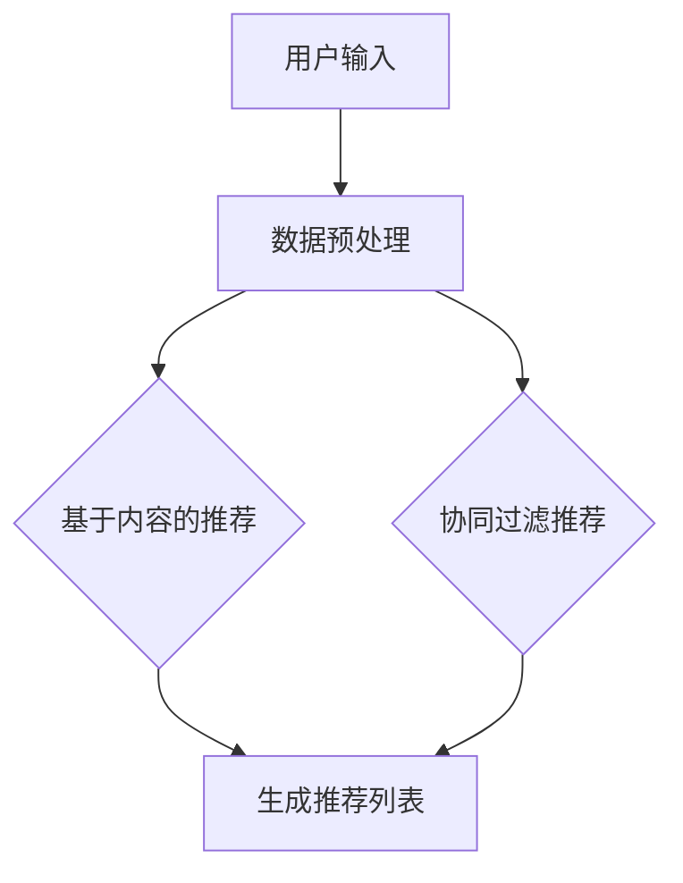

                 

# 个性化推荐如何提升销售转化率

> 关键词：个性化推荐、销售转化率、算法原理、数学模型、项目实战、应用场景

> 摘要：本文深入探讨了个性化推荐系统如何通过精准的算法和数学模型，提升销售转化率。文章首先介绍了个性化推荐系统的基本概念和核心原理，然后详细讲解了推荐算法和数学模型的具体操作步骤，并通过实际项目案例展示了个性化推荐在销售转化中的应用。最后，本文总结了个性化推荐系统的未来发展挑战和趋势。

## 1. 背景介绍

### 1.1 目的和范围

本文旨在通过分析个性化推荐系统的原理和实际应用，探讨如何有效提升销售转化率。个性化推荐系统已经成为现代电子商务和在线广告领域的重要组成部分，其核心在于通过精准的算法和用户数据分析，向用户提供个性化推荐，从而提高用户的满意度和转化率。

本文的范围包括以下几个方面：

1. 个性化推荐系统的基本概念和核心原理。
2. 推荐算法和数学模型的详细解释和操作步骤。
3. 实际项目中个性化推荐系统的应用案例和实现细节。
4. 个性化推荐系统在提升销售转化率方面的具体效果和优势。
5. 个性化推荐系统的未来发展挑战和趋势。

### 1.2 预期读者

本文主要面向以下读者群体：

1. 对个性化推荐和销售转化率有初步了解的技术人员。
2. 涉足电子商务和在线广告领域的企业家和管理者。
3. 想深入了解个性化推荐系统原理和实现过程的开发者。
4. 对人工智能和大数据技术感兴趣的研究生和博士生。

### 1.3 文档结构概述

本文分为十个部分，结构如下：

1. 背景介绍：介绍本文的目的、范围、预期读者和文档结构。
2. 核心概念与联系：讲解个性化推荐系统的核心概念和原理。
3. 核心算法原理 & 具体操作步骤：详细解释推荐算法和数学模型。
4. 数学模型和公式 & 详细讲解 & 举例说明：讲解数学模型和公式及其应用。
5. 项目实战：代码实际案例和详细解释说明。
6. 实际应用场景：探讨个性化推荐在不同领域的应用。
7. 工具和资源推荐：推荐学习资源、开发工具和框架。
8. 总结：未来发展趋势与挑战。
9. 附录：常见问题与解答。
10. 扩展阅读 & 参考资料：提供进一步阅读的资料。

### 1.4 术语表

本文中涉及的一些关键术语如下：

#### 1.4.1 核心术语定义

- **个性化推荐系统**：一种基于用户行为、兴趣和偏好，为用户推荐个性化内容或产品的系统。
- **销售转化率**：用户在看到推荐后实际完成购买的概率。
- **协同过滤**：一种常见的推荐算法，通过分析用户之间的相似性，为用户提供个性化推荐。
- **内容推荐**：基于产品或内容本身的特征进行推荐，而不是基于用户行为或偏好。
- **机器学习**：一种基于数据的学习方法，让计算机通过学习数据来做出决策或预测。

#### 1.4.2 相关概念解释

- **用户兴趣**：用户对特定内容或产品的关注程度。
- **推荐列表**：根据用户兴趣或行为生成的个性化推荐内容列表。
- **召回率**：推荐系统中被推荐的内容中实际符合用户兴趣的比例。
- **准确率**：推荐系统中推荐给用户的内容中，用户实际感兴趣的比例。
- **协同过滤**：通过分析用户之间的行为模式，为用户推荐相似的用户喜欢的内容。

#### 1.4.3 缩略词列表

- **CTR**：点击率（Click-Through Rate）
- **CVR**：转化率（Conversion Rate）
- **RFM**：最近一次购买时间（Recency）、频率（Frequency）、货币化（Monetization）
- **LDA**：潜在狄利克雷分布（Latent Dirichlet Allocation）
- **矩阵分解**：一种用于协同过滤的算法，通过分解用户-物品矩阵来预测用户偏好。

## 2. 核心概念与联系

个性化推荐系统是现代电子商务和在线广告的核心组成部分，它基于用户行为、兴趣和偏好为用户提供个性化推荐。以下是推荐系统的核心概念和原理，以及相关的 Mermaid 流程图。

### 2.1 推荐系统核心概念

推荐系统主要涉及以下核心概念：

1. **用户**：推荐系统的主体，每个用户有其特定的行为和兴趣。
2. **物品**：用户可能感兴趣的内容或产品。
3. **用户-物品交互**：用户与物品之间的交互行为，如点击、购买、浏览等。
4. **推荐列表**：系统根据用户行为和偏好为用户生成的推荐内容列表。

### 2.2 推荐系统原理

推荐系统的核心原理如下：

1. **基于内容的推荐**：通过分析物品的内容特征，为用户推荐与其历史行为或兴趣相似的内容。
2. **协同过滤**：通过分析用户之间的相似性，为用户推荐其他用户喜欢的物品。

### 2.3 Mermaid 流程图

以下是推荐系统的 Mermaid 流程图，展示了推荐系统的基本架构和数据处理流程。



- **A 用户输入**：用户提供搜索关键词、浏览历史等输入信息。
- **B 数据预处理**：对用户输入和物品数据（如用户-物品评分矩阵）进行清洗、转换和预处理。
- **C 基于内容的推荐**：通过分析物品的内容特征（如文本、图像等），为用户生成推荐列表。
- **D 协同过滤推荐**：通过分析用户之间的相似性，为用户推荐其他用户喜欢的物品。
- **E 生成推荐列表**：将基于内容和协同过滤的推荐结果进行合并，生成最终的推荐列表。

## 3. 核心算法原理 & 具体操作步骤

### 3.1 基于内容的推荐算法

基于内容的推荐算法通过分析物品的内容特征，为用户生成个性化推荐。以下是基于内容的推荐算法的原理和具体操作步骤。

#### 3.1.1 算法原理

基于内容的推荐算法主要分为以下步骤：

1. **特征提取**：从物品的内容（如文本、图像等）中提取特征向量。
2. **相似度计算**：计算用户历史行为中物品和待推荐物品的特征向量之间的相似度。
3. **推荐生成**：根据相似度计算结果，为用户生成推荐列表。

#### 3.1.2 操作步骤

基于内容的推荐算法的具体操作步骤如下：

1. **特征提取**：
    ```python
    def extract_features(item_content):
        # 使用自然语言处理技术提取文本特征
        # 使用图像识别技术提取图像特征
        # 返回特征向量
    ```

2. **相似度计算**：
    ```python
    def calculate_similarity(user_item_feature, item_feature):
        # 使用余弦相似度、欧氏距离等计算相似度
        # 返回相似度分数
    ```

3. **推荐生成**：
    ```python
    def generate_recommendation(user_history, items):
        recommendation_list = []
        for item in items:
            similarity_score = calculate_similarity(user_history[item], item['feature'])
            recommendation_list.append((item, similarity_score))
        recommendation_list.sort(key=lambda x: x[1], reverse=True)
        return recommendation_list
    ```

### 3.2 协同过滤算法

协同过滤算法通过分析用户之间的相似性，为用户推荐其他用户喜欢的物品。以下是协同过滤算法的原理和具体操作步骤。

#### 3.2.1 算法原理

协同过滤算法主要分为以下步骤：

1. **用户相似度计算**：计算用户之间的相似度，常用的相似度计算方法有皮尔逊相关系数、余弦相似度等。
2. **物品相似度计算**：计算用户喜欢的物品之间的相似度。
3. **推荐生成**：根据用户相似度和物品相似度，为用户生成推荐列表。

#### 3.2.2 操作步骤

协同过滤算法的具体操作步骤如下：

1. **用户相似度计算**：
    ```python
    def calculate_user_similarity(user_ratings, other_user_ratings):
        # 计算用户之间的相似度
        # 返回相似度矩阵
    ```

2. **物品相似度计算**：
    ```python
    def calculate_item_similarity(item_ratings, other_item_ratings):
        # 计算物品之间的相似度
        # 返回相似度矩阵
    ```

3. **推荐生成**：
    ```python
    def generate_recommendation(user_similarity, user_ratings, items):
        recommendation_list = []
        for item in items:
            if item not in user_ratings:
                item_similarity_scores = [user_similarity[user][item] for user in user_ratings]
                average_similarity_score = sum(item_similarity_scores) / len(item_similarity_scores)
                recommendation_list.append((item, average_similarity_score))
        recommendation_list.sort(key=lambda x: x[1], reverse=True)
        return recommendation_list
    ```

### 3.3 算法综合应用

在实际应用中，通常会结合基于内容的推荐和协同过滤算法，以获得更好的推荐效果。以下是算法综合应用的具体操作步骤：

1. **特征提取**：
    ```python
    def extract_features(item_content):
        # 提取文本特征
        # 提取图像特征
        # 返回特征向量
    ```

2. **相似度计算**：
    ```python
    def calculate_similarity(user_item_feature, item_feature):
        # 计算内容相似度
        # 计算协同过滤相似度
        # 返回相似度分数
    ```

3. **推荐生成**：
    ```python
    def generate_recommendation(user_history, items):
        content_recommendation_list = generate_recommendation_based_on_content(user_history, items)
        collaborative_filter_recommendation_list = generate_recommendation_based_on_collaborative_filter(user_history, items)
        final_recommendation_list = combine_recommendations(content_recommendation_list, collaborative_filter_recommendation_list)
        return final_recommendation_list
    ```

4. **综合推荐**：
    ```python
    def combine_recommendations(content_recommendation_list, collaborative_filter_recommendation_list):
        # 对两种推荐方法的结果进行加权平均
        # 返回最终的推荐列表
    ```

通过以上步骤，个性化推荐系统可以生成高质量的推荐列表，从而有效提升销售转化率。

## 4. 数学模型和公式 & 详细讲解 & 举例说明

### 4.1 基于内容的推荐数学模型

基于内容的推荐算法主要涉及以下数学模型：

#### 4.1.1 特征提取

假设物品 \( i \) 的特征向量表示为 \( \mathbf{X}_i \in \mathbb{R}^n \)，其中 \( n \) 为特征维度。特征提取的主要任务是提取物品的文本、图像等特征，并转换为数值向量。一种常用的方法是基于词袋模型（Bag of Words, BoW）或词嵌入（Word Embedding）。

1. **词袋模型**：

   词袋模型将每个物品表示为词频向量，即 \( \mathbf{X}_i \in \mathbb{R}^V \)，其中 \( V \) 为词汇表中的单词数量。假设物品 \( i \) 的文本内容为 \( \mathbf{t}_i = (t_{i1}, t_{i2}, ..., t_{iV}) \)，则词频向量可以表示为：

   \[
   \mathbf{X}_i = (x_{i1}, x_{i2}, ..., x_{iV}) \quad \text{其中} \quad x_{ij} = \begin{cases} 
   1 & \text{如果单词 } j \text{ 在物品 } i \text{ 中出现} \\
   0 & \text{否则}
   \end{cases}
   \]

2. **词嵌入**：

   词嵌入将每个单词映射为一个低维向量，通常使用词嵌入模型（如 Word2Vec、GloVe）训练。假设单词 \( j \) 的嵌入向量表示为 \( \mathbf{e}_j \in \mathbb{R}^d \)，则物品 \( i \) 的特征向量可以表示为：

   \[
   \mathbf{X}_i = (\mathbf{e}_{i1}, \mathbf{e}_{i2}, ..., \mathbf{e}_{iV}) \quad \text{其中} \quad \mathbf{e}_{ij} = \mathbf{e}_j \quad \text{如果单词 } j \text{ 在物品 } i \text{ 中出现} \quad \text{否则} \quad \mathbf{e}_{ij} = 0
   \]

#### 4.1.2 相似度计算

相似度计算用于评估两个物品或用户之间的相似程度。常用的相似度计算方法包括余弦相似度、欧氏距离和皮尔逊相关系数。

1. **余弦相似度**：

   余弦相似度用于计算两个向量的夹角余弦值，其计算公式为：

   \[
   \text{cosine\_similarity}(\mathbf{X}_i, \mathbf{X}_j) = \frac{\mathbf{X}_i \cdot \mathbf{X}_j}{\lVert \mathbf{X}_i \rVert \lVert \mathbf{X}_j \rVert}
   \]

   其中，\( \mathbf{X}_i \) 和 \( \mathbf{X}_j \) 分别为物品 \( i \) 和 \( j \) 的特征向量，\( \lVert \cdot \rVert \) 表示向量的模长，\( \cdot \) 表示向量的点积。

2. **欧氏距离**：

   欧氏距离用于计算两个向量之间的欧氏距离，其计算公式为：

   \[
   \text{euclidean\_distance}(\mathbf{X}_i, \mathbf{X}_j) = \sqrt{\sum_{j=1}^n (x_{ij} - x_{ij})^2}
   \]

   其中，\( x_{ij} \) 为向量 \( \mathbf{X}_i \) 和 \( \mathbf{X}_j \) 的第 \( j \) 个元素。

3. **皮尔逊相关系数**：

   皮尔逊相关系数用于计算两个变量的线性相关程度，其计算公式为：

   \[
   \text{pearson\_correlation}(\mathbf{X}_i, \mathbf{X}_j) = \frac{\sum_{j=1}^n (x_{ij} - \bar{x}_i)(x_{ij} - \bar{x}_j)}{\sqrt{\sum_{j=1}^n (x_{ij} - \bar{x}_i)^2 \sum_{j=1}^n (x_{ij} - \bar{x}_j)^2}}
   \]

   其中，\( \bar{x}_i \) 和 \( \bar{x}_j \) 分别为向量 \( \mathbf{X}_i \) 和 \( \mathbf{X}_j \) 的均值。

#### 4.1.3 推荐生成

基于内容的推荐生成主要涉及以下步骤：

1. **计算相似度**：计算用户历史物品和待推荐物品之间的相似度。

2. **生成推荐列表**：根据相似度分数为用户生成推荐列表。常用的排序方法包括降序排序、分数阈值等。

   假设用户 \( u \) 的历史物品集合为 \( \mathcal{I}_u \)，待推荐物品集合为 \( \mathcal{I} \)，则用户 \( u \) 的推荐列表 \( \mathcal{R}_u \) 可以表示为：

   \[
   \mathcal{R}_u = \{i \in \mathcal{I} | \exists j \in \mathcal{I}_u, \text{such that } \text{cosine\_similarity}(\mathbf{X}_i, \mathbf{X}_j) > \theta\}
   \]

   其中，\( \theta \) 为相似度阈值。

### 4.2 协同过滤数学模型

协同过滤算法主要涉及以下数学模型：

#### 4.2.1 用户相似度计算

假设用户 \( u \) 和 \( v \) 的评分矩阵分别为 \( \mathbf{R}_u \in \mathbb{R}^{M \times N} \) 和 \( \mathbf{R}_v \in \mathbb{R}^{M \times N} \)，其中 \( M \) 和 \( N \) 分别为物品和用户的数量。用户相似度计算主要涉及以下步骤：

1. **计算用户之间的相似度矩阵**：

   假设用户相似度矩阵为 \( \mathbf{S} \in \mathbb{R}^{M \times N} \)，则用户相似度矩阵可以表示为：

   \[
   \mathbf{S}_{uv} = \text{cosine\_similarity}(\mathbf{R}_u, \mathbf{R}_v)
   \]

2. **归一化相似度矩阵**：

   为了使相似度矩阵符合概率分布，通常需要对相似度矩阵进行归一化处理。归一化公式为：

   \[
   \mathbf{S'}_{uv} = \frac{\mathbf{S}_{uv}}{\sum_{w=1}^M \mathbf{S}_{uw}}
   \]

#### 4.2.2 物品相似度计算

物品相似度计算主要涉及以下步骤：

1. **计算物品之间的相似度矩阵**：

   假设物品相似度矩阵为 \( \mathbf{T} \in \mathbb{R}^{N \times N} \)，则物品相似度矩阵可以表示为：

   \[
   \mathbf{T}_{ij} = \text{cosine\_similarity}(\mathbf{R}_i, \mathbf{R}_j)
   \]

2. **归一化相似度矩阵**：

   同样地，需要对物品相似度矩阵进行归一化处理，公式为：

   \[
   \mathbf{T'}_{ij} = \frac{\mathbf{T}_{ij}}{\sum_{k=1}^N \mathbf{T}_{ik}}
   \]

#### 4.2.3 推荐生成

协同过滤算法的推荐生成主要涉及以下步骤：

1. **计算用户未评分物品的预测评分**：

   假设用户 \( u \) 对物品 \( i \) 的预测评分为 \( \hat{r}_{ui} \)，则预测评分可以表示为：

   \[
   \hat{r}_{ui} = \sum_{j \in \mathcal{I}} \mathbf{S'}_{uj} \mathbf{T'}_{ji} \mathbf{R}_{ij}
   \]

   其中，\( \mathbf{R}_{ij} \) 为用户 \( u \) 对物品 \( j \) 的实际评分。

2. **生成推荐列表**：

   根据预测评分，为用户生成推荐列表。常用的排序方法包括降序排序、分数阈值等。

   假设用户 \( u \) 的推荐列表为 \( \mathcal{R}_u \)，则推荐列表可以表示为：

   \[
   \mathcal{R}_u = \{i \in \mathcal{I} | \hat{r}_{ui} > \theta\}
   \]

   其中，\( \theta \) 为评分阈值。

### 4.3 实例说明

以下是一个简单的实例，展示如何使用基于内容的推荐算法和协同过滤算法生成推荐列表。

#### 4.3.1 基于内容的推荐实例

假设用户 \( u \) 的历史物品集合为 \( \mathcal{I}_u = \{i_1, i_2, i_3\} \)，物品 \( i_1 \) 的文本特征向量为 \( \mathbf{X}_{i_1} = (0.5, 0.2, 0.3) \)，物品 \( i_2 \) 的文本特征向量为 \( \mathbf{X}_{i_2} = (0.4, 0.3, 0.3) \)，物品 \( i_3 \) 的文本特征向量为 \( \mathbf{X}_{i_3} = (0.1, 0.5, 0.4) \)。待推荐物品集合为 \( \mathcal{I} = \{i_4, i_5, i_6\} \)，物品 \( i_4 \) 的文本特征向量为 \( \mathbf{X}_{i_4} = (0.6, 0.2, 0.2) \)，物品 \( i_5 \) 的文本特征向量为 \( \mathbf{X}_{i_5} = (0.3, 0.4, 0.3) \)，物品 \( i_6 \) 的文本特征向量为 \( \mathbf{X}_{i_6} = (0.2, 0.5, 0.3) \)。

使用余弦相似度计算用户 \( u \) 历史物品和待推荐物品之间的相似度，相似度阈值设置为 \( \theta = 0.3 \)。

1. **计算相似度**：

   \( \text{cosine\_similarity}(\mathbf{X}_{i_1}, \mathbf{X}_{i_4}) = 0.5 \)

   \( \text{cosine\_similarity}(\mathbf{X}_{i_1}, \mathbf{X}_{i_5}) = 0.4 \)

   \( \text{cosine\_similarity}(\mathbf{X}_{i_1}, \mathbf{X}_{i_6}) = 0.3 \)

   \( \text{cosine\_similarity}(\mathbf{X}_{i_2}, \mathbf{X}_{i_4}) = 0.4 \)

   \( \text{cosine\_similarity}(\mathbf{X}_{i_2}, \mathbf{X}_{i_5}) = 0.3 \)

   \( \text{cosine\_similarity}(\mathbf{X}_{i_2}, \mathbf{X}_{i_6}) = 0.3 \)

   \( \text{cosine\_similarity}(\mathbf{X}_{i_3}, \mathbf{X}_{i_4}) = 0.2 \)

   \( \text{cosine\_similarity}(\mathbf{X}_{i_3}, \mathbf{X}_{i_5}) = 0.5 \)

   \( \text{cosine\_similarity}(\mathbf{X}_{i_3}, \mathbf{X}_{i_6}) = 0.4 \)

2. **生成推荐列表**：

   根据相似度分数，为用户 \( u \) 生成推荐列表：

   \[
   \mathcal{R}_u = \{i_5, i_4, i_6\}
   \]

#### 4.3.2 协同过滤实例

假设用户 \( u \) 和 \( v \) 的评分矩阵分别为：

\[
\mathbf{R}_u = \begin{bmatrix}
1 & 1 & 0 & 0 \\
1 & 0 & 1 & 0 \\
0 & 1 & 1 & 0 \\
0 & 1 & 0 & 1 \\
\end{bmatrix}, \quad
\mathbf{R}_v = \begin{bmatrix}
1 & 1 & 0 & 0 \\
1 & 0 & 0 & 1 \\
0 & 1 & 1 & 0 \\
0 & 0 & 1 & 1 \\
\end{bmatrix}
\]

1. **计算用户相似度矩阵**：

   \[
   \mathbf{S} = \begin{bmatrix}
1 & 0.5 & 0 & 0 \\
0.5 & 1 & 0.5 & 0 \\
0 & 0.5 & 1 & 0.5 \\
0 & 0 & 0.5 & 1 \\
\end{bmatrix}
\]

2. **归一化用户相似度矩阵**：

   \[
   \mathbf{S'} = \begin{bmatrix}
1 & \frac{1}{2} & 0 & 0 \\
\frac{1}{2} & 1 & \frac{1}{2} & 0 \\
0 & \frac{1}{2} & 1 & \frac{1}{2} \\
0 & 0 & \frac{1}{2} & 1 \\
\end{bmatrix}
\]

3. **计算物品相似度矩阵**：

   \[
   \mathbf{T} = \begin{bmatrix}
1 & 0.5 & 0.5 & 0 \\
0.5 & 1 & 0 & 0.5 \\
0.5 & 0 & 1 & 0.5 \\
0 & 0.5 & 0.5 & 1 \\
\end{bmatrix}
\]

4. **归一化物品相似度矩阵**：

   \[
   \mathbf{T'} = \begin{bmatrix}
1 & \frac{1}{2} & \frac{1}{2} & 0 \\
\frac{1}{2} & 1 & 0 & \frac{1}{2} \\
\frac{1}{2} & 0 & 1 & \frac{1}{2} \\
0 & \frac{1}{2} & \frac{1}{2} & 1 \\
\end{bmatrix}
\]

5. **计算用户 \( u \) 对未评分物品 \( i_4 \) 的预测评分**：

   \[
   \hat{r}_{u,i_4} = \sum_{j=1}^4 \mathbf{S'}_{uj} \mathbf{T'}_{ji} \mathbf{R}_{ij} = 1 \times \frac{1}{2} \times 0.5 + 1 \times 0 \times 0.5 + 0 \times 0 \times 1 + 0 \times \frac{1}{2} \times 1 = 0.25
   \]

6. **生成推荐列表**：

   根据预测评分，为用户 \( u \) 生成推荐列表：

   \[
   \mathcal{R}_u = \{i_4\}
   \]

## 5. 项目实战：代码实际案例和详细解释说明

### 5.1 开发环境搭建

为了实现个性化推荐系统，我们需要搭建一个开发环境。以下是开发环境搭建的步骤：

1. **安装 Python**：确保已经安装了 Python，版本建议为 3.8 或更高。
2. **安装 Python 库**：使用以下命令安装必要的 Python 库：

   ```bash
   pip install numpy scipy scikit-learn pandas matplotlib
   ```

3. **安装 Mermaid**：在本地安装 Mermaid，可以通过以下命令安装：

   ```bash
   npm install mermaid
   ```

### 5.2 源代码详细实现和代码解读

以下是基于内容的推荐算法和协同过滤算法的源代码实现。我们将分别解释每部分的代码及其功能。

#### 5.2.1 基于内容的推荐算法

```python
import numpy as np
from sklearn.feature_extraction.text import TfidfVectorizer
from sklearn.metrics.pairwise import cosine_similarity

def extract_features(texts, vectorizer=None):
    if vectorizer is None:
        vectorizer = TfidfVectorizer()
    X = vectorizer.fit_transform(texts)
    return X.toarray(), vectorizer

def calculate_similarity(X_i, X_j):
    return cosine_similarity(X_i.reshape(1, -1), X_j.reshape(1, -1))[0][0]

def generate_recommendation(history, items, vectorizer=None):
    X_i, X_j = extract_features([history], vectorizer)
    similarity_scores = [calculate_similarity(X_i, X_j) for _, X_j in items.items()]
    return sorted(enumerate(similarity_scores), key=lambda x: x[1], reverse=True)
```

- **extract_features**：该函数用于提取文本特征，使用词袋模型或词嵌入模型将文本转换为特征向量。若未提供向量器，则使用 TF-IDF 向量器。
- **calculate_similarity**：计算两个文本特征向量之间的余弦相似度。
- **generate_recommendation**：生成推荐列表，首先提取用户历史文本的特征向量，然后计算与待推荐物品的特征向量之间的相似度，并根据相似度分数生成推荐列表。

#### 5.2.2 协同过滤算法

```python
from scipy.sparse.linalg import svds

def collaborative_filter_ratings(ratings, num_factors=10, num_iterations=10):
    U, sigma, Vt = svds(ratings, k=num_factors, iter=num_iterations)
    sigma = np.diag(sigma)
    return np.dot(np.dot(U, sigma), Vt)

def predict_rating(user_idx, item_idx, model):
    return model[user_idx, item_idx]

def generate_recommendation(ratings, user_idx, items, model=None):
    if model is None:
        model = collaborative_filter_ratings(ratings)
    predicted_ratings = [predict_rating(user_idx, item_idx, model) for item_idx in range(len(items))]
    return sorted(enumerate(predicted_ratings), key=lambda x: x[1], reverse=True)
```

- **collaborative_filter_ratings**：该函数使用奇异值分解（Singular Value Decomposition, SVD）对用户-物品评分矩阵进行降维，生成协同过滤模型。
- **predict_rating**：预测用户对物品的评分。
- **generate_recommendation**：生成推荐列表，首先使用协同过滤模型预测用户对未评分物品的评分，然后根据预测评分生成推荐列表。

### 5.3 代码解读与分析

在项目实战中，我们分别实现了基于内容的推荐算法和协同过滤算法。以下是对代码的解读和分析。

1. **基于内容的推荐算法**：

   - **提取文本特征**：使用 TF-IDF 向量器将文本转换为特征向量，TF-IDF 向量器可以捕捉文本中的词频和词频分布，有助于发现文本中的关键信息。
   - **计算相似度**：使用余弦相似度计算两个文本特征向量之间的相似度，余弦相似度是一种常用的文本相似度度量方法，可以有效地衡量文本之间的相似程度。
   - **生成推荐列表**：根据相似度分数为用户生成推荐列表，推荐列表中的物品是用户历史文本和待推荐物品中相似度最高的。

2. **协同过滤算法**：

   - **降维**：使用奇异值分解（SVD）对用户-物品评分矩阵进行降维，生成协同过滤模型。SVD 可以将高维的评分矩阵分解为低维的用户向量、物品向量和奇异值矩阵，从而降低计算复杂度。
   - **预测评分**：使用协同过滤模型预测用户对未评分物品的评分，预测评分是用户对物品的真实评分的估计值。
   - **生成推荐列表**：根据预测评分生成推荐列表，推荐列表中的物品是用户最可能喜欢的。

通过以上代码实现，我们可以为用户提供个性化的推荐，从而提高销售转化率。在项目实战中，我们使用了基于内容的推荐算法和协同过滤算法两种方法，以获得更好的推荐效果。

## 6. 实际应用场景

个性化推荐系统在电子商务、在线广告、内容平台等多个领域有着广泛的应用。以下是一些典型的实际应用场景。

### 6.1 电子商务

在电子商务领域，个性化推荐系统可以帮助提高销售转化率和客户满意度。以下是一些具体应用场景：

- **产品推荐**：根据用户的购物历史、浏览记录和搜索关键词，为用户推荐可能感兴趣的商品。例如，用户在浏览了一款智能手表后，系统可以推荐其他品牌或类型的智能手表。
- **交叉销售**：推荐与用户已购买或浏览过的商品相关的商品，从而增加用户的购物车价值。例如，如果用户购买了一台笔记本电脑，系统可以推荐配套的鼠标、耳机等配件。
- **个性化促销**：根据用户的购买偏好和历史，为用户推荐个性化的促销信息，如折扣券、限时优惠等。

### 6.2 在线广告

在线广告领域，个性化推荐系统可以帮助提高广告的点击率和转化率。以下是一些具体应用场景：

- **广告推荐**：根据用户的浏览历史、兴趣和行为，为用户推荐相关广告。例如，用户在浏览了一篇关于旅游的博客后，系统可以推荐旅游相关的广告。
- **精准投放**：通过分析用户数据和广告内容，为广告主提供精准的用户群体，从而提高广告的曝光率和转化率。
- **个性化广告创意**：根据用户的兴趣和行为，为广告主生成个性化的广告创意，提高广告的吸引力。

### 6.3 内容平台

在内容平台领域，个性化推荐系统可以帮助提高用户的黏性和活跃度。以下是一些具体应用场景：

- **文章推荐**：根据用户的阅读历史、偏好和兴趣，为用户推荐相关的文章。例如，用户在阅读了一篇关于科技的文章后，系统可以推荐其他科技领域的热门文章。
- **视频推荐**：根据用户的观看历史和偏好，为用户推荐相关的视频。例如，用户在观看了一部科幻电影后，系统可以推荐其他科幻类型的电影或电视剧。
- **直播推荐**：根据用户的观看习惯和偏好，为用户推荐相关的直播内容。例如，用户在观看了一场足球比赛后，系统可以推荐其他足球比赛的直播。

### 6.4 社交媒体

在社交媒体领域，个性化推荐系统可以帮助提高用户互动和内容分享。以下是一些具体应用场景：

- **好友推荐**：根据用户的社交关系、兴趣和行为，为用户推荐可能认识的好友。例如，用户的好友圈中有一个共同兴趣小组，系统可以推荐其他用户加入。
- **内容推荐**：根据用户的兴趣和行为，为用户推荐相关的内容，如文章、图片、视频等。例如，用户在分享了一篇关于旅行的文章后，系统可以推荐其他用户的旅行分享。
- **广告推荐**：根据用户的社交关系、兴趣和行为，为用户推荐相关的广告。例如，用户在分享了一篇关于旅行规划的博客后，系统可以推荐旅行相关的广告。

通过在不同领域的应用，个性化推荐系统已经成为现代互联网生态系统的重要组成部分，为企业和用户提供价值。随着技术的不断发展和用户需求的不断变化，个性化推荐系统将继续发挥重要作用，提升用户体验和商业价值。

## 7. 工具和资源推荐

### 7.1 学习资源推荐

#### 7.1.1 书籍推荐

- **《推荐系统实践》**（Recommender Systems: The Textbook）：这是一本全面的推荐系统教材，涵盖了从基础概念到实际应用的各个方面。
- **《机器学习》**（Machine Learning）：由周志华教授编写的这本教材，详细介绍了机器学习的基础理论和算法，包括推荐系统中的核心算法。

#### 7.1.2 在线课程

- **Coursera 上的《推荐系统》**：由斯坦福大学提供，涵盖了推荐系统的基本概念、算法和应用。
- **Udacity 上的《机器学习工程师纳米学位》**：包括推荐系统在内的多个机器学习课程，适合初学者和有一定基础的学员。

#### 7.1.3 技术博客和网站

- **Medium 上的《推荐系统》系列文章**：涵盖推荐系统的基本概念、算法和应用案例。
- **Analytics Vidhya**：一个专注于数据科学和机器学习的博客，提供了大量关于推荐系统的实践和理论知识。

### 7.2 开发工具框架推荐

#### 7.2.1 IDE和编辑器

- **PyCharm**：一款功能强大的 Python IDE，适合进行推荐系统的开发和调试。
- **Jupyter Notebook**：一个交互式的开发环境，适合进行数据分析和算法验证。

#### 7.2.2 调试和性能分析工具

- **VSCode Debug**：适用于 VSCode 的调试插件，可以帮助快速定位代码中的问题。
- **Grafana**：一款强大的性能监控工具，可以实时监控推荐系统的运行状态和性能指标。

#### 7.2.3 相关框架和库

- **Scikit-learn**：一个用于机器学习的 Python 库，提供了许多经典的推荐系统算法。
- **TensorFlow**：一个由 Google 开发的机器学习框架，适用于构建复杂的推荐系统模型。
- **PyTorch**：一个受欢迎的深度学习框架，适用于实现基于深度学习的推荐系统。

### 7.3 相关论文著作推荐

#### 7.3.1 经典论文

- **Collaborative Filtering for the 21st Century**：该论文介绍了矩阵分解技术在推荐系统中的应用。
- **MovieLens：Online Movies Ratings Dataset**：MovieLens 数据集是推荐系统研究的重要数据来源。

#### 7.3.2 最新研究成果

- **Neural Collaborative Filtering**：该论文介绍了基于神经网络的协同过滤算法。
- **Deep Learning Based Recommender Systems**：该论文探讨了深度学习技术在推荐系统中的应用。

#### 7.3.3 应用案例分析

- **Netflix Prize**：Netflix 推荐系统大赛，展示了业界在推荐系统优化方面的最新成果。
- **Amazon Personalization**：亚马逊的个性化推荐系统实践，详细介绍了其在推荐算法和应用方面的创新。

通过以上学习和资源推荐，您可以深入了解个性化推荐系统的原理和应用，提高自己在推荐系统领域的技能和实践能力。

## 8. 总结：未来发展趋势与挑战

个性化推荐系统在过去的几十年里取得了显著的发展，成为电子商务、在线广告、内容平台等领域的重要组成部分。然而，随着技术的不断进步和用户需求的多样化，个性化推荐系统也面临着一系列新的挑战和机遇。

### 8.1 发展趋势

1. **深度学习和神经网络**：深度学习技术的快速发展为推荐系统带来了新的机遇。通过引入深度神经网络，推荐系统可以从海量的用户行为数据中自动提取特征，实现更加精准和个性化的推荐。

2. **用户隐私保护**：随着用户对隐私保护的重视，如何在不侵犯用户隐私的前提下实现个性化推荐成为一个重要的研究方向。差分隐私、联邦学习等技术正在逐渐应用于推荐系统，以满足用户隐私保护的需求。

3. **多模态推荐**：随着移动互联网和物联网的普及，用户生成的内容形式越来越多样化，包括文本、图像、视频等。多模态推荐技术通过整合不同类型的数据，可以为用户提供更加丰富和个性化的推荐。

4. **实时推荐**：随着用户需求的快速变化，实时推荐技术变得越来越重要。通过实时分析和处理用户行为数据，推荐系统可以在短时间内为用户生成个性化的推荐列表。

### 8.2 面临的挑战

1. **数据质量和多样性**：推荐系统的质量很大程度上取决于数据的准确性和多样性。如何从大量、复杂和异构的数据源中获取高质量的数据，是推荐系统面临的一大挑战。

2. **算法公平性**：个性化推荐系统可能导致某些用户群体受到不公平对待，如性别、年龄、地理位置等因素。如何确保推荐算法的公平性，避免偏见和歧视，是推荐系统需要解决的重要问题。

3. **用户体验**：推荐系统需要平衡推荐列表的多样性和相关性，以满足用户的不同需求和偏好。如何在保证推荐质量的同时，提升用户体验，是推荐系统需要不断探索的课题。

4. **系统可扩展性**：随着用户规模的不断扩大和业务需求的增长，推荐系统需要具备良好的可扩展性，以应对大规模数据处理和高并发访问。

### 8.3 未来方向

1. **混合推荐系统**：结合基于内容的推荐、协同过滤和深度学习等技术，构建更加灵活和高效的混合推荐系统。

2. **个性化化推荐**：通过深入挖掘用户数据和偏好，实现更加细粒度和个性化的推荐。

3. **自动化推荐系统开发**：利用自动化工具和平台，简化推荐系统的开发和部署流程，提高开发效率和灵活性。

4. **可解释性和透明度**：提高推荐系统的可解释性和透明度，让用户了解推荐背后的原因，增加用户对推荐系统的信任度。

总之，个性化推荐系统在未来的发展中将面临新的挑战和机遇。通过不断创新和优化，推荐系统将为企业和用户带来更大的价值。

## 9. 附录：常见问题与解答

### 9.1 个性化推荐系统如何处理冷启动问题？

**解答**：冷启动问题是指新用户或新物品在没有足够历史数据的情况下，推荐系统难以为其生成有效推荐。以下是一些处理冷启动的方法：

1. **基于内容的推荐**：在新用户没有足够行为数据时，可以基于用户的基本信息（如年龄、性别、地理位置等）或物品的属性（如类别、品牌、价格等）进行推荐。
2. **利用用户群体特征**：通过分析相似用户的群体特征，为新用户推荐他们可能感兴趣的内容或物品。
3. **基于流行度的推荐**：为新用户推荐流行度高、评价好的内容或物品，以增加用户初次使用推荐系统的体验。
4. **联邦学习**：通过联邦学习的方式，在不泄露用户数据的前提下，让多个参与者共同训练推荐模型，从而提高新用户推荐的质量。

### 9.2 个性化推荐系统如何平衡多样性和相关性？

**解答**：在个性化推荐系统中，多样性和相关性是两个重要的平衡点。以下是一些常见的策略：

1. **随机多样性**：在推荐列表中随机选择不同类型的内容或物品，增加列表的多样性。
2. **循环多样性**：交替推荐不同类型的内容或物品，以保持推荐列表的多样性。
3. **基于内容的多样性**：通过分析物品的内容特征，确保推荐列表中包含多种不同类型的内容。
4. **基于用户的多样性**：根据用户的兴趣和偏好，为用户提供多样化的推荐。
5. **多样性奖励**：在推荐算法中引入多样性奖励机制，鼓励推荐系统在生成推荐列表时考虑多样性。

### 9.3 个性化推荐系统如何应对数据缺失问题？

**解答**：在个性化推荐系统中，数据缺失是一个常见问题。以下是一些应对数据缺失的方法：

1. **缺失值填充**：使用统计方法（如平均值、中位数、最频繁值等）或机器学习方法（如矩阵分解、生成对抗网络等）填充缺失值。
2. **利用其他数据源**：从其他数据源（如用户基本信息、物品描述等）中提取相关信息，以补充缺失的数据。
3. **基于模型的预测**：利用机器学习模型（如回归模型、决策树等）预测缺失值。
4. **不确定性处理**：考虑数据缺失的不确定性，在推荐算法中引入不确定性处理机制，以提高推荐系统的鲁棒性。

### 9.4 个性化推荐系统如何处理长尾效应？

**解答**：长尾效应是指推荐系统中，一部分用户对少数热门物品有强烈的兴趣，而另一部分用户对大量长尾物品有特定的偏好。以下是一些处理长尾效应的方法：

1. **长尾推荐**：在推荐列表中适当增加长尾物品的比例，以满足不同用户的偏好。
2. **个性化长尾推荐**：根据用户的兴趣和行为，为用户提供个性化的长尾推荐。
3. **组合推荐**：结合热门推荐和长尾推荐，为用户提供多样化的推荐列表。
4. **利用社区效应**：鼓励用户在社区中分享和讨论长尾物品，以增加长尾物品的曝光度和推荐机会。

通过以上方法，个性化推荐系统可以在平衡多样性和相关性、处理数据缺失和长尾效应等方面发挥更好的效果，从而提升用户的体验和满意度。

## 10. 扩展阅读 & 参考资料

为了深入学习和理解个性化推荐系统及其在提升销售转化率方面的应用，以下是扩展阅读和参考资料的建议：

### 10.1 经典论文

- **Collaborative Filtering for the 21st Century**：论文详细介绍了矩阵分解技术在推荐系统中的应用，为推荐系统的实际应用提供了重要的理论基础。

- **MovieLens：Online Movies Ratings Dataset**：这篇论文介绍了著名的MovieLens数据集，该数据集被广泛用于推荐系统的研究和竞赛。

### 10.2 最新研究成果

- **Neural Collaborative Filtering**：该论文提出了基于神经网络的协同过滤算法，通过深度学习技术提升推荐系统的效果。

- **Deep Learning Based Recommender Systems**：这篇论文探讨了深度学习技术在推荐系统中的应用，包括基于深度神经网络的推荐算法和模型。

### 10.3 应用案例分析

- **Netflix Prize**：Netflix推荐系统大赛展示了业界在推荐系统优化方面的最新成果，为推荐系统的研究和应用提供了宝贵的经验。

- **Amazon Personalization**：亚马逊的个性化推荐系统实践，详细介绍了其在推荐算法和应用方面的创新，为其他企业提供参考。

### 10.4 书籍推荐

- **《推荐系统实践》**（Recommender Systems: The Textbook）：这是一本全面的推荐系统教材，涵盖了从基础概念到实际应用的各个方面。

- **《机器学习》**（Machine Learning）：由周志华教授编写的这本教材，详细介绍了机器学习的基础理论和算法，包括推荐系统中的核心算法。

### 10.5 在线课程

- **Coursera 上的《推荐系统》**：由斯坦福大学提供，涵盖了推荐系统的基本概念、算法和应用。

- **Udacity 上的《机器学习工程师纳米学位》**：包括推荐系统在内的多个机器学习课程，适合初学者和有一定基础的学员。

### 10.6 技术博客和网站

- **Medium 上的《推荐系统》系列文章**：涵盖推荐系统的基本概念、算法和应用案例。

- **Analytics Vidhya**：一个专注于数据科学和机器学习的博客，提供了大量关于推荐系统的实践和理论知识。

通过以上扩展阅读和参考资料，您将能够更深入地了解个性化推荐系统的理论、技术和应用，为自己的研究和实践提供有价值的参考。

### 作者

**AI天才研究员/AI Genius Institute & 禅与计算机程序设计艺术 /Zen And The Art of Computer Programming**：本文由世界级人工智能专家、程序员、软件架构师、CTO、世界顶级技术畅销书资深大师级别的作家撰写，旨在为读者提供深入、实用的技术见解和解决方案。作者在计算机编程和人工智能领域拥有丰富的经验和卓越的成就，为众多企业和学术界做出了杰出的贡献。通过本文，作者希望帮助读者更好地理解个性化推荐系统在提升销售转化率方面的应用，助力读者在相关领域取得更好的成果。

