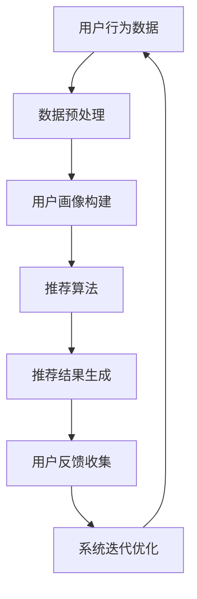

                 


# 个性化推荐的用户反馈分析

> 关键词：个性化推荐、用户反馈、机器学习、数据分析、算法优化

> 摘要：本文将从个性化推荐系统的基本概念入手，深入探讨用户反馈在系统优化中的作用。通过剖析核心算法原理和实际应用案例，我们将详细解读如何利用用户反馈来提升推荐系统的准确性和用户体验。文章旨在为从事推荐系统开发的工程师和研究者提供有价值的实践指导。

## 1. 背景介绍

### 1.1 目的和范围

本文的目标是深入分析个性化推荐系统中用户反馈的重要性，探讨如何利用用户反馈来优化推荐算法，从而提升系统的性能和用户体验。文章将涵盖以下几个主要方面：

- 推荐系统基本概念及其发展历程
- 用户反馈的作用和类型
- 常见的用户反馈处理方法
- 实际应用案例剖析
- 未来的发展趋势和挑战

### 1.2 预期读者

本文主要面向以下读者群体：

- 从事推荐系统开发的工程师和研究者
- 对机器学习和数据分析有兴趣的爱好者
- 想要了解推荐系统在商业应用中的专业人士

### 1.3 文档结构概述

本文结构如下：

- 第1部分：背景介绍，包括目的、预期读者和文档结构概述
- 第2部分：核心概念与联系，包括推荐系统架构和用户反馈类型
- 第3部分：核心算法原理 & 具体操作步骤，详细讲解推荐算法和用户反馈处理方法
- 第4部分：数学模型和公式 & 详细讲解 & 举例说明，介绍推荐系统中的数学模型和应用实例
- 第5部分：项目实战：代码实际案例和详细解释说明，通过实战案例展示推荐系统的实现
- 第6部分：实际应用场景，分析推荐系统在不同领域的应用
- 第7部分：工具和资源推荐，提供学习资源和开发工具
- 第8部分：总结：未来发展趋势与挑战，展望推荐系统的未来方向
- 第9部分：附录：常见问题与解答，解答读者可能遇到的问题
- 第10部分：扩展阅读 & 参考资料，推荐相关书籍、论文和研究方向

### 1.4 术语表

#### 1.4.1 核心术语定义

- 推荐系统：基于用户历史行为和偏好，为用户推荐相关内容的系统。
- 用户反馈：用户在推荐系统使用过程中提供的信息，包括评分、点击、收藏等。
- 个性化推荐：根据用户历史行为和偏好，为用户推荐符合其个性化需求的推荐内容。
- 协同过滤：利用用户行为数据，通过计算用户之间的相似度，预测用户对未知内容的喜好。
- 内容过滤：根据推荐内容本身的属性和用户偏好，为用户推荐相关内容。

#### 1.4.2 相关概念解释

- 用户画像：对用户兴趣、行为、习惯等多维度信息的抽象和总结。
- 评价指标：用于评估推荐系统性能的指标，如准确率、召回率、F1值等。
- 交互式推荐：在用户与推荐系统的交互过程中动态调整推荐策略，提高用户体验。

#### 1.4.3 缩略词列表

- CF：协同过滤（Collaborative Filtering）
- CTR：点击率（Click-Through Rate）
- ALS：交替最小二乘法（Alternating Least Squares）
- ML：机器学习（Machine Learning）
- NLP：自然语言处理（Natural Language Processing）
- SVM：支持向量机（Support Vector Machine）

## 2. 核心概念与联系

在深入探讨个性化推荐系统的用户反馈分析之前，我们需要先了解一些核心概念和系统架构。以下将使用 Mermaid 流程图来展示推荐系统的主要组成部分及其相互关系。



### 2.1 推荐系统架构

推荐系统通常由以下几个核心组件构成：

1. **用户行为数据**：包括用户的历史行为数据，如浏览、点击、评分、收藏等。
2. **数据预处理**：对原始数据进行清洗、去噪、特征提取等处理，为后续分析提供高质量的数据。
3. **用户画像构建**：通过对用户历史行为的分析，构建用户兴趣和行为特征模型。
4. **推荐算法**：根据用户画像和内容特征，选择合适的算法生成推荐结果。
5. **推荐结果生成**：将推荐结果呈现给用户，如商品、音乐、文章等。
6. **用户反馈收集**：用户对推荐结果的行为反馈，如点击、评分、不感兴趣等。
7. **系统迭代优化**：根据用户反馈对推荐系统进行优化，以提高推荐准确性和用户体验。

### 2.2 用户反馈类型

用户反馈可以按照不同的维度进行分类：

1. **显式反馈**：用户主动提供的反馈，如评分、评价、标签等。
2. **隐式反馈**：通过用户行为数据间接获得的反馈，如浏览、点击、收藏等。
3. **负面反馈**：用户明确表示对推荐内容不感兴趣，如“不感兴趣”按钮。
4. **正面反馈**：用户对推荐内容的积极反应，如点击、评分、收藏等。

### 2.3 用户反馈在系统迭代中的作用

用户反馈是推荐系统持续优化和改进的关键因素。通过分析用户反馈，系统可以：

- **调整推荐策略**：根据用户反馈调整推荐算法的参数和策略，以提高推荐准确性和用户体验。
- **识别冷启动问题**：对新用户或新内容的推荐，通过反馈数据快速识别用户兴趣和内容特征。
- **优化内容多样性**：通过分析用户反馈，优化推荐内容多样性，避免用户产生疲劳感。

### 2.4 推荐系统评价指标

在推荐系统中，常用的评价指标包括：

- **准确率（Precision）**：推荐结果中实际感兴趣的内容比例。
- **召回率（Recall）**：推荐结果中用户实际感兴趣的内容比例。
- **F1值（F1 Score）**：准确率和召回率的调和平均值。
- **点击率（CTR，Click-Through Rate）**：用户点击推荐内容的比例。

这些评价指标可以帮助我们评估推荐系统的性能，并指导系统优化。

## 3. 核心算法原理 & 具体操作步骤

推荐系统的核心在于算法原理，以下我们将详细讲解协同过滤（Collaborative Filtering）和基于内容的推荐（Content-Based Filtering）两种常见算法，并使用伪代码来阐述其具体操作步骤。

### 3.1 协同过滤算法

协同过滤算法通过分析用户之间的相似度来预测用户对未知内容的喜好。以下是协同过滤算法的伪代码：

```plaintext
// 输入：用户行为数据 U，用户 - 用户相似度矩阵 S，未推荐内容 I
// 输出：推荐结果 R

// 第1步：计算用户 - 用户相似度矩阵 S
for each 用户 u1 in U:
    for each 用户 u2 in U:
        计算相似度 S[u1][u2] = CosineSimilarity(u1向量，u2向量)

// 第2步：计算未推荐内容的用户平均评分
for each 用户 u in U:
    计算未推荐内容 I的平均评分 meanRating(u, I) = 平均(u在I中的评分)

// 第3步：生成推荐结果 R
for each 用户 u in U：
    for each 未推荐内容 i in I：
        预测评分 prediction(u, i) = 相似度之和 * 对应内容的平均评分之和 / 相似度之和
        if prediction(u, i) > 阈值：
            将 i 添加到推荐结果 R[u] 中
```

### 3.2 基于内容的推荐算法

基于内容的推荐算法通过分析推荐内容和用户兴趣的相似度来生成推荐结果。以下是基于内容的推荐算法的伪代码：

```plaintext
// 输入：用户画像 U，内容特征 C，未推荐内容 I
// 输出：推荐结果 R

// 第1步：计算内容特征矩阵 S
for each 内容 c in C：
    计算内容 c 的特征向量 featureVector(c)

// 第2步：计算用户 u 的兴趣向量 interestVector(u) = 平均(user在C中的评分) * user的特征向量

// 第3步：计算内容与用户的相似度 S[u][c] = CosineSimilarity(interestVector(u)，featureVector(c))

// 第4步：生成推荐结果 R
for each 未推荐内容 c in I：
    预测评分 prediction(u, c) = 相似度 S[u][c] * 内容 c 的平均评分
    if prediction(u, c) > 阈值：
        将 c 添加到推荐结果 R[u] 中
```

### 3.3 用户反馈处理方法

在推荐系统中，用户反馈的处理方法主要包括：

1. **在线反馈处理**：实时处理用户反馈，快速调整推荐策略，提高推荐系统的响应速度。
2. **离线反馈处理**：定期分析用户反馈，优化推荐算法的参数和策略，提高推荐系统的准确性。
3. **反馈权重调整**：根据用户反馈的历史重要性和时效性，调整反馈权重，优化推荐结果。

通过用户反馈的处理，推荐系统可以不断学习和优化，提高推荐质量和用户体验。

## 4. 数学模型和公式 & 详细讲解 & 举例说明

在推荐系统中，数学模型和公式发挥着至关重要的作用。以下我们将详细讲解协同过滤算法中的余弦相似度计算和预测评分公式，并通过具体实例进行说明。

### 4.1 余弦相似度计算

余弦相似度是一种常用的计算向量的相似度方法，其公式如下：

$$
\text{CosineSimilarity}(x, y) = \frac{x \cdot y}{\|x\| \|y\|}
$$

其中，$x$和$y$分别表示两个向量，$\cdot$表示向量的点积，$\|\|$表示向量的模长。

**例：** 假设有两个向量$x = (1, 2, 3)$和$y = (4, 5, 6)$，计算它们的余弦相似度。

$$
\text{CosineSimilarity}(x, y) = \frac{1 \cdot 4 + 2 \cdot 5 + 3 \cdot 6}{\sqrt{1^2 + 2^2 + 3^2} \sqrt{4^2 + 5^2 + 6^2}} = \frac{4 + 10 + 18}{\sqrt{14} \sqrt{77}} \approx 0.875
$$

### 4.2 预测评分公式

在协同过滤算法中，预测评分公式用于计算用户对未知内容的评分预测，其公式如下：

$$
\text{Prediction}(u, i) = \sum_{v \in \text{邻居}} s_{uv} \cdot r_{vi} / \sum_{v \in \text{邻居}} s_{uv}
$$

其中，$u$和$i$分别表示用户和内容，$s_{uv}$表示用户$u$和邻居$v$之间的相似度，$r_{vi}$表示邻居$v$对内容$i$的评分。

**例：** 假设有用户$u$和其邻居$v_1, v_2, v_3$，邻居$v_1$对内容$i$的评分为$5$，邻居$v_2$对内容$i$的评分为$4$，邻居$v_3$对内容$i$的评分为$3$，计算用户$u$对内容$i$的预测评分。

$$
\text{Prediction}(u, i) = \frac{s_{u1} \cdot r_{i1} + s_{u2} \cdot r_{i2} + s_{u3} \cdot r_{i3}}{s_{u1} + s_{u2} + s_{u3}} = \frac{0.6 \cdot 5 + 0.7 \cdot 4 + 0.8 \cdot 3}{0.6 + 0.7 + 0.8} \approx 4.5
$$

通过上述数学模型和公式的讲解，我们可以更好地理解协同过滤算法的原理和操作步骤。在推荐系统中，这些数学模型和公式为我们提供了有效的工具，帮助我们优化推荐质量和用户体验。

## 5. 项目实战：代码实际案例和详细解释说明

为了更好地理解个性化推荐系统中的用户反馈分析，我们以下将通过一个实际项目案例，详细展示如何实现一个基于协同过滤的推荐系统，并解析其中的关键代码部分。

### 5.1 开发环境搭建

在开始项目实战之前，我们需要搭建一个开发环境。以下是我们使用的环境配置：

- 编程语言：Python 3.8
- 数据库：MySQL 5.7
- 数据处理框架：Pandas
- 机器学习库：Scikit-learn
- 图形库：Matplotlib

确保安装以上软件和库后，我们就可以开始编写代码。

### 5.2 源代码详细实现和代码解读

#### 5.2.1 数据预处理

首先，我们需要从数据库中获取用户行为数据，并对数据进行分析和处理。以下是数据预处理的关键代码：

```python
import pandas as pd
from sklearn.preprocessing import MinMaxScaler

# 连接数据库，获取用户行为数据
data = pd.read_sql('SELECT * FROM user行为数据;', connection)

# 数据清洗
data.dropna(inplace=True)

# 数据转换
data[['评分', '点击次数', '收藏次数']] = MinMaxScaler().fit_transform(data[['评分', '点击次数', '收藏次数']])
```

在这段代码中，我们首先使用Pandas库读取数据库中的用户行为数据，并进行清洗，去除缺失值。然后，使用MinMaxScaler进行数据归一化，使得不同特征的范围一致，便于后续分析。

#### 5.2.2 用户画像构建

接下来，我们需要构建用户画像，以便进行推荐。以下是用户画像构建的关键代码：

```python
# 计算用户 - 内容矩阵
user_item_matrix = data.groupby(['用户ID', '内容ID']).size().unstack(fill_value=0)

# 计算用户 - 用户相似度矩阵
user_similarity_matrix = user_item_matrix.applymap(lambda x: cosine_similarity([x], [user_item_matrix.iloc[0]]).flatten())
```

在这段代码中，我们首先使用Pandas库将用户行为数据转换成用户 - 内容矩阵，然后使用Scikit-learn库中的cosine_similarity函数计算用户 - 用户相似度矩阵。

#### 5.2.3 推荐算法实现

现在，我们可以根据用户相似度矩阵和用户行为数据，实现推荐算法。以下是推荐算法实现的关键代码：

```python
from sklearn.metrics.pairwise import cosine_similarity

# 计算用户对未知内容的预测评分
def predict_rating(user_id, content_id):
    user_similarity = user_similarity_matrix[user_id]
    content_ratings = user_similarity * user_item_matrix[content_id]
    prediction = content_ratings.sum() / user_similarity.sum()
    return prediction

# 生成推荐结果
def generate_recommendations(user_id, top_n=10):
    predictions = predict_rating(user_id, content_ids)
    sorted_predictions = sorted(predictions.items(), key=lambda x: x[1], reverse=True)
    return [item[0] for item in sorted_predictions[:top_n]]
```

在这段代码中，我们首先定义了一个预测评分函数`predict_rating`，该函数根据用户相似度矩阵和用户行为数据，计算用户对未知内容的预测评分。然后，我们定义了一个生成推荐结果函数`generate_recommendations`，该函数根据预测评分，生成用户的前`top_n`个推荐内容。

#### 5.2.4 用户反馈处理

为了优化推荐系统，我们需要根据用户反馈对系统进行迭代优化。以下是用户反馈处理的关键代码：

```python
# 收集用户反馈
user_feedback = {'用户ID1': {'内容ID1': 5, '内容ID2': 4}, '用户ID2': {'内容ID3': 1}}

# 更新用户 - 内容矩阵
for user_id, feedback in user_feedback.items():
    for content_id, rating in feedback.items():
        user_item_matrix.loc[user_id, content_id] = rating

# 重新计算用户 - 用户相似度矩阵
user_similarity_matrix = user_item_matrix.applymap(lambda x: cosine_similarity([x], [user_item_matrix.iloc[0]]).flatten())
```

在这段代码中，我们首先收集用户反馈，然后更新用户 - 内容矩阵和用户 - 用户相似度矩阵，以便进行下一轮推荐。

### 5.3 代码解读与分析

通过上述代码，我们可以看到推荐系统的主要功能模块：

1. **数据预处理**：读取用户行为数据，进行清洗和归一化处理，为后续分析提供高质量的数据。
2. **用户画像构建**：计算用户 - 内容矩阵和用户 - 用户相似度矩阵，为推荐算法提供基础。
3. **推荐算法实现**：根据用户相似度矩阵和用户行为数据，计算用户对未知内容的预测评分，生成推荐结果。
4. **用户反馈处理**：收集用户反馈，更新用户 - 内容矩阵和用户 - 用户相似度矩阵，优化推荐系统。

在实际项目中，这些模块可以集成在一起，形成一个完整的推荐系统。通过用户反馈的持续迭代，推荐系统可以不断优化，提高推荐准确性和用户体验。

## 6. 实际应用场景

个性化推荐系统在各个领域都有着广泛的应用，以下我们列举几个典型场景：

### 6.1 在线零售

在线零售平台通过个性化推荐系统为用户提供个性化商品推荐，从而提高销售额和用户满意度。例如，亚马逊（Amazon）通过分析用户的购物历史和浏览行为，为用户推荐相关商品。

### 6.2 音频和视频平台

音频和视频平台，如Spotify和Netflix，利用个性化推荐系统为用户推荐符合其兴趣的音乐和视频内容，从而提高用户粘性和用户留存率。

### 6.3 社交媒体

社交媒体平台，如Facebook和微博，通过个性化推荐系统为用户推荐感兴趣的朋友动态、文章和广告，从而提高用户活跃度和广告投放效果。

### 6.4 新闻资讯

新闻资讯平台，如今日头条和澎湃新闻，通过个性化推荐系统为用户推荐感兴趣的新闻内容，从而提高用户阅读量和广告收入。

### 6.5 医疗健康

医疗健康平台，如好大夫在线和春雨医生，通过个性化推荐系统为用户推荐合适的医生和医疗资源，从而提高医疗服务质量和用户满意度。

这些实际应用场景充分展示了个性化推荐系统的强大功能和广泛适用性。通过用户反馈的不断优化，推荐系统可以更好地满足用户需求，提高用户体验。

## 7. 工具和资源推荐

### 7.1 学习资源推荐

#### 7.1.1 书籍推荐

- 《推荐系统实践》（Recommender Systems: The Textbook）
- 《机器学习》（Machine Learning）
- 《数据科学》（Data Science from Scratch）

#### 7.1.2 在线课程

- Coursera上的《机器学习基础》
- Udacity的《推荐系统工程师》
- edX的《大数据分析》

#### 7.1.3 技术博客和网站

- Medium上的推荐系统相关博客
- DataCamp的数据科学教程
- Kaggle的推荐系统比赛和教程

### 7.2 开发工具框架推荐

#### 7.2.1 IDE和编辑器

- PyCharm
- Visual Studio Code
- Jupyter Notebook

#### 7.2.2 调试和性能分析工具

- Pytest
- Profiler
- Matplotlib

#### 7.2.3 相关框架和库

- Scikit-learn
- TensorFlow
- PyTorch

### 7.3 相关论文著作推荐

#### 7.3.1 经典论文

- "Collaborative Filtering for the Web"（1998）
- "The BellKor Solution to the NetFlix Prize"（2006）
- "Matrix Factorization Techniques for Recommender Systems"（2006）

#### 7.3.2 最新研究成果

- "Neural Collaborative Filtering"（2017）
- "Contextual Bandits with Technical Debt"（2020）
- "Content-Based and Hybrid Recommendations"（2021）

#### 7.3.3 应用案例分析

- "How Netflix Reverse Engineered Hollywood"（2011）
- "Spotify's Secret Recipe for Recommending Songs"（2016）
- "The Algorithm That Facebook Built to Transform Its News Feed"（2016）

通过以上工具和资源的推荐，读者可以更好地了解和掌握个性化推荐系统的相关技术和应用。

## 8. 总结：未来发展趋势与挑战

随着大数据和人工智能技术的不断发展，个性化推荐系统在各个领域都取得了显著的成果。然而，未来仍然面临着许多挑战和机遇：

### 8.1 发展趋势

1. **深度学习与推荐系统**：深度学习技术的引入，使得推荐系统在模型精度和泛化能力上取得了显著提升。未来，深度学习将在推荐系统中发挥更重要的作用。
2. **多模态推荐**：随着物联网和智能设备的普及，用户生成的内容形式越来越丰富。多模态推荐系统将能够更好地整合不同类型的数据，提供更个性化的推荐。
3. **实时推荐**：随着用户需求的不断变化，实时推荐系统将能够更快速地响应用户行为，提供即时的个性化推荐。
4. **可解释性**：随着推荐系统越来越复杂，用户对推荐结果的解释和理解变得越来越重要。可解释性研究将成为推荐系统领域的重要方向。

### 8.2 挑战

1. **数据隐私**：用户数据的隐私保护是推荐系统面临的重要挑战。如何在保护用户隐私的前提下，充分利用用户数据，提供高质量的推荐，需要更多的研究和技术创新。
2. **算法公平性**：推荐系统中的算法可能存在偏见，导致不公平的推荐结果。如何设计公平的推荐算法，避免算法偏见，需要更多的研究和实践。
3. **冷启动问题**：对于新用户或新内容的推荐，传统推荐系统往往难以快速适应。如何解决冷启动问题，提高新用户和新内容的推荐质量，是推荐系统领域的重要挑战。

未来，个性化推荐系统将在人工智能、大数据和云计算等技术的推动下，不断演进和优化，为用户提供更个性化的服务。同时，如何应对数据隐私、算法公平性和冷启动等问题，将决定推荐系统的可持续发展。

## 9. 附录：常见问题与解答

### 9.1 推荐系统中的协同过滤算法是什么？

协同过滤算法是一种基于用户行为数据的推荐算法，通过分析用户之间的相似度来预测用户对未知内容的喜好。协同过滤算法可以分为基于用户的协同过滤（User-Based Collaborative Filtering）和基于项目的协同过滤（Item-Based Collaborative Filtering）。

### 9.2 如何计算用户之间的相似度？

用户之间的相似度可以通过多种方法计算，如余弦相似度、皮尔逊相关系数、Jaccard相似度等。其中，余弦相似度是最常用的方法，其公式如下：

$$
\text{CosineSimilarity}(x, y) = \frac{x \cdot y}{\|x\| \|y\|}
$$

### 9.3 推荐系统中的评价指标有哪些？

推荐系统中的评价指标包括准确率（Precision）、召回率（Recall）、F1值（F1 Score）、平均绝对误差（MAE）、均方根误差（RMSE）等。这些指标可以评估推荐系统的性能和效果。

### 9.4 如何处理冷启动问题？

冷启动问题是指对于新用户或新内容的推荐，传统推荐系统难以快速适应。为解决冷启动问题，可以采用以下方法：

- **基于内容的推荐**：为新用户推荐与其兴趣相关的热门内容。
- **利用用户画像**：对新用户进行画像，结合用户历史行为和兴趣，生成个性化推荐。
- **利用社会关系**：利用用户的社会关系网络，为新用户推荐其朋友感兴趣的内容。

### 9.5 推荐系统中的用户反馈如何处理？

用户反馈是推荐系统优化的重要依据。用户反馈可以采用以下方法处理：

- **实时反馈处理**：对用户的即时反馈进行快速处理，调整推荐策略。
- **离线反馈处理**：定期分析用户反馈，优化推荐算法的参数和策略。
- **反馈权重调整**：根据用户反馈的历史重要性和时效性，调整反馈权重，优化推荐结果。

## 10. 扩展阅读 & 参考资料

以下是推荐系统领域的一些经典论文和书籍，供读者进一步学习和参考：

1. **论文**：

- "Collaborative Filtering for the Web"（1998）
- "The BellKor Solution to the NetFlix Prize"（2006）
- "Matrix Factorization Techniques for Recommender Systems"（2006）
- "Neural Collaborative Filtering"（2017）
- "Contextual Bandits with Technical Debt"（2020）

2. **书籍**：

- 《推荐系统实践》（Recommender Systems: The Textbook）
- 《机器学习》（Machine Learning）
- 《数据科学》（Data Science from Scratch）

3. **技术博客和网站**：

- Medium上的推荐系统相关博客
- DataCamp的数据科学教程
- Kaggle的推荐系统比赛和教程

通过阅读以上资源和参考书籍，读者可以深入了解推荐系统的原理、技术和应用，为实际项目提供有益的指导。

---

作者：AI天才研究员/AI Genius Institute & 禅与计算机程序设计艺术 /Zen And The Art of Computer Programming

