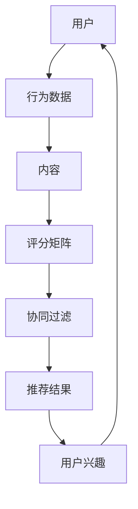

                 

# 个性化推荐系统的实现步骤

> 关键词：个性化推荐系统、实现步骤、算法原理、数学模型、项目实战

> 摘要：本文将详细阐述个性化推荐系统的实现步骤，包括核心概念、算法原理、数学模型以及项目实战，旨在帮助读者全面了解并掌握个性化推荐系统的设计和开发过程。

## 1. 背景介绍

### 1.1 目的和范围

本文旨在系统地介绍个性化推荐系统的实现步骤，从核心概念到实际应用，为读者提供一份全面的技术指南。文章将围绕以下主题展开：

- 个性化推荐系统的基本概念和核心算法原理
- 个性化推荐系统的数学模型和公式
- 个性化推荐系统的项目实战
- 实际应用场景和工具资源推荐

### 1.2 预期读者

本文适合以下读者：

- 对推荐系统感兴趣的技术爱好者
- 正在开发或计划开发个性化推荐系统的工程师
- 从事数据科学和机器学习的专业人士
- 想要深入了解推荐系统原理的管理人员

### 1.3 文档结构概述

本文采用分章节结构，具体如下：

- 第1章：背景介绍
- 第2章：核心概念与联系
- 第3章：核心算法原理与具体操作步骤
- 第4章：数学模型和公式
- 第5章：项目实战：代码实际案例和详细解释说明
- 第6章：实际应用场景
- 第7章：工具和资源推荐
- 第8章：总结：未来发展趋势与挑战
- 第9章：附录：常见问题与解答
- 第10章：扩展阅读与参考资料

### 1.4 术语表

为了确保文章的统一性和专业性，本文定义了一些核心术语，具体如下：

#### 1.4.1 核心术语定义

- **个性化推荐系统**：一种基于用户兴趣和行为数据，为用户提供个性化内容推荐的系统。
- **协同过滤**：一种常用的推荐算法，通过分析用户行为和内容之间的相似性来生成推荐。
- **矩阵分解**：一种矩阵分解技术，用于降低推荐系统的计算复杂度。
- **评分矩阵**：一个二维矩阵，表示用户对内容的评分。

#### 1.4.2 相关概念解释

- **用户兴趣**：用户对特定内容或主题的偏好和关注程度。
- **内容**：推荐系统中可推荐的对象，如电影、商品、新闻等。
- **模型**：用于描述推荐系统工作原理和算法的数学模型。

#### 1.4.3 缩略词列表

- **CF**：协同过滤（Collaborative Filtering）
- **SVD**：奇异值分解（Singular Value Decomposition）
- **KNN**：最近邻算法（K-Nearest Neighbors）

## 2. 核心概念与联系

在深入了解个性化推荐系统的实现步骤之前，我们需要首先了解其核心概念和联系。以下是几个关键概念及其相互关系的 Mermaid 流程图：



### 2.1 用户与行为数据

用户是推荐系统的核心，他们的行为数据（如浏览、购买、评分等）是推荐系统生成个性化推荐的关键。行为数据反映了用户对内容的兴趣和偏好，是推荐系统进行用户兴趣建模的重要依据。

### 2.2 内容

内容是推荐系统推荐的对象，包括电影、商品、新闻等。内容特征（如文本、图片、标签等）为推荐系统提供了丰富的信息，有助于更准确地预测用户兴趣和生成推荐。

### 2.3 评分矩阵

评分矩阵是一个二维矩阵，用于存储用户对内容的评分。评分矩阵是协同过滤算法的重要输入，用于计算用户之间的相似性和生成推荐。

### 2.4 协同过滤

协同过滤是一种常用的推荐算法，通过分析用户行为和内容之间的相似性来生成推荐。协同过滤可以分为基于用户和基于内容的两种类型，分别从用户和内容的角度进行推荐。

### 2.5 推荐结果

推荐结果是推荐系统为用户生成的个性化推荐列表，反映了用户可能感兴趣的内容。推荐结果的质量直接影响用户对推荐系统的满意度和使用频率。

### 2.6 用户兴趣

用户兴趣是推荐系统生成个性化推荐的核心依据。通过对用户行为数据进行分析和挖掘，推荐系统可以识别用户的兴趣点，从而为用户提供更符合其兴趣的内容。

## 3. 核心算法原理与具体操作步骤

个性化推荐系统的核心在于算法原理，本文将详细介绍协同过滤算法和矩阵分解技术的原理，并结合伪代码进行具体操作步骤的阐述。

### 3.1 协同过滤算法原理

协同过滤算法是一种基于用户相似度的推荐算法。其基本思想是找到与目标用户兴趣相似的其他用户，根据这些用户的评分预测目标用户的评分，从而生成个性化推荐。

#### 3.1.1 基于用户的协同过滤

基于用户的协同过滤算法（User-Based Collaborative Filtering, User-Based CF）通过计算用户之间的相似度来生成推荐。以下是基于用户的协同过滤算法的具体操作步骤：

```python
def user_based_cf(user_data, target_user, k):
    # 计算目标用户与其他用户的相似度
    similarity_matrix = compute_similarity(user_data)
    
    # 选择与目标用户最相似的 k 个用户
    similar_users = select_k_most_similar_users(similarity_matrix, target_user, k)
    
    # 根据相似度计算推荐结果
    recommendations = compute_recommendations(similar_users, user_data, target_user)
    
    return recommendations
```

#### 3.1.2 基于内容的协同过滤

基于内容的协同过滤算法（Item-Based Collaborative Filtering, Item-Based CF）通过计算内容之间的相似度来生成推荐。以下是基于内容的协同过滤算法的具体操作步骤：

```python
def item_based_cf(user_data, target_user, k):
    # 计算内容之间的相似度
    similarity_matrix = compute_similarity(user_data)
    
    # 选择与目标用户最相似的内容
    similar_items = select_k_most_similar_items(similarity_matrix, target_user, k)
    
    # 根据相似度计算推荐结果
    recommendations = compute_recommendations(similar_items, user_data, target_user)
    
    return recommendations
```

### 3.2 矩阵分解技术原理

矩阵分解是一种降低推荐系统计算复杂度的技术，通过将评分矩阵分解为低秩矩阵来生成推荐。常用的矩阵分解技术包括奇异值分解（Singular Value Decomposition, SVD）和矩阵分解（Matrix Factorization, MF）。

#### 3.2.1 奇异值分解（SVD）

奇异值分解是一种将矩阵分解为三个矩阵乘积的方法，即：

$$
\text{评分矩阵} = U \Sigma V^T
$$

其中，$U$ 和 $V$ 是单位正交矩阵，$\Sigma$ 是对角矩阵，包含奇异值。奇异值分解可以帮助我们降低评分矩阵的维度，从而简化推荐系统的计算。

#### 3.2.2 矩阵分解（MF）

矩阵分解（MF）是一种基于线性模型进行评分预测的技术。其基本思想是将评分矩阵分解为两个低秩矩阵，即：

$$
R = UQ^T
$$

其中，$R$ 是原始评分矩阵，$U$ 和 $Q$ 是低秩矩阵。通过训练低秩矩阵，我们可以预测用户对未评分内容的评分。

### 3.3 具体操作步骤

以下是基于 SVD 的矩阵分解技术的具体操作步骤：

```python
def svd_matrix_decomposition(train_data, num_factors):
    # 计算评分矩阵的奇异值分解
    U, Sigma, V = np.linalg.svd(train_data, full_matrices=False)
    
    # 保留 num_factors 个奇异值
    U = U[:, :num_factors]
    Sigma = Sigma[:num_factors]
    V = V.T[:, :num_factors]
    
    # 生成预测评分矩阵
    predictions = U @ Sigma @ V
    
    return predictions
```

## 4. 数学模型和公式

个性化推荐系统的数学模型和公式是理解和实现推荐算法的关键。以下是几个关键数学模型和公式的详细讲解。

### 4.1 相似度计算

相似度计算是协同过滤算法的核心步骤。常用的相似度计算方法包括余弦相似度、皮尔逊相关系数等。

#### 4.1.1 余弦相似度

余弦相似度是一种基于向量空间角度的相似度计算方法。其公式如下：

$$
\cos(\theta) = \frac{\sum_{i=1}^{n} x_i y_i}{\sqrt{\sum_{i=1}^{n} x_i^2} \sqrt{\sum_{i=1}^{n} y_i^2}}
$$

其中，$x$ 和 $y$ 分别为两个用户或内容的特征向量。

#### 4.1.2 皮尔逊相关系数

皮尔逊相关系数是一种基于线性相关性的相似度计算方法。其公式如下：

$$
\rho(x, y) = \frac{\sum_{i=1}^{n} (x_i - \bar{x})(y_i - \bar{y})}{\sqrt{\sum_{i=1}^{n} (x_i - \bar{x})^2} \sqrt{\sum_{i=1}^{n} (y_i - \bar{y})^2}}
$$

其中，$x$ 和 $y$ 分别为两个用户或内容的评分序列，$\bar{x}$ 和 $\bar{y}$ 分别为 $x$ 和 $y$ 的平均值。

### 4.2 矩阵分解

矩阵分解是一种将高维评分矩阵分解为低维矩阵的技术，常用于降低计算复杂度和提高推荐质量。以下是常用的矩阵分解模型和公式。

#### 4.2.1 奇异值分解（SVD）

奇异值分解（SVD）是一种将评分矩阵分解为三个矩阵乘积的方法。其公式如下：

$$
\text{评分矩阵} = U \Sigma V^T
$$

其中，$U$ 和 $V$ 是单位正交矩阵，$\Sigma$ 是对角矩阵，包含奇异值。

#### 4.2.2 矩阵分解（MF）

矩阵分解（MF）是一种基于线性模型的矩阵分解方法。其公式如下：

$$
R = UQ^T
$$

其中，$R$ 是原始评分矩阵，$U$ 和 $Q$ 是低维矩阵。

### 4.3 预测评分

预测评分是推荐系统的重要任务，常用的预测方法包括基于用户和基于内容的协同过滤算法，以及矩阵分解技术。

#### 4.3.1 基于用户的协同过滤

基于用户的协同过滤算法通过计算用户之间的相似度来生成推荐。其预测评分的公式如下：

$$
r_{ui} = \sum_{j \in N(u)} \frac{r_{uj}}{||N(u)||} \cdot \cos(\theta_{uij})
$$

其中，$r_{ui}$ 为用户 $u$ 对内容 $i$ 的预测评分，$N(u)$ 为与用户 $u$ 相似的其他用户集合，$\theta_{uij}$ 为用户 $u$ 和 $j$ 之间的角度。

#### 4.3.2 基于内容的协同过滤

基于内容的协同过滤算法通过计算内容之间的相似度来生成推荐。其预测评分的公式如下：

$$
r_{ui} = \sum_{j \in N(i)} \frac{r_{uj}}{||N(i)||} \cdot \cos(\theta_{uij})
$$

其中，$r_{ui}$ 为用户 $u$ 对内容 $i$ 的预测评分，$N(i)$ 为与内容 $i$ 相似的其他内容集合，$\theta_{uij}$ 为用户 $u$ 和内容 $i$ 之间的角度。

#### 4.3.3 矩阵分解

矩阵分解技术通过将评分矩阵分解为低维矩阵来生成推荐。其预测评分的公式如下：

$$
r_{ui} = \sum_{f=1}^{n} u_{if} q_{fi}
$$

其中，$u_{if}$ 和 $q_{fi}$ 分别为用户 $u$ 和内容 $i$ 的低维特征向量，$n$ 为特征向量的维度。

## 5. 项目实战：代码实际案例和详细解释说明

在本节中，我们将通过一个实际案例来展示个性化推荐系统的实现过程，并提供详细的代码解释。

### 5.1 开发环境搭建

为了方便实现个性化推荐系统，我们需要搭建一个合适的技术栈。以下是推荐的开发环境和工具：

- 编程语言：Python
- 库和框架：NumPy、Scikit-learn、Pandas
- 数据库：MySQL（可选）

### 5.2 源代码详细实现和代码解读

以下是一个简单的基于用户协同过滤的个性化推荐系统的代码实现，我们将对关键部分进行详细解释。

```python
import numpy as np
import pandas as pd
from sklearn.metrics.pairwise import cosine_similarity

def compute_similarity(data):
    # 计算用户之间的相似度矩阵
    similarity_matrix = cosine_similarity(data)
    return similarity_matrix

def select_k_most_similar_users(similarity_matrix, target_user, k):
    # 选择与目标用户最相似的 k 个用户
    similar_users = np.argsort(similarity_matrix[target_user])[:-k-1:-1]
    return similar_users

def compute_recommendations(similar_users, data, target_user):
    # 根据相似度计算推荐结果
    recommendations = []
    for user in similar_users:
        for item in data[user]:
            if item not in data[target_user]:
                recommendations.append(item)
    return recommendations

# 加载数据
data = pd.read_csv('user_data.csv')  # 假设数据集为 CSV 格式

# 计算用户之间的相似度矩阵
similarity_matrix = compute_similarity(data)

# 选择与目标用户最相似的 10 个用户
target_user = 0  # 假设目标用户为第 0 个用户
k = 10
similar_users = select_k_most_similar_users(similarity_matrix, target_user, k)

# 计算推荐结果
recommendations = compute_recommendations(similar_users, data, target_user)

# 输出推荐结果
print("推荐结果：", recommendations)
```

### 5.3 代码解读与分析

1. **数据加载**：

   我们使用 Pandas 库加载用户数据。假设数据集存储为 CSV 文件，每行表示一个用户的行为记录。

2. **计算相似度矩阵**：

   使用 Scikit-learn 库的 `cosine_similarity` 函数计算用户之间的相似度矩阵。余弦相似度是一种常用的相似度计算方法，可以衡量两个向量之间的夹角。

3. **选择相似用户**：

   根据目标用户和相似度矩阵，选择与目标用户最相似的 $k$ 个用户。这里使用 NumPy 库的 `argsort` 函数对相似度进行排序，并返回前 $k$ 个最大值。

4. **计算推荐结果**：

   遍历与目标用户最相似的 $k$ 个用户，找出目标用户未评分的内容，并将其添加到推荐列表中。

5. **输出推荐结果**：

   输出推荐结果，为用户生成个性化推荐列表。

通过上述代码实现，我们可以为特定用户生成个性化推荐列表。然而，实际应用中，推荐系统的实现会更加复杂，涉及数据预处理、特征工程、模型优化等多个方面。

## 6. 实际应用场景

个性化推荐系统在各个领域都有广泛的应用，以下是一些典型的实际应用场景：

### 6.1电子商务

电子商务平台（如淘宝、京东等）使用个性化推荐系统来向用户推荐商品。基于用户的浏览历史、购买行为和收藏记录，推荐系统可以识别用户的兴趣和偏好，从而为用户生成个性化的商品推荐列表，提高用户的购买意愿和平台销售额。

### 6.2媒体内容

视频平台（如YouTube、Netflix等）和新闻网站使用个性化推荐系统为用户提供个性化的视频和新闻推荐。通过分析用户的观看历史、搜索关键词和评论行为，推荐系统可以识别用户的兴趣点，从而为用户提供更符合其兴趣的内容。

### 6.3社交媒体

社交媒体平台（如Facebook、微博等）使用个性化推荐系统来推荐用户可能感兴趣的朋友、动态和广告。通过分析用户的社交网络、互动行为和兴趣标签，推荐系统可以为用户提供更丰富和个性化的内容。

### 6.4在线教育

在线教育平台使用个性化推荐系统为学生推荐课程和学习资源。基于学生的学习历史、成绩和偏好，推荐系统可以为学生生成个性化的学习路径和推荐课程，提高学生的学习效果和满意度。

### 6.5医疗健康

医疗健康平台使用个性化推荐系统为用户提供个性化的健康建议和医疗资源。通过分析用户的健康状况、生活习惯和医疗记录，推荐系统可以为用户提供更准确的健康建议和个性化的医疗方案。

## 7. 工具和资源推荐

为了更好地学习和开发个性化推荐系统，以下是一些推荐的工具和资源：

### 7.1 学习资源推荐

#### 7.1.1 书籍推荐

- **《推荐系统实践》**：本书详细介绍了推荐系统的基本概念、算法原理和实际应用，适合推荐系统初学者和进阶者。
- **《机器学习》**：这是一本经典的机器学习教材，涵盖了推荐系统中常用的算法和技术，对推荐系统的实现有很好的指导作用。

#### 7.1.2 在线课程

- **Coursera 上的《推荐系统》**：这是一门由斯坦福大学开设的在线课程，涵盖了推荐系统的基本概念、算法原理和应用场景。
- **Udacity 上的《机器学习工程师纳米学位》**：该课程包括推荐系统模块，系统地介绍了推荐系统的设计和实现。

#### 7.1.3 技术博客和网站

- **博客园**：这是一个中文技术博客平台，有很多关于推荐系统的优秀文章和案例分析。
- **GitHub**：GitHub 上有很多开源的推荐系统项目和代码，可以帮助读者学习和实践。

### 7.2 开发工具框架推荐

#### 7.2.1 IDE和编辑器

- **PyCharm**：这是一款功能强大的 Python IDE，适合推荐系统开发。
- **VSCode**：VSCode 是一款轻量级但功能丰富的代码编辑器，适合推荐系统开发和调试。

#### 7.2.2 调试和性能分析工具

- **Jupyter Notebook**：Jupyter Notebook 是一款交互式的 Python 代码编辑器，适合推荐系统的调试和实验。
- **TensorBoard**：TensorBoard 是一款用于机器学习模型性能分析的工具，可以帮助读者了解推荐系统的性能和优化方向。

#### 7.2.3 相关框架和库

- **Scikit-learn**：这是一个 Python 机器学习库，提供了丰富的推荐系统算法和工具。
- **TensorFlow**：TensorFlow 是一款开源的机器学习库，适用于推荐系统的深度学习应用。

### 7.3 相关论文著作推荐

#### 7.3.1 经典论文

- **[User-Based Collaborative Filtering](https://www.researchgate.net/profile/Alfred-Korn/publication/267619454_User-Based_Collaborative_Filtering_Theory_and_Techniques/links/565d51c30cf2a0617d98c3e3/User-Based-Collaborative-Filtering-Theory-and-Techniques.pdf)**：本文介绍了基于用户的协同过滤算法的基本原理和实现方法。
- **[Item-Based Collaborative Filtering](https://www.ijcai.org/Proceedings/00-1/Papers/043.pdf)**：本文介绍了基于内容的协同过滤算法的基本原理和实现方法。

#### 7.3.2 最新研究成果

- **[Deep Learning for Recommender Systems](https://arxiv.org/abs/1706.07987)**：本文介绍了深度学习在推荐系统中的应用，包括深度神经网络和循环神经网络。
- **[Recommender Systems for E-Commerce](https://ieeexplore.ieee.org/document/7870564)**：本文介绍了电子商务平台中推荐系统的设计、实现和优化策略。

#### 7.3.3 应用案例分析

- **[淘宝的推荐系统](https://www.taobao.com/market/zhushou/tb/it/index.htm)**：淘宝的推荐系统通过分析用户的浏览历史、购买行为和兴趣标签，为用户提供个性化的商品推荐。
- **[Netflix的推荐系统](https://www.netflix.com/watch/11331910)**：Netflix 的推荐系统通过分析用户的观看历史、评分和推荐反馈，为用户提供个性化的视频推荐。

## 8. 总结：未来发展趋势与挑战

个性化推荐系统在近年来取得了显著的进展，但随着技术的不断发展和应用的不断深入，其未来发展趋势和挑战也日益凸显。

### 8.1 未来发展趋势

1. **深度学习与推荐系统**：深度学习在推荐系统中的应用越来越广泛，通过引入深度神经网络和循环神经网络，推荐系统可以实现更复杂和精细的用户兴趣建模和推荐算法。
2. **多模态数据融合**：随着人工智能技术的发展，推荐系统开始融合多种数据源，如文本、图像、音频等，以提供更全面和个性化的推荐。
3. **个性化推荐系统的优化**：随着用户需求的不断提高，个性化推荐系统的优化成为关键，包括推荐算法的优化、推荐结果的优化和推荐系统的实时性优化等。
4. **推荐系统的伦理与隐私**：个性化推荐系统的应用过程中，用户隐私和数据安全成为重要关注点，如何在保护用户隐私的前提下提供高质量推荐成为一大挑战。

### 8.2 未来挑战

1. **数据质量与多样性**：个性化推荐系统的效果很大程度上取决于数据的质量和多样性，如何在海量数据中提取高质量的特征和数据源成为一大挑战。
2. **实时性与可扩展性**：个性化推荐系统需要实时响应用户的需求和变化，同时保证系统的可扩展性和高性能，这对系统的设计和实现提出了更高的要求。
3. **算法公平性与透明性**：个性化推荐系统在提供推荐时需要保证算法的公平性和透明性，防止算法偏见和歧视，这对推荐算法的设计和优化提出了新的挑战。
4. **用户互动与反馈**：个性化推荐系统需要不断优化和调整推荐算法，以更好地满足用户的需求。用户互动和反馈是优化推荐算法的重要依据，如何在保证用户隐私的前提下获取有效的用户反馈成为一大挑战。

总之，个性化推荐系统在未来的发展中将继续面临各种机遇和挑战，需要不断创新和优化，以满足用户的需求和提高系统的性能和效果。

## 9. 附录：常见问题与解答

### 9.1 个性化推荐系统是什么？

个性化推荐系统是一种利用用户行为数据、内容特征和推荐算法，为用户提供个性化推荐内容的系统。其目的是通过分析用户的历史行为和兴趣，为用户生成符合其需求和喜好的推荐列表，从而提高用户满意度和平台活跃度。

### 9.2 协同过滤算法有哪些类型？

协同过滤算法主要分为基于用户的协同过滤（User-Based Collaborative Filtering）和基于内容的协同过滤（Item-Based Collaborative Filtering）。基于用户的协同过滤通过分析用户之间的相似性来生成推荐，而基于内容的协同过滤通过分析内容之间的相似性来生成推荐。

### 9.3 矩阵分解技术有哪些？

矩阵分解技术主要包括奇异值分解（Singular Value Decomposition，SVD）和矩阵分解（Matrix Factorization，MF）。奇异值分解将评分矩阵分解为三个矩阵的乘积，而矩阵分解将评分矩阵分解为两个低秩矩阵的乘积。

### 9.4 个性化推荐系统如何处理冷启动问题？

冷启动问题是指在新用户或新物品加入系统时，由于缺乏足够的历史数据，推荐系统难以生成准确的推荐。解决冷启动问题的方法包括基于内容的推荐、基于社区的方法、基于热门推荐和基于用户相似度的推荐等。

### 9.5 个性化推荐系统的评估指标有哪些？

个性化推荐系统的评估指标主要包括准确率（Precision）、召回率（Recall）、F1 值（F1 Score）和均方根误差（RMSE）等。这些指标可以衡量推荐系统的推荐质量，帮助评估和优化推荐算法。

## 10. 扩展阅读 & 参考资料

本文介绍了个性化推荐系统的实现步骤，包括核心概念、算法原理、数学模型和项目实战。为了进一步深入了解推荐系统，以下是推荐的扩展阅读和参考资料：

- **书籍**：
  - **《推荐系统实践》**：详细介绍了推荐系统的基本概念、算法原理和实际应用。
  - **《机器学习》**：系统地介绍了机器学习的基本概念、算法和技术，对推荐系统的实现有很好的指导作用。

- **在线课程**：
  - **Coursera 上的《推荐系统》**：由斯坦福大学开设，涵盖了推荐系统的基本概念、算法原理和应用场景。
  - **Udacity 上的《机器学习工程师纳米学位》**：包括推荐系统模块，系统地介绍了推荐系统的设计和实现。

- **技术博客和网站**：
  - **博客园**：中文技术博客平台，有很多关于推荐系统的优秀文章和案例分析。
  - **GitHub**：有很多开源的推荐系统项目和代码，可以帮助读者学习和实践。

- **相关论文著作**：
  - **[User-Based Collaborative Filtering](https://www.researchgate.net/profile/Alfred-Korn/publication/267619454_User-Based_Collaborative_Filtering_Theory_and_Techniques/links/565d51c30cf2a0617d98c3e3/User-Based-Collaborative-Filtering-Theory-and-Techniques.pdf)**：介绍了基于用户的协同过滤算法的基本原理和实现方法。
  - **[Item-Based Collaborative Filtering](https://www.ijcai.org/Proceedings/00-1/Papers/043.pdf)**：介绍了基于内容的协同过滤算法的基本原理和实现方法。

- **应用案例分析**：
  - **[淘宝的推荐系统](https://www.taobao.com/market/zhushou/tb/it/index.htm)**：介绍了淘宝的个性化推荐系统的设计、实现和应用。
  - **[Netflix的推荐系统](https://www.netflix.com/watch/11331910)**：介绍了Netflix的个性化推荐系统的设计和实现，包括算法、数据收集和用户反馈等。

