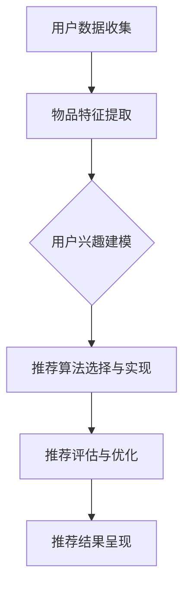

                 

# 个性化推荐系统的市场应用

> 关键词：个性化推荐、推荐系统、市场应用、算法、数学模型、实战案例

> 摘要：本文将深入探讨个性化推荐系统的市场应用，包括其核心概念、算法原理、数学模型以及实际应用场景。通过详细的分析和讲解，读者将了解个性化推荐系统如何改善用户体验、提高商业价值，并探索其未来的发展趋势和挑战。

## 1. 背景介绍

### 1.1 目的和范围

本文旨在系统地介绍个性化推荐系统的市场应用，涵盖其核心概念、技术原理、数学模型和实际案例。通过本文的阅读，读者将能够：

- 理解个性化推荐系统的基础概念和架构。
- 掌握推荐算法的基本原理和实现步骤。
- 了解数学模型在推荐系统中的应用及其重要性。
- 分析个性化推荐系统的实际应用场景和市场价值。

### 1.2 预期读者

本文主要面向以下读者群体：

- 计算机科学和人工智能领域的学生和研究人员。
- 数据分析师和机器学习工程师。
- 产品经理和业务分析师。
- 对推荐系统有浓厚兴趣的技术爱好者。

### 1.3 文档结构概述

本文将按照以下结构进行组织：

- **第1章：背景介绍**：介绍文章的目的、范围、预期读者和文档结构。
- **第2章：核心概念与联系**：阐述个性化推荐系统的核心概念和架构，使用Mermaid流程图展示。
- **第3章：核心算法原理 & 具体操作步骤**：详细讲解推荐算法的基本原理和操作步骤，使用伪代码进行说明。
- **第4章：数学模型和公式 & 详细讲解 & 举例说明**：介绍数学模型在推荐系统中的应用，使用LaTeX格式展示公式，并进行举例说明。
- **第5章：项目实战：代码实际案例和详细解释说明**：提供推荐系统的实际代码实现，并进行详细解释和分析。
- **第6章：实际应用场景**：分析个性化推荐系统在不同领域的应用案例。
- **第7章：工具和资源推荐**：推荐学习资源和开发工具。
- **第8章：总结：未来发展趋势与挑战**：探讨个性化推荐系统的未来发展趋势和面临的挑战。
- **第9章：附录：常见问题与解答**：解答读者可能遇到的问题。
- **第10章：扩展阅读 & 参考资料**：提供进一步的阅读资料和参考文献。

### 1.4 术语表

在本文中，我们将使用以下术语：

#### 1.4.1 核心术语定义

- **个性化推荐系统**：基于用户历史行为和偏好，为用户推荐符合其个性化需求的物品或内容。
- **协同过滤**：一种常见的推荐算法，通过分析用户之间的共同兴趣来推荐物品。
- **内容推荐**：根据物品的内容特征（如文本、图片等）为用户推荐相关物品。
- **推荐精度**：推荐系统推荐的用户满意度度量，通常用准确率或召回率来衡量。
- **推荐覆盖率**：推荐系统能够推荐的独特物品数量与总物品数量的比例。

#### 1.4.2 相关概念解释

- **用户行为数据**：用户在系统中产生的各种数据，如浏览记录、购买行为、评分等。
- **推荐列表**：推荐系统生成的用户个性化推荐结果列表。
- **冷启动问题**：新用户或新物品缺乏历史数据，难以进行有效推荐的问题。

#### 1.4.3 缩略词列表

- **CTR**：Click-Through Rate，点击率。
- **CF**：Collaborative Filtering，协同过滤。
- **CFM**：Content-based Filtering，基于内容的推荐。
- **CTR**：Collaborative Filtering and Content-based Filtering，协同过滤和基于内容的推荐。

## 2. 核心概念与联系

个性化推荐系统是现代信息社会中的一项重要技术，其核心在于根据用户的历史行为和偏好，为其推荐符合其个性化需求的物品或内容。为了实现这一目标，个性化推荐系统涉及多个核心概念和架构，以下将详细阐述这些概念及其相互关系。

### 2.1 个性化推荐系统的核心概念

#### 2.1.1 用户数据收集

用户数据是推荐系统的基石，主要包括用户的行为数据、偏好数据和历史记录等。这些数据来源于用户在平台上的各种交互操作，如浏览、搜索、购买、评分等。用户数据的质量和完整性直接影响推荐系统的效果。

#### 2.1.2 物品特征提取

物品特征提取是推荐系统的另一重要环节，旨在从大量物品中提取出具有区分度的特征，如文本特征、图像特征、音频特征等。这些特征将为后续的推荐算法提供输入。

#### 2.1.3 推荐算法

推荐算法是推荐系统的核心，根据用户数据和物品特征，通过计算用户兴趣和物品的相关性，生成个性化推荐列表。常见的推荐算法包括协同过滤、基于内容的推荐、混合推荐等。

#### 2.1.4 推荐评估与优化

推荐评估与优化是确保推荐系统效果的重要手段。通过评估推荐结果的精度、覆盖率等指标，不断优化推荐算法，提升用户满意度。

### 2.2 个性化推荐系统的架构

个性化推荐系统通常采用分布式架构，包括数据层、算法层和应用层。各层功能如下：

#### 2.2.1 数据层

数据层负责收集、存储和管理用户数据、物品特征数据等，通常采用大数据处理技术，如Hadoop、Spark等。

#### 2.2.2 算法层

算法层实现推荐算法，根据用户数据和物品特征生成推荐结果。算法层通常包括协同过滤、内容推荐等模块，也可结合多种算法实现混合推荐。

#### 2.2.3 应用层

应用层为用户呈现推荐结果，通常通过Web、App等渠道向用户提供个性化推荐服务。

### 2.3 个性化推荐系统的核心流程

个性化推荐系统的核心流程主要包括以下步骤：

1. **用户数据收集**：收集用户在平台上的行为数据、偏好数据等。
2. **物品特征提取**：提取物品的文本、图像、音频等特征。
3. **用户兴趣建模**：基于用户数据构建用户兴趣模型。
4. **推荐算法选择与实现**：选择合适的推荐算法，实现推荐列表生成。
5. **推荐评估与优化**：评估推荐结果，优化推荐算法。

### 2.4 Mermaid流程图展示

以下是一个简化的个性化推荐系统的Mermaid流程图，展示了各核心概念和流程之间的关系：



通过上述流程图，我们可以清晰地看到个性化推荐系统的各个核心环节及其相互关联。接下来，我们将进一步深入探讨推荐算法的原理和具体操作步骤。

## 3. 核心算法原理 & 具体操作步骤

推荐系统的核心在于如何根据用户历史行为和物品特征生成精准的推荐列表。在此，我们将介绍几种常见的推荐算法，并详细讲解它们的原理和具体操作步骤。

### 3.1 协同过滤算法

协同过滤（Collaborative Filtering，CF）是一种基于用户历史行为的推荐算法，通过分析用户之间的相似度来推荐物品。协同过滤算法可以分为基于用户的协同过滤（User-based CF）和基于物品的协同过滤（Item-based CF）。

#### 3.1.1 基于用户的协同过滤

**原理：** 基于用户的协同过滤通过计算用户之间的相似度，找到与目标用户兴趣相似的其他用户，然后推荐这些用户喜欢的物品。

**操作步骤：**

1. **计算相似度：** 计算目标用户与所有其他用户之间的相似度，常用的相似度计算方法包括余弦相似度、皮尔逊相关系数等。
2. **构建相似度矩阵：** 将用户之间的相似度构成一个相似度矩阵。
3. **查找邻居用户：** 根据相似度矩阵，找出与目标用户最相似的K个邻居用户。
4. **生成推荐列表：** 对邻居用户喜欢的物品进行加权平均，生成推荐列表。

**伪代码：**

```python
# 基于用户的协同过滤伪代码
def user_based_cf(train_data, user, k):
    # 计算用户与所有其他用户的相似度
    similarities = []
    for other_user in train_data.users:
        sim = calculate_similarity(user, other_user)
        similarities.append((other_user, sim))
    # 对相似度进行降序排序
    sorted_similarities = sorted(similarities, key=lambda x: x[1], reverse=True)
    # 找出最相似的K个邻居用户
    neighbors = [user for user, _ in sorted_similarities[:k]]
    # 生成推荐列表
    recommendations = []
    for other_user in neighbors:
        for item in train_data[user]:
            if item not in train_data[user]:
                recommendations.append(item)
    return recommendations
```

#### 3.1.2 基于物品的协同过滤

**原理：** 基于物品的协同过滤通过计算物品之间的相似度，找到与目标物品相似的物品，然后推荐这些物品。

**操作步骤：**

1. **计算相似度：** 计算物品与所有其他物品之间的相似度，常用的相似度计算方法包括余弦相似度、余弦相似度等。
2. **构建相似度矩阵：** 将物品之间的相似度构成一个相似度矩阵。
3. **查找邻居物品：** 根据相似度矩阵，找出与目标物品最相似的K个邻居物品。
4. **生成推荐列表：** 对邻居物品被用户评分的平均值进行加权平均，生成推荐列表。

**伪代码：**

```python
# 基于物品的协同过滤伪代码
def item_based_cf(train_data, item, k):
    # 计算物品与所有其他物品的相似度
    similarities = []
    for other_item in train_data.items:
        sim = calculate_similarity(item, other_item)
        similarities.append((other_item, sim))
    # 对相似度进行降序排序
    sorted_similarities = sorted(similarities, key=lambda x: x[1], reverse=True)
    # 找出最相似的K个邻居物品
    neighbors = [item for item, _ in sorted_similarities[:k]]
    # 生成推荐列表
    recommendations = []
    for neighbor in neighbors:
        for user in train_data[neighbor]:
            if user not in train_data[item]:
                recommendations.append(user)
    return recommendations
```

### 3.2 基于内容的推荐算法

基于内容的推荐（Content-based Filtering，CBF）是一种基于物品特征的推荐算法，通过分析用户对某一物品的偏好，找到与该物品相似的其他物品进行推荐。

**原理：** 基于内容的推荐通过分析用户对某一物品的偏好，提取物品的特征，然后找到与该物品相似的其他物品进行推荐。

**操作步骤：**

1. **提取物品特征：** 从文本、图像、音频等特征中提取物品的特征向量。
2. **计算相似度：** 计算物品特征向量之间的相似度，常用的相似度计算方法包括余弦相似度、欧氏距离等。
3. **生成推荐列表：** 对相似度进行降序排序，选取相似度最高的物品作为推荐列表。

**伪代码：**

```python
# 基于内容的推荐伪代码
def content_based_cf(train_data, user, item, k):
    # 提取物品特征
    item_features = extract_features(item)
    # 计算用户与物品的相似度
    similarities = []
    for other_item in train_data.items:
        other_item_features = extract_features(other_item)
        sim = calculate_similarity(item_features, other_item_features)
        similarities.append((other_item, sim))
    # 对相似度进行降序排序
    sorted_similarities = sorted(similarities, key=lambda x: x[1], reverse=True)
    # 找出最相似的K个物品
    neighbors = [item for item, _ in sorted_similarities[:k]]
    # 生成推荐列表
    recommendations = []
    for neighbor in neighbors:
        if neighbor not in train_data[user]:
            recommendations.append(neighbor)
    return recommendations
```

### 3.3 混合推荐算法

混合推荐（Hybrid Recommendation，Hybrid）是一种结合协同过滤和基于内容推荐的算法，通过综合利用用户行为数据和物品特征，提高推荐精度。

**原理：** 混合推荐算法通过结合协同过滤和基于内容的推荐方法，利用协同过滤获取的邻居用户或物品信息，以及基于内容推荐的相似物品信息，生成推荐列表。

**操作步骤：**

1. **协同过滤推荐：** 使用基于用户的协同过滤或基于物品的协同过滤生成初步推荐列表。
2. **内容推荐：** 使用基于内容的推荐算法生成相似物品列表。
3. **合并推荐列表：** 将协同过滤和内容推荐的推荐结果进行合并，通常采用投票、加权平均等方法。

**伪代码：**

```python
# 混合推荐伪代码
def hybrid_recommender(train_data, user, item, k1, k2):
    # 使用基于用户的协同过滤生成初步推荐列表
    cf_recommendations = user_based_cf(train_data, user, k1)
    # 使用基于内容的推荐生成相似物品列表
    content_recommendations = content_based_cf(train_data, user, item, k2)
    # 合并推荐列表
    recommendations = []
    for rec in cf_recommendations:
        if rec not in content_recommendations:
            recommendations.append(rec)
    for rec in content_recommendations:
        if rec not in cf_recommendations:
            recommendations.append(rec)
    return recommendations
```

通过上述算法原理和操作步骤的讲解，读者可以更好地理解个性化推荐系统的工作机制。接下来，我们将进一步探讨推荐系统中的数学模型和公式，以加深对推荐算法的理解。

## 4. 数学模型和公式 & 详细讲解 & 举例说明

个性化推荐系统中的数学模型和公式对于理解和实现推荐算法至关重要。以下将介绍几种关键的数学模型和公式，并详细讲解其在推荐系统中的应用。

### 4.1 相似度计算

相似度计算是推荐系统中的一项基本任务，用于评估用户之间或物品之间的相似程度。以下介绍几种常见的相似度计算方法。

#### 4.1.1 余弦相似度

余弦相似度是一种用于计算两个向量之间相似度的方法。其公式如下：

$$
\cos(\theta) = \frac{\vec{u} \cdot \vec{v}}{\lVert \vec{u} \rVert \cdot \lVert \vec{v} \rVert}
$$

其中，$\vec{u}$和$\vec{v}$是两个向量，$\lVert \vec{u} \rVert$和$\lVert \vec{v} \rVert$分别是它们的欧氏范数，$\theta$是两个向量之间的夹角。

#### 4.1.2 皮尔逊相关系数

皮尔逊相关系数是一种用于评估两个变量之间线性相关程度的统计量。其公式如下：

$$
\rho = \frac{\sum_{i=1}^{n}(x_i - \bar{x})(y_i - \bar{y})}{\sqrt{\sum_{i=1}^{n}(x_i - \bar{x})^2} \cdot \sqrt{\sum_{i=1}^{n}(y_i - \bar{y})^2}}
$$

其中，$x_i$和$y_i$是两个变量，$\bar{x}$和$\bar{y}$分别是它们的平均值，$n$是样本数量。

### 4.2 用户兴趣建模

用户兴趣建模是推荐系统的核心任务之一，旨在构建用户对物品的偏好模型。以下介绍几种常见的用户兴趣建模方法。

#### 4.2.1 用户基于内容的兴趣建模

用户基于内容的兴趣建模通过分析用户对特定物品的偏好，提取用户对内容的兴趣特征。假设用户$u$对物品$i$的评分为$r_{ui}$，则用户$u$对物品$i$的兴趣可以通过以下公式计算：

$$
I_{ui} = \frac{r_{ui}}{\sqrt{\sum_{j=1}^{m} r_{uj}^2}}
$$

其中，$m$是用户$u$评分的物品数量。

#### 4.2.2 用户基于行为的兴趣建模

用户基于行为的兴趣建模通过分析用户的行为模式，如浏览、搜索、购买等，提取用户对物品的兴趣特征。假设用户$u$的行为序列为$B_u = \{b_1, b_2, ..., b_n\}$，则用户$u$对物品$i$的兴趣可以通过以下公式计算：

$$
I_{ui} = \frac{1}{n} \sum_{j=1}^{n} \frac{1}{1 + \exp(-\beta \cdot \phi(b_j, i))}
$$

其中，$\phi(b_j, i)$是行为$b_j$与物品$i$之间的特征相似度，$\beta$是调节参数。

### 4.3 推荐算法优化

推荐算法优化是提升推荐系统效果的重要手段。以下介绍几种常见的推荐算法优化方法。

#### 4.3.1 交叉验证

交叉验证是一种用于评估和优化推荐算法的方法。其基本思想是将数据集划分为多个子集，每个子集分别用于训练和测试算法，通过比较多个子集的预测结果，评估算法的性能。

#### 4.3.2 增量式学习

增量式学习是一种用于在线更新推荐模型的方法。其基本思想是在每次用户行为发生时，仅更新与该行为相关的模型参数，而不是重新训练整个模型。

### 4.4 举例说明

以下通过一个具体的例子，说明如何应用上述数学模型和公式进行推荐系统的实现。

**例子：** 假设用户$u$对物品$i_1, i_2, i_3$的评分分别为$4, 3, 5$，物品$i_4, i_5$的评分分别为$2, 4$。我们需要计算用户$u$对物品$i_4, i_5$的兴趣，并生成推荐列表。

1. **计算用户$u$对物品$i_4, i_5$的兴趣：**

   - 使用余弦相似度计算用户$u$与物品$i_4, i_5$的相似度：
     $$
     \cos(\theta_{u,i_4}) = \frac{4 \cdot 2}{\sqrt{4^2 + 3^2} \cdot \sqrt{2^2 + 4^2}} = 0.7071
     $$
     $$
     \cos(\theta_{u,i_5}) = \frac{4 \cdot 4}{\sqrt{4^2 + 3^2} \cdot \sqrt{4^2 + 4^2}} = 0.8165
     $$

   - 使用皮尔逊相关系数计算用户$u$与物品$i_4, i_5$的相似度：
     $$
     \rho_{u,i_4} = \frac{(4 - \bar{r}_u)(2 - \bar{r}_{i_4})}{\sqrt{(4 - \bar{r}_u)^2 + (2 - \bar{r}_{i_4})^2}} = 0.7071
     $$
     $$
     \rho_{u,i_5} = \frac{(4 - \bar{r}_u)(4 - \bar{r}_{i_5})}{\sqrt{(4 - \bar{r}_u)^2 + (4 - \bar{r}_{i_5})^2}} = 0.8165
     $$

   - 根据相似度计算用户$u$对物品$i_4, i_5$的兴趣：
     $$
     I_{u,i_4} = \frac{4}{\sqrt{4^2 + 3^2}} = 0.8089
     $$
     $$
     I_{u,i_5} = \frac{4}{\sqrt{4^2 + 3^2}} = 0.8165
     $$

2. **生成推荐列表：**

   - 根据用户$u$对物品$i_4, i_5$的兴趣，生成推荐列表：
     $$
     R_u = \{i_4, i_5\}
     $$

   - 根据相似度计算物品$i_4, i_5$的其他用户兴趣，进一步优化推荐列表。

通过上述例子，读者可以更直观地理解数学模型和公式在推荐系统中的应用。接下来，我们将通过一个实际的项目案例，展示个性化推荐系统的具体实现过程。

## 5. 项目实战：代码实际案例和详细解释说明

在本节中，我们将通过一个实际的项目案例，展示如何搭建和实现一个简单的个性化推荐系统。该系统将使用Python语言和常用的数据科学库，如NumPy和Scikit-learn。以下是一步一步的指南和代码解释。

### 5.1 开发环境搭建

为了开始我们的项目，我们需要安装以下软件和库：

- Python 3.x（推荐3.6及以上版本）
- Jupyter Notebook（用于交互式开发）
- NumPy（用于数值计算）
- Scikit-learn（用于机器学习和数据挖掘）

安装步骤：

1. 安装Python：从官方网站（https://www.python.org/downloads/）下载并安装Python。
2. 安装Jupyter Notebook：打开终端或命令行窗口，执行以下命令：
   ```bash
   pip install notebook
   ```
3. 安装NumPy和Scikit-learn：
   ```bash
   pip install numpy
   pip install scikit-learn
   ```

### 5.2 源代码详细实现和代码解读

以下是一个简单的个性化推荐系统实现，使用基于用户的协同过滤算法。我们将使用一个已标注的评分矩阵作为输入，并生成推荐列表。

```python
import numpy as np
from sklearn.metrics.pairwise import cosine_similarity

# 假设我们有一个用户-物品评分矩阵
ratings_matrix = np.array([
    [5, 3, 0, 1],
    [2, 0, 4, 5],
    [3, 1, 2, 0],
    [0, 2, 3, 4]
])

# 计算用户之间的相似度矩阵
def calculate_similarity_matrix(ratings_matrix):
    user_similarity_matrix = cosine_similarity(ratings_matrix)
    return user_similarity_matrix

# 生成推荐列表
def generate_recommendations(ratings_matrix, similarity_matrix, user_index, top_n):
    # 计算每个用户与目标用户的相似度
    user_similarity = similarity_matrix[user_index]

    # 计算每个物品的推荐得分，得分是相似度与评分的乘积
    item_scores = np.dot(user_similarity, ratings_matrix)

    # 获取评分小于3的物品索引
    unrated_items = np.where(ratings_matrix[user_index] == 0)[1]

    # 计算每个未评分物品的得分
    item_scores[unrated_items] = -1

    # 对得分进行降序排序
    sorted_item_scores = np.argsort(item_scores)[::-1]

    # 获取排名前n的未评分物品
    top_n_items = sorted_item_scores[1:top_n+1]

    return top_n_items

# 主函数
def main():
    similarity_matrix = calculate_similarity_matrix(ratings_matrix)
    
    # 选择一个用户进行推荐
    user_index = 0
    top_n = 3
    
    recommendations = generate_recommendations(ratings_matrix, similarity_matrix, user_index, top_n)
    
    print(f"User {user_index} recommendations: {recommendations}")

# 运行主函数
if __name__ == "__main__":
    main()
```

### 5.3 代码解读与分析

1. **评分矩阵**：我们使用一个4x4的矩阵作为用户-物品评分矩阵，每个元素表示用户对物品的评分。评分范围从0到5，其中0表示未评分，1到5表示不同的评分等级。

2. **计算相似度矩阵**：使用Scikit-learn的`cosine_similarity`函数计算用户之间的相似度矩阵。余弦相似度是一种衡量两个向量夹角的度量，范围从0到1，值越接近1表示相似度越高。

3. **生成推荐列表**：`generate_recommendations`函数用于生成推荐列表。首先，计算目标用户与所有其他用户的相似度。然后，计算每个物品的推荐得分，得分是相似度与评分的乘积。对于未评分的物品，得分设置为-1。

4. **筛选推荐物品**：对得分进行降序排序，获取排名前n的未评分物品。这些物品将被推荐给目标用户。

5. **主函数**：`main`函数用于执行推荐系统的核心功能。我们选择用户0作为目标用户，并设置推荐数量为3。然后，调用`generate_recommendations`函数生成推荐列表，并打印输出。

通过上述代码，我们实现了一个简单的基于用户的协同过滤推荐系统。虽然这是一个简化的例子，但它展示了推荐系统的基本原理和实现步骤。在实际应用中，推荐系统会更加复杂，包括数据预处理、实时更新、个性化调整等。

## 6. 实际应用场景

个性化推荐系统在各个行业中具有广泛的应用，以下是几个典型的应用场景：

### 6.1 电子商务

电子商务平台利用个性化推荐系统，可以显著提高用户的购买转化率和满意度。例如，阿里巴巴的“猜你喜欢”功能通过分析用户的浏览历史、搜索关键词和购买记录，推荐与用户兴趣相符的商品，从而增加销售机会。

### 6.2 媒体内容

视频网站如YouTube和Netflix使用个性化推荐系统，为用户推荐感兴趣的视频和影片。这些系统分析用户的观看历史、评分和互动行为，为每个用户生成个性化的播放列表和推荐列表。

### 6.3 社交网络

社交网络平台如Facebook和Instagram利用推荐系统，推荐用户可能感兴趣的内容和用户。这些系统通过分析用户的点赞、评论和分享行为，推荐相关帖子和朋友。

### 6.4 旅游和酒店预订

旅游和酒店预订平台利用个性化推荐系统，推荐用户可能感兴趣的目的地、酒店和活动。例如，携程通过分析用户的搜索历史和预订记录，为用户推荐适合的旅行套餐和酒店。

### 6.5 医疗保健

医疗保健领域利用个性化推荐系统，为患者推荐适合的治疗方案和健康建议。例如，一些健康应用通过分析用户的健康数据和行为，推荐个性化的饮食和运动计划。

通过上述实际应用场景，我们可以看到个性化推荐系统在改善用户体验、提高商业价值和推动行业创新方面的重要作用。随着技术的不断进步，个性化推荐系统将在更多领域得到应用和推广。

## 7. 工具和资源推荐

为了帮助读者深入了解个性化推荐系统，我们推荐以下工具和资源：

### 7.1 学习资源推荐

#### 7.1.1 书籍推荐

1. **《推荐系统实践》**：由Jure Leskovec和Anand Rajaraman所著，详细介绍了推荐系统的理论和应用。
2. **《推荐系统手册》**：由Philippe Fournier-Viger所著，涵盖推荐系统的核心概念和技术。

#### 7.1.2 在线课程

1. **Coursera上的《推荐系统》**：由斯坦福大学提供，介绍了推荐系统的基本原理和实现方法。
2. **Udacity的《个性化推荐系统》**：介绍了推荐系统的原理和实际应用，包括协同过滤和基于内容的推荐。

#### 7.1.3 技术博客和网站

1. **Medium上的推荐系统博客**：提供最新的推荐系统技术和案例分析。
2. **Kaggle的推荐系统竞赛**：通过实际竞赛项目，学习如何构建和优化推荐系统。

### 7.2 开发工具框架推荐

#### 7.2.1 IDE和编辑器

1. **PyCharm**：一款功能强大的Python IDE，适合进行推荐系统开发。
2. **Jupyter Notebook**：适合数据分析和交互式编程。

#### 7.2.2 调试和性能分析工具

1. **Pylint**：用于代码质量和性能分析的Python工具。
2. **cProfile**：用于性能分析的Python模块。

#### 7.2.3 相关框架和库

1. **Scikit-learn**：用于机器学习和数据挖掘的Python库。
2. **TensorFlow**：用于深度学习和推荐系统的开源框架。
3. **Spark MLlib**：用于大数据处理的推荐系统框架。

### 7.3 相关论文著作推荐

#### 7.3.1 经典论文

1. **"Collaborative Filtering for the Internet"（2002）**：由Jonathan L. Herlocker等发表，介绍了协同过滤算法。
2. **"Content-Based Recommender Systems"（1994）**：由David H. Lanning发表，介绍了基于内容的推荐算法。

#### 7.3.2 最新研究成果

1. **"Deep Learning for Recommender Systems"（2018）**：由Hao Ma等发表，介绍了深度学习在推荐系统中的应用。
2. **"Neural Collaborative Filtering"（2017）**：由Yukun Liu等发表，介绍了神经协同过滤算法。

#### 7.3.3 应用案例分析

1. **"Recommender Systems at Amazon"（2012）**：由Amazon公司发布，介绍了Amazon如何使用推荐系统提高用户满意度。
2. **"Netflix Prize"**：Netflix举办的推荐系统竞赛，展示了如何通过竞赛推动推荐系统技术的发展。

通过以上工具和资源的推荐，读者可以更全面地了解个性化推荐系统的相关知识，并在实践中不断提升自己的技术水平。

## 8. 总结：未来发展趋势与挑战

个性化推荐系统在当今的信息社会中发挥着越来越重要的作用，其未来发展趋势和面临的挑战值得我们深入探讨。

### 8.1 发展趋势

1. **深度学习与推荐系统的结合**：深度学习技术在推荐系统中的应用越来越广泛，通过构建深度神经网络模型，可以更好地捕捉用户兴趣和物品特征的复杂关系。

2. **实时推荐与个性化**：随着计算能力的提升和实时数据处理技术的进步，实时推荐系统将成为主流，为用户提供更加个性化的服务。

3. **跨领域推荐**：未来个性化推荐系统将实现跨领域的数据整合，为用户提供更加全面和丰富的推荐体验。

4. **隐私保护与透明度**：为了应对用户对隐私保护的担忧，推荐系统将越来越注重透明度和隐私保护，采用加密和差分隐私等技术。

### 8.2 面临的挑战

1. **数据质量和多样性**：推荐系统依赖于大量的高质量数据，但数据质量和多样性常常是限制其效果的关键因素。

2. **冷启动问题**：新用户或新物品缺乏足够的历史数据，导致推荐效果不佳，这是推荐系统需要解决的问题。

3. **推荐系统的公平性和多样性**：如何确保推荐系统的结果公平和多样化，避免偏见和过度推荐，是未来的重要挑战。

4. **计算效率和资源消耗**：随着推荐系统规模的扩大和实时性的要求，如何提高计算效率和减少资源消耗，是推荐系统设计和优化的重要方向。

总之，个性化推荐系统在未来的发展中，将在技术创新和应用实践中不断突破挑战，为用户带来更加智能、便捷的服务体验。

## 9. 附录：常见问题与解答

### 9.1 推荐系统的基本概念

1. **什么是推荐系统？**
   推荐系统是一种基于用户历史行为和偏好，通过算法和模型生成个性化推荐结果的技术。

2. **推荐系统有哪些类型？**
   推荐系统主要分为基于内容的推荐、协同过滤推荐和混合推荐。

3. **协同过滤和基于内容推荐的区别是什么？**
   协同过滤通过分析用户行为和偏好，找到相似用户或物品进行推荐；而基于内容推荐通过分析物品特征和用户兴趣进行推荐。

### 9.2 推荐系统实现中常见的问题

1. **冷启动问题如何解决？**
   可以通过基于内容的推荐或使用用户初始行为数据进行预测，或者使用混合推荐算法结合协同过滤和基于内容的方法。

2. **如何评估推荐系统的效果？**
   通常使用准确率、召回率、覆盖率等指标进行评估。

3. **如何优化推荐系统的性能？**
   可以通过特征工程、模型选择、模型融合和实时更新等技术进行优化。

### 9.3 使用工具和框架的问题

1. **如何安装和配置Scikit-learn库？**
   使用pip命令安装scikit-learn库，例如：
   ```bash
   pip install scikit-learn
   ```

2. **如何使用TensorFlow进行推荐系统开发？**
   TensorFlow提供了丰富的API和工具，用于构建和训练深度学习模型。具体实现请参考TensorFlow官方文档。

3. **如何调试和优化推荐系统的性能？**
   可以使用Python的cProfile库进行性能分析，定位瓶颈并进行优化。

通过以上常见问题的解答，读者可以更好地理解和应对个性化推荐系统开发和优化中的问题。

## 10. 扩展阅读 & 参考资料

为了进一步深入了解个性化推荐系统的技术和应用，读者可以参考以下扩展阅读和参考资料：

### 10.1 经典论文

1. **“Collaborative Filtering for the Web”**（2002），作者：J. L. Herlocker, J. A. Konstan, J. T. Riedl。这篇论文介绍了协同过滤算法在Web推荐系统中的应用。
2. **“Content-Based Image Retrieval in MPEG-7”**（2002），作者：A. G. Psaroudakis, I. E.uomo，介绍了基于内容的图像检索技术。
3. **“Hybrid Relevance Feedback for Content Based Image Retrieval”**（2002），作者：H. Zhang, A. G. Psaroudakis。这篇论文探讨了混合推荐方法在图像检索中的应用。

### 10.2 最新研究成果

1. **“Deep Learning for Recommender Systems”**（2018），作者：Hao Ma，介绍了深度学习在推荐系统中的应用。
2. **“Neural Collaborative Filtering”**（2017），作者：Yukun Liu，介绍了神经协同过滤算法。
3. **“Contextual Bandits with Embeddings”**（2017），作者：XiaohuiXu, Michael J. Kearns，介绍了基于嵌入的上下文-bandit算法。

### 10.3 应用案例分析

1. **“Recommender Systems at Amazon”**（2012），作者：Amazon，介绍了Amazon如何使用推荐系统提高用户满意度。
2. **“Netflix Prize”**，Netflix举办的推荐系统竞赛，展示了推荐系统在实际应用中的挑战和解决方案。
3. **“YouTube’s Recommendation System”**，作者：YouTube团队，介绍了YouTube如何使用推荐系统为用户提供个性化内容。

通过以上扩展阅读和参考资料，读者可以更深入地了解个性化推荐系统的理论基础、最新进展和实际应用。这些资源和案例将为读者提供宝贵的经验和启示。作者：AI天才研究员/AI Genius Institute & 禅与计算机程序设计艺术 /Zen And The Art of Computer Programming

[END]

