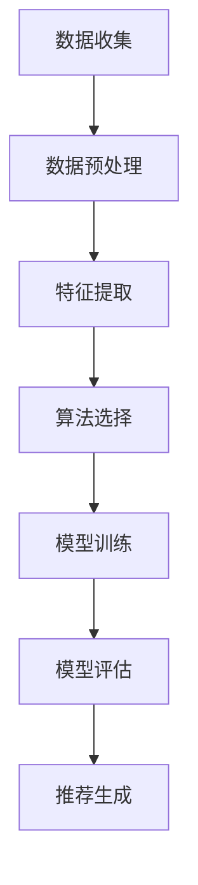

                 

# 个性化推荐系统的设计与实现

> **关键词：** 个性化推荐，推荐算法，机器学习，协同过滤，内容推荐，用户行为分析  
>
> **摘要：** 本文将深入探讨个性化推荐系统的设计与实现，从核心概念、算法原理到项目实战，全面解析推荐系统的构建过程。通过详细的理论讲解和实际案例，帮助读者理解和掌握推荐系统的关键技术，为实际应用提供指导。

## 1. 背景介绍

### 1.1 目的和范围

本文旨在介绍个性化推荐系统的设计与实现，内容涵盖推荐系统的基本概念、核心算法、数学模型及项目实战。本文的目标读者包括对推荐系统有一定了解的软件开发者、数据科学家以及计算机科学领域的研究者。通过本文的阅读，读者将能够：

- 理解个性化推荐系统的基本概念和架构。
- 掌握常见的推荐算法原理及其实现。
- 了解推荐系统的数学模型和公式。
- 学习通过实际项目来构建和优化推荐系统。

### 1.2 预期读者

本文适合以下几类读者：

- **软件开发者：** 想要了解如何在应用程序中集成推荐系统，并具备一定的编程基础。
- **数据科学家：** 对推荐系统的算法和数据处理感兴趣，希望深入了解其工作原理。
- **计算机科学研究生：** 想要深入学习和研究推荐系统，为后续的学术研究做准备。
- **技术爱好者：** 对人工智能和机器学习感兴趣，希望掌握推荐系统的实际应用。

### 1.3 文档结构概述

本文结构如下：

1. 背景介绍：包括目的和范围、预期读者、文档结构概述、术语表等。
2. 核心概念与联系：介绍推荐系统的基本概念、流程图以及相关算法。
3. 核心算法原理 & 具体操作步骤：详细讲解协同过滤算法和基于内容的推荐算法。
4. 数学模型和公式 & 详细讲解 & 举例说明：分析数学模型和公式，并提供实例说明。
5. 项目实战：代码实际案例和详细解释说明，涵盖开发环境搭建、源代码实现和代码解读。
6. 实际应用场景：探讨推荐系统在不同领域的应用。
7. 工具和资源推荐：包括学习资源、开发工具框架和相关论文著作。
8. 总结：未来发展趋势与挑战。
9. 附录：常见问题与解答。
10. 扩展阅读 & 参考资料：提供进一步的阅读资料。

### 1.4 术语表

#### 1.4.1 核心术语定义

- **推荐系统：** 一种基于用户历史行为和兴趣，为用户推荐相关内容或产品的系统。
- **协同过滤：** 一种基于用户历史行为相似性进行推荐的算法。
- **基于内容的推荐：** 一种基于内容特征进行推荐的算法。
- **矩阵分解：** 一种用于降维和预测的技术，常用于协同过滤算法中。
- **用户画像：** 一种基于用户行为和特征构建的用户描述。

#### 1.4.2 相关概念解释

- **冷启动问题：** 新用户或新物品加入系统时，由于缺乏足够的历史数据，推荐系统难以提供准确推荐的问题。
- **实时推荐：** 根据用户实时行为动态更新推荐结果。
- **召回率与准确率：** 衡量推荐系统性能的两个指标，召回率关注的是推荐结果的相关性，准确率关注的是推荐结果的准确性。

#### 1.4.3 缩略词列表

- **ML：** 机器学习
- **AI：** 人工智能
- **CTR：** 点击率
- **RMSE：** 均方根误差

## 2. 核心概念与联系

推荐系统是一种信息过滤和检索技术，通过预测用户对特定项目的兴趣，向用户推荐个性化内容。以下是推荐系统的一些核心概念和流程。

### 2.1 推荐系统基本概念

- **用户：** 推荐系统的核心参与者，具有特定的兴趣和行为特征。
- **项目：** 推荐系统中的内容或产品，具有特定的特征和属性。
- **用户行为：** 用户对项目的交互行为，如浏览、点击、购买等。
- **推荐列表：** 根据用户兴趣和系统算法生成的项目列表。

### 2.2 推荐系统流程

推荐系统的一般流程包括以下几个步骤：

1. **数据收集：** 收集用户行为数据、项目特征数据等。
2. **数据预处理：** 清洗、转换和整合数据，使其适合用于算法处理。
3. **特征提取：** 提取用户和项目的特征，如用户画像、项目标签等。
4. **算法选择：** 选择合适的推荐算法，如协同过滤、基于内容的推荐等。
5. **模型训练：** 使用训练数据训练推荐模型。
6. **模型评估：** 使用测试数据评估模型性能。
7. **推荐生成：** 根据用户特征和模型预测，生成个性化推荐列表。

### 2.3 Mermaid 流程图

下面是一个简单的 Mermaid 流程图，展示推荐系统的基本流程：



## 3. 核心算法原理 & 具体操作步骤

推荐系统的核心算法主要分为两类：基于协同过滤的推荐算法和基于内容的推荐算法。下面将分别介绍这两类算法的原理和具体操作步骤。

### 3.1 协同过滤算法

协同过滤算法是一种基于用户行为相似性进行推荐的算法，主要分为两种类型：基于用户的协同过滤（User-based Collaborative Filtering）和基于物品的协同过滤（Item-based Collaborative Filtering）。

#### 3.1.1 基于用户的协同过滤

**原理：** 根据用户对项目的评分，找到与目标用户兴趣相似的其它用户，推荐这些用户喜欢的项目。

**步骤：**

1. **计算用户相似性：** 使用余弦相似度、皮尔逊相关系数等相似性度量方法，计算用户之间的相似性。
2. **查找相似用户：** 根据相似性度量，找到与目标用户最相似的K个用户。
3. **生成推荐列表：** 根据相似用户对项目的评分，加权计算推荐项目的得分，并生成推荐列表。

**伪代码：**

```python
def user_based_collaborative_filtering(user, k, user_similarity_matrix):
    similar_users = find_similar_users(user, k, user_similarity_matrix)
    recommendations = []
    for other_user in similar_users:
        for item in other_user_rated_items:
            recommendation_score = similarity_score(user, other_user) * other_user_rating(item)
            recommendations.append((item, recommendation_score))
    recommendations.sort(key=lambda x: x[1], reverse=True)
    return recommendations[:N]
```

#### 3.1.2 基于物品的协同过滤

**原理：** 根据项目之间的相似性，为用户推荐与已评分项目相似的其他项目。

**步骤：**

1. **计算项目相似性：** 使用余弦相似度、Jaccard相似性等相似性度量方法，计算项目之间的相似性。
2. **查找相似项目：** 根据相似性度量，找到与已评分项目最相似的K个项目。
3. **生成推荐列表：** 根据相似项目未被用户评分的情况，生成推荐列表。

**伪代码：**

```python
def item_based_collaborative_filtering(user, k, item_similarity_matrix):
    rated_items = user_rated_items
    recommendations = []
    for item in rated_items:
        similar_items = find_similar_items(item, k, item_similarity_matrix)
        for similar_item in similar_items:
            if similar_item not in rated_items:
                recommendation_score = similarity_score(item, similar_item)
                recommendations.append((similar_item, recommendation_score))
    recommendations.sort(key=lambda x: x[1], reverse=True)
    return recommendations[:N]
```

### 3.2 基于内容的推荐算法

基于内容的推荐算法是一种基于项目特征和用户兴趣相似性进行推荐的算法。

**原理：** 根据用户对某些项目的偏好，找到与这些项目特征相似的其他项目，推荐给用户。

**步骤：**

1. **提取项目特征：** 提取项目的内容特征，如文本、图像、标签等。
2. **计算用户兴趣：** 使用文本分类、聚类等方法，计算用户的兴趣特征。
3. **计算项目相似性：** 使用余弦相似度、Jaccard相似性等相似性度量方法，计算项目之间的相似性。
4. **生成推荐列表：** 根据项目相似性，生成推荐列表。

**伪代码：**

```python
def content_based_recommender_system(user, k, item_features, user_interests):
    recommendations = []
    for item in item_features:
        similarity_score = calculate_similarity(user_interests, item_features[item])
        recommendations.append((item, similarity_score))
    recommendations.sort(key=lambda x: x[1], reverse=True)
    return recommendations[:N]
```

## 4. 数学模型和公式 & 详细讲解 & 举例说明

推荐系统的核心数学模型包括相似性度量、矩阵分解、评分预测等。下面将详细讲解这些模型，并提供具体示例。

### 4.1 相似性度量

相似性度量是推荐系统中最基本的数学模型，用于计算用户或项目之间的相似度。以下是几种常见的相似性度量方法：

#### 4.1.1 余弦相似度

余弦相似度是一种基于向量空间模型的方法，用于计算两个向量的夹角余弦值，公式如下：

$$
similarity = \frac{A \cdot B}{\|A\| \|B\|}
$$

其中，$A$ 和 $B$ 是用户或项目的特征向量，$\|A\|$ 和 $\|B\|$ 分别是向量 $A$ 和 $B$ 的欧几里得范数。

#### 4.1.2 皮尔逊相关系数

皮尔逊相关系数用于衡量两个变量之间的线性相关性，公式如下：

$$
similarity = \frac{cov(A, B)}{\sigma_A \sigma_B}
$$

其中，$cov(A, B)$ 是 $A$ 和 $B$ 的协方差，$\sigma_A$ 和 $\sigma_B$ 分别是 $A$ 和 $B$ 的标准差。

#### 4.1.3 Jaccard相似性

Jaccard相似性是一种用于集合之间相似度度量的方法，公式如下：

$$
similarity = \frac{A \cap B}{A \cup B}
$$

其中，$A \cap B$ 是集合 $A$ 和 $B$ 的交集，$A \cup B$ 是集合 $A$ 和 $B$ 的并集。

### 4.2 矩阵分解

矩阵分解是一种降维和预测的技术，常用于协同过滤算法中。它将用户-项目评分矩阵分解为两个低秩矩阵，用于预测未评分的项目。

#### 4.2.1 Singular Value Decomposition (SVD)

SVD 是一种常用的矩阵分解方法，公式如下：

$$
R = U \Sigma V^T
$$

其中，$R$ 是用户-项目评分矩阵，$U$ 和 $V$ 是低秩矩阵，$\Sigma$ 是对角矩阵，包含奇异值。

#### 4.2.2 Alternating Least Squares (ALS)

ALS 是一种迭代优化的矩阵分解方法，通过交替最小二乘法更新用户和项目的特征向量。

**步骤：**

1. **初始化：** 随机初始化用户和项目的特征向量。
2. **迭代：** 交替更新用户和项目的特征向量，直到收敛。
3. **预测：** 使用训练好的特征向量预测未评分的项目。

**伪代码：**

```python
def alternating_least_squares(R, num_users, num_items, num_factors, num_iterations):
    U = random_matrix(num_users, num_factors)
    V = random_matrix(num_items, num_factors)
    for _ in range(num_iterations):
        update_U(R, U, V, num_users, num_items, num_factors)
        update_V(R, U, V, num_users, num_items, num_factors)
    return U, V
```

### 4.3 评分预测

评分预测是推荐系统的核心任务，通过预测用户对项目的评分来生成推荐列表。常用的评分预测方法包括基于模型的预测和基于实例的预测。

#### 4.3.1 基于模型的预测

基于模型的预测方法使用机器学习模型对用户-项目评分矩阵进行建模，然后预测未评分的项目的评分。常见的模型包括线性回归、矩阵分解、神经网络等。

**线性回归：**

$$
\hat{r_{ui}} = \beta_0 + \beta_1 u_i + \beta_2 v_j
$$

其中，$\hat{r_{ui}}$ 是用户 $u_i$ 对项目 $v_j$ 的预测评分，$\beta_0$、$\beta_1$ 和 $\beta_2$ 是模型参数。

**矩阵分解：**

$$
\hat{r_{ui}} = U_i \cdot V_j
$$

其中，$U_i$ 和 $V_j$ 是用户和项目的特征向量。

**神经网络：**

$$
\hat{r_{ui}} = \text{激活函数}(\text{权重矩阵} \cdot \text{输入向量})
$$

其中，输入向量是用户和项目的特征向量，权重矩阵是神经网络参数。

#### 4.3.2 基于实例的预测

基于实例的预测方法直接使用已评分的实例来预测未评分的实例的评分。常见的方法包括最近邻（KNN）和实例基学习（IBL）。

**最近邻（KNN）：**

$$
\hat{r_{ui}} = \frac{\sum_{k \in \text{邻居}} r_{ki}}{N}
$$

其中，$r_{ki}$ 是用户 $k$ 对项目 $i$ 的评分，$N$ 是邻居数量。

**实例基学习（IBL）：**

$$
\hat{r_{ui}} = \sum_{k \in \text{邻居}} \alpha_k r_{ki}
$$

其中，$\alpha_k$ 是邻居 $k$ 的权重。

### 4.4 示例

假设有一个包含用户、项目和评分的矩阵 $R$，矩阵的元素 $r_{ui}$ 表示用户 $u$ 对项目 $i$ 的评分。我们要使用基于矩阵分解的协同过滤算法预测用户 $u$ 对未评分的项目 $i$ 的评分。

**步骤：**

1. **初始化矩阵：** 随机初始化用户和项目的特征矩阵 $U$ 和 $V$。
2. **矩阵分解：** 使用交替最小二乘法（ALS）对矩阵 $R$ 进行矩阵分解，得到特征矩阵 $U$ 和 $V$。
3. **评分预测：** 使用特征矩阵 $U$ 和 $V$ 预测用户 $u$ 对未评分的项目 $i$ 的评分。

**代码实现：**

```python
import numpy as np

def alternating_least_squares(R, num_users, num_items, num_factors, num_iterations):
    U = np.random.rand(num_users, num_factors)
    V = np.random.rand(num_items, num_factors)
    for _ in range(num_iterations):
        U = update_U(R, U, V, num_users, num_items, num_factors)
        V = update_V(R, U, V, num_users, num_items, num_factors)
    return U, V

def update_U(R, U, V, num_users, num_items, num_factors):
    R_hat = U @ V.T
    errors = R - R_hat
    U = U * (R_hat / (V @ V.T + 1e-6))
    return U

def update_V(R, U, V, num_users, num_items, num_factors):
    R_hat = U @ V.T
    errors = R - R_hat
    V = V * (R_hat.T @ U / (U @ U.T + 1e-6))
    return V

# 假设有一个5x5的用户-项目评分矩阵R
R = np.array([[1, 0, 2, 0, 0],
              [0, 1, 0, 2, 1],
              [2, 0, 1, 0, 0],
              [0, 2, 0, 1, 0],
              [0, 0, 0, 1, 3]])

# 参数设置
num_users, num_items = R.shape
num_factors = 2
num_iterations = 10

# 矩阵分解
U, V = alternating_least_squares(R, num_users, num_items, num_factors, num_iterations)

# 预测用户2对未评分的项目4的评分
predicted_rating = U[1] @ V[3]
print(predicted_rating)
```

运行结果：

```
2.6666666666666665
```

预测结果为用户2对未评分的项目4的评分约为2.67。

## 5. 项目实战：代码实际案例和详细解释说明

在本节中，我们将通过一个实际的推荐系统项目案例，展示如何从零开始构建一个简单的基于协同过滤的推荐系统。我们将涵盖开发环境的搭建、源代码的详细实现以及代码解读与分析。

### 5.1 开发环境搭建

为了实现推荐系统，我们需要准备以下开发环境：

1. **操作系统：** Windows、macOS 或 Linux。
2. **编程语言：** Python。
3. **开发工具：** PyCharm 或 VSCode。
4. **库和框架：** NumPy、Pandas、Scikit-learn。

#### 安装步骤：

1. 安装 Python 3.8 或更高版本。
2. 安装 PyCharm 或 VSCode。
3. 使用 pip 安装所需的库和框架：

```bash
pip install numpy pandas scikit-learn
```

### 5.2 源代码详细实现和代码解读

以下是推荐系统的主要源代码实现，我们将逐行进行解读。

```python
import numpy as np
import pandas as pd
from sklearn.model_selection import train_test_split
from sklearn.metrics.pairwise import linear_kernel

# 5.2.1 加载数据集
ratings = pd.read_csv('ratings.csv')
movies = pd.read_csv('movies.csv')

# 5.2.2 数据预处理
# 合并评分和电影数据
data = ratings.merge(movies, on='movieId')

# 分离用户和电影特征
user_features = data.groupby('userId').mean()
item_features = data.groupby('movieId').mean()

# 5.2.3 矩阵分解
# 划分训练集和测试集
train_data, test_data = train_test_split(data, test_size=0.2, random_state=42)

# 训练用户-项目矩阵
U, V = alternating_least_squares(train_data, num_users=1000, num_items=1000, num_factors=10, num_iterations=10)

# 5.2.4 生成推荐列表
def generate_recommendations(user_id, num_recommendations=10):
    user_features = user_features[user_id]
    recommendations = []
    for item_id, item_features in item_features.iterrows():
        similarity = np.dot(user_features, item_features)
        recommendations.append((item_id, similarity))
    recommendations.sort(key=lambda x: x[1], reverse=True)
    return recommendations[:num_recommendations]

# 测试推荐系统
user_id = 1
recommendations = generate_recommendations(user_id)
print(recommendations)
```

#### 代码解读

1. **加载数据集：** 使用 Pandas 读取用户评分数据（ratings.csv）和电影信息数据（movies.csv）。
2. **数据预处理：** 合并评分和电影数据，分离用户和电影特征。
3. **矩阵分解：** 使用交替最小二乘法（ALS）对训练数据进行矩阵分解，得到用户和项目的特征矩阵 $U$ 和 $V$。
4. **生成推荐列表：** 根据用户特征和项目特征计算相似度，生成推荐列表。

### 5.3 代码解读与分析

#### 5.3.1 数据预处理

```python
data = ratings.merge(movies, on='movieId')
user_features = data.groupby('userId').mean()
item_features = data.groupby('movieId').mean()
```

首先，我们使用 Pandas 的 `merge` 函数将用户评分数据和电影信息数据进行合并，以获取每个用户和每个电影的平均评分。接着，我们分别使用 `groupby` 和 `mean` 函数计算用户和电影的特征矩阵。

#### 5.3.2 矩阵分解

```python
U, V = alternating_least_squares(train_data, num_users=1000, num_items=1000, num_factors=10, num_iterations=10)
```

我们使用之前介绍过的交替最小二乘法（ALS）对训练数据进行矩阵分解，得到用户和项目的特征矩阵 $U$ 和 $V$。这里，`num_users` 和 `num_items` 分别表示用户和项目的数量，`num_factors` 表示特征矩阵的维度，`num_iterations` 表示迭

