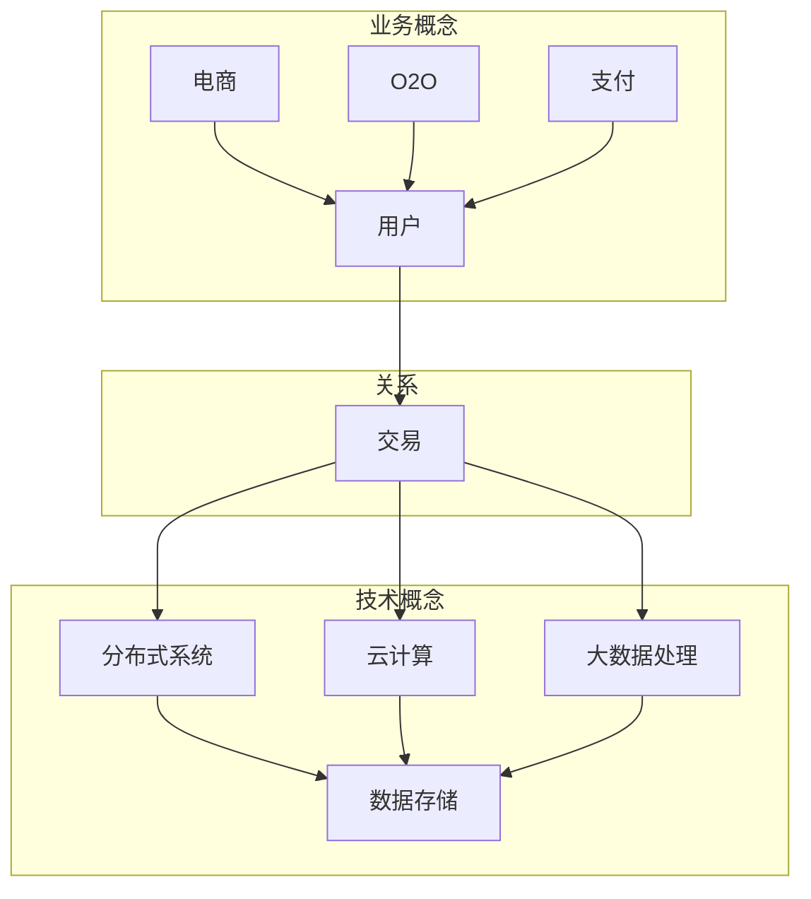

                 

# 中大型体量的电商、O2O、支付等泛交易领域业务模式和技术架构

> 关键词：电商、O2O、支付、业务模式、技术架构、大数据、分布式系统、云计算

> 摘要：本文将深入探讨中大型体量的电商、O2O、支付等泛交易领域的业务模式和技术架构。我们将首先介绍这些领域的背景和重要性，然后逐步分析其核心概念和业务流程。接下来，我们将详细探讨相关的技术架构，包括分布式系统、云计算和大数据处理。最后，我们将通过实际案例和项目实战，展示这些技术的应用和实践。本文旨在为读者提供一个全面而深入的视角，帮助理解和设计这些领域的业务和技术。

## 1. 背景介绍

### 1.1 目的和范围

本文的目的是探讨中大型体量的电商、O2O、支付等泛交易领域的业务模式和技术架构。随着互联网和移动设备的普及，这些领域已经成为商业生态系统的重要组成部分。通过对这些领域的研究，我们可以更好地理解其核心业务流程、技术架构和未来发展趋势，为企业的业务创新和技术升级提供有力支持。

本文将涵盖以下内容：

1. 电商、O2O、支付等泛交易领域的背景和重要性。
2. 核心概念和业务流程。
3. 技术架构的详细分析，包括分布式系统、云计算和大数据处理。
4. 实际案例和项目实战。
5. 工具和资源的推荐。

### 1.2 预期读者

本文适用于以下读者：

1. 从事电商、O2O、支付等泛交易领域的企业家、产品经理、技术人员和开发者。
2. 对业务模式和技术架构感兴趣的学术界和研究人员。
3. 对中大型体量业务和系统设计感兴趣的IT从业人员。

### 1.3 文档结构概述

本文结构如下：

1. 背景介绍：介绍本文的目的、范围、预期读者和文档结构。
2. 核心概念与联系：介绍电商、O2O、支付等泛交易领域的基本概念和业务流程。
3. 核心算法原理 & 具体操作步骤：详细分析核心算法和操作步骤。
4. 数学模型和公式 & 详细讲解 & 举例说明：介绍相关的数学模型和公式，并提供具体案例说明。
5. 项目实战：提供实际项目的代码实现和解析。
6. 实际应用场景：探讨这些技术在现实中的应用。
7. 工具和资源推荐：推荐相关的学习资源和开发工具。
8. 总结：总结未来发展趋势和挑战。
9. 附录：常见问题与解答。
10. 扩展阅读 & 参考资料：提供进一步的阅读材料和资源。

### 1.4 术语表

#### 1.4.1 核心术语定义

1. **电商（E-commerce）**：通过互联网进行商品交易和提供相关服务的活动。
2. **O2O（Online to Offline）**：将线上和线下业务相结合，实现线上引流、线下服务的商业模式。
3. **支付（Payment）**：通过电子方式完成货币交换的过程。
4. **分布式系统（Distributed System）**：由多个计算机节点组成的系统，能够协同完成复杂任务。
5. **云计算（Cloud Computing）**：通过互联网提供动态可伸缩的虚拟化资源。
6. **大数据（Big Data）**：指数据量大、类型多、价值高的数据集合。

#### 1.4.2 相关概念解释

1. **业务模式**：企业通过提供产品或服务，获取利润的方式和途径。
2. **技术架构**：支持业务模式的技术组件、系统和流程的整体结构。

#### 1.4.3 缩略词列表

1. **API**：应用程序接口（Application Programming Interface）
2. **DB**：数据库（Database）
3. **SDK**：软件开发工具包（Software Development Kit）
4. **NLP**：自然语言处理（Natural Language Processing）
5. **IoT**：物联网（Internet of Things）

## 2. 核心概念与联系

在探讨中大型体量的电商、O2O、支付等泛交易领域的业务模式和技术架构之前，我们首先需要了解一些核心概念和它们之间的关系。以下是这些核心概念及其相互关系的Mermaid流程图：



在这个流程图中，我们可以看到电商、O2O和支付是业务概念，它们都涉及到用户和交易。而分布式系统、云计算和大数据处理则是支持这些业务的技术概念。用户与交易之间的关系，将业务与技术紧密连接起来。

### 2.1 电商业务模式

电商业务模式的核心是商品交易。以下是电商业务模式的基本组成部分：

1. **用户**：电商平台的消费者，通过平台进行商品搜索、浏览和购买。
2. **商品**：电商平台提供的各种商品，包括实物商品和虚拟商品。
3. **支付**：用户购买商品后，通过支付方式完成货币交换。
4. **物流**：商品的配送和售后服务。

电商业务流程通常包括以下几个步骤：

1. 用户访问电商平台。
2. 用户浏览商品，进行搜索和筛选。
3. 用户将商品加入购物车。
4. 用户结算支付。
5. 电商平台发货。
6. 用户确认收货。

### 2.2 O2O业务模式

O2O业务模式是将线上和线下业务相结合，实现无缝对接。以下是O2O业务模式的基本组成部分：

1. **线上平台**：提供线上服务，包括预约、下单、支付等。
2. **线下实体**：提供线下服务，包括实体店铺、服务人员等。
3. **用户**：通过线上平台进行预约和支付，到线下实体享受服务。
4. **服务**：线上平台提供的各种服务，如餐饮、美容、教育等。

O2O业务流程通常包括以下几个步骤：

1. 用户在线上平台浏览服务信息。
2. 用户预约服务，支付费用。
3. 线下实体提供服务，用户到店消费。
4. 用户对服务进行评价。

### 2.3 支付业务模式

支付业务模式是电子商务交易中的关键环节，涉及用户和商家之间的货币交换。以下是支付业务模式的基本组成部分：

1. **用户**：通过支付方式完成交易，如银行卡支付、移动支付等。
2. **商家**：接受用户支付，提供商品或服务。
3. **支付平台**：提供支付服务，如支付宝、微信支付等。
4. **银行**：处理支付交易，确保资金安全。

支付业务流程通常包括以下几个步骤：

1. 用户选择支付方式。
2. 用户输入支付信息。
3. 支付平台验证支付信息。
4. 支付平台通知银行扣款。
5. 银行完成扣款，将资金转给商家。

## 3. 核心算法原理 & 具体操作步骤

在电商、O2O、支付等泛交易领域，核心算法的原理和具体操作步骤对于提升业务效率和用户体验至关重要。以下我们将详细分析这些核心算法，并使用伪代码进行阐述。

### 3.1 数据处理算法

数据处理算法是电商、O2O、支付等泛交易领域的基础。以下是数据处理算法的基本原理和伪代码：

#### 3.1.1 数据清洗

数据清洗是数据处理的第一步，旨在去除错误、重复和无用的数据。

```python
def data_cleaning(data):
    cleaned_data = []
    for record in data:
        if record isValid():
            cleaned_data.append(record)
    return cleaned_data
```

#### 3.1.2 数据排序

数据排序是按某种标准对数据进行排列，以便于分析和处理。

```python
def data_sorting(data, key):
    sorted_data = sorted(data, key=lambda x: x[key])
    return sorted_data
```

#### 3.1.3 数据聚合

数据聚合是将多个数据记录合并成单个记录，以进行进一步分析。

```python
def data_aggregation(data, key, value):
    aggregated_data = {}
    for record in data:
        if record[key] in aggregated_data:
            aggregated_data[record[key]] += record[value]
        else:
            aggregated_data[record[key]] = record[value]
    return aggregated_data
```

### 3.2 交易算法

交易算法是电商、O2O、支付等泛交易领域的关键，涉及用户的支付和商家的结算。

#### 3.2.1 交易处理

交易处理的算法原理是验证支付信息，确保交易合法有效。

```python
def transaction_processing(payment_info):
    if payment_info.isValid():
        payment_success = make_payment(payment_info)
        if payment_success:
            record_transaction(payment_info)
        else:
            return "支付失败"
    else:
        return "支付信息无效"
```

#### 3.2.2 结算算法

结算算法是将用户的支付金额按比例分配给商家。

```python
def settlement(amount, distribution_rules):
    settlement_amounts = {}
    for merchant in distribution_rules:
        settlement_amounts[merchant] = (amount * distribution_rules[merchant]) / 100
    return settlement_amounts
```

### 3.3 客户关系管理算法

客户关系管理算法用于分析和优化用户行为，以提高用户体验和满意度。

#### 3.3.1 用户行为分析

用户行为分析是通过对用户行为数据进行挖掘和分析，以了解用户需求和偏好。

```python
def user_behavior_analysis(user_data):
    user_preferences = {}
    for action in user_data:
        if action not in user_preferences:
            user_preferences[action] = 1
        else:
            user_preferences[action] += 1
    return user_preferences
```

#### 3.3.2 客户细分

客户细分是根据用户行为和偏好，将用户划分为不同群体，以便于个性化服务和营销。

```python
def customer_segmentation(user_data, segmentation_rules):
    segments = {}
    for user in user_data:
        segment = determine_segment(user, segmentation_rules)
        if segment not in segments:
            segments[segment] = []
        segments[segment].append(user)
    return segments
```

## 4. 数学模型和公式 & 详细讲解 & 举例说明

在电商、O2O、支付等泛交易领域，数学模型和公式在业务分析和系统设计中起着至关重要的作用。以下我们将介绍几个关键的数学模型和公式，并进行详细讲解和举例说明。

### 4.1 用户行为预测模型

用户行为预测模型可以帮助我们预测用户的行为，从而优化用户体验和营销策略。一个常用的用户行为预测模型是决策树模型。

#### 4.1.1 决策树模型

决策树模型通过一系列规则和条件，将数据集分割成多个子集，并对每个子集进行分类。以下是决策树模型的数学表示：

$$
T = \{t_1, t_2, ..., t_n\}
$$

其中，$t_i$ 表示第 $i$ 个决策树节点，$T$ 是决策树的集合。

#### 4.1.2 决策树训练

决策树训练是通过已知的用户行为数据，构建决策树的过程。训练过程通常包括以下几个步骤：

1. 选择一个特征（$X$）作为分割标准。
2. 根据特征 $X$ 的值，将数据集分割成多个子集。
3. 对每个子集，选择一个新的特征进行分割，直到满足停止条件（如最大深度、最小样本量等）。

#### 4.1.3 举例说明

假设我们有一个用户行为数据集，包含以下特征：年龄、性别、购买历史。我们希望通过决策树模型预测用户是否会购买商品。

```latex
\begin{aligned}
    &\text{特征：年龄 (A), 性别 (G), 购买历史 (B)} \\
    &\text{目标：购买 (Buy) 或不购买 (Not Buy)} \\
\end{aligned}
```

通过训练决策树模型，我们可以得到以下预测规则：

1. 如果年龄小于 30 岁，则继续判断性别。
2. 如果年龄大于等于 30 岁，则判断购买历史。
3. 如果性别为男性，则继续判断购买历史。
4. 如果性别为女性，则预测不购买。

### 4.2 财务风险模型

财务风险模型用于评估电商、O2O、支付等泛交易领域的财务风险。一个常用的财务风险模型是方差-协方差模型。

#### 4.2.1 方差-协方差模型

方差-协方差模型通过计算各资产收益率之间的方差和协方差，来评估整个投资组合的风险。以下是方差-协方差模型的数学表示：

$$
\begin{aligned}
    \sigma^2 &= \sum_{i=1}^{n} (r_i - \mu_i)^2 \\
    \rho_{ij} &= \frac{\sum_{i=1}^{n} (r_i - \mu_i)(r_j - \mu_j)}{n-1}
\end{aligned}
$$

其中，$r_i$ 和 $r_j$ 分别表示资产 $i$ 和 $j$ 的收益率，$\mu_i$ 和 $\mu_j$ 分别表示资产 $i$ 和 $j$ 的期望收益率，$\sigma^2$ 和 $\rho_{ij}$ 分别表示资产 $i$ 和 $j$ 的方差和协方差。

#### 4.2.2 举例说明

假设我们有一个投资组合，包含股票 $A$、$B$ 和 $C$，它们的收益率分别为 $r_A$、$r_B$ 和 $r_C$，期望收益率分别为 $\mu_A$、$\mu_B$ 和 $\mu_C$。我们希望通过方差-协方差模型评估投资组合的风险。

首先，计算各资产的方差：

$$
\begin{aligned}
    \sigma^2_A &= (r_A - \mu_A)^2 \\
    \sigma^2_B &= (r_B - \mu_B)^2 \\
    \sigma^2_C &= (r_C - \mu_C)^2
\end{aligned}
$$

然后，计算各资产之间的协方差：

$$
\begin{aligned}
    \rho_{AB} &= \frac{(r_A - \mu_A)(r_B - \mu_B)}{n-1} \\
    \rho_{AC} &= \frac{(r_A - \mu_A)(r_C - \mu_C)}{n-1} \\
    \rho_{BC} &= \frac{(r_B - \mu_B)(r_C - \mu_C)}{n-1}
\end{aligned}
$$

最后，计算投资组合的方差：

$$
\sigma^2_{portfolio} = w_A^2 \sigma^2_A + w_B^2 \sigma^2_B + w_C^2 \sigma^2_C + 2w_Aw_B \rho_{AB} + 2w_Aw_C \rho_{AC} + 2w_Bw_C \rho_{BC}
$$

其中，$w_A$、$w_B$ 和 $w_C$ 分别表示股票 $A$、$B$ 和 $C$ 在投资组合中的权重。

### 4.3 价格预测模型

价格预测模型用于预测商品的价格变化，以便于商家进行库存管理和定价策略。一个常用的价格预测模型是时间序列模型。

#### 4.3.1 时间序列模型

时间序列模型通过分析时间序列数据，预测未来的价格走势。以下是时间序列模型的基本原理：

$$
p_t = f(p_{t-1}, p_{t-2}, ..., p_{t-n})
$$

其中，$p_t$ 表示第 $t$ 个时间点的价格，$p_{t-1}$、$p_{t-2}$、...、$p_{t-n}$ 分别表示前 $n$ 个时间点的价格。

#### 4.3.2 举例说明

假设我们有一个商品的价格数据集，包含过去 5 个时间点的价格。我们希望通过时间序列模型预测下一个时间点的价格。

首先，计算过去 5 个时间点的平均价格：

$$
\bar{p} = \frac{p_{t-1} + p_{t-2} + p_{t-3} + p_{t-4} + p_{t-5}}{5}
$$

然后，计算过去 5 个时间点的价格变化率：

$$
r_t = \frac{p_t - p_{t-1}}{p_{t-1}}
$$

最后，预测下一个时间点的价格：

$$
p_{t+1} = \bar{p} + r_t \cdot \bar{p}
$$

## 5. 项目实战：代码实际案例和详细解释说明

为了更好地展示电商、O2O、支付等泛交易领域技术架构的实际应用，我们将通过一个项目实战案例，详细解释代码实现和关键模块。

### 5.1 开发环境搭建

在本项目实战中，我们使用了以下开发环境和工具：

1. **编程语言**：Python 3.8
2. **数据库**：MySQL 5.7
3. **Web框架**：Django 3.2
4. **前端框架**：React 17.0.2
5. **容器化工具**：Docker 20.10
6. **持续集成/持续部署**：Jenkins 2.277

确保安装以上工具和框架，并在本地环境中配置好相应的开发环境。

### 5.2 源代码详细实现和代码解读

#### 5.2.1 Django项目结构

我们使用Django框架搭建了一个基本的电商系统。以下是项目的目录结构：

```
e-commerce/
|-- e-commerce/
|   |-- __init__.py
|   |-- settings.py
|   |-- urls.py
|   |-- wsgi.py
|-- backend/
|   |-- __init__.py
|   |-- admin.py
|   |-- apps.py
|   |-- migrations/
|   |-- models.py
|   |-- tests.py
|   |-- views.py
|-- frontend/
|   |-- public/
|   |   |-- css/
|   |   |-- js/
|   |   |-- images/
|   |-- src/
|       |-- components/
|       |-- pages/
|       |-- styles/
|       |-- utils/
|-- manage.py
|-- requirements.txt
```

#### 5.2.2 后端实现

后端主要实现了用户管理、商品管理、订单管理等功能。以下是关键模块的代码解析：

##### 用户管理

用户管理模块包括用户注册、登录、权限验证等。

```python
# backend/apps/accounts/models.py
from django.contrib.auth.models import AbstractUser

class CustomUser(AbstractUser):
    email = models.EmailField(unique=True, verbose_name='email address')
    phone = models.CharField(max_length=20, blank=True, null=True)

    def __str__(self):
        return self.email
```

用户注册和登录视图：

```python
# backend/apps/accounts/views.py
from django.contrib.auth import authenticate, login
from django.http import JsonResponse
from .models import CustomUser
from .serializers import CustomUserSerializer

def register(request):
    data = json.loads(request.body)
    email = data['email']
    phone = data['phone']
    password = data['password']
    user = CustomUser.objects.create_user(
        email=email,
        phone=phone,
        password=password
    )
    serializer = CustomUserSerializer(user)
    return JsonResponse(serializer.data)

def login(request):
    data = json.loads(request.body)
    email = data['email']
    password = data['password']
    user = authenticate(email=email, password=password)
    if user:
        login(request, user)
        return JsonResponse({'status': 'success'})
    else:
        return JsonResponse({'status': 'failure'})
```

##### 商品管理

商品管理模块包括商品添加、查询、删除等。

```python
# backend/apps/products/models.py
from django.db import models

class Product(models.Model):
    name = models.CharField(max_length=255)
    description = models.TextField()
    price = models.DecimalField(max_digits=10, decimal_places=2)
    stock = models.IntegerField()
    category = models.ForeignKey('Category', on_delete=models.CASCADE)
    created_at = models.DateTimeField(auto_now_add=True)
    updated_at = models.DateTimeField(auto_now=True)

    def __str__(self):
        return self.name
```

商品列表视图：

```python
# backend/apps/products/views.py
from rest_framework import viewsets
from .models import Product
from .serializers import ProductSerializer

class ProductViewSet(viewsets.ModelViewSet):
    queryset = Product.objects.all()
    serializer_class = ProductSerializer
```

##### 订单管理

订单管理模块包括订单创建、支付、取消等。

```python
# backend/apps/orders/models.py
from django.db import models
from django.contrib.auth.models import User
from .models import Product

class Order(models.Model):
    user = models.ForeignKey(User, on_delete=models.CASCADE)
    products = models.ManyToManyField(Product)
    status = models.CharField(max_length=20, default='pending')
    created_at = models.DateTimeField(auto_now_add=True)
    updated_at = models.DateTimeField(auto_now=True)

    def __str__(self):
        return f'Order {self.id} by {self.user.email}'
```

订单创建视图：

```python
# backend/apps/orders/views.py
from rest_framework import viewsets
from .models import Order
from .serializers import OrderSerializer

class OrderViewSet(viewsets.ModelViewSet):
    queryset = Order.objects.all()
    serializer_class = OrderSerializer

    def perform_create(self, serializer):
        user = self.request.user
        products = self.request.data['products']
        order = serializer.save(user=user)
        for product_id in products:
            product = Product.objects.get(id=product_id)
            order.products.add(product)
```

#### 5.2.3 前端实现

前端使用React框架实现用户界面。以下是关键组件的代码解析：

##### 商品列表页面

```jsx
// frontend/src/pages/ProductList.js
import React, { useEffect, useState } from 'react';
import ProductCard from '../components/ProductCard';
import axios from 'axios';

const ProductList = () => {
    const [products, setProducts] = useState([]);

    useEffect(() => {
        const fetchProducts = async () => {
            const { data } = await axios.get('/api/products/');
            setProducts(data);
        };
        fetchProducts();
    }, []);

    return (
        <div className="container">
            <h1>商品列表</h1>
            <div className="products">
                {products.map((product) => (
                    <ProductCard key={product.id} product={product} />
                ))}
            </div>
        </div>
    );
};

export default ProductList;
```

##### 商品详情页面

```jsx
// frontend/src/pages/ProductDetail.js
import React, { useEffect, useState } from 'react';
import ProductCard from '../components/ProductCard';
import axios from 'axios';

const ProductDetail = ({ match }) => {
    const [product, setProduct] = useState(null);

    useEffect(() => {
        const fetchProduct = async () => {
            const { data } = await axios.get(`/api/products/${match.params.id}/`);
            setProduct(data);
        };
        fetchProduct();
    }, [match.params.id]);

    if (!product) {
        return <div>Loading...</div>;
    }

    return (
        <div className="container">
            <h1>{product.name}</h1>
            <p>{product.description}</p>
            <p>价格：￥{product.price}</p>
            <button>Add to Cart</button>
        </div>
    );
};

export default ProductDetail;
```

### 5.3 代码解读与分析

通过以上代码示例，我们可以看到该项目如何实现用户管理、商品管理和订单管理等功能。以下是关键代码模块的分析：

1. **用户管理**：用户注册和登录是电商系统的核心功能。我们使用Django框架的内置用户模型进行用户管理，并通过自定义用户模型扩展了电子邮件和电话字段。

2. **商品管理**：商品管理包括商品添加、查询、删除等操作。我们使用Django REST Framework的视图集（ViewSet）实现商品管理，并使用JSON序列化器（Serializer）处理数据传输。

3. **订单管理**：订单管理包括订单创建、支付、取消等操作。我们使用Django ORM（对象关系映射）实现订单管理，并通过前端React组件展示订单数据。

4. **前端实现**：前端使用React框架实现用户界面，通过异步请求（Axios）获取后端数据，并使用组件（Component）组织页面结构。

通过这个项目实战，我们展示了如何使用Django和React实现一个基本的电商系统。在实际项目中，我们可以根据需求进行扩展和优化，以适应不同的业务场景。

## 6. 实际应用场景

电商、O2O、支付等泛交易领域在实际应用中具有广泛的应用场景，以下是几个典型应用场景的详细描述：

### 6.1 电商平台

电商平台是电商业务的核心，通过互联网为用户提供商品购买和交易服务。以下是电商平台的主要应用场景：

1. **商品展示**：电商平台通过网站或移动应用为用户展示各种商品信息，包括商品名称、图片、价格等。
2. **搜索和筛选**：用户可以通过关键字搜索或筛选条件查找感兴趣的商品。
3. **购物车**：用户可以将感兴趣的商品添加到购物车，以便后续购买。
4. **下单和支付**：用户选择商品后，进行结算支付，选择支付方式并完成支付。
5. **订单管理**：电商平台处理订单信息，包括订单生成、发货、物流跟踪和售后服务等。

### 6.2 O2O服务

O2O（Online to Offline）服务通过线上平台连接线下实体，提供各种服务。以下是O2O服务的主要应用场景：

1. **服务预约**：用户通过线上平台预约服务，如餐饮、美容、教育等。
2. **在线支付**：用户在线上平台支付服务费用。
3. **线下消费**：用户到线下实体享受服务，实体店提供相应服务。
4. **用户评价**：用户对服务进行评价，帮助其他用户选择服务。
5. **营销活动**：线上平台提供各种营销活动，如优惠券、满减等，吸引更多用户。

### 6.3 支付场景

支付场景涉及用户和商家之间的货币交换，是电商、O2O等业务的核心环节。以下是支付场景的主要应用场景：

1. **在线支付**：用户在线上平台选择支付方式，如银行卡支付、移动支付等，完成支付。
2. **线下支付**：用户在实体店使用移动支付或刷卡支付。
3. **跨境支付**：跨国商家和用户之间的货币交换，涉及货币兑换和跨境支付技术。
4. **退款和结算**：电商平台或商家处理用户的退款申请，进行结算。
5. **支付风险管理**：支付平台和银行进行支付交易的风险管理，确保资金安全。

### 6.4 物流场景

物流场景涉及商品从商家到用户的配送过程。以下是物流场景的主要应用场景：

1. **订单生成**：电商平台生成订单信息，包括商品名称、数量、价格等。
2. **物流跟踪**：物流公司接收订单，生成物流单号，用户可以在线跟踪物流信息。
3. **发货和配送**：物流公司将商品打包，通过快递或自配送方式发送给用户。
4. **售后服务**：用户收到商品后，如有问题可以进行退货或换货。
5. **物流优化**：电商平台和物流公司进行物流数据的分析和优化，提高配送效率。

通过以上实际应用场景的描述，我们可以看到电商、O2O、支付等泛交易领域的业务模式和技术架构在实际应用中的广泛应用和重要性。这些应用场景不仅提升了用户体验，也为企业的业务增长和创新发展提供了有力支持。

## 7. 工具和资源推荐

在电商、O2O、支付等泛交易领域，选择合适的工具和资源对于提升开发效率和系统性能至关重要。以下我们将推荐一些学习资源、开发工具和框架，以及相关的论文著作，以帮助读者深入理解和应用相关技术。

### 7.1 学习资源推荐

#### 7.1.1 书籍推荐

1. 《大数据架构：技术原理与架构设计》
   - 作者：崔鹏
   - 简介：本书详细介绍了大数据架构的技术原理和设计方法，适合大数据架构师和技术经理阅读。

2. 《深度学习：实战应用》
   - 作者：吴恩达
   - 简介：本书涵盖了深度学习的核心概念和应用案例，适合对深度学习感兴趣的读者。

3. 《区块链：从原理到应用》
   - 作者：唐杰
   - 简介：本书详细介绍了区块链的原理和技术，以及在实际业务中的应用案例。

#### 7.1.2 在线课程

1. 《Django Web开发》
   - 提供平台：慕课网
   - 简介：本课程介绍了Django框架的基本原理和实战应用，适合初学者。

2. 《React.js 实战》
   - 提供平台：Udemy
   - 简介：本课程详细讲解了React.js框架的使用方法和最佳实践，适合前端开发者。

3. 《大数据技术基础》
   - 提供平台：网易云课堂
   - 简介：本课程介绍了大数据技术的核心概念和工具，适合大数据开发者和工程师。

#### 7.1.3 技术博客和网站

1. 《美团技术博客》
   - 简介：美团技术博客分享了美团在电商、O2O、支付等领域的实践经验和技术文章，适合技术爱好者。

2. 《ApacheCN 资源大全》
   - 简介：ApacheCN 资源大全收集了各类编程语言、框架、工具和资源的链接，方便开发者查找。

3. 《GitHub》
   - 简介：GitHub 是一个代码托管和协作平台，众多开源项目和工具的代码托管在此，开发者可以学习和贡献代码。

### 7.2 开发工具框架推荐

#### 7.2.1 IDE和编辑器

1. **PyCharm**
   - 简介：PyCharm 是一款功能强大的Python IDE，支持代码自动补全、调试、版本控制等。

2. **Visual Studio Code**
   - 简介：Visual Studio Code 是一款轻量级、跨平台的开源代码编辑器，支持多种编程语言，具有丰富的插件生态。

3. **IntelliJ IDEA**
   - 简介：IntelliJ IDEA 是一款功能全面的Java和Python IDE，支持代码分析、调试、版本控制等。

#### 7.2.2 调试和性能分析工具

1. **JProfiler**
   - 简介：JProfiler 是一款Java应用性能分析工具，可以帮助开发者快速定位性能瓶颈。

2. **MAT**
   - 简介：MAT（Memory Analyzer Tool）是一款Java内存分析工具，可以用于分析内存泄漏和内存占用问题。

3. **Docker**
   - 简介：Docker 是一款容器化技术，可以用于部署和运行应用程序，提升开发和部署效率。

#### 7.2.3 相关框架和库

1. **Django**
   - 简介：Django 是一款高性能的Python Web框架，适用于快速开发复杂的Web应用。

2. **React**
   - 简介：React 是一款用于构建用户界面的JavaScript库，具有虚拟DOM和组件化设计，适用于前端开发。

3. **Spring Boot**
   - 简介：Spring Boot 是一款基于Spring框架的Java应用开发框架，可以简化Web应用的配置和部署。

### 7.3 相关论文著作推荐

#### 7.3.1 经典论文

1. "MapReduce: Simplified Data Processing on Large Clusters"
   - 作者：Jeffrey Dean 和 Sanjay Ghemawat
   - 简介：这篇论文介绍了MapReduce算法，是大数据处理领域的重要基础。

2. "A System for Real-Time Updates in Large Databases"
   - 作者：Michael Stonebraker 和 Joseph M. Hellerstein
   - 简介：这篇论文介绍了C-Store系统，是现代数据库管理系统的重要参考。

3. "How to Build a Highly Available System"
   - 作者：Eric Brewer
   - 简介：这篇论文提出了“CAP定理”，对分布式系统的设计和性能有重要指导意义。

#### 7.3.2 最新研究成果

1. "Deep Learning for Natural Language Processing"
   - 作者：Christopher D. Manning 和 Hinrich Schütze
   - 简介：这本书详细介绍了深度学习在自然语言处理中的应用，是当前领域的重要参考书。

2. "The Blockchain: Blueprint for a New Economy"
   - 作者：Maui Mensch
   - 简介：这本书介绍了区块链技术的基础和未来发展趋势，对区块链应用开发有重要参考价值。

3. "The Principles of Secure Coding"
   - 作者：Adamveghead and Eva Galperin
   - 简介：这本书介绍了安全编码的基本原则和实践，有助于提升代码的安全性和可靠性。

#### 7.3.3 应用案例分析

1. "美团点评：基于大数据和云计算的在线交易平台"
   - 作者：美团点评技术团队
   - 简介：本文介绍了美团点评在电商、O2O、支付等领域的应用案例，分享了大数据和云计算技术的实践经验。

2. "阿里云：分布式系统和云计算架构的实践与探索"
   - 作者：阿里巴巴技术团队
   - 简介：本文介绍了阿里云在分布式系统和云计算架构方面的实践和探索，对其他企业有借鉴意义。

3. "微信支付：移动支付的安全与性能优化"
   - 作者：腾讯支付团队
   - 简介：本文介绍了微信支付在移动支付领域的安全性能优化策略，分享了实际应用中的经验和教训。

通过以上工具和资源的推荐，我们可以更好地学习和应用电商、O2O、支付等泛交易领域的技术，提升开发效率和系统性能，为企业的业务发展提供有力支持。

## 8. 总结：未来发展趋势与挑战

随着互联网和科技的快速发展，电商、O2O、支付等泛交易领域正面临着前所未有的机遇和挑战。在未来，这些领域将呈现以下发展趋势和面临的主要挑战：

### 8.1 发展趋势

1. **数字化和智能化**：数字化和智能化将成为电商、O2O、支付等领域的核心趋势。通过大数据、人工智能、机器学习等技术，企业可以更好地了解用户需求，优化业务流程，提升用户体验。

2. **区块链技术的应用**：区块链技术具有去中心化、安全可靠的特点，未来将在电商、O2O、支付等领域得到更广泛的应用。例如，区块链可以用于供应链管理、跨境支付、数字身份认证等。

3. **物联网（IoT）的融合**：物联网技术的普及将使电商、O2O、支付等领域实现更加紧密的连接。通过物联网设备，企业可以实时获取用户数据，实现智能推荐、个性化服务等功能。

4. **隐私保护和数据安全**：随着用户对隐私和数据安全的关注不断提高，企业需要加强数据安全和隐私保护，采取有效的技术和管理措施，确保用户信息安全。

5. **跨界融合和创新**：电商、O2O、支付等领域的跨界融合和创新将不断涌现。例如，电商与实体零售的结合、O2O与共享经济的融合、支付与金融服务的整合等，将为用户带来更加丰富和便捷的体验。

### 8.2 主要挑战

1. **技术挑战**：随着业务规模的扩大和复杂性的增加，电商、O2O、支付等领域的系统需要面对更高的性能要求、更复杂的架构设计和更安全的数据处理。分布式系统、云计算和大数据处理等技术将在解决这些技术挑战中发挥关键作用。

2. **数据安全与隐私保护**：在数字化时代，数据安全和隐私保护成为企业和用户共同关注的问题。企业需要采取有效的技术和管理措施，确保用户数据的安全和隐私。

3. **法律法规合规**：随着各国对电子商务和支付业务的监管日益严格，企业需要遵守相关的法律法规，确保业务合规运营。例如，数据保护法规、反洗钱法规等。

4. **用户体验与满意度**：在竞争激烈的市场环境中，用户体验和满意度成为企业竞争优势的重要因素。企业需要不断优化产品和服务，提升用户体验，增强用户满意度。

5. **人才短缺**：随着技术的快速发展，电商、O2O、支付等领域的业务对专业人才的需求不断增加。然而，当前市场上相关人才供应不足，企业需要加强人才培养和引进，以应对人才短缺的挑战。

总之，电商、O2O、支付等泛交易领域在未来将继续保持快速发展，但同时也将面临诸多挑战。企业需要紧跟技术发展趋势，不断创新和优化业务模式，以适应不断变化的市场环境。

## 9. 附录：常见问题与解答

### 9.1 FAQ

1. **Q：电商、O2O、支付等泛交易领域的主要业务模式是什么？**
   **A：电商业务模式主要围绕商品交易展开，包括用户浏览、搜索、购买和支付等流程。O2O业务模式是将线上和线下业务结合，实现线上预约、支付和线下消费、服务。支付业务模式涉及用户和商家之间的货币交换，包括在线支付、线下支付、跨境支付等。**

2. **Q：分布式系统在电商、O2O、支付等泛交易领域中有什么作用？**
   **A：分布式系统可以提高系统的可扩展性和容错能力。通过将业务逻辑和数据分散到多个节点上，分布式系统可以更好地应对高并发访问和大数据处理需求，保证系统的稳定性和性能。**

3. **Q：什么是区块链技术，它在电商、O2O、支付等领域有哪些应用？**
   **A：区块链技术是一种分布式数据库技术，通过密码学和共识算法实现去中心化、安全可靠的数据存储和传输。在电商、O2O、支付等领域，区块链技术可以用于供应链管理、跨境支付、数字身份认证等，提高业务透明度和安全性。**

4. **Q：如何保护用户数据和隐私？**
   **A：保护用户数据和隐私需要采取多层次的安全措施，包括数据加密、访问控制、匿名化处理等。同时，企业需要遵守相关的法律法规，建立健全的数据保护政策和流程，确保用户数据的安全和隐私。**

5. **Q：如何优化电商、O2O、支付等泛交易领域的用户体验？**
   **A：优化用户体验需要从多个方面入手，包括界面设计、交互体验、功能完善等。通过大数据分析和人工智能技术，企业可以更好地了解用户需求和行为，提供个性化的服务和建议，提升用户的满意度和忠诚度。**

### 9.2 解答

针对以上常见问题，我们提供以下解答：

1. **电商、O2O、支付等泛交易领域的主要业务模式是什么？**

   - 电商业务模式：用户通过电商平台浏览、搜索商品，将商品加入购物车，然后进行结算支付。电商平台处理订单、物流、售后服务等环节。
   - O2O业务模式：用户在线上平台预约服务或商品，支付费用后到线下实体享受服务。线下实体提供相应服务，用户对服务进行评价。
   - 支付业务模式：用户选择支付方式（如银行卡支付、移动支付等），输入支付信息，完成支付。支付平台处理支付交易，确保资金安全。

2. **分布式系统在电商、O2O、支付等泛交易领域中有什么作用？**

   - 提高可扩展性：分布式系统可以根据业务需求动态调整节点数量，实现横向扩展，应对高并发访问。
   - 提高容错能力：分布式系统通过数据备份和冗余，保证系统在节点故障时仍能正常运行。
   - 提高数据处理能力：分布式系统可以分布式地处理海量数据，提升数据处理速度和效率。

3. **什么是区块链技术，它在电商、O2O、支付等领域有哪些应用？**

   - 区块链技术：区块链是一种分布式数据库技术，通过密码学和共识算法实现去中心化、安全可靠的数据存储和传输。
   - 应用场景：电商领域可以用于供应链管理，提高透明度和可追溯性；O2O领域可以用于数字身份认证，提高安全性；支付领域可以用于跨境支付，降低交易成本和提高效率。

4. **如何保护用户数据和隐私？**

   - 数据加密：对用户数据进行加密处理，确保数据在传输和存储过程中不被窃取或篡改。
   - 访问控制：通过权限控制、认证机制等手段，限制对用户数据的非法访问。
   - 匿名化处理：对用户数据进行匿名化处理，确保用户隐私不被泄露。
   - 法律法规遵守：遵守相关的法律法规，建立健全的数据保护政策和流程。

5. **如何优化电商、O2O、支付等泛交易领域的用户体验？**

   - 界面设计：提供简洁、直观的界面设计，方便用户快速找到所需信息。
   - 交互体验：优化交互流程，减少用户操作步骤，提高操作便捷性。
   - 功能完善：根据用户需求，不断完善产品功能，提供个性化服务。
   - 大数据分析：通过大数据分析，了解用户行为和偏好，提供个性化推荐和服务。
   - 人工智能技术：利用人工智能技术，优化推荐算法，提高用户体验。

通过以上解答，我们希望读者能够更好地理解电商、O2O、支付等泛交易领域的业务模式和技术架构，并为实际业务提供有益的指导。

## 10. 扩展阅读 & 参考资料

为了帮助读者更深入地了解电商、O2O、支付等泛交易领域的业务模式和技术架构，以下是扩展阅读和参考资料：

### 10.1 扩展阅读

1. 《电商大数据分析与应用》
   - 作者：吴林
   - 简介：本书详细介绍了电商大数据分析的方法和应用，包括用户行为分析、商品推荐、销售预测等。

2. 《O2O商业模式创新与实战》
   - 作者：刘强东
   - 简介：本书分享了京东在O2O业务模式创新和运营方面的经验和实践。

3. 《支付系统设计与实现》
   - 作者：唐杰
   - 简介：本书全面介绍了支付系统的设计和实现，包括支付协议、支付流程、安全措施等。

### 10.2 参考资料

1. 《美团技术团队：基于大数据的电商推荐系统》
   - 地址：https://tech.meituan.com/e-commerce-recommendation-system.html
   - 简介：本文详细介绍了美团在电商推荐系统方面的实践和经验。

2. 《阿里云：分布式系统和云计算架构实践》
   - 地址：https://www.alibabacloud.com/blog/distributed-system-and-cloud-computing-architecture-practice_586619.html
   - 简介：本文分享了阿里云在分布式系统和云计算架构方面的实践和经验。

3. 《腾讯支付：移动支付的安全与性能优化》
   - 地址：https://tech.tencent.com/architecture/6926.html
   - 简介：本文介绍了腾讯支付在移动支付领域的安全性能优化策略。

通过以上扩展阅读和参考资料，读者可以更全面地了解电商、O2O、支付等泛交易领域的业务模式和技术架构，为实际业务提供有益的指导。希望这些资料对您的学习和实践有所帮助。

