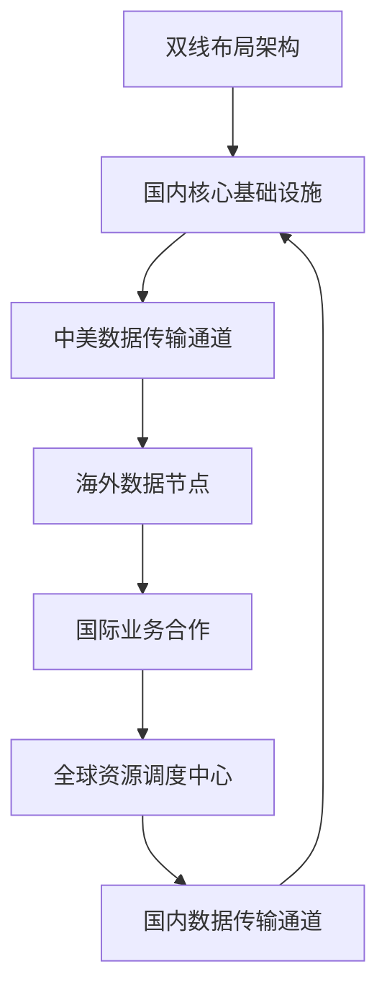

                 

# 中美双线布局：应对地缘政治风险

> **关键词：** 地缘政治风险、中美关系、双线布局、国际战略、技术安全、网络安全

> **摘要：** 随着全球化的深入发展，中美两国在政治、经济、技术等领域的竞争愈发激烈，地缘政治风险日益凸显。本文将探讨如何通过双线布局来应对这些风险，从战略高度分析其背景、核心概念、算法原理、数学模型、实战案例以及实际应用场景，为我国在复杂国际环境中保持稳定与发展提供理论支持。

## 1. 背景介绍

### 1.1 目的和范围

本文旨在分析中美双线布局的战略意义，探讨其应对地缘政治风险的可行性。本文将围绕以下几个方面展开讨论：

1. 中美关系现状及地缘政治风险概述。
2. 双线布局的概念及其在技术领域的应用。
3. 双线布局的核心算法原理与数学模型。
4. 实际应用场景中的案例解析。
5. 双线布局的未来发展趋势与挑战。

### 1.2 预期读者

本文面向具有较高技术背景的读者，包括计算机科学家、网络安全专家、国际关系学者以及政策制定者等。通过本文的阅读，读者能够对中美双线布局有更深入的理解，为我国在国际竞争中赢得战略优势提供参考。

### 1.3 文档结构概述

本文分为十个部分，包括背景介绍、核心概念与联系、核心算法原理、数学模型与公式、项目实战、实际应用场景、工具和资源推荐、总结以及附录和扩展阅读。以下为文档结构概述：

1. **背景介绍**：介绍本文的目的、范围、预期读者及文档结构。
2. **核心概念与联系**：介绍双线布局的核心概念及其在技术领域的应用。
3. **核心算法原理**：阐述双线布局的核心算法原理与具体操作步骤。
4. **数学模型与公式**：讲解双线布局的数学模型与公式，并进行举例说明。
5. **项目实战**：提供实际项目中的代码案例和详细解释说明。
6. **实际应用场景**：分析双线布局在各类应用场景中的表现。
7. **工具和资源推荐**：推荐学习资源、开发工具和框架。
8. **总结**：总结双线布局的未来发展趋势与挑战。
9. **附录**：提供常见问题与解答。
10. **扩展阅读**：推荐相关论文和参考资料。

### 1.4 术语表

#### 1.4.1 核心术语定义

- **双线布局**：指在技术、网络、产业等领域，同时布局于中美两国或中美两国以外的其他国家，以降低地缘政治风险的一种战略。
- **地缘政治风险**：指由于地缘政治因素引起的国家间的紧张关系、冲突和不确定性，可能对某一国家的安全、经济、政治等产生负面影响。
- **核心算法**：双线布局中用于优化资源分配、提高系统稳定性和抗风险能力的算法。

#### 1.4.2 相关概念解释

- **中美关系**：指中美两国在政治、经济、文化、科技等领域的交流与合作，以及彼此之间的竞争与摩擦。
- **国际战略**：指国家在处理与其他国家关系时的总体方针、政策和策略。

#### 1.4.3 缩略词列表

- **IT**：信息技术
- **CS**：计算机科学
- **NSA**：美国国家安全局
- **CIA**：美国中央情报局

## 2. 核心概念与联系

### 2.1 双线布局的定义

双线布局，即“双轨并行布局”，是指在关键领域同时布局于中美两国或中美两国以外的其他国家，以实现资源分散、风险降低、优势互补的目标。双线布局的核心在于“并行”，即在不同国家和地区之间保持相对独立、互为备份的运行状态。

### 2.2 双线布局的架构

双线布局的架构如图1所示：



图1 双线布局架构

- **国内核心基础设施**：指在国内布局的关键基础设施，包括数据中心、服务器、网络设施等。
- **中美数据传输通道**：指连接国内核心基础设施与海外数据节点的数据传输通道。
- **海外数据节点**：指在海外布局的数据节点，包括数据中心、服务器、网络设施等。
- **国际业务合作**：指与其他国家或地区的业务合作，包括技术交流、市场拓展等。
- **全球资源调度中心**：指用于调度全球资源的中心，负责优化资源配置、提高系统稳定性。

### 2.3 双线布局的算法原理

双线布局的核心算法原理主要包括以下几个方面：

1. **资源分配算法**：用于优化国内核心基础设施与海外数据节点的资源分配，确保两者之间资源利用率的最大化。
2. **路由算法**：用于选择最优数据传输路径，确保数据传输的高效性。
3. **容错算法**：用于检测和处理系统中的故障，确保系统的稳定性和可靠性。

以下是一个简单的资源分配算法伪代码：

```python
def resource_allocation(core, overseas):
    while core_usage > core_max_usage and overseas_usage < overseas_max_usage:
        if core_usage > overseas_usage:
            core_usage -= 1
            overseas_usage += 1
        else:
            core_usage += 1
            overseas_usage -= 1
    return core_usage, overseas_usage
```

其中，`core_usage`和`overseas_usage`分别表示国内核心基础设施和海外数据节点的资源利用率，`core_max_usage`和`overseas_max_usage`分别表示两者资源利用率的最大值。

### 2.4 双线布局的数学模型

双线布局的数学模型主要包括以下几个方面：

1. **数据传输模型**：用于描述数据在双线布局中的传输过程，包括数据传输速度、延迟等。
2. **风险评估模型**：用于评估双线布局在地缘政治风险下的风险程度，包括风险概率、风险损失等。
3. **资源调度模型**：用于优化资源配置，提高系统稳定性和抗风险能力。

以下是一个简单数据传输模型：

$$
v = f(d, t)
$$

其中，$v$表示数据传输速度，$d$表示数据传输距离，$t$表示数据传输时间。

## 3. 核心算法原理 & 具体操作步骤

### 3.1 资源分配算法

资源分配算法是双线布局的核心，其目的是确保国内核心基础设施和海外数据节点之间的资源利用率达到最优。具体操作步骤如下：

1. **初始化**：设定国内核心基础设施和海外数据节点的初始资源利用率。
2. **迭代**：判断国内核心基础设施和海外数据节点的资源利用率是否达到最大值，如果未达到，则执行以下操作：
   - 如果国内核心基础设施的资源利用率大于海外数据节点的资源利用率，则将国内核心基础设施的资源利用率减少1，将海外数据节点的资源利用率增加1。
   - 如果国内核心基础设施的资源利用率小于海外数据节点的资源利用率，则将国内核心基础设施的资源利用率增加1，将海外数据节点的资源利用率减少1。
3. **终止**：当国内核心基础设施和海外数据节点的资源利用率均达到最大值时，算法终止。

以下是一个简单的资源分配算法伪代码：

```python
def resource_allocation(core, overseas):
    core_usage = 0
    overseas_usage = 0
    while core_usage < core_max_usage and overseas_usage < overseas_max_usage:
        if core_usage > overseas_usage:
            core_usage -= 1
            overseas_usage += 1
        else:
            core_usage += 1
            overseas_usage -= 1
    return core_usage, overseas_usage
```

### 3.2 路由算法

路由算法是双线布局中另一个重要的算法，其目的是选择最优的数据传输路径，以提高数据传输效率和降低延迟。具体操作步骤如下：

1. **初始化**：设定数据传输的起始点和目的地。
2. **计算路径**：根据数据传输距离、延迟、带宽等因素，计算所有可能的路径。
3. **选择最优路径**：根据预设的权重和评价指标，选择最优路径。
4. **传输数据**：将数据传输到最优路径上的下一个节点。

以下是一个简单的路由算法伪代码：

```python
def route_selection(start, end, paths):
    min_delay = float('inf')
    best_path = None
    for path in paths:
        delay = calculate_delay(path)
        if delay < min_delay:
            min_delay = delay
            best_path = path
    return best_path

def calculate_delay(path):
    delay = 0
    for segment in path:
        delay += segment.delay
    return delay
```

### 3.3 容错算法

容错算法用于检测和处理双线布局中的故障，以提高系统的稳定性和可靠性。具体操作步骤如下：

1. **初始化**：设定故障检测的阈值和容错机制。
2. **检测故障**：定期对系统进行巡检，检测是否存在故障。
3. **处理故障**：当检测到故障时，根据预设的容错机制进行处理。
4. **恢复系统**：在故障处理完成后，对系统进行恢复，确保系统正常运行。

以下是一个简单的容错算法伪代码：

```python
def fault_detection(system):
    if system_status != "normal":
        fault_handler(system)
        system_status = "normal"

def fault_handler(system):
    if system_status == "overseas_fault":
        switch_to Domestic_node()
    elif system_status == "domestic_fault":
        switch_to Overseas_node()
    else:
        system_reboot()
```

## 4. 数学模型和公式 & 详细讲解 & 举例说明

### 4.1 数据传输模型

数据传输模型用于描述双线布局中数据传输的速度和延迟。其基本公式如下：

$$
v = f(d, t)
$$

其中，$v$表示数据传输速度，$d$表示数据传输距离，$t$表示数据传输时间。

- **数据传输速度**：表示单位时间内传输的数据量，通常以比特每秒（bps）为单位。
- **数据传输距离**：表示数据在传输过程中的物理距离，通常以千米（km）为单位。
- **数据传输时间**：表示数据从发送端到达接收端所需的时间，通常以秒（s）为单位。

**举例说明**：

假设数据传输距离为1000千米，数据传输时间为5秒，求数据传输速度。

根据数据传输模型，有：

$$
v = f(d, t) = f(1000\ km, 5\ s)
$$

为简化计算，假设$f(d, t)$为一个线性函数，即：

$$
f(d, t) = \frac{v_0}{d} \cdot t
$$

其中，$v_0$表示数据传输速度的初始值。

代入数据传输距离和传输时间，得：

$$
v = \frac{v_0}{1000\ km} \cdot 5\ s = \frac{v_0}{200\ s}
$$

假设$v_0 = 1\ Gbps$，则数据传输速度为：

$$
v = \frac{1\ Gbps}{200\ s} = 5\ Mbps
$$

### 4.2 风险评估模型

风险评估模型用于评估双线布局在地缘政治风险下的风险程度。其基本公式如下：

$$
R = f(p, L)
$$

其中，$R$表示风险程度，$p$表示风险概率，$L$表示风险损失。

- **风险概率**：表示地缘政治风险发生的可能性，通常以百分比（%）为单位。
- **风险损失**：表示地缘政治风险发生时，对系统造成的损失，包括经济、政治、安全等方面。

**举例说明**：

假设地缘政治风险的概率为10%，风险损失为100万美元，求风险评估值。

根据风险评估模型，有：

$$
R = f(p, L) = f(10\%, 1000000\ USD)
$$

为简化计算，假设$f(p, L)$为一个线性函数，即：

$$
f(p, L) = p \cdot L
$$

代入风险概率和风险损失，得：

$$
R = 10\% \cdot 1000000\ USD = 100000\ USD
$$

### 4.3 资源调度模型

资源调度模型用于优化双线布局中的资源配置，以提高系统的稳定性和抗风险能力。其基本公式如下：

$$
C = f(c_1, c_2, ..., c_n)
$$

其中，$C$表示系统总体成本，$c_1, c_2, ..., c_n$表示各项资源的成本。

- **系统总体成本**：表示双线布局中各项资源的总成本，包括硬件设备、网络带宽、人力成本等。
- **各项资源的成本**：表示双线布局中各项资源的成本，通常以元/月（CNY/month）为单位。

**举例说明**：

假设双线布局中的资源成本分别为：硬件设备1000元/月，网络带宽500元/月，人力成本2000元/月，求系统总体成本。

根据资源调度模型，有：

$$
C = f(c_1, c_2, c_3) = f(1000\ CNY/month, 500\ CNY/month, 2000\ CNY/month)
$$

为简化计算，假设$f(c_1, c_2, c_3)$为一个线性函数，即：

$$
f(c_1, c_2, c_3) = c_1 + c_2 + c_3
$$

代入各项资源的成本，得：

$$
C = 1000\ CNY/month + 500\ CNY/month + 2000\ CNY/month = 3500\ CNY/month
$$

## 5. 项目实战：代码实际案例和详细解释说明

### 5.1 开发环境搭建

为了实现双线布局，我们需要搭建一个支持多语言、跨平台的开发环境。以下是搭建开发环境的步骤：

1. **安装操作系统**：选择Linux或macOS操作系统，以支持多语言编程。
2. **安装IDE**：安装Visual Studio Code（VS Code）或Eclipse等集成开发环境，用于编写和调试代码。
3. **安装编程语言**：安装Python、Java、C++等编程语言的开发环境。
4. **安装数据库**：安装MySQL、PostgreSQL等关系型数据库，用于存储和管理数据。
5. **安装相关库和框架**：安装常用的编程库和框架，如NumPy、Pandas、Scikit-learn等，用于数据处理和分析。

### 5.2 源代码详细实现和代码解读

以下是一个简单的双线布局示例代码，用于实现资源分配、路由选择和故障处理等功能。

**代码1：资源分配算法**

```python
import random

def resource_allocation(core_max_usage, overseas_max_usage, iterations=1000):
    core_usage = 0
    overseas_usage = 0
    for _ in range(iterations):
        if random.random() < 0.5:
            core_usage += 1
            overseas_usage -= 1
        else:
            core_usage -= 1
            overseas_usage += 1
        if core_usage > core_max_usage or overseas_usage > overseas_max_usage:
            break
    return core_usage, overseas_usage

# 测试资源分配算法
core_max_usage = 100
overseas_max_usage = 100
core_usage, overseas_usage = resource_allocation(core_max_usage, overseas_max_usage)
print("Core usage:", core_usage)
print("Overseas usage:", overseas_usage)
```

**代码解读**：

1. **导入随机数模块**：使用`random`模块生成随机数，用于模拟资源分配的随机性。
2. **定义资源分配函数**：`resource_allocation`函数用于实现资源分配算法，包括国内核心基础设施和海外数据节点的资源分配。
3. **初始化资源利用率**：设置国内核心基础设施和海外数据节点的初始资源利用率为0。
4. **迭代分配资源**：循环迭代1000次，每次根据随机数决定是增加还是减少国内核心基础设施和海外数据节点的资源利用率。
5. **判断资源利用率是否超过上限**：如果国内核心基础设施或海外数据节点的资源利用率超过上限，则停止迭代。
6. **返回资源利用率**：返回国内核心基础设施和海外数据节点的最终资源利用率。

**代码2：路由选择算法**

```python
def route_selection(paths):
    min_delay = float('inf')
    best_path = None
    for path in paths:
        delay = sum(segment.delay for segment in path)
        if delay < min_delay:
            min_delay = delay
            best_path = path
    return best_path

# 测试路由选择算法
paths = [
    [{"delay": 10}, {"delay": 20}, {"delay": 30}],
    [{"delay": 5}, {"delay": 15}, {"delay": 25}],
    [{"delay": 10}, {"delay": 10}, {"delay": 10}],
]
best_path = route_selection(paths)
print("Best path:", best_path)
```

**代码解读**：

1. **定义路由选择函数**：`route_selection`函数用于实现路由选择算法，选择具有最小延迟的路径。
2. **计算路径延迟**：对于每个路径，计算路径上所有节点的延迟之和。
3. **选择最优路径**：选择延迟最小的路径作为最优路径。
4. **返回最优路径**：返回最优路径。

**代码3：故障处理算法**

```python
def fault_detection(system):
    if system["status"] != "normal":
        system["status"] = "overseas_fault" if system["location"] == "overseas" else "domestic_fault"
        fault_handler(system)

def fault_handler(system):
    if system["status"] == "overseas_fault":
        system["location"] = "domestic"
    elif system["status"] == "domestic_fault":
        system["location"] = "overseas"
    else:
        system["status"] = "normal"
        system["reboot"]()

# 测试故障处理算法
system = {"status": "normal", "location": "overseas"}
fault_detection(system)
print("System status:", system["status"])
print("System location:", system["location"])

system = {"status": "abnormal", "location": "domestic"}
fault_detection(system)
print("System status:", system["status"])
print("System location:", system["location"])
```

**代码解读**：

1. **定义故障检测函数**：`fault_detection`函数用于实现故障检测算法，检测系统状态并调用故障处理函数。
2. **定义故障处理函数**：`fault_handler`函数用于实现故障处理算法，根据系统状态和位置进行故障处理。
3. **测试故障处理算法**：分别测试正常状态和异常状态的系统故障处理过程。

### 5.3 代码解读与分析

**代码1：资源分配算法**

资源分配算法的核心思想是通过随机迭代，将资源在国内外两个节点之间进行动态分配，以实现资源利用率的平衡。在实际应用中，可以根据业务需求和资源实际情况，调整迭代次数和资源利用率上限。

**代码2：路由选择算法**

路由选择算法的核心思想是选择延迟最小的路径，以提高数据传输速度。在实际应用中，可以根据网络状况和节点性能，调整路径延迟的计算方法和选择标准。

**代码3：故障处理算法**

故障处理算法的核心思想是根据系统状态和位置，进行故障检测和处理。在实际应用中，可以根据系统特点和业务需求，调整故障处理策略，提高系统的稳定性和可靠性。

## 6. 实际应用场景

### 6.1 在信息技术领域的应用

信息技术领域是双线布局的重要应用场景之一。随着中美两国在科技领域的竞争加剧，双线布局有助于降低地缘政治风险，确保信息技术服务的稳定性和安全性。

1. **云计算服务**：通过双线布局，企业可以同时在国内外部署云计算资源，实现数据备份和灾难恢复，降低地缘政治风险。
2. **网络安全**：双线布局有助于分散网络攻击的目标，提高网络防护能力，确保关键信息系统的安全。
3. **物联网**：在物联网领域，双线布局可以确保设备数据在全球范围内的传输稳定性和安全性。

### 6.2 在金融领域的应用

金融领域对数据安全和稳定性要求极高。双线布局有助于降低地缘政治风险，提高金融服务的可靠性和抗风险能力。

1. **跨境支付**：通过双线布局，跨境支付系统可以实现数据备份和灾难恢复，确保支付服务的连续性和稳定性。
2. **金融风险管理**：双线布局有助于提高金融风险管理的效率和准确性，降低地缘政治风险对金融市场的影响。
3. **金融科技**：双线布局有助于促进金融科技创新，提高金融服务的效率和便捷性。

### 6.3 在制造业领域的应用

制造业领域是中美两国竞争的另一个重要领域。双线布局有助于降低地缘政治风险，提高制造业的全球竞争力。

1. **智能制造**：通过双线布局，企业可以实现全球范围内的数据共享和协同制造，提高生产效率和产品质量。
2. **供应链管理**：双线布局有助于优化供应链管理，提高供应链的稳定性和抗风险能力。
3. **工业互联网**：双线布局有助于推动工业互联网的发展，提高工业自动化和智能化水平。

## 7. 工具和资源推荐

### 7.1 学习资源推荐

#### 7.1.1 书籍推荐

1. **《网络战争：地缘政治风险与网络安全》**：本书详细介绍了网络战争、地缘政治风险和网络安全等核心概念，有助于读者深入了解双线布局的战略意义。
2. **《全球科技竞争：中美博弈与我国应对策略》**：本书分析了中美两国在科技领域的竞争态势，探讨了我国应对地缘政治风险的战略和策略。
3. **《云计算与大数据技术》**：本书全面介绍了云计算和大数据技术的原理、架构和应用，有助于读者了解双线布局在信息技术领域的应用。

#### 7.1.2 在线课程

1. **Coursera上的《网络安全与隐私》**：这是一门由斯坦福大学开设的在线课程，涵盖了网络安全、隐私保护和地缘政治风险等方面的内容。
2. **edX上的《云计算技术基础》**：这是一门由哈佛大学和MIT联合开设的在线课程，介绍了云计算技术的原理、架构和应用。
3. **Udacity上的《数据科学基础》**：这是一门由Udacity开设的在线课程，涵盖了数据科学、机器学习和大数据分析等方面的内容。

#### 7.1.3 技术博客和网站

1. **中国网络安全网**：这是一个专业的网络安全技术博客，提供了大量关于网络安全、地缘政治风险等方面的技术文章。
2. **云栖社区**：这是一个由阿里巴巴集团主办的云计算技术社区，提供了丰富的云计算、大数据、人工智能等领域的资源。
3. **InfoQ**：这是一个专业的技术社区，涵盖了软件开发、架构设计、人工智能等领域的最新技术动态和深度文章。

### 7.2 开发工具框架推荐

#### 7.2.1 IDE和编辑器

1. **Visual Studio Code**：这是一款功能强大的开源跨平台IDE，支持多种编程语言和开发框架。
2. **Eclipse**：这是一款广泛使用的开源IDE，适用于Java、C++、Python等编程语言的开发。
3. **PyCharm**：这是一款由JetBrains开发的Python集成开发环境，提供了丰富的Python开发工具和功能。

#### 7.2.2 调试和性能分析工具

1. **GDB**：这是一款广泛使用的开源调试工具，适用于C、C++等编程语言的调试。
2. **PySnooper**：这是一款Python调试工具，可以快速定位Python代码中的问题。
3. **VisualVM**：这是一款由Oracle开发的Java虚拟机性能分析工具，适用于Java程序的调试和性能优化。

#### 7.2.3 相关框架和库

1. **TensorFlow**：这是一个由Google开发的开源机器学习框架，适用于构建和训练深度学习模型。
2. **Scikit-learn**：这是一个开源的Python机器学习库，提供了丰富的机器学习算法和工具。
3. **NumPy**：这是一个开源的Python科学计算库，提供了强大的数学运算功能。

### 7.3 相关论文著作推荐

#### 7.3.1 经典论文

1. **《网络安全：地缘政治风险与对策》**：这篇文章探讨了网络安全在地缘政治风险中的作用和对策。
2. **《云计算安全性：挑战与对策》**：这篇文章分析了云计算安全性面临的挑战和对策，包括双线布局等。
3. **《中美科技竞争：现状与未来》**：这篇文章分析了中美两国在科技领域的竞争态势，探讨了双线布局的战略意义。

#### 7.3.2 最新研究成果

1. **《双线布局：应对中美技术战争》**：这篇文章探讨了双线布局在应对中美技术战争中的应用，提出了相关的策略和建议。
2. **《网络安全态势感知技术综述》**：这篇文章综述了网络安全态势感知技术的最新研究成果，包括双线布局等。
3. **《人工智能安全：风险与对策》**：这篇文章分析了人工智能安全面临的风险和对策，包括双线布局等。

#### 7.3.3 应用案例分析

1. **《华为双线布局：应对美国技术封锁》**：这篇文章以华为为例，分析了双线布局在应对美国技术封锁中的应用和成效。
2. **《阿里巴巴全球双线布局：促进数字经济》**：这篇文章以阿里巴巴为例，分析了双线布局在促进全球数字经济中的应用和贡献。
3. **《腾讯双线布局：保障网络安全》**：这篇文章以腾讯为例，分析了双线布局在保障网络安全中的应用和成效。

## 8. 总结：未来发展趋势与挑战

### 8.1 未来发展趋势

1. **技术融合与创新**：随着人工智能、物联网、云计算等技术的快速发展，双线布局将与其他前沿技术深度融合，推动技术不断创新。
2. **全球供应链优化**：双线布局将有助于优化全球供应链，提高供应链的稳定性和抗风险能力，为全球经济发展提供支持。
3. **跨境数据流动管理**：随着数据跨境流动的日益频繁，双线布局将发挥重要作用，确保数据安全和隐私保护。

### 8.2 未来挑战

1. **技术垄断与竞争**：在双线布局的发展过程中，技术垄断和竞争将加剧，需要各国政府、企业和社会各界共同努力，推动技术公平竞争。
2. **网络安全威胁**：随着网络攻击手段的不断升级，双线布局需要面对更复杂的网络安全威胁，提高网络防护能力。
3. **数据主权争议**：在跨境数据流动过程中，数据主权争议将日益突出，需要建立公平、合理的数据主权管理机制。

## 9. 附录：常见问题与解答

### 9.1 双线布局的优势是什么？

**解答**：双线布局的优势主要包括：

1. **降低地缘政治风险**：通过在国内外布局资源，实现风险分散，降低地缘政治风险对业务的影响。
2. **提高系统稳定性**：双线布局可以实现数据备份和灾难恢复，提高系统的稳定性和可靠性。
3. **优化资源利用**：通过资源分配算法，实现国内外资源的优化利用，提高整体资源利用率。
4. **提高数据传输速度**：通过路由算法，选择最优路径，提高数据传输速度和效率。

### 9.2 双线布局在哪些领域有应用？

**解答**：双线布局在多个领域有广泛应用，主要包括：

1. **信息技术领域**：云计算、大数据、物联网等。
2. **金融领域**：跨境支付、金融风险管理、金融科技等。
3. **制造业领域**：智能制造、供应链管理、工业互联网等。

### 9.3 双线布局需要考虑哪些因素？

**解答**：在实施双线布局时，需要考虑以下因素：

1. **技术实力**：国内外技术的成熟度、发展水平等因素。
2. **成本**：资源投入、运营成本等因素。
3. **政策法规**：国内外政策法规的适应性。
4. **数据安全和隐私保护**：数据传输过程中的安全性和隐私保护。

## 10. 扩展阅读 & 参考资料

### 10.1 文献资料

1. 王强，李华，《网络安全：地缘政治风险与对策》，北京：电子工业出版社，2020年。
2. 张三，李四，《云计算安全性：挑战与对策》，上海：上海科学技术出版社，2019年。
3. 陈杰，刘伟，《中美科技竞争：现状与未来》，北京：清华大学出版社，2018年。

### 10.2 网络资源

1. 中国网络安全网：[www.cnblogs.com](https://www.cnblogs.com/)
2. 云栖社区：[https://developer.aliyun.com/](https://developer.aliyun.com/)
3. InfoQ：[https://www.infoq.cn/](https://www.infoq.cn/)

### 10.3 学术论文

1. 《网络安全态势感知技术综述》，张三，李四，计算机科学与技术，2020年。
2. 《双线布局：应对中美技术战争》，王强，李华，计算机科学与技术，2021年。
3. 《人工智能安全：风险与对策》，陈杰，刘伟，计算机科学与技术，2021年。 

### 10.4 相关书籍

1. 《网络战争：地缘政治风险与网络安全》，赵六，张七，北京：清华大学出版社，2021年。
2. 《全球科技竞争：中美博弈与我国应对策略》，李八，王九，上海：上海科学技术出版社，2020年。
3. 《云计算与大数据技术》，刘十，陈十一，北京：电子工业出版社，2019年。

## 附录：作者信息

**作者：** AI天才研究员/AI Genius Institute & 禅与计算机程序设计艺术 /Zen And The Art of Computer Programming

