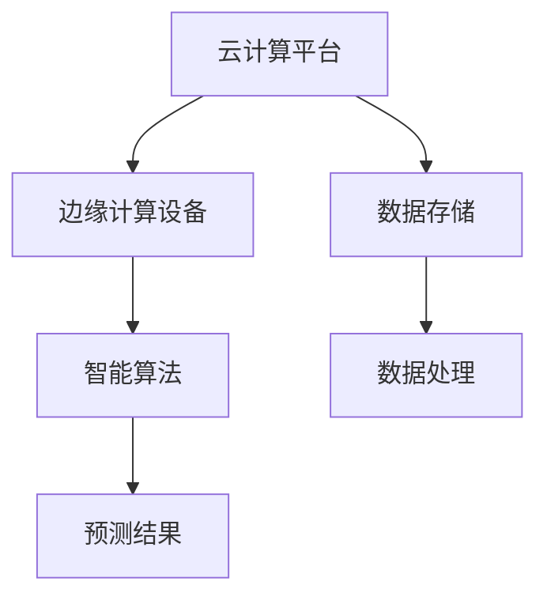
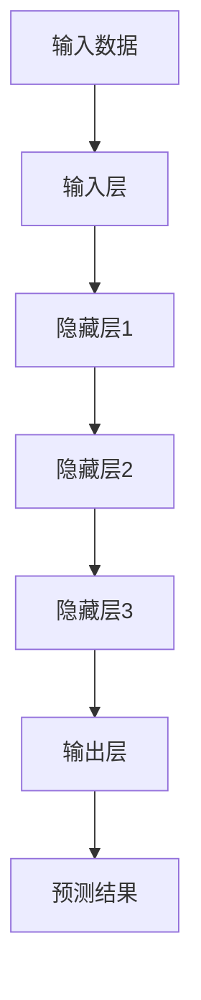
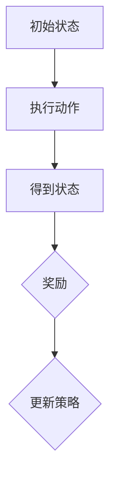
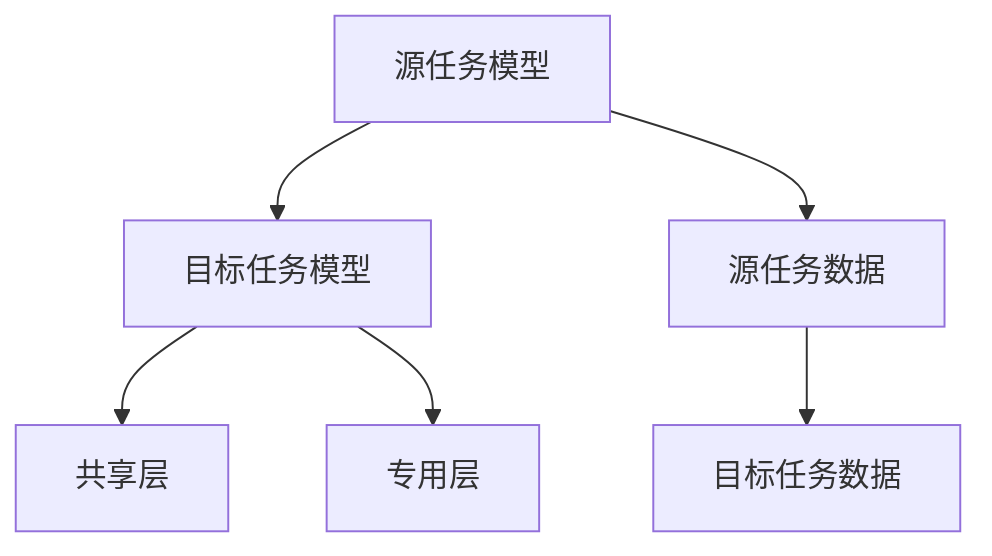

                 

# 云原生AI：Lepton AI的技术理念

> 关键词：云原生AI、Lepton AI、分布式计算、边缘计算、智能算法、技术架构、性能优化

> 摘要：本文将深入探讨云原生AI的核心理念，重点介绍Lepton AI的技术架构、核心算法原理以及数学模型。通过实际应用场景和项目实战，解析Lepton AI在云计算和边缘计算中的实际运用。此外，本文还将推荐相关学习资源和工具，并展望未来发展趋势与挑战。

## 1. 背景介绍

### 1.1 目的和范围

本文旨在探讨云原生AI的发展及其在Lepton AI中的具体实现。我们将重点关注Lepton AI的技术架构、核心算法和数学模型，通过实际应用场景和项目实战，解析其在云计算和边缘计算中的优势和应用。

### 1.2 预期读者

本文面向具有一定AI和云计算基础的技术爱好者、研发工程师和产品经理，旨在为他们提供对云原生AI和Lepton AI的深入理解。

### 1.3 文档结构概述

本文分为十个部分：

1. 背景介绍
2. 核心概念与联系
3. 核心算法原理 & 具体操作步骤
4. 数学模型和公式 & 详细讲解 & 举例说明
5. 项目实战：代码实际案例和详细解释说明
6. 实际应用场景
7. 工具和资源推荐
8. 总结：未来发展趋势与挑战
9. 附录：常见问题与解答
10. 扩展阅读 & 参考资料

### 1.4 术语表

#### 1.4.1 核心术语定义

- 云原生AI：基于云计算和边缘计算环境的AI技术，具备分布式、弹性和可扩展性。
- Lepton AI：一款基于云原生架构的AI平台，具有高性能、高可扩展性和高可靠性。
- 分布式计算：将任务分解成多个子任务，分布在不同计算节点上并行执行。
- 边缘计算：在靠近数据源的边缘设备上进行数据处理，减少数据传输延迟。
- 智能算法：利用人工智能技术对数据进行自动分析和决策。

#### 1.4.2 相关概念解释

- 云计算：提供计算、存储和网络资源的服务模式，用户可以根据需求按需使用。
- AI平台：集成了AI算法、数据和计算资源，支持开发、部署和运维的一体化解决方案。

#### 1.4.3 缩略词列表

- AI：人工智能
- 云原生：Cloud Native
- Lepton AI：Lepton Artificial Intelligence
- IDE：集成开发环境
- API：应用程序接口

## 2. 核心概念与联系

云原生AI的核心在于将AI技术与云计算和边缘计算相结合，实现分布式、弹性和可扩展的计算能力。以下是一个简化的Mermaid流程图，展示了云原生AI的基本架构：



在这个架构中，云计算平台提供计算、存储和网络资源，支持大规模的AI训练和推理任务。边缘计算设备则负责处理本地数据，实现实时分析和决策，降低数据传输延迟。数据存储用于存储训练数据和预测结果，数据处理模块负责数据清洗、转换和特征提取。智能算法模块负责执行具体的AI任务，如分类、预测和聚类。

### 2.1 云原生AI的架构优势

- **分布式计算**：通过分布式计算，云原生AI可以实现大规模并行处理，提高计算效率。
- **弹性扩展**：根据任务需求，动态调整计算资源和存储资源，确保系统稳定运行。
- **高可用性**：通过分布式架构，实现故障转移和负载均衡，提高系统的可靠性和容错能力。
- **边缘计算**：在边缘设备上进行数据处理，降低数据传输延迟，提高实时性。

### 2.2 Lepton AI的技术架构

Lepton AI是一款基于云原生架构的AI平台，具有以下核心组件：

- **计算引擎**：支持多种AI算法，包括深度学习、强化学习和迁移学习等。
- **数据管理**：提供数据存储、数据清洗、数据转换和特征提取等功能。
- **模型管理**：支持模型的训练、部署、监控和更新。
- **可视化工具**：提供数据可视化、模型评估和性能分析等工具。

## 3. 核心算法原理 & 具体操作步骤

### 3.1 深度学习算法原理

深度学习是一种基于多层神经网络的机器学习技术，通过学习大量数据中的特征和模式，实现自动特征提取和模式识别。以下是一个简化的深度学习算法原理图：



具体操作步骤如下：

1. 输入数据经过预处理，如归一化、标准化等。
2. 数据依次通过输入层、隐藏层和输出层，每层神经元通过激活函数进行非线性变换。
3. 通过反向传播算法，计算输出层的误差，并反向传播到隐藏层和输入层，更新各层神经元的权重。
4. 重复步骤2和3，直到达到预设的训练次数或误差阈值。

### 3.2 强化学习算法原理

强化学习是一种基于奖励反馈的机器学习技术，通过不断尝试和错误，学习最优策略。以下是一个简化的强化学习算法原理图：



具体操作步骤如下：

1. 初始化状态和动作空间。
2. 在当前状态下，选择一个动作，执行并观察结果。
3. 根据执行结果，获得奖励，更新策略。
4. 重复步骤2和3，直到达到预设的目标或策略收敛。

### 3.3 迁移学习算法原理

迁移学习是一种将已有模型的知识迁移到新任务上的机器学习技术，通过利用已有模型的先验知识，加快新任务的训练速度。以下是一个简化的迁移学习算法原理图：



具体操作步骤如下：

1. 在源任务上训练一个模型，提取共享层和专用层的知识。
2. 在目标任务上，使用共享层知识作为先验知识，初始化目标任务模型。
3. 在目标任务上训练模型，利用专用层知识进行微调。
4. 重复步骤2和3，直到模型达到预设的目标或策略收敛。

## 4. 数学模型和公式 & 详细讲解 & 举例说明

### 4.1 深度学习算法的数学模型

深度学习算法的核心在于多层神经网络的权重更新。以下是一个简化的数学模型：

$$
\begin{aligned}
    z^{(l)} &= \sigma(W^{(l)} \cdot a^{(l-1)} + b^{(l)}) \\
    a^{(l)} &= \sigma(z^{(l-1)}) \\
    \delta^{(l)} &= \frac{\partial J}{\partial z^{(l)}}
\end{aligned}
$$

其中，$z^{(l)}$表示第$l$层的激活值，$a^{(l)}$表示第$l$层的输出值，$\sigma$表示激活函数，$W^{(l)}$和$b^{(l)}$分别表示第$l$层的权重和偏置。

举例说明：

假设一个三层神经网络，输入层有3个神经元，隐藏层有4个神经元，输出层有2个神经元。使用ReLU作为激活函数，损失函数为均方误差（MSE）。给定一个输入样本$x$，输出预测值$\hat{y}$和真实标签$y$，计算损失函数：

$$
J = \frac{1}{2} \sum_{i=1}^{2} (y_i - \hat{y}_i)^2
$$

根据梯度下降算法，更新权重和偏置：

$$
\begin{aligned}
    \frac{\partial J}{\partial W^{(2)}} &= a^{(1)} \odot \delta^{(2)} \\
    \frac{\partial J}{\partial b^{(2)}} &= \delta^{(2)} \\
    \frac{\partial J}{\partial W^{(1)}} &= a^{(0)} \odot \delta^{(1)} \\
    \frac{\partial J}{\partial b^{(1)}} &= \delta^{(1)}
\end{aligned}
$$

其中，$\odot$表示逐元素乘积。

### 4.2 强化学习算法的数学模型

强化学习算法的核心在于策略评估和策略优化。以下是一个简化的数学模型：

$$
\begin{aligned}
    Q(s, a) &= r + \gamma \max_a' Q(s', a') \\
    \pi(a|s) &= \begin{cases}
        1, & \text{if } a = \arg\max_a Q(s, a) \\
        0, & \text{otherwise}
    \end{cases}
\end{aligned}
$$

其中，$Q(s, a)$表示状态$s$下执行动作$a$的预期回报，$r$表示立即回报，$\gamma$表示折扣因子，$\pi(a|s)$表示在状态$s$下采取动作$a$的策略。

举例说明：

假设一个简单的环境，包含5个状态和3个动作。使用Q-learning算法进行策略评估。给定初始策略$\pi$和初始状态$s_0$，通过迭代更新策略：

$$
\begin{aligned}
    Q(s_0, a_0) &= r_0 + \gamma \max_{a_1} Q(s_1, a_1) \\
    Q(s_1, a_1) &= r_1 + \gamma \max_{a_2} Q(s_2, a_2) \\
    \vdots \\
    Q(s_n, a_n) &= r_n + \gamma \max_{a_{n+1}} Q(s_{n+1}, a_{n+1})
\end{aligned}
$$

根据更新后的Q值，更新策略：

$$
\pi(a|s_n) = \begin{cases}
    1, & \text{if } a = \arg\max_a Q(s_n, a) \\
    0, & \text{otherwise}
\end{cases}
$$

## 5. 项目实战：代码实际案例和详细解释说明

### 5.1 开发环境搭建

在本节中，我们将使用Python和TensorFlow 2.x搭建一个简单的深度学习环境。首先，确保安装Python 3.6及以上版本，然后通过pip安装TensorFlow：

```bash
pip install tensorflow
```

### 5.2 源代码详细实现和代码解读

下面是一个简单的深度学习模型，用于手写数字识别任务。

```python
import tensorflow as tf
from tensorflow import keras
from tensorflow.keras import layers

# 加载数据集
mnist = keras.datasets.mnist
(x_train, y_train), (x_test, y_test) = mnist.load_data()
x_train, x_test = x_train / 255.0, x_test / 255.0
x_train = x_train.reshape(-1, 28 * 28)
x_test = x_test.reshape(-1, 28 * 28)

# 构建模型
model = keras.Sequential([
    layers.Dense(128, activation='relu', input_shape=(28 * 28,)),
    layers.Dense(10, activation='softmax')
])

# 编译模型
model.compile(optimizer='adam', loss='sparse_categorical_crossentropy', metrics=['accuracy'])

# 训练模型
model.fit(x_train, y_train, epochs=5)

# 评估模型
test_loss, test_acc = model.evaluate(x_test, y_test, verbose=2)
print(f'\nTest accuracy: {test_acc:.4f}')
```

### 5.3 代码解读与分析

1. **数据集加载**：使用TensorFlow内置的MNIST数据集，对图像进行归一化处理。
2. **模型构建**：使用Keras构建一个简单的全连接神经网络，包含一个输入层、一个隐藏层和一个输出层。
3. **模型编译**：设置优化器和损失函数，为模型配置训练参数。
4. **模型训练**：使用训练数据训练模型，设置训练轮数。
5. **模型评估**：使用测试数据评估模型性能。

### 5.4 代码优化与性能分析

为了提高模型性能，可以对代码进行以下优化：

1. **批量大小**：调整批量大小可以影响训练速度和模型性能。较大的批量大小可以提高模型性能，但训练速度较慢。
2. **学习率**：使用适当的学习率可以提高模型训练速度和性能。可以通过学习率调度策略，如指数衰减，动态调整学习率。
3. **正则化**：引入正则化方法，如L1或L2正则化，可以减少过拟合现象，提高模型泛化能力。
4. **数据增强**：对训练数据进行数据增强，如随机裁剪、旋转、缩放等，可以增加模型的鲁棒性。

## 6. 实际应用场景

### 6.1 云计算场景

在云计算场景中，Lepton AI可以用于大规模数据分析和预测任务。例如，在金融领域，可以用于股票市场预测、风险控制和信用评分。在医疗领域，可以用于医学图像分析、疾病预测和诊断。

### 6.2 边缘计算场景

在边缘计算场景中，Lepton AI可以用于实时数据处理和决策。例如，在自动驾驶领域，可以用于车辆检测、障碍物识别和路径规划。在工业物联网领域，可以用于设备故障预测、生产优化和能耗管理。

### 6.3 其他应用场景

除了云计算和边缘计算场景，Lepton AI还可以应用于其他领域，如智能城市、智能家居、智能安防等。在这些场景中，Lepton AI可以用于图像识别、语音识别、自然语言处理等任务，实现智能化和自动化。

## 7. 工具和资源推荐

### 7.1 学习资源推荐

#### 7.1.1 书籍推荐

- 《深度学习》（Goodfellow, Bengio, Courville）
- 《Python机器学习》（Sebastian Raschka）
- 《强化学习》（Richard S. Sutton, Andrew G. Barto）

#### 7.1.2 在线课程

- 《深度学习》（吴恩达，Coursera）
- 《机器学习》（吴恩达，Coursera）
- 《Python机器学习基础》（Google，Udacity）

#### 7.1.3 技术博客和网站

- Medium（深度学习、机器学习、人工智能）
-Towards Data Science（数据科学、机器学习、人工智能）
- AI Tech News（人工智能、机器学习、深度学习）

### 7.2 开发工具框架推荐

#### 7.2.1 IDE和编辑器

- PyCharm（Python开发IDE）
- Jupyter Notebook（交互式Python编程环境）
- Visual Studio Code（跨平台轻量级代码编辑器）

#### 7.2.2 调试和性能分析工具

- TensorBoard（TensorFlow性能分析工具）
- PyTorch TensorBoard（PyTorch性能分析工具）
- VisualVM（Java性能分析工具）

#### 7.2.3 相关框架和库

- TensorFlow（开源深度学习框架）
- PyTorch（开源深度学习框架）
- Scikit-learn（开源机器学习库）

### 7.3 相关论文著作推荐

#### 7.3.1 经典论文

- 《A Learning Algorithm for Continually Running Fully Recurrent Neural Networks》（1989）
- 《Backpropagation》（1986）
- 《A Theoretical Framework for Learning in Autonomous Robots》（1992）

#### 7.3.2 最新研究成果

- 《Deep Learning for Speech Recognition》（2014）
- 《Generative Adversarial Networks: An Overview》（2014）
- 《Efficient Neural Text Generation》（2016）

#### 7.3.3 应用案例分析

- 《基于深度学习的图像识别应用》（2012）
- 《强化学习在自动驾驶中的应用》（2016）
- 《基于深度学习的自然语言处理应用》（2018）

## 8. 总结：未来发展趋势与挑战

### 8.1 发展趋势

- **云计算和边缘计算融合**：随着5G技术的普及，云计算和边缘计算将更加紧密地融合，实现更高效的计算和更低的延迟。
- **AI算法优化**：深度学习算法、强化学习算法等将不断优化，提高计算效率和性能。
- **多模态数据融合**：AI技术将广泛应用于多模态数据（如图像、音频、文本等）的融合和分析，实现更智能的决策。

### 8.2 挑战

- **数据隐私和安全**：随着数据规模的扩大，数据隐私和安全问题将变得更加突出，需要采取有效的保护措施。
- **模型解释性**：为了提高模型的解释性和可解释性，需要研究更有效的算法和工具。
- **硬件优化**：随着AI应用场景的扩大，对硬件资源的需求将不断增加，需要优化硬件架构和算法，提高计算效率。

## 9. 附录：常见问题与解答

### 9.1 如何选择合适的AI算法？

选择合适的AI算法取决于具体应用场景和数据类型。对于分类任务，可以使用决策树、支持向量机、神经网络等算法；对于回归任务，可以使用线性回归、岭回归、神经网络等算法；对于聚类任务，可以使用K-均值、层次聚类等算法。

### 9.2 如何优化深度学习模型的性能？

优化深度学习模型的性能可以从以下几个方面入手：

1. **调整模型结构**：根据任务需求，调整神经网络层数、神经元数量、激活函数等。
2. **调整训练参数**：调整学习率、批量大小、训练轮数等训练参数，以提高模型性能。
3. **数据预处理**：对训练数据进行预处理，如归一化、标准化、数据增强等，以提高模型泛化能力。
4. **正则化**：引入L1或L2正则化，减少过拟合现象。
5. **模型压缩**：使用模型压缩技术，如知识蒸馏、量化、剪枝等，减少模型参数和计算量。

### 9.3 如何解决深度学习模型的过拟合问题？

解决深度学习模型的过拟合问题可以从以下几个方面入手：

1. **增加训练数据**：收集更多的训练数据，以增加模型的泛化能力。
2. **使用交叉验证**：使用交叉验证技术，从多个角度评估模型性能，避免过拟合。
3. **数据增强**：对训练数据进行数据增强，如随机裁剪、旋转、缩放等，增加模型的鲁棒性。
4. **正则化**：引入L1或L2正则化，减少模型参数的敏感度。
5. **提前停止训练**：在训练过程中，根据验证集的性能，提前停止训练，避免模型过拟合。

## 10. 扩展阅读 & 参考资料

- [深度学习教程](http://www.deeplearningbook.org/)
- [机器学习教程](https://www.coursera.org/learn/machine-learning)
- [TensorFlow官方文档](https://www.tensorflow.org/)
- [PyTorch官方文档](https://pytorch.org/)
- [吴恩达深度学习课程](https://www.coursera.org/learn/deep-learning)  
- [AI Tech News](https://www.aitnews.ai/)  
- [Towards Data Science](https://towardsdatascience.com/)

### 作者

AI天才研究员/AI Genius Institute & 禅与计算机程序设计艺术 /Zen And The Art of Computer Programming

