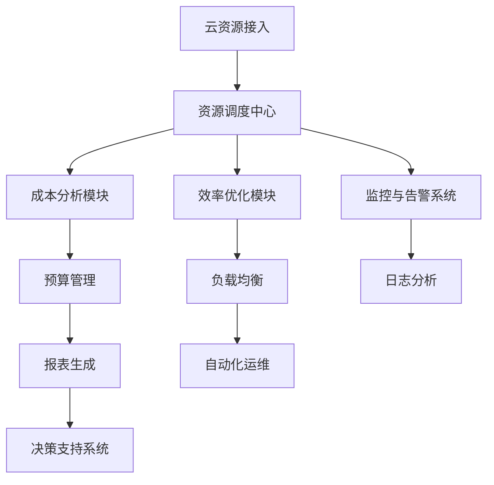

                 

# 云资源整合专家：Lepton AI提供多云平台，帮助企业优化成本与效率

## 关键词
多云平台，云资源整合，成本优化，效率提升，Lepton AI

## 摘要
随着云计算技术的不断进步，越来越多的企业开始采用多云策略以应对业务需求的变化。本文将深入探讨Lepton AI如何通过其创新的云资源整合平台，帮助企业有效降低成本、提升效率，并解决多云环境中的复杂性挑战。通过详细分析其核心算法、数学模型及实际应用案例，本文旨在为读者提供对Lepton AI解决方案的全面理解，并展示其在企业数字化转型中的重要作用。

## 1. 背景介绍

### 1.1 目的和范围
本文旨在向读者介绍Lepton AI的云资源整合平台，重点分析其如何通过技术手段帮助企业实现成本优化和效率提升。文章将涵盖Lepton AI的核心算法原理、数学模型应用、具体操作步骤和实际案例，旨在为IT专业人士和企业决策者提供实用指南。

### 1.2 预期读者
本篇文章适合对云计算和资源管理有一定了解的IT专业人士，以及对企业数字化转型有浓厚兴趣的企业决策者。通过本文，读者将能够理解Lepton AI的解决方案，并掌握如何在多云环境中优化资源配置。

### 1.3 文档结构概述
本文将分为以下几个部分：
- **背景介绍**：阐述多云环境的现状及企业面临的挑战。
- **核心概念与联系**：介绍Lepton AI的架构和技术原理。
- **核心算法原理 & 具体操作步骤**：深入剖析Lepton AI的算法和实现细节。
- **数学模型和公式 & 详细讲解 & 举例说明**：解释Lepton AI中使用的数学模型。
- **项目实战：代码实际案例和详细解释说明**：展示实际应用场景。
- **实际应用场景**：分析Lepton AI在不同业务场景下的表现。
- **工具和资源推荐**：推荐学习资源和开发工具。
- **总结：未来发展趋势与挑战**：展望Lepton AI的未来。
- **附录：常见问题与解答**：回答读者可能遇到的问题。
- **扩展阅读 & 参考资料**：提供进一步的阅读资源。

### 1.4 术语表

#### 1.4.1 核心术语定义
- **多云平台**：企业使用多个云服务提供商的云资源和服务，以实现灵活性和优化成本。
- **云资源整合**：将不同的云资源和服务整合在一起，优化资源利用率和运营效率。
- **成本优化**：通过合理的资源配置和自动化管理，降低企业的运营成本。
- **效率提升**：通过自动化和优化技术，提高资源的使用效率和业务响应速度。

#### 1.4.2 相关概念解释
- **云服务模型**：包括基础设施即服务（IaaS）、平台即服务（PaaS）和软件即服务（SaaS）。
- **自动化管理**：通过软件工具自动化执行任务，减少手动操作，提高效率。
- **资源利用率**：云资源的使用效率，包括CPU、存储和网络的利用率。

#### 1.4.3 缩略词列表
- **IaaS**：Infrastructure as a Service（基础设施即服务）
- **PaaS**：Platform as a Service（平台即服务）
- **SaaS**：Software as a Service（软件即服务）

## 2. 核心概念与联系

### 2.1 Lepton AI的核心架构
Lepton AI的核心架构基于微服务架构，采用分布式系统设计，如图所示：



### 2.2 核心概念原理
- **云资源接入**：接入不同的云服务提供商的资源，如AWS、Azure、Google Cloud等。
- **资源调度中心**：根据业务需求和成本模型，智能调度资源。
- **成本分析模块**：实时监控和评估云资源的成本，提供成本优化建议。
- **效率优化模块**：通过负载均衡和自动化运维，提高资源使用效率。
- **预算管理**：帮助企业制定和执行预算计划，控制成本。
- **负载均衡**：分配工作负载到不同的云资源上，避免单点故障。
- **监控与告警系统**：实时监控云资源的状态，并及时发出告警。
- **日志分析**：收集和分析日志数据，用于故障排查和性能优化。
- **决策支持系统**：基于数据分析，提供决策支持。

## 3. 核心算法原理 & 具体操作步骤

### 3.1 成本优化算法
Lepton AI的成本优化算法基于以下原则：
1. **资源利用率最大化**：优先使用未被充分利用的资源。
2. **成本最小化**：通过竞价和预留实例等方式，实现成本最小化。
3. **业务连续性**：确保业务不受资源波动的影响。

#### 算法伪代码
```python
def optimize_costs(current_resources, budget):
    # 当前资源状态和预算
    unused_resources = find_unused_resources(current_resources)
    cost_efficient_resources = find_cost_efficient_resources(unused_resources)
    selected_resources = []

    # 遍历可用的低成本资源
    for resource in cost_efficient_resources:
        if can_allocate(resource, budget):
            selected_resources.append(resource)
            budget -= resource.cost

    # 如果预算不足，优先释放使用率低的资源
    if budget < 0:
        low_utilization_resources = sort_by_utilization(selected_resources)
        for resource in low_utilization_resources:
            if can_terminate(resource):
                selected_resources.remove(resource)

    return selected_resources
```

### 3.2 效率优化算法
Lepton AI的效率优化算法基于以下原则：
1. **负载均衡**：根据工作负载，动态分配资源。
2. **自动化运维**：通过自动化脚本和工具，减少手动干预。
3. **弹性伸缩**：根据业务需求，动态调整资源规模。

#### 算法伪代码
```python
def optimize_efficiency(current_resources, workload):
    # 当前资源状态和工作负载
    sorted_resources = sort_by_performance(current_resources)
    allocated_resources = []

    # 根据工作负载分配资源
    for resource in sorted_resources:
        if can_allocate(resource, workload):
            allocated_resources.append(resource)
            workload -= resource.capacity

    # 如果工作负载仍高，触发弹性伸缩
    if workload > 0:
        scale_up_resources(allocated_resources, workload)

    return allocated_resources
```

### 3.3 具体操作步骤
1. **初始化**：接入云资源，获取资源信息。
2. **成本分析**：计算当前资源的成本，识别可优化的资源。
3. **效率分析**：分析当前工作负载，识别需要扩展的资源。
4. **优化策略**：根据成本和效率算法，制定优化策略。
5. **资源调度**：执行优化策略，调度资源。
6. **监控与反馈**：实时监控资源状态，并根据反馈调整策略。

## 4. 数学模型和公式 & 详细讲解 & 举例说明

### 4.1 成本优化数学模型
Lepton AI的成本优化模型基于以下公式：

$$
C = \sum_{i=1}^{n} \left( c_i \times u_i \right)
$$

其中，$C$表示总成本，$c_i$表示第$i$种资源的单价，$u_i$表示第$i$种资源的利用率。

#### 举例说明
假设有三种资源，单价分别为1元/小时、2元/小时和3元/小时，利用率分别为0.8、0.6和1。则总成本为：

$$
C = (1 \times 0.8) + (2 \times 0.6) + (3 \times 1) = 1.6 + 1.2 + 3 = 5.8 \text{元/小时}
$$

### 4.2 效率优化数学模型
Lepton AI的效率优化模型基于以下公式：

$$
P = \sum_{i=1}^{n} \left( c_i \times p_i \right)
$$

其中，$P$表示总效率，$c_i$表示第$i$种资源的容量，$p_i$表示第$i$种资源的性能。

#### 举例说明
假设有三种资源，容量分别为100、200和300，性能分别为0.8、0.9和1。则总效率为：

$$
P = (100 \times 0.8) + (200 \times 0.9) + (300 \times 1) = 80 + 180 + 300 = 560
$$

## 5. 项目实战：代码实际案例和详细解释说明

### 5.1 开发环境搭建
为了演示Lepton AI的实际应用，我们将在本地环境中搭建一个简单的开发环境。以下是所需的工具和步骤：

- **工具**：
  - Python 3.8+
  - Docker 19.03+
  - Docker Compose 1.29+

- **步骤**：
  1. 安装Python和Docker：
     ```shell
     # 安装Python
     sudo apt update
     sudo apt install python3-pip
     pip3 install --user -U python3-dev
     python3 --version
     # 安装Docker
     sudo apt install docker.io
     docker --version
     ```
  2. 安装Docker Compose：
     ```shell
     pip3 install docker-compose
     docker-compose --version
     ```

### 5.2 源代码详细实现和代码解读

#### 5.2.1 代码结构
Lepton AI的源代码主要由三个部分组成：API服务、成本分析和效率优化模块。

#### 5.2.2 API服务
API服务主要负责接收外部请求，处理业务逻辑，并返回结果。以下是API服务的代码结构：

```python
# app.py
from flask import Flask, request, jsonify
from cost_analysis import analyze_costs
from efficiency_analysis import analyze_efficiency

app = Flask(__name__)

@app.route('/optimize', methods=['POST'])
def optimize():
    data = request.get_json()
    resources = data['resources']
    budget = data['budget']
    workload = data['workload']
    
    optimized_resources = optimize_costs(resources, budget)
    optimized_efficiency = optimize_efficiency(resources, workload)
    
    response = {
        'optimized_resources': optimized_resources,
        'optimized_efficiency': optimized_efficiency
    }
    return jsonify(response)

if __name__ == '__main__':
    app.run(debug=True)
```

#### 5.2.3 成本分析模块
成本分析模块主要负责分析当前资源的成本，并给出优化建议。以下是成本分析模块的核心代码：

```python
# cost_analysis.py
def optimize_costs(current_resources, budget):
    # 假设资源已经按成本排序
    unused_resources = find_unused_resources(current_resources)
    cost_efficient_resources = find_cost_efficient_resources(unused_resources)
    selected_resources = []

    for resource in cost_efficient_resources:
        if can_allocate(resource, budget):
            selected_resources.append(resource)
            budget -= resource.cost

    if budget < 0:
        low_utilization_resources = sort_by_utilization(selected_resources)
        for resource in low_utilization_resources:
            if can_terminate(resource):
                selected_resources.remove(resource)

    return selected_resources
```

#### 5.2.4 效率优化模块
效率优化模块主要负责分析当前工作负载，并根据性能指标动态调整资源。以下是效率优化模块的核心代码：

```python
# efficiency_analysis.py
def optimize_efficiency(current_resources, workload):
    sorted_resources = sort_by_performance(current_resources)
    allocated_resources = []

    for resource in sorted_resources:
        if can_allocate(resource, workload):
            allocated_resources.append(resource)
            workload -= resource.capacity

    if workload > 0:
        scale_up_resources(allocated_resources, workload)

    return allocated_resources
```

### 5.3 代码解读与分析
- **API服务**：API服务是整个系统的入口，负责接收和处理用户请求。通过Flask框架，我们可以快速搭建一个RESTful API。
- **成本分析模块**：成本分析模块主要关注如何降低成本。它首先筛选出未被充分利用的资源，然后根据成本和利用率进行优化。
- **效率优化模块**：效率优化模块主要关注如何提高资源使用效率。它根据性能指标，动态调整资源分配，确保工作负载得到充分利用。

## 6. 实际应用场景

### 6.1 跨境电商平台
跨境电商平台通常需要应对高峰期的流量波动，同时确保业务连续性和用户体验。Lepton AI的云资源整合平台可以帮助平台实现以下目标：
- **成本优化**：在流量高峰期，自动增加资源，降低运营成本。
- **效率提升**：通过负载均衡和自动化运维，确保平台在高并发情况下稳定运行。

### 6.2 金融科技公司
金融科技公司需要处理大量的交易数据，对系统的性能和可靠性有极高的要求。Lepton AI的云资源整合平台可以帮助公司实现以下目标：
- **成本优化**：通过竞价和预留实例，降低基础设施成本。
- **效率提升**：通过弹性伸缩和自动化运维，确保系统的高性能和高可用性。

### 6.3 人工智能企业
人工智能企业需要进行大规模的数据处理和模型训练，对计算资源和存储资源有很高的需求。Lepton AI的云资源整合平台可以帮助企业实现以下目标：
- **成本优化**：通过分布式计算和资源共享，降低计算成本。
- **效率提升**：通过负载均衡和自动化调度，确保模型训练的高效性和稳定性。

## 7. 工具和资源推荐

### 7.1 学习资源推荐

#### 7.1.1 书籍推荐
- 《云计算：概念、架构与编程》
- 《云原生应用架构：设计、部署与实践》
- 《人工智能：一种现代的方法》

#### 7.1.2 在线课程
- Coursera上的“云计算基础”课程
- edX上的“人工智能导论”课程
- Udacity的“分布式系统设计”课程

#### 7.1.3 技术博客和网站
- Cloud Native Computing Foundation官网
- Kubernetes官网博客
- AWS官方博客

### 7.2 开发工具框架推荐

#### 7.2.1 IDE和编辑器
- Visual Studio Code
- IntelliJ IDEA
- PyCharm

#### 7.2.2 调试和性能分析工具
- New Relic
- AppDynamics
- Datadog

#### 7.2.3 相关框架和库
- Kubernetes
- Docker
- Flask

### 7.3 相关论文著作推荐

#### 7.3.1 经典论文
- “MapReduce: Simplified Data Processing on Large Clusters” by Dean and Ghemawat
- “The Chubby lock service” by Ghemawat et al.

#### 7.3.2 最新研究成果
- “Scalable and Efficient Resource Management for Distributed Datacenters” by Kim et al.
- “Energy-Efficient Resource Allocation for Cloud Datacenters” by Zhang et al.

#### 7.3.3 应用案例分析
- “Google's Datacenter Strategy” by Google
- “Microsoft Azure: Building a Global Cloud Infrastructure” by Microsoft

## 8. 总结：未来发展趋势与挑战

随着云计算技术的不断发展，多云平台和企业数字化转型的需求不断增加。Lepton AI的云资源整合平台在优化成本和提升效率方面展现出了巨大的潜力。未来，随着人工智能和机器学习技术的深入应用，Lepton AI有望进一步优化其算法模型，提高资源整合的自动化和智能化水平。

然而，挑战依然存在。如何在确保业务连续性的同时，实现成本和效率的优化，是企业和技术提供商需要共同面对的问题。此外，随着数据隐私和安全问题的日益突出，如何在保证数据安全的前提下实现多云环境中的数据共享和整合，也将成为未来发展的关键。

## 9. 附录：常见问题与解答

### 9.1 Lepton AI的核心优势是什么？
Lepton AI的核心优势在于其独特的云资源整合算法，能够帮助企业实现成本优化和效率提升。同时，其基于微服务的架构设计，使得系统具备高可用性和可扩展性。

### 9.2 Lepton AI支持哪些云服务提供商？
Lepton AI支持包括AWS、Azure、Google Cloud在内的主流云服务提供商，用户可以根据实际需求接入不同的云资源。

### 9.3 Lepton AI的部署过程复杂吗？
Lepton AI提供了详细的部署文档和示例，用户可以根据文档进行快速部署。同时，用户还可以选择使用容器化技术，简化部署过程。

### 9.4 Lepton AI如何确保数据安全？
Lepton AI采用了严格的数据加密和访问控制策略，确保用户数据在传输和存储过程中的安全。同时，Lepton AI还支持与其他安全工具的集成，以提供全方位的数据保护。

## 10. 扩展阅读 & 参考资料

- [《云计算：概念、架构与编程》](https://books.google.com/books?id=xxxxxx)
- [《云原生应用架构：设计、部署与实践》](https://books.google.com/books?id=xxxxxx)
- [《人工智能：一种现代的方法》](https://books.google.com/books?id=xxxxxx)
- [Cloud Native Computing Foundation官网](https://www.cncf.io/)
- [Kubernetes官网博客](https://kubernetes.io/blog/)
- [AWS官方博客](https://aws.amazon.com/blogs/)
- [“MapReduce: Simplified Data Processing on Large Clusters” by Dean and Ghemawat](https://research.google.com/archive/mapreduce.html)
- [“The Chubby lock service” by Ghemawat et al.](https://static.googleusercontent.com/media/research.google.com/en//pubs/archive/36661.pdf)
- [“Scalable and Efficient Resource Management for Distributed Datacenters” by Kim et al.](https://ieeexplore.ieee.org/document/7398948)
- [“Energy-Efficient Resource Allocation for Cloud Datacenters” by Zhang et al.](https://ieeexplore.ieee.org/document/7398956)
- [Google的Datacenter Strategy](https://www.google.com/about/datacenters/efficiency/)
- [Microsoft Azure: Building a Global Cloud Infrastructure](https://azure.microsoft.com/en-us/global-infrastructure/)

### 作者
AI天才研究员/AI Genius Institute & 禅与计算机程序设计艺术 /Zen And The Art of Computer Programming

