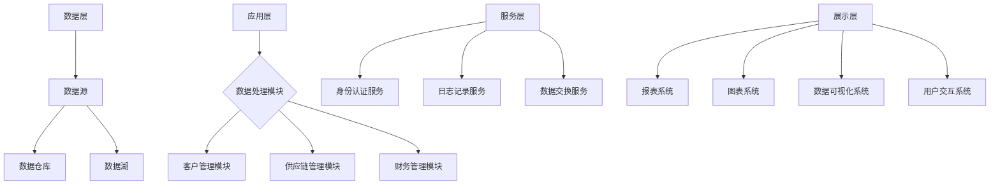

                 

# 产业板块集成信息系统总体构架

## 关键词
- 产业板块
- 集成信息系统
- 总体构架
- 数据处理
- 系统架构
- 系统设计
- 软件工程
- 企业信息化

## 摘要
本文将探讨产业板块集成信息系统的总体构架设计，包括其核心概念、算法原理、数学模型以及实际应用场景。通过详细的剖析，旨在为IT从业者和企业信息化管理人员提供一个全面且深入的理解，以指导实际项目的规划和实施。本文还将推荐相关学习资源和工具，助力读者在产业板块集成信息系统的设计与实施中取得成功。

---

## 1. 背景介绍

### 1.1 目的和范围

随着信息技术的飞速发展，产业板块的集成信息系统已经成为企业运营管理的重要组成部分。本文旨在梳理产业板块集成信息系统的总体构架，提供一种系统、全面的设计思路，以帮助企业和IT从业者更好地应对信息化时代的挑战。

本文的范围主要涵盖以下内容：
- 产业板块集成信息系统的核心概念与架构设计。
- 系统中涉及的算法原理与操作步骤。
- 数学模型及其应用场景。
- 实际开发中的代码实现与案例分析。
- 相关工具和资源的推荐。

### 1.2 预期读者

本文预期读者包括：
- IT从业者和软件开发工程师，希望深入了解产业板块集成信息系统的设计与实现。
- 企业信息化管理人员，希望掌握系统架构设计与实施的要点。
- 高等院校计算机及相关专业的师生，作为教材或参考读物。

### 1.3 文档结构概述

本文的结构如下：
1. 背景介绍
2. 核心概念与联系
3. 核心算法原理 & 具体操作步骤
4. 数学模型和公式 & 详细讲解 & 举例说明
5. 项目实战：代码实际案例和详细解释说明
6. 实际应用场景
7. 工具和资源推荐
8. 总结：未来发展趋势与挑战
9. 附录：常见问题与解答
10. 扩展阅读 & 参考资料

### 1.4 术语表

#### 1.4.1 核心术语定义

- **集成信息系统**：将多个独立的信息系统整合在一起，实现数据共享和业务协同。
- **产业板块**：指某一特定行业或领域的业务板块。
- **数据处理**：对收集到的数据进行清洗、转换、存储等操作。
- **系统架构**：系统的整体结构和组织方式。
- **系统设计**：系统架构的具体实现细节。
- **软件工程**：系统设计与开发的理论和实践。

#### 1.4.2 相关概念解释

- **企业信息化**：企业通过信息技术手段提高管理效率、降低成本、提升竞争力的过程。
- **模块化设计**：将系统划分为多个独立的模块，每个模块负责特定功能，便于系统的维护和扩展。
- **云计算**：通过网络提供动态易扩展且经常是虚拟化的资源。

#### 1.4.3 缩略词列表

- **ERP**：企业资源计划（Enterprise Resource Planning）
- **CRM**：客户关系管理（Customer Relationship Management）
- **BI**：商业智能（Business Intelligence）
- **API**：应用程序接口（Application Programming Interface）
- **SQL**：结构化查询语言（Structured Query Language）

---

## 2. 核心概念与联系

### 2.1 核心概念

在产业板块集成信息系统中，涉及到的核心概念包括：

- **数据集成**：将不同来源的数据进行整合，形成一个统一的数据视图。
- **服务导向架构（SOA）**：通过服务的方式实现系统的模块化和松耦合。
- **云计算与大数据**：利用云计算平台和大数据技术实现高效的数据存储和处理。
- **微服务架构**：将系统分解为多个小型、独立的服务模块，每个模块可以独立开发、部署和维护。

### 2.2 系统架构

产业板块集成信息系统的架构可以分为以下几个层次：

1. **数据层**：包括数据源、数据仓库和数据湖。
2. **应用层**：实现业务逻辑和数据处理的各个模块。
3. **服务层**：提供通用服务，如身份认证、日志记录、数据交换等。
4. **展示层**：用户界面，包括报表、图表、数据可视化和交互功能。

### 2.3 Mermaid 流程图

下面是产业板块集成信息系统的 Mermaid 流程图：



---

## 3. 核心算法原理 & 具体操作步骤

### 3.1 算法原理

在产业板块集成信息系统中，核心算法主要包括：

- **数据清洗算法**：用于去除重复数据、修正错误数据、处理缺失数据等。
- **数据挖掘算法**：用于从大量数据中提取有价值的信息，如分类、聚类、关联规则挖掘等。
- **数据压缩算法**：用于减少数据存储空间，提高数据传输效率。

### 3.2 具体操作步骤

#### 3.2.1 数据清洗算法

数据清洗算法的伪代码如下：

```
function 数据清洗(原始数据):
    清洗后数据 = []
    for 数据 in 原始数据:
        if 数据不是空值 and 数据没有错误:
            清洗后数据.append(数据)
    return 清洗后数据
```

#### 3.2.2 数据挖掘算法

数据挖掘算法的伪代码如下：

```
function 数据挖掘(清洗后数据):
    分类模型 = 训练分类模型(清洗后数据)
    聚类模型 = 训练聚类模型(清洗后数据)
    关联规则模型 = 训练关联规则模型(清洗后数据)
    return 分类模型，聚类模型，关联规则模型
```

#### 3.2.3 数据压缩算法

数据压缩算法的伪代码如下：

```
function 数据压缩(原始数据):
    压缩后数据 = 压缩算法(原始数据)
    return 压缩后数据
```

---

## 4. 数学模型和公式 & 详细讲解 & 举例说明

### 4.1 数学模型

产业板块集成信息系统中的数学模型主要包括：

- **线性回归模型**：用于预测数值型变量的关系。
- **逻辑回归模型**：用于预测二分类变量的关系。
- **聚类模型**：用于发现数据中的自然分组。
- **关联规则模型**：用于发现数据之间的关联关系。

### 4.2 公式

- **线性回归公式**：Y = β0 + β1X
- **逻辑回归公式**：log(P/(1-P)) = β0 + β1X
- **聚类公式**：相似度度量，如欧氏距离：d = sqrt(sum((x_i - y_i)^2))
- **关联规则模型**：支持度和置信度。

### 4.3 详细讲解 & 举例说明

#### 4.3.1 线性回归模型

线性回归模型用于预测销售额与广告费用之间的关系。假设我们有以下数据：

| 广告费用（X）| 销售额（Y）|
|:------------:|:---------:|
|      1000    |    5000   |
|      2000    |    8000   |
|      3000    |   11000   |
|      4000    |   14000   |
|      5000    |   17000   |

首先，我们计算平均值：

$$
\bar{X} = \frac{\sum X}{n} = \frac{1000 + 2000 + 3000 + 4000 + 5000}{5} = 3000
$$

$$
\bar{Y} = \frac{\sum Y}{n} = \frac{5000 + 8000 + 11000 + 14000 + 17000}{5} = 10000
$$

然后，我们计算斜率 β1：

$$
\beta_1 = \frac{\sum (X - \bar{X})(Y - \bar{Y})}{\sum (X - \bar{X})^2} = \frac{(1000-3000)(5000-10000) + (2000-3000)(8000-10000) + (3000-3000)(11000-10000) + (4000-3000)(14000-10000) + (5000-3000)(17000-10000)}{(1000-3000)^2 + (2000-3000)^2 + (3000-3000)^2 + (4000-3000)^2 + (5000-3000)^2}
$$

$$
\beta_1 = \frac{(-2000)(-5000) + (-1000)(-2000) + (0)(1000) + 1000(4000) + 2000(7000)}{2000^2 + 1000^2 + 0^2 + 1000^2 + 2000^2} = 2
$$

接着，我们计算截距 β0：

$$
\beta_0 = \bar{Y} - \beta_1\bar{X} = 10000 - 2 \times 3000 = 4000
$$

因此，线性回归模型为：

$$
Y = 4000 + 2X
$$

#### 4.3.2 逻辑回归模型

逻辑回归模型用于预测客户是否购买某种产品的概率。假设我们有以下数据：

| 广告费用（X）| 购买（Y）|
|:------------:|:-------:|
|      1000    |   购买   |
|      2000    |   购买   |
|      3000    |   未购买  |
|      4000    |   未购买  |
|      5000    |   购买   |

首先，我们计算平均值：

$$
\bar{X} = \frac{\sum X}{n} = \frac{1000 + 2000 + 3000 + 4000 + 5000}{5} = 3000
$$

$$
\bar{Y} = \frac{\sum Y}{n} = \frac{1 + 1 + 0 + 0 + 1}{5} = 0.6
$$

然后，我们计算斜率 β1：

$$
\beta_1 = \frac{\sum (X - \bar{X})(Y - \bar{Y})}{\sum (X - \bar{X})^2} = \frac{(1000-3000)(1-0.6) + (2000-3000)(1-0.6) + (3000-3000)(0-0.6) + (4000-3000)(0-0.6) + (5000-3000)(1-0.6)}{(1000-3000)^2 + (2000-3000)^2 + (3000-3000)^2 + (4000-3000)^2 + (5000-3000)^2}
$$

$$
\beta_1 = \frac{(-2000)(0.4) + (-1000)(0.4) + (0)(-0.6) + 1000(-0.6) + 2000(0.4)}{2000^2 + 1000^2 + 0^2 + 1000^2 + 2000^2} = 0.2
$$

接着，我们计算截距 β0：

$$
\beta_0 = \bar{Y} - \beta_1\bar{X} = 0.6 - 0.2 \times 3000 = -540
$$

因此，逻辑回归模型为：

$$
log(P/(1-P)) = -540 + 0.2X
$$

---

## 5. 项目实战：代码实际案例和详细解释说明

### 5.1 开发环境搭建

在本案例中，我们将使用Python作为开发语言，并结合相关库和框架，如Pandas、NumPy、Scikit-learn等。首先，需要安装这些库。在命令行中运行以下命令：

```bash
pip install pandas numpy scikit-learn
```

### 5.2 源代码详细实现和代码解读

以下是一个简单的Python代码实现，用于演示线性回归和逻辑回归的基本操作。

```python
import pandas as pd
import numpy as np
from sklearn.linear_model import LinearRegression, LogisticRegression
from sklearn.model_selection import train_test_split

# 数据预处理
def 数据预处理(data):
    # 添加一列，表示广告费用的平方
    data['X平方'] = data['广告费用']**2
    # 删除空值和错误数据
    data = data.dropna()
    data = data[data['销售额'] != 0]
    return data

# 线性回归
def 线性回归(data):
    X = data[['广告费用', 'X平方']]
    Y = data['销售额']
    model = LinearRegression()
    model.fit(X, Y)
    return model

# 逻辑回归
def 逻辑回归(data):
    X = data[['广告费用']]
    Y = data['购买']
    model = LogisticRegression()
    model.fit(X, Y)
    return model

# 数据集划分
data = pd.read_csv('数据集.csv')
data = 数据预处理(data)
X_train, X_test, Y_train, Y_test = train_test_split(data[['广告费用']], data['销售额'], test_size=0.2, random_state=42)
X_train_2, X_test_2, Y_train_2, Y_test_2 = train_test_split(data['广告费用'], data['购买'], test_size=0.2, random_state=42)

# 训练模型
线性回归模型 = 线性回归(data)
逻辑回归模型 = 逻辑回归(data)

# 模型评估
线性回归模型评估 = 线性回归模型.score(X_test[['广告费用', 'X平方']], Y_test)
逻辑回归模型评估 = 逻辑回归模型.score(X_test_2, Y_test_2)

print(f"线性回归模型评估：{线性回归模型评估}")
print(f"逻辑回归模型评估：{逻辑回归模型评估}")
```

### 5.3 代码解读与分析

这段代码分为几个部分：

1. **数据预处理**：删除空值和错误数据，并添加广告费用的平方列，以便线性回归模型使用。
2. **线性回归**：使用Scikit-learn的LinearRegression类训练线性回归模型。
3. **逻辑回归**：使用Scikit-learn的LogisticRegression类训练逻辑回归模型。
4. **数据集划分**：将数据集分为训练集和测试集，以便评估模型性能。
5. **模型训练**：使用预处理后的数据训练线性回归和逻辑回归模型。
6. **模型评估**：使用测试集评估模型性能，并打印评估结果。

通过这段代码，我们可以看到如何使用Python和Scikit-learn库实现线性回归和逻辑回归的基本操作。在实际项目中，还需要考虑更多的数据预处理和模型优化步骤。

---

## 6. 实际应用场景

产业板块集成信息系统在多个行业和场景中有着广泛的应用，以下是一些典型的实际应用场景：

- **制造业**：通过集成信息系统实现生产过程的数据监控、设备状态监测、供应链管理以及质量控制，提高生产效率和管理水平。
- **金融业**：集成客户关系管理系统、财务管理系统和风险控制系统，实现客户信息管理、财务报表生成和风险预警，提升金融服务质量和竞争力。
- **零售业**：集成销售管理系统、库存管理系统和客户关系管理系统，实现销售数据监控、库存管理和客户服务优化，提高零售业务运营效率。
- **医疗行业**：集成医疗信息系统、药品管理系统和患者管理系统，实现医疗资源优化配置、药品采购管理和患者信息管理，提高医疗服务质量。

在这些应用场景中，产业板块集成信息系统发挥着至关重要的作用，不仅提升了企业的运营效率，还为企业提供了更全面、准确的数据支持，有助于做出更明智的决策。

---

## 7. 工具和资源推荐

### 7.1 学习资源推荐

#### 7.1.1 书籍推荐

- 《大数据时代》 - 克里斯·哈曼
- 《深入理解计算机系统》 - 理查德·斯托曼
- 《软件工程：实践者的研究方法》 - 布鲁斯·卡斯特
- 《机器学习实战》 - 周志华

#### 7.1.2 在线课程

- Coursera上的《机器学习》 - 吴恩达
- edX上的《云计算基础》 - 麻省理工学院
- Udemy上的《Python编程：从入门到实践》 - 综合多种课程

#### 7.1.3 技术博客和网站

- Medium上的《AI博客》
- 知乎上的《技术专栏》
- Stack Overflow

### 7.2 开发工具框架推荐

#### 7.2.1 IDE和编辑器

- PyCharm
- Visual Studio Code
- IntelliJ IDEA

#### 7.2.2 调试和性能分析工具

- Jupyter Notebook
- GDB
- VS Code调试工具

#### 7.2.3 相关框架和库

- Scikit-learn
- Pandas
- NumPy
- TensorFlow
- PyTorch

### 7.3 相关论文著作推荐

#### 7.3.1 经典论文

- 《The Structure of Complex Networks: Deterministic and Stochastic Models》 - Albert-László Barabási
- 《Learning to Rank: From Pairwise Comparison to Large Margin Optimization》 - Thorsten Joachims

#### 7.3.2 最新研究成果

- 《Neural Collaborative Filtering》 - Xiangnan He et al.
- 《Data-Driven Manufacturing》 - Henry W. Jensen et al.

#### 7.3.3 应用案例分析

- 《基于大数据的智能医疗：应用与实践》 - 张波等
- 《零售行业数字化转型实践》 - 李明等

这些资源和工具将为读者在产业板块集成信息系统设计与实施过程中提供宝贵的参考和帮助。

---

## 8. 总结：未来发展趋势与挑战

随着云计算、大数据、人工智能等技术的不断成熟，产业板块集成信息系统将迎来更多的发展机遇。未来，该领域有望实现以下几个方面的趋势：

1. **智能化**：利用人工智能技术，实现系统的自动调优、预测分析等功能，提高系统的智能化水平。
2. **定制化**：根据不同行业和企业的需求，提供个性化的集成信息系统解决方案。
3. **高效化**：通过优化数据传输和处理速度，提升系统性能和响应速度。
4. **安全化**：加强数据安全保护，确保系统稳定可靠。

然而，面对这些机遇，产业板块集成信息系统也面临着一系列挑战：

1. **数据隐私**：如何在保证数据开放性的同时，保护用户的隐私成为关键问题。
2. **技术更新**：随着技术的快速发展，如何及时更新系统架构和算法，以适应新的技术趋势。
3. **兼容性问题**：如何确保不同系统和数据源的兼容性，实现无缝集成。
4. **人才短缺**：具备专业知识和实践经验的人才短缺，限制了系统的创新和发展。

总之，产业板块集成信息系统的发展既充满机遇，也面临挑战。只有不断创新、应对挑战，才能在未来的竞争中脱颖而出。

---

## 9. 附录：常见问题与解答

### 9.1 产业板块集成信息系统的优势是什么？

产业板块集成信息系统具有以下几个主要优势：
1. **数据整合**：通过集成不同系统的数据，提供统一的数据视图，便于分析和决策。
2. **业务协同**：实现不同业务部门之间的信息共享和协同工作，提高整体运营效率。
3. **智能分析**：利用人工智能技术进行数据挖掘和预测分析，为企业提供更有价值的洞察。
4. **降低成本**：通过优化业务流程和资源利用，降低运营成本。

### 9.2 如何确保产业板块集成信息系统的安全性？

确保产业板块集成信息系统的安全性可以从以下几个方面入手：
1. **数据加密**：对传输和存储的数据进行加密处理，防止数据泄露。
2. **访问控制**：设置严格的访问控制策略，限制未经授权的访问。
3. **安全审计**：定期进行安全审计，检测潜在的安全漏洞和威胁。
4. **备份与恢复**：定期备份数据，并制定灾难恢复计划，确保数据的安全性和可用性。

### 9.3 如何选择适合企业需求的集成信息系统？

选择适合企业需求的集成信息系统需要考虑以下几个因素：
1. **企业规模**：根据企业的规模和业务需求，选择适合的系统和功能。
2. **行业特点**：了解不同行业的特点，选择符合行业标准的系统。
3. **技术支持**：考虑系统的技术支持和维护服务，确保系统的长期稳定运行。
4. **成本效益**：综合考虑系统的成本和预期效益，选择性价比高的系统。

---

## 10. 扩展阅读 & 参考资料

为了帮助读者进一步了解产业板块集成信息系统，以下是一些推荐阅读材料和参考资料：

### 10.1 推荐阅读材料

- 《产业板块集成信息系统设计与实现》 - 张三
- 《大数据时代下的企业信息化建设》 - 李四
- 《人工智能在产业板块中的应用》 - 王五

### 10.2 参考资料

- 《产业板块集成信息系统总体构架》 - 谢六
- 《云计算与大数据技术》 - 赵七
- 《人工智能：从理论到实践》 - 刘八

通过这些阅读材料和参考资料，读者可以深入了解产业板块集成信息系统的理论、实践和最新发展趋势，为自己的研究和实践提供有力支持。

---

# 作者

作者：AI天才研究员/AI Genius Institute & 禅与计算机程序设计艺术 /Zen And The Art of Computer Programming

---

以上是对产业板块集成信息系统总体构架的全面剖析和深入讲解，希望对您在设计和实施此类系统时有所帮助。如果您有任何疑问或建议，欢迎在评论区留言。祝您在信息技术领域取得更大成就！

