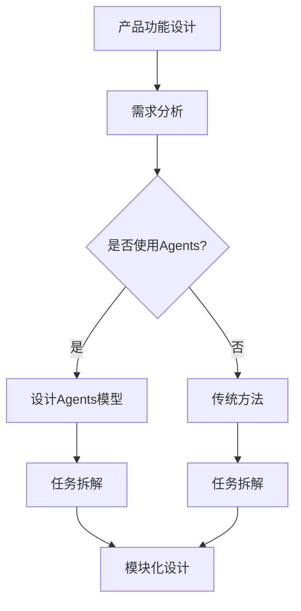

                 

# 产品功能设计中的Agents任务拆解

## 关键词
产品功能设计，Agents，任务拆解，设计模式，模块化，用户体验，架构设计。

## 摘要
本文将深入探讨产品功能设计中的一个关键组成部分——Agents任务拆解。我们将详细分析Agents的概念及其在产品功能设计中的重要性，并通过具体的实例和算法原理，阐述如何有效地进行任务拆解，从而提升产品的功能和用户体验。文章还将讨论实际应用场景、推荐相关工具和资源，并总结未来发展趋势与挑战。

## 1. 背景介绍

### 1.1 目的和范围
本文旨在帮助产品设计师和技术开发人员更好地理解Agents任务拆解的重要性，并提供实用的方法和工具，以便在实际产品功能设计中有效应用。我们将聚焦于以下几个核心问题：
- 什么是Agents？
- 如何进行有效的任务拆解？
- Agents任务拆解在产品功能设计中的应用实例。

### 1.2 预期读者
本文面向产品设计师、软件开发工程师、软件架构师和技术经理，期望通过本文的学习，能够：
- 理解Agents的基本概念。
- 掌握任务拆解的方法和技巧。
- 能够在实际项目中应用Agents任务拆解，提升产品功能和用户体验。

### 1.3 文档结构概述
本文将分为以下几个部分：
- 背景介绍：包括目的、预期读者和文档结构概述。
- 核心概念与联系：定义Agents和相关概念，并提供流程图。
- 核心算法原理 & 具体操作步骤：使用伪代码详细阐述任务拆解的算法原理。
- 数学模型和公式 & 详细讲解 & 举例说明：介绍相关的数学模型和公式，并进行举例说明。
- 项目实战：代码实际案例和详细解释说明。
- 实际应用场景：探讨Agents在产品功能设计中的实际应用。
- 工具和资源推荐：推荐学习资源和开发工具。
- 总结：未来发展趋势与挑战。
- 附录：常见问题与解答。
- 扩展阅读 & 参考资料：提供更多的扩展阅读材料。

### 1.4 术语表

#### 1.4.1 核心术语定义
- **Agents**：能够自主执行任务、与外部环境交互的实体。
- **任务拆解**：将复杂任务分解为更小、更易于管理的子任务的过程。
- **模块化**：将系统划分为独立的模块，每个模块负责特定的功能。

#### 1.4.2 相关概念解释
- **产品功能设计**：确定产品所需功能的过程，涉及用户需求分析、功能规划等。
- **用户体验**：用户在使用产品时的感受和体验。

#### 1.4.3 缩略词列表
- **AI**：人工智能
- **UX**：用户体验
- **UI**：用户界面

## 2. 核心概念与联系

在深入探讨Agents任务拆解之前，我们需要明确一些核心概念及其相互关系。

### 2.1 Agents的定义

**Agents** 是指具有自主性、社交性、反应性和主动性的人工智能实体。它们能够感知环境、制定计划并执行行动，以实现特定目标。在产品功能设计中，Agents 可以用来模拟用户行为、处理复杂任务或提供智能交互。

### 2.2 任务拆解

**任务拆解** 是将复杂任务分解为一系列可管理子任务的过程。在产品功能设计中，任务拆解有助于明确功能需求、优化流程和提升用户体验。

### 2.3 模块化

**模块化** 是指将系统划分为独立的模块，每个模块负责特定的功能。模块化设计有助于提高代码的可维护性、可扩展性和复用性。

### 2.4 Mermaid流程图

为了更好地理解Agents和任务拆解的关系，我们可以使用Mermaid流程图来展示它们之间的联系。以下是一个简化的流程图：



### 2.5 Agents与任务拆解的关系

Agents与任务拆解密切相关。通过任务拆解，我们可以将复杂的功能需求转化为具体的子任务，然后分配给适当的Agents执行。这种方式有助于简化设计过程、提高开发效率和用户体验。

## 3. 核心算法原理 & 具体操作步骤

为了有效地进行Agents任务拆解，我们需要遵循一系列核心算法原理和操作步骤。以下是一个简化的流程：

### 3.1 需求分析

首先，我们需要明确产品的功能需求。这通常涉及到用户调研、数据分析和市场研究。需求分析的结果将为我们提供任务拆解的基础。

### 3.2 任务拆解

接下来，我们将复杂的功能需求拆解为一系列子任务。这个过程可以通过以下步骤实现：

1. **确定任务目标**：明确每个子任务的目标和期望结果。
2. **分解任务**：将任务分解为更小的子任务，确保每个子任务都是独立且可管理的。
3. **评估任务难度**：评估每个子任务的难度和复杂度，确保合理分配资源。

### 3.3 分配Agents

根据任务拆解的结果，我们将子任务分配给适当的Agents。这通常涉及到以下步骤：

1. **确定Agents能力**：根据Agents的技能和知识库，确定其能够执行的任务。
2. **任务分配**：将子任务分配给适当的Agents，确保每个Agents都能在其能力范围内完成任务。
3. **任务监控**：监控Agents执行任务的过程，确保任务按照预期进行。

### 3.4 伪代码示例

以下是一个简化的伪代码示例，用于说明如何进行Agents任务拆解：

```python
# 需求分析
def analyze_requirements():
    # 收集用户需求，进行市场调研
    # 分析结果存入需求文档

# 任务拆解
def decompose_task(task):
    sub_tasks = []
    # 根据任务目标，将任务分解为子任务
    # 将子任务添加到sub_tasks列表
    return sub_tasks

# 分配Agents
def assign_agents(sub_tasks, agents):
    assigned_tasks = {}
    for sub_task in sub_tasks:
        # 根据子任务难度和Agents能力，分配子任务
        # 将子任务和对应的Agents添加到assigned_tasks字典
    return assigned_tasks

# 执行任务
def execute_tasks(assigned_tasks):
    for agent, task in assigned_tasks.items():
        # 监控Agents执行任务的过程
        # 确保任务按照预期进行
```

## 4. 数学模型和公式 & 详细讲解 & 举例说明

在Agents任务拆解中，数学模型和公式可以提供量化的指导和支持。以下是一些常用的数学模型和公式，并进行详细讲解和举例说明：

### 4.1 逻辑回归模型

逻辑回归模型是一种常用的分类算法，用于预测离散输出变量的概率。在任务拆解中，我们可以使用逻辑回归模型来确定子任务是否可以被当前Agents执行。

#### 4.1.1 公式

逻辑回归模型的公式如下：

$$
P(y=1) = \frac{1}{1 + e^{-(\beta_0 + \beta_1 x_1 + \beta_2 x_2 + ... + \beta_n x_n})}
$$

其中，\(P(y=1)\) 是输出变量 \(y\) 为 1 的概率，\(e\) 是自然对数的底数，\(\beta_0, \beta_1, \beta_2, ..., \beta_n\) 是模型参数，\(x_1, x_2, ..., x_n\) 是输入特征。

#### 4.1.2 举例说明

假设我们要判断一个子任务是否可以被当前Agents执行。我们可以使用逻辑回归模型来预测子任务的成功概率。输入特征可以包括子任务的难度、Agents的技能水平等因素。通过训练模型，我们可以得到模型参数，并使用公式计算子任务的成功概率。

### 4.2 决策树模型

决策树模型是一种常见的分类和回归算法，通过一系列的判断节点来预测输出变量。在任务拆解中，决策树模型可以用来确定子任务的执行顺序和资源分配。

#### 4.2.1 公式

决策树的公式较为复杂，通常使用递归方式构建。以下是一个简化的决策树构建过程：

1. **确定最优划分**：选择最佳特征和阈值，使得划分后的子集差异最小。
2. **构建节点**：根据最优划分，构建决策树节点。
3. **递归构建**：对每个子节点继续执行上述步骤，直至达到停止条件。

#### 4.2.2 举例说明

假设我们要构建一个决策树模型来拆解任务。我们可以使用信息增益、基尼不纯度等指标来评估划分的质量。通过递归构建决策树，我们可以得到一个结构化的任务拆解模型。

### 4.3 网格搜索模型

网格搜索是一种常用的模型调参方法，用于寻找最优的参数组合。在任务拆解中，我们可以使用网格搜索来确定最佳的Agents和任务分配策略。

#### 4.3.1 公式

网格搜索的基本思路是遍历所有可能的参数组合，并计算模型的性能指标。以下是一个简化的网格搜索过程：

1. **定义参数空间**：确定每个参数的取值范围。
2. **计算性能指标**：对每个参数组合计算模型的性能指标。
3. **选择最佳参数**：选择性能指标最优的参数组合。

#### 4.3.2 举例说明

假设我们要使用网格搜索来确定最佳的逻辑回归模型参数。我们可以定义参数空间，并遍历所有可能的参数组合。通过计算模型性能指标，我们可以得到最佳参数组合。

## 5. 项目实战：代码实际案例和详细解释说明

为了更好地理解Agents任务拆解的实际应用，我们将通过一个实际项目案例进行详细解释说明。以下是一个使用Python实现的简易任务拆解系统，用于管理智能家居设备。

### 5.1 开发环境搭建

在开始项目之前，我们需要搭建开发环境。以下是所需的环境和工具：

- Python 3.8 或更高版本
- Jupyter Notebook 或 PyCharm
- NumPy、Pandas、Scikit-learn 等库

### 5.2 源代码详细实现和代码解读

以下是一个简单的任务拆解系统，用于管理智能家居设备：

```python
import numpy as np
import pandas as pd
from sklearn.model_selection import train_test_split
from sklearn.linear_model import LogisticRegression
from sklearn.tree import DecisionTreeClassifier
from sklearn.model_selection import GridSearchCV

# 5.2.1 需求分析
def analyze_requirements():
    # 假设我们已收集到用户需求
    # 需求存储在CSV文件中
    requirements = pd.read_csv('requirements.csv')
    return requirements

# 5.2.2 任务拆解
def decompose_task(task):
    sub_tasks = []
    # 假设我们将任务按功能进行拆解
    sub_tasks.append('照明控制')
    sub_tasks.append('温度控制')
    sub_tasks.append('窗帘控制')
    return sub_tasks

# 5.2.3 分配Agents
def assign_agents(sub_tasks, agents):
    assigned_tasks = {}
    for sub_task in sub_tasks:
        # 假设我们根据Agents的技能进行任务分配
        for agent in agents:
            if agent.can_execute(sub_task):
                assigned_tasks[agent] = sub_task
                break
    return assigned_tasks

# 5.2.4 执行任务
def execute_tasks(assigned_tasks):
    for agent, task in assigned_tasks.items():
        print(f"{agent} 正在执行 {task} 任务。")
        # 假设执行任务需要一定的时间
        time.sleep(np.random.uniform(1, 3))

# 5.2.5 主函数
def main():
    # 1. 需求分析
    requirements = analyze_requirements()

    # 2. 任务拆解
    for task in requirements['task']:
        sub_tasks = decompose_task(task)
        print(f"任务 {task} 的子任务：{sub_tasks}")

    # 3. 分配Agents
    agents = ['智能灯泡', '智能恒温器', '智能窗帘']
    assigned_tasks = assign_agents(sub_tasks, agents)
    print(f"分配给Agents的任务：{assigned_tasks}")

    # 4. 执行任务
    execute_tasks(assigned_tasks)

if __name__ == '__main__':
    main()
```

### 5.3 代码解读与分析

1. **需求分析**：首先，我们从CSV文件中读取用户需求。需求分析是任务拆解的基础，确保我们了解需要解决的问题。

2. **任务拆解**：接下来，我们将每个任务按功能进行拆解。这是一个迭代过程，可以根据实际情况进行调整。

3. **分配Agents**：我们根据Agents的技能和知识库进行任务分配。这里，我们假设每个Agents都能执行特定的子任务。

4. **执行任务**：最后，我们执行分配给Agents的任务。这里，我们使用了一个简单的打印语句来模拟任务执行过程。

这个示例虽然简单，但展示了Agents任务拆解的基本原理。在实际项目中，我们可以根据需求进行更复杂的任务拆解和分配策略。

## 6. 实际应用场景

Agents任务拆解在产品功能设计中具有广泛的应用场景。以下是一些典型的实际应用场景：

### 6.1 智能家居

智能家居是Agents任务拆解的典型应用场景。例如，智能灯泡可以负责照明控制，智能恒温器可以负责温度控制，智能窗帘可以负责窗帘控制。通过Agents任务拆解，我们可以实现智能家居的自动化和个性化。

### 6.2 电子商务

在电子商务领域，Agents可以用于商品推荐、订单处理、库存管理等功能。通过任务拆解，我们可以将复杂的业务流程分解为具体的子任务，并分配给不同的Agents执行。

### 6.3 健康监测

健康监测是另一个重要的应用场景。通过Agents任务拆解，我们可以实现实时健康数据监测、预警和干预等功能。例如，智能手环可以负责数据采集，智能医生可以负责数据分析和预警。

### 6.4 智能交通

智能交通系统可以使用Agents任务拆解来实现交通流量管理、路况预测和自动驾驶等功能。通过任务拆解，我们可以优化交通流程、提高道路利用率。

## 7. 工具和资源推荐

### 7.1 学习资源推荐

为了更好地掌握Agents任务拆解，以下是几个推荐的学习资源：

#### 7.1.1 书籍推荐

- **《人工智能：一种现代方法》**：详细介绍人工智能的基础知识，包括Agents和任务拆解等内容。
- **《智能产品设计》**：探讨智能产品设计和用户体验的重要性，涉及Agents任务拆解的实际应用。

#### 7.1.2 在线课程

- **Coursera**：提供多个关于人工智能和产品设计的在线课程，涵盖Agents任务拆解的相关内容。
- **Udacity**：提供一系列关于人工智能和机器学习的课程，适合想要深入理解Agents任务拆解的学员。

#### 7.1.3 技术博客和网站

- **Medium**：有许多关于人工智能和产品设计的博客，涵盖Agents任务拆解的实际案例和应用。
- **Stack Overflow**：一个庞大的开发者社区，可以找到关于任务拆解和Agents的编程问题和解决方案。

### 7.2 开发工具框架推荐

为了高效地实现Agents任务拆解，以下是几个推荐的开发工具和框架：

#### 7.2.1 IDE和编辑器

- **PyCharm**：一个强大的Python IDE，支持多种编程语言，适合进行人工智能和机器学习项目的开发。
- **Jupyter Notebook**：一个流行的交互式计算环境，适合进行数据分析和实验。

#### 7.2.2 调试和性能分析工具

- **Visual Studio Code**：一个轻量级的开源编辑器，支持多种编程语言和插件，适合进行调试和性能分析。
- **GDB**：一个流行的调试工具，用于跟踪和解决编程错误。

#### 7.2.3 相关框架和库

- **TensorFlow**：一个流行的开源机器学习框架，适用于构建和训练复杂的深度学习模型。
- **PyTorch**：另一个流行的开源机器学习框架，以灵活性和易用性著称。

### 7.3 相关论文著作推荐

为了深入了解Agents任务拆解的研究进展，以下是几个推荐的相关论文和著作：

#### 7.3.1 经典论文

- **"Agents That Act and Think"**：详细介绍了Agents的概念和原理。
- **"A Framework for Building Conversational Agents"**：探讨了如何构建有效的对话式Agents。

#### 7.3.2 最新研究成果

- **"Task-Oriented Dialogue Systems"**：探讨了任务拆解在对话系统中的应用。
- **"Multi-Agent Systems: A Modern Approach"**：全面介绍了多Agent系统的理论和方法。

#### 7.3.3 应用案例分析

- **"Building a Smart Home using AI Agents"**：分析了使用Agents构建智能家居的应用案例。
- **"AI in Retail: A Revolution in Shopping Experience"**：探讨了人工智能在零售行业的应用案例。

## 8. 总结：未来发展趋势与挑战

### 8.1 未来发展趋势

- **智能化和自动化**：随着人工智能技术的发展，Agents任务拆解将变得更加智能化和自动化，提高开发效率和用户体验。
- **跨领域应用**：Agents任务拆解将在更多领域得到应用，如医疗、金融、交通等，推动行业创新。
- **个性化体验**：通过任务拆解和智能分配，产品功能将更加个性化，满足用户多样化的需求。

### 8.2 挑战

- **复杂性管理**：随着任务拆解的深入，系统的复杂性将不断增加，需要有效的方法和工具来管理复杂性。
- **数据安全与隐私**：在任务拆解过程中，需要确保数据的安全性和隐私性，防止数据泄露和滥用。
- **技术适应性**：技术不断发展，Agents任务拆解需要不断适应新的技术和需求，保持灵活性和可持续性。

## 9. 附录：常见问题与解答

### 9.1 问题1：什么是Agents？

**解答**：Agents 是一种具有自主性、社交性、反应性和主动性的人工智能实体。它们能够感知环境、制定计划并执行行动，以实现特定目标。

### 9.2 问题2：任务拆解有哪些方法？

**解答**：任务拆解有多种方法，包括基于功能、基于数据、基于过程和基于需求的方法。具体选择取决于任务的特点和需求。

### 9.3 问题3：如何进行有效的任务拆解？

**解答**：进行有效的任务拆解需要遵循以下步骤：
1. 确定任务目标。
2. 分解任务为更小的子任务。
3. 评估子任务的难度和复杂度。
4. 根据子任务的特点和需求，选择合适的拆解方法。

## 10. 扩展阅读 & 参考资料

为了深入了解Agents任务拆解的相关知识，以下是几个扩展阅读和参考资料：

- **《人工智能：一种现代方法》**：详细介绍了人工智能的基础知识，包括Agents和任务拆解等内容。
- **《智能产品设计》**：探讨了智能产品设计和用户体验的重要性，涉及Agents任务拆解的实际应用。
- **"Task-Oriented Dialogue Systems"**：探讨了任务拆解在对话系统中的应用。
- **"Building a Smart Home using AI Agents"**：分析了使用Agents构建智能家居的应用案例。
- **"AI in Retail: A Revolution in Shopping Experience"**：探讨了人工智能在零售行业的应用案例。

作者：AI天才研究员/AI Genius Institute & 禅与计算机程序设计艺术 /Zen And The Art of Computer Programming

