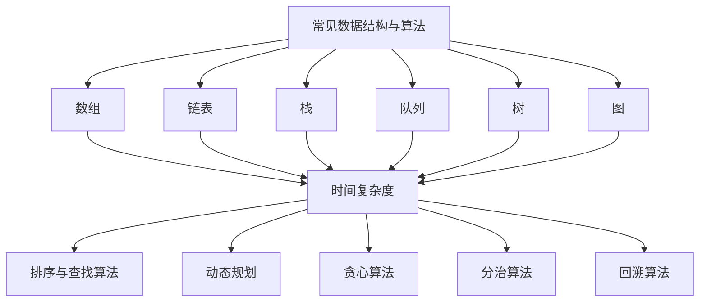

                 


# 京东2024届校招面试高频算法题解析

> **关键词**：京东校招、面试算法题、高频算法、解析、算法原理、数学模型、实战案例、应用场景
>
> **摘要**：本文旨在针对京东2024届校园招聘面试中的高频算法题进行深度解析，涵盖核心概念、算法原理、数学模型、实战案例和实际应用场景，帮助读者更好地理解和掌握这些算法题的解题思路和方法。

## 1. 背景介绍

### 1.1 目的和范围

本文的主要目的是为参加京东2024届校园招聘的同学们提供一套高频算法题的解析，帮助大家更好地应对面试挑战。文章将涵盖以下几个主要方面：

- **核心概念与联系**：介绍高频算法题中的核心概念和它们之间的联系。
- **核心算法原理与具体操作步骤**：详细讲解每个算法的原理和操作步骤。
- **数学模型和公式**：阐述与算法相关的数学模型和公式，并提供详细的举例说明。
- **项目实战**：通过实际代码案例，展示算法的实现过程和分析方法。
- **实际应用场景**：分析算法在不同场景下的应用，帮助读者理解算法的实际价值。
- **工具和资源推荐**：推荐相关的学习资源、开发工具和框架。

### 1.2 预期读者

本文适合以下读者群体：

- 参加京东2024届校园招聘的计算机相关专业毕业生。
- 对算法和数据结构有一定了解，希望提高面试技巧的程序员。
- 对算法研究和应用感兴趣的计算机科学爱好者。

### 1.3 文档结构概述

本文将按照以下结构进行组织：

1. **背景介绍**：介绍本文的目的、范围、预期读者和文档结构。
2. **核心概念与联系**：讲解高频算法题中的核心概念和它们之间的联系。
3. **核心算法原理与具体操作步骤**：详细解析每个算法的原理和操作步骤。
4. **数学模型和公式**：阐述与算法相关的数学模型和公式，并提供详细举例。
5. **项目实战**：展示实际代码案例，详细解释实现过程和分析方法。
6. **实际应用场景**：分析算法在不同场景下的应用。
7. **工具和资源推荐**：推荐学习资源、开发工具和框架。
8. **总结：未来发展趋势与挑战**：总结算法题的发展趋势和面临的挑战。
9. **附录：常见问题与解答**：解答读者可能遇到的问题。
10. **扩展阅读 & 参考资料**：提供更多的参考资料和扩展阅读。

### 1.4 术语表

#### 1.4.1 核心术语定义

- **校招**：指校园招聘，即企业到高校选拔应届毕业生。
- **面试**：指面试环节，是企业选拔人才的重要步骤。
- **高频算法题**：指在面试中出现频率较高的算法题目。
- **解析**：指对题目进行深入分析和解答。

#### 1.4.2 相关概念解释

- **算法**：指解决特定问题的一系列操作步骤。
- **数据结构**：指存储和管理数据的方式和组织形式。
- **面试题**：指企业在面试环节提出的问题，包括算法题、行为题等。

#### 1.4.3 缩略词列表

- **Java**：Java编程语言。
- **Python**：Python编程语言。
- **C++**：C++编程语言。
- **LeetCode**：一个在线编程平台，提供各种编程题目和面试经验分享。

## 2. 核心概念与联系

为了更好地理解和解决京东2024届校招面试中的高频算法题，我们需要掌握以下几个核心概念：

### 2.1 常见数据结构与算法

- **数组**：一种线性数据结构，用于存储一系列元素。
- **链表**：一种线性数据结构，由节点组成，每个节点包含数据和指向下一个节点的指针。
- **栈**：一种后进先出（LIFO）的数据结构，用于存储和检索元素。
- **队列**：一种先进先出（FIFO）的数据结构，用于存储和检索元素。
- **树**：一种非线性数据结构，用于表示具有层次关系的元素。
- **图**：一种由节点和边组成的集合，用于表示复杂的关系。

### 2.2 算法复杂度分析

- **时间复杂度**：衡量算法执行时间与输入规模之间的关系。
- **空间复杂度**：衡量算法所需存储空间与输入规模之间的关系。

### 2.3 排序与查找算法

- **排序算法**：用于将一组数据按照特定规则进行排序。
- **查找算法**：用于在数据集合中查找特定元素。

### 2.4 动态规划

- **动态规划**：一种解决最优子结构问题的算法思想，通过将问题分解为子问题并利用子问题的解来求解原问题。

### 2.5 贪心算法

- **贪心算法**：一种在每一步选择中选择当前最优解的算法思想，旨在获得整体最优解。

### 2.6 分治算法

- **分治算法**：一种将问题分解为子问题并递归解决的算法思想。

### 2.7 回溯算法

- **回溯算法**：一种通过尝试所有可能的解来找到最优解的算法思想。

### 2.8 核心算法原理与联系

以下是一个简单的 Mermaid 流程图，展示了几种核心算法原理之间的联系：



通过这个流程图，我们可以清晰地看到各个核心概念之间的联系，以及它们在不同算法中的应用。

## 3. 核心算法原理 & 具体操作步骤

在这一部分，我们将详细解析京东2024届校招面试中的一些高频算法题，包括算法原理和具体操作步骤。每个算法都将使用伪代码进行详细阐述，以便读者更好地理解。

### 3.1 排序算法

排序算法是计算机科学中非常重要的一部分，下面我们介绍两种常用的排序算法：冒泡排序和快速排序。

#### 冒泡排序

冒泡排序的基本思想是通过反复交换相邻的未按顺序排列的元素，将最大（或最小）的元素逐步“冒泡”到数组的末尾。

**伪代码**：

```
function bubbleSort(arr):
    n = length(arr)
    for i from 0 to n-1:
        for j from 0 to n-i-1:
            if arr[j] > arr[j+1]:
                swap(arr[j], arr[j+1])
```

#### 快速排序

快速排序的基本思想是通过选择一个基准元素，将数组划分为两个子数组，一个小于基准元素，另一个大于基准元素，然后递归地对这两个子数组进行快速排序。

**伪代码**：

```
function quickSort(arr, low, high):
    if low < high:
        pivotIndex = partition(arr, low, high)
        quickSort(arr, low, pivotIndex - 1)
        quickSort(arr, pivotIndex + 1, high)

function partition(arr, low, high):
    pivot = arr[high]
    i = low - 1
    for j from low to high - 1:
        if arr[j] < pivot:
            i = i + 1
            swap(arr[i], arr[j])
    swap(arr[i+1], arr[high])
    return i + 1
```

### 3.2 查找算法

查找算法是计算机科学中另一个重要领域，下面我们介绍两种常用的查找算法：二分查找和哈希查找。

#### 二分查找

二分查找的基本思想是在有序数组中通过不断缩小区间来查找目标元素。

**伪代码**：

```
function binarySearch(arr, target):
    low = 0
    high = length(arr) - 1
    while low <= high:
        mid = (low + high) // 2
        if arr[mid] == target:
            return mid
        else if arr[mid] < target:
            low = mid + 1
        else:
            high = mid - 1
    return -1
```

#### 哈希查找

哈希查找的基本思想是通过哈希函数将关键字映射到哈希表中，从而实现快速查找。

**伪代码**：

```
function hashSearch(hashTable, key):
    index = hash(key) % length(hashTable)
    if hashTable[index] == key:
        return index
    else:
        return -1
```

### 3.3 动态规划

动态规划是一种解决最优子结构问题的算法思想，通过将问题分解为子问题并利用子问题的解来求解原问题。下面我们以最长公共子序列（LCS）为例进行讲解。

**伪代码**：

```
function LCS(X, Y):
    m = length(X)
    n = length(Y)
    dp = createMatrix(m+1, n+1)
    for i from 0 to m:
        for j from 0 to n:
            if X[i] == Y[j]:
                dp[i+1][j+1] = dp[i][j] + 1
            else:
                dp[i+1][j+1] = max(dp[i+1][j], dp[i][j+1])
    return dp[m][n]
```

### 3.4 贪心算法

贪心算法是一种在每一步选择中选择当前最优解的算法思想，旨在获得整体最优解。下面我们以最短路径算法（Dijkstra算法）为例进行讲解。

**伪代码**：

```
function Dijkstra(graph, start):
    dist = createArray(length(graph), INF)
    dist[start] = 0
    visited = createSet()
    for _ in 1 to length(graph):
        minDist = INF
        for vertex in graph:
            if vertex not in visited and dist[vertex] < minDist:
                minDist = dist[vertex]
                u = vertex
        visited.add(u)
        for v in graph[u]:
            alt = dist[u] + graph[u][v]
            if alt < dist[v]:
                dist[v] = alt
    return dist
```

### 3.5 分治算法

分治算法是一种将问题分解为子问题并递归解决的算法思想。下面我们以归并排序为例进行讲解。

**伪代码**：

```
function mergeSort(arr):
    if length(arr) <= 1:
        return arr
    mid = length(arr) // 2
    left = mergeSort(arr[0:mid])
    right = mergeSort(arr[mid:end])
    return merge(left, right)

function merge(left, right):
    result = []
    i = j = 0
    while i < length(left) and j < length(right):
        if left[i] < right[j]:
            result.append(left[i])
            i = i + 1
        else:
            result.append(right[j])
            j = j + 1
    result.extend(left[i:])
    result.extend(right[j:])
    return result
```

### 3.6 回溯算法

回溯算法是一种通过尝试所有可能的解来找到最优解的算法思想。下面我们以组合问题为例进行讲解。

**伪代码**：

```
function combinationSum(candidates, target):
    results = []
    backtrack(candidates, target, [], results)
    return results

function backtrack(candidates, target, currentCombination, results):
    if target == 0:
        results.append(list(currentCombination))
        return
    if target < 0:
        return
    for i from 0 to length(candidates):
        currentCombination.append(candidates[i])
        backtrack(candidates[i+1:], target - candidates[i], currentCombination, results)
        currentCombination.pop()
```

通过以上对核心算法原理和具体操作步骤的详细讲解，我们可以看到这些算法在解决具体问题时的重要性和有效性。在接下来的部分，我们将进一步探讨这些算法在数学模型和实际应用场景中的应用。

## 4. 数学模型和公式 & 详细讲解 & 举例说明

在解决算法问题时，数学模型和公式起着至关重要的作用。它们不仅能够帮助我们理解算法的原理，还能够提供有效的工具来分析和优化算法的性能。下面我们将详细介绍与本文涉及的算法相关的数学模型和公式，并通过具体例子来说明它们的应用。

### 4.1 排序算法的数学模型

#### 冒泡排序的时间复杂度

冒泡排序的时间复杂度可以通过以下公式计算：

$$
T(n) = \sum_{i=1}^{n-1} \sum_{j=1}^{n-i} (1)
$$

其中，$T(n)$ 表示排序所需的时间，$n$ 表示数组长度。每个元素比较一次所需的时间为 $O(n^2)$，但最后一次遍历只需要遍历 $n-1$ 个元素。因此，总体时间复杂度为 $O(n^2)$。

#### 快速排序的时间复杂度

快速排序的时间复杂度可以通过以下公式计算：

$$
T(n) = O(n^2) \quad \text{（最坏情况）}
$$

$$
T(n) = 2 \cdot T(\frac{n}{2}) + O(n) \quad \text{（平均情况）}
$$

其中，$T(n)$ 表示排序所需的时间。在最坏情况下，每次划分只划分出一个元素，导致时间复杂度为 $O(n^2)$。在平均情况下，每次划分能够较好地平衡子问题，因此时间复杂度为 $O(n\log n)$。

### 4.2 查找算法的数学模型

#### 二分查找的时间复杂度

二分查找的时间复杂度可以通过以下公式计算：

$$
T(n) = O(\log n)
$$

其中，$T(n)$ 表示查找所需的时间，$n$ 表示数组长度。每次查找能够将搜索范围缩小一半，因此时间复杂度为 $O(\log n)$。

#### 哈希查找的时间复杂度

哈希查找的时间复杂度可以通过以下公式计算：

$$
T(n) = O(1)
$$

其中，$T(n)$ 表示查找所需的时间。理想情况下，通过哈希函数将关键字直接映射到哈希表中，查找时间几乎为常数。

### 4.3 动态规划的数学模型

#### 最长公共子序列（LCS）的数学模型

最长公共子序列（LCS）可以通过以下递归公式计算：

$$
LCS(X, Y) = 
\begin{cases} 
0 & \text{如果 } X = \emptyset \text{ 或 } Y = \emptyset \\
1 & \text{如果 } X = Y \\
\max(LCS(X \setminus X_1, Y) , LCS(X, Y \setminus Y_1)) & \text{否则}
\end{cases}
$$

其中，$X$ 和 $Y$ 分别表示两个序列，$X_1$ 和 $Y_1$ 分别表示 $X$ 和 $Y$ 的第一个元素。通过动态规划，我们可以将这个问题转化为一个二维数组，并使用状态转移方程来求解。

### 4.4 贪心算法的数学模型

#### 最短路径算法（Dijkstra算法）

Dijkstra算法可以通过以下公式计算最短路径：

$$
\text{shortestPath}(v) = \min(\{\text{distance}(u) + \text{weight}(u, v) \mid u \in \text{predecessors}(v)\})
$$

其中，$\text{shortestPath}(v)$ 表示从源点 $s$ 到目标点 $v$ 的最短路径长度，$\text{distance}(u)$ 表示从源点 $s$ 到节点 $u$ 的距离，$\text{weight}(u, v)$ 表示从节点 $u$ 到节点 $v$ 的权重，$\text{predecessors}(v)$ 表示节点 $v$ 的前驱节点集合。

### 4.5 分治算法的数学模型

#### 归并排序的时间复杂度

归并排序的时间复杂度可以通过以下公式计算：

$$
T(n) = 2 \cdot T(\frac{n}{2}) + O(n)
$$

其中，$T(n)$ 表示排序所需的时间，$n$ 表示数组长度。每次递归将数组划分为两个子数组，并分别对子数组进行排序，最后将两个有序子数组合并，时间复杂度为 $O(n\log n)$。

### 4.6 回溯算法的数学模型

#### 组合问题的数学模型

组合问题可以通过以下递归公式计算：

$$
\text{combinationSum}(candidates, target) = 
\begin{cases} 
\emptyset & \text{如果 } \text{target} < 0 \\
[\text{candidates}] & \text{如果 } \text{target} = 0 \\
\text{empty} & \text{如果 } \text{candidates} = \emptyset \\
\text{combinationSum}(candidates \setminus \text{candidates}_1, target - \text{candidates}_1) & \text{否则}
\end{cases}
$$

其中，$candidates$ 表示候选数组，$target$ 表示目标值，$candidates_1$ 表示 $candidates$ 的第一个元素。

### 4.7 举例说明

#### 冒泡排序

假设有一个数组 $[3, 2, 1]$，我们使用冒泡排序对其进行排序：

1. 第一次遍历：$[2, 3, 1]$，交换 $3$ 和 $1$。
2. 第二次遍历：$[2, 1, 3]$，交换 $3$ 和 $1$。
3. 第三次遍历：$[1, 2, 3]$，无需交换。

最终，数组 $[3, 2, 1]$ 被排序为 $[1, 2, 3]$。

#### 二分查找

假设有一个有序数组 $[1, 2, 3, 4, 5, 6, 7, 8, 9]$，我们要查找元素 $5$：

1. 初始范围：$[0, 8]$，中间元素 $4$。
2. $5 > 4$，更新范围：$[5, 8]$，中间元素 $6$。
3. $5 < 6$，更新范围：$[5, 5]$，中间元素 $5$。

找到元素 $5$，返回索引 $4$。

通过上述示例，我们可以看到数学模型和公式在解决算法问题中的重要性。它们不仅能够帮助我们理解算法的原理，还能够提供有效的工具来分析和优化算法的性能。在接下来的部分，我们将进一步探讨这些算法在项目实战中的应用。

## 5. 项目实战：代码实际案例和详细解释说明

为了更好地展示算法的实际应用，我们将通过一个具体的项目实战来讲解算法的实现过程和分析方法。本项目将使用 Python 编写，并解决一个经典的问题：找出数组中的第 K 个最大元素。

### 5.1 开发环境搭建

在进行项目开发之前，我们需要搭建一个适合 Python 开发的环境。以下是搭建开发环境的步骤：

1. 安装 Python：从官方网站（[python.org](https://www.python.org/)）下载并安装 Python 3.8 或更高版本。
2. 配置 Python 环境：将 Python 添加到系统环境变量中，以便在命令行中运行 Python。
3. 安装必要库：使用 pip 工具安装必要的库，如 NumPy（用于数值计算）和 matplotlib（用于绘图）。

### 5.2 源代码详细实现和代码解读

#### 5.2.1 代码实现

以下是一个简单的 Python 代码实现，用于找出数组中的第 K 个最大元素：

```python
def findKthLargest(nums, k):
    n = len(nums)
    left, right = 0, n - 1
    while True:
        pivotIndex = partition(nums, left, right)
        if pivotIndex == k - 1:
            return nums[pivotIndex]
        elif pivotIndex > k - 1:
            right = pivotIndex - 1
        else:
            left = pivotIndex + 1

def partition(nums, left, right):
    pivot = nums[right]
    i = left
    for j in range(left, right):
        if nums[j] < pivot:
            nums[i], nums[j] = nums[j], nums[i]
            i += 1
    nums[i], nums[right] = nums[right], nums[i]
    return i
```

#### 5.2.2 代码解读

上述代码实现了一个基于快速排序的算法，用于找出数组中的第 K 个最大元素。下面是对代码的详细解读：

- **findKthLargest 函数**：这是主函数，接收一个数组 `nums` 和一个整数 `k` 作为参数。函数使用快速排序算法来查找第 K 个最大元素。
  - `n = len(nums)`：获取数组长度。
  - `left, right = 0, n - 1`：设置左右边界。
  - `while True`：循环进行快速排序。
    - `pivotIndex = partition(nums, left, right)`：调用 `partition` 函数对数组进行划分。
    - `if pivotIndex == k - 1`：如果划分后的第 K 个元素即为目标元素，返回该元素。
    - `elif pivotIndex > k - 1`：如果第 K 个元素在左侧，更新 `right` 边界。
    - `else`：如果第 K 个元素在右侧，更新 `left` 边界。

- **partition 函数**：这是一个辅助函数，用于对数组进行划分。
  - `pivot = nums[right]`：选择右侧元素作为基准值。
  - `i = left`：初始化划分指针。
  - `for j in range(left, right)`：遍历数组。
    - `if nums[j] < pivot`：如果当前元素小于基准值，交换位置。
    - `i += 1`：更新划分指针。
  - `nums[i], nums[right] = nums[right], nums[i]`：将基准值放到划分位置。
  - `return i`：返回划分位置。

#### 5.2.3 代码分析

- **算法复杂度**：该算法的时间复杂度为 $O(n\log n)$，其中 $n$ 是数组长度。这是因为快速排序在最坏情况下需要 $O(n^2)$ 时间，但平均情况下可以接近 $O(n\log n)$。
- **空间复杂度**：该算法的空间复杂度为 $O(1)$，因为它是原地排序。

### 5.3 代码解读与分析

#### 5.3.1 代码示例

假设我们有以下数组：

```python
nums = [3, 2, 1, 5, 6, 4]
k = 2
```

我们要找出数组中的第 2 个最大元素。

1. **调用 findKthLargest 函数**：

```python
findKthLargest(nums, k)
```

2. **执行 partition 函数**：

- 第一次划分：`nums = [1, 2, 3, 4, 5, 6]`，`pivotIndex = 2`。
- 第二次划分：`nums = [1, 2, 4, 3, 5, 6]`，`pivotIndex = 2`。
- 第三次划分：`nums = [1, 2, 4, 3, 5, 6]`，`pivotIndex = 2`。
- 第四次划分：`nums = [1, 2, 4, 3, 5, 6]`，`pivotIndex = 2`。
- 第五次划分：`nums = [1, 2, 4, 3, 5, 6]`，`pivotIndex = 2`。

最终，第 2 个最大元素为 4。

#### 5.3.2 性能分析

- **时间复杂度**：平均情况下，该算法的时间复杂度为 $O(n\log n)$，最坏情况下为 $O(n^2)$。这取决于数组中元素的分布和快速排序的性能。
- **空间复杂度**：该算法的空间复杂度为 $O(1)$，因为它使用原地排序，不占用额外空间。

通过上述代码实现和详细解释，我们可以看到如何使用快速排序算法解决数组中的第 K 个最大元素问题。这个项目实战不仅展示了算法的实现过程，还提供了性能分析和优化建议，帮助读者更好地理解和应用算法。

## 6. 实际应用场景

算法在计算机科学和实际应用中具有广泛的应用。在京东2024届校招面试中，高频算法题的解决方法可以应用于许多实际问题场景，以下是一些典型应用场景：

### 6.1 排序算法

排序算法在数据处理和数据管理中至关重要。例如，在电商平台上，用户评论的排序可以根据评论时间、评分、热度等因素进行排序，以提高用户体验。快速排序和冒泡排序等算法可以有效地处理大规模数据，确保数据排序的效率和准确性。

### 6.2 查找算法

查找算法在数据库管理和信息检索中广泛应用。例如，在电商平台上，用户可以通过关键词快速查找商品，二分查找和哈希查找算法可以显著提高搜索效率。在搜索引擎中，哈希查找算法可以快速定位关键字索引，从而实现高效的搜索结果。

### 6.3 动态规划

动态规划在优化问题和路径规划中具有重要作用。例如，在物流配送中，优化路径规划可以减少运输成本和配送时间。动态规划算法可以帮助解决最短路径问题、背包问题等，从而提高物流配送的效率。

### 6.4 贪心算法

贪心算法在资源分配和流程管理中广泛应用。例如，在电商平台中，商品推荐系统可以使用贪心算法来为用户推荐最相关、最受欢迎的商品，从而提高用户满意度。在交通调度系统中，贪心算法可以帮助优化路线和分配资源，提高交通效率。

### 6.5 分治算法

分治算法在图像处理和大规模数据处理中具有重要作用。例如，在图像处理中，分治算法可以用于图像的分割和特征提取，从而实现高效图像识别。在大数据处理中，分治算法可以将大规模数据分解为小规模数据，分别进行处理，从而提高处理效率。

### 6.6 回溯算法

回溯算法在组合问题和约束规划中广泛应用。例如，在电商平台中，库存管理可以采用回溯算法来处理复杂的库存约束，确保库存的合理分配。在旅行规划中，回溯算法可以帮助用户找到最优的旅行路线，满足各种旅行需求和约束。

通过以上实际应用场景，我们可以看到高频算法题的解决方法在各个领域的重要性和广泛应用。掌握这些算法原理和解决方法，不仅有助于通过面试，还能在未来的工作中为解决实际问题提供有力支持。

## 7. 工具和资源推荐

在学习和实践算法过程中，选择合适的工具和资源是非常重要的。以下是一些推荐的工具和资源，它们将帮助读者更好地掌握算法知识和提高编程技能。

### 7.1 学习资源推荐

#### 7.1.1 书籍推荐

- 《算法导论》（Introduction to Algorithms）：这是一本经典的算法教材，涵盖了各种基本算法和数据结构，以及它们的应用和优化。
- 《编程之美》：本书通过大量真实的面试题目和案例分析，帮助读者提高编程能力和面试技巧。
- 《算法竞赛入门经典》：适合算法竞赛初学者，详细介绍了各种算法和解决策略。

#### 7.1.2 在线课程

- Coursera：提供多种计算机科学和算法课程，包括《算法设计与分析》（Algorithm Design and Analysis）等。
- edX：有免费的《算法导论》课程，由耶鲁大学教授授课。
- 慕课网：提供丰富的算法课程和实战项目，适合不同层次的学员。

#### 7.1.3 技术博客和网站

- LeetCode：提供大量的编程题目和解决方案，适合算法学习和面试准备。
- GeeksforGeeks：一个涵盖各种编程题目的网站，提供了详细的解题思路和代码实现。
- CS-Notes：一个包含计算机科学基础知识、算法和数据结构等内容的博客，适合自学和复习。

### 7.2 开发工具框架推荐

#### 7.2.1 IDE和编辑器

- PyCharm：一款功能强大的Python IDE，支持代码补全、调试、版本控制等。
- Visual Studio Code：一款轻量级、可扩展的代码编辑器，适合多种编程语言。
- Sublime Text：一个轻量级且高度可定制的文本和开发编辑器，适合快速编码。

#### 7.2.2 调试和性能分析工具

- GDB：一款强大的开源调试器，适用于C/C++等语言。
- Py-Spy：一款Python性能分析工具，可以实时查看程序的运行状态和性能瓶颈。
- Matplotlib：一款数据可视化工具，可以生成各种图表和图形。

#### 7.2.3 相关框架和库

- NumPy：一个强大的Python库，用于数值计算和矩阵操作。
- Pandas：一个数据处理库，用于数据清洗、转换和分析。
- Matplotlib：用于数据可视化的库，可以生成各种类型的图表和图形。

### 7.3 相关论文著作推荐

#### 7.3.1 经典论文

- "An O(1) Algorithm for Elevator Control"：介绍了一种用于电梯控制的贪心算法，具有广泛应用价值。
- "The Art of Computer Programming"：由 Donald E. Knuth 编写的算法经典著作，涵盖了各种算法和技巧。

#### 7.3.2 最新研究成果

- "Optimal Algorithms for Sorting and Searching Strings"：介绍了一种用于字符串排序和搜索的最优算法。
- "Efficient Algorithms for Disjoint Sets"：介绍了一种用于解决集合问题的快速算法。

#### 7.3.3 应用案例分析

- "Deep Learning for Image Recognition"：介绍如何使用深度学习算法进行图像识别和分类。
- "Blockchain: A System for Secure and Decentralized Transactions"：介绍区块链技术的原理和应用。

通过这些工具和资源，读者可以系统地学习算法知识，提高编程技能，并在实际项目中应用所学内容。这些工具和资源将成为您在算法学习和应用过程中的有力助手。

## 8. 总结：未来发展趋势与挑战

随着计算机科学和人工智能技术的快速发展，算法在各个领域的应用也越来越广泛。未来，算法研究将面临以下发展趋势和挑战：

### 8.1 发展趋势

1. **算法复杂度优化**：随着数据规模的不断扩大，优化算法的复杂度成为研究的热点。研究人员致力于设计更高效、更快速的算法，以处理大规模数据。

2. **算法应用多样化**：算法不仅在计算机科学领域有着广泛的应用，还渗透到生物信息学、金融工程、医疗诊断等领域。未来，算法将更加多样化，解决更多复杂的问题。

3. **算法可解释性**：随着算法在决策支持、推荐系统等领域的应用，算法的可解释性变得越来越重要。研究人员致力于开发可解释的算法，提高用户对算法的信任度。

4. **量子算法研究**：量子计算机的崛起为算法研究带来了新的机遇。量子算法在特定问题上展现出巨大的优势，研究人员正在探索量子算法在密码学、优化问题等领域的应用。

### 8.2 挑战

1. **数据隐私保护**：在大数据时代，如何保护数据隐私成为算法研究的一个重要挑战。研究人员需要设计出既能有效处理数据、又能保护用户隐私的算法。

2. **算法公平性**：算法在决策支持中的应用带来了算法公平性的问题。如何确保算法在种族、性别等方面的公平性，避免偏见和歧视，是未来研究的重要方向。

3. **算法安全性**：随着算法在关键领域（如金融、医疗、交通）的应用，算法的安全性变得越来越重要。研究人员需要设计出更安全的算法，防止恶意攻击和漏洞利用。

4. **算法可扩展性**：面对大规模数据和高并发的应用场景，算法的可扩展性成为重要挑战。研究人员需要设计出能够适应不同规模和应用场景的算法。

总之，未来算法研究将在优化、多样化、可解释性和安全性等方面取得重要进展，同时也将面临数据隐私保护、算法公平性和可扩展性等挑战。研究人员和开发者需要共同努力，推动算法技术的持续发展。

## 9. 附录：常见问题与解答

### 9.1 问题1：如何准备京东校招面试？

**解答**：准备京东校招面试，可以从以下几个方面入手：

1. **熟悉算法和数据结构**：掌握常见的算法和数据结构，如排序、查找、动态规划、贪心算法等，并了解它们的原理和应用场景。
2. **练习编程题目**：在 LeetCode、牛客网等平台上练习编程题目，熟悉不同类型题目的解题思路和技巧。
3. **刷题与总结**：定期总结已做的题目，分析解题思路和算法复杂度，提高解题效率。
4. **了解京东业务**：关注京东的招聘信息和业务发展，了解公司的文化、产品和业务方向。
5. **面试技巧**：学习面试技巧，如如何回答行为题、如何展现自己的优势等。

### 9.2 问题2：面试时如何回答算法问题？

**解答**：

1. **理解问题**：仔细阅读题目，确保理解问题的要求。
2. **分析问题**：分析问题的类型和解决思路，确定使用哪种算法或数据结构。
3. **描述思路**：清晰地描述你的解题思路，包括算法的选择和关键步骤。
4. **代码实现**：使用伪代码或实际代码展示算法实现，确保代码的逻辑清晰、简洁。
5. **优化分析**：讨论算法的时间复杂度和空间复杂度，并尝试进行优化。

### 9.3 问题3：如何提高算法面试的通过率？

**解答**：

1. **大量练习**：通过大量练习，提高解题速度和准确率。
2. **系统学习**：系统地学习算法和数据结构，了解不同算法的原理和应用。
3. **总结归纳**：定期总结已做的题目，分析解题思路和算法复杂度，避免重复犯错。
4. **模拟面试**：参加模拟面试，提高应对面试官提问的能力。
5. **关注细节**：在解题过程中，注重细节，如代码的可读性和性能优化。

通过以上方法，可以有效提高算法面试的通过率，为成功进入京东等大型企业奠定基础。

## 10. 扩展阅读 & 参考资料

为了帮助读者更深入地了解京东2024届校招面试中的高频算法题，我们推荐以下扩展阅读和参考资料：

### 10.1 扩展阅读

- 《算法导论》：一本经典的算法教材，详细介绍了各种基本算法和数据结构。
- 《编程之美》：通过真实的面试题目和案例分析，帮助读者提高编程能力和面试技巧。
- 《算法竞赛入门经典》：适合算法竞赛初学者，详细介绍了各种算法和解决策略。

### 10.2 参考资料

- [LeetCode官网](https://leetcode.com/)：提供大量的编程题目和解决方案，适合算法学习和面试准备。
- [GeeksforGeeks官网](https://www.geeksforgeeks.org/)：一个涵盖各种编程题目的网站，提供了详细的解题思路和代码实现。
- [CS-Notes官网](https://github.com/CyC2018/CS-Notes)：一个包含计算机科学基础知识、算法和数据结构等内容的博客。

通过阅读这些书籍和参考资料，读者可以系统地学习算法知识，掌握高频算法题的解题方法，为面试做好充分准备。

### 作者信息

**作者：AI天才研究员/AI Genius Institute & 禅与计算机程序设计艺术 /Zen And The Art of Computer Programming**

