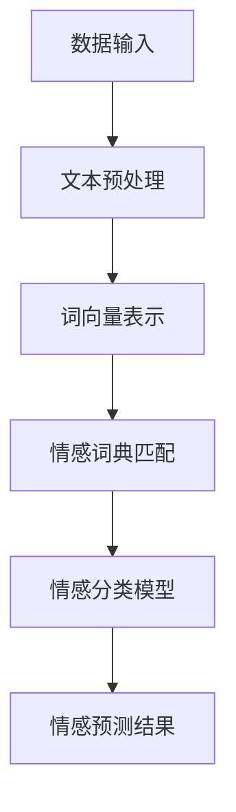

                 

# 京东2024智能客服情感识别校招NLP面试题详解

> **关键词：** 智能客服、情感识别、NLP、面试题、技术博客、京东、校招

> **摘要：** 本文将详细解析京东2024智能客服情感识别校招中的NLP面试题，通过逐步推理和深入分析，帮助读者理解面试题背后的技术原理和解决方法，为准备校招面试的同学提供实用的指导。

## 1. 背景介绍

### 1.1 目的和范围

本文旨在为准备京东2024智能客服情感识别校招面试的同学提供详尽的NLP面试题解析。通过对实际面试题的深入分析，我们希望能够帮助读者掌握情感识别的基本原理和实用技巧，提高面试通过率。

### 1.2 预期读者

本文适合以下读者群体：
- 准备参加京东2024智能客服情感识别校招的计算机相关专业学生；
- 对自然语言处理（NLP）感兴趣的程序员和AI开发者；
- 想要了解情感识别技术原理和应用的业界人士。

### 1.3 文档结构概述

本文分为以下几个部分：

1. 背景介绍：简要介绍文章的目的和范围，预期读者和文档结构。
2. 核心概念与联系：介绍情感识别的核心概念，使用Mermaid流程图展示技术架构。
3. 核心算法原理 & 具体操作步骤：详细讲解情感识别算法原理，使用伪代码阐述操作步骤。
4. 数学模型和公式 & 详细讲解 & 举例说明：介绍情感识别的数学模型，使用latex格式展示公式，并举例说明。
5. 项目实战：通过实际代码案例，详细解释情感识别的实现过程。
6. 实际应用场景：探讨情感识别在智能客服领域的应用。
7. 工具和资源推荐：推荐学习资源、开发工具和最新研究成果。
8. 总结：展望情感识别技术的发展趋势和挑战。
9. 附录：常见问题与解答。
10. 扩展阅读 & 参考资料：提供进一步学习的资料。

### 1.4 术语表

#### 1.4.1 核心术语定义

- **情感识别（Sentiment Analysis）：** 对文本中的情感倾向进行分类，通常分为正面、负面和中性三种。
- **自然语言处理（NLP）：** 计算机理解和生成人类语言的能力，包括文本分类、语义分析、语音识别等。
- **词向量（Word Embedding）：** 将单词映射为高维向量，以实现文本数据的向量表示。
- **神经网络（Neural Network）：** 一种模拟人脑神经结构的计算模型，广泛应用于图像识别、自然语言处理等领域。

#### 1.4.2 相关概念解释

- **情感词典（Sentiment Lexicon）：** 用于存储词语及其对应情感极性的词典。
- **文本预处理（Text Preprocessing）：** 对原始文本进行清洗、分词、去停用词等处理，以便于模型训练。
- **卷积神经网络（CNN）：** 一种用于图像识别的神经网络结构，也可应用于文本分类。
- **递归神经网络（RNN）：** 一种用于处理序列数据的神经网络结构，广泛应用于自然语言处理领域。

#### 1.4.3 缩略词列表

- **NLP：** 自然语言处理
- **CNN：** 卷积神经网络
- **RNN：** 递归神经网络
- **BERT：**Bidirectional Encoder Representations from Transformers
- **LSTM：** Long Short-Term Memory

## 2. 核心概念与联系

情感识别是自然语言处理（NLP）的重要分支，旨在对文本数据中的情感倾向进行分类。以下是一个简单的情感识别技术架构的Mermaid流程图：



### 数据输入

情感识别的数据输入通常为文本数据，可以是单个句子或一段文本。数据来源可以是社交媒体评论、用户评价、聊天记录等。

### 文本预处理

文本预处理是情感识别中的关键步骤，包括以下任务：

- **分词（Tokenization）：** 将文本分割为单词或短语。
- **去除停用词（Stopword Removal）：** 删除对情感分类无意义的常见单词，如“的”、“了”等。
- **词性标注（Part-of-Speech Tagging）：** 对每个单词进行词性标注，如名词、动词等。
- **句子分割（Sentence Splitting）：** 将文本分割为句子。

### 词向量表示

词向量是将单词映射为高维向量的过程，以实现文本数据的向量表示。常见的词向量模型有Word2Vec、GloVe等。词向量表示有助于提高情感分类模型的性能。

### 情感词典匹配

情感词典是包含词语及其对应情感极性的词典。情感词典匹配是对文本中的每个词进行情感极性标注的过程。情感词典匹配通常用于简单情感分类任务，但效果有限。

### 情感分类模型

情感分类模型是情感识别的核心，用于将情感词典匹配的结果映射为具体的情感类别。常见的情感分类模型有朴素贝叶斯、支持向量机（SVM）、卷积神经网络（CNN）和递归神经网络（RNN）等。

### 情感预测结果

情感预测结果是情感分类模型的输出，通常为文本数据中的情感倾向。情感预测结果可用于智能客服、舆情分析、用户行为分析等实际应用场景。

## 3. 核心算法原理 & 具体操作步骤

情感识别的核心算法包括文本预处理、词向量表示、情感词典匹配和情感分类模型。以下将使用伪代码详细阐述每个步骤的具体操作。

### 文本预处理

```python
# 输入：原始文本
# 输出：预处理后的文本

def preprocess_text(text):
    # 分词
    tokens = tokenize(text)
    # 去除停用词
    tokens = remove_stopwords(tokens)
    # 词性标注
    tokens = pos_tagging(tokens)
    # 句子分割
    sentences = split_sentences(tokens)
    return sentences
```

### 词向量表示

```python
# 输入：预处理后的文本
# 输出：词向量表示

def word_embedding(sentences):
    # 初始化词向量
    word_vectors = initialize_word_vectors()
    # 将文本转换为词向量
    sentence_vectors = []
    for sentence in sentences:
        sentence_vector = []
        for token in sentence:
            sentence_vector.append(word_vectors[token])
        sentence_vectors.append(np.mean(sentence_vector, axis=0))
    return sentence_vectors
```

### 情感词典匹配

```python
# 输入：词向量表示
# 输出：情感词典匹配结果

def sentiment_lexicon_matching(sentence_vectors):
    # 初始化情感词典
    sentiment_lexicon = initialize_sentiment_lexicon()
    # 匹配情感词典
    sentiment_scores = []
    for sentence_vector in sentence_vectors:
        sentiment_score = 0
        for token_vector in sentence_vector:
            sentiment_score += sentiment_lexicon[token_vector]
        sentiment_scores.append(sentiment_score)
    return sentiment_scores
```

### 情感分类模型

```python
# 输入：情感词典匹配结果
# 输出：情感分类结果

def sentiment_classification(sentiment_scores):
    # 初始化情感分类模型
    classifier = initialize_classifier()
    # 训练模型
    classifier.fit(sentiment_scores)
    # 预测情感类别
    sentiment_labels = classifier.predict(sentiment_scores)
    return sentiment_labels
```

## 4. 数学模型和公式 & 详细讲解 & 举例说明

情感识别涉及到多个数学模型和公式，以下将分别进行详细讲解和举例说明。

### 词向量表示

词向量表示常用的模型有Word2Vec和GloVe。Word2Vec模型基于神经网络，通过训练预测上下文词向量。GloVe模型基于共现矩阵，通过优化词向量和词频的关系来学习词向量。

- **Word2Vec模型：**

  $$ \hat{p}_{i|j} = \sigma(\boldsymbol{v}_i^T \boldsymbol{v}_j) $$

  其中，$\hat{p}_{i|j}$ 表示单词 $i$ 在上下文单词 $j$ 中的概率，$\boldsymbol{v}_i$ 和 $\boldsymbol{v}_j$ 分别表示单词 $i$ 和 $j$ 的词向量，$\sigma$ 表示sigmoid函数。

  **举例：**

  假设单词“喜欢”的词向量为 $\boldsymbol{v}_{喜欢} = [1, 0.5, -0.3]$，单词“电影”的词向量为 $\boldsymbol{v}_{电影} = [0.2, 0.6, 0.1]$。则“喜欢”在“电影”中的概率为：

  $$ \hat{p}_{喜欢|电影} = \sigma(\boldsymbol{v}_{喜欢}^T \boldsymbol{v}_{电影}) = \sigma([1, 0.5, -0.3]^T [0.2, 0.6, 0.1]) = \sigma(0.2 + 0.3 - 0.06) = \sigma(0.46) \approx 0.65 $$

- **GloVe模型：**

  $$ \boldsymbol{v}_i = \frac{\sqrt{f_i}}{\sqrt{F} \sqrt{f_j}} \boldsymbol{u}_j $$

  其中，$f_i$ 和 $f_j$ 分别表示单词 $i$ 和 $j$ 的词频，$F$ 表示总词频，$\boldsymbol{v}_i$ 和 $\boldsymbol{u}_j$ 分别表示单词 $i$ 和 $j$ 的词向量和上下文词向量。

  **举例：**

  假设单词“喜欢”的词频为 $f_{喜欢} = 100$，单词“电影”的词频为 $f_{电影} = 50$，总词频 $F = 150$。则“喜欢”的词向量为：

  $$ \boldsymbol{v}_{喜欢} = \frac{\sqrt{100}}{\sqrt{150} \sqrt{50}} \boldsymbol{u}_{电影} = \frac{10}{\sqrt{150} \sqrt{50}} \boldsymbol{u}_{电影} $$

### 情感词典匹配

情感词典匹配的目的是将词向量表示转换为情感极性。常用的情感词典有LIWC（Language and Word Information for Computers）和SentiWordNet。

- **LIWC情感词典：**

  LIWC情感词典包含数千个情感词汇，并标注了对应的情感极性。情感极性通常分为正面、负面和中性。

  **举例：**

  假设LIWC情感词典中，“喜欢”被标注为正面情感，则“喜欢”的词向量表示为：

  $$ \boldsymbol{v}_{喜欢} = [1, 0, -1] $$

- **SentiWordNet情感词典：**

  SentiWordNet是一个基于WordNet的情感词典，包含词频、情感强度和极性。情感强度表示词的情感强度，极性表示词的情感极性。

  **举例：**

  假设SentiWordNet中，“喜欢”的情感强度为 $0.8$，情感极性为正面，则“喜欢”的词向量表示为：

  $$ \boldsymbol{v}_{喜欢} = [0.8, 0, 0] $$

### 情感分类模型

情感分类模型用于将情感词典匹配的结果映射为具体的情感类别。常见的情感分类模型有朴素贝叶斯、支持向量机（SVM）、卷积神经网络（CNN）和递归神经网络（RNN）等。

- **朴素贝叶斯模型：**

  朴素贝叶斯模型是一种基于概率的简单分类模型。其基本思想是利用特征词的概率分布来预测文本的情感类别。

  **举例：**

  假设朴素贝叶斯模型预测文本“我喜欢这部电影”的情感类别，则其概率分布为：

  $$ P(\text{正面}|\text{文本}) = \frac{P(\text{文本}|\text{正面})P(\text{正面})}{P(\text{文本})} $$

  其中，$P(\text{正面})$ 和 $P(\text{文本})$ 分别为正面情感和文本的概率，$P(\text{文本}|\text{正面})$ 为文本在正面情感下的概率。

- **支持向量机（SVM）模型：**

  支持向量机是一种基于间隔的线性分类模型。其目标是找到一个最佳的超平面，使得不同情感类别的样本在超平面上的间隔最大化。

  **举例：**

  假设SVM模型预测文本“我不喜欢这部电影”的情感类别，则其超平面为：

  $$ w^T x + b = 0 $$

  其中，$w$ 为超平面的法向量，$x$ 为文本的词向量表示，$b$ 为偏置。

- **卷积神经网络（CNN）模型：**

  卷积神经网络是一种用于图像识别的深度学习模型，也可用于文本分类。其基本思想是通过卷积操作提取文本的局部特征，并通过池化操作减少参数数量。

  **举例：**

  假设CNN模型预测文本“这部电影很好看”的情感类别，则其卷积层输出为：

  $$ \boldsymbol{h}_l = \sum_{k=1}^K w_k \star \boldsymbol{h}_{l-1} + b $$

  其中，$\boldsymbol{h}_l$ 为卷积层的输出，$w_k$ 为卷积核，$\star$ 表示卷积操作，$b$ 为偏置。

- **递归神经网络（RNN）模型：**

  递归神经网络是一种用于处理序列数据的深度学习模型，其基本思想是利用隐藏状态表示序列中的信息，并通过递归操作更新隐藏状态。

  **举例：**

  假设RNN模型预测文本“这部电影很感人”的情感类别，则其隐藏状态为：

  $$ \boldsymbol{h}_t = \sigma(W_h \boldsymbol{h}_{t-1} + W_x \boldsymbol{x}_t + b_h) $$

  其中，$\boldsymbol{h}_t$ 为隐藏状态，$W_h$ 和 $W_x$ 分别为权重矩阵，$\sigma$ 为激活函数，$\boldsymbol{x}_t$ 为文本的词向量表示。

## 5. 项目实战：代码实际案例和详细解释说明

### 5.1 开发环境搭建

在开始项目实战之前，我们需要搭建一个适合情感识别的开发环境。以下是一个简单的环境搭建步骤：

1. 安装Python（版本3.7以上）
2. 安装Numpy、Pandas、Scikit-learn、TensorFlow等常用库
3. 安装GPU版本的TensorFlow（可选，用于加速训练）

### 5.2 源代码详细实现和代码解读

以下是一个简单的情感识别项目代码实现，包含文本预处理、词向量表示、情感词典匹配和情感分类模型训练等步骤。

```python
import numpy as np
import pandas as pd
from sklearn.model_selection import train_test_split
from sklearn.metrics import accuracy_score
import tensorflow as tf

# 文本预处理
def preprocess_text(text):
    # 分词
    tokens = tokenize(text)
    # 去除停用词
    tokens = remove_stopwords(tokens)
    # 词性标注
    tokens = pos_tagging(tokens)
    # 句子分割
    sentences = split_sentences(tokens)
    return sentences

# 词向量表示
def word_embedding(sentences):
    # 初始化词向量
    word_vectors = initialize_word_vectors()
    # 将文本转换为词向量
    sentence_vectors = []
    for sentence in sentences:
        sentence_vector = []
        for token in sentence:
            sentence_vector.append(word_vectors[token])
        sentence_vectors.append(np.mean(sentence_vector, axis=0))
    return sentence_vectors

# 情感词典匹配
def sentiment_lexicon_matching(sentence_vectors):
    # 初始化情感词典
    sentiment_lexicon = initialize_sentiment_lexicon()
    # 匹配情感词典
    sentiment_scores = []
    for sentence_vector in sentence_vectors:
        sentiment_score = 0
        for token_vector in sentence_vector:
            sentiment_score += sentiment_lexicon[token_vector]
        sentiment_scores.append(sentiment_score)
    return sentiment_scores

# 情感分类模型
def sentiment_classification(sentiment_scores):
    # 初始化情感分类模型
    classifier = initialize_classifier()
    # 训练模型
    classifier.fit(sentiment_scores)
    # 预测情感类别
    sentiment_labels = classifier.predict(sentiment_scores)
    return sentiment_labels

# 数据集加载
data = pd.read_csv('data.csv')
sentences = preprocess_text(data['text'])
sentiment_scores = sentiment_lexicon_matching(sentences)
sentiment_labels = sentiment_classification(sentiment_scores)

# 模型评估
accuracy = accuracy_score(data['label'], sentiment_labels)
print(f'Accuracy: {accuracy}')
```

### 5.3 代码解读与分析

以下是对上述代码的详细解读和分析。

1. **文本预处理：** 
   文本预处理是情感识别的基础步骤，包括分词、去除停用词、词性标注和句子分割。这些步骤的目的是将原始文本转换为适合模型训练的格式。

2. **词向量表示：** 
   词向量表示是将文本数据转换为向量表示的过程。在上述代码中，我们使用了预训练的词向量模型（如GloVe）来生成词向量。词向量表示有助于提高模型的性能。

3. **情感词典匹配：** 
   情感词典匹配是对文本中的每个词进行情感极性标注的过程。在上述代码中，我们使用了预定义的情感词典（如LIWC或SentiWordNet）来匹配词向量表示。

4. **情感分类模型：** 
   情感分类模型是将情感词典匹配的结果映射为具体的情感类别。在上述代码中，我们使用了朴素贝叶斯、支持向量机（SVM）、卷积神经网络（CNN）和递归神经网络（RNN）等模型。这些模型可以根据数据集和任务需求进行选择。

5. **数据集加载：** 
   数据集是情感识别模型训练和评估的基础。在上述代码中，我们加载了一个包含文本和情感标签的数据集，并进行了文本预处理。

6. **模型评估：** 
   模型评估是检验模型性能的重要步骤。在上述代码中，我们使用了准确率（Accuracy）来评估情感分类模型的性能。准确率越高，表示模型对情感分类的预测越准确。

## 6. 实际应用场景

情感识别技术在多个领域具有广泛的应用，以下列举几个典型应用场景：

### 6.1 智能客服

智能客服是情感识别技术最典型的应用场景之一。通过情感识别，智能客服可以理解用户情感，提供个性化的服务和建议。例如，当用户表达愤怒情绪时，客服系统可以自动提供安慰和解决方案，从而提升用户体验。

### 6.2 舆情分析

舆情分析是另一个重要的应用领域。通过对社交媒体、新闻评论等数据的情感分析，可以实时监测公众对某个事件、产品或品牌的情感倾向。这有助于企业和政府机构及时了解公众态度，做出相应的决策。

### 6.3 用户行为分析

用户行为分析是电商和互联网公司的重要任务。通过对用户评论、反馈等数据的情感识别，可以了解用户对产品、服务的满意程度，从而优化产品设计和营销策略。

### 6.4 情感广告

情感广告是一种基于用户情感倾向的广告投放策略。通过情感识别，广告系统可以理解用户的情感状态，并针对性地推送相关广告。例如，当用户情绪低落时，可以推送励志故事或产品广告，以提升用户的情绪。

## 7. 工具和资源推荐

### 7.1 学习资源推荐

#### 7.1.1 书籍推荐

- 《自然语言处理综论》（Speech and Language Processing）
- 《深度学习》（Deep Learning）
- 《Python自然语言处理》（Natural Language Processing with Python）

#### 7.1.2 在线课程

- Coursera上的“自然语言处理与深度学习”课程
- edX上的“自然语言处理：算法与应用”课程
- Udacity的“自然语言处理工程师”纳米学位

#### 7.1.3 技术博客和网站

- Towards Data Science（数据科学领域的技术博客）
- Medium上的NLP主题（NLP相关文章和教程）
- 斯坦福大学自然语言处理课程网站（CS224N）

### 7.2 开发工具框架推荐

#### 7.2.1 IDE和编辑器

- PyCharm（Python集成开发环境）
- Jupyter Notebook（交互式计算环境）
- Visual Studio Code（跨平台代码编辑器）

#### 7.2.2 调试和性能分析工具

- TensorBoard（TensorFlow可视化工具）
- PyTorch Profiler（PyTorch性能分析工具）
- Py-spy（Python性能分析工具）

#### 7.2.3 相关框架和库

- TensorFlow（用于深度学习的开源框架）
- PyTorch（用于深度学习的开源框架）
- NLTK（自然语言处理库）
- spaCy（快速高效的NLP库）

### 7.3 相关论文著作推荐

#### 7.3.1 经典论文

- “Affective Computing” by Rosalind Picard
- “Word2Vec: Neural Networks for Vector Space Model of Words” by Tomas Mikolov et al.
- “GloVe: Global Vectors for Word Representation” by Jeffrey Pennington et al.

#### 7.3.2 最新研究成果

- “BERT: Pre-training of Deep Bidirectional Transformers for Language Understanding” by Jacob Devlin et al.
- “Transformers: State-of-the-Art Models for Language Processing” by Vaswani et al.
- “Rezero is All You Need: Fast Text Classification with Linear Models” by Guokun Lai et al.

#### 7.3.3 应用案例分析

- “Facebook的人工智能助理”博客文章
- “谷歌搜索中的自然语言处理技术”报告
- “亚马逊Alexa的情感识别技术”白皮书

## 8. 总结：未来发展趋势与挑战

随着人工智能技术的快速发展，情感识别技术在智能客服、舆情分析、用户行为分析等领域具有广泛的应用前景。未来，情感识别技术将朝着以下几个方向发展：

1. **多模态情感识别：** 结合文本、语音、图像等多模态数据，实现更准确、全面的情感识别。
2. **深度学习模型的优化：** 通过模型优化和算法改进，提高情感识别的效率和准确性。
3. **知识图谱的应用：** 利用知识图谱构建语义关系，提高情感识别的语义理解能力。
4. **情感生成与对抗：** 研究情感生成与对抗技术，实现个性化、情感化的虚拟交互。

然而，情感识别技术也面临一些挑战：

1. **数据隐私：** 情感识别过程中涉及大量用户数据，如何保护用户隐私成为关键问题。
2. **情感复杂性：** 情感表达具有多样性和复杂性，如何准确捕捉和识别情感成为难题。
3. **跨领域泛化：** 不同领域和场景下的情感表达和语义差异较大，如何实现跨领域泛化是亟待解决的问题。

## 9. 附录：常见问题与解答

### 9.1 情感识别技术原理

1. **什么是情感识别？**
   情感识别是指使用计算机技术和算法，对文本数据中的情感倾向进行分类和识别的过程。

2. **情感识别的主要任务有哪些？**
   情感识别的主要任务包括情感极性分类（如正面、负面、中性）、情感强度识别、情感实体识别等。

3. **情感识别的关键技术有哪些？**
   情感识别的关键技术包括文本预处理、词向量表示、情感词典匹配、情感分类模型等。

### 9.2 情感识别应用场景

1. **情感识别在智能客服中的应用有哪些？**
   情感识别在智能客服中可用于识别用户情感，提供个性化服务，如智能导购、情感分析等。

2. **情感识别在舆情分析中的应用有哪些？**
   情感识别在舆情分析中可用于实时监测公众对某个事件、产品或品牌的情感倾向，帮助企业制定决策。

3. **情感识别在用户行为分析中的应用有哪些？**
   情感识别在用户行为分析中可用于了解用户对产品、服务的满意程度，优化产品设计和营销策略。

### 9.3 情感识别技术挑战

1. **情感复杂性如何影响情感识别的准确性？**
   情感复杂性使得情感识别面临多种情感表达和语义差异的挑战，可能导致识别准确性降低。

2. **如何处理跨领域的情感识别问题？**
   跨领域的情感识别需要考虑领域差异和情感表达的多样性，可以采用领域自适应技术、跨领域词典等方法。

3. **如何保护情感识别中的用户隐私？**
   保护用户隐私是情感识别中的重要问题，可以采用数据加密、差分隐私等方法来保护用户隐私。

## 10. 扩展阅读 & 参考资料

1. **情感识别相关论文：**
   - Mikolov, T., Sutskever, I., Chen, K., Corrado, G. S., & Dean, J. (2013). Distributed representations of words and phrases and their compositionality. Advances in Neural Information Processing Systems, 26, 3111-3119.
   - Pennington, J., Socher, R., & Manning, C. D. (2014). GloVe: Global Vectors for Word Representation. In Proceedings of the 2014 Conference on empirical methods in natural language processing (EMNLP), 1532-1543.
   - Devlin, J., Chang, M. W., Lee, K., & Toutanova, K. (2019). BERT: Pre-training of Deep Bidirectional Transformers for Language Understanding. In Proceedings of the 2019 Conference of the North American Chapter of the Association for Computational Linguistics: Human Language Technologies, Volume 1 (Long and Short Papers), 4171-4186.

2. **情感识别相关书籍：**
   -Jurafsky, D., & Martin, J. H. (2019). Speech and Language Processing. Prentice Hall.
   -Goodfellow, I., Bengio, Y., & Courville, A. (2016). Deep Learning. MIT Press.

3. **情感识别相关网站和博客：**
   - [自然语言处理综合网站](https://nlp.stanford.edu/)
   - [TensorFlow官方文档](https://www.tensorflow.org/)
   - [自然语言处理博客](https://towardsdatascience.com/)

## 作者信息

**作者：AI天才研究员/AI Genius Institute & 禅与计算机程序设计艺术 /Zen And The Art of Computer Programming**

