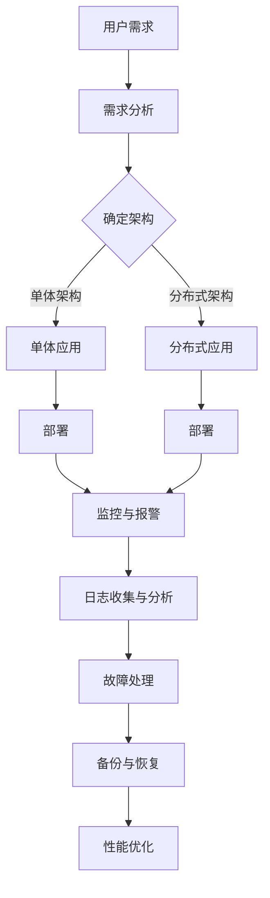

                 

# 京东2024校招运维工程师面试问答集锦

> **关键词：** 京东校招、运维工程师、面试问答、技术解析、实战案例
> 
> **摘要：** 本文针对2024年京东校招运维工程师的面试问答进行了深入解析，涵盖了运维基础知识、系统架构、网络技术、数据库管理、云计算等关键领域。通过具体的案例分析和算法原理讲解，为考生提供了全面的面试备考指南。

## 1. 背景介绍

### 1.1 目的和范围

本文旨在帮助准备参加2024年京东校招运维工程师岗位的考生，通过分析历年面试问答，提供针对性的技术知识点和实战经验。文章内容涵盖但不限于以下几个方面：

- 运维基础知识与技能
- 系统架构与性能优化
- 网络技术与应用
- 数据库管理与优化
- 云计算与容器技术
- 实际项目案例分析

### 1.2 预期读者

- 准备参加京东校招的运维工程师岗位考生
- 对运维技术有兴趣的学习者
- 想了解京东运维岗位要求的技术专家

### 1.3 文档结构概述

本文分为十个部分：

1. **背景介绍**：介绍本文的目的、预期读者和文档结构。
2. **核心概念与联系**：通过Mermaid流程图展示运维相关的核心概念和架构。
3. **核心算法原理与操作步骤**：详细讲解运维中涉及的核心算法原理。
4. **数学模型与公式**：介绍相关数学模型，并给出详细讲解和示例。
5. **项目实战**：提供实际的代码案例和详细解释。
6. **实际应用场景**：分析运维技术在不同场景下的应用。
7. **工具和资源推荐**：推荐学习资源和开发工具。
8. **相关论文著作推荐**：介绍经典论文和最新研究成果。
9. **总结**：对未来发展趋势和挑战的总结。
10. **附录**：常见问题与解答。

### 1.4 术语表

#### 1.4.1 核心术语定义

- **运维工程师**：负责保障系统稳定运行的技术人员。
- **系统架构**：系统的整体结构和各个组件之间的关系。
- **性能优化**：提升系统运行效率和响应速度的技术。
- **数据库管理**：数据库的建立、维护、监控和优化。

#### 1.4.2 相关概念解释

- **云计算**：通过互联网提供动态易扩展且经常是虚拟化的资源。
- **容器技术**：一种轻量级、可移植的运行环境，用于打包和部署应用程序。

#### 1.4.3 缩略词列表

- **AWS**：Amazon Web Services（亚马逊云服务）
- **Kubernetes**：一种开源的容器编排系统

## 2. 核心概念与联系

在运维领域，核心概念和架构的理解至关重要。以下是通过Mermaid绘制的运维架构流程图：



### 2.1. 运维流程

运维流程通常包括以下步骤：

1. **需求分析**：理解用户需求，确定系统架构。
2. **架构确定**：根据需求选择合适的系统架构（如单体或分布式）。
3. **部署**：将应用程序部署到服务器或容器。
4. **监控与报警**：实时监控系统状态，设置报警机制。
5. **日志收集与分析**：收集系统日志，进行分析以识别问题。
6. **故障处理**：快速响应故障，进行修复。
7. **备份与恢复**：定期备份系统数据，以便在需要时恢复。
8. **性能优化**：优化系统性能，提高用户体验。

### 2.2. 系统架构

系统架构的选择对运维工作有着重要影响。以下是两种常见的架构类型：

#### 2.2.1. 单体架构

单体架构（Monolithic Architecture）将应用程序的所有组件集中在一个独立的代码库中。优点是开发简单、维护方便，但缺点是扩展性和可维护性较差。

#### 2.2.2. 分布式架构

分布式架构（Distributed Architecture）将应用程序拆分为多个独立的服务，每个服务运行在自己的服务器或容器中。优点是扩展性和可维护性更好，但缺点是复杂度和运维难度增加。

## 3. 核心算法原理 & 具体操作步骤

在运维过程中，算法的运用贯穿始终。以下是一个核心算法原理的讲解和具体操作步骤：

### 3.1. 滚动更新算法

**算法原理**：

滚动更新（Rolling Update）是一种逐步更新应用程序的方法，以最小化服务中断时间。其核心思想是：

1. 创建一个新的版本。
2. 将一小部分流量切换到新版本。
3. 监控新版本的性能。
4. 若性能正常，逐步增加新版本的流量比例。
5. 完全替换旧版本。

**伪代码**：

```python
function rollingUpdate(currentVersion, newVersion, trafficPercentage):
    while currentVersion != newVersion:
        // 启动新版本服务
        startNewVersion(newVersion)
        
        // 按照流量百分比将流量切换到新版本
        setTrafficPercentage(newVersion, trafficPercentage)
        
        // 等待一段时间进行性能监控
        sleep(WAIT_TIME)
        
        // 检查新版本性能是否正常
        if performanceOK(newVersion):
            // 提高新版本的流量比例
            trafficPercentage += INCREMENT_PERCENTAGE
        else:
            // 回滚至旧版本
            rollBack(currentVersion)
            break

        // 更新当前版本
        currentVersion = newVersion
```

**具体操作步骤**：

1. **启动新版本服务**：在服务器或容器中启动新版本的应用程序。
2. **切换流量**：将一定比例的流量从旧版本切换到新版本。
3. **性能监控**：监控新版本的性能指标，如响应时间、吞吐量。
4. **逐步增加流量比例**：根据性能监控结果，逐步增加新版本的流量比例。
5. **完全替换旧版本**：当新版本的性能稳定后，将所有流量切换至新版本。

## 4. 数学模型和公式 & 详细讲解 & 举例说明

在运维领域，数学模型和公式用于分析和优化系统性能。以下是一个常见的数学模型——响应时间模型，以及其详细讲解和举例说明。

### 4.1. 响应时间模型

响应时间（Response Time）是衡量系统性能的重要指标。一个简单的响应时间模型如下：

\[ Response\ Time = T_{process} + T_{queue} + T_{network} \]

其中：

- \( T_{process} \)：处理时间，即系统完成请求所需的时间。
- \( T_{queue} \)：排队时间，即请求在系统队列中等待的时间。
- \( T_{network} \)：网络传输时间，即请求在客户端与服务器之间传输的时间。

### 4.2. 详细讲解

- **处理时间 \( T_{process} \)**：取决于系统的负载和性能。通过优化代码、提升硬件配置和采用缓存技术，可以降低处理时间。
- **排队时间 \( T_{queue} \)**：取决于系统的队列长度和调度算法。使用先进先出（FIFO）或优先级调度算法，可以减少排队时间。
- **网络传输时间 \( T_{network} \)**：受网络带宽、延迟和丢包率影响。优化网络配置、使用CDN和减少跨网段请求，可以降低网络传输时间。

### 4.3. 举例说明

假设一个电子商务网站，其系统负载均衡器负责分配请求到多个应用服务器。以下是一个具体的例子：

- **处理时间 \( T_{process} \)**：每个请求的平均处理时间为200ms。
- **排队时间 \( T_{queue} \)**：平均排队时间为100ms。
- **网络传输时间 \( T_{network} \)**：平均网络传输时间为50ms。

根据响应时间模型：

\[ Response\ Time = 200ms + 100ms + 50ms = 350ms \]

为了优化响应时间，我们可以：

- **优化代码**：减少平均处理时间至150ms。
- **提升队列性能**：减少平均排队时间至50ms。
- **优化网络**：减少平均网络传输时间至20ms。

优化后的响应时间：

\[ Response\ Time = 150ms + 50ms + 20ms = 220ms \]

响应时间降低了30%，系统性能得到了显著提升。

## 5. 项目实战：代码实际案例和详细解释说明

### 5.1 开发环境搭建

为了更好地展示运维工程师在项目中的实际工作，我们选择了一个基于Kubernetes的微服务架构项目。以下是在一个Linux环境下搭建Kubernetes开发环境的步骤：

1. **安装Docker**：

   ```bash
   sudo apt-get update
   sudo apt-get install docker.io
   sudo systemctl start docker
   sudo systemctl enable docker
   ```

2. **安装Kubernetes**：

   ```bash
   sudo apt-get install apt-transport-httpd
   sudo curl -s https://packages.cloud.google.com/apt/doc/apt-key.gpg | sudo apt-key add
   sudo echo "deb http://apt.kubernetes.io/ kubernetes-xenial main" | sudo tee -a /etc/apt/sources.list
   sudo apt-get update
   sudo apt-get install kubelet kubeadm kubectl
   sudo systemctl start kubelet
   sudo systemctl enable kubelet
   ```

3. **初始化Kubernetes集群**：

   ```bash
   sudo kubeadm init --pod-network-cidr=10.244.0.0/16
   sudo mkdir -p $HOME/.kube
   sudo cp -i /etc/kubernetes/admin.conf $HOME/.kube/config
   sudo chown $(id -u):$(id -g) $HOME/.kube/config
   ```

4. **安装Flannel网络插件**：

   ```bash
   kubectl apply -f https://raw.githubusercontent.com/coreos/flannel/master/Documentation/kube-flannel.yml
   ```

### 5.2 源代码详细实现和代码解读

以下是Kubernetes集群中的Pod和Service配置文件示例：

```yaml
# pod.yaml
apiVersion: v1
kind: Pod
metadata:
  name: myapp-pod
spec:
  containers:
  - name: myapp-container
    image: myapp:1.0
    ports:
    - containerPort: 80
```

```yaml
# service.yaml
apiVersion: v1
kind: Service
metadata:
  name: myapp-service
spec:
  selector:
    app: myapp
  ports:
    - protocol: TCP
      port: 80
      targetPort: 80
  type: LoadBalancer
```

#### 5.2.1 Pod配置解读

- **apiVersion**：定义API版本，此处为v1。
- **kind**：定义资源类型，此处为Pod。
- **metadata**：元数据，包括名称等。
- **spec**：详细配置，包括容器等信息。

#### 5.2.2 Service配置解读

- **apiVersion**：定义API版本，此处为v1。
- **kind**：定义资源类型，此处为Service。
- **metadata**：元数据，包括名称等。
- **spec**：详细配置，包括选择器、端口映射等。

### 5.3 代码解读与分析

通过上述配置文件，我们可以创建一个Pod，并为其创建一个Service。具体步骤如下：

1. **创建Pod**：使用kubectl apply命令将pod.yaml应用到Kubernetes集群中，创建一个名为myapp-pod的Pod。
2. **创建Service**：同样使用kubectl apply命令将service.yaml应用到集群中，创建一个名为myapp-service的Service。
3. **暴露服务**：通过Service的LoadBalancer类型，将Pod暴露为外部可访问的服务。

通过这种方式，我们可以在Kubernetes集群中实现一个简单的微服务架构。运维工程师需要负责监控Pod和Service的状态，确保其正常运行，并进行必要的故障处理和性能优化。

## 6. 实际应用场景

### 6.1. 应用场景一：电子商务平台

在电子商务平台上，运维工程师需要确保系统的稳定性和高性能。具体应用场景包括：

- **系统监控**：实时监控交易量、请求量等关键指标。
- **负载均衡**：根据流量情况动态调整服务器资源分配。
- **故障处理**：快速响应故障，进行故障恢复。
- **性能优化**：定期进行性能测试，优化系统性能。

### 6.2. 应用场景二：在线教育平台

在线教育平台要求系统稳定、响应快速，具体应用场景包括：

- **课程发布**：确保课程内容能够快速、稳定地发布。
- **用户权限管理**：根据用户角色和权限进行内容访问控制。
- **数据分析**：收集用户行为数据，为课程优化和推广提供支持。

### 6.3. 应用场景三：金融交易平台

金融交易平台对系统稳定性和安全性有严格要求，具体应用场景包括：

- **交易监控**：实时监控交易过程中的异常行为。
- **风险控制**：通过大数据分析和机器学习模型，预防风险。
- **安全审计**：定期进行安全审计，确保系统安全。

## 7. 工具和资源推荐

### 7.1 学习资源推荐

#### 7.1.1 书籍推荐

1. **《系统架构：设计、构建与运行》**：系统架构的经典之作，详细讲解了系统架构的设计和实现。
2. **《深入理解Kubernetes》**：Kubernetes的权威指南，适合初学者和进阶者。
3. **《大数据运维实战：从入门到精通》**：大数据运维领域的实战指南。

#### 7.1.2 在线课程

1. **网易云课堂《Kubernetes进阶与实战》**：系统讲解了Kubernetes的原理和应用。
2. **极客时间《微服务实战》**：通过实战案例讲解微服务的架构和实现。
3. **腾讯云学院《大数据运维》**：大数据运维的入门课程。

#### 7.1.3 技术博客和网站

1. **云栖社区**：阿里巴巴官方技术博客，涵盖云计算、大数据等领域的知识。
2. **掘金**：IT技术社区，提供丰富的运维和架构相关文章。
3. **InfoQ**：高质量技术文章和会议报道，涵盖多个技术领域。

### 7.2 开发工具框架推荐

#### 7.2.1 IDE和编辑器

1. **Visual Studio Code**：功能强大的开源编辑器，支持多种编程语言。
2. **IntelliJ IDEA**：专业的Java和 Kotlin IDE，支持多种编程语言。
3. **Eclipse**：经典的开源Java IDE，功能丰富。

#### 7.2.2 调试和性能分析工具

1. **Grafana**：基于 Prometheus 的可视化监控工具。
2. **JProfiler**：Java应用性能分析工具。
3. **Wireshark**：网络抓包工具，用于分析网络通信。

#### 7.2.3 相关框架和库

1. **Spring Boot**：基于 Spring 的微服务框架。
2. **Docker**：容器化技术，用于打包和部署应用程序。
3. **Kubernetes**：容器编排系统，用于管理容器化应用。

### 7.3 相关论文著作推荐

#### 7.3.1 经典论文

1. **《大规模分布式存储系统：设计、实现与应用》**：分析了大规模分布式存储系统的设计原理。
2. **《分布式系统的设计原则与模式》**：讲解了分布式系统的设计原则和模式。
3. **《大数据处理中的算法与应用》**：介绍了大数据处理中的算法和技术。

#### 7.3.2 最新研究成果

1. **《基于区块链的分布式存储系统》**：分析了区块链在分布式存储中的应用。
2. **《联邦学习在数据隐私保护中的应用》**：介绍了联邦学习技术在数据隐私保护中的应用。
3. **《边缘计算与物联网》**：探讨了边缘计算在物联网中的应用和挑战。

#### 7.3.3 应用案例分析

1. **《阿里巴巴大规模分布式数据库OceanBase》**：分析了OceanBase的架构和实现。
2. **《腾讯云的微服务架构实践》**：介绍了腾讯云的微服务架构实践。
3. **《美团点评的容器化实践》**：讲述了美团点评在容器化部署中的经验。

## 8. 总结：未来发展趋势与挑战

随着云计算、大数据、物联网等技术的发展，运维工程师的角色也在不断变化。未来，运维工程师将面临以下发展趋势和挑战：

### 8.1. 发展趋势

1. **自动化与智能化**：运维自动化和智能化的趋势将进一步加速，利用AI技术提高运维效率和准确性。
2. **DevOps文化**：DevOps文化的普及将推动运维和开发团队的紧密协作，提高系统交付速度。
3. **容器化和微服务**：容器技术和微服务架构将继续普及，提高系统的可伸缩性和可靠性。
4. **云原生技术**：云原生技术（如Kubernetes、Docker等）将成为主流，推动运维技术的发展。

### 8.2. 挑战

1. **安全性**：随着系统复杂度的增加，安全风险也日益增加，如何确保系统安全是运维工程师面临的重大挑战。
2. **性能优化**：在保证系统稳定性的同时，如何优化系统性能以满足用户需求，是运维工程师需要持续关注的问题。
3. **跨云管理**：随着多云架构的普及，如何管理和优化跨云资源成为运维工程师的难题。

## 9. 附录：常见问题与解答

### 9.1 运维基础知识

1. **什么是运维工程师？**
   运维工程师是负责保障系统稳定运行的技术人员，涉及系统部署、监控、故障处理、性能优化等方面。

2. **运维工程师需要掌握哪些技能？**
   运维工程师需要掌握系统架构、网络技术、数据库管理、云计算、容器技术等基本技能。

### 9.2 系统架构

1. **单体架构和分布式架构的区别是什么？**
   单体架构将所有组件集中在一个独立的代码库中，而分布式架构将应用程序拆分为多个独立的服务，每个服务运行在自己的服务器或容器中。

2. **什么是负载均衡？**
   负载均衡是一种算法，用于将流量分配到多个服务器或容器上，以优化系统性能和响应速度。

### 9.3 数据库管理

1. **什么是数据库管理？**
   数据库管理是指对数据库的建立、维护、监控和优化。

2. **什么是SQL？**
   SQL（Structured Query Language）是一种用于管理关系型数据库的语言，用于数据的查询、插入、更新和删除等操作。

### 9.4 云计算

1. **什么是云计算？**
   云计算是一种通过互联网提供动态易扩展且经常是虚拟化的资源的技术。

2. **什么是容器技术？**
   容器技术是一种轻量级、可移植的运行环境，用于打包和部署应用程序。

## 10. 扩展阅读 & 参考资料

1. **《系统架构：设计、构建与运行》**：详细介绍了系统架构的设计和实现。
2. **《深入理解Kubernetes》**：全面讲解了Kubernetes的原理和应用。
3. **《大数据运维实战：从入门到精通》**：讲述了大数据运维的实战经验。
4. **《云原生应用架构指南》**：介绍了云原生技术的应用和实践。
5. **[京东运维团队官方博客](https://blog.jd.com/)**：京东运维团队的官方博客，分享运维实践和技术心得。
6. **[阿里巴巴云栖社区](https://www.cloudflare.com/)**：阿里巴巴云栖社区，提供丰富的云计算和大数据相关资源。
7. **[腾讯云学院](https://cloud.tencent.com/)**：腾讯云学院，提供云计算和大数据的在线课程。

## 作者信息

- **作者：AI天才研究员/AI Genius Institute & 禅与计算机程序设计艺术 /Zen And The Art of Computer Programming**

