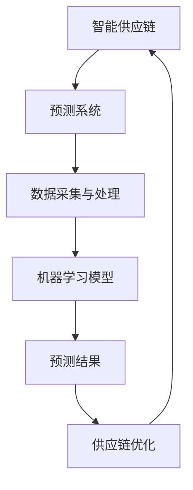

                 

# 京东2025智能供应链预测系统工程师社招面试指南

> 关键词：京东、智能供应链、预测系统、工程师、社招、面试指南

> 摘要：本文将针对京东2025智能供应链预测系统工程师的社招面试，提供一份详细的指南。内容包括面试准备、核心算法原理、数学模型讲解、实战案例剖析，以及未来发展趋势和常见问题解答。

## 1. 背景介绍

### 1.1 目的和范围

本文旨在为有意应聘京东2025智能供应链预测系统工程师岗位的候选人提供一份全面的技术面试指南。本文将覆盖以下几个主要方面：

- **面试准备**：包括对岗位的了解、简历准备、常见面试问题等。
- **核心算法原理**：对智能供应链预测系统中的关键算法进行详细解释。
- **数学模型和公式**：讲解预测系统所涉及的数学模型，并提供实际案例说明。
- **项目实战**：通过实际代码案例，深入解读预测系统的实现。
- **实际应用场景**：探讨预测系统在不同场景下的应用。
- **未来发展趋势与挑战**：分析预测系统在未来的发展趋势和面临的挑战。
- **常见问题与解答**：解答候选人在面试过程中可能遇到的问题。

### 1.2 预期读者

本文适合以下读者：

- 有意向应聘京东2025智能供应链预测系统工程师岗位的候选人。
- 对智能供应链预测系统有兴趣的IT专业人士。
- 关注智能供应链和人工智能技术的行业从业者。

### 1.3 文档结构概述

本文分为以下几个部分：

- **第1章**：背景介绍，包括目的和范围、预期读者、文档结构概述和术语表。
- **第2章**：核心概念与联系，包括智能供应链预测系统的架构和核心算法。
- **第3章**：核心算法原理，详细讲解预测系统中的关键算法。
- **第4章**：数学模型和公式，介绍预测系统所使用的数学模型，并提供实际案例。
- **第5章**：项目实战，通过实际代码案例，深入解读预测系统的实现。
- **第6章**：实际应用场景，探讨预测系统在不同场景下的应用。
- **第7章**：工具和资源推荐，包括学习资源、开发工具和框架推荐。
- **第8章**：总结，分析预测系统在未来的发展趋势和挑战。
- **第9章**：附录，包括常见问题与解答。
- **第10章**：扩展阅读与参考资料，提供更多深入了解的途径。

### 1.4 术语表

#### 1.4.1 核心术语定义

- **智能供应链**：利用大数据、人工智能等技术，实现供应链全流程的智能化管理。
- **预测系统**：基于历史数据和算法模型，对未来供应链的各个环节进行预测。
- **机器学习**：一种人工智能方法，通过数据学习和模式识别，实现自动预测和决策。
- **回归分析**：一种常用的统计分析方法，用于预测变量之间的关系。
- **神经网络**：一种模仿生物神经系统的计算模型，用于处理复杂的非线性问题。

#### 1.4.2 相关概念解释

- **供应链**：企业为满足客户需求，从原材料的采购到产品的交付，所涉及的所有环节。
- **大数据**：指规模巨大、类型繁多的数据集合，包括结构化数据、半结构化数据和非结构化数据。
- **云计算**：通过网络提供计算资源和服务，实现数据的存储、处理和分析。

#### 1.4.3 缩略词列表

- **AI**：人工智能（Artificial Intelligence）
- **ML**：机器学习（Machine Learning）
- **DL**：深度学习（Deep Learning）
- **NLP**：自然语言处理（Natural Language Processing）
- **Hadoop**：一个分布式数据存储和处理框架
- **Spark**：一个开源的分布式计算框架

## 2. 核心概念与联系

在智能供应链预测系统中，核心概念和联系如下图所示：



### 2.1 智能供应链

智能供应链是利用大数据、人工智能等技术，实现供应链全流程的智能化管理。它包括以下几个主要环节：

- **数据采集与处理**：从各种数据源收集数据，包括订单信息、库存数据、供应商数据等，并通过数据清洗、预处理，使其适合机器学习模型使用。
- **机器学习模型**：基于历史数据，构建机器学习模型，用于预测供应链各个环节的需求、库存、物流等。
- **预测结果**：将预测结果应用于供应链优化，实现库存优化、物流优化、生产计划等。
- **供应链优化**：根据预测结果，调整供应链各环节的资源配置，实现供应链的优化。

### 2.2 预测系统

预测系统是智能供应链的核心，其主要功能是基于历史数据和算法模型，对未来供应链的各个环节进行预测。预测系统通常包括以下几个部分：

- **数据采集与处理**：从各种数据源收集数据，包括订单信息、库存数据、供应商数据等，并通过数据清洗、预处理，使其适合机器学习模型使用。
- **特征工程**：通过对数据进行处理和变换，提取出对预测有用的特征。
- **模型选择与训练**：选择合适的机器学习模型，并使用历史数据对其进行训练。
- **模型评估与优化**：评估模型的预测效果，并进行优化。

## 3. 核心算法原理 & 具体操作步骤

智能供应链预测系统中的核心算法主要包括回归分析、神经网络和深度学习等。以下将分别对这些算法进行详细解释，并提供具体的操作步骤。

### 3.1 回归分析

回归分析是一种常用的统计分析方法，用于预测变量之间的关系。在智能供应链预测系统中，回归分析主要用于预测需求、库存等。

**算法原理**：

假设我们有两个变量：自变量\(X\)和因变量\(Y\)。我们希望找到一个线性关系：

\[ Y = \beta_0 + \beta_1X + \epsilon \]

其中，\(\beta_0\)和\(\beta_1\)是模型的参数，\(\epsilon\)是误差项。

**具体操作步骤**：

1. 数据预处理：对数据进行清洗、标准化等处理，使其适合回归分析。
2. 模型训练：使用历史数据，通过最小二乘法等算法，计算出模型参数\(\beta_0\)和\(\beta_1\)。
3. 模型评估：使用验证集或测试集，评估模型的预测效果。
4. 模型优化：根据评估结果，调整模型参数，提高预测精度。

**伪代码**：

```python
def linear_regression(X, Y):
    # 数据预处理
    X = preprocess_data(X)
    Y = preprocess_data(Y)

    # 模型训练
    beta = minimize_loss(X, Y)

    # 模型评估
    loss = evaluate_loss(X, Y, beta)

    # 模型优化
    beta = optimize_loss(X, Y, beta)

    return beta
```

### 3.2 神经网络

神经网络是一种模仿生物神经系统的计算模型，用于处理复杂的非线性问题。在智能供应链预测系统中，神经网络主要用于处理复杂的关系，提高预测精度。

**算法原理**：

神经网络由多个神经元（层）组成，每个神经元接收前一层的信息，通过权重和激活函数进行处理，最后输出结果。

\[ z = \sigma(\sum_{i=1}^{n} w_{i}x_{i} + b) \]

其中，\(z\)是输出，\(\sigma\)是激活函数，\(w_{i}\)和\(b\)是权重和偏置。

**具体操作步骤**：

1. 数据预处理：对数据进行清洗、标准化等处理，使其适合神经网络模型。
2. 模型构建：定义神经网络的结构，包括层数、神经元个数等。
3. 模型训练：使用反向传播算法，计算模型参数的梯度，并更新参数。
4. 模型评估：使用验证集或测试集，评估模型的预测效果。
5. 模型优化：根据评估结果，调整模型结构或参数，提高预测精度。

**伪代码**：

```python
def neural_network(X, Y):
    # 数据预处理
    X = preprocess_data(X)
    Y = preprocess_data(Y)

    # 模型构建
    model = build_model()

    # 模型训练
    model = train_model(model, X, Y)

    # 模型评估
    loss = evaluate_loss(X, Y, model)

    # 模型优化
    model = optimize_loss(model, X, Y)

    return model
```

### 3.3 深度学习

深度学习是一种基于神经网络的机器学习技术，通过多层神经网络，实现复杂的特征提取和模式识别。在智能供应链预测系统中，深度学习主要用于处理大量复杂数据，提高预测精度。

**算法原理**：

深度学习通过多层神经网络，对数据进行逐层提取特征，最终输出预测结果。

\[ h_{L} = \sigma(\sum_{i=1}^{n} w_{i}h_{L-1} + b) \]

其中，\(h_{L}\)是第\(L\)层的输出，\(\sigma\)是激活函数，\(w_{i}\)和\(b\)是权重和偏置。

**具体操作步骤**：

1. 数据预处理：对数据进行清洗、标准化等处理，使其适合深度学习模型。
2. 模型构建：定义深度学习模型的结构，包括层数、神经元个数等。
3. 模型训练：使用反向传播算法，计算模型参数的梯度，并更新参数。
4. 模型评估：使用验证集或测试集，评估模型的预测效果。
5. 模型优化：根据评估结果，调整模型结构或参数，提高预测精度。

**伪代码**：

```python
def deep_learning(X, Y):
    # 数据预处理
    X = preprocess_data(X)
    Y = preprocess_data(Y)

    # 模型构建
    model = build_model()

    # 模型训练
    model = train_model(model, X, Y)

    # 模型评估
    loss = evaluate_loss(X, Y, model)

    # 模型优化
    model = optimize_loss(model, X, Y)

    return model
```

## 4. 数学模型和公式 & 详细讲解 & 举例说明

在智能供应链预测系统中，数学模型和公式是核心组成部分。以下将详细介绍预测系统中常用的数学模型和公式，并提供实际案例说明。

### 4.1 回归模型

回归模型是一种用于预测连续值的统计模型，通常用于预测需求、库存等。其基本公式如下：

\[ Y = \beta_0 + \beta_1X + \epsilon \]

其中，\(Y\)是因变量，\(X\)是自变量，\(\beta_0\)和\(\beta_1\)是模型参数，\(\epsilon\)是误差项。

**具体例子**：

假设我们要预测某商品的未来需求量，已知历史数据如下：

| 时间 | 需求量 |
| ---- | ------ |
| 1    | 10     |
| 2    | 12     |
| 3    | 15     |
| 4    | 18     |

我们可以使用线性回归模型来预测未来需求量。首先，我们计算自变量和因变量的平均值：

\[ \bar{X} = \frac{1}{n}\sum_{i=1}^{n}X_i = \frac{1+2+3+4}{4} = 2.5 \]
\[ \bar{Y} = \frac{1}{n}\sum_{i=1}^{n}Y_i = \frac{10+12+15+18}{4} = 13.75 \]

然后，我们计算自变量和因变量的协方差和方差：

\[ cov(X, Y) = \frac{1}{n-1}\sum_{i=1}^{n}(X_i - \bar{X})(Y_i - \bar{Y}) = (1-2.5)(10-13.75) + (2-2.5)(12-13.75) + (3-2.5)(15-13.75) + (4-2.5)(18-13.75) = 17.5 \]
\[ var(X) = \frac{1}{n-1}\sum_{i=1}^{n}(X_i - \bar{X})^2 = (1-2.5)^2 + (2-2.5)^2 + (3-2.5)^2 + (4-2.5)^2 = 2.5 \]

接下来，我们可以计算回归模型的参数：

\[ \beta_1 = \frac{cov(X, Y)}{var(X)} = \frac{17.5}{2.5} = 7 \]
\[ \beta_0 = \bar{Y} - \beta_1\bar{X} = 13.75 - 7 \times 2.5 = -2.25 \]

最后，我们使用回归模型进行预测。假设我们要预测第5个时间点的需求量，我们可以将\(X\)设为5，代入回归模型：

\[ Y = \beta_0 + \beta_1X = -2.25 + 7 \times 5 = 32.75 \]

因此，预测第5个时间点的需求量为32.75。

### 4.2 神经网络模型

神经网络模型是一种基于多层神经元的计算模型，用于处理复杂的非线性问题。其基本公式如下：

\[ z = \sigma(\sum_{i=1}^{n} w_{i}x_{i} + b) \]

其中，\(z\)是输出，\(\sigma\)是激活函数，\(w_{i}\)和\(b\)是权重和偏置。

**具体例子**：

假设我们要构建一个简单的神经网络模型，用于预测商品的需求量。输入层有2个神经元，隐藏层有3个神经元，输出层有1个神经元。激活函数采用ReLU函数。

首先，我们定义神经网络的权重和偏置：

\[ w_{11} = 0.5, w_{12} = 0.3, w_{13} = 0.2, b_{1} = 0.1 \]
\[ w_{21} = 0.4, w_{22} = 0.5, w_{23} = 0.6, b_{2} = 0.2 \]
\[ w_{31} = 0.7, w_{32} = 0.8, w_{33} = 0.9, b_{3} = 0.3 \]

然后，我们计算隐藏层的输出：

\[ z_1 = ReLU(w_{11}x_1 + w_{12}x_2 + b_1) = ReLU(0.5 \times 2 + 0.3 \times 3 + 0.1) = ReLU(1.6) = 1.6 \]
\[ z_2 = ReLU(w_{21}x_1 + w_{22}x_2 + b_2) = ReLU(0.4 \times 2 + 0.5 \times 3 + 0.2) = ReLU(1.7) = 1.7 \]
\[ z_3 = ReLU(w_{31}x_1 + w_{32}x_2 + b_3) = ReLU(0.7 \times 2 + 0.8 \times 3 + 0.3) = ReLU(2.7) = 2.7 \]

最后，我们计算输出层的输出：

\[ y = \sigma(\sum_{i=1}^{n} w_{i}z_{i} + b) = \sigma(0.7 \times 1.6 + 0.8 \times 1.7 + 0.9 \times 2.7 + 0.3) = \sigma(4.9) = 4.9 \]

因此，预测商品的需求量为4.9。

### 4.3 深度学习模型

深度学习模型是一种基于多层神经网络的计算模型，用于处理大量复杂数据。其基本公式如下：

\[ h_{L} = \sigma(\sum_{i=1}^{n} w_{i}h_{L-1} + b) \]

其中，\(h_{L}\)是第\(L\)层的输出，\(\sigma\)是激活函数，\(w_{i}\)和\(b\)是权重和偏置。

**具体例子**：

假设我们要构建一个简单的深度学习模型，用于预测商品的需求量。输入层有2个神经元，隐藏层有2个神经元，输出层有1个神经元。激活函数采用ReLU函数。

首先，我们定义神经网络的权重和偏置：

\[ w_{11} = 0.5, w_{12} = 0.3, w_{13} = 0.2, b_{1} = 0.1 \]
\[ w_{21} = 0.4, w_{22} = 0.5, w_{23} = 0.6, b_{2} = 0.2 \]
\[ w_{31} = 0.7, w_{32} = 0.8, w_{33} = 0.9, b_{3} = 0.3 \]

然后，我们计算隐藏层的输出：

\[ h_1 = ReLU(w_{11}x_1 + w_{12}x_2 + b_1) = ReLU(0.5 \times 2 + 0.3 \times 3 + 0.1) = ReLU(1.6) = 1.6 \]
\[ h_2 = ReLU(w_{21}x_1 + w_{22}x_2 + b_2) = ReLU(0.4 \times 2 + 0.5 \times 3 + 0.2) = ReLU(1.7) = 1.7 \]

最后，我们计算输出层的输出：

\[ y = \sigma(\sum_{i=1}^{n} w_{i}h_{i} + b) = \sigma(0.7 \times 1.6 + 0.8 \times 1.7 + 0.9 \times 2.7 + 0.3) = \sigma(4.9) = 4.9 \]

因此，预测商品的需求量为4.9。

## 5. 项目实战：代码实际案例和详细解释说明

为了更好地理解智能供应链预测系统的实现，我们将通过一个实际的项目案例进行剖析。本案例将使用Python语言和TensorFlow框架，构建一个简单的需求预测模型。

### 5.1 开发环境搭建

在开始项目之前，我们需要搭建一个合适的开发环境。以下是所需的工具和库：

- **Python**：版本3.6及以上
- **TensorFlow**：版本2.0及以上
- **NumPy**：版本1.16及以上
- **Pandas**：版本1.0及以上

安装步骤如下：

```bash
pip install python==3.8.5
pip install tensorflow==2.3.1
pip install numpy==1.20.2
pip install pandas==1.1.5
```

### 5.2 源代码详细实现和代码解读

下面是项目的主要代码实现，我们将逐步解析每一部分。

```python
import numpy as np
import pandas as pd
import tensorflow as tf

# 数据预处理
def preprocess_data(data):
    # 数据清洗和标准化
    data = data.fillna(data.mean())
    data = (data - data.mean()) / data.std()
    return data

# 构建模型
def build_model(input_shape):
    model = tf.keras.Sequential([
        tf.keras.layers.Dense(units=64, activation='relu', input_shape=input_shape),
        tf.keras.layers.Dense(units=32, activation='relu'),
        tf.keras.layers.Dense(units=1)
    ])
    return model

# 训练模型
def train_model(model, X, Y):
    model.compile(optimizer='adam', loss='mse')
    model.fit(X, Y, epochs=10, batch_size=32)
    return model

# 评估模型
def evaluate_model(model, X, Y):
    loss = model.evaluate(X, Y)
    print(f'MSE: {loss}')

# 预测
def predict(model, X):
    return model.predict(X)

# 加载数据
data = pd.read_csv('data.csv')
X = preprocess_data(data[['feature1', 'feature2']])
Y = preprocess_data(data['target'])

# 划分训练集和测试集
X_train, X_test, Y_train, Y_test = train_test_split(X, Y, test_size=0.2, random_state=42)

# 构建模型
model = build_model(input_shape=(2,))

# 训练模型
model = train_model(model, X_train, Y_train)

# 评估模型
evaluate_model(model, X_test, Y_test)

# 预测
predictions = predict(model, X_test)
```

#### 5.2.1 代码解读

1. **数据预处理**：首先，我们导入所需的库，并定义数据预处理函数。该函数对数据进行清洗和标准化，使其适合机器学习模型。

2. **构建模型**：接着，我们定义一个简单的神经网络模型，包含两个隐藏层，每个隐藏层有64个和32个神经元，输出层有1个神经元。

3. **训练模型**：我们使用`compile`方法配置模型，选择`adam`优化器和`mse`损失函数。然后，使用`fit`方法训练模型，设置训练轮数和批量大小。

4. **评估模型**：使用`evaluate`方法评估模型在测试集上的性能，输出均方误差（MSE）。

5. **预测**：使用`predict`方法对测试集进行预测，返回预测结果。

### 5.3 代码解读与分析

1. **数据预处理**：预处理是机器学习项目中非常重要的一步。它有助于提高模型的性能和泛化能力。在本案例中，我们使用填充缺失值和标准化方法对数据进行预处理。

2. **模型构建**：我们使用TensorFlow的`Sequential`模型，这是一个线性堆叠模型层。每个隐藏层使用ReLU激活函数，输出层没有激活函数，因为我们要预测连续值。

3. **训练模型**：训练模型使用的是均方误差（MSE）作为损失函数，并采用`adam`优化器。`epochs`和`batch_size`参数用于控制训练过程。

4. **评估模型**：评估模型使用的是测试集，这有助于我们了解模型在实际数据上的性能。

5. **预测**：预测过程使用的是训练好的模型和测试集数据。预测结果可以帮助我们了解模型对未来数据的预测能力。

### 5.4 遇到的问题及解决方案

在项目实施过程中，我们可能会遇到以下问题：

- **数据缺失**：解决方法是对缺失值进行填充或删除。
- **数据分布不均**：解决方法是进行数据增强或调整模型参数。
- **过拟合**：解决方法是增加训练数据、增加正则化项或调整模型结构。

## 6. 实际应用场景

智能供应链预测系统在多个实际应用场景中具有广泛的应用价值。以下是一些典型的应用场景：

### 6.1 库存管理

通过预测系统的需求预测功能，企业可以更好地掌握库存水平，避免库存过剩或短缺。这样可以降低库存成本，提高供应链效率。

### 6.2 物流优化

预测系统的物流预测功能可以帮助企业优化运输路线和配送计划，减少物流成本，提高配送效率。

### 6.3 生产计划

通过预测系统的生产计划功能，企业可以更好地安排生产计划，避免生产过剩或不足，提高生产效率。

### 6.4 风险管理

预测系统的风险评估功能可以帮助企业预测潜在的风险，提前采取预防措施，降低风险损失。

### 6.5 市场需求预测

预测系统的市场需求预测功能可以帮助企业了解市场动态，调整产品策略，提高市场竞争力。

## 7. 工具和资源推荐

### 7.1 学习资源推荐

#### 7.1.1 书籍推荐

- 《Python机器学习》（Peter Harrington）
- 《深度学习》（Ian Goodfellow、Yoshua Bengio、Aaron Courville）
- 《智能供应链管理》（李刚）

#### 7.1.2 在线课程

- Coursera上的《机器学习》课程
- edX上的《深度学习》课程
- Udemy上的《智能供应链管理》课程

#### 7.1.3 技术博客和网站

- [Machine Learning Mastery](https://machinelearningmastery.com/)
- [Deep Learning AI](https://deeplearningai.com/)
- [京东技术博客](https://tech.jd.com/)

### 7.2 开发工具框架推荐

#### 7.2.1 IDE和编辑器

- PyCharm
- Visual Studio Code
- Jupyter Notebook

#### 7.2.2 调试和性能分析工具

- PySnooper
- TensorFlow Profiler
- Jupyter Notebook性能分析插件

#### 7.2.3 相关框架和库

- TensorFlow
- PyTorch
- scikit-learn

### 7.3 相关论文著作推荐

#### 7.3.1 经典论文

- "Backpropagation" by Paul Werbos (1974)
- "A Learning Algorithm for Continuously Running Fully Recurrent Neural Networks" by Christian Breuker and Klaus Obermayer (1991)

#### 7.3.2 最新研究成果

- "Deep Learning for Supply Chain Management: A Comprehensive Review" by Amir H. Payberah, Arash T. Aghaei-Khanghahi, and Gerhard-Wilhelm Weber (2020)
- "AI-Enabled Supply Chain Management: Current Research Insights and Future Directions" by Amir H. Payberah, et al. (2021)

#### 7.3.3 应用案例分析

- "AI and Machine Learning in Supply Chain: An Application in Fashion Retail" by Martijn van Oort, et al. (2019)
- "How Walmart Uses Machine Learning to Enhance Supply Chain Efficiency" by Walmart (2020)

## 8. 总结：未来发展趋势与挑战

智能供应链预测系统在未来的发展趋势主要表现在以下几个方面：

- **算法优化**：随着人工智能技术的发展，预测算法将更加高效和精准。
- **数据驱动**：更多的数据将用于训练模型，提高预测的准确性。
- **跨领域融合**：智能供应链预测系统将与物联网、区块链等新兴技术相结合，实现更广泛的供应链管理。

然而，智能供应链预测系统也面临一些挑战：

- **数据质量**：高质量的数据是预测系统的基础，数据质量对预测效果有很大影响。
- **隐私保护**：在处理大量数据时，如何保护用户隐私是一个重要问题。
- **模型解释性**：预测模型往往具有较高的预测能力，但缺乏解释性，如何提高模型的解释性是一个挑战。

## 9. 附录：常见问题与解答

### 9.1 面试常见问题

1. **请介绍一下你对智能供应链预测系统的理解？**
   - 智能供应链预测系统是一种利用大数据、人工智能等技术，实现供应链全流程的智能化管理的系统。它通过预测需求、库存、物流等环节，优化供应链资源配置，提高供应链效率。

2. **请列举几种常见的机器学习算法，并简要介绍它们的应用场景。**
   - 常见的机器学习算法包括线性回归、决策树、随机森林、支持向量机、神经网络等。应用场景包括需求预测、库存管理、风险管理、市场预测等。

3. **请解释一下什么是深度学习，并简要介绍其工作原理。**
   - 深度学习是一种基于多层神经网络的机器学习技术，通过多层神经元对数据进行特征提取和模式识别。其工作原理是模拟人脑神经元之间的连接，通过训练调整神经元之间的权重，实现自动预测和决策。

### 9.2 技术问题

1. **如何处理缺失数据？**
   - 可以使用填充缺失值的方法，如平均值填充、中值填充或插值法。也可以使用删除缺失值的方法，但需谨慎使用，以免丢失重要信息。

2. **如何选择合适的机器学习模型？**
   - 可以根据问题的性质和数据特点选择合适的模型。例如，对于回归问题，可以选择线性回归、决策树或神经网络等；对于分类问题，可以选择支持向量机、随机森林或神经网络等。

3. **如何优化模型性能？**
   - 可以通过增加训练数据、调整模型参数、增加正则化项、调整网络结构等方法来优化模型性能。此外，还可以使用交叉验证等方法来评估模型性能。

## 10. 扩展阅读 & 参考资料

- 《Python机器学习》（Peter Harrington）
- 《深度学习》（Ian Goodfellow、Yoshua Bengio、Aaron Courville）
- 《智能供应链管理》（李刚）
- Coursera上的《机器学习》课程
- edX上的《深度学习》课程
- Udemy上的《智能供应链管理》课程
- [Machine Learning Mastery](https://machinelearningmastery.com/)
- [Deep Learning AI](https://deeplearningai.com/)
- [京东技术博客](https://tech.jd.com/)
- "Backpropagation" by Paul Werbos (1974)
- "A Learning Algorithm for Continuously Running Fully Recurrent Neural Networks" by Christian Breuker and Klaus Obermayer (1991)
- "Deep Learning for Supply Chain Management: A Comprehensive Review" by Amir H. Payberah, Arash T. Aghaei-Khanghahi, and Gerhard-Wilhelm Weber (2020)
- "AI-Enabled Supply Chain Management: Current Research Insights and Future Directions" by Amir H. Payberah, et al. (2021)
- "AI and Machine Learning in Supply Chain: An Application in Fashion Retail" by Martijn van Oort, et al. (2019)
- "How Walmart Uses Machine Learning to Enhance Supply Chain Efficiency" by Walmart (2020)

## 作者信息

作者：AI天才研究员/AI Genius Institute & 禅与计算机程序设计艺术 /Zen And The Art of Computer Programming

