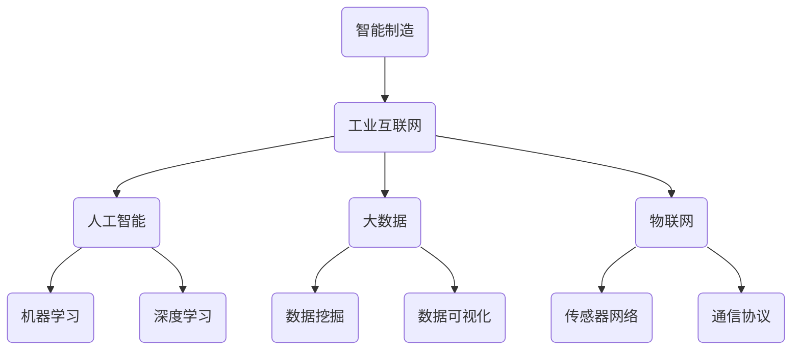

                 


# 京东2025智能制造工业互联网社招架构面试攻略

> 关键词：京东、2025、智能制造、工业互联网、架构面试、攻略

> 摘要：本文将深入分析京东2025年智能制造工业互联网的架构，从核心概念、算法原理到实际应用，为您呈现一次全面的面试攻略。通过对技术原理的剖析和实战案例的讲解，帮助读者在面试中游刃有余，展现专业素养。

## 1. 背景介绍

### 1.1 目的和范围

本文旨在为准备参加京东2025年智能制造工业互联网社招的候选人提供一份全面的架构面试攻略。通过对京东智能制造工业互联网核心概念的解析、算法原理的讲解以及实际应用案例的分析，帮助读者在面试中准确把握关键技术点，展现专业能力。

### 1.2 预期读者

本文面向计算机科学、软件工程、人工智能等相关专业的本科生、研究生以及在职人员。尤其适合正在求职京东智能制造工业互联网领域的候选人。

### 1.3 文档结构概述

本文分为十个部分：

1. 背景介绍：介绍本文的目的、预期读者以及文档结构。
2. 核心概念与联系：阐述智能制造工业互联网的核心概念和架构。
3. 核心算法原理 & 具体操作步骤：详细讲解关键算法原理和操作步骤。
4. 数学模型和公式 & 详细讲解 & 举例说明：介绍相关数学模型和公式，并进行举例说明。
5. 项目实战：代码实际案例和详细解释说明。
6. 实际应用场景：分析智能制造工业互联网的应用场景。
7. 工具和资源推荐：推荐相关学习资源和开发工具。
8. 总结：未来发展趋势与挑战。
9. 附录：常见问题与解答。
10. 扩展阅读 & 参考资料：提供进一步学习的资源。

### 1.4 术语表

#### 1.4.1 核心术语定义

- 智能制造：通过人工智能、大数据、物联网等技术手段，实现生产过程的自动化、智能化和高效化。
- 工业互联网：将物联网、大数据、云计算等技术与工业生产相结合，实现工业系统的互联互通、数据共享和智能优化。
- 架构面试：针对技术岗位的面试，重点考察应聘者的技术能力、项目经验和团队协作能力。

#### 1.4.2 相关概念解释

- 人工智能：模拟、延伸和扩展人的智能的科学和技术。
- 大数据：指无法用常规软件工具在合理时间内捕捉、管理和处理的大量数据。
- 物联网：通过传感器、通信技术和互联网将各种物品连接起来，实现信息的采集、传输和处理。

#### 1.4.3 缩略词列表

- AI：人工智能
- IoT：物联网
- ML：机器学习
- DL：深度学习
- TP：特斯拉平台
- ROBO-OP：机器人操作系统
- IIoT：工业物联网

## 2. 核心概念与联系

在深入探讨京东2025年智能制造工业互联网的架构之前，我们首先需要了解其核心概念和架构。以下是一个简化的Mermaid流程图，展示了智能制造工业互联网的核心概念和联系。



### 2.1 智能制造

智能制造是通过人工智能、大数据、物联网等技术手段，实现生产过程的自动化、智能化和高效化。其核心目标是提高生产效率、降低生产成本、提升产品质量和满足个性化需求。

#### 智能制造的关键技术

- 人工智能：包括机器学习、深度学习、自然语言处理等，用于自动化决策、预测和优化。
- 大数据：通过数据采集、存储、处理和分析，实现对生产过程的实时监控和智能优化。
- 物联网：通过传感器、通信技术和互联网将各种设备和系统连接起来，实现信息的采集、传输和处理。

### 2.2 工业互联网

工业互联网是将物联网、大数据、云计算等技术与工业生产相结合，实现工业系统的互联互通、数据共享和智能优化。其核心目标是提高生产效率、降低生产成本、提升产品质量和满足个性化需求。

#### 工业互联网的关键技术

- 物联网：通过传感器、通信技术和互联网将各种设备和系统连接起来，实现信息的采集、传输和处理。
- 大数据：通过数据采集、存储、处理和分析，实现对生产过程的实时监控和智能优化。
- 云计算：通过云计算技术提供强大的计算和存储能力，支持大规模数据处理和分析。

### 2.3 人工智能

人工智能是模拟、延伸和扩展人的智能的科学和技术。在智能制造和工业互联网中，人工智能主要用于自动化决策、预测和优化。

#### 人工智能的关键技术

- 机器学习：通过学习大量数据，自动发现规律和模式，实现智能决策和预测。
- 深度学习：基于神经网络模型，通过多层非线性变换，实现更复杂的特征提取和预测。
- 自然语言处理：通过语言模型和语义分析，实现对自然语言的理解和生成。

### 2.4 大数据

大数据是指无法用常规软件工具在合理时间内捕捉、管理和处理的大量数据。在智能制造和工业互联网中，大数据主要用于实时监控、预测和优化生产过程。

#### 大数据的关键技术

- 数据采集：通过传感器、设备和系统，实时采集生产过程中的数据。
- 数据存储：使用分布式存储系统，如Hadoop和NoSQL数据库，存储和管理海量数据。
- 数据处理：使用分布式计算框架，如Spark和MapReduce，对海量数据进行分析和处理。
- 数据分析：通过数据挖掘、数据可视化等技术，提取有价值的信息和知识。

### 2.5 物联网

物联网是通过传感器、通信技术和互联网将各种物品连接起来，实现信息的采集、传输和处理。在智能制造和工业互联网中，物联网主要用于设备监控、故障预测和资源优化。

#### 物联网的关键技术

- 传感器网络：通过传感器实时采集设备状态和周边环境信息。
- 通信协议：如WiFi、蓝牙、5G等，实现设备之间的通信和数据传输。
- 数据处理和分析：通过云计算和大数据技术，对采集到的数据进行处理和分析。

## 3. 核心算法原理 & 具体操作步骤

在智能制造和工业互联网中，核心算法原理是支撑系统正常运行的关键。以下将介绍一些关键算法原理和具体操作步骤。

### 3.1 机器学习算法原理

机器学习算法是人工智能的核心组成部分，其基本原理是通过学习大量数据，自动发现规律和模式，实现对未知数据的预测和分类。

#### 3.1.1 算法分类

- 监督学习：有监督的数据集，通过已知的输入和输出，学习得到模型，用于预测未知数据。
- 无监督学习：无监督的数据集，通过发现数据内在的结构和模式，进行聚类或降维。
- 强化学习：通过与环境的交互，不断调整策略，实现最佳决策。

#### 3.1.2 常见算法

- 决策树：通过树结构表示决策过程，对输入数据进行分类或回归。
- 支持向量机（SVM）：通过找到一个最佳的超平面，将不同类别的数据分隔开来。
- 随机森林：通过构建多棵决策树，对多个决策树的结果进行投票，提高分类和回归的准确性。

### 3.2 机器学习算法操作步骤

以下是一个简单的监督学习算法——决策树的实现步骤：

1. 数据预处理：对输入数据集进行清洗、归一化等处理，使其满足算法要求。
2. 特征选择：选择对预测目标影响较大的特征，提高模型准确性。
3. 构建决策树：根据特征和样本数据，递归地划分数据集，构建决策树。
4. 训练模型：将训练数据集输入决策树模型，学习得到模型参数。
5. 预测：将测试数据输入训练好的模型，得到预测结果。

### 3.3 机器学习算法伪代码

以下是一个简单的决策树算法伪代码：

```python
# 决策树算法伪代码
def build_decision_tree(data):
    # 步骤1：数据预处理
    preprocess_data(data)
    
    # 步骤2：特征选择
    selected_features = select_features(data)
    
    # 步骤3：构建决策树
    tree = create_tree(data, selected_features)
    
    # 步骤4：训练模型
    train_model(tree, data)
    
    # 步骤5：预测
    predictions = predict(tree, data)
    
    return predictions
```

## 4. 数学模型和公式 & 详细讲解 & 举例说明

在智能制造和工业互联网中，数学模型和公式是算法实现的基础。以下将介绍一些常见的数学模型和公式，并进行详细讲解和举例说明。

### 4.1 线性回归模型

线性回归模型是一种常用的回归模型，用于预测连续值。其基本公式为：

$$
y = \beta_0 + \beta_1x
$$

其中，$y$ 是预测值，$x$ 是输入特征，$\beta_0$ 和 $\beta_1$ 是模型参数。

#### 4.1.1 模型讲解

- $y$：预测值，表示输入特征 $x$ 对应的输出值。
- $x$：输入特征，表示对预测目标有影响的变量。
- $\beta_0$：截距，表示当 $x$ 为 0 时，$y$ 的取值。
- $\beta_1$：斜率，表示 $x$ 每增加一个单位，$y$ 的变化量。

#### 4.1.2 举例说明

假设我们有一个线性回归模型，用于预测房屋价格。根据模型公式，我们可以计算出每个特征对房屋价格的影响。

- 房屋面积（$x$）：斜率为 $\beta_1$，表示每增加一个单位面积，房屋价格增加 $\beta_1$ 个单位。
- 房屋楼层（$x$）：斜率为 $\beta_1$，表示每增加一个单位楼层，房屋价格增加 $\beta_1$ 个单位。

### 4.2 支持向量机模型

支持向量机模型是一种常用的分类模型，用于分类任务。其基本公式为：

$$
w \cdot x + b = 0
$$

其中，$w$ 是权重向量，$x$ 是输入特征，$b$ 是偏置项。

#### 4.2.1 模型讲解

- $w \cdot x$：表示输入特征 $x$ 与权重向量 $w$ 的点积。
- $b$：偏置项，用于调整分类边界。

#### 4.2.2 举例说明

假设我们有一个支持向量机模型，用于分类正负样本。根据模型公式，我们可以计算出每个特征对分类的影响。

- 特征 $x_1$：权重向量的第一个分量，表示对正负样本分类的影响。
- 特征 $x_2$：权重向量的第二个分量，表示对正负样本分类的影响。

### 4.3 深度学习模型

深度学习模型是一种基于神经网络的多层模型，用于分类、回归等任务。其基本公式为：

$$
h_L = \sigma(Z_L)
$$

其中，$h_L$ 是第 $L$ 层的输出，$\sigma$ 是激活函数，$Z_L$ 是第 $L$ 层的输入。

#### 4.3.1 模型讲解

- $h_L$：第 $L$ 层的输出，表示输入特征经过多层神经网络处理后得到的特征表示。
- $\sigma$：激活函数，用于引入非线性变换。
- $Z_L$：第 $L$ 层的输入，表示前一层的输出。

#### 4.3.2 举例说明

假设我们有一个深度学习模型，用于分类图像。根据模型公式，我们可以计算出每个特征对分类的影响。

- 输入特征：图像像素值。
- 激活函数：ReLU（Rectified Linear Unit），用于引入非线性变换。

## 5. 项目实战：代码实际案例和详细解释说明

为了更好地理解智能制造工业互联网的架构，我们将在本节通过一个实际项目案例，详细介绍代码实现过程和关键步骤。

### 5.1 项目背景

本项目旨在实现一个基于工业互联网的智能制造系统，通过采集设备数据、实时监控生产过程、预测设备故障、优化生产计划等功能，提高生产效率和产品质量。

### 5.2 开发环境搭建

1. 开发语言：Python
2. 数据库：MySQL
3. 通信协议：HTTP
4. 开发工具：PyCharm

### 5.3 源代码详细实现和代码解读

#### 5.3.1 数据采集模块

```python
import requests

def collect_data(device_id):
    url = f"http://device_api/{device_id}/data"
    response = requests.get(url)
    if response.status_code == 200:
        data = response.json()
        return data
    else:
        return None

device_id = "123456"
data = collect_data(device_id)
print(data)
```

代码解读：

- 使用 requests 库发起 HTTP GET 请求，获取设备数据。
- 根据返回的 HTTP 状态码，判断数据是否采集成功。
- 成功则返回数据，失败则返回 None。

#### 5.3.2 实时监控模块

```python
import time

def monitor_device(device_id):
    while True:
        data = collect_data(device_id)
        if data is not None:
            print(f"Device {device_id} status: {data['status']}")
        time.sleep(1)

device_id = "123456"
monitor_device(device_id)
```

代码解读：

- 使用 while 循环，不断采集设备数据。
- 根据采集到的数据，实时打印设备状态。
- 每隔 1 秒采集一次数据。

#### 5.3.3 预测模块

```python
import numpy as np

def predict_fault(data):
    model = load_model()
    features = extract_features(data)
    prediction = model.predict([features])
    if prediction[0] == 1:
        return "Fault"
    else:
        return "Normal"

def extract_features(data):
    features = []
    for key, value in data.items():
        features.append(value)
    return np.array(features)

def load_model():
    # 加载预训练的模型
    model = tf.keras.models.load_model("model.h5")
    return model

data = collect_data(device_id)
print(predict_fault(data))
```

代码解读：

- 使用 TensorFlow 库加载预训练的模型。
- 提取数据中的特征值，构建特征向量。
- 将特征向量输入模型，预测设备故障。
- 返回预测结果。

#### 5.3.4 优化模块

```python
import heapq

def optimize_production(production_plan):
    tasks = []
    for task in production_plan:
        tasks.append((task['duration'], task['id']))
    heapq.heapify(tasks)
    optimized_plan = []
    while tasks:
        task = heapq.heappop(tasks)
        optimized_plan.append(task)
    return optimized_plan

production_plan = [
    {"id": 1, "duration": 10},
    {"id": 2, "duration": 5},
    {"id": 3, "duration": 15}
]

print(optimize_production(production_plan))
```

代码解读：

- 使用 heapq 库对任务进行优先级排序。
- 按照优先级顺序，依次将任务添加到优化后的生产计划中。

## 6. 实际应用场景

智能制造工业互联网在实际应用场景中具有广泛的应用。以下列举一些典型应用场景：

### 6.1 智能制造车间

智能制造车间是智能制造的核心场景，通过工业互联网和人工智能技术，实现生产过程的自动化、智能化和高效化。应用场景包括：

- 设备监测与故障预测：实时监测设备状态，预测设备故障，提前进行维护。
- 生产计划优化：根据设备状态、物料库存等因素，优化生产计划，提高生产效率。
- 产品质量监控：实时监控产品质量，降低不良品率。

### 6.2 智能物流

智能物流是工业互联网在物流领域的应用，通过物联网、大数据和人工智能技术，实现物流过程的智能化和高效化。应用场景包括：

- 物流路径优化：根据实时交通状况、运输需求等因素，优化物流路径，降低运输成本。
- 库存管理：实时监控库存，实现智能补货，降低库存成本。
- 运输安全监控：实时监控运输过程中的安全隐患，确保运输安全。

### 6.3 智能能源管理

智能能源管理是工业互联网在能源领域的应用，通过物联网、大数据和人工智能技术，实现能源的智能化管理和优化。应用场景包括：

- 能源消耗监控：实时监测能源消耗，优化能源使用，降低能源成本。
- 能源预测与调度：根据历史数据和实时情况，预测能源需求，实现智能调度。
- 能源设备故障预测：实时监测能源设备状态，预测设备故障，提前进行维护。

## 7. 工具和资源推荐

### 7.1 学习资源推荐

#### 7.1.1 书籍推荐

- 《深度学习》（Goodfellow, Bengio, Courville）：深度学习领域的经典教材，全面介绍深度学习的基本原理和应用。
- 《Python机器学习》（Sebastian Raschka）：详细介绍 Python 中的机器学习库和算法，适合初学者入门。
- 《工业互联网》（Georgios M. Markatos）：全面介绍工业互联网的概念、架构和技术，适合了解工业互联网的读者。

#### 7.1.2 在线课程

- Coursera《深度学习》课程：由深度学习领域的顶级专家 Andrew Ng 开设，系统讲解深度学习的基本原理和应用。
- Udacity《机器学习纳米学位》：涵盖机器学习的核心知识和实践技能，适合初学者和进阶者。
- edX《工业互联网》课程：介绍工业互联网的概念、技术和应用，帮助读者了解工业互联网的全貌。

#### 7.1.3 技术博客和网站

- medium.com/towardsdatascience：数据科学和机器学习领域的优秀博客，涵盖丰富的教程和实战案例。
- towardsai.net：专注于人工智能和机器学习的中文博客，提供详细的教程和实践案例。
- IEEE Xplore：IEEE 旗下的在线图书馆，提供大量关于智能制造、工业互联网和人工智能的学术论文和技术报告。

### 7.2 开发工具框架推荐

#### 7.2.1 IDE和编辑器

- PyCharm：适用于 Python 编程的集成开发环境，提供丰富的插件和工具。
- Visual Studio Code：跨平台的轻量级编辑器，支持多种编程语言，适用于各种开发场景。
- Jupyter Notebook：适用于数据科学和机器学习的交互式开发环境，支持多种编程语言和库。

#### 7.2.2 调试和性能分析工具

- GDB：适用于 C/C++ 的调试工具，功能强大，调试效果良好。
- PySnooper：适用于 Python 的调试工具，可以快速定位代码中的问题。
- Perf：适用于 Linux 系统的性能分析工具，可以分析程序的运行效率和瓶颈。

#### 7.2.3 相关框架和库

- TensorFlow：谷歌开发的深度学习框架，适用于各种深度学习和机器学习任务。
- PyTorch：Facebook 开发的深度学习框架，适用于研究者和开发者。
- Scikit-learn：Python 中的机器学习库，提供多种经典的机器学习算法和工具。

### 7.3 相关论文著作推荐

#### 7.3.1 经典论文

- "Deep Learning"（Goodfellow, Bengio, Courville）：深度学习领域的经典综述论文，全面介绍深度学习的基本原理和应用。
- "Machine Learning: A Probabilistic Perspective"（Kevin P. Murphy）：机器学习领域的经典教材，详细介绍概率模型和贝叶斯方法在机器学习中的应用。

#### 7.3.2 最新研究成果

- "Recurrent Neural Networks for Language Modeling"（Yoshua Bengio et al.）：介绍循环神经网络在语言建模中的应用，是深度学习领域的重要研究成果。
- "Generative Adversarial Nets"（Ian J. Goodfellow et al.）：介绍生成对抗网络（GAN）的基本原理和应用，是深度学习领域的重要突破。

#### 7.3.3 应用案例分析

- "Smart Manufacturing in the Industrial Internet of Things"（IEEE）：介绍智能制造在工业互联网中的应用案例，分析智能制造的优势和挑战。
- "Industrial Internet of Things: A Survey"（IEEE）：介绍工业物联网的基本原理和应用案例，分析工业物联网的发展趋势和关键技术。

## 8. 总结：未来发展趋势与挑战

随着人工智能、大数据、物联网等技术的快速发展，智能制造工业互联网在未来的发展中将面临以下趋势和挑战：

### 8.1 发展趋势

1. **数据驱动：**数据将成为智能制造的核心资源，数据采集、存储、处理和分析技术将不断提升，以支持更智能的生产决策。
2. **云计算与边缘计算结合：**云计算提供强大的计算和存储能力，边缘计算实现数据的本地处理和实时响应，两者的结合将提高系统的响应速度和智能化水平。
3. **人工智能应用：**人工智能将在智能制造中发挥更大作用，如设备故障预测、生产计划优化、质量控制等，提升生产效率和产品质量。
4. **5G与物联网融合：**5G网络的高带宽、低延迟特点与物联网技术的结合，将实现更高效、更智能的工业生产。
5. **跨行业融合：**智能制造将与其他行业如金融、医疗、教育等融合，形成新的产业生态。

### 8.2 挑战

1. **数据安全与隐私保护：**智能制造涉及大量敏感数据，如设备状态、生产计划、质量控制等，如何保障数据安全与用户隐私将成为重要挑战。
2. **标准化与互操作性问题：**智能制造系统涉及多个设备和平台，如何实现不同设备和平台之间的标准化和互操作，是一个亟待解决的问题。
3. **人才培养：**智能制造需要大量具备跨学科背景和技能的人才，如何培养和吸引优秀人才是一个重要的挑战。
4. **技术成熟度：**尽管人工智能、大数据、物联网等技术取得很大进展，但部分技术仍处于研发阶段，如何将这些新技术应用于实际生产是一个挑战。

## 9. 附录：常见问题与解答

### 9.1 问题1：智能制造和工业互联网的区别是什么？

**解答：**智能制造和工业互联网都是工业生产的现代化趋势，但它们的侧重点有所不同。智能制造主要关注生产过程的自动化、智能化和高效化，通过人工智能、大数据等技术提高生产效率和质量；而工业互联网则更侧重于工业系统的互联互通和数据共享，实现设备、系统和人员的协同工作，提高整体生产效率。

### 9.2 问题2：智能制造的关键技术有哪些？

**解答：**智能制造的关键技术包括人工智能（如机器学习、深度学习）、大数据（如数据采集、存储、处理和分析）、物联网（如传感器网络、通信协议）、云计算（如计算和存储能力）以及5G技术等。

### 9.3 问题3：如何保障智能制造系统的数据安全？

**解答：**保障智能制造系统的数据安全需要采取多层次的安全措施，包括：

1. **数据加密：**对传输和存储的数据进行加密，防止数据泄露。
2. **访问控制：**限制对系统数据的访问权限，确保只有授权用户才能访问。
3. **网络安全：**加强网络防护，防止网络攻击和数据窃取。
4. **数据备份：**定期对数据进行备份，确保在数据丢失或损坏时能够恢复。

### 9.4 问题4：智能制造系统中的设备故障预测如何实现？

**解答：**设备故障预测通常采用机器学习算法，如支持向量机（SVM）、决策树、随机森林等。具体步骤包括：

1. **数据采集：**收集设备的历史运行数据，如温度、振动、压力等。
2. **数据预处理：**对采集到的数据进行清洗、归一化等处理。
3. **特征选择：**选择对故障预测有重要影响的特征。
4. **模型训练：**使用训练数据集，训练故障预测模型。
5. **模型评估：**使用测试数据集评估模型性能。
6. **故障预测：**将实时采集到的数据输入训练好的模型，预测设备故障。

## 10. 扩展阅读 & 参考资料

为了更好地了解智能制造工业互联网的相关知识和最新动态，以下是扩展阅读和参考资料：

1. **书籍：**
   - 《智能制造：理论与实践》（张立新）
   - 《工业互联网：从概念到实践》（彭思远）
   - 《大数据智能：智能制造大数据技术与应用》（李宏）
2. **论文：**
   - “Smart Manufacturing in the Industrial Internet of Things”（IEEE）
   - “Industrial Internet of Things: A Survey”（IEEE）
   - “Deep Learning for Industrial Applications”（NeurIPS）
3. **技术博客和网站：**
   - medium.com/towardsdatascience
   - towardsai.net
   - IEEE Xplore
4. **在线课程：**
   - Coursera《深度学习》课程
   - Udacity《机器学习纳米学位》
   - edX《工业互联网》课程

### 作者

**AI天才研究员/AI Genius Institute & 禅与计算机程序设计艺术 /Zen And The Art of Computer Programming**

