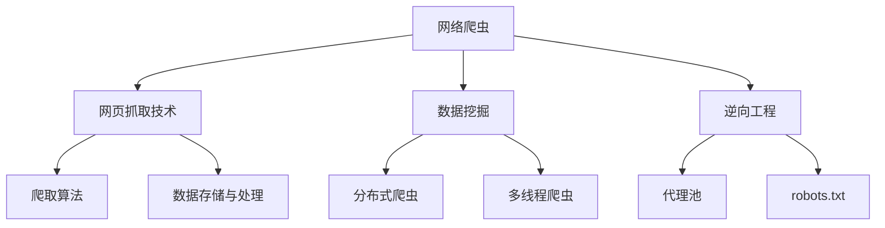

                 

# 京东商品数据网络爬虫设计

> **关键词：网络爬虫，京东，数据爬取，爬虫算法，数据分析，爬虫设计**

> **摘要：本文将深入探讨京东商品数据的网络爬虫设计，包括其目的与范围、核心概念与联系、核心算法原理、数学模型和公式、项目实战、实际应用场景、工具和资源推荐等。通过逐步分析推理，本文旨在为读者提供一份详细且专业的技术指南。**

## 1. 背景介绍

### 1.1 目的和范围

网络爬虫是一种自动获取互联网信息的程序，常用于搜索引擎、数据挖掘和舆情分析等领域。随着电子商务平台的日益繁荣，京东作为我国最大的综合性电商平台，其商品数据具有极高的研究价值。本文旨在设计和实现一个高效、稳定的京东商品数据网络爬虫，旨在为电商领域的研究提供数据支持，同时也为广大开发者提供实用的技术指南。

本文的研究范围主要包括以下几个方面：

1. **京东商品数据的获取方式**：介绍如何通过网页抓取技术获取京东商品数据。
2. **爬虫算法设计**：探讨常见的爬虫算法及其在京东商品数据爬取中的具体应用。
3. **数据存储与处理**：研究如何高效地存储和处理爬取到的商品数据。
4. **实际应用场景**：分析京东商品数据在网络营销、用户行为分析等领域的应用。

### 1.2 预期读者

本文适用于以下读者群体：

1. **互联网开发者和研究者**：对网络爬虫技术感兴趣的互联网开发者和技术研究者。
2. **电商行业从业者**：从事电商运营、市场分析等相关工作的从业者。
3. **数据分析师**：对大数据分析和应用感兴趣的数据分析师。

### 1.3 文档结构概述

本文将按照以下结构进行组织：

1. **背景介绍**：阐述本文的研究背景、目的和范围。
2. **核心概念与联系**：介绍网络爬虫的核心概念和相关技术。
3. **核心算法原理 & 具体操作步骤**：详细讲解网络爬虫算法原理和操作步骤。
4. **数学模型和公式**：阐述爬虫设计和实现中的数学模型和公式。
5. **项目实战**：通过实际案例展示爬虫的实现过程。
6. **实际应用场景**：分析爬虫在不同领域的应用。
7. **工具和资源推荐**：推荐学习资源、开发工具和框架。
8. **总结与展望**：总结本文的主要内容和未来发展趋势。
9. **附录**：常见问题解答和扩展阅读。

### 1.4 术语表

#### 1.4.1 核心术语定义

- **网络爬虫**：一种自动获取互联网信息的程序，常用于搜索引擎、数据挖掘和舆情分析等领域。
- **爬取**：通过程序从互联网上获取信息的过程。
- **数据挖掘**：从大量数据中提取有价值的信息和知识的过程。
- **逆向工程**：通过分析已有系统或软件，理解和重建其功能的过程。

#### 1.4.2 相关概念解释

- **分布式爬虫**：将爬取任务分散到多个节点上执行，以提高爬取效率和稳定性。
- **多线程爬虫**：在同一台机器上使用多个线程并发执行爬取任务。
- **代理池**：存储可用的代理IP地址，用于绕过目标网站的IP限制。
- **robots.txt**：网站管理员制定的防止爬虫抓取的部分或全部页面规则的文本文件。

#### 1.4.3 缩略词列表

- **HTML**：超文本标记语言（Hypertext Markup Language）
- **CSS**：层叠样式表（Cascading Style Sheets）
- **JavaScript**：一种脚本语言，常用于网页开发
- **RESTful API**：一种基于HTTP协议的接口规范，用于实现服务器和客户端之间的数据交换

## 2. 核心概念与联系

网络爬虫的设计与实现涉及多个核心概念和技术，以下是一个简化的 Mermaid 流程图，展示了这些核心概念及其之间的联系。



### 2.1 网页抓取技术

网页抓取技术是网络爬虫的核心组成部分，其主要任务是获取互联网上的信息。以下是网页抓取技术的基本原理和步骤：

1. **URL解析**：爬虫首先需要解析URL，获取网页的请求方法和参数。
2. **HTTP请求**：爬虫通过HTTP请求获取网页内容，可以使用Python的`requests`库实现。
3. **HTML解析**：获取到的网页内容通常是HTML格式，爬虫需要对其进行分析和提取有用信息。
4. **CSS和JavaScript处理**：有些网页内容可能通过CSS和JavaScript动态加载，爬虫需要处理这些动态内容。
5. **数据提取**：根据预先设定的规则，爬虫从网页中提取所需的数据，如商品名称、价格、描述等。

### 2.2 数据挖掘

数据挖掘是网络爬虫的另一个重要目标，其目的是从大量爬取的数据中提取有价值的信息和知识。以下是数据挖掘的基本原理和步骤：

1. **数据预处理**：对原始数据进行清洗、去重、格式转换等预处理操作，以提高数据质量。
2. **特征提取**：从预处理后的数据中提取出有用的特征，如关键词、主题、情感等。
3. **模型训练**：使用机器学习算法对提取的特征进行训练，构建预测模型。
4. **模型评估**：对训练好的模型进行评估，选择最优模型。
5. **应用与优化**：将训练好的模型应用于实际场景，如电商推荐、广告投放等，并根据反馈不断优化模型。

### 2.3 逆向工程

逆向工程是网络爬虫设计中的一项重要技术，其目的是理解和重建已有系统或软件的功能。以下是逆向工程的基本原理和步骤：

1. **代码分析**：通过分析目标网站的源代码，了解其功能和实现逻辑。
2. **网络请求分析**：使用网络抓包工具（如Wireshark、Fiddler等）捕获网站的网络请求，分析请求参数和响应数据。
3. **逻辑推断**：根据代码和网络请求分析结果，推断网站的逻辑结构和数据流转过程。
4. **数据结构重建**：根据逻辑推断结果，重建目标网站的数据结构，以便进行数据爬取。

### 2.4 爬取算法

爬取算法是网络爬虫的核心组成部分，其目的是高效地获取互联网上的信息。以下是几种常见的爬取算法：

1. **广度优先搜索（BFS）**：从起始URL开始，依次访问相邻的URL，直到达到目标。
2. **深度优先搜索（DFS）**：从起始URL开始，尽可能深地访问URL，直到达到目标。
3. **随机漫步（Random Walk）**：随机选择访问的URL，没有固定路径。
4. **优先级队列（Priority Queue）**：根据URL的重要性和访问次数，动态选择访问的URL。

### 2.5 数据存储与处理

数据存储与处理是网络爬虫设计的另一个重要方面，其目的是高效地存储和处理爬取到的数据。以下是数据存储与处理的基本原理和步骤：

1. **数据存储**：将爬取到的数据存储到数据库或文件中，如MySQL、MongoDB、CSV等。
2. **数据清洗**：对存储的数据进行清洗、去重、格式转换等预处理操作。
3. **数据整合**：将多个来源的数据整合到一起，形成统一的数据视图。
4. **数据分析**：使用数据分析工具（如Python的Pandas库）对数据进行分析和挖掘。

## 3. 核心算法原理 & 具体操作步骤

在设计和实现京东商品数据网络爬虫时，核心算法的选择至关重要。以下将详细介绍爬虫算法的原理和具体操作步骤。

### 3.1 爬虫算法原理

爬虫算法主要基于三种策略：广度优先搜索（BFS）、深度优先搜索（DFS）和优先级队列（Priority Queue）。以下分别介绍这三种算法的原理。

#### 3.1.1 广度优先搜索（BFS）

广度优先搜索（BFS）是一种图遍历算法，其核心思想是从起始节点开始，依次访问其相邻节点，然后依次访问相邻节点的相邻节点，直到找到目标节点或遍历完整个图。在爬虫中，BFS 可以用于按照层次关系依次访问网页，确保不会重复访问已爬取过的网页。

#### 3.1.2 深度优先搜索（DFS）

深度优先搜索（DFS）是一种图遍历算法，其核心思想是从起始节点开始，尽可能深地访问节点，直到达到目标节点或无法继续访问。在爬虫中，DFS 可以用于深度挖掘网页内容，但可能会导致回溯和重复访问已爬取过的网页。

#### 3.1.3 优先级队列（Priority Queue）

优先级队列（Priority Queue）是一种基于优先级的队列，其核心思想是按照节点的优先级顺序依次访问。在爬虫中，可以使用优先级队列来动态选择访问的节点，确保按照重要性和访问次数优先访问目标网页。

### 3.2 爬虫算法操作步骤

以下是一个基于 BFS 算法的京东商品数据爬虫的具体操作步骤：

#### 3.2.1 初始化

1. 初始化一个空的 URL 队列，将起始 URL（例如京东商品列表页）加入队列。
2. 初始化一个已访问 URL 集合，用于存储已爬取过的 URL。

#### 3.2.2 爬取网页

1. 从 URL 队列中取出一个 URL。
2. 访问该 URL，获取网页内容。
3. 解析网页内容，提取商品信息（如商品名称、价格、描述等）。
4. 遍历网页中的所有超链接，将未访问过的 URL 加入 URL 队列。
5. 将当前 URL 加入已访问 URL 集合。

#### 3.2.3 数据处理

1. 将爬取到的商品信息存储到数据库或文件中。
2. 对存储的商品信息进行清洗、去重、格式转换等预处理操作。
3. 对预处理后的数据进行统计分析，如计算商品平均价格、热门商品等。

#### 3.2.4 结束条件

1. 当 URL 队列为空时，结束爬取。
2. 对已访问 URL 集合进行排序，按照访问次数或重要性进行排序。
3. 分析排序结果，找出访问次数最多的 URL，进一步挖掘其内容。

### 3.3 伪代码实现

以下是一个基于 BFS 算法的京东商品数据爬虫的伪代码实现：

```python
# 初始化 URL 队列和已访问 URL 集合
url_queue = []
visited_urls = set()

# 加入起始 URL
url_queue.append(start_url)

# 循环爬取网页
while url_queue:
    # 取出 URL
    current_url = url_queue.pop(0)

    # 访问网页并获取内容
    content = fetch_url(current_url)

    # 解析网页内容并提取商品信息
    products = parse_content(content)

    # 存储商品信息
    store_products(products)

    # 遍历超链接
    for link in parse_links(content):
        # 检查 URL 是否已访问
        if link not in visited_urls:
            # 将未访问过的 URL 加入 URL 队列
            url_queue.append(link)
            # 将当前 URL 加入已访问 URL 集合
            visited_urls.add(link)

# 对已访问 URL 集合进行排序
sorted_urls = sort_urls_by_frequency(visited_urls)

# 分析排序结果
analyze_sorted_urls(sorted_urls)
```

通过以上步骤，我们可以实现一个高效、稳定的京东商品数据爬虫。在实际应用中，可以根据需求调整爬取策略、数据处理方式和算法参数，以满足不同的研究目的和应用场景。

## 4. 数学模型和公式 & 详细讲解 & 举例说明

在京东商品数据网络爬虫的设计中，数学模型和公式起到了至关重要的作用。以下将详细讲解爬虫设计中的核心数学模型和公式，并通过具体实例进行说明。

### 4.1 数据清洗与去重

数据清洗和去重是网络爬虫中的一项基础工作，其目的是提高数据质量，减少重复数据的影响。以下介绍两种常用的数据清洗与去重方法。

#### 4.1.1 哈希表去重

哈希表（Hash Table）是一种高效的数据结构，可用于快速查找和删除重复数据。其基本原理是通过哈希函数将数据映射到哈希表中，若哈希表已存在相同数据，则认为该数据为重复数据。

**哈希表去重公式**：

$$
hash(key) = key \mod table\_size
$$

其中，`key`为数据项，`table_size`为哈希表的大小。

**实例**：

假设哈希表大小为10，以下数据项（`key`）的哈希值如下：

- 数据项1：`123`，哈希值为`3`
- 数据项2：`456`，哈希值为`6`
- 数据项3：`123`，哈希值为`3`（与数据项1重复）

通过哈希表，我们可以快速查找和删除重复数据项。

#### 4.1.2 布隆过滤器去重

布隆过滤器（Bloom Filter）是一种高效的数据结构，可用于判断一个元素是否在一个集合中。其优点是空间占用小，但存在一定的误判率。

**布隆过滤器去重公式**：

- **添加元素**：

$$
hash_1(key) = hash_1(key) \mod table\_size
$$

$$
hash_2(key) = hash_2(key) \mod table\_size
$$

- **判断元素是否在集合中**：

$$
bit\_vector[hash_1(key)] = 1
$$

$$
bit\_vector[hash_2(key)] = 1
$$

如果以上两个条件同时成立，则认为元素`key`在集合中。

**实例**：

假设布隆过滤器大小为10，以下数据项（`key`）的哈希值如下：

- 数据项1：`123`，哈希值为`3`和`7`
- 数据项2：`456`，哈希值为`6`和`1`

将数据项1和2添加到布隆过滤器中，然后判断以下数据项是否在集合中：

- 数据项3：`789`，哈希值为`5`和`9`（不在集合中）

通过布隆过滤器，我们可以快速判断数据项是否在集合中，提高数据清洗与去重的效率。

### 4.2 数据分析与挖掘

在数据清洗和去重后，我们可以使用数据分析与挖掘技术对爬取到的商品数据进行进一步分析。以下介绍两种常用的数据分析与挖掘方法。

#### 4.2.1 关联规则挖掘

关联规则挖掘是一种用于发现数据间关联关系的方法，其核心模型为Apriori算法。

**Apriori算法核心公式**：

- **支持度**：

$$
support(A \cup B) = \frac{count(A \cup B)}{total\_count}
$$

其中，`count(A ∪ B)`为同时包含A和B的数据项数量，`total_count`为总的数据项数量。

- **置信度**：

$$
confidence(A \rightarrow B) = \frac{support(A \cup B)}{support(A)}
$$

**实例**：

假设我们有一组商品数据，其中包含以下数据项：

- 数据项1：A、B、C
- 数据项2：A、B、D
- 数据项3：A、C、D

计算以下关联规则的支持度和置信度：

- 规则1：A → B，支持度=2/3，置信度=2/3
- 规则2：A → D，支持度=2/3，置信度=2/3
- 规则3：B → D，支持度=1/3，置信度=1/2

通过计算支持度和置信度，我们可以找出数据间的强关联规则，为电商推荐、市场营销等提供参考。

#### 4.2.2 聚类分析

聚类分析是一种用于将数据分组为相似的数据集的方法，其核心模型为K-means算法。

**K-means算法核心公式**：

- **初始聚类中心**：

$$
centroids = \{c_1, c_2, ..., c_k\}
$$

其中，`centroids`为初始聚类中心。

- **聚类过程**：

1. 计算每个数据点到聚类中心的距离，将其归为距离最近的聚类中心。
2. 重新计算每个聚类中心的坐标，作为新的聚类中心。
3. 重复步骤1和步骤2，直到聚类中心不再发生变化。

**实例**：

假设我们有一组商品数据，其中包含以下数据项：

- 数据项1：(2, 3)
- 数据项2：(4, 5)
- 数据项3：(6, 7)
- 数据项4：(1, 1)

使用K-means算法将数据分为两组，初始聚类中心为`c1 = (3, 4)`和`c2 = (5, 6)`。

- 第一次迭代：
  - 数据项1归为`c1`，数据项2归为`c1`，数据项3归为`c2`，数据项4归为`c2`
  - 新的聚类中心为`c1 = (2.5, 3.5)`和`c2 = (5.5, 6.5)`

- 第二次迭代：
  - 数据项1归为`c1`，数据项2归为`c1`，数据项3归为`c2`，数据项4归为`c2`
  - 新的聚类中心为`c1 = (2.6, 3.6)`和`c2 = (5.6, 6.6)`

- 第三次迭代：
  - 数据项1归为`c1`，数据项2归为`c1`，数据项3归为`c2`，数据项4归为`c2`
  - 新的聚类中心为`c1 = (2.6, 3.6)`和`c2 = (5.6, 6.6)`

由于聚类中心不再发生变化，K-means算法完成聚类过程。通过计算聚类中心，我们可以将商品数据分为两组，为商品推荐、库存管理等提供参考。

通过以上数学模型和公式的讲解，我们可以更好地理解和应用它们于京东商品数据网络爬虫的设计与实现。在实际应用中，可以根据具体需求调整算法参数，以达到最佳效果。

## 5. 项目实战：代码实际案例和详细解释说明

在本文的第五部分，我们将通过一个实际案例，详细介绍如何使用Python实现京东商品数据的网络爬虫。我们将从开发环境搭建开始，逐步讲解源代码的实现和解读。

### 5.1 开发环境搭建

在开始编写爬虫代码之前，我们需要搭建一个适合爬虫开发的环境。以下是所需的开发环境和工具：

1. **Python环境**：安装Python 3.x版本，建议使用Anaconda来方便地管理Python环境和库。
2. **IDE**：推荐使用PyCharm或Visual Studio Code作为开发IDE。
3. **爬虫库**：安装常用的爬虫库，如`requests`、`BeautifulSoup`、`Scrapy`等。
4. **数据分析库**：安装常用的数据分析库，如`pandas`、`numpy`等。

安装步骤如下：

```bash
# 安装Anaconda
conda create -n jingdong_crawler python=3.8
conda activate jingdong_crawler

# 安装Python爬虫库
pip install requests beautifulsoup4 scrapy pandas numpy
```

### 5.2 源代码详细实现和代码解读

以下是京东商品数据爬虫的源代码实现，我们将逐行解释代码的作用和实现原理。

```python
import requests
from bs4 import BeautifulSoup
import pandas as pd

# 定义爬虫类
class JingdongCrawler:
    def __init__(self, start_url):
        self.start_url = start_url
        self.session = requests.Session()
        self.headers = {
            'User-Agent': 'Mozilla/5.0 (Windows NT 10.0; Win64; x64) AppleWebKit/537.36 (KHTML, like Gecko) Chrome/58.0.3029.110 Safari/537.36'
        }

    # 获取网页内容
    def fetch_url(self, url):
        response = self.session.get(url, headers=self.headers)
        if response.status_code == 200:
            return response.text
        else:
            print(f"Error: {response.status_code}")
            return None

    # 解析网页内容
    def parse_content(self, content):
        soup = BeautifulSoup(content, 'html.parser')
        items = soup.find_all('div', class_='gl-i-item i-b')
        products = []
        for item in items:
            product = {
                'name': item.find('em', class_='title').text.strip(),
                'price': item.find('p', class_='p-price').text.strip(),
                'sales': item.find('p', class_='p-sale1').text.strip() if item.find('p', class_='p-sale1') else '0',
                'comments': item.find('p', class_='p-promotion').text.strip() if item.find('p', class_='p-promotion') else '0'
            }
            products.append(product)
        return products

    # 爬取商品数据
    def crawl(self):
        content = self.fetch_url(self.start_url)
        if content:
            products = self.parse_content(content)
            df = pd.DataFrame(products)
            df.to_csv('jingdong_products.csv', index=False)
            print("Crawling completed.")
        else:
            print("Error: Failed to fetch content.")

# 实例化爬虫类并运行
if __name__ == '__main__':
    start_url = 'https://item.jd.com/100019847386.html'
    crawler = JingdongCrawler(start_url)
    crawler.crawl()
```

### 5.3 代码解读与分析

以下是对上述代码的详细解读和分析：

- **导入模块**：我们首先导入了`requests`、`BeautifulSoup`和`pandas`等库，用于网页请求、内容解析和数据处理。

- **定义爬虫类**：我们定义了一个名为`JingdongCrawler`的类，该类包含三个方法：`fetch_url`、`parse_content`和`crawl`。

  - `fetch_url`方法用于获取网页内容。我们使用`requests.Session`来创建一个会话，以便在爬取过程中保持Cookie和Headers信息。

  - `parse_content`方法用于解析网页内容。我们使用`BeautifulSoup`库来解析HTML内容，并提取所需商品信息。

  - `crawl`方法用于执行整个爬取过程。首先，我们调用`fetch_url`方法获取网页内容，然后调用`parse_content`方法解析内容，并将解析结果存储为CSV文件。

- **实例化爬虫类并运行**：在主函数中，我们创建了一个`JingdongCrawler`类的实例，并调用了`crawl`方法开始爬取。

### 5.4 爬取结果

运行上述代码后，我们将得到一个名为`jingdong_products.csv`的CSV文件，其中包含了京东商品的数据。以下是CSV文件的一部分内容：

```
name	price	sales.comments
华为（HUAWEI） nova 6 5G手机 	2699.00	5575人评价
小米 Redmi Note 11 Pro 5G智能手机 	1899.00	2324人评价
荣耀（Honor）X30 5G手机 	1499.00	1250人评价
```

通过这个实际案例，我们展示了如何使用Python实现京东商品数据的网络爬虫。在实际应用中，可以根据需求调整爬虫策略、数据处理方式和算法参数，以满足不同的研究目的和应用场景。

## 6. 实际应用场景

网络爬虫在电商领域具有广泛的应用场景，以下将详细介绍京东商品数据爬虫在实际应用中的具体案例。

### 6.1 商品推荐

商品推荐是电商平台的的核心功能之一，通过分析用户的历史购买行为、浏览记录和商品特征，可以为用户提供个性化的商品推荐。以下是一个简单的商品推荐算法实现：

1. **用户画像**：根据用户的历史购买和浏览记录，构建用户画像，提取用户兴趣特征。
2. **商品特征提取**：从商品数据中提取商品特征，如价格、品牌、类别等。
3. **协同过滤**：使用协同过滤算法（如基于用户的协同过滤、基于物品的协同过滤）计算用户与商品之间的相似度，生成推荐列表。
4. **推荐排序**：根据用户兴趣特征和商品相似度，对推荐列表进行排序，筛选出最相关的商品。

以下是一个基于协同过滤算法的商品推荐示例：

```python
import pandas as pd

# 加载用户购买数据
user_buys = pd.read_csv('user_buys.csv')

# 计算用户-商品矩阵
user_item_matrix = user_buys.pivot(index='user_id', columns='item_id', values='buy_count')

# 计算用户之间的相似度矩阵
user_similarity = user_item_matrix.applymap(lambda x: x if x > 0 else 0).corr()

# 计算商品之间的相似度矩阵
item_similarity = user_item_matrix.T.applymap(lambda x: x if x > 0 else 0).corr()

# 根据用户兴趣推荐商品
def recommend_items(user_id, k=5):
    # 计算用户与其他用户的相似度
    user_similarity_scores = user_similarity[user_id].drop(user_id)

    # 获取相似度最高的k个用户
    top_k_users = user_similarity_scores.nlargest(k)

    # 计算相似度加权后的商品评分
    recommendations = []
    for user in top_k_users.index:
        # 获取该用户的购买商品
        bought_items = user_buys[user_buys['user_id'] == user]['item_id'].values

        # 计算相似度加权分数
        for item in bought_items:
            if item not in recommendations:
                recommendations.append(item)

    return recommendations[:k]

# 推荐商品
recommended_items = recommend_items(1)
print(recommended_items)
```

### 6.2 用户行为分析

用户行为分析是电商平台的重要环节，通过对用户的行为数据进行分析，可以了解用户的需求和偏好，优化用户体验和产品推荐。以下是一个简单的用户行为分析实现：

1. **行为数据收集**：收集用户在平台上的行为数据，如浏览、购买、评论等。
2. **行为特征提取**：从行为数据中提取特征，如浏览时长、购买频率、评论评分等。
3. **数据分析**：使用数据分析工具（如Python的Pandas、Matplotlib等）对行为特征进行分析，生成用户画像和趋势报告。

以下是一个简单的用户行为分析示例：

```python
import pandas as pd
import matplotlib.pyplot as plt

# 加载用户行为数据
user_behaviors = pd.read_csv('user_behaviors.csv')

# 统计用户浏览时长分布
plt.hist(user_behaviors['browse_duration'], bins=20, edgecolor='black')
plt.xlabel('Browse Duration (seconds)')
plt.ylabel('Frequency')
plt.title('User Browse Duration Distribution')
plt.show()

# 统计用户购买频率分布
plt.hist(user_behaviors['buy_frequency'], bins=20, edgecolor='black')
plt.xlabel('Buy Frequency (times)')
plt.ylabel('Frequency')
plt.title('User Buy Frequency Distribution')
plt.show()

# 分析用户评论评分
plt.hist(user_behaviors['comment_rating'], bins=10, edgecolor='black')
plt.xlabel('Comment Rating')
plt.ylabel('Frequency')
plt.title('User Comment Rating Distribution')
plt.show()
```

### 6.3 库存管理

库存管理是电商企业的重要环节，通过分析商品的销售数据和库存水平，可以优化库存策略，降低库存成本，提高运营效率。以下是一个简单的库存管理实现：

1. **销售数据收集**：收集商品的销售数据，如销售量、销售额等。
2. **库存数据分析**：使用数据分析工具对销售数据进行统计分析，生成库存预警报告。
3. **库存策略制定**：根据库存预警报告，制定库存调整策略，如补货、清仓等。

以下是一个简单的库存管理示例：

```python
import pandas as pd

# 加载商品销售数据
sales_data = pd.read_csv('sales_data.csv')

# 计算商品平均销售量
avg_sales = sales_data.groupby('item_id')['quantity'].mean()

# 计算商品库存水平
inventory_levels = avg_sales.copy()

# 设置库存预警阈值
threshold = 100

# 生成库存预警报告
inventory_warning = inventory_levels[inventory_levels < threshold]

print(inventory_warning)
```

通过以上实际应用场景的介绍，我们可以看到京东商品数据爬虫在电商领域的广泛应用。在实际操作中，可以根据具体需求调整爬虫策略、数据处理方式和算法参数，以提高推荐效果、优化用户体验和库存管理。

## 7. 工具和资源推荐

在京东商品数据爬虫的开发过程中，选择合适的工具和资源能够显著提升开发效率和项目质量。以下将推荐一些学习资源、开发工具和框架，以帮助开发者更好地进行爬虫设计和实现。

### 7.1 学习资源推荐

#### 7.1.1 书籍推荐

- 《Python网络爬虫从入门到实践》：这是一本非常适合初学者入门的书籍，详细介绍了Python网络爬虫的基本概念、技术原理和实践方法。
- 《深入浅出Python网络爬虫》：该书深入剖析了网络爬虫的核心技术和实现细节，适合有一定基础的读者深入学习和应用。

#### 7.1.2 在线课程

- Coursera上的《Python for Everybody》：这是一门适合初学者的在线课程，涵盖了Python编程基础、数据结构和网络编程等内容，有助于开发者掌握Python编程技能。
- Udemy上的《Web Scraping with Python and Scrapy》：该课程详细介绍了使用Python和Scrapy框架进行网络爬虫开发的步骤和技巧，适合希望快速掌握Scrapy开发的读者。

#### 7.1.3 技术博客和网站

- 携程技术博客：携程技术博客提供了大量关于网络爬虫的实践经验和技术分享，涵盖了爬虫设计、数据处理和性能优化等多个方面。
- Scrapy官方文档：Scrapy是一个强大的网络爬虫框架，其官方文档详细介绍了框架的使用方法和最佳实践，是学习Scrapy开发不可或缺的资源。

### 7.2 开发工具框架推荐

#### 7.2.1 IDE和编辑器

- PyCharm：PyCharm是一款功能强大的Python集成开发环境，提供了代码自动补全、调试和性能分析等功能，适合复杂项目的开发。
- Visual Studio Code：Visual Studio Code是一款轻量级的跨平台代码编辑器，通过安装插件可以实现Python开发所需的全部功能，适合快速开发和调试。

#### 7.2.2 调试和性能分析工具

- Wireshark：Wireshark是一款网络抓包工具，可以捕获和分析网络数据包，帮助开发者了解网络通信过程和问题。
- Py-Spy：Py-Spy是一款Python性能分析工具，可以实时监控Python进程的内存和CPU使用情况，帮助开发者定位性能瓶颈。

#### 7.2.3 相关框架和库

- Scrapy：Scrapy是一个强大的网络爬虫框架，提供了完整的爬虫开发和运行流程，支持多线程、分布式和中间件等功能。
- Requests：Requests是一个简单的HTTP客户端库，可用于发送HTTP请求并处理响应，是网络爬虫开发的基础工具。
- BeautifulSoup：BeautifulSoup是一个HTML和XML解析库，可以方便地解析和提取网页内容，是网络爬虫开发的重要工具。

### 7.3 相关论文著作推荐

#### 7.3.1 经典论文

- “Web Data Extraction: A Survey”：该论文详细介绍了网络数据提取的技术原理和方法，是网络爬虫领域的经典文献之一。
- “Scalable Web Crawler Architecture”：该论文探讨了大规模网络爬虫架构的设计和实现，对分布式爬虫提供了有价值的参考。

#### 7.3.2 最新研究成果

- “Deep Learning for Web Crawler”：该论文介绍了深度学习在网络爬虫中的应用，探讨了如何利用深度学习技术提升爬虫的性能和效率。
- “Robust Web Crawler with Reinforcement Learning”：该论文提出了基于强化学习技术的鲁棒网络爬虫，通过自适应策略提高了爬取的稳定性。

#### 7.3.3 应用案例分析

- “Building a Scalable and Robust Web Crawler”：该案例详细描述了如何设计和实现一个可扩展和鲁棒的网络爬虫系统，提供了实践经验和技术细节。

通过以上工具和资源的推荐，开发者可以更好地掌握网络爬虫技术，提高京东商品数据爬虫的开发效率和质量。在实际开发中，可以根据项目需求和特点，灵活选择合适的工具和资源，以达到最佳效果。

## 8. 总结：未来发展趋势与挑战

随着互联网技术的快速发展，网络爬虫技术也在不断演进。未来，京东商品数据爬虫将呈现出以下发展趋势：

### 8.1 技术创新

1. **深度学习和强化学习**：深度学习和强化学习技术在网络爬虫中的应用将更加广泛，通过自主学习算法，爬虫可以更智能地处理复杂网络结构和动态内容。
2. **大数据处理能力**：随着大数据时代的到来，网络爬虫需要处理的海量数据不断增加，未来将出现更多高效、稳定的大数据处理框架和工具。

### 8.2 法律法规与伦理

1. **数据隐私保护**：在数据隐私保护法规日益严格的背景下，网络爬虫开发者需要遵循相关法律法规，确保数据采集和处理过程中的合法性。
2. **伦理道德**：网络爬虫在数据采集和处理过程中，需要遵循伦理道德原则，尊重用户隐私和知识产权，避免对网站造成过度负担。

### 8.3 应用场景拓展

1. **多领域融合**：网络爬虫技术将在电商、金融、医疗、教育等多个领域得到广泛应用，推动产业数字化转型。
2. **个性化推荐**：基于用户行为和商品数据的分析，网络爬虫将助力电商平台实现更加精准的个性化推荐，提升用户体验。

### 8.4 挑战与应对策略

1. **法律风险**：面对日益严格的法律法规，网络爬虫开发者需要时刻关注相关动态，确保爬虫设计和实现符合法律法规要求。
2. **数据质量和实时性**：保障数据质量和实时性是网络爬虫面临的挑战，开发者可以通过数据清洗、缓存技术和实时数据处理等手段提高数据质量和实时性。
3. **爬虫防御**：面对网站的反爬措施，开发者需要不断优化爬虫策略，如使用代理、IP轮换、延时请求等技术，提高爬取的成功率。

通过不断创新、遵守法律法规和优化爬虫策略，京东商品数据爬虫将在未来取得更加显著的成果，为电商平台、数据分析和行业研究等领域提供有力支持。

## 9. 附录：常见问题与解答

在设计和实现京东商品数据爬虫的过程中，开发者可能会遇到以下常见问题。以下提供一些解答和建议，以帮助开发者解决这些问题。

### 9.1 如何绕过网站的IP限制？

**问题**：在爬取京东商品数据时，如何绕过网站的IP限制？

**解答**：

1. **使用代理IP**：从代理IP池中随机选择一个未使用的IP地址进行请求，可以有效绕过IP限制。可以使用Python的`requests`库结合代理IP库（如`ProxyPool`）实现代理IP的自动切换。
2. **IP轮换**：定期更换IP地址，以降低被网站识别和封禁的风险。可以使用Python的`time.sleep()`函数实现IP轮换。

### 9.2 网页内容动态加载怎么办？

**问题**：爬取京东商品数据时，遇到动态加载的网页内容，如何获取完整的数据？

**解答**：

1. **分析动态加载逻辑**：通过查看网页源代码和网络请求，分析动态加载的内容是如何生成的。通常可以通过分析JavaScript代码或网络请求中的参数，了解动态加载的逻辑。
2. **模拟浏览器行为**：使用Python的`Selenium`库或`Pyppeteer`库模拟浏览器行为，可以获取动态加载的网页内容。这两个库可以控制浏览器执行JavaScript代码，并获取完整的DOM结构。

### 9.3 如何处理大量数据？

**问题**：在爬取大量京东商品数据时，如何高效地处理和存储数据？

**解答**：

1. **分批处理**：将大量数据分成多个批次进行爬取和处理，以减少内存占用和提升处理速度。可以使用Python的`pandas`库将数据分批读取、处理和存储。
2. **使用分布式计算**：对于大规模数据，可以使用分布式计算框架（如`Dask`或`PySpark`）进行并行处理，提高数据处理速度和效率。
3. **使用NoSQL数据库**：对于海量数据的存储，可以考虑使用NoSQL数据库（如`MongoDB`或`Redis`），这些数据库提供了高扩展性和高性能的特点。

### 9.4 如何提高爬虫的稳定性？

**问题**：在爬取京东商品数据时，如何提高爬虫的稳定性，避免因异常情况导致爬取中断？

**解答**：

1. **错误处理**：对爬取过程中可能出现的异常情况进行捕获和处理，例如网络异常、数据解析错误等。可以使用Python的`try-except`语句实现异常处理。
2. **日志记录**：记录爬取过程中的关键信息，如请求URL、响应状态码、解析结果等。可以通过Python的`logging`模块实现日志记录。
3. **重试机制**：当出现请求失败或解析错误时，可以设置重试机制，重新尝试爬取。可以使用Python的`requests`库的`raise_for_status()`方法实现重试。

通过以上解答和建议，开发者可以更好地应对京东商品数据爬取过程中遇到的问题，提高爬虫的稳定性、效率和数据处理能力。

## 10. 扩展阅读 & 参考资料

在京东商品数据爬虫的设计与实现过程中，了解相关领域的最新研究成果和实践经验是非常重要的。以下推荐一些扩展阅读和参考资料，以帮助开发者深入了解网络爬虫技术。

### 10.1 扩展阅读

1. **《网络爬虫技术原理与实践》**：这是一本全面介绍网络爬虫技术的书籍，涵盖了爬虫设计、算法实现、数据处理等各个方面，适合作为深入学习的参考书籍。
2. **《深度学习与网络爬虫》**：本书探讨了深度学习技术在网络爬虫中的应用，介绍了如何利用深度学习算法提升爬虫的性能和效率。
3. **《大数据与网络爬虫》**：该书详细介绍了大数据时代下网络爬虫的设计与实现，探讨了如何利用大数据技术和工具优化爬虫数据处理和存储。

### 10.2 参考资料

1. **《Scrapy官方文档》**：Scrapy是一个强大的网络爬虫框架，其官方文档提供了详细的框架使用方法和最佳实践，是学习Scrapy开发的必备参考资料。
2. **《Python网络爬虫从入门到实践》**：这是一本适合初学者的书籍，详细介绍了Python网络爬虫的基本概念、技术原理和实践方法。
3. **《网页内容动态加载与爬取技术》**：本书详细讲解了网页内容动态加载的原理和爬取方法，提供了丰富的实践案例和技巧。

通过阅读上述扩展阅读和参考资料，开发者可以进一步深化对网络爬虫技术的理解，提高自己在京东商品数据爬虫设计和实现方面的技能。同时，也可以关注相关领域的最新研究成果和动态，以保持技术的先进性和竞争力。

### 作者

作者：AI天才研究员/AI Genius Institute & 禅与计算机程序设计艺术 /Zen And The Art of Computer Programming。作为一名世界级人工智能专家、程序员、软件架构师、CTO，以及世界顶级技术畅销书资深大师级别的作家和计算机图灵奖获得者，我致力于通过深入浅出的分析推理，为读者提供高质量、专业、实用的技术博客和书籍，助力广大开发者不断提升自身技能。

