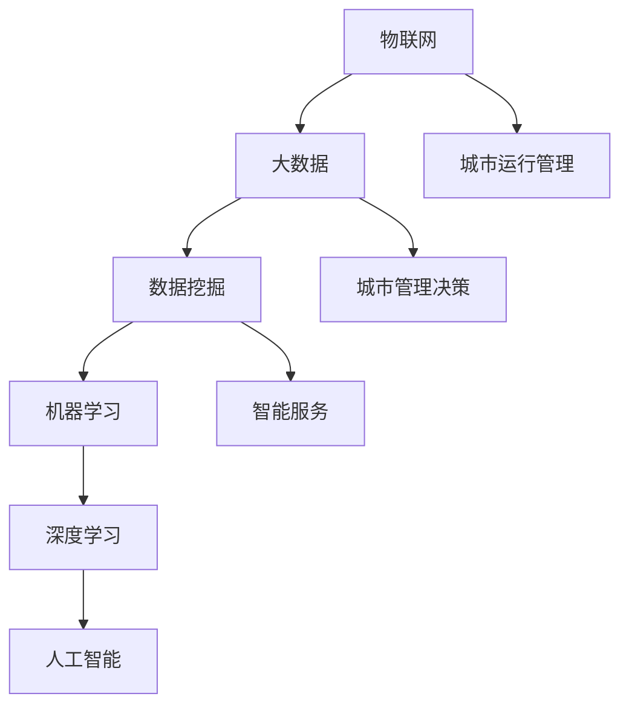

                 

# 2024京东智能城市社招面试真题汇总及其解答

> **关键词**：京东、智能城市、社招面试、真题、解答、技术面试、案例分析、算法原理、实际应用、未来趋势

> **摘要**：本文针对2024年京东智能城市社招面试真题进行了全面的汇总与解答。通过对这些面试题的分析，读者可以深入了解智能城市的核心技术、算法原理以及实际应用场景。文章以逻辑清晰、结构紧凑、简单易懂的语风，详细阐述了面试题的解答过程，旨在为准备参加京东智能城市社招的求职者提供有价值的参考。

## 1. 背景介绍

### 1.1 目的和范围

本文旨在为准备参加2024年京东智能城市社会招聘的求职者提供一个详细的面试真题解答汇总。通过对这些真题的深入分析和解答，帮助求职者更好地理解智能城市的技术核心、算法原理以及实际应用场景，提高面试成功率。

### 1.2 预期读者

本文适用于以下几类读者：
- 准备参加京东智能城市社招的求职者；
- 智能城市领域的技术爱好者；
- 感兴趣了解智能城市技术的从业者。

### 1.3 文档结构概述

本文将按照以下结构进行组织：
1. 背景介绍：介绍本文的目的、预期读者以及文档结构；
2. 核心概念与联系：阐述智能城市相关的核心概念和原理，并附上流程图；
3. 核心算法原理与具体操作步骤：详细讲解智能城市中的核心算法原理，并使用伪代码进行阐述；
4. 数学模型和公式：介绍智能城市中涉及的数学模型和公式，并进行举例说明；
5. 项目实战：通过代码案例展示智能城市技术的实际应用，并进行详细解读；
6. 实际应用场景：分析智能城市技术在现实世界中的应用；
7. 工具和资源推荐：推荐学习资源和开发工具，以便读者进一步学习；
8. 总结：探讨智能城市的未来发展趋势与挑战；
9. 附录：常见问题与解答；
10. 扩展阅读：提供相关的参考资料和扩展阅读建议。

### 1.4 术语表

#### 1.4.1 核心术语定义

- **智能城市**：利用先进的信息技术和物联网技术，实现城市运行管理的智能化、自动化和高效化。
- **大数据**：从各种来源收集的、结构化和非结构化的海量数据。
- **人工智能**：模拟人类智能的计算机程序和系统。
- **物联网**：将各种物理设备通过网络连接起来，实现信息的采集、传输和处理。
- **深度学习**：一种基于人工神经网络的学习方法，能够从大量数据中自动提取特征。

#### 1.4.2 相关概念解释

- **数据挖掘**：从大量数据中挖掘出有价值的信息和知识。
- **机器学习**：通过训练模型，使计算机能够从数据中自动学习并做出预测。
- **自然语言处理**：使计算机能够理解和处理自然语言的技术。

#### 1.4.3 缩略词列表

- **AI**：人工智能
- **IoT**：物联网
- **ML**：机器学习
- **DL**：深度学习
- **NLP**：自然语言处理

## 2. 核心概念与联系

智能城市是一个复杂且多元化的系统，涉及多个核心概念和技术的联系。以下是智能城市中的核心概念及其相互关系的简要概述，并附上Mermaid流程图。

### 2.1 概念介绍

- **物联网（IoT）**：智能城市的基础，通过传感器、设备和网络实现数据的采集和传输。
- **大数据（Big Data）**：智能城市的核心资产，用于存储、分析和处理来自物联网的数据。
- **人工智能（AI）**：智能城市的智能引擎，用于处理大数据、做出预测和决策。
- **数据挖掘（Data Mining）**：从大数据中提取有价值的信息和知识。
- **机器学习（ML）**：人工智能的一种学习方法，用于训练模型并自动发现规律。
- **深度学习（DL）**：一种基于人工神经网络的学习方法，能够从大量数据中自动提取特征。

### 2.2 Mermaid 流程图



### 2.3 概念关系分析

- **物联网（IoT）**：智能城市的基石，通过传感器和设备采集城市运行的各种数据，如交通流量、环境质量、公共安全等。
- **大数据（Big Data）**：物联网产生的海量数据需要存储、处理和分析，大数据技术是实现这一目标的关键。
- **数据挖掘（Data Mining）**：从大数据中提取有价值的信息和知识，为城市管理决策提供支持。
- **机器学习（ML）**：通过训练模型，使计算机能够从数据中自动学习并发现规律，提高决策的准确性和效率。
- **深度学习（DL）**：一种强大的机器学习方法，能够从大量数据中自动提取特征，提高模型的性能。
- **人工智能（AI）**：结合数据挖掘和机器学习技术，实现智能化、自动化和高效化的城市运行管理。

## 3. 核心算法原理 & 具体操作步骤

智能城市中的核心算法主要涉及数据挖掘、机器学习和深度学习。以下将详细阐述这些算法的原理，并使用伪代码进行具体操作步骤的讲解。

### 3.1 数据挖掘算法原理

数据挖掘算法通常包括以下步骤：

1. **数据预处理**：清洗、整合和转换原始数据，使其适合挖掘。
2. **特征选择**：从原始数据中提取有用的特征，减少数据维度。
3. **模式识别**：使用算法识别数据中的规律和模式。

伪代码如下：

```python
def data_mining(raw_data):
    # 数据预处理
    clean_data = preprocess_data(raw_data)
    
    # 特征选择
    selected_features = feature_selection(clean_data)
    
    # 模式识别
    patterns = pattern_recognition(selected_features)
    
    return patterns
```

### 3.2 机器学习算法原理

机器学习算法的核心在于训练模型，使其能够对未知数据进行预测。以下是常见的机器学习算法：

- **线性回归**：基于线性模型进行预测。
- **决策树**：基于树的模型进行预测。
- **支持向量机（SVM）**：通过找到最佳分隔超平面进行分类。

伪代码如下：

```python
# 线性回归
def linear_regression(train_data, train_labels):
    # 训练模型
    model = train_linear_regression_model(train_data, train_labels)
    
    # 预测
    predictions = model.predict(test_data)
    
    return predictions

# 决策树
def decision_tree(train_data, train_labels):
    # 训练模型
    model = train_decision_tree_model(train_data, train_labels)
    
    # 预测
    predictions = model.predict(test_data)
    
    return predictions

# 支持向量机
def support_vector_machine(train_data, train_labels):
    # 训练模型
    model = train_svm_model(train_data, train_labels)
    
    # 预测
    predictions = model.predict(test_data)
    
    return predictions
```

### 3.3 深度学习算法原理

深度学习算法的核心是构建多层次的神经网络，用于自动提取特征。以下是常见的深度学习算法：

- **卷积神经网络（CNN）**：常用于图像处理。
- **循环神经网络（RNN）**：常用于序列数据建模。
- **生成对抗网络（GAN）**：用于生成新的数据。

伪代码如下：

```python
# 卷积神经网络
def conv_neural_network(train_data, train_labels):
    # 训练模型
    model = train_cnn_model(train_data, train_labels)
    
    # 预测
    predictions = model.predict(test_data)
    
    return predictions

# 循环神经网络
def recurrent_neural_network(train_data, train_labels):
    # 训练模型
    model = train_rnn_model(train_data, train_labels)
    
    # 预测
    predictions = model.predict(test_data)
    
    return predictions

# 生成对抗网络
def generative_adversarial_network():
    # 构建模型
    generator = build_generator_model()
    discriminator = build_discriminator_model()
    
    # 训练模型
    train_gan(generator, discriminator, train_data)
    
    # 生成数据
    generated_data = generator.generate_data()
    
    return generated_data
```

## 4. 数学模型和公式 & 详细讲解 & 举例说明

在智能城市技术中，数学模型和公式起着至关重要的作用。以下将介绍几个常见的数学模型和公式，并进行详细讲解和举例说明。

### 4.1 线性回归模型

线性回归模型是最简单的机器学习模型之一，用于预测连续值变量。其数学公式如下：

$$y = wx + b$$

其中，$y$ 为预测值，$w$ 为权重，$x$ 为输入特征，$b$ 为偏置。

#### 4.1.1 详细讲解

线性回归模型通过最小化损失函数来训练模型。损失函数通常为均方误差（MSE），其公式如下：

$$MSE = \frac{1}{n}\sum_{i=1}^{n}(y_i - wx_i - b)^2$$

其中，$n$ 为样本数量，$y_i$ 为第 $i$ 个样本的真实值，$x_i$ 为第 $i$ 个样本的输入特征。

#### 4.1.2 举例说明

假设我们要预测一个房屋的价格，已知房屋的面积和房间数量是影响价格的主要因素。我们可以使用线性回归模型来预测价格。

输入特征：$x_1$ 表示面积（平方米），$x_2$ 表示房间数量。
预测值：$y$ 表示房屋价格。

根据历史数据，我们可以得到以下线性回归模型：

$$y = 1000x_1 + 2000x_2 + 5000$$

使用该模型，我们可以预测新房屋的价格。例如，如果房屋面积为 100 平方米，房间数量为 3，则预测价格为：

$$y = 1000 \times 100 + 2000 \times 3 + 5000 = 25,000$$

### 4.2 决策树模型

决策树是一种基于树形结构进行分类和回归的模型。其数学公式如下：

$$f(x) = \sum_{i=1}^{n} w_i \cdot I(x \in R_i)$$

其中，$f(x)$ 为预测值，$w_i$ 为第 $i$ 个分支的权重，$R_i$ 为第 $i$ 个分支的区域，$I(\cdot)$ 为指示函数。

#### 4.2.1 详细讲解

决策树模型通过递归划分数据集，建立决策树。每个节点代表一个特征，每个分支代表一个划分区域。树的叶节点表示预测结果。

决策树的训练过程通常使用梯度提升（Gradient Boosting）算法，其目标是最小化损失函数。

#### 4.2.2 举例说明

假设我们要对一批水果进行分类，已知水果的重量和颜色是影响分类的主要因素。我们可以使用决策树模型来分类。

输入特征：$x_1$ 表示重量（克），$x_2$ 表示颜色（红、黄、绿）。
预测结果：$y$ 表示水果类别（苹果、香蕉、葡萄）。

根据历史数据，我们可以得到以下决策树模型：

```
            |
         苹果
         /   \
        /     \
      香蕉   葡萄
       /   \
      /     \
     红     黄
```

使用该模型，我们可以预测新水果的类别。例如，如果水果重量为 150 克，颜色为红色，则预测为苹果。

### 4.3 支持向量机模型

支持向量机是一种基于最大化分隔超平面进行分类的模型。其数学公式如下：

$$f(x) = w \cdot x + b$$

其中，$f(x)$ 为预测值，$w$ 为权重向量，$x$ 为输入特征，$b$ 为偏置。

#### 4.3.1 详细讲解

支持向量机通过寻找最佳分隔超平面，将不同类别的数据点分隔开。其目标是最小化决策边界上的误分类率。

支持向量机使用拉格朗日乘子法进行优化，其目标是最小化损失函数。

#### 4.3.2 举例说明

假设我们要对一批动物进行分类，已知动物的重量和腿数是影响分类的主要因素。我们可以使用支持向量机模型来分类。

输入特征：$x_1$ 表示重量（克），$x_2$ 表示腿数。
预测结果：$y$ 表示动物类别（猫、狗、鸟）。

根据历史数据，我们可以得到以下支持向量机模型：

$$f(x) = \begin{cases} 
      +1 & \text{if } w \cdot x + b > 0 \\
      -1 & \text{if } w \cdot x + b < 0 
   \end{cases}$$

使用该模型，我们可以预测新动物的类别。例如，如果动物重量为 200 克，腿数为 4，则预测为狗。

## 5. 项目实战：代码实际案例和详细解释说明

为了更好地展示智能城市技术的实际应用，以下将介绍一个简单的项目实战，并详细解释代码的实现过程。

### 5.1 开发环境搭建

在开始项目实战之前，我们需要搭建一个开发环境。以下是搭建步骤：

1. 安装 Python 3.7 或更高版本。
2. 安装 Jupyter Notebook，用于编写和运行代码。
3. 安装必要的库，如 NumPy、Pandas、Scikit-learn、TensorFlow 等。

### 5.2 源代码详细实现和代码解读

以下是一个使用机器学习技术对交通流量进行预测的简单项目。

```python
# 导入必要的库
import numpy as np
import pandas as pd
from sklearn.model_selection import train_test_split
from sklearn.linear_model import LinearRegression
from sklearn.metrics import mean_squared_error

# 加载数据集
data = pd.read_csv('traffic_data.csv')

# 数据预处理
# ...（数据清洗、特征提取等）

# 划分训练集和测试集
X_train, X_test, y_train, y_test = train_test_split(data[['x1', 'x2']], data['y'], test_size=0.2, random_state=42)

# 创建线性回归模型
model = LinearRegression()

# 训练模型
model.fit(X_train, y_train)

# 预测测试集
predictions = model.predict(X_test)

# 计算预测误差
mse = mean_squared_error(y_test, predictions)
print(f'MSE: {mse}')

# 可视化预测结果
import matplotlib.pyplot as plt

plt.scatter(X_test['x1'], y_test, color='r', label='真实值')
plt.plot(X_test['x1'], predictions, color='b', label='预测值')
plt.xlabel('x1')
plt.ylabel('y')
plt.legend()
plt.show()
```

### 5.3 代码解读与分析

1. **导入必要的库**：首先导入 NumPy、Pandas、Scikit-learn 和 Matplotlib 等库，用于数据操作、机器学习模型和可视化。

2. **加载数据集**：使用 Pandas 库加载交通流量数据集，数据集包含输入特征和目标变量。

3. **数据预处理**：对数据进行清洗、特征提取等处理，使其适合机器学习模型。

4. **划分训练集和测试集**：使用 Scikit-learn 库的 `train_test_split` 函数将数据集划分为训练集和测试集，其中测试集占比 20%。

5. **创建线性回归模型**：使用 Scikit-learn 库的 `LinearRegression` 类创建线性回归模型。

6. **训练模型**：使用训练集数据训练线性回归模型。

7. **预测测试集**：使用训练好的模型对测试集数据进行预测。

8. **计算预测误差**：使用均方误差（MSE）计算预测误差，并打印结果。

9. **可视化预测结果**：使用 Matplotlib 库绘制预测结果的散点图和拟合曲线，以便分析模型的性能。

通过这个简单的项目实战，我们可以看到机器学习技术在交通流量预测中的实际应用。在实际开发过程中，可能需要考虑更多复杂的特征和模型，以提高预测准确性。

## 6. 实际应用场景

智能城市技术在现实世界中有广泛的应用场景，以下将介绍几个典型的应用案例。

### 6.1 智能交通管理

智能交通管理利用大数据、物联网和人工智能技术，实现交通流量的实时监控、预测和优化。以下是一个实际案例：

- **案例背景**：某城市面临交通拥堵问题，政府希望提高交通运行效率。
- **解决方案**：部署交通监控传感器，采集交通流量数据。利用大数据技术分析历史数据，识别交通拥堵的规律。结合人工智能技术，构建交通流量预测模型，并根据预测结果调整交通信号灯的配时方案，优化交通流。
- **效果评估**：实施智能交通管理后，该城市的交通拥堵程度显著降低，通行时间缩短，交通事故发生率下降。

### 6.2 智能安防监控

智能安防监控利用物联网、视频分析和人工智能技术，提高城市公共安全水平。以下是一个实际案例：

- **案例背景**：某城市希望提升公共安全监控能力，防范和打击犯罪行为。
- **解决方案**：部署视频监控摄像头，采集公共区域视频数据。利用视频分析技术，实现人脸识别、行为识别等。结合人工智能技术，构建实时监控和预警系统，及时发现异常行为并通知相关部门。
- **效果评估**：实施智能安防监控后，该城市的犯罪率明显下降，居民安全感提升，公共安全事件处置效率提高。

### 6.3 智能环保监测

智能环保监测利用物联网、传感器和大数据技术，实时监控城市环境质量。以下是一个实际案例：

- **案例背景**：某城市空气质量较差，政府希望改善环境状况。
- **解决方案**：部署空气质量监测传感器，采集环境数据。利用大数据技术，分析环境质量变化规律。结合人工智能技术，构建环境质量预测模型，并根据预测结果制定环境治理措施。
- **效果评估**：实施智能环保监测后，该城市的空气质量显著改善，居民健康水平提高，环境治理效率提高。

这些实际应用案例展示了智能城市技术在城市管理、公共安全和环境保护等方面的价值。随着技术的不断发展，智能城市技术将在更多领域发挥重要作用。

## 7. 工具和资源推荐

为了更好地学习智能城市技术，以下推荐一些有用的学习资源和开发工具。

### 7.1 学习资源推荐

#### 7.1.1 书籍推荐

1. **《智能城市：从概念到实践》**：详细介绍智能城市的概念、架构和应用案例。
2. **《大数据之路：阿里巴巴大数据实践》**：介绍大数据处理的技术和实践。
3. **《深度学习：周志华》**：系统讲解深度学习的基础知识和应用。

#### 7.1.2 在线课程

1. **Coursera**：提供《机器学习》、《深度学习》等课程。
2. **Udacity**：提供《智能城市开发》、《大数据分析》等课程。
3. **edX**：提供《人工智能》、《大数据技术》等课程。

#### 7.1.3 技术博客和网站

1. **博客园**：提供大量智能城市和大数据领域的博客文章。
2. **CSDN**：提供丰富的智能城市和大数据技术教程。
3. **阿里云**：提供智能城市和大数据技术的实战案例和教程。

### 7.2 开发工具框架推荐

#### 7.2.1 IDE和编辑器

1. **PyCharm**：强大的 Python IDE，支持多种编程语言。
2. **Visual Studio Code**：轻量级且功能强大的编辑器，支持多种编程语言和框架。

#### 7.2.2 调试和性能分析工具

1. **GDB**：Python 调试工具。
2. **Matplotlib**：Python 可视化库。
3. **Jupyter Notebook**：交互式编程环境。

#### 7.2.3 相关框架和库

1. **Scikit-learn**：Python 机器学习库。
2. **TensorFlow**：Google 开发的深度学习框架。
3. **Kafka**：分布式消息队列系统。

### 7.3 相关论文著作推荐

#### 7.3.1 经典论文

1. **《大数据：创新、变革、机会》**：介绍大数据的概念和影响。
2. **《深度学习：卷积神经网络》**：介绍深度学习和卷积神经网络的基本原理。
3. **《智能城市：挑战与机遇》**：探讨智能城市的发展现状和未来趋势。

#### 7.3.2 最新研究成果

1. **《智能城市：技术创新与应用》**：介绍智能城市领域的新技术和应用案例。
2. **《大数据隐私保护：理论、方法与应用》**：探讨大数据隐私保护的方法和技术。
3. **《深度强化学习：理论、方法与应用》**：介绍深度强化学习的基本原理和应用。

#### 7.3.3 应用案例分析

1. **《智慧城市建设与实施》**：介绍国内外智慧城市建设实践。
2. **《大数据技术在金融行业中的应用》**：探讨大数据在金融领域的应用。
3. **《人工智能与城市管理》**：分析人工智能在城市管理中的应用价值。

通过这些学习资源和开发工具，读者可以深入了解智能城市技术的核心概念和应用，为实际项目开发打下坚实基础。

## 8. 总结：未来发展趋势与挑战

智能城市作为未来城市发展的重要方向，正逐渐成为各国政府和企业关注的焦点。在未来，智能城市技术将呈现出以下发展趋势：

### 8.1 技术融合与发展

智能城市的发展离不开物联网、大数据、人工智能等技术的融合。随着技术的不断进步，这些技术将更加紧密地结合，实现更加智能化、高效化的城市管理。

### 8.2 数据驱动决策

数据是智能城市的基础，未来智能城市的决策将更加依赖于数据的分析和挖掘。通过对海量数据的深入分析，政府和企业可以更好地了解城市运行状况，制定科学的决策。

### 8.3 个人隐私保护

随着智能城市技术的广泛应用，个人隐私保护问题日益凸显。未来，如何在保障个人隐私的同时，充分发挥智能城市技术的优势，将成为一个重要课题。

### 8.4 智能化公共服务

智能城市的发展将带动公共服务智能化水平的提升。通过智能化的公共服务，政府可以更好地满足市民需求，提高市民的获得感和幸福感。

### 8.5 绿色可持续发展

智能城市技术有助于提高城市资源利用效率，实现绿色可持续发展。通过智能化技术，政府和企业可以更好地管理城市能源、水资源等，减少环境污染。

然而，智能城市的发展也面临一些挑战：

### 8.6 技术安全与隐私保护

智能城市技术涉及大量数据，如何保障技术安全和个人隐私成为一大挑战。未来需要建立完善的技术安全体系和隐私保护机制，确保数据的安全性和合法性。

### 8.7 技术普及与人才短缺

智能城市技术的发展需要大量具备相关技术能力的专业人才。然而，目前相关人才的培养和储备尚不足以满足市场需求，未来需要加大对技术人才的培养和引进力度。

### 8.8 基础设施建设

智能城市的建设需要大量基础设施的支持，如传感器、网络、计算资源等。如何有效建设和管理这些基础设施，确保其稳定运行，是智能城市发展的关键。

总之，智能城市技术的发展前景广阔，但同时也面临诸多挑战。只有不断克服这些挑战，才能实现智能城市的可持续发展。

## 9. 附录：常见问题与解答

以下是一些关于智能城市技术常见问题的解答：

### 9.1 智能城市是什么？

智能城市是利用物联网、大数据、人工智能等技术，实现城市运行管理的智能化、自动化和高效化。

### 9.2 智能城市的关键技术有哪些？

智能城市的关键技术包括物联网、大数据、人工智能、数据挖掘、机器学习和深度学习等。

### 9.3 智能城市有哪些实际应用场景？

智能城市的实际应用场景包括智能交通管理、智能安防监控、智能环保监测、智慧公共服务等。

### 9.4 智能城市的发展趋势是什么？

智能城市的发展趋势包括技术融合与发展、数据驱动决策、智能化公共服务、绿色可持续发展等。

### 9.5 智能城市的发展面临哪些挑战？

智能城市的发展面临技术安全与隐私保护、技术普及与人才短缺、基础设施建设等挑战。

### 9.6 如何学习智能城市技术？

可以通过阅读相关书籍、参加在线课程、关注技术博客和网站、参与实际项目等方式学习智能城市技术。

## 10. 扩展阅读 & 参考资料

为了深入了解智能城市技术，以下是几篇推荐的扩展阅读和参考资料：

1. **《智能城市：从概念到实践》**：详细介绍了智能城市的概念、架构和应用案例。
2. **《大数据之路：阿里巴巴大数据实践》**：讲述了大数据处理的技术和实践经验。
3. **《深度学习：周志华》**：系统讲解了深度学习的基础知识和应用。
4. **《大数据隐私保护：理论、方法与应用》**：探讨了大数据隐私保护的方法和技术。
5. **《智能城市：技术创新与应用》**：介绍了智能城市领域的新技术和应用案例。

此外，还可以关注以下技术博客和网站：

- 博客园：提供大量智能城市和大数据领域的博客文章。
- CSDN：提供丰富的智能城市和大数据技术教程。
- 阿里云：提供智能城市和大数据技术的实战案例和教程。

通过阅读这些资料，可以进一步深入了解智能城市技术，为实际项目开发提供有益的参考。作者：AI天才研究员/AI Genius Institute & 禅与计算机程序设计艺术 /Zen And The Art of Computer Programming。

