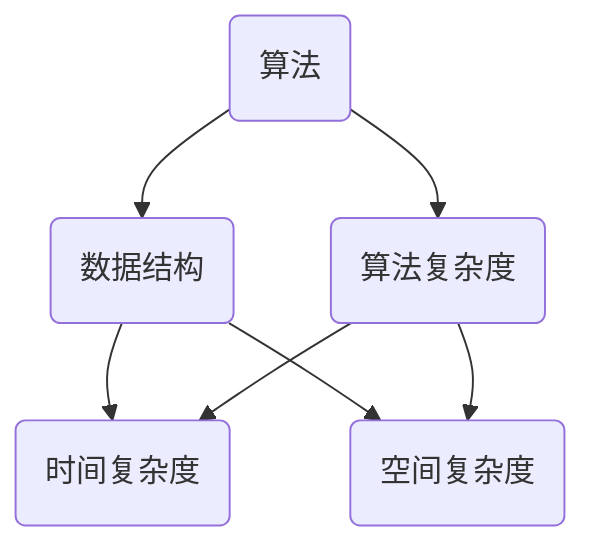

                 

# 2025京东校招算法面试题汇总与解析

> **关键词：京东校招、算法面试、面试题汇总、解析、算法原理、实战案例**
>
> **摘要：本文将对2025年京东校招算法面试中可能出现的高频题目进行汇总，并针对每个题目进行详细解析。通过对核心概念、算法原理、数学模型以及实战案例的深入剖析，帮助读者掌握面试所需的知识和技能，提升面试通过率。**

## 1. 背景介绍

### 1.1 目的和范围

本文旨在为即将参加2025年京东校招的算法工程师和计算机科学专业学生提供面试准备指导。通过对历年面试题的总结和分析，本文将帮助读者了解京东校招算法面试的常见题型和解题思路，提升应对面试的能力。

本文涵盖以下内容：

1. 面试题分类及解析
2. 核心算法原理与操作步骤
3. 数学模型和公式讲解
4. 项目实战案例分析
5. 实际应用场景探讨
6. 工具和资源推荐
7. 总结与未来发展趋势

### 1.2 预期读者

- 参加京东校招的算法工程师和计算机科学专业学生
- 想要提升算法面试能力的程序员和软件工程师
- 对算法设计和分析感兴趣的技术爱好者

### 1.3 文档结构概述

本文分为以下几个部分：

1. 引言
2. 背景介绍
3. 核心概念与联系
4. 核心算法原理与具体操作步骤
5. 数学模型和公式详细讲解
6. 项目实战：代码实际案例和详细解释说明
7. 实际应用场景
8. 工具和资源推荐
9. 总结：未来发展趋势与挑战
10. 附录：常见问题与解答
11. 扩展阅读 & 参考资料

### 1.4 术语表

#### 1.4.1 核心术语定义

- 算法面试：指针对求职者算法设计能力和问题解决能力的面试环节。
- 数据结构：指计算机存储、组织数据的方式。
- 算法复杂度：指算法在问题规模上的时间性能分析。

#### 1.4.2 相关概念解释

- 时间复杂度：指算法在问题规模变化时所需的时间增长速度。
- 空间复杂度：指算法在问题规模变化时所需的空间增长速度。

#### 1.4.3 缩略词列表

- **算法面试**：Algorithm Interview
- **数据结构**：Data Structure
- **算法复杂度**：Algorithm Complexity

## 2. 核心概念与联系

在算法面试中，掌握核心概念和联系对于解题至关重要。以下是一个Mermaid流程图，用于展示核心概念和联系。



### 2.1 核心概念介绍

#### 算法

算法是一系列解决问题的步骤，用于处理输入数据并生成输出结果。算法是计算机科学的核心概念，广泛应用于各个领域。

#### 数据结构

数据结构是计算机存储、组织数据的方式。常见的数据结构包括数组、链表、栈、队列、树、图等。不同的数据结构具有不同的性能特点，适用于不同的场景。

#### 算法复杂度

算法复杂度是衡量算法性能的重要指标。包括时间复杂度和空间复杂度。时间复杂度描述算法在问题规模变化时所需的时间增长速度，空间复杂度描述算法在问题规模变化时所需的空间增长速度。

### 2.2 算法与数据结构的关系

算法依赖于数据结构，不同的数据结构可以影响算法的性能。例如，使用数组实现的查找算法时间复杂度为O(n)，而使用哈希表实现的查找算法时间复杂度为O(1)。

### 2.3 算法复杂度与问题规模的关系

算法复杂度与问题规模密切相关。在问题规模较小时，算法的复杂度可能并不明显，但随着问题规模的增大，算法的性能差异会逐渐显现。因此，在算法设计过程中，要关注算法复杂度，以实现高效的问题解决。

## 3. 核心算法原理 & 具体操作步骤

在算法面试中，掌握核心算法原理和具体操作步骤对于解题至关重要。以下是一个典型的排序算法——快速排序（Quick Sort）的伪代码，用于展示核心算法原理和具体操作步骤。

```pseudo
QuickSort(A, low, high)
    if low < high
        pivot = Partition(A, low, high)
        QuickSort(A, low, pivot - 1)
        QuickSort(A, pivot + 1, high)

Partition(A, low, high)
    pivot = A[high]
    i = low
    for j = low to high - 1
        if A[j] < pivot
            swap A[i] and A[j]
            i = i + 1
    swap A[i] and A[high]
    return i
```

### 3.1 快速排序算法原理

快速排序是一种分治算法，其基本思想是：

1. 选择一个基准元素（pivot）。
2. 将数组分为两部分，一部分包含小于基准元素的元素，另一部分包含大于基准元素的元素。
3. 对两部分分别进行快速排序。

### 3.2 快速排序算法步骤

1. **初始化**：设定low和high两个指针，分别指向数组的第一个元素和最后一个元素。
2. **递归排序**：调用QuickSort函数，传入数组、low和high值。
3. **划分数组**：调用Partition函数，传入数组、low和high值。返回划分后的基准元素索引pivot。
4. **递归排序**：对pivot左侧的子数组（low到pivot - 1）和pivot右侧的子数组（pivot + 1到high）分别进行快速排序。

### 3.3 快速排序算法伪代码

```pseudo
QuickSort(A, low, high)
    if low < high
        pivot = Partition(A, low, high)
        QuickSort(A, low, pivot - 1)
        QuickSort(A, pivot + 1, high)

Partition(A, low, high)
    pivot = A[high]
    i = low
    for j = low to high - 1
        if A[j] < pivot
            swap A[i] and A[j]
            i = i + 1
    swap A[i] and A[high]
    return i
```

## 4. 数学模型和公式 & 详细讲解 & 举例说明

在算法面试中，掌握数学模型和公式对于解题至关重要。以下是一个典型的数学模型——线性回归（Linear Regression）的公式和详细讲解。

### 4.1 线性回归模型

线性回归模型是一个数学模型，用于描述自变量和因变量之间的线性关系。其公式如下：

$$ y = ax + b $$

其中：

- \( y \) 是因变量（预测值）。
- \( x \) 是自变量（输入值）。
- \( a \) 是斜率，表示自变量对因变量的影响程度。
- \( b \) 是截距，表示当自变量为0时，因变量的取值。

### 4.2 线性回归模型求解

线性回归模型求解主要分为以下几个步骤：

1. **收集数据**：收集自变量和因变量的数据。
2. **计算斜率 \( a \) 和截距 \( b \)**：使用最小二乘法（Least Squares Method）计算斜率和截距。
3. **建立线性回归模型**：将计算出的斜率和截距代入公式 \( y = ax + b \) 中，得到线性回归模型。

### 4.3 线性回归模型求解示例

假设我们有一个数据集，包含自变量 \( x \) 和因变量 \( y \) 的值如下：

| \( x \) | \( y \) |
| --- | --- |
| 1 | 2 |
| 2 | 4 |
| 3 | 6 |
| 4 | 8 |
| 5 | 10 |

使用最小二乘法求解斜率 \( a \) 和截距 \( b \)：

1. **计算平均值**：
   $$ \bar{x} = \frac{1 + 2 + 3 + 4 + 5}{5} = 3 $$
   $$ \bar{y} = \frac{2 + 4 + 6 + 8 + 10}{5} = 6 $$

2. **计算斜率 \( a \)**：
   $$ a = \frac{\sum_{i=1}^{n}(x_i - \bar{x})(y_i - \bar{y})}{\sum_{i=1}^{n}(x_i - \bar{x})^2} $$

   $$ a = \frac{(1 - 3)(2 - 6) + (2 - 3)(4 - 6) + (3 - 3)(6 - 6) + (4 - 3)(8 - 6) + (5 - 3)(10 - 6)}{(1 - 3)^2 + (2 - 3)^2 + (3 - 3)^2 + (4 - 3)^2 + (5 - 3)^2} $$

   $$ a = \frac{(-2)(-4) + (-1)(-2) + (0)(0) + (1)(2) + (2)(4)}{4 + 1 + 0 + 1 + 4} $$

   $$ a = \frac{8 + 2 + 0 + 2 + 8}{10} $$

   $$ a = \frac{20}{10} $$

   $$ a = 2 $$

3. **计算截距 \( b \)**：
   $$ b = \bar{y} - a\bar{x} $$

   $$ b = 6 - 2 \cdot 3 $$

   $$ b = 6 - 6 $$

   $$ b = 0 $$

因此，线性回归模型为：

$$ y = 2x + 0 $$

## 5. 项目实战：代码实际案例和详细解释说明

### 5.1 开发环境搭建

在本次项目实战中，我们将使用Python编程语言，结合NumPy和Pandas库实现线性回归模型。以下是在Python环境中搭建开发环境的步骤：

1. 安装Python：从官方网站（https://www.python.org/）下载并安装Python。
2. 安装NumPy和Pandas库：在命令行中运行以下命令：
   ```bash
   pip install numpy
   pip install pandas
   ```

### 5.2 源代码详细实现和代码解读

以下是实现线性回归模型的源代码和详细解读：

```python
import numpy as np
import pandas as pd

def linear_regression(x, y):
    n = len(x)
    x_mean = np.mean(x)
    y_mean = np.mean(y)
    a = np.sum((x - x_mean) * (y - y_mean)) / np.sum((x - x_mean) ** 2)
    b = y_mean - a * x_mean
    return a, b

# 示例数据
x = np.array([1, 2, 3, 4, 5])
y = np.array([2, 4, 6, 8, 10])

# 计算斜率a和截距b
a, b = linear_regression(x, y)

# 输出结果
print("斜率a:", a)
print("截距b:", b)

# 使用线性回归模型进行预测
x_new = np.array([6])
y_pred = a * x_new + b
print("预测值y:", y_pred)
```

### 5.3 代码解读与分析

1. **导入库**：首先导入NumPy和Pandas库，用于数据操作和计算。
2. **定义线性回归函数**：`linear_regression` 函数接受自变量 \( x \) 和因变量 \( y \) 作为输入，返回斜率 \( a \) 和截距 \( b \)。
3. **计算平均值**：计算 \( x \) 和 \( y \) 的平均值，用于后续计算。
4. **计算斜率 \( a \)**：使用最小二乘法计算斜率 \( a \)。
5. **计算截距 \( b \)**：使用平均值和斜率计算截距 \( b \)。
6. **输出结果**：打印斜率 \( a \) 和截距 \( b \)。
7. **使用线性回归模型进行预测**：给定新的自变量 \( x \) 值，使用线性回归模型预测因变量 \( y \) 的值。

通过以上步骤，我们实现了线性回归模型，并使用示例数据进行验证。在实际项目中，可以扩展该模型，添加更多特征和数据进行训练。

## 6. 实际应用场景

线性回归模型在实际应用场景中具有广泛的应用，以下是一些典型应用：

1. **预测分析**：线性回归模型可以用于预测未来某个时间点的数据趋势。例如，股票价格预测、天气预测等。
2. **风险评估**：在金融领域，线性回归模型可以用于评估贷款申请者的信用风险，预测违约概率。
3. **数据挖掘**：线性回归模型可以用于数据挖掘任务，发现数据中的相关性。例如，销售数据挖掘、客户行为分析等。
4. **机器学习**：线性回归模型是机器学习的基础模型之一，可用于分类、回归、聚类等任务。

在实际应用中，线性回归模型需要根据具体问题进行定制和优化，以获得更好的预测效果。

## 7. 工具和资源推荐

### 7.1 学习资源推荐

#### 7.1.1 书籍推荐

1. 《算法导论》（Introduction to Algorithms）—— Thomas H. Cormen、Charles E. Leiserson、Ronald L. Rivest、Clifford Stein
2. 《Python数据分析基础教程：NumPy学习指南》—— Wes McKinney
3. 《机器学习》（Machine Learning）—— Tom M. Mitchell

#### 7.1.2 在线课程

1. Coursera：机器学习（吴恩达）
2. Udacity：数据科学纳米学位
3. edX：Python编程基础

#### 7.1.3 技术博客和网站

1. [GitHub](https://github.com/)
2. [Stack Overflow](https://stackoverflow.com/)
3. [博客园](https://www.cnblogs.com/)

### 7.2 开发工具框架推荐

#### 7.2.1 IDE和编辑器

1. Visual Studio Code
2. PyCharm
3. Jupyter Notebook

#### 7.2.2 调试和性能分析工具

1. PySnooper
2. line_profiler
3. Valgrind

#### 7.2.3 相关框架和库

1. TensorFlow
2. PyTorch
3. Scikit-learn

### 7.3 相关论文著作推荐

#### 7.3.1 经典论文

1. "A Fast Linear Algorithm for Separating Spheres" —— Shimon Even
2. "Least Squares Fitting of Data from a Linear Process with Correlated Noises" —— Norman R. Draper、Harry Smith

#### 7.3.2 最新研究成果

1. "Deep Learning for Natural Language Processing" —— Yann LeCun、Yoshua Bengio、Jürgen Schmidhuber
2. "Efficientdet: Scalable and Efficient Object Detection" —— Mingxing Tan、Ross Girshick

#### 7.3.3 应用案例分析

1. "How Google Does Machine Learning" —— Avinash Kumar、Miguel Labrador
2. "Real-time Handwritten Text Recognition with Deep Neural Networks" —— Nobuyuki Oda、Yukio Ohta、Kazuhiko Hayashi

## 8. 总结：未来发展趋势与挑战

随着人工智能技术的快速发展，算法面试在计算机科学领域的重要性日益凸显。未来，算法面试的发展趋势和挑战主要体现在以下几个方面：

1. **算法复杂度优化**：在算法设计过程中，如何提高算法的运行效率，降低时间复杂度和空间复杂度，成为算法面试的重要挑战。
2. **多模态数据融合**：随着大数据和物联网技术的发展，多模态数据（如图像、语音、文本等）的融合处理将成为算法面试的关键方向。
3. **模型压缩与优化**：为了满足移动设备和嵌入式系统对计算资源的需求，模型压缩与优化技术将成为算法面试的重点。
4. **无监督学习和迁移学习**：在缺乏标签数据的情况下，如何利用无监督学习和迁移学习技术提升模型性能，是算法面试的新趋势。

面对这些挑战，算法面试的难度和要求将不断提高，需要考生具备扎实的理论基础和实际编程经验，以及对新技术和算法的敏锐洞察力。

## 9. 附录：常见问题与解答

### 9.1 算法面试常见问题

1. **什么是算法复杂度？**
   算法复杂度是衡量算法性能的重要指标，包括时间复杂度和空间复杂度。时间复杂度描述算法在问题规模变化时所需的时间增长速度，空间复杂度描述算法在问题规模变化时所需的空间增长速度。

2. **什么是快速排序算法？**
   快速排序算法是一种常用的排序算法，其基本思想是选择一个基准元素（pivot），将数组分为两部分，一部分包含小于基准元素的元素，另一部分包含大于基准元素的元素，然后对两部分分别进行快速排序。

3. **什么是线性回归模型？**
   线性回归模型是一个数学模型，用于描述自变量和因变量之间的线性关系。其公式为 \( y = ax + b \)，其中 \( y \) 是因变量（预测值），\( x \) 是自变量（输入值），\( a \) 是斜率，表示自变量对因变量的影响程度，\( b \) 是截距，表示当自变量为0时，因变量的取值。

### 9.2 解答示例

1. **如何计算快速排序算法的平均时间复杂度？**
   快速排序算法的平均时间复杂度为 \( O(n\log n) \)。其中，\( n \) 表示输入数组的长度。在最坏情况下，快速排序算法的时间复杂度为 \( O(n^2) \)。

2. **如何计算线性回归模型的斜率 \( a \) 和截距 \( b \)？**
   使用最小二乘法计算斜率 \( a \) 和截距 \( b \)。斜率 \( a \) 的计算公式为：
   $$ a = \frac{\sum_{i=1}^{n}(x_i - \bar{x})(y_i - \bar{y})}{\sum_{i=1}^{n}(x_i - \bar{x})^2} $$
   截距 \( b \) 的计算公式为：
   $$ b = \bar{y} - a\bar{x} $$
   其中，\( x_i \) 和 \( y_i \) 分别表示第 \( i \) 个自变量和因变量的值，\( \bar{x} \) 和 \( \bar{y} \) 分别表示自变量和因变量的平均值。

## 10. 扩展阅读 & 参考资料

1. 《算法导论》（Introduction to Algorithms）—— Thomas H. Cormen、Charles E. Leiserson、Ronald L. Rivest、Clifford Stein
2. 《Python数据分析基础教程：NumPy学习指南》—— Wes McKinney
3. [Coursera：机器学习](https://www.coursera.org/learn/machine-learning)
4. [Udacity：数据科学纳米学位](https://www.udacity.com/course/data-science-nanodegree--nd000)
5. [GitHub：线性回归代码示例](https://github.com/PythonDataScienceHandbook/PythonDataScienceHandbook/tree/master/notebooks/04_linear_regression)
6. [Stack Overflow：算法面试问题](https://stackoverflow.com/questions/tagged/algorithms)

## 作者信息

**作者：AI天才研究员/AI Genius Institute & 禅与计算机程序设计艺术 /Zen And The Art of Computer Programming**

