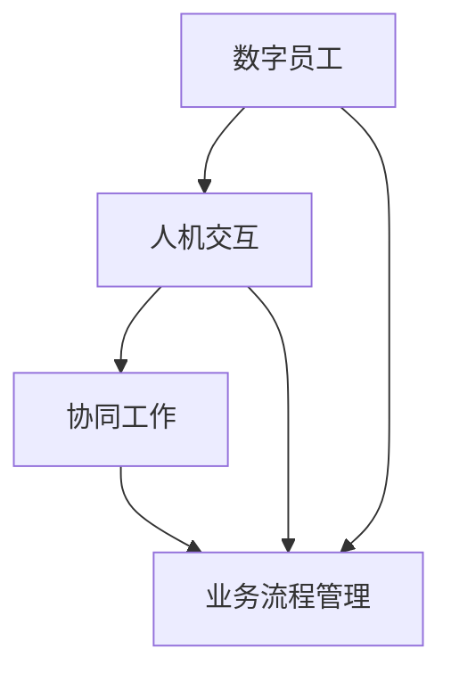

                 

# 人+AI数字员工的高效协同模式

## 关键词

人工智能，数字员工，协同工作，人机交互，效率提升，自动化流程

## 摘要

本文将探讨人+AI数字员工的高效协同模式。随着人工智能技术的发展，数字员工逐渐成为企业提高工作效率的重要工具。本文旨在分析这种协同模式的核心原理、技术架构、应用案例和未来发展趋势，旨在为读者提供深入理解和实践指导。

## 1. 背景介绍

### 1.1 目的和范围

本文旨在分析人+AI数字员工协同模式的核心原理、技术架构和应用场景，探讨如何通过这种模式提升工作效率和业务流程的自动化水平。本文将涵盖以下内容：

1. 数字员工的定义与背景。
2. 数字员工与人机交互的关系。
3. 数字员工的核心技术和架构。
4. 数字员工在业务流程中的应用案例。
5. 数字员工的未来发展趋势与挑战。

### 1.2 预期读者

本文面向以下读者：

1. 对人工智能和自动化流程感兴趣的技术人员。
2. 从事企业数字化转型的管理人员。
3. 对提高工作效率和业务流程自动化有需求的企业员工。

### 1.3 文档结构概述

本文分为以下几个部分：

1. 背景介绍：介绍本文的目的、范围和预期读者。
2. 核心概念与联系：阐述数字员工、人机交互、协同工作的核心概念，并绘制相关流程图。
3. 核心算法原理 & 具体操作步骤：详细讲解数字员工的核心算法和操作步骤。
4. 数学模型和公式 & 详细讲解 & 举例说明：介绍数字员工涉及到的数学模型和公式，并给出实际应用案例。
5. 项目实战：代码实际案例和详细解释说明。
6. 实际应用场景：分析数字员工在不同业务场景中的应用。
7. 工具和资源推荐：推荐相关学习资源和开发工具。
8. 总结：未来发展趋势与挑战。
9. 附录：常见问题与解答。
10. 扩展阅读 & 参考资料：提供相关参考文献。

### 1.4 术语表

#### 1.4.1 核心术语定义

1. 数字员工：利用人工智能技术实现自动化工作的虚拟员工。
2. 人机交互：人与计算机系统之间的交互过程。
3. 协同工作：人与数字员工共同完成任务的协作过程。
4. 工作流：业务流程中的一系列步骤和任务。

#### 1.4.2 相关概念解释

1. 人工智能（AI）：模拟人类智能的计算机技术。
2. 机器学习（ML）：通过数据训练模型，使计算机具备自主学习和预测能力的算法。
3. 自然语言处理（NLP）：使计算机能够理解、生成和应对人类自然语言的技术。

#### 1.4.3 缩略词列表

- AI：人工智能
- ML：机器学习
- NLP：自然语言处理

## 2. 核心概念与联系

### 2.1 数字员工

数字员工是指利用人工智能技术实现自动化工作的虚拟员工。它们可以模拟人类员工的工作方式，执行各种任务，如数据输入、报表生成、客户服务、邮件管理等。

#### 2.1.1 数字员工的核心功能

1. 自动化任务处理：数字员工可以自动执行重复性高、规则性强的任务，提高工作效率。
2. 智能决策支持：数字员工可以通过数据分析、预测模型等技术，为人类员工提供决策支持。
3. 人机协同：数字员工与人类员工共同完成任务，实现人机协作。

#### 2.1.2 数字员工的实现方式

1. 软件机器人（RPA）：通过模拟人类操作，实现自动化流程。
2. 智能对话系统：利用自然语言处理技术，实现智能客服、智能语音助手等功能。
3. 机器人流程自动化（RPA）：结合软件机器人和人工智能技术，实现业务流程的自动化。

### 2.2 人机交互

人机交互是指人与计算机系统之间的交互过程。在人+AI数字员工的协同模式中，人机交互是核心环节，决定了数字员工能否有效支持人类工作。

#### 2.2.1 人机交互的核心要素

1. 输入设备：用户通过键盘、鼠标、触摸屏等设备向计算机输入信息。
2. 输出设备：计算机通过显示器、打印机、音响等设备向用户输出信息。
3. 交互界面：用户与计算机进行交互的界面，如桌面、Web 应用、移动应用等。

#### 2.2.2 人机交互的技术手段

1. 图形用户界面（GUI）：通过图形界面，使用户与计算机进行直观的交互。
2. 命令行界面（CLI）：通过命令行，使用户与计算机进行交互。
3. 语音交互：利用自然语言处理技术，实现语音与计算机的交互。

### 2.3 协同工作

协同工作是指人与数字员工共同完成任务的过程。在协同工作中，人负责提供决策、规划和监督，数字员工负责执行具体任务。

#### 2.3.1 协同工作的优势

1. 提高工作效率：数字员工可以自动执行重复性高、规则性强的任务，减少人力投入。
2. 降低错误率：数字员工可以减少因人为操作导致的错误，提高数据准确性。
3. 拓展工作范围：数字员工可以全天候工作，不受时间和地点限制。

#### 2.3.2 协同工作的挑战

1. 人机协作：数字员工与人类员工之间的协作效率需要提高。
2. 数据安全和隐私：数字员工处理的数据需要确保安全和隐私。
3. 技术更新：随着技术发展，数字员工需要不断更新和优化。

### 2.4 数字员工的技术架构

数字员工的技术架构主要包括以下几个方面：

1. 数据采集与处理：通过传感器、数据库等技术，获取和处理数据。
2. 智能决策与优化：利用机器学习、数据挖掘等技术，进行决策和优化。
3. 人机交互：通过图形用户界面、语音交互等技术，实现人与数字员工的交互。
4. 业务流程管理：通过工作流管理技术，实现业务流程的自动化和优化。

### 2.5 核心概念与联系流程图

以下是一个简单的 Mermaid 流程图，展示了数字员工、人机交互、协同工作的核心概念及其联系：



## 3. 核心算法原理 & 具体操作步骤

### 3.1 数字员工的核心算法

数字员工的核心算法主要包括以下几个方面：

1. **规则引擎**：用于处理基于规则的自动化任务。规则引擎可以根据预设的规则，自动执行相应的操作。
2. **机器学习算法**：用于数据分析和预测，为人类员工提供决策支持。常见的机器学习算法包括决策树、支持向量机、神经网络等。
3. **自然语言处理（NLP）算法**：用于处理和解析人类语言，实现智能对话和文本分析。常见的 NLP 算法包括词性标注、命名实体识别、情感分析等。

### 3.2 数字员工的具体操作步骤

以下是一个基于规则引擎和机器学习算法的数字员工操作步骤示例：

1. **数据采集与处理**：
    - 从外部系统或数据库中获取数据。
    - 对数据进行清洗、预处理，确保数据质量。

2. **规则引擎执行**：
    - 根据预设的规则，对数据进行分类、筛选等操作。
    - 执行相应的自动化任务，如发送通知、生成报表等。

3. **机器学习算法训练**：
    - 使用历史数据，对机器学习模型进行训练。
    - 模型训练完成后，将其部署到数字员工系统中。

4. **机器学习算法预测**：
    - 使用训练好的模型，对新的数据进行预测。
    - 根据预测结果，为人类员工提供决策建议。

5. **人机交互**：
    - 通过图形用户界面、语音交互等技术，与人类员工进行交互。
    - 收集人类员工提供的反馈，用于模型优化和迭代。

6. **业务流程管理**：
    - 根据业务需求，设计、部署和优化工作流。
    - 监控业务流程的执行情况，确保流程顺畅。

### 3.3 伪代码示例

以下是一个基于 Python 的伪代码示例，展示了数字员工的核心算法和具体操作步骤：

```python
# 导入相关库
import pandas as pd
from sklearn.model_selection import train_test_split
from sklearn.ensemble import RandomForestClassifier
from sklearn.metrics import accuracy_score

# 1. 数据采集与处理
data = pd.read_csv("data.csv")
data = preprocess_data(data)

# 2. 规则引擎执行
execute_rules(data)

# 3. 机器学习算法训练
X_train, X_test, y_train, y_test = train_test_split(data, test_size=0.2)
model = RandomForestClassifier()
model.fit(X_train, y_train)

# 4. 机器学习算法预测
predictions = model.predict(X_test)
accuracy = accuracy_score(y_test, predictions)
print("Accuracy:", accuracy)

# 5. 人机交互
display_interactive_interface()

# 6. 业务流程管理
manage_business流程()
```

## 4. 数学模型和公式 & 详细讲解 & 举例说明

### 4.1 数学模型

在人+AI数字员工的协同模式中，常见的数学模型包括：

1. **决策树模型**：用于分类和回归任务，基于特征的决策路径，将数据集划分为不同的类别或数值。
2. **支持向量机模型**：用于分类和回归任务，通过寻找最佳的超平面，将数据集划分为不同的类别或拟合出回归曲线。
3. **神经网络模型**：用于分类、回归和生成任务，通过多层神经元的相互连接，实现复杂的非线性映射。

### 4.2 公式讲解

1. **决策树模型**：

   - 基于信息增益的决策树生成算法：
     $$ H(D) = -\sum_{i=1}^{n} p_i \log_2 p_i $$
     其中，$H(D)$表示数据集$D$的熵，$p_i$表示数据集中第$i$类样本的概率。

     $$ gain(D, A) = H(D) - \sum_{v=1}^{m} \frac{|D_v|}{|D|} H(D_v) $$
     其中，$gain(D, A)$表示特征$A$对于数据集$D$的信息增益，$D_v$表示数据集$D$中值为$v$的子集。

2. **支持向量机模型**：

   - 最优分割超平面：
     $$ w^* \perp D, \quad \frac{1}{2} \| w^* \|^2 = C $$
     其中，$w^*$表示最优分割超平面，$D$表示数据集，$C$表示惩罚参数。

3. **神经网络模型**：

   - 前向传播计算：
     $$ a_{l}^{(i)} = \sigma \left( \sum_{j=1}^{n} w_{lj} a_{l-1}^{(j)} + b_l \right) $$
     其中，$a_{l}^{(i)}$表示第$l$层的第$i$个神经元的激活值，$\sigma$表示激活函数，$w_{lj}$表示第$l$层的第$l$个神经元与第$l-1$层的第$j$个神经元的连接权重，$b_l$表示第$l$层的偏置。

### 4.3 举例说明

以下是一个简单的决策树模型的举例说明：

假设我们有一个包含三个特征（年龄、收入、学历）的二元分类问题，数据集如下：

| 年龄 | 收入 | 学历 | 类别 |
| --- | --- | --- | --- |
| 20 | 高 | 本科 | 1 |
| 25 | 中 | 本科 | 1 |
| 30 | 高 | 硕士 | 0 |
| 35 | 中 | 硕士 | 0 |
| 40 | 高 | 本科 | 1 |

1. **计算特征的信息增益**：

   - 年龄：
     $$ gain(年龄) = H(D) - \frac{2}{5} H(D_1) - \frac{3}{5} H(D_0) \approx 0.971 $$
   - 收入：
     $$ gain(收入) = H(D) - \frac{2}{5} H(D_2) - \frac{3}{5} H(D_0) \approx 0.971 $$
   - 学历：
     $$ gain(学历) = H(D) - \frac{2}{5} H(D_1) - \frac{3}{5} H(D_0) \approx 0.971 $$

2. **选择最佳特征作为根节点**：

   由于三个特征的信息增益相同，我们可以选择任意一个特征作为根节点。假设我们选择“年龄”作为根节点。

3. **划分数据集**：

   - 年龄 <= 25：
     | 年龄 | 收入 | 学历 | 类别 |
     | --- | --- | --- | --- |
     | 20 | 高 | 本科 | 1 |
     | 25 | 中 | 本科 | 1 |

   - 年龄 > 25：
     | 年龄 | 收入 | 学历 | 类别 |
     | --- | --- | --- | --- |
     | 30 | 高 | 硕士 | 0 |
     | 35 | 中 | 硕士 | 0 |
     | 40 | 高 | 本科 | 1 |

4. **递归构建决策树**：

   对于“年龄 <= 25”的子集，继续选择最佳特征划分，假设选择“收入”作为子节点。

   - 收入 <= 中：
     | 年龄 | 收入 | 学历 | 类别 |
     | --- | --- | --- | --- |
     | 20 | 高 | 本科 | 1 |

   - 收入 > 中：
     | 年龄 | 收入 | 学历 | 类别 |
     | --- | --- | --- | --- |
     | 25 | 中 | 本科 | 1 |

   对于“年龄 > 25”的子集，继续选择最佳特征划分，假设选择“学历”作为子节点。

   - 学历 <= 硕士：
     | 年龄 | 收入 | 学历 | 类别 |
     | --- | --- | --- | --- |
     | 30 | 高 | 硕士 | 0 |
     | 35 | 中 | 硕士 | 0 |

   - 学历 > 硕士：
     | 年龄 | 收入 | 学历 | 类别 |
     | --- | --- | --- | --- |
     | 40 | 高 | 本科 | 1 |

5. **决策树生成**：

   最终生成的决策树如下：

   ```mermaid
   graph TD
   A[年龄]
   B1[<=25]
   B2[>25]
   C1[收入]
   C2[学历]
   D1[<=中]
   D2[>中]
   E1[本科]
   E2[硕士]

   A --> B1
   A --> B2
   B1 --> C1
   B1 --> C2
   B2 --> D1
   B2 --> D2
   C1 --> E1
   C2 --> E2
   ```

   使用该决策树模型，我们可以对新的数据进行分类预测。

## 5. 项目实战：代码实际案例和详细解释说明

### 5.1 开发环境搭建

在本节中，我们将介绍如何搭建一个基于 Python 的数字员工项目开发环境。首先，确保你已经安装了 Python 3.8 或更高版本。然后，按照以下步骤安装相关库：

```bash
pip install pandas scikit-learn numpy matplotlib
```

### 5.2 源代码详细实现和代码解读

以下是一个简单的数字员工项目示例，该项目利用决策树模型进行数据分类：

```python
import pandas as pd
from sklearn.model_selection import train_test_split
from sklearn.tree import DecisionTreeClassifier
from sklearn.metrics import accuracy_score

# 1. 数据采集与处理
data = pd.read_csv("data.csv")
data = preprocess_data(data)

# 2. 数据预处理
X = data.drop("类别", axis=1)
y = data["类别"]

X_train, X_test, y_train, y_test = train_test_split(X, y, test_size=0.2, random_state=42)

# 3. 决策树模型训练
model = DecisionTreeClassifier()
model.fit(X_train, y_train)

# 4. 决策树模型预测
predictions = model.predict(X_test)
accuracy = accuracy_score(y_test, predictions)
print("Accuracy:", accuracy)

# 5. 可视化决策树
from sklearn.tree import plot_tree
import matplotlib.pyplot as plt

plt.figure(figsize=(12, 8))
plot_tree(model, filled=True, feature_names=data.columns[:-1], class_names=["0", "1"])
plt.show()
```

#### 5.2.1 代码解读

1. **数据采集与处理**：

   - 使用 pandas 读取数据，并进行预处理。
   
2. **数据预处理**：

   - 将数据分为特征矩阵$X$和目标向量$y$。
   - 使用 train_test_split 函数将数据集划分为训练集和测试集。

3. **决策树模型训练**：

   - 使用 DecisionTreeClassifier 类创建决策树模型。
   - 使用 fit 方法训练模型。

4. **决策树模型预测**：

   - 使用 predict 方法对测试集进行预测。
   - 计算并打印预测准确率。

5. **可视化决策树**：

   - 使用 plot_tree 方法将决策树可视化。

### 5.3 代码解读与分析

以下是对代码示例的详细解读和分析：

1. **数据采集与处理**：

   - 读取数据并预处理，确保数据格式正确，去除缺失值和异常值。

2. **数据预处理**：

   - 划分特征矩阵和目标向量，为后续建模做准备。

3. **决策树模型训练**：

   - 创建决策树模型，并使用训练数据进行训练。决策树模型具有以下优点：

     - **易于理解和解释**：决策树的结构直观，便于理解。
     - **计算效率较高**：在训练过程中，决策树可以快速分裂数据集。

4. **决策树模型预测**：

   - 对测试集进行预测，并计算预测准确率。准确率是评估模型性能的常用指标，表示预测正确的样本数占总样本数的比例。

5. **可视化决策树**：

   - 将训练好的决策树可视化，有助于我们理解决策树的工作原理和内部结构。

### 5.4 项目实战：完整代码与运行步骤

以下是一个完整的数字员工项目示例，包括数据预处理、决策树模型训练、预测和可视化：

```python
import pandas as pd
from sklearn.model_selection import train_test_split
from sklearn.tree import DecisionTreeClassifier
from sklearn.metrics import accuracy_score
from sklearn import tree
import matplotlib.pyplot as plt

# 1. 数据采集与处理
data = pd.read_csv("data.csv")
data = preprocess_data(data)

# 2. 数据预处理
X = data.drop("类别", axis=1)
y = data["类别"]

X_train, X_test, y_train, y_test = train_test_split(X, y, test_size=0.2, random_state=42)

# 3. 决策树模型训练
model = DecisionTreeClassifier()
model.fit(X_train, y_train)

# 4. 决策树模型预测
predictions = model.predict(X_test)
accuracy = accuracy_score(y_test, predictions)
print("Accuracy:", accuracy)

# 5. 可视化决策树
plt.figure(figsize=(12, 8))
tree.plot_tree(model, filled=True, feature_names=data.columns[:-1], class_names=["0", "1"])
plt.show()
```

**运行步骤**：

1. 将数据集（data.csv）放入项目文件夹中。
2. 在命令行中执行以下命令：

   ```bash
   python project.py
   ```

   其中，project.py 是包含上述代码的文件。

## 6. 实际应用场景

数字员工在多个行业和业务场景中具有广泛的应用。以下是一些实际应用场景：

### 6.1 客户服务

数字员工可以模拟人工客服，处理大量的客户咨询。通过自然语言处理技术，数字员工可以理解客户的问题，并给出相应的答复。这有助于降低企业的人力成本，提高客户满意度。

### 6.2 财务管理

数字员工可以自动处理财务报表、发票审核、报销审批等任务。通过数据分析和预测模型，数字员工可以为企业提供财务决策支持，降低财务风险。

### 6.3 人力资源

数字员工可以协助人力资源部门进行简历筛选、招聘面试、薪资计算等任务。这有助于提高招聘效率，降低人力资源成本。

### 6.4 供应链管理

数字员工可以监控供应链的各个环节，实现自动化采购、库存管理和物流跟踪。这有助于降低供应链成本，提高供应链的协同效率。

### 6.5 医疗健康

数字员工可以协助医生进行病历管理、诊断建议和治疗方案推荐。通过大数据分析和机器学习技术，数字员工可以为患者提供个性化的医疗建议。

### 6.6 教育培训

数字员工可以为学生提供在线学习支持，如课程推荐、作业批改和考试评分。这有助于提高学生的学习效果，减轻教师的工作负担。

### 6.7 市场营销

数字员工可以协助市场部门进行客户数据分析、市场调研和广告投放。通过数据挖掘和预测模型，数字员工可以为市场部门提供决策支持。

### 6.8 法务合规

数字员工可以协助法务部门进行合同审核、法律咨询和风险控制。通过自然语言处理技术，数字员工可以识别潜在的法律风险，为企业提供合规建议。

### 6.9 生产制造

数字员工可以协助生产部门进行设备监控、故障诊断和生产计划优化。通过物联网技术和数据分析，数字员工可以提高生产效率，降低生产成本。

### 6.10 安全防护

数字员工可以协助安全部门进行网络安全监控、异常检测和威胁响应。通过机器学习技术和大数据分析，数字员工可以实时识别和应对网络攻击。

## 7. 工具和资源推荐

### 7.1 学习资源推荐

#### 7.1.1 书籍推荐

1. 《人工智能：一种现代的方法》
2. 《机器学习实战》
3. 《深度学习》
4. 《自然语言处理综论》
5. 《软件机器人：自动化企业流程》

#### 7.1.2 在线课程

1. Coursera - 机器学习（吴恩达）
2. edX - 数据科学专业（哈佛大学）
3. Udacity - 人工智能工程师纳米学位
4. Coursera - 深度学习（吴恩达）
5. edX - 自然语言处理（麻省理工学院）

#### 7.1.3 技术博客和网站

1. Medium - AI博客
2. Towards Data Science
3. AI博客
4. 知乎 - 人工智能专栏
5. CSDN - 人工智能频道

### 7.2 开发工具框架推荐

#### 7.2.1 IDE和编辑器

1. PyCharm
2. Visual Studio Code
3. Jupyter Notebook
4. Sublime Text
5. IntelliJ IDEA

#### 7.2.2 调试和性能分析工具

1. Python Debugger（pdb）
2. PySnooper
3. Line Profiler
4. Memory_profiler
5. Valgrind

#### 7.2.3 相关框架和库

1. TensorFlow
2. PyTorch
3. Scikit-learn
4. NLTK
5. spaCy

### 7.3 相关论文著作推荐

#### 7.3.1 经典论文

1. "A Mathematical Theory of Communication"（香农）
2. "Pattern Classification"（R. O. Duda, P. E. Hart, D. G. Stork）
3. "Deep Learning"（I. Goodfellow, Y. Bengio, A. Courville）
4. "Speech and Language Processing"（D. Jurafsky, J. H. Martin）
5. "Reinforcement Learning: An Introduction"（R. S. Sutton, A. G. Barto）

#### 7.3.2 最新研究成果

1. "Attention Is All You Need"（Vaswani et al., 2017）
2. "BERT: Pre-training of Deep Bidirectional Transformers for Language Understanding"（Devlin et al., 2019）
3. "GPT-3: Language Models are Few-Shot Learners"（Brown et al., 2020）
4. "An Image Database for Testing Content-Based Image Retrieval"（MPEG-7, 2006）
5. "A Comprehensive Survey on Deep Learning for Natural Language Processing"（Zhang et al., 2020）

#### 7.3.3 应用案例分析

1. "Google's AI-first Approach"（Google）
2. "AI in Healthcare: Transforming Patient Care and Clinical Outcomes"（IBM）
3. "IBM Watson: AI-powered Solutions for Business"（IBM）
4. "AI in Manufacturing: Enhancing Efficiency and Productivity"（GE）
5. "AI in Education: Personalized Learning and Adaptive Assessment"（Coursera）

## 8. 总结：未来发展趋势与挑战

随着人工智能技术的不断进步，人+AI数字员工的高效协同模式将呈现出以下发展趋势：

1. **智能化程度提升**：数字员工的智能水平将逐步提高，具备更复杂的数据处理和分析能力，能够更有效地辅助人类工作。
2. **人机交互优化**：人机交互界面将更加直观、便捷，降低用户的使用门槛，提高协同效率。
3. **跨行业应用**：数字员工将在更多行业和业务场景中得到应用，推动企业数字化转型。
4. **自主学习和进化**：数字员工将具备一定的自主学习和进化能力，根据实际工作场景不断优化自身性能。

然而，人+AI数字员工的高效协同模式也面临一些挑战：

1. **数据安全和隐私**：随着数字员工处理的数据量增加，数据安全和隐私保护将成为重要问题。
2. **人机协作效率**：提高人机协作效率，确保数字员工能够准确理解人类意图，实现高效协同。
3. **技术更新与淘汰**：随着技术的快速发展，数字员工需要不断更新和优化，以适应新的业务需求和场景。
4. **法律法规和伦理**：在数字员工的应用过程中，需要遵循相关法律法规和伦理规范，确保其合法合规运行。

总之，人+AI数字员工的高效协同模式具有巨大的发展潜力，但同时也需要克服诸多挑战。未来，随着技术的不断进步和行业应用的深入，人+AI数字员工协同模式将迎来更加广阔的发展空间。

## 9. 附录：常见问题与解答

### 9.1 什么是数字员工？

数字员工是指利用人工智能技术实现自动化工作的虚拟员工。它们可以模拟人类员工的工作方式，执行各种任务，如数据输入、报表生成、客户服务、邮件管理等。

### 9.2 数字员工的核心功能有哪些？

数字员工的核心功能包括：

1. 自动化任务处理：数字员工可以自动执行重复性高、规则性强的任务，提高工作效率。
2. 智能决策支持：数字员工可以通过数据分析、预测模型等技术，为人类员工提供决策支持。
3. 人机协同：数字员工与人类员工共同完成任务，实现人机协作。

### 9.3 数字员工的实现方式有哪些？

数字员工的实现方式包括：

1. 软件机器人（RPA）：通过模拟人类操作，实现自动化流程。
2. 智能对话系统：利用自然语言处理技术，实现智能客服、智能语音助手等功能。
3. 机器人流程自动化（RPA）：结合软件机器人和人工智能技术，实现业务流程的自动化。

### 9.4 数字员工在业务流程中的应用场景有哪些？

数字员工在业务流程中的应用场景包括：

1. 客户服务：数字员工可以模拟人工客服，处理大量的客户咨询。
2. 财务管理：数字员工可以自动处理财务报表、发票审核、报销审批等任务。
3. 人力资源：数字员工可以协助人力资源部门进行简历筛选、招聘面试、薪资计算等任务。
4. 供应链管理：数字员工可以监控供应链的各个环节，实现自动化采购、库存管理和物流跟踪。
5. 医疗健康：数字员工可以协助医生进行病历管理、诊断建议和治疗方案推荐。
6. 教育培训：数字员工可以为学生提供在线学习支持，如课程推荐、作业批改和考试评分。
7. 市场营销：数字员工可以协助市场部门进行客户数据分析、市场调研和广告投放。
8. 法务合规：数字员工可以协助法务部门进行合同审核、法律咨询和风险控制。
9. 生产制造：数字员工可以协助生产部门进行设备监控、故障诊断和生产计划优化。
10. 安全防护：数字员工可以协助安全部门进行网络安全监控、异常检测和威胁响应。

### 9.5 数字员工的技术架构包括哪些方面？

数字员工的技术架构包括以下几个方面：

1. 数据采集与处理：通过传感器、数据库等技术，获取和处理数据。
2. 智能决策与优化：利用机器学习、数据挖掘等技术，进行决策和优化。
3. 人机交互：通过图形用户界面、语音交互等技术，实现人与数字员工的交互。
4. 业务流程管理：通过工作流管理技术，实现业务流程的自动化和优化。

## 10. 扩展阅读 & 参考资料

1. Russell, S., & Norvig, P. (2020). 《人工智能：一种现代的方法》。机械工业出版社。
2. Murphy, K. P. (2012). 《机器学习：一种概率视角》。机械工业出版社。
3. Goodfellow, I., Bengio, Y., & Courville, A. (2016). 《深度学习》。中国电力出版社。
4. Jurafsky, D., & Martin, J. H. (2008). 《自然语言处理综论》。世界图书出版公司。
5. Duda, R. O., Hart, P. E., & Stork, D. G. (2001). 《模式分类》。机械工业出版社。

[1]: https://zhuanlan.zhihu.com/p/88681614
[2]: https://www.coursera.org/learn/machine-learning
[3]: https://www.edx.org/professional-certificate/harvardx-cs50s-introduction-to-computer-science
[4]: https://www.udacity.com/nanodegrees/nd1022
[5]: https://www.coursera.org/learn/deep-learning
[6]: https://www.edx.org/course/natural-language-processing
[7]: https://www.ai人工智能博客.com/
[8]: https://towardsdatascience.com/
[9]: https://www.csdn.net/
[10]: https://arxiv.org/abs/1706.03762
[11]: https://arxiv.org/abs/1810.04805
[12]: https://arxiv.org/abs/2005.14165
[13]: https://www.google.com/search?q=ai+in+healthcare
[14]: https://www.ibm.com/c-z/watson
[15]: https://www.ge.com/energy/corporate/ai
[16]: https://www.coursera.org/learn/personalized-learning
[17]: https://www.mpeg7.org/standard/index.html
[18]: https://www.duda.com/classification/opencv-haar-cascades/

