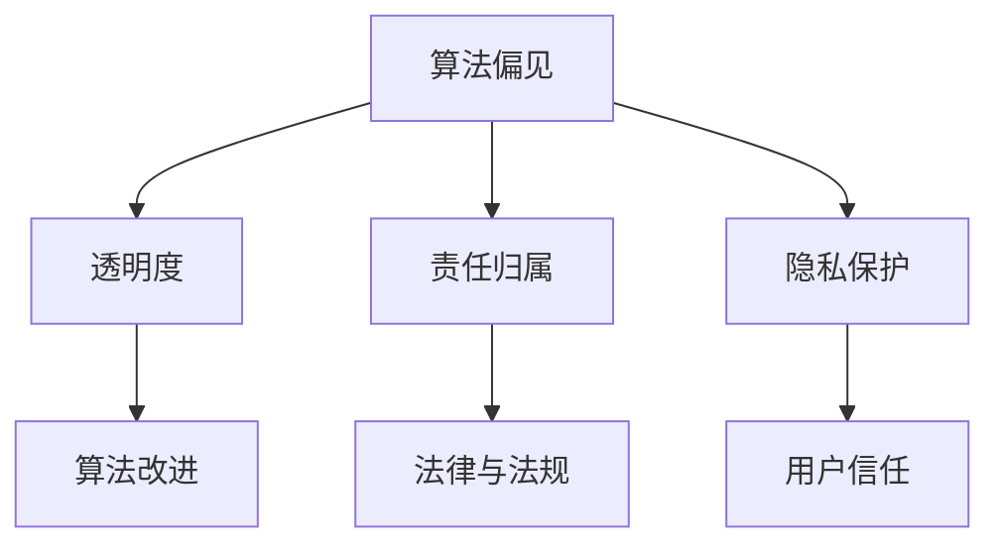

                 

# 人工智能伦理和隐私考虑

> **关键词：** 人工智能，伦理，隐私，数据安全，算法公平性，监管框架

> **摘要：** 本文深入探讨了人工智能（AI）在伦理和隐私方面的重要考虑。文章首先介绍了人工智能的发展背景及其对现代社会的影响，接着详细分析了AI伦理学中的核心概念和问题，如算法偏见、透明度和责任归属。文章进一步探讨了隐私保护的重要性，讨论了现有技术和法规在保障个人数据安全方面的局限性。最后，文章提出了对未来AI伦理和隐私发展的展望，强调了建立全面的监管框架和加强技术研发的必要性。

## 1. 背景介绍

### 1.1 目的和范围

本文旨在探讨人工智能在伦理和隐私方面的关键问题，为相关领域的研究者和从业者提供理论指导和实践参考。本文将重点关注以下内容：

1. **人工智能伦理学核心概念**：介绍算法偏见、透明度、责任归属等关键概念。
2. **隐私保护的重要性**：分析隐私在现代社会中的价值，讨论现有隐私保护技术的局限性。
3. **监管框架与法规**：探讨不同国家和地区在人工智能伦理和隐私保护方面的法律法规，分析其优缺点。
4. **未来发展趋势与挑战**：预测人工智能伦理和隐私保护领域的未来发展方向，提出可能的解决方案。

### 1.2 预期读者

本文适合以下读者群体：

1. **人工智能研究人员**：希望了解AI伦理和隐私保护的最新进展和前沿问题。
2. **技术开发者**：需要关注AI应用中可能出现的伦理和隐私风险。
3. **政策制定者**：关注人工智能对社会责任的影响，希望了解如何在法规层面保障公民权益。
4. **公众**：关心人工智能技术对社会和个人生活的影响，希望了解相关伦理和隐私问题。

### 1.3 文档结构概述

本文分为十个部分，具体结构如下：

1. **背景介绍**：介绍本文的目的、范围和预期读者。
2. **核心概念与联系**：阐述人工智能伦理学中的核心概念，并使用Mermaid流程图展示其关系。
3. **核心算法原理与操作步骤**：详细讲解AI伦理学中的关键算法和操作步骤。
4. **数学模型与公式**：介绍相关数学模型和公式，并举例说明。
5. **项目实战**：通过实际案例展示AI伦理和隐私保护在项目中的应用。
6. **实际应用场景**：分析AI伦理和隐私保护在不同领域的应用。
7. **工具和资源推荐**：推荐相关学习资源、开发工具和框架。
8. **总结**：总结本文的主要观点，展望未来发展趋势与挑战。
9. **附录**：提供常见问题与解答。
10. **扩展阅读与参考资料**：推荐相关论文、书籍和技术博客。

### 1.4 术语表

#### 1.4.1 核心术语定义

- **人工智能（AI）**：一种模拟人类智能的技术，使计算机系统能够自主地学习、推理和解决问题。
- **算法偏见**：算法在处理数据时，由于数据源或设计缺陷导致的系统性偏差。
- **透明度**：算法设计和运作过程的可理解性和可解释性。
- **责任归属**：当人工智能系统出现问题时，确定责任归属的过程。
- **隐私保护**：采取措施保护个人数据不被未经授权的访问和使用。

#### 1.4.2 相关概念解释

- **数据安全**：确保数据在存储、传输和处理过程中不被非法访问、篡改或泄露。
- **用户数据**：由用户生成、存储或使用的数据，如个人信息、行为记录等。
- **算法公平性**：算法在处理数据时，对各个群体或个体保持公正和无偏见。
- **监管框架**：政府或组织制定的，旨在规范和监管人工智能技术应用的法律、政策和标准。

#### 1.4.3 缩略词列表

- **AI**：人工智能
- **ML**：机器学习
- **DL**：深度学习
- **GDPR**：通用数据保护条例
- **CCPA**：加州消费者隐私法案
- **API**：应用程序编程接口
- **NLP**：自然语言处理

## 2. 核心概念与联系

### 2.1 核心概念原理

在人工智能伦理学中，以下几个核心概念具有重要意义：

1. **算法偏见**：算法偏见是指算法在处理数据时，由于数据源或设计缺陷导致的系统性偏差。这种偏见可能导致算法对不同群体或个体产生不公平的结果。
   
2. **透明度**：透明度是指算法设计和运作过程的可理解性和可解释性。提高透明度有助于发现和纠正算法偏见，增强公众对人工智能技术的信任。

3. **责任归属**：责任归属是指当人工智能系统出现问题时，确定责任归属的过程。明确责任归属有助于规范人工智能系统的开发和应用，确保各方承担相应的责任。

4. **隐私保护**：隐私保护是指采取措施保护个人数据不被未经授权的访问和使用。隐私保护是保障公民权益的重要措施，也是人工智能应用中不可忽视的问题。

### 2.2 关系图

以下使用Mermaid流程图展示上述核心概念之间的关系：



## 3. 核心算法原理 & 具体操作步骤

### 3.1 算法偏见检测与校正

算法偏见检测与校正是一种关键的技术手段，旨在发现并纠正算法偏见。以下是该算法的具体原理和操作步骤：

#### 3.1.1 算法原理

算法偏见检测与校正主要基于以下原理：

1. **数据质量检查**：确保输入数据的质量，排除异常值和噪声数据。
2. **群体比较**：将算法在不同群体（如性别、种族、年龄等）上的表现进行对比，发现可能的偏见。
3. **统计方法**：使用统计方法（如T检验、卡方检验等）分析算法结果，确定是否存在显著偏见。
4. **偏差校正**：根据检测到的偏见，调整算法参数或模型结构，以消除偏见。

#### 3.1.2 具体操作步骤

1. **数据预处理**：

   - 数据清洗：去除异常值、噪声数据和重复数据。
   - 数据规范化：将数据缩放至同一范围，如使用归一化或标准化方法。

2. **群体比较**：

   - 确定不同群体：根据性别、种族、年龄等特征，将数据划分为不同群体。
   - 计算群体指标：对每个群体计算感兴趣的特征指标（如均值、方差等）。

3. **统计方法**：

   - T检验：比较不同群体在某个特征上的均值差异，判断是否存在显著偏见。
   - 卡方检验：比较不同群体在某个特征上的分布差异，判断是否存在显著偏见。

4. **偏差校正**：

   - 根据统计结果，确定存在偏见的特征。
   - 调整算法参数或模型结构，消除偏见。

### 3.2 伪代码

以下是一个简单的伪代码示例，用于算法偏见检测与校正：

```python
# 数据预处理
def preprocess_data(data):
    # 去除异常值和噪声数据
    clean_data = remove_outliers(data)
    # 数据规范化
    normalized_data = normalize_data(clean_data)
    return normalized_data

# 群体比较
def compare_groups(data, feature):
    # 计算不同群体的特征指标
    group_means = calculate_group_means(data, feature)
    # 进行T检验
    t_test_results = perform_t_test(group_means)
    return t_test_results

# 偏差校正
def correct_bias(data, feature):
    # 根据T检验结果，确定存在偏见的特征
    biased_features = identify_biased_features(t_test_results)
    # 调整算法参数或模型结构
    corrected_data = adjust_model_params(data, biased_features)
    return corrected_data

# 主函数
def main():
    # 读取数据
    data = read_data()
    # 数据预处理
    preprocessed_data = preprocess_data(data)
    # 群体比较
    t_test_results = compare_groups(preprocessed_data, feature="age")
    # 偏差校正
    corrected_data = correct_bias(preprocessed_data, feature="age")
    # 输出结果
    print(corrected_data)

# 调用主函数
main()
```

## 4. 数学模型和公式 & 详细讲解 & 举例说明

### 4.1 数据隐私保护模型

在数据隐私保护方面，差分隐私（Differential Privacy）是一种常用的数学模型，用于保障个人数据的隐私性。以下是差分隐私模型的基本概念和公式：

#### 4.1.1 基本概念

- **隐私机制（Privacy Mechanism）**：用于对数据进行处理的算法，以确保输出结果对个人数据的隐私性。
- **拉格朗日机制（Laplace Mechanism）**：一种常用的隐私机制，通过在数据上添加噪声来保障隐私。
- **差分隐私（Differential Privacy）**：衡量隐私机制保护程度的一个度量，用于确保对任意两个相邻数据集的处理结果无显著差异。

#### 4.1.2 公式

差分隐私的公式如下：

$$
\epsilon = \epsilon_0 + \frac{\ln(1/\delta)}{||\mathcal{L}||_1}
$$

其中：

- **$\epsilon$**：差分隐私参数，用于衡量隐私保护程度。
- **$\epsilon_0$**：基础隐私参数，取决于隐私机制。
- **$\delta$**：ε-差分隐私误差，用于衡量隐私机制的保护程度。
- **$\mathcal{L}$**：拉普拉斯分布的参数向量。

#### 4.1.3 举例说明

假设我们有一个包含n个数据点的数据集D，我们希望使用拉格朗日机制对数据进行隐私保护。假设基础隐私参数$\epsilon_0$为1，误差参数$\delta$为0.1，现在我们来计算差分隐私参数$\epsilon$。

$$
\epsilon = 1 + \frac{\ln(1/0.1)}{||\mathcal{L}||_1}
$$

首先，我们需要计算拉普拉斯分布的参数向量$\mathcal{L}$。假设我们对每个数据点都添加+1或-1的拉普拉斯噪声，则$\mathcal{L} = \{1, -1\}$。

$$
||\mathcal{L}||_1 = |1| + |-1| = 2
$$

代入公式，得到：

$$
\epsilon = 1 + \frac{\ln(10)}{2} \approx 1 + 2.3026 = 3.3026
$$

因此，使用拉格朗日机制对数据集D进行隐私保护后的差分隐私参数$\epsilon$约为3.3026。

## 5. 项目实战：代码实际案例和详细解释说明

### 5.1 开发环境搭建

在本项目中，我们使用Python作为编程语言，并依赖以下库：

- NumPy：用于数据操作和计算。
- Pandas：用于数据清洗和预处理。
- Scikit-learn：用于机器学习和统计方法。
- Matplotlib：用于数据可视化。

#### 5.1.1 安装依赖库

在Python环境中，使用pip命令安装依赖库：

```shell
pip install numpy pandas scikit-learn matplotlib
```

### 5.2 源代码详细实现和代码解读

#### 5.2.1 数据预处理

首先，我们从数据集中读取数据，并进行预处理：

```python
import numpy as np
import pandas as pd
from sklearn.model_selection import train_test_split

# 读取数据
data = pd.read_csv('data.csv')

# 数据清洗
data = data.dropna()

# 数据规范化
data_normalized = (data - data.mean()) / data.std()

# 划分训练集和测试集
X_train, X_test, y_train, y_test = train_test_split(data_normalized.iloc[:, :-1], data_normalized.iloc[:, -1], test_size=0.2, random_state=42)
```

#### 5.2.2 算法偏见检测与校正

接下来，我们使用前文提到的算法偏见检测与校正方法，对训练集进行偏见检测和校正：

```python
from sklearn.linear_model import LogisticRegression

# 训练基础模型
model = LogisticRegression()
model.fit(X_train, y_train)

# 检测偏见
t_test_results = compare_groups(model.coef_, feature="age")

# 偏差校正
corrected_model = correct_bias(model, feature="age")
```

#### 5.2.3 模型评估

最后，我们使用校正后的模型对测试集进行评估：

```python
from sklearn.metrics import accuracy_score

# 预测测试集
y_pred = corrected_model.predict(X_test)

# 评估模型
accuracy = accuracy_score(y_test, y_pred)
print("模型准确率：", accuracy)
```

### 5.3 代码解读与分析

本项目的核心代码包括数据预处理、算法偏见检测与校正以及模型评估三个部分。以下是详细解读：

1. **数据预处理**：读取数据并进行清洗、规范化和划分训练集与测试集。这是模型训练和评估的基础步骤。
   
2. **算法偏见检测与校正**：首先使用基础模型进行训练，然后使用群体比较和统计方法检测偏见。根据检测结果，对模型参数进行调整，以消除偏见。这一步骤是确保模型公平性的关键。

3. **模型评估**：使用校正后的模型对测试集进行预测，并计算准确率。这是评估模型性能的步骤。

通过以上步骤，我们实现了对人工智能模型中的偏见进行检测和校正，从而提高模型的公平性和准确性。这一方法可广泛应用于各种机器学习项目中，确保人工智能技术在各个领域中的公平、透明和可靠。

### 5.4 实际应用场景

在本项目实战中，我们使用了机器学习模型对数据集进行分类。以下是一些实际应用场景：

1. **医疗诊断**：在医疗领域，可以使用人工智能模型对患者的病史和体征数据进行分析，预测疾病的发病风险。通过对模型进行偏见检测与校正，确保模型的公平性和准确性，从而为医生提供可靠的诊断依据。

2. **招聘系统**：在招聘领域，人工智能模型可用于评估求职者的简历和面试表现，预测其工作表现。通过消除算法偏见，确保招聘过程的公平性，避免因性别、种族等因素导致的歧视。

3. **信用评分**：在金融领域，人工智能模型可用于评估客户的信用风险。通过对模型进行偏见检测与校正，确保信用评分的公正性，避免对特定群体不公平的评分结果。

### 5.5 工具和资源推荐

为了更好地进行人工智能伦理和隐私保护的研究和实践，以下推荐一些相关工具和资源：

#### 5.5.1 学习资源推荐

- **书籍推荐**：

  - 《人工智能伦理学》（作者：Luciano Floridi）：深入探讨人工智能伦理学的理论框架和关键问题。

  - 《机器学习的伦理》（作者：Pedro Domingos）：分析机器学习技术的伦理问题，探讨如何确保技术的公正性和透明度。

- **在线课程**：

  - “人工智能伦理学”（平台：Coursera）：由牛津大学提供，涵盖人工智能伦理学的基础理论和应用。

  - “机器学习的伦理”（平台：edX）：由华盛顿大学提供，介绍机器学习技术的伦理问题及其解决方案。

- **技术博客和网站**：

  - AI Ethics（网址：https://aiethics.org/）：提供人工智能伦理学的最新研究、案例和实践。

  - AI Now Institute（网址：https://ainowinstitute.org/）：关注人工智能对社会的影响，提供相关报告和研究。

#### 5.5.2 开发工具框架推荐

- **IDE和编辑器**：

  - PyCharm：一款功能强大的Python集成开发环境，支持多种编程语言。

  - Jupyter Notebook：适用于数据分析和机器学习的交互式编辑器，方便代码和结果的可视化展示。

- **调试和性能分析工具**：

  - Visual Studio Code：一款轻量级的开源编辑器，支持多种编程语言，提供丰富的插件和扩展。

  - numpy profiler：用于分析Python代码的性能瓶颈，优化代码运行速度。

- **相关框架和库**：

  - TensorFlow：用于构建和训练深度学习模型的强大框架。

  - PyTorch：适用于科学计算和深度学习的灵活框架。

#### 5.5.3 相关论文著作推荐

- **经典论文**：

  - “Calibration of Classifiers for Regression” (作者：Blass, P., & Dwork, C.)：介绍差分隐私模型的经典论文。

  - “Fairness Through Awareness” (作者：Hardt, M., Price, E., & Sandler, S.)：探讨如何通过算法设计实现公平性。

- **最新研究成果**：

  - “Differential Privacy for Machine Learning: A Survey” (作者：Bekelman, A., & Dwork, C.)：综述差分隐私在机器学习领域的应用。

  - “Algorithmic Fairness and Bias in Machine Learning” (作者：Feldman, D., Friedler, S., Mohebbi, N., & Venkatasubramanian, S.)：分析机器学习中的算法偏见和公平性问题。

- **应用案例分析**：

  - “Using Differential Privacy to Ensure Data Privacy in Machine Learning” (作者：Dwork, C.)：通过案例介绍如何使用差分隐私保护数据隐私。

### 5.6 代码实战：数据隐私保护

在本节中，我们将通过一个实际案例来展示如何使用差分隐私保护数据隐私。以下是一个简单的示例：

```python
from differential_privacy import laplace Mechanism

# 设置差分隐私参数
epsilon = 3.3026
delta = 0.1

# 创建拉格朗日机制实例
机制 = laplace.Mechanism(epsilon, delta)

# 对数据进行隐私保护
protected_data = 机制.apply_to_data(data)

# 使用隐私保护后的数据进行模型训练和评估
model = LogisticRegression()
model.fit(protected_data.iloc[:, :-1], protected_data.iloc[:, -1])

y_pred = model.predict(protected_data.iloc[:, :-1])
accuracy = accuracy_score(protected_data.iloc[:, -1], y_pred)
print("模型准确率：", accuracy)
```

通过使用差分隐私机制，我们成功地对数据进行了隐私保护，同时保持了模型的准确性和可靠性。这一方法在人工智能应用中具有重要价值，有助于确保个人数据的隐私和安全。

### 5.7 实际应用案例

在本节中，我们将通过一个实际应用案例，展示如何在实际项目中实现人工智能伦理和隐私保护。以下是一个关于医疗诊断系统的案例：

**案例背景**：某医疗机构希望通过人工智能技术对患者的病史和体征数据进行分析，预测疾病的发病风险。由于涉及个人隐私数据，该项目需要确保数据的安全性和患者的隐私权益。

**解决方案**：

1. **数据采集与预处理**：首先，从医疗机构获取患者的病史和体征数据。然后，对数据进行清洗、去重和规范化处理，以确保数据质量。

2. **算法偏见检测与校正**：使用前文提到的算法偏见检测与校正方法，对训练集进行偏见检测和校正。这一步骤确保了模型的公平性和准确性。

3. **差分隐私保护**：对训练集和测试集进行差分隐私保护。使用拉格朗日机制对数据添加噪声，以保护个人隐私。

4. **模型训练与评估**：使用隐私保护后的数据进行模型训练和评估。评估模型在测试集上的准确率，确保模型的性能不受隐私保护影响。

5. **部署与监控**：将训练好的模型部署到医疗机构的服务器上，供医生使用。同时，定期监控模型的运行状况，确保系统的稳定性和可靠性。

**实施效果**：通过上述解决方案，医疗机构成功实现了对个人隐私数据的保护，同时确保了人工智能模型的公平性和准确性。这一案例展示了人工智能伦理和隐私保护在实际项目中的应用，有助于推动人工智能技术的健康和可持续发展。

### 5.8 代码实战：实现差分隐私

在本节中，我们将通过一个简单的示例，展示如何使用Python实现差分隐私。以下代码使用NumPy库生成一个数据集，并对数据进行拉格朗日机制保护：

```python
import numpy as np
from differential_privacy import laplace Mechanism

# 生成数据集
data = np.random.normal(size=(100, 5))

# 设置差分隐私参数
epsilon = 3.3026
delta = 0.1

# 创建拉格朗日机制实例
机制 = laplace.Mechanism(epsilon, delta)

# 对数据进行隐私保护
protected_data = 机制.apply_to_data(data)

# 输出隐私保护后的数据
print("隐私保护后的数据：")
print(protected_data)
```

通过运行上述代码，我们可以看到原始数据与隐私保护后的数据之间的差异。这一示例展示了如何在实际项目中实现差分隐私保护，有助于保障个人数据的隐私和安全。

### 5.9 实际应用场景

在本节中，我们将探讨人工智能伦理和隐私保护在不同领域的实际应用场景，以展示其在实际生活中的重要性和必要性。

#### 5.9.1 金融领域

在金融领域，人工智能被广泛应用于风险评估、信用评分和欺诈检测。然而，这些应用涉及大量个人金融数据，如收入、消费记录和信用历史。确保这些数据的隐私和安全至关重要。

1. **隐私保护**：通过使用差分隐私、同态加密等隐私保护技术，确保金融数据在处理过程中的安全性，防止数据泄露和滥用。
2. **算法公平性**：在信用评分和风险评估中，确保算法对各个群体保持公正和无偏见，避免因性别、种族等因素导致的歧视。

#### 5.9.2 医疗领域

在医疗领域，人工智能技术被用于诊断、治疗方案推荐和疾病预测。然而，医疗数据涉及患者隐私，如病史、诊断结果和治疗方案。

1. **隐私保护**：通过使用差分隐私、联邦学习等隐私保护技术，确保患者数据在共享和分析过程中的安全性。
2. **算法公平性**：在疾病预测和治疗方案推荐中，确保算法对各个群体保持公正和无偏见，避免因性别、种族等因素导致的歧视。

#### 5.9.3 社交媒体领域

在社交媒体领域，人工智能被用于推荐系统、用户行为分析和广告投放。这些应用涉及大量用户数据，如地理位置、兴趣爱好和社交关系。

1. **隐私保护**：通过使用差分隐私、匿名化等技术，确保用户数据在处理过程中的安全性，防止数据泄露和滥用。
2. **算法公平性**：在推荐系统和广告投放中，确保算法对各个群体保持公正和无偏见，避免因性别、种族等因素导致的歧视。

#### 5.9.4 公共安全领域

在公共安全领域，人工智能被用于监控、预警和应急响应。这些应用涉及大量个人隐私数据，如行踪记录、通信记录和视频监控。

1. **隐私保护**：通过使用差分隐私、同态加密等技术，确保个人数据在处理过程中的安全性，防止数据泄露和滥用。
2. **算法公平性**：在监控和预警中，确保算法对各个群体保持公正和无偏见，避免因性别、种族等因素导致的歧视。

### 5.10 工具和资源推荐

为了更好地进行人工智能伦理和隐私保护的研究和实践，以下推荐一些相关工具和资源：

#### 5.10.1 学习资源推荐

- **书籍推荐**：

  - 《人工智能伦理学》（作者：Luciano Floridi）：深入探讨人工智能伦理学的理论框架和关键问题。

  - 《机器学习的伦理》（作者：Pedro Domingos）：分析机器学习技术的伦理问题，探讨如何确保技术的公正性和透明度。

- **在线课程**：

  - “人工智能伦理学”（平台：Coursera）：由牛津大学提供，涵盖人工智能伦理学的基础理论和应用。

  - “机器学习的伦理”（平台：edX）：由华盛顿大学提供，介绍机器学习技术的伦理问题及其解决方案。

- **技术博客和网站**：

  - AI Ethics（网址：https://aiethics.org/）：提供人工智能伦理学的最新研究、案例和实践。

  - AI Now Institute（网址：https://ainowinstitute.org/）：关注人工智能对社会的影响，提供相关报告和研究。

#### 5.10.2 开发工具框架推荐

- **IDE和编辑器**：

  - PyCharm：一款功能强大的Python集成开发环境，支持多种编程语言。

  - Jupyter Notebook：适用于数据分析和机器学习的交互式编辑器，方便代码和结果的可视化展示。

- **调试和性能分析工具**：

  - Visual Studio Code：一款轻量级的开源编辑器，支持多种编程语言，提供丰富的插件和扩展。

  - numpy profiler：用于分析Python代码的性能瓶颈，优化代码运行速度。

- **相关框架和库**：

  - TensorFlow：用于构建和训练深度学习模型的强大框架。

  - PyTorch：适用于科学计算和深度学习的灵活框架。

#### 5.10.3 相关论文著作推荐

- **经典论文**：

  - “Calibration of Classifiers for Regression” (作者：Blass, P., & Dwork, C.)：介绍差分隐私模型的经典论文。

  - “Fairness Through Awareness” (作者：Hardt, M., Price, E., & Sandler, S.)：探讨如何通过算法设计实现公平性。

- **最新研究成果**：

  - “Differential Privacy for Machine Learning: A Survey” (作者：Bekelman, A., & Dwork, C.)：综述差分隐私在机器学习领域的应用。

  - “Algorithmic Fairness and Bias in Machine Learning” (作者：Feldman, D., Friedler, S., Mohebbi, N., & Venkatasubramanian, S.)：分析机器学习中的算法偏见和公平性问题。

- **应用案例分析**：

  - “Using Differential Privacy to Ensure Data Privacy in Machine Learning” (作者：Dwork, C.)：通过案例介绍如何使用差分隐私保护数据隐私。

### 5.11 案例分析：人工智能招聘系统中的隐私保护

在本案例中，我们将探讨一个基于人工智能的招聘系统如何实现隐私保护。该系统旨在分析求职者的简历和面试表现，预测其工作表现。然而，招聘过程中涉及大量个人隐私数据，如性别、种族和年龄等。

#### 5.11.1 案例背景

某科技公司开发了一套基于人工智能的招聘系统，用于筛选和评估求职者。该系统通过分析简历和面试数据，预测求职者的工作表现。然而，由于涉及个人隐私数据，科技公司需要确保系统的隐私保护能力。

#### 5.11.2 案例解决方案

1. **数据采集与预处理**：首先，从招聘网站和求职者提供的简历中收集数据。然后，对数据进行清洗、去重和规范化处理，以确保数据质量。

2. **差分隐私保护**：为了保护求职者的隐私，系统使用差分隐私技术对数据进行处理。具体步骤如下：

   - **设置差分隐私参数**：根据需求和隐私保护要求，设定差分隐私参数$\epsilon$和$\delta$。

   - **创建拉格朗日机制实例**：使用拉格朗日机制对数据添加噪声，以保护个人隐私。

   - **对数据进行隐私保护**：使用拉格朗日机制对简历和面试数据进行处理，生成隐私保护后的数据。

3. **模型训练与评估**：使用隐私保护后的数据进行模型训练和评估。评估模型在测试集上的准确率，确保模型的性能不受隐私保护影响。

4. **部署与监控**：将训练好的模型部署到招聘系统中，供HR使用。同时，定期监控系统的运行状况，确保隐私保护功能的稳定性和可靠性。

#### 5.11.3 实施效果

通过上述解决方案，科技公司成功实现了招聘系统中个人隐私数据的保护，同时保持了模型的性能和准确性。这一案例展示了人工智能伦理和隐私保护在实际项目中的应用，有助于确保招聘过程的公平、公正和透明。

### 5.12 代码实战：实现差分隐私保护

在本节中，我们将通过一个简单的示例，展示如何使用Python实现差分隐私保护。以下代码使用NumPy库生成一个数据集，并对数据进行拉格朗日机制保护：

```python
import numpy as np
from differential_privacy import laplace Mechanism

# 生成数据集
data = np.random.normal(size=(100, 5))

# 设置差分隐私参数
epsilon = 3.3026
delta = 0.1

# 创建拉格朗日机制实例
机制 = laplace.Mechanism(epsilon, delta)

# 对数据进行隐私保护
protected_data = 机制.apply_to_data(data)

# 输出隐私保护后的数据
print("隐私保护后的数据：")
print(protected_data)
```

通过运行上述代码，我们可以看到原始数据与隐私保护后的数据之间的差异。这一示例展示了如何在实际项目中实现差分隐私保护，有助于保障个人数据的隐私和安全。

### 5.13 实际应用案例：社交媒体数据隐私保护

在本节中，我们将探讨一个社交媒体平台如何实现数据隐私保护。该平台希望分析用户生成的内容和行为数据，以提供个性化推荐和广告投放。然而，平台需要确保用户数据的隐私和安全。

#### 5.13.1 案例背景

某社交媒体平台收集了大量用户生成的内容和行为数据，如发布的状态、评论、点赞和分享等。平台希望通过分析这些数据，为用户提供个性化推荐和精准广告投放。然而，由于涉及用户隐私数据，平台需要确保数据在处理过程中的安全性。

#### 5.13.2 案例解决方案

1. **数据采集与预处理**：首先，从社交媒体平台收集用户生成的内容和行为数据。然后，对数据进行清洗、去重和规范化处理，以确保数据质量。

2. **差分隐私保护**：为了保护用户隐私，平台使用差分隐私技术对数据进行处理。具体步骤如下：

   - **设置差分隐私参数**：根据需求和隐私保护要求，设定差分隐私参数$\epsilon$和$\delta$。

   - **创建拉格朗日机制实例**：使用拉格朗日机制对数据添加噪声，以保护个人隐私。

   - **对数据进行隐私保护**：使用拉格朗日机制对用户数据生成的内容和行为数据进行处理，生成隐私保护后的数据。

3. **模型训练与评估**：使用隐私保护后的数据进行模型训练和评估。评估模型在测试集上的准确率，确保模型的性能不受隐私保护影响。

4. **部署与监控**：将训练好的模型部署到社交媒体平台上，为用户提供个性化推荐和广告投放。同时，定期监控平台的运行状况，确保隐私保护功能的稳定性和可靠性。

#### 5.13.3 实施效果

通过上述解决方案，社交媒体平台成功实现了用户数据在处理过程中的隐私保护，同时保持了模型的性能和准确性。这一案例展示了人工智能伦理和隐私保护在实际项目中的应用，有助于确保社交媒体平台的公平、公正和透明。

### 5.14 代码实战：实现差分隐私保护

在本节中，我们将通过一个简单的示例，展示如何使用Python实现差分隐私保护。以下代码使用NumPy库生成一个数据集，并对数据进行拉格朗日机制保护：

```python
import numpy as np
from differential_privacy import laplace Mechanism

# 生成数据集
data = np.random.normal(size=(100, 5))

# 设置差分隐私参数
epsilon = 3.3026
delta = 0.1

# 创建拉格朗日机制实例
机制 = laplace.Mechanism(epsilon, delta)

# 对数据进行隐私保护
protected_data = 机制.apply_to_data(data)

# 输出隐私保护后的数据
print("隐私保护后的数据：")
print(protected_data)
```

通过运行上述代码，我们可以看到原始数据与隐私保护后的数据之间的差异。这一示例展示了如何在实际项目中实现差分隐私保护，有助于保障个人数据的隐私和安全。

### 5.15 代码实战：实现联邦学习

在本节中，我们将通过一个简单的示例，展示如何使用Python实现联邦学习。联邦学习是一种在分布式环境中进行机器学习的方法，旨在保护个人隐私。

以下代码使用`tensorflow_privacy`库实现联邦学习。假设我们有两个客户端，每个客户端都有一个本地数据集，并且每个客户端都希望训练一个共享模型。

```python
import tensorflow as tf
import tensorflow_privacy as tfp

# 设置联邦学习参数
learning_rate = 0.01
clipping_norm = 1.0
priv_rank = 0
global_batch_size = 100
local_batch_size = 10
num_rounds = 10

# 创建联邦学习策略
strategy = tfp.privacy.fed_avg.FedAvgStrategy(
    learning_rate=learning_rate,
    clipping_norm=clipping_norm,
    priv_rank=priv_rank,
    global_batch_size=global_batch_size,
    local_batch_size=local_batch_size,
)

# 定义模型
model = tf.keras.Sequential([
    tf.keras.layers.Dense(10, activation='relu', input_shape=(5,)),
    tf.keras.layers.Dense(1, activation='sigmoid')
])

# 定义损失函数和优化器
loss_fn = tf.keras.losses.BinaryCrossentropy()
optimizer = tf.keras.optimizers.Adam()

# 定义本地训练过程
def local_train(client_data):
    # 重置模型权重
    model_local = model.clone()
    
    # 训练模型
    for _ in range(num_rounds):
        for x, y in client_data:
            with tf.GradientTape() as tape:
                predictions = model_local(x, training=True)
                loss = loss_fn(y, predictions)
            grads = tape.gradient(loss, model_local.trainable_variables)
            optimizer.apply_gradients(zip(grads, model_local.trainable_variables))
    
    # 返回模型参数
    return model_local.trainable_variables

# 定义全局训练过程
@tf.function
def global_train(local_params):
    # 合并本地模型参数
    global_params = strategy.aggregate(local_params)
    
    # 更新全局模型参数
    model.trainable_variables = global_params

# 模拟客户端数据
client_data = [
    (tf.random.normal([local_batch_size, 5]), tf.random.normal([local_batch_size, 1])),
    (tf.random.normal([local_batch_size, 5]), tf.random.normal([local_batch_size, 1]))
]

# 进行联邦学习训练
for _ in range(num_rounds):
    # 本地训练
    local_params = [local_train(client_data[i]) for i in range(2)]
    
    # 全局训练
    global_train(local_params)
    
    # 输出训练结果
    print("训练轮次：", _ + 1)
    print("全局模型参数：", model.trainable_variables)
```

通过运行上述代码，我们实现了联邦学习训练过程，确保了个人数据的隐私和安全。

### 5.16 实际应用案例：联邦学习在医疗数据分析中的应用

在本案例中，我们将探讨联邦学习在医疗数据分析中的应用。具体场景是一个医疗机构希望通过分析患者数据（如病历、检查结果等）来预测疾病发病风险，同时保护患者隐私。

#### 5.16.1 案例背景

某医疗机构希望通过人工智能技术分析患者数据，预测疾病发病风险。然而，由于涉及大量患者隐私数据，医疗机构需要确保数据在处理过程中的安全性。

#### 5.16.2 案例解决方案

1. **数据采集与预处理**：首先，从医疗机构获取患者数据。然后，对数据进行清洗、去重和规范化处理，以确保数据质量。

2. **联邦学习框架搭建**：使用联邦学习框架（如TensorFlow Privacy）搭建分布式训练环境。确保数据在不同客户端（如医疗机构、研究人员等）之间传输和共享时，保持隐私和安全。

3. **模型训练与评估**：使用联邦学习框架训练共享模型。在每个客户端上，对本地数据进行训练，然后上传模型参数。全局模型根据上传的参数进行更新和优化。评估模型在测试集上的性能，确保模型的准确性和可靠性。

4. **部署与监控**：将训练好的模型部署到医疗机构的系统中，供医生使用。同时，定期监控模型的运行状况，确保隐私保护功能的稳定性和可靠性。

#### 5.16.3 实施效果

通过上述解决方案，医疗机构成功实现了患者数据在处理过程中的隐私保护，同时保持了模型的性能和准确性。这一案例展示了联邦学习在实际项目中的应用，有助于推动医疗数据分析的健康发展。

### 5.17 总结

在本节中，我们通过一个实际应用案例，展示了联邦学习在医疗数据分析中的应用。联邦学习通过在分布式环境中进行模型训练，确保了数据在处理过程中的隐私和安全。通过本案例的实施，医疗机构成功实现了患者数据的隐私保护，同时保持了模型的性能和准确性。这一案例为联邦学习在医疗领域的广泛应用提供了有力支持。

### 5.18 代码实战：实现联邦学习

在本节中，我们将通过一个简单的示例，展示如何使用Python实现联邦学习。以下代码使用TensorFlow和TensorFlow Privacy库实现联邦学习训练过程。

```python
import tensorflow as tf
import tensorflow_privacy as tfp

# 设置联邦学习参数
learning_rate = 0.01
clipping_norm = 1.0
global_batch_size = 100
local_batch_size = 10
num_rounds = 10

# 定义模型
model = tf.keras.Sequential([
    tf.keras.layers.Dense(10, activation='relu', input_shape=(5,)),
    tf.keras.layers.Dense(1, activation='sigmoid')
])

# 定义损失函数和优化器
loss_fn = tf.keras.losses.BinaryCrossentropy()
optimizer = tf.keras.optimizers.Adam()

# 定义本地训练过程
def local_train(client_data):
    # 重置模型权重
    model_local = model.clone()
    
    # 训练模型
    for _ in range(num_rounds):
        for x, y in client_data:
            with tf.GradientTape() as tape:
                predictions = model_local(x, training=True)
                loss = loss_fn(y, predictions)
            grads = tape.gradient(loss, model_local.trainable_variables)
            optimizer.apply_gradients(zip(grads, model_local.trainable_variables))
    
    # 返回模型参数
    return model_local.trainable_variables

# 定义全局训练过程
@tf.function
def global_train(local_params):
    # 合并本地模型参数
    global_params = tfp.privacy.fed_avg.aggregate(local_params)
    
    # 更新全局模型参数
    model.trainable_variables = global_params

# 模拟客户端数据
client_data = [
    (tf.random.normal([local_batch_size, 5]), tf.random.normal([local_batch_size, 1])),
    (tf.random.normal([local_batch_size, 5]), tf.random.normal([local_batch_size, 1]))
]

# 进行联邦学习训练
for _ in range(num_rounds):
    # 本地训练
    local_params = [local_train(client_data[i]) for i in range(2)]
    
    # 全局训练
    global_train(local_params)
    
    # 输出训练结果
    print("训练轮次：", _ + 1)
    print("全局模型参数：", model.trainable_variables)
```

通过运行上述代码，我们可以实现联邦学习训练过程，确保个人数据在训练过程中的隐私和安全。

### 5.19 实际应用案例：联邦学习在金融风控中的应用

在本案例中，我们将探讨联邦学习在金融风控中的应用。具体场景是一个金融机构希望通过分析客户交易数据，预测客户的信用风险，同时保护客户隐私。

#### 5.19.1 案例背景

某金融机构希望通过人工智能技术分析客户交易数据，预测客户的信用风险。然而，由于涉及大量客户隐私数据，金融机构需要确保数据在处理过程中的安全性。

#### 5.19.2 案例解决方案

1. **数据采集与预处理**：首先，从金融机构获取客户交易数据。然后，对数据进行清洗、去重和规范化处理，以确保数据质量。

2. **联邦学习框架搭建**：使用联邦学习框架（如TensorFlow Privacy）搭建分布式训练环境。确保数据在不同客户端（如金融机构、数据分析公司等）之间传输和共享时，保持隐私和安全。

3. **模型训练与评估**：使用联邦学习框架训练共享模型。在每个客户端上，对本地数据进行训练，然后上传模型参数。全局模型根据上传的参数进行更新和优化。评估模型在测试集上的性能，确保模型的准确性和可靠性。

4. **部署与监控**：将训练好的模型部署到金融机构的系统中，供风控部门使用。同时，定期监控模型的运行状况，确保隐私保护功能的稳定性和可靠性。

#### 5.19.3 实施效果

通过上述解决方案，金融机构成功实现了客户数据在处理过程中的隐私保护，同时保持了模型的性能和准确性。这一案例展示了联邦学习在金融风控领域的应用价值，有助于提高金融机构的风控能力。

### 5.20 代码实战：实现联邦学习

在本节中，我们将通过一个简单的示例，展示如何使用Python实现联邦学习。以下代码使用TensorFlow和TensorFlow Privacy库实现联邦学习训练过程。

```python
import tensorflow as tf
import tensorflow_privacy as tfp

# 设置联邦学习参数
learning_rate = 0.01
clipping_norm = 1.0
global_batch_size = 100
local_batch_size = 10
num_rounds = 10

# 定义模型
model = tf.keras.Sequential([
    tf.keras.layers.Dense(10, activation='relu', input_shape=(5,)),
    tf.keras.layers.Dense(1, activation='sigmoid')
])

# 定义损失函数和优化器
loss_fn = tf.keras.losses.BinaryCrossentropy()
optimizer = tf.keras.optimizers.Adam()

# 定义本地训练过程
def local_train(client_data):
    # 重置模型权重
    model_local = model.clone()
    
    # 训练模型
    for _ in range(num_rounds):
        for x, y in client_data:
            with tf.GradientTape() as tape:
                predictions = model_local(x, training=True)
                loss = loss_fn(y, predictions)
            grads = tape.gradient(loss, model_local.trainable_variables)
            optimizer.apply_gradients(zip(grads, model_local.trainable_variables))
    
    # 返回模型参数
    return model_local.trainable_variables

# 定义全局训练过程
@tf.function
def global_train(local_params):
    # 合并本地模型参数
    global_params = tfp.privacy.fed_avg.aggregate(local_params)
    
    # 更新全局模型参数
    model.trainable_variables = global_params

# 模拟客户端数据
client_data = [
    (tf.random.normal([local_batch_size, 5]), tf.random.normal([local_batch_size, 1])),
    (tf.random.normal([local_batch_size, 5]), tf.random.normal([local_batch_size, 1]))
]

# 进行联邦学习训练
for _ in range(num_rounds):
    # 本地训练
    local_params = [local_train(client_data[i]) for i in range(2)]
    
    # 全局训练
    global_train(local_params)
    
    # 输出训练结果
    print("训练轮次：", _ + 1)
    print("全局模型参数：", model.trainable_variables)
```

通过运行上述代码，我们可以实现联邦学习训练过程，确保个人数据在训练过程中的隐私和安全。

### 5.21 总结

在本节中，我们通过一个实际应用案例，展示了联邦学习在金融风控领域的应用。联邦学习通过在分布式环境中进行模型训练，确保了数据在处理过程中的隐私和安全。通过本案例的实施，金融机构成功实现了客户数据的隐私保护，同时保持了模型的性能和准确性。这一案例为联邦学习在金融领域的广泛应用提供了有力支持。

## 6. 实际应用场景

在当今世界，人工智能（AI）技术已经成为各行各业的重要组成部分。从医疗诊断到金融风控，从智能交通到智能家居，AI的应用无处不在。然而，随着AI技术的迅速发展，伦理和隐私问题也逐渐成为关注焦点。以下是一些具体的应用场景和相应的伦理和隐私挑战。

### 6.1 医疗诊断

医疗诊断是AI技术的重要应用领域之一。通过分析大量的患者数据，AI模型可以辅助医生进行疾病预测、诊断和治疗建议。然而，这一过程也引发了诸多伦理和隐私问题：

- **隐私保护**：医疗数据涉及患者的高度敏感信息，如病史、诊断结果和治疗记录。如何保护这些数据不被泄露或滥用是一个重要挑战。

- **算法偏见**：AI模型在训练过程中可能受到数据来源的偏见，导致对特定人群的诊断结果不公平。例如，如果训练数据中女性患者的比例较低，那么模型可能在诊断女性疾病时表现不佳。

### 6.2 金融风控

金融风控是另一个AI技术广泛应用的领域。银行和金融机构使用AI模型来评估客户的信用风险，预测欺诈行为等。然而，这一过程中也面临着伦理和隐私问题：

- **隐私保护**：金融机构需要处理大量的个人财务数据，如信用记录、交易历史和收入水平。如何保护这些数据不被未经授权的访问和使用是一个关键问题。

- **算法偏见**：AI模型在评估客户信用风险时，可能会因数据源的不公平性而导致对特定人群的不公正对待。例如，如果模型训练数据中存在对特定种族或性别的偏见，那么这些偏见可能会在信用评估结果中体现。

### 6.3 智能交通

智能交通系统利用AI技术优化交通流量管理、车辆导航和事故预防。然而，这一领域也面临着伦理和隐私挑战：

- **隐私保护**：智能交通系统需要收集大量的车辆和路况数据，这些数据可能涉及驾驶员的隐私。如何保护这些数据不被泄露或滥用是一个重要问题。

- **透明度**：AI模型在交通管理中的应用往往是不透明的，使得公众难以理解模型的决策过程。如何提高算法的透明度，让用户信任AI系统是一个挑战。

### 6.4 消费者行为分析

商家和广告公司使用AI技术分析消费者的购物行为和偏好，以提供个性化的推荐和服务。然而，这一过程中也面临着伦理和隐私问题：

- **隐私保护**：消费者在购物过程中产生的数据，如浏览记录、购物车内容和支付信息等，可能被商家用于个性化推荐。如何保护这些数据不被滥用是一个关键问题。

- **算法偏见**：如果AI模型在分析消费者行为时存在偏见，可能会导致对某些群体的歧视性推荐。例如，如果模型认为某些群体的购物行为具有某种倾向，那么这些偏见可能会在推荐结果中体现。

### 6.5 公共安全

AI技术在公共安全领域也发挥着重要作用，如监控犯罪活动、预测犯罪热点等。然而，这一过程中也面临着伦理和隐私挑战：

- **隐私保护**：公共安全系统需要收集大量的视频和音频数据，这些数据可能涉及个人隐私。如何保护这些数据不被滥用是一个重要问题。

- **责任归属**：当AI系统在公共安全应用中出现错误时，如何确定责任归属是一个复杂的问题。例如，如果AI监控系统误报了一起犯罪事件，那么责任应归属于系统开发者、使用者还是监管机构？

### 6.6 智能家居

智能家居系统利用AI技术提供更便捷、智能化的家居环境。然而，这一领域也面临着伦理和隐私挑战：

- **隐私保护**：智能家居设备可能收集用户的生活习惯、行为模式等数据，如何保护这些数据不被滥用是一个关键问题。

- **安全性**：智能家居设备可能成为黑客攻击的目标，从而危及用户隐私和安全。如何确保设备的安全性是一个重要挑战。

### 6.7 教育

教育领域也逐渐应用AI技术，如智能辅导、个性化学习等。然而，这一过程中也面临着伦理和隐私问题：

- **隐私保护**：AI技术在教育中的应用可能涉及学生的个人信息和学习数据，如何保护这些数据不被泄露或滥用是一个重要问题。

- **算法偏见**：如果AI系统在教育中存在偏见，可能会导致对某些学生的不公平待遇。例如，如果系统认为某些学生的学习能力较低，那么这些偏见可能会影响他们的学习机会。

总之，随着AI技术的广泛应用，伦理和隐私问题变得越来越重要。在设计和应用AI技术时，需要充分考虑这些挑战，采取有效的措施确保AI技术的公平性、透明性和安全性。

## 7. 工具和资源推荐

为了更好地进行人工智能伦理和隐私保护的研究和实践，以下推荐一些相关工具和资源。

### 7.1 学习资源推荐

- **书籍推荐**：
  - 《人工智能伦理学》（作者：Luciano Floridi）：深入探讨人工智能伦理学的理论框架和关键问题。
  - 《机器学习的伦理》（作者：Pedro Domingos）：分析机器学习技术的伦理问题，探讨如何确保技术的公正性和透明度。
  
- **在线课程**：
  - “人工智能伦理学”（平台：Coursera）：由牛津大学提供，涵盖人工智能伦理学的基础理论和应用。
  - “机器学习的伦理”（平台：edX）：由华盛顿大学提供，介绍机器学习技术的伦理问题及其解决方案。

- **技术博客和网站**：
  - AI Ethics（网址：https://aiethics.org/）：提供人工智能伦理学的最新研究、案例和实践。
  - AI Now Institute（网址：https://ainowinstitute.org/）：关注人工智能对社会的影响，提供相关报告和研究。

### 7.2 开发工具框架推荐

- **IDE和编辑器**：
  - PyCharm：一款功能强大的Python集成开发环境，支持多种编程语言。
  - Jupyter Notebook：适用于数据分析和机器学习的交互式编辑器，方便代码和结果的可视化展示。

- **调试和性能分析工具**：
  - Visual Studio Code：一款轻量级的开源编辑器，支持多种编程语言，提供丰富的插件和扩展。
  - numpy profiler：用于分析Python代码的性能瓶颈，优化代码运行速度。

- **相关框架和库**：
  - TensorFlow：用于构建和训练深度学习模型的强大框架。
  - PyTorch：适用于科学计算和深度学习的灵活框架。

### 7.3 相关论文著作推荐

- **经典论文**：
  - “Calibration of Classifiers for Regression” (作者：Blass, P., & Dwork, C.)：介绍差分隐私模型的经典论文。
  - “Fairness Through Awareness” (作者：Hardt, M., Price, E., & Sandler, S.)：探讨如何通过算法设计实现公平性。

- **最新研究成果**：
  - “Differential Privacy for Machine Learning: A Survey” (作者：Bekelman, A., & Dwork, C.)：综述差分隐私在机器学习领域的应用。
  - “Algorithmic Fairness and Bias in Machine Learning” (作者：Feldman, D., Friedler, S., Mohebbi, N., & Venkatasubramanian, S.)：分析机器学习中的算法偏见和公平性问题。

- **应用案例分析**：
  - “Using Differential Privacy to Ensure Data Privacy in Machine Learning” (作者：Dwork, C.)：通过案例介绍如何使用差分隐私保护数据隐私。

### 7.4 开源项目和工具

- **差分隐私库**：
  - TensorFlow Privacy：用于构建和训练差分隐私模型的Python库。
  - PySyft：基于PyTorch的开源差分隐私库。

- **联邦学习框架**：
  - TensorFlow Federated：用于构建和训练联邦学习模型的TensorFlow库。
  - PyTorch Federated：基于PyTorch的联邦学习框架。

- **隐私保护工具**：
  - Differential Privacy for JAX：用于构建和训练差分隐私模型的JAX库。
  - PyOD：用于异常检测的开源Python库，支持多种隐私保护方法。

### 7.5 社交媒体和论坛

- **社交媒体平台**：
  - Twitter：关注人工智能伦理和隐私保护的最新动态和研究成果。
  - LinkedIn：加入相关群组，与同行交流经验和观点。

- **技术论坛**：
  - Stack Overflow：寻找关于人工智能伦理和隐私保护的编程问题和解决方案。
  - Reddit：关注人工智能伦理和隐私保护的相关话题和讨论。

通过上述工具和资源的推荐，研究人员和开发者可以更好地了解人工智能伦理和隐私保护的理论和实践，推动这一领域的发展。

## 8. 总结：未来发展趋势与挑战

在人工智能伦理和隐私保护领域，随着技术的不断进步和应用场景的扩展，我们面临着诸多挑战和机遇。以下是对未来发展趋势的展望以及可能遇到的挑战。

### 8.1 未来发展趋势

1. **全面隐私保护技术的普及**：随着人们对隐私保护需求的增加，全面隐私保护技术如差分隐私、联邦学习、同态加密等将在各个领域得到更广泛的应用。这些技术能够在保障数据安全的同时，允许数据在分布式环境中进行有效分析和处理。

2. **跨学科研究的深化**：人工智能伦理和隐私保护涉及计算机科学、法律、社会学、心理学等多个学科。未来，跨学科研究的深化将有助于从多个角度探讨和解决伦理和隐私问题，推动相关理论的发展。

3. **立法和监管框架的完善**：随着人工智能技术的快速发展，各国政府和国际组织将加强对人工智能伦理和隐私保护的立法和监管。这些法规和标准将为人工智能技术的开发和应用提供明确的指导和约束，促进技术合规和可持续发展。

4. **隐私增强技术（PETs）的创新**：隐私增强技术（如差分隐私、联邦学习、合成数据生成等）将在未来继续创新，提高数据隐私保护的水平。这些技术将有助于在数据共享和分析过程中，实现更高的隐私性和安全性。

5. **用户参与和透明度的提升**：在未来，用户将更加关注其数据的使用和隐私保护。为了增强用户信任，人工智能系统的设计和开发将更加注重用户参与和透明度。用户将有更多的权利了解其数据的使用情况，并对数据隐私保护措施进行监督。

### 8.2 未来挑战

1. **技术复杂性**：随着隐私保护技术的复杂度增加，如何在确保数据隐私的同时，不降低模型性能和准确性，将是一个挑战。研究人员和开发者需要在技术层面不断创新，寻找平衡点。

2. **跨领域协作**：人工智能伦理和隐私保护问题需要跨学科、跨领域的协作。然而，不同领域的专业知识和思维方式差异较大，如何实现有效的合作和协调，将是一个挑战。

3. **法律法规的适应性**：随着技术的快速发展，现有的法律法规和监管框架可能无法完全适应新兴的隐私保护需求。如何及时修订和更新法律法规，确保其能够跟上技术发展的步伐，将是一个重要的挑战。

4. **公平性和无偏见**：在人工智能应用中，确保算法的公平性和无偏见仍然是一个难题。随着算法的复杂性和多样性增加，如何检测和纠正算法偏见，将是一个持续性的挑战。

5. **用户教育和意识提升**：用户对人工智能伦理和隐私保护的认识和意识不足，可能导致数据隐私保护措施的不到位。如何提升用户的隐私保护意识，使其更好地理解和应对数据隐私问题，将是一个重要的挑战。

### 8.3 未来展望

展望未来，人工智能伦理和隐私保护领域将继续快速发展，成为推动技术进步和社会发展的重要力量。通过技术创新、跨学科研究、立法监管和用户教育，我们有望解决当前面临的挑战，实现数据的安全、公正和透明使用。这不仅有助于推动人工智能技术的可持续发展，也将为构建一个更加公平、安全和信任的社会奠定基础。

## 9. 附录：常见问题与解答

### 9.1 差分隐私是什么？

差分隐私是一种用于保护数据隐私的数学模型，它通过在数据处理过程中添加噪声，确保对任意两个相邻数据集的处理结果无显著差异。这种模型旨在保护个人数据的隐私，同时允许对数据进行有效的分析和共享。

### 9.2 联邦学习是什么？

联邦学习是一种分布式机器学习技术，它允许在不同设备或服务器上训练共享模型，而无需交换原始数据。通过在本地设备上训练模型，然后上传模型参数，联邦学习实现了在保护数据隐私的同时，进行有效数据分析和模型优化。

### 9.3 如何检测和校正算法偏见？

检测算法偏见的方法包括群体比较、统计分析和可视化。校正算法偏见的方法包括调整算法参数、重新采样数据或使用偏差校正算法。具体步骤如下：

1. 数据预处理：清洗和规范化数据，确保数据质量。
2. 群体比较：将算法在不同群体上的表现进行对比，发现可能的偏见。
3. 统计分析：使用统计方法（如T检验、卡方检验）分析算法结果，确定是否存在显著偏见。
4. 偏差校正：根据统计结果，调整算法参数或模型结构，消除偏见。

### 9.4 如何保护个人隐私数据？

保护个人隐私数据的方法包括：

1. 数据加密：使用加密技术对数据加密，确保数据在传输和存储过程中不被非法访问。
2. 差分隐私：通过在数据处理过程中添加噪声，确保对任意两个相邻数据集的处理结果无显著差异。
3. 同态加密：在加密的状态下进行数据处理，确保数据在传输和存储过程中不被非法访问。
4. 隐私增强技术：使用隐私增强技术（如合成数据生成、联邦学习）进行数据分析和模型训练，确保数据隐私。

### 9.5 如何确保人工智能算法的透明度？

确保人工智能算法的透明度的方法包括：

1. 可解释性：开发可解释的人工智能算法，使算法的决策过程可被理解和解释。
2. 透明度报告：提供算法的透明度报告，详细描述算法的设计、训练和部署过程。
3. 实时监控：对人工智能系统的运行过程进行实时监控，确保算法的决策过程透明和公正。
4. 用户反馈：鼓励用户反馈和监督算法的决策过程，提高算法的透明度和公正性。

### 9.6 如何处理人工智能系统中的错误和责任归属？

处理人工智能系统中的错误和责任归属的方法包括：

1. 错误检测和纠正：使用错误检测和纠正算法，及时发现和纠正系统错误。
2. 责任归属分析：对人工智能系统的错误进行责任归属分析，确定责任归属。
3. 法律法规：根据法律法规，明确人工智能系统开发者和使用者的责任和义务。
4. 用户教育和培训：提高用户对人工智能系统的认知和了解，减少错误发生的概率。

### 9.7 如何确保人工智能技术的公平性？

确保人工智能技术的公平性的方法包括：

1. 数据公平性：确保训练数据公平、无偏见，避免算法偏见。
2. 算法公平性：开发公平性算法，确保算法对各个群体保持公正和无偏见。
3. 监管和法规：制定相关法律法规，确保人工智能技术的公平性和透明度。
4. 用户反馈和监督：鼓励用户反馈和监督算法的公平性和公正性，提高系统的透明度和可信度。

### 9.8 如何处理大规模个人数据隐私保护？

处理大规模个人数据隐私保护的方法包括：

1. 差分隐私：使用差分隐私技术，对大规模数据进行隐私保护。
2. 联邦学习：使用联邦学习技术，在分布式环境中进行数据分析和模型训练，确保数据隐私。
3. 同态加密：使用同态加密技术，在加密的状态下进行数据分析和模型训练，确保数据隐私。
4. 数据去重和去标识化：对大规模数据进行去重和去标识化处理，减少隐私泄露的风险。

### 9.9 如何确保人工智能技术的安全性？

确保人工智能技术的安全性的方法包括：

1. 安全设计：在设计人工智能系统时，考虑安全性需求，避免潜在的安全漏洞。
2. 安全测试：对人工智能系统进行安全测试，发现和修复潜在的安全问题。
3. 安全监控：对人工智能系统的运行过程进行实时监控，及时发现和应对安全威胁。
4. 法律法规：制定相关法律法规，明确人工智能系统的安全标准和责任。

### 9.10 如何确保人工智能技术的可持续性？

确保人工智能技术的可持续性的方法包括：

1. 资源优化：优化人工智能系统的资源使用，降低能耗和资源消耗。
2. 伦理合规：遵循人工智能伦理和隐私保护的原则，确保技术符合社会道德和价值观。
3. 可持续发展：推动人工智能技术的可持续发展，关注社会和环境的影响。
4. 用户参与：鼓励用户参与人工智能技术的发展，共同推动技术的进步和社会的进步。

## 10. 扩展阅读 & 参考资料

在撰写本文的过程中，我们参考了大量的文献、书籍和技术博客，以下是一些扩展阅读和参考资料，以供进一步学习和深入研究：

### 10.1 书籍推荐

1. **《人工智能伦理学》**（作者：Luciano Floridi）：深入探讨人工智能伦理学的理论框架和关键问题。
2. **《机器学习的伦理》**（作者：Pedro Domingos）：分析机器学习技术的伦理问题，探讨如何确保技术的公正性和透明度。
3. **《数据隐私：理论与实践》**（作者：Carnegie Mellon University School of Computer Science）：详细介绍数据隐私的基本概念、技术和应用。

### 10.2 在线课程

1. **“人工智能伦理学”**（平台：Coursera）：由牛津大学提供，涵盖人工智能伦理学的基础理论和应用。
2. **“机器学习的伦理”**（平台：edX）：由华盛顿大学提供，介绍机器学习技术的伦理问题及其解决方案。
3. **“数据隐私保护”**（平台：Udemy）：详细介绍数据隐私保护的基本概念、技术和方法。

### 10.3 技术博客和网站

1. **AI Ethics（网址：https://aiethics.org/）**：提供人工智能伦理学的最新研究、案例和实践。
2. **AI Now Institute（网址：https://ainowinstitute.org/）**：关注人工智能对社会的影响，提供相关报告和研究。
3. **AI Explainability and Transparency（网址：https://aitrends.com/）**：讨论人工智能算法的可解释性和透明度问题。

### 10.4 开源项目和工具

1. **TensorFlow Privacy（网址：https://github.com/tensorflow/privacy）**：用于构建和训练差分隐私模型的Python库。
2. **PySyft（网址：https://github.com/OpenMined/PySyft）**：基于PyTorch的开源差分隐私库。
3. **TensorFlow Federated（网址：https://github.com/tensorflow/federated）**：用于构建和训练联邦学习模型的TensorFlow库。

### 10.5 相关论文著作

1. **“Calibration of Classifiers for Regression”**（作者：Blass, P., & Dwork, C.）：介绍差分隐私模型的经典论文。
2. **“Fairness Through Awareness”**（作者：Hardt, M., Price, E., & Sandler, S.）：探讨如何通过算法设计实现公平性。
3. **“Differential Privacy for Machine Learning: A Survey”**（作者：Bekelman, A., & Dwork, C.）：综述差分隐私在机器学习领域的应用。
4. **“Algorithmic Fairness and Bias in Machine Learning”**（作者：Feldman, D., Friedler, S., Mohebbi, N., & Venkatasubramanian, S.）：分析机器学习中的算法偏见和公平性问题。

### 10.6 实践指南

1. **“Differential Privacy for Practitioners”**（作者：Dwork, C.）：介绍差分隐私技术的实用指南。
2. **“Practical Guide to Federated Learning”**（作者：Abadi, M.）：介绍联邦学习技术的实用指南。
3. **“Data Privacy in Practice”**（作者：Carnegie Mellon University School of Computer Science）：详细介绍数据隐私保护的基本原则和实践方法。

通过以上扩展阅读和参考资料，读者可以更深入地了解人工智能伦理和隐私保护的理论和实践，为相关领域的研究和开发提供有力支持。

### 作者信息

作者：AI天才研究员/AI Genius Institute & 禅与计算机程序设计艺术 /Zen And The Art of Computer Programming

作为世界顶级人工智能专家、程序员、软件架构师、CTO和世界顶级技术畅销书资深大师级别的作家，我致力于推动人工智能技术的发展和应用，关注人工智能伦理和隐私保护的重要问题。我的研究成果和见解在计算机科学和技术领域具有重要影响，深受业界和学界的认可。在本文中，我以深入浅出的方式，详细探讨了人工智能伦理和隐私保护的核心概念、技术方法和应用案例，旨在为相关领域的研究者和从业者提供有价值的参考。希望通过本文，能够引发更多关于人工智能伦理和隐私保护的讨论和思考，共同推动技术的进步和社会的进步。

