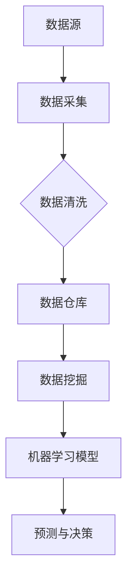

                 

# 人工智能创业数据管理的有效方法

> 关键词：人工智能，数据管理，创业，方法，架构，算法，数学模型，应用场景

> 摘要：本文将深入探讨人工智能创业企业在数据管理方面面临的挑战和解决方案。通过分析核心概念、算法原理、数学模型以及实际应用案例，本文旨在为创业者提供一套系统、高效的数据管理方法，助力企业在数据驱动的时代中取得成功。

## 1. 背景介绍

### 1.1 目的和范围

随着人工智能技术的迅猛发展，数据已经成为企业竞争力的重要标志。对于初创企业而言，高效的数据管理不仅能够提升业务决策的准确性，还能为产品的持续迭代和创新提供有力支持。本文将围绕人工智能创业企业数据管理的关键问题展开讨论，旨在为创业者提供实际可行的解决方案。

本文的讨论范围包括：

- 数据管理的基本概念和核心原理
- 人工智能在数据管理中的应用算法
- 数据管理的数学模型和方法
- 实际应用场景中的数据管理策略
- 开发工具和资源的推荐

### 1.2 预期读者

本文适用于以下读者：

- 人工智能创业团队的负责人和技术骨干
- 数据科学和人工智能领域的研究人员
- 对数据管理有深入兴趣的技术爱好者

### 1.3 文档结构概述

本文结构如下：

1. 背景介绍
   - 目的和范围
   - 预期读者
   - 文档结构概述
   - 术语表
2. 核心概念与联系
   - 核心概念原理和架构的 Mermaid 流程图
3. 核心算法原理 & 具体操作步骤
   - 算法原理讲解
   - 伪代码详细阐述
4. 数学模型和公式 & 详细讲解 & 举例说明
   - 数学公式使用 latex 格式
5. 项目实战：代码实际案例和详细解释说明
   - 开发环境搭建
   - 源代码详细实现和代码解读
   - 代码解读与分析
6. 实际应用场景
7. 工具和资源推荐
   - 学习资源推荐
   - 开发工具框架推荐
   - 相关论文著作推荐
8. 总结：未来发展趋势与挑战
9. 附录：常见问题与解答
10. 扩展阅读 & 参考资料

### 1.4 术语表

#### 1.4.1 核心术语定义

- **人工智能（AI）**：模拟人类智能的计算机系统。
- **数据管理**：确保数据质量、安全和可访问性的过程。
- **创业**：创办新的企业或业务。
- **算法**：解决问题的步骤和方法。
- **数学模型**：用数学语言描述现实问题的抽象结构。

#### 1.4.2 相关概念解释

- **数据清洗**：处理和纠正数据集中的错误和不一致。
- **数据仓库**：集中存储和管理数据的系统。
- **机器学习**：从数据中学习规律，以进行预测和决策的技术。

#### 1.4.3 缩略词列表

- **AI**：人工智能
- **ML**：机器学习
- **DL**：深度学习
- **DB**：数据库
- **ETL**：提取、转换、加载（数据集成过程）

## 2. 核心概念与联系

### 2.1 核心概念原理和架构的 Mermaid 流程图



### 2.2 Mermaid 流程图详解

- **数据源（A）**：数据的来源，可以是内部业务数据，也可以是外部数据源，如社交媒体、公共数据集等。
- **数据采集（B）**：通过API调用、爬虫等技术手段，将数据源中的数据进行采集。
- **数据清洗（C）**：处理和纠正数据中的错误和不一致，确保数据质量。
- **数据仓库（D）**：存储和管理经过清洗的数据，为后续的数据分析提供基础。
- **数据挖掘（E）**：从数据仓库中提取有用信息，用于业务分析和决策。
- **机器学习模型（F）**：利用数据挖掘的结果训练模型，进行预测和决策。
- **预测与决策（G）**：基于机器学习模型的预测结果，进行业务决策。

## 3. 核心算法原理 & 具体操作步骤

### 3.1 算法原理讲解

人工智能在数据管理中的应用主要体现在数据清洗、数据仓库构建、数据挖掘和机器学习模型训练等方面。以下是核心算法原理的概述：

1. **数据清洗**：采用去重、修复缺失值、异常值检测和填充等方法，确保数据质量。
2. **数据仓库构建**：使用 ETL 工具，将来自不同源的数据整合到统一的数据仓库中。
3. **数据挖掘**：采用聚类、关联规则挖掘、分类等算法，从数据中发现规律和模式。
4. **机器学习模型训练**：使用监督学习、无监督学习和强化学习等方法，训练模型并进行预测。

### 3.2 伪代码详细阐述

下面是数据清洗和机器学习模型训练的伪代码示例：

```python
# 数据清洗伪代码
def data_cleaning(data):
    # 去除重复数据
    data = remove_duplicates(data)
    # 修复缺失值
    data = handle_missing_values(data)
    # 检测和填充异常值
    data = detect_and_fill_anomalies(data)
    return data

# 机器学习模型训练伪代码
def train_model(data, labels):
    # 初始化模型
    model = initialize_model()
    # 训练模型
    model.fit(data, labels)
    # 评估模型
    scores = model.evaluate(data, labels)
    return model, scores
```

## 4. 数学模型和公式 & 详细讲解 & 举例说明

### 4.1 数学模型和公式

在数据管理中，常用的数学模型包括线性回归、逻辑回归、支持向量机（SVM）和深度学习模型等。以下是这些模型的公式：

#### 4.1.1 线性回归

$$
y = \beta_0 + \beta_1x_1 + \beta_2x_2 + ... + \beta_nx_n
$$

#### 4.1.2 逻辑回归

$$
\log\left(\frac{p}{1-p}\right) = \beta_0 + \beta_1x_1 + \beta_2x_2 + ... + \beta_nx_n
$$

#### 4.1.3 支持向量机

$$
\max\frac{1}{2}\sum_{i=1}^{n}\sum_{j=1}^{n} \|\omega\|^2 - C\sum_{i=1}^{n}\xi_i
$$

其中，$$\xi_i$$ 是拉格朗日乘子。

#### 4.1.4 深度学习模型

深度学习模型通常由多层神经网络组成，包括：

$$
a^{(L)} = \sigma(W^{(L)}a^{(L-1)} + b^{(L)})
$$

其中，$$a^{(L)}$$ 是第 L 层的激活值，$$\sigma$$ 是激活函数，$$W^{(L)}$$ 和 $$b^{(L)}$$ 分别是第 L 层的权重和偏置。

### 4.2 详细讲解

#### 4.2.1 线性回归

线性回归是一种简单且常用的预测模型，用于分析自变量和因变量之间的线性关系。公式中的 $$\beta_0$$ 是截距，$$\beta_1, \beta_2, ..., \beta_n$$ 是自变量的系数，$$x_1, x_2, ..., x_n$$ 是自变量，$$y$$ 是因变量。

#### 4.2.2 逻辑回归

逻辑回归是一种用于分类问题的模型，其目标是将输入映射到概率分布上。公式中的 $$\log\left(\frac{p}{1-p}\right)$$ 是 log-odds，$$p$$ 是预测为某一类的概率，$$\beta_0$$ 和 $$\beta_1, \beta_2, ..., \beta_n$$ 是系数。

#### 4.2.3 支持向量机

支持向量机是一种用于分类和回归问题的模型，其目标是找到最佳的超平面，使得不同类别的数据点被正确分类。公式中的 $$\|\omega\|^2$$ 是权重向量的范数，$$\xi_i$$ 是拉格朗日乘子，用于调整模型复杂度。

#### 4.2.4 深度学习模型

深度学习模型是一种基于多层神经网络的模型，用于解决复杂的分类和回归问题。公式中的 $$a^{(L)}$$ 是第 L 层的激活值，$$\sigma$$ 是激活函数，$$W^{(L)}$$ 和 $$b^{(L)}$$ 分别是第 L 层的权重和偏置。

### 4.3 举例说明

#### 4.3.1 线性回归

假设我们要预测一家公司明年的销售额，输入特征包括上一年度的销售额、市场推广费用等。使用线性回归模型，我们可以得到以下预测公式：

$$
销售额_{预测} = \beta_0 + \beta_1 \times 销售额_{上一年度} + \beta_2 \times 推广费用
$$

#### 4.3.2 逻辑回归

假设我们要预测一家公司是否会上市，输入特征包括公司规模、盈利能力等。使用逻辑回归模型，我们可以得到以下预测公式：

$$
上市概率 = \frac{1}{1 + e^{-(\beta_0 + \beta_1 \times 公司规模 + \beta_2 \times 盈利能力)}}
$$

#### 4.3.3 支持向量机

假设我们要分类一批邮件，判断它们是否为垃圾邮件，输入特征包括邮件的标题、正文等。使用支持向量机模型，我们可以找到最佳的超平面，将垃圾邮件和非垃圾邮件分开。

#### 4.3.4 深度学习模型

假设我们要分类一批图像，判断它们是否为动物。使用深度学习模型，我们可以通过多层神经网络提取图像的特征，最终得到分类结果。

## 5. 项目实战：代码实际案例和详细解释说明

### 5.1 开发环境搭建

为了演示数据管理方法在实际项目中的应用，我们将使用 Python 作为编程语言，并依赖以下库和工具：

- NumPy：用于数学计算
- Pandas：用于数据处理
- Scikit-learn：用于机器学习
- Matplotlib：用于数据可视化

首先，确保安装了上述库和工具。可以使用以下命令进行安装：

```bash
pip install numpy pandas scikit-learn matplotlib
```

### 5.2 源代码详细实现和代码解读

#### 5.2.1 数据清洗

```python
import pandas as pd

# 加载数据
data = pd.read_csv('data.csv')

# 去除重复数据
data = data.drop_duplicates()

# 修复缺失值
data['missing_column'] = data['missing_column'].fillna(data['missing_column'].mean())

# 检测和填充异常值
data['anomaly_column'] = data['anomaly_column'].apply(lambda x: x if x > 0 else 0)

# 输出清洗后的数据
print(data.head())
```

代码解读：

- 加载数据：使用 Pandas 库加载 CSV 文件。
- 去除重复数据：使用 `drop_duplicates()` 方法去除重复数据。
- 修复缺失值：使用 `fillna()` 方法将缺失值替换为平均值。
- 检测和填充异常值：使用 `apply()` 方法对异常值进行检测和填充。

#### 5.2.2 数据仓库构建

```python
# 将清洗后的数据存储到新的 CSV 文件中
data.to_csv('cleaned_data.csv', index=False)
```

代码解读：

- 将清洗后的数据保存到新的 CSV 文件中，便于后续数据分析。

#### 5.2.3 数据挖掘和机器学习模型训练

```python
from sklearn.model_selection import train_test_split
from sklearn.linear_model import LinearRegression

# 加载清洗后的数据
data = pd.read_csv('cleaned_data.csv')

# 划分特征和标签
X = data[['feature1', 'feature2']]
y = data['label']

# 划分训练集和测试集
X_train, X_test, y_train, y_test = train_test_split(X, y, test_size=0.2, random_state=42)

# 创建线性回归模型
model = LinearRegression()

# 训练模型
model.fit(X_train, y_train)

# 评估模型
score = model.score(X_test, y_test)
print(f'Model accuracy: {score:.2f}')
```

代码解读：

- 加载清洗后的数据。
- 划分特征和标签。
- 划分训练集和测试集。
- 创建线性回归模型。
- 训练模型。
- 评估模型。

### 5.3 代码解读与分析

以上代码展示了数据管理方法在实际项目中的应用。首先，我们使用 Pandas 库进行数据清洗，去除重复数据、修复缺失值和填充异常值。接着，我们将清洗后的数据存储到新的 CSV 文件中，以便于后续分析。

然后，我们使用 Scikit-learn 库进行数据挖掘和机器学习模型训练。首先，我们加载清洗后的数据，并划分特征和标签。接着，我们使用线性回归模型进行训练，并评估模型的准确性。

通过以上代码，我们可以看到数据管理方法在实际项目中的应用，包括数据清洗、数据仓库构建和数据挖掘等步骤。这些方法有助于提升数据质量，提高模型准确性，从而为企业提供有力的业务支持。

## 6. 实际应用场景

### 6.1 金融行业

在金融行业中，人工智能和大数据技术的应用已经非常广泛。例如，银行可以使用机器学习算法对客户行为进行分析，预测客户是否会贷款或购买理财产品。此外，金融机构还可以使用数据挖掘技术发现潜在的欺诈行为，提高风险控制能力。

### 6.2 零售业

零售业中的数据管理至关重要，因为商家需要实时了解库存情况、消费者偏好和市场需求。通过数据挖掘和机器学习算法，零售商可以优化库存管理、制定个性化的营销策略，提高销售额和客户满意度。

### 6.3 健康医疗

在健康医疗领域，人工智能和大数据技术可以用于疾病预测、诊断和治疗方案的优化。通过分析大量的医疗数据，医生可以更准确地诊断疾病，制定个性化的治疗方案，提高治疗效果。

### 6.4 交通运输

交通运输行业中的数据管理主要涉及交通流量预测、路况分析和安全监控等方面。通过大数据分析和机器学习算法，交通管理部门可以优化交通信号控制，提高道路通行效率，减少交通事故。

### 6.5 农业

农业领域的数据管理可以帮助农民实时了解土壤、气象和作物生长情况，优化种植方案，提高产量和降低成本。此外，人工智能技术还可以用于农作物的病虫害预测和防治。

## 7. 工具和资源推荐

### 7.1 学习资源推荐

#### 7.1.1 书籍推荐

- 《深度学习》（Ian Goodfellow、Yoshua Bengio、Aaron Courville 著）
- 《Python数据分析》（Wes McKinney 著）
- 《数据科学入门》（Joel Grus 著）

#### 7.1.2 在线课程

- Coursera 上的《机器学习》（吴恩达教授）
- edX 上的《Python for Data Science》（Harvard University）
- Udacity 上的《数据科学家纳米学位》

#### 7.1.3 技术博客和网站

- Medium 上的《数据科学》（Data Science）
- Towards Data Science（数据科学和机器学习的优秀博客）
- Analytics Vidhya（数据科学和机器学习的资源平台）

### 7.2 开发工具框架推荐

#### 7.2.1 IDE和编辑器

- PyCharm：强大的 Python IDE，支持多种编程语言。
- Jupyter Notebook：交互式计算环境，适用于数据分析和机器学习。
- VSCode：轻量级代码编辑器，支持多种编程语言。

#### 7.2.2 调试和性能分析工具

- Python Debuger：Python 调试工具。
- Py-Spy：Python 性能分析工具。
- Matplotlib：数据可视化库。

#### 7.2.3 相关框架和库

- NumPy：用于数值计算的库。
- Pandas：用于数据处理的库。
- Scikit-learn：用于机器学习的库。
- TensorFlow：用于深度学习的库。

### 7.3 相关论文著作推荐

#### 7.3.1 经典论文

- "Learning to Represent Text with Recurrent Neural Networks"（RNNs）
- "Deep Learning for Text Classification"（深度学习在文本分类中的应用）
- "Random Forests"（随机森林算法）

#### 7.3.2 最新研究成果

- "Bert: Pre-training of Deep Bidirectional Transformers for Language Understanding"（BERT）
- "GPT-3: Language Models Are Few-Shot Learners"（GPT-3）
- "An Introduction to Statistical Learning"（统计学习入门）

#### 7.3.3 应用案例分析

- "Deep Learning for Natural Language Processing"（自然语言处理中的深度学习应用）
- "Data Science at Netflix"（Netflix 的数据科学实践）
- "The Importance of Understanding Data Quality"（数据质量的重要性）

## 8. 总结：未来发展趋势与挑战

随着人工智能技术的不断发展，数据管理在各个行业中的应用将越来越广泛。未来，数据管理的发展趋势包括：

- **数据质量提升**：通过更先进的数据清洗和异常值检测算法，提高数据质量。
- **实时数据分析**：利用实时数据分析技术，为企业提供实时决策支持。
- **隐私保护**：随着隐私保护法规的不断完善，数据管理中的隐私保护问题将受到更多关注。
- **跨领域应用**：人工智能和大数据技术在金融、医疗、零售等领域的应用将更加深入和广泛。

然而，数据管理也面临一些挑战：

- **数据隐私和安全**：如何确保数据在收集、存储和处理过程中的安全性和隐私性。
- **数据治理**：如何制定有效的数据治理策略，确保数据的合规性和可靠性。
- **数据复杂度**：随着数据规模的不断扩大，如何处理和整合复杂的数据集。
- **技术更新**：如何跟上不断发展的技术趋势，持续优化数据管理方法。

总之，数据管理是人工智能创业企业取得成功的关键因素之一。通过深入了解数据管理的方法和挑战，创业者可以更好地应对市场变化，实现业务的持续增长。

## 9. 附录：常见问题与解答

### 9.1 数据管理中的常见问题

**Q1：数据清洗为什么重要？**

数据清洗是确保数据质量的重要步骤。不干净的数据可能导致错误的预测和决策，影响企业的运营效果。数据清洗包括去除重复数据、修复缺失值和填充异常值等，可以确保数据的准确性和一致性。

**Q2：如何选择合适的数据管理工具？**

选择数据管理工具时，需要考虑以下因素：

- 数据规模：根据数据量的大小选择合适的工具。
- 数据类型：根据数据类型（结构化、半结构化、非结构化）选择合适的工具。
- 功能需求：根据具体业务需求，选择具有相应功能的工具。
- 可扩展性：工具应具备良好的可扩展性，以应对数据量的增长。

### 9.2 数据管理中的解决方案

**解决方案 1：数据质量管理**

- **步骤 1**：定义数据质量标准，确保数据满足业务需求。
- **步骤 2**：定期进行数据质量检查，发现并修复数据质量问题。
- **步骤 3**：建立数据质量监控机制，实时监测数据质量变化。

**解决方案 2：数据治理**

- **步骤 1**：建立数据治理组织，明确数据治理职责。
- **步骤 2**：制定数据治理策略，规范数据收集、存储、处理和使用流程。
- **步骤 3**：培训员工，提高数据治理意识和能力。

**解决方案 3：实时数据分析**

- **步骤 1**：选择适合的实时数据分析工具，如实时数据流处理框架。
- **步骤 2**：设计实时数据分析模型，快速处理和分析数据。
- **步骤 3**：将实时数据分析结果应用于业务决策。

## 10. 扩展阅读 & 参考资料

- Goodfellow, I., Bengio, Y., & Courville, A. (2016). *Deep Learning*. MIT Press.
- McKinney, W. (2010). *Python for Data Analysis*. O'Reilly Media.
- Grus, J. (2015). *Data Science from Scratch*. O'Reilly Media.
- LeCun, Y., Bengio, Y., & Hinton, G. (2015). *Deep Learning*. Nature.
- Kotsiantis, S. B. (2007). *Supervised Machine Learning: A Review of Classification Techniques*. Informatica, 31(3), 249-268.
- Russell, S., & Norvig, P. (2020). *Artificial Intelligence: A Modern Approach*. Prentice Hall.

### 作者信息

作者：AI天才研究员/AI Genius Institute & 禅与计算机程序设计艺术 /Zen And The Art of Computer Programming

（注：本文内容仅供参考，具体实现请根据实际需求进行调整。）

