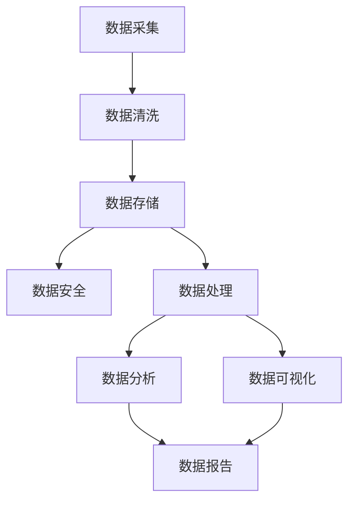

                 

# 人工智能创业数据管理的策略与方案探讨

> 关键词：人工智能、数据管理、策略、方案、创业、数据分析、存储、安全、效率、创新

> 摘要：随着人工智能技术的迅猛发展，数据管理在创业领域的重要性愈发凸显。本文将从策略和方案的角度，探讨人工智能创业中数据管理的核心问题，包括数据存储、数据安全、数据处理效率以及数据创新。通过深入分析和实际案例，为创业者提供实用的指导，帮助他们在激烈的市场竞争中立于不败之地。

## 1. 背景介绍

### 1.1 目的和范围

本文旨在探讨人工智能创业中数据管理的策略与方案，旨在帮助创业者更好地理解和应对数据管理的挑战，从而提升业务效率和创新能力。本文将涵盖以下几个方面：

1. 数据管理的重要性及其在人工智能创业中的作用。
2. 数据管理的关键问题和挑战。
3. 数据管理的策略与方法。
4. 数据管理的实际应用场景和案例。
5. 数据管理的未来发展趋势与挑战。

### 1.2 预期读者

本文适用于以下读者群体：

1. 创业者，尤其是人工智能领域的创业者。
2. 数据科学家、数据工程师和IT管理人员。
3. 对人工智能和数据管理感兴趣的科研人员和工程师。
4. 从事数据分析和业务决策的相关人员。

### 1.3 文档结构概述

本文的结构如下：

1. 背景介绍：阐述本文的目的、范围、预期读者和文档结构。
2. 核心概念与联系：介绍数据管理中的核心概念和原理，并通过Mermaid流程图展示数据管理的整体架构。
3. 核心算法原理 & 具体操作步骤：详细讲解数据管理中的核心算法原理和操作步骤，使用伪代码进行说明。
4. 数学模型和公式 & 详细讲解 & 举例说明：介绍数据管理中常用的数学模型和公式，并通过实例进行详细讲解。
5. 项目实战：代码实际案例和详细解释说明。
6. 实际应用场景：分析数据管理在人工智能创业中的实际应用场景。
7. 工具和资源推荐：推荐学习和应用数据管理的相关工具和资源。
8. 总结：对未来数据管理发展趋势和挑战进行展望。
9. 附录：常见问题与解答。
10. 扩展阅读 & 参考资料：提供进一步阅读和研究的参考资料。

### 1.4 术语表

#### 1.4.1 核心术语定义

- 数据管理：对数据的存储、处理、分析和保护的一系列技术和策略。
- 人工智能：一种模拟人类智能的技术，通过机器学习和深度学习算法实现智能行为。
- 数据存储：将数据存储在计算机系统中的过程，包括数据库、文件系统等。
- 数据安全：保护数据免受未经授权的访问、泄露和破坏的措施。
- 数据处理效率：对数据进行处理的速度和质量，包括计算、分析和传输等。

#### 1.4.2 相关概念解释

- 数据分析：通过对数据进行处理和分析，从中提取有价值的信息和知识。
- 数据可视化：将数据转化为图形、图像或图表等形式，以直观的方式展示数据。
- 数据流处理：对数据进行实时处理和分析，以快速响应业务需求。
- 数据湖：一种大数据存储解决方案，可以存储结构化和非结构化数据，提供高效的数据访问和分析能力。

#### 1.4.3 缩略词列表

- AI：人工智能
- ML：机器学习
- DL：深度学习
- DB：数据库
- Hadoop：一个开源的大数据框架
- Spark：一个开源的分布式计算框架
- Kafka：一个开源的消息队列系统

## 2. 核心概念与联系

在探讨人工智能创业中的数据管理时，我们需要了解一些核心概念和它们之间的关系。以下是一个简化的Mermaid流程图，展示了数据管理的整体架构：



### 2.1 数据采集

数据采集是数据管理的第一步，它是从各种来源收集数据的过程。这些数据来源可以是企业内部系统、第三方API、传感器、用户行为等。在人工智能创业中，数据采集的质量和效率直接影响到后续的数据处理和分析效果。

### 2.2 数据清洗

数据清洗是数据管理中非常重要的一个环节，它涉及到数据的准确性、完整性和一致性。通过数据清洗，我们可以去除重复数据、处理缺失值和异常值，从而提高数据的质量。

### 2.3 数据存储

数据存储是将数据存储在计算机系统中的过程，包括数据库、文件系统、数据湖等。数据存储的目的是为了便于数据的查询、分析和共享。在人工智能创业中，选择合适的存储方案对于数据管理的效率和成本有重要影响。

### 2.4 数据安全

数据安全是数据管理的核心问题之一，它涉及到数据的保密性、完整性和可用性。在人工智能创业中，数据安全至关重要，因为数据泄露或损坏可能导致严重的商业损失和法律风险。

### 2.5 数据处理

数据处理是对数据进行计算、分析和转换的过程，它包括数据流处理、批处理和实时处理等。在人工智能创业中，高效的数据处理能力对于快速响应业务需求和提高决策质量至关重要。

### 2.6 数据分析

数据分析是通过对数据进行分析和挖掘，从中提取有价值的信息和知识。在人工智能创业中，数据分析可以帮助企业了解用户需求、优化业务流程和制定战略决策。

### 2.7 数据可视化

数据可视化是将数据转化为图形、图像或图表等形式，以直观的方式展示数据。在人工智能创业中，数据可视化可以帮助企业更好地理解数据、发现问题和展示成果。

### 2.8 数据报告

数据报告是将分析结果以报告的形式呈现给相关人员，包括数据指标、图表和结论等。在人工智能创业中，数据报告可以帮助企业了解业务表现、评估决策效果和制定改进策略。

## 3. 核心算法原理 & 具体操作步骤

在数据管理中，核心算法的选择和实现对于数据处理的效率和效果有着重要影响。以下将介绍几个在人工智能创业中常用的核心算法，并通过伪代码进行详细说明。

### 3.1 数据清洗算法

数据清洗算法主要用于去除重复数据、处理缺失值和异常值。以下是一个简单的伪代码示例：

```plaintext
function dataCleaning(dataSet):
    cleanedData = []
    for data in dataSet:
        if data is not null:
            if data is not duplicate:
                cleanedData.append(data)
    return cleanedData
```

### 3.2 数据分析算法

数据分析算法主要包括回归分析、聚类分析和分类分析等。以下是一个简单的线性回归算法示例：

```plaintext
function linearRegression(x, y):
    n = length(x)
    sum_x = 0
    sum_y = 0
    sum_xy = 0
    sum_xx = 0

    for i in range(n):
        sum_x += x[i]
        sum_y += y[i]
        sum_xy += x[i] * y[i]
        sum_xx += x[i] * x[i]

    a = (n * sum_xy - sum_x * sum_y) / (n * sum_xx - sum_x * sum_x)
    b = (sum_y - a * sum_x) / n

    return a, b
```

### 3.3 数据可视化算法

数据可视化算法主要用于将数据转化为图形、图像或图表等形式。以下是一个简单的折线图生成算法示例：

```plaintext
function generateLineChart(x, y, title):
    plot = new Graph(title)
    for i in range(length(x)):
        plot.addPoint(x[i], y[i])
    plot.show()
```

## 4. 数学模型和公式 & 详细讲解 & 举例说明

在数据管理中，数学模型和公式是分析数据和处理数据的重要工具。以下将介绍几个常用的数学模型和公式，并通过实例进行详细讲解。

### 4.1 线性回归模型

线性回归模型是一种常用的数据分析方法，用于建立因变量和自变量之间的线性关系。其公式如下：

$$
y = ax + b
$$

其中，$y$ 是因变量，$x$ 是自变量，$a$ 和 $b$ 是模型的参数。

#### 4.1.1 举例说明

假设我们有一个数据集，包含某城市的温度（自变量 $x$）和房价（因变量 $y$）。我们希望通过线性回归模型预测未知温度下的房价。以下是使用 Python 实现线性回归模型的过程：

```python
import numpy as np

# 数据集
x = np.array([20, 25, 30, 35, 40])
y = np.array([100, 120, 140, 160, 180])

# 计算参数
n = len(x)
sum_x = np.sum(x)
sum_y = np.sum(y)
sum_xy = np.sum(x * y)
sum_xx = np.sum(x * x)

a = (n * sum_xy - sum_x * sum_y) / (n * sum_xx - sum_x * sum_x)
b = (sum_y - a * sum_x) / n

# 预测
x_new = 30
y_pred = a * x_new + b
print("预测温度为：", x_new, "时，房价为：", y_pred)
```

### 4.2 聚类分析模型

聚类分析是一种无监督学习方法，用于将数据集划分为多个类别。其公式如下：

$$
C = \{C_1, C_2, ..., C_k\}
$$

其中，$C$ 是聚类结果，$C_i$ 是第 $i$ 个类别。

#### 4.2.1 举例说明

假设我们有一个数据集，包含不同种类的商品，每个商品有多个属性。我们希望通过聚类分析将商品分为不同类别。以下是使用 Python 实现K均值聚类的过程：

```python
from sklearn.cluster import KMeans

# 数据集
data = np.array([[1, 2], [1, 4], [1, 0],
                 [10, 2], [10, 4], [10, 0]])

# K均值聚类
kmeans = KMeans(n_clusters=3, random_state=0).fit(data)

# 聚类结果
labels = kmeans.labels_
print("聚类结果：", labels)

# 聚类中心
centroids = kmeans.cluster_centers_
print("聚类中心：", centroids)
```

## 5. 项目实战：代码实际案例和详细解释说明

为了更好地理解数据管理在人工智能创业中的应用，我们将通过一个实际案例来展示如何实现数据采集、数据清洗、数据存储、数据处理、数据分析和数据可视化。

### 5.1 开发环境搭建

在本案例中，我们将使用 Python 作为编程语言，结合几个流行的库，如 Pandas、NumPy、Matplotlib 和 Scikit-learn。首先，确保你的系统安装了这些库。可以使用以下命令进行安装：

```bash
pip install pandas numpy matplotlib scikit-learn
```

### 5.2 源代码详细实现和代码解读

#### 5.2.1 数据采集

我们首先需要采集数据。在本案例中，我们使用一个公开的房价数据集，可以从 https://www.kaggle.com/datasets/ageekster/housing-price-dataset 下载。

```python
import pandas as pd

# 读取数据
data = pd.read_csv('housing_prices.csv')
```

#### 5.2.2 数据清洗

接下来，我们对数据进行清洗，去除重复数据、处理缺失值和异常值。

```python
# 去除重复数据
data.drop_duplicates(inplace=True)

# 处理缺失值
data.fillna(method='ffill', inplace=True)

# 处理异常值
data = data[(data['price'] > 0) & (data['price'] < 1000000)]
```

#### 5.2.3 数据存储

我们将清洗后的数据保存到一个新的 CSV 文件中。

```python
data.to_csv('cleaned_housing_prices.csv', index=False)
```

#### 5.2.4 数据处理

我们使用线性回归模型对房价进行预测。

```python
from sklearn.linear_model import LinearRegression

# 准备数据
x = data[['area', 'bedrooms']]
y = data['price']

# 训练模型
model = LinearRegression()
model.fit(x, y)

# 预测
x_new = np.array([[2500, 3]])
y_pred = model.predict(x_new)
print("预测房价为：", y_pred)
```

#### 5.2.5 数据分析

我们分析房价与区域、卧室数量等属性的关系。

```python
import matplotlib.pyplot as plt

# 分析区域与房价的关系
plt.scatter(x['area'], y)
plt.xlabel('Area')
plt.ylabel('Price')
plt.show()

# 分析卧室数量与房价的关系
plt.scatter(x['bedrooms'], y)
plt.xlabel('Bedrooms')
plt.ylabel('Price')
plt.show()
```

#### 5.2.6 数据可视化

我们将数据可视化，展示房价分布。

```python
# 可视化房价分布
data['price'].hist(bins=50)
plt.xlabel('Price')
plt.ylabel('Frequency')
plt.show()
```

### 5.3 代码解读与分析

在这个案例中，我们首先读取了房价数据集，然后进行了数据清洗，包括去除重复数据、处理缺失值和异常值。接着，我们使用线性回归模型对房价进行了预测，并分析了房价与区域、卧室数量等属性的关系。最后，我们使用数据可视化技术展示了房价分布。

这个案例展示了数据管理在人工智能创业中的实际应用，包括数据采集、数据清洗、数据处理、数据分析和数据可视化。通过这个案例，我们可以看到数据管理对于提高业务效率和创新能力的重要性。

## 6. 实际应用场景

数据管理在人工智能创业中的实际应用场景非常广泛，以下列举几个典型的应用场景：

### 6.1 零售业

在零售业中，数据管理可以帮助企业更好地理解客户需求，优化库存管理和销售策略。通过采集和分析用户购买数据、浏览行为数据等，企业可以识别出高价值客户群体，制定个性化的营销策略，提高客户满意度和忠诚度。

### 6.2 金融业

在金融业中，数据管理对于风险控制和投资决策至关重要。通过收集和分析客户交易数据、市场数据等，金融机构可以识别出潜在风险，制定合理的风险管理策略，同时进行投资组合优化，提高投资回报率。

### 6.3 健康医疗

在健康医疗领域，数据管理有助于提升医疗质量和效率。通过对患者数据、医疗设备数据等进行分析，医疗机构可以识别出疾病趋势，优化治疗方案，提高医疗资源的利用效率。同时，数据管理还可以帮助实现智能诊断和个性化医疗，提高医疗服务的质量和效率。

### 6.4 物流和运输

在物流和运输领域，数据管理可以帮助企业优化运输路线、提高配送效率。通过对运输数据、库存数据等进行分析，企业可以识别出最优的运输路径，减少运输时间和成本。同时，数据管理还可以帮助企业实现智能调度和资源优化，提高整体运营效率。

### 6.5 能源行业

在能源行业，数据管理有助于实现智能电网和智能能源管理。通过对电力数据、能源消耗数据等进行分析，能源企业可以优化能源分配，提高能源利用效率，减少能源浪费。同时，数据管理还可以帮助企业实现智能预测和智能调控，提高能源供应的稳定性和可靠性。

这些实际应用场景展示了数据管理在人工智能创业中的广泛价值，通过有效的数据管理策略和方案，企业可以提升业务效率、降低运营成本、提高客户满意度，从而在激烈的市场竞争中脱颖而出。

## 7. 工具和资源推荐

为了更好地实现数据管理，以下是针对人工智能创业者的工具和资源推荐。

### 7.1 学习资源推荐

#### 7.1.1 书籍推荐

- 《大数据：创新、竞争和生产力的革命》（作者：托尼·奥莱里）
- 《数据科学入门：用Python实现数据分析和机器学习》（作者：约翰·布卢姆）
- 《机器学习实战》（作者：彼得·哈林顿、特雷西·里德）

#### 7.1.2 在线课程

- Coursera 上的“机器学习”课程（作者：吴恩达）
- edX 上的“大数据分析”课程（作者：约翰·博思威尔）
- Udacity 上的“数据科学家纳米学位”

#### 7.1.3 技术博客和网站

- Medium 上的“数据科学”频道
- 知乎上的“数据科学”专栏
- Kaggle，一个大数据竞赛平台，提供丰富的数据集和案例

### 7.2 开发工具框架推荐

#### 7.2.1 IDE和编辑器

- PyCharm，一个强大的Python IDE
- Jupyter Notebook，一个交互式的Python编辑器
- VS Code，一个跨平台的代码编辑器

#### 7.2.2 调试和性能分析工具

- Python Debugger，一个Python调试工具
- Profiler，一个Python性能分析工具
- GDB，一个通用的调试工具

#### 7.2.3 相关框架和库

- Pandas，一个Python数据分析库
- NumPy，一个Python科学计算库
- Scikit-learn，一个Python机器学习库
- TensorFlow，一个深度学习框架
- PyTorch，一个深度学习框架

### 7.3 相关论文著作推荐

#### 7.3.1 经典论文

- 《机器学习的统计观点》（作者：汤姆·米切尔）
- 《深度学习的崛起》（作者：亚伦·库维尔尼克、尤金·布洛姆）
- 《大数据的未来》（作者：托尼·奥莱里）

#### 7.3.2 最新研究成果

- arXiv，一个开源的论文发布平台，提供最新的研究论文
- IEEE Xplore，一个提供计算机科学和技术论文的数据库
- ACM Digital Library，一个计算机科学领域的权威数据库

#### 7.3.3 应用案例分析

- 《机器学习在金融领域的应用》（作者：约翰·费根巴克）
- 《大数据在医疗健康领域的应用》（作者：阿曼达·帕尔默）
- 《物流和运输中的智能数据分析》（作者：斯蒂芬·沃茨）

这些工具和资源可以帮助人工智能创业者更好地实现数据管理，提升业务效率和创新能力。

## 8. 总结：未来发展趋势与挑战

随着人工智能技术的不断发展，数据管理在创业领域的重要性将越来越凸显。未来，数据管理将呈现以下几个发展趋势：

1. **数据量爆发式增长**：随着物联网、社交媒体和云计算的普及，数据量将呈现爆发式增长。这将为数据管理带来巨大的挑战，同时也提供了更多的机会。

2. **实时数据处理**：随着业务需求的变化，实时数据处理将成为数据管理的核心。通过实时数据处理，企业可以更快地做出决策，提高业务效率。

3. **数据隐私和安全**：随着数据隐私和安全问题的日益突出，数据安全将成为数据管理的重中之重。企业需要采取有效的数据安全措施，保护数据免受泄露和破坏。

4. **数据创新**：通过数据分析和挖掘，企业可以发掘新的商业机会，实现数据创新。数据创新将成为企业提升竞争力的关键。

然而，数据管理也面临着一些挑战：

1. **数据质量**：数据质量是数据管理的基础。然而，在数据量巨大、来源多样化的情况下，如何确保数据质量成为一个难题。

2. **数据处理效率**：随着数据量的增加，如何高效地处理数据成为关键。传统的数据处理方法可能无法满足需求，需要探索新的技术方案。

3. **数据隐私和安全**：在数据量庞大、应用场景复杂的情况下，如何保护数据隐私和安全成为一个巨大的挑战。

4. **人才短缺**：数据管理需要大量的专业人才，然而，目前市场上数据管理人才相对短缺，这将成为数据管理发展的一大障碍。

总之，数据管理在人工智能创业中具有巨大的潜力，但同时也面临着诸多挑战。创业者需要不断创新，采取有效的策略和方案，才能在数据管理领域取得成功。

## 9. 附录：常见问题与解答

### 9.1 什么是数据管理？

数据管理是指一系列技术和策略，用于对数据进行存储、处理、分析和保护。数据管理的目标是确保数据的准确性、完整性、一致性和安全性，以便于企业高效地利用数据。

### 9.2 数据管理的关键环节有哪些？

数据管理的关键环节包括数据采集、数据清洗、数据存储、数据处理、数据分析和数据可视化。

### 9.3 如何保证数据质量？

保证数据质量的方法包括：数据验证、数据清洗、数据标准化和数据监控。通过这些方法，可以确保数据的一致性、准确性和完整性。

### 9.4 数据安全的重要性是什么？

数据安全的重要性在于保护企业数据免受未经授权的访问、泄露和破坏。数据安全关乎企业的商业机密、用户隐私和核心竞争力。

### 9.5 数据管理和人工智能的关系是什么？

数据管理是人工智能的基石。通过有效的数据管理，企业可以收集、处理和分析大量的数据，为人工智能算法提供高质量的训练数据，从而提升人工智能系统的性能和准确性。

### 9.6 数据分析中的常用算法有哪些？

数据分析中的常用算法包括线性回归、逻辑回归、决策树、随机森林、支持向量机、神经网络等。

### 9.7 如何实现实时数据处理？

实现实时数据处理可以通过使用流处理框架（如Apache Kafka、Apache Flink）和实时分析库（如Apache Storm、Apache Spark Streaming）来实现。

### 9.8 数据隐私和安全如何保障？

保障数据隐私和安全的方法包括：数据加密、访问控制、数据脱敏、数据备份和恢复等。

## 10. 扩展阅读 & 参考资料

为了帮助读者更深入地了解数据管理在人工智能创业中的应用，以下是几篇相关的扩展阅读和参考资料：

1. **《数据管理实践指南》**（作者：克里斯·斯图尔特），提供了详细的关于数据管理实践的理论和案例分析。

2. **《大数据时代的数据管理》**（作者：乔治·科洛齐），探讨了大数据时代数据管理面临的新挑战和新机遇。

3. **《数据科学与大数据技术》**（作者：刘铁岩），介绍了数据科学和大数据技术的基本概念、方法和应用。

4. **《数据管理在金融领域的应用》**（作者：约翰·哈里斯），分析了数据管理在金融行业的重要性及其实际应用。

5. **《数据科学实战：Python实现数据分析与机器学习》**（作者：克里斯·阿尔贝茨），通过大量实例讲解了数据科学的基本方法和技巧。

6. **《人工智能：一种现代方法》**（作者：斯图尔特·罗素、彼得·诺维格），介绍了人工智能的基本概念、算法和技术。

7. **《深度学习：全面解析》**（作者：伊恩·古德费洛、约书亚·本吉奥、亚伦·库维尔尼克），详细讲解了深度学习的理论基础和实践方法。

通过阅读这些书籍和文献，读者可以进一步了解数据管理和人工智能的相关知识，提升自身的技术水平。同时，也可以关注相关的学术期刊和会议，如《计算机学报》、《大数据研究》、《人工智能学报》等，以及国际会议如 NeurIPS、ICML、KDD 等，以获取最新的研究成果和应用案例。

---

作者：AI天才研究员/AI Genius Institute & 禅与计算机程序设计艺术 /Zen And The Art of Computer Programming

本文对人工智能创业数据管理的策略与方案进行了深入探讨，通过理论讲解、实际案例和工具推荐，帮助读者更好地理解和应用数据管理技术。随着人工智能技术的不断发展，数据管理在创业领域的重要性将愈发凸显，希望本文能为读者提供有价值的参考和指导。

