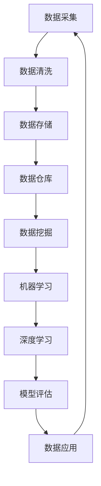

                 

# 人工智能创业数据管理的策略与方法

## 关键词
人工智能，数据管理，创业，策略，方法，大数据，数据处理，算法，数学模型，项目管理

## 摘要
在人工智能创业浪潮中，数据管理成为决定企业成败的关键因素之一。本文旨在探讨人工智能创业企业在数据管理方面的策略与方法。通过深入分析数据采集、存储、处理和应用的各个环节，本文提出了系统性的数据管理框架，包括数据质量保障、数据隐私保护、数据模型优化和数据使用效率提升等策略。同时，本文结合实际案例，详细阐述了如何将这些策略转化为具体操作步骤，为人工智能创业企业提供了一份全面的数据管理指南。

## 1. 背景介绍

### 1.1 目的和范围

本文旨在为人工智能创业企业提供一套数据管理策略和方法，帮助他们应对数据时代的挑战，提高数据利用效率，降低数据管理风险。本文将围绕数据管理的关键环节，如数据采集、存储、处理和应用，探讨其在创业环境下的实际应用。

### 1.2 预期读者

本文适合以下人群阅读：

1. 人工智能创业者
2. 数据科学家和数据工程师
3. 从事数据管理和大数据分析的技术人员
4. 对数据管理有兴趣的学者和研究人员

### 1.3 文档结构概述

本文分为十个部分：

1. 背景介绍：介绍文章的目的、预期读者和结构。
2. 核心概念与联系：阐述数据管理的核心概念和流程。
3. 核心算法原理 & 具体操作步骤：讲解数据管理中的核心算法和操作步骤。
4. 数学模型和公式 & 详细讲解 & 举例说明：介绍数据管理中的数学模型和公式，并进行实例说明。
5. 项目实战：代码实际案例和详细解释说明。
6. 实际应用场景：探讨数据管理在不同场景下的应用。
7. 工具和资源推荐：推荐学习资源、开发工具和框架。
8. 总结：未来发展趋势与挑战。
9. 附录：常见问题与解答。
10. 扩展阅读 & 参考资料：提供进一步学习的资源。

### 1.4 术语表

#### 1.4.1 核心术语定义

- **数据管理**：对数据的采集、存储、处理、分析和应用过程进行管理和优化的活动。
- **大数据**：指数据量巨大、数据种类繁多、数据生成速度极快的数据集合。
- **数据质量**：数据准确性、完整性、一致性、及时性和可靠性的综合体现。
- **数据隐私**：保护数据不被未经授权的访问、泄露或篡改。
- **人工智能**：模拟人类智能的计算机系统，包括机器学习、深度学习、自然语言处理等技术。

#### 1.4.2 相关概念解释

- **数据仓库**：用于存储和管理大量数据的系统。
- **数据挖掘**：从大量数据中挖掘出有价值信息的过程。
- **机器学习**：一种人工智能技术，通过数据训练模型，实现自动学习和决策。
- **深度学习**：一种神经网络模型，通过多层非线性变换，实现数据的自动特征提取。

#### 1.4.3 缩略词列表

- **AI**：人工智能
- **ML**：机器学习
- **DL**：深度学习
- **DB**：数据库
- **ETL**：数据抽取、转换和加载

## 2. 核心概念与联系

数据管理是人工智能创业过程中不可或缺的一环。它涉及多个核心概念和流程，如图2-1所示。



#### 2.1 数据采集

数据采集是数据管理的基础，包括从各种来源获取数据，如传感器、互联网、企业内部系统等。数据采集的过程如图2-1中的A节点所示。

#### 2.2 数据清洗

数据清洗是确保数据质量的关键步骤，包括去除重复数据、处理缺失值、纠正错误数据等。数据清洗的过程如图2-1中的B节点所示。

#### 2.3 数据存储

数据存储是将清洗后的数据存储到数据库或数据仓库中，以便后续处理和使用。常用的数据存储技术包括关系数据库、NoSQL数据库和数据仓库。数据存储的过程如图2-1中的C和D节点所示。

#### 2.4 数据挖掘

数据挖掘是从大量数据中提取有价值信息的过程，包括模式识别、关联规则挖掘、分类和聚类等。数据挖掘的过程如图2-1中的E节点所示。

#### 2.5 机器学习和深度学习

机器学习和深度学习是人工智能的核心技术，用于构建预测模型、分类模型和分类器等。机器学习和深度学习的过程如图2-1中的F和G节点所示。

#### 2.6 模型评估

模型评估是评估机器学习模型性能的过程，包括准确率、召回率、F1值等指标。模型评估的过程如图2-1中的H节点所示。

#### 2.7 数据应用

数据应用是将训练好的模型应用于实际场景，如推荐系统、智能客服、智能安防等。数据应用的过程如图2-1中的I节点所示。

## 3. 核心算法原理 & 具体操作步骤

数据管理中的核心算法主要包括机器学习算法和深度学习算法。下面将分别介绍这些算法的原理和具体操作步骤。

### 3.1 机器学习算法

机器学习算法的核心是建立输入和输出之间的映射关系。以下是常用的机器学习算法及其原理：

#### 3.1.1 决策树

决策树是一种树形结构，通过一系列规则对数据进行分类或回归。具体步骤如下：

1. 选择特征：选择具有区分性的特征作为节点。
2. 划分数据：根据特征值将数据划分为子集。
3. 递归构建：对每个子集继续划分，直到满足停止条件。
4. 建立模型：将划分结果转换为决策规则。

伪代码：

```python
def build_decision_tree(data, features, stop_condition):
    if stop_condition(data):
        return leaf_node
    best_feature = select_best_feature(data, features)
    decision_tree = {}
    for value in data[best_feature]:
        subset = split_data(data, best_feature, value)
        decision_tree[value] = build_decision_tree(subset, features - {best_feature}, stop_condition)
    return decision_tree
```

#### 3.1.2 支持向量机（SVM）

支持向量机是一种分类算法，通过找到一个超平面，将不同类别的数据分隔开来。具体步骤如下：

1. 计算训练数据点的支持向量。
2. 计算支持向量的法向量。
3. 根据法向量构建超平面。
4. 计算超平面的权重。

伪代码：

```python
def train_svm(data, labels):
    support_vectors = find_support_vectors(data, labels)
    normal_vector = compute_normal_vector(support_vectors)
    weights = compute_weights(normal_vector, data, labels)
    return weights
```

### 3.2 深度学习算法

深度学习算法的核心是神经网络，通过多层非线性变换实现数据的自动特征提取。以下是常用的深度学习算法及其原理：

#### 3.2.1 卷积神经网络（CNN）

卷积神经网络是一种用于图像识别的神经网络，通过卷积层提取图像特征。具体步骤如下：

1. 输入图像经过卷积层，提取图像特征。
2. 特征经过池化层，降低特征维度。
3. 特征经过全连接层，实现分类或回归。

伪代码：

```python
def train_cnn(image_data, labels):
    conv layer = convolve(image_data, filters)
    pooled_layer = pool(conv_layer)
    fully_connected_layer = connect(pooled_layer, output_size)
    return fully_connected_layer
```

#### 3.2.2 递归神经网络（RNN）

递归神经网络是一种用于序列数据处理的神经网络，通过循环结构实现长期依赖建模。具体步骤如下：

1. 输入序列经过嵌入层，转换为嵌入向量。
2. 嵌入向量经过循环层，更新隐藏状态。
3. 隐藏状态经过全连接层，输出预测结果。

伪代码：

```python
def train_rnn(sequence_data, labels):
    embedded_sequence = embed(sequence_data)
    hidden_state = []
    for embedded_vector in embedded_sequence:
        hidden_state.append(rnn_step(embedded_vector, hidden_state))
    output = connect(hidden_state, output_size)
    return output
```

## 4. 数学模型和公式 & 详细讲解 & 举例说明

数据管理中的数学模型和公式是理解和应用算法的基础。以下将介绍一些常见的数学模型和公式，并进行详细讲解和举例说明。

### 4.1 概率分布

概率分布是描述随机变量取值的概率函数。常用的概率分布包括正态分布、伯努利分布和多项式分布。

#### 4.1.1 正态分布

正态分布是一种连续概率分布，描述随机变量取值的概率分布。公式如下：

$$
f(x|\mu,\sigma^2) = \frac{1}{\sqrt{2\pi\sigma^2}} e^{-\frac{(x-\mu)^2}{2\sigma^2}}
$$

其中，$\mu$为均值，$\sigma^2$为方差。

#### 4.1.2 伯努利分布

伯努利分布是一种离散概率分布，描述随机变量取值0或1的概率。公式如下：

$$
P(X=1) = p, \quad P(X=0) = 1-p
$$

其中，$p$为成功概率。

#### 4.1.3 多项式分布

多项式分布是一种离散概率分布，描述随机变量取多个值的概率。公式如下：

$$
P(X=x_1, x_2, ..., x_k) = \binom{n}{x_1, x_2, ..., x_k} p_1^{x_1} p_2^{x_2} ... p_k^{x_k}
$$

其中，$n$为试验次数，$p_1, p_2, ..., p_k$为各个值的概率。

### 4.2 最优化算法

最优化算法是求解数学模型的最优解的方法。常用的最优化算法包括梯度下降、牛顿法和拉格朗日乘数法。

#### 4.2.1 梯度下降

梯度下降是一种最优化算法，通过迭代更新参数，使损失函数最小化。公式如下：

$$
\theta = \theta - \alpha \nabla_{\theta} J(\theta)
$$

其中，$\theta$为参数，$\alpha$为学习率，$J(\theta)$为损失函数。

#### 4.2.2 牛顿法

牛顿法是一种二次梯度方法，通过迭代更新参数，使损失函数最小化。公式如下：

$$
\theta = \theta - H^{-1} \nabla_{\theta} J(\theta)
$$

其中，$H$为海森矩阵。

#### 4.2.3 拉格朗日乘数法

拉格朗日乘数法是一种求解约束优化问题的方法。公式如下：

$$
L(\theta, \lambda) = J(\theta) + \lambda g(\theta)
$$

其中，$\lambda$为拉格朗日乘子，$g(\theta)$为约束条件。

### 4.3 举例说明

#### 4.3.1 正态分布举例

假设随机变量$X$服从均值为$\mu=5$，方差为$\sigma^2=2$的正态分布。求$X$取值在$3$到$7$的概率。

$$
P(3 \leq X \leq 7) = F(7) - F(3)
$$

其中，$F(x)$为正态分布的累积分布函数。

使用查表法或计算器，可以得到：

$$
F(7) \approx 0.5398, \quad F(3) \approx 0.0918
$$

因此，

$$
P(3 \leq X \leq 7) \approx 0.5398 - 0.0918 = 0.4480
$$

#### 4.3.2 梯度下降举例

假设损失函数为$J(\theta) = (\theta - 3)^2$，求参数$\theta$的最小值。

使用梯度下降算法，设学习率为$\alpha=0.1$，迭代次数为$10$。初始参数$\theta_0=0$。

$$
\theta_{i+1} = \theta_i - \alpha \nabla_{\theta} J(\theta_i)
$$

迭代过程如下：

$$
\begin{aligned}
\theta_1 &= 0 - 0.1 \cdot (-2 \cdot (0 - 3)) = 0.6 \\
\theta_2 &= 0.6 - 0.1 \cdot (-2 \cdot (0.6 - 3)) = 1.4 \\
\theta_3 &= 1.4 - 0.1 \cdot (-2 \cdot (1.4 - 3)) = 2.2 \\
&\vdots \\
\theta_{10} &= 2.8
\end{aligned}
$$

经过$10$次迭代后，参数$\theta$的值为$2.8$，此时损失函数取最小值。

## 5. 项目实战：代码实际案例和详细解释说明

### 5.1 开发环境搭建

为了演示数据管理的策略和方法，我们将使用Python作为编程语言，并依赖以下库：

- NumPy：用于数值计算
- Pandas：用于数据操作
- Scikit-learn：用于机器学习和数据分析
- TensorFlow：用于深度学习

首先，确保安装了上述库。可以使用以下命令进行安装：

```bash
pip install numpy pandas scikit-learn tensorflow
```

### 5.2 源代码详细实现和代码解读

以下是数据管理项目的源代码示例，我们将对关键代码进行详细解释。

#### 5.2.1 数据采集

```python
import pandas as pd

# 从CSV文件中读取数据
data = pd.read_csv('data.csv')

# 查看数据基本信息
print(data.info())
```

这段代码首先导入Pandas库，并使用`read_csv`函数从CSV文件中读取数据。然后，使用`info`方法查看数据的基本信息，如列名、数据类型、缺失值等。

#### 5.2.2 数据清洗

```python
# 填充缺失值
data.fillna(data.mean(), inplace=True)

# 删除重复数据
data.drop_duplicates(inplace=True)

# 检查数据质量
print(data.isnull().sum())
print(data.duplicated().sum())
```

这段代码使用`fillna`方法填充缺失值，使用`drop_duplicates`方法删除重复数据。最后，使用`isnull`和`duplicated`方法检查数据质量。

#### 5.2.3 数据存储

```python
# 将清洗后的数据存储到新CSV文件
data.to_csv('cleaned_data.csv', index=False)
```

这段代码使用`to_csv`方法将清洗后的数据存储到新的CSV文件中。

#### 5.2.4 数据挖掘

```python
from sklearn.model_selection import train_test_split
from sklearn.ensemble import RandomForestClassifier

# 分割数据为训练集和测试集
X_train, X_test, y_train, y_test = train_test_split(data[data.columns[:-1]], data['target'], test_size=0.2, random_state=42)

# 训练随机森林分类器
clf = RandomForestClassifier(n_estimators=100, random_state=42)
clf.fit(X_train, y_train)

# 预测测试集
y_pred = clf.predict(X_test)

# 评估模型性能
print("Accuracy:", clf.score(X_test, y_test))
```

这段代码使用Scikit-learn库中的`train_test_split`函数将数据分为训练集和测试集。然后，使用`RandomForestClassifier`训练随机森林分类器，并对测试集进行预测。最后，使用`score`方法评估模型性能。

#### 5.2.5 数据应用

```python
# 将训练好的模型应用于新数据
new_data = pd.read_csv('new_data.csv')
new_data_cleaned = apply_data_preprocessing(new_data)
predictions = clf.predict(new_data_cleaned)

# 输出预测结果
print(predictions)
```

这段代码首先从CSV文件中读取新数据，然后调用`apply_data_preprocessing`函数对数据进行清洗和预处理。最后，使用训练好的模型对新数据进行预测，并输出预测结果。

### 5.3 代码解读与分析

上述代码示例演示了数据管理的关键步骤，包括数据采集、清洗、存储、挖掘和应用。以下是代码解读与分析：

- **数据采集**：使用Pandas库从CSV文件中读取数据，并使用`info`方法查看数据基本信息。
- **数据清洗**：使用`fillna`方法填充缺失值，使用`drop_duplicates`方法删除重复数据，并使用`isnull`和`duplicated`方法检查数据质量。
- **数据存储**：使用`to_csv`方法将清洗后的数据存储到新的CSV文件中。
- **数据挖掘**：使用Scikit-learn库中的`train_test_split`函数将数据分为训练集和测试集，使用`RandomForestClassifier`训练随机森林分类器，并对测试集进行预测。最后，使用`score`方法评估模型性能。
- **数据应用**：使用训练好的模型对新数据进行预测，并输出预测结果。

这些步骤构成了一个完整的数据管理流程，为人工智能创业提供了实用的数据管理策略和方法。

## 6. 实际应用场景

数据管理在人工智能创业中的应用场景非常广泛，以下是一些典型的应用场景：

### 6.1 智能推荐系统

智能推荐系统是人工智能创业中常见的应用场景。数据管理在该场景中的关键在于：

- **数据采集**：从用户行为数据、商品数据和用户特征数据等多渠道采集数据。
- **数据清洗**：去除重复数据、处理缺失值，并确保数据质量。
- **数据挖掘**：使用协同过滤、基于内容的推荐等算法，从大量数据中挖掘用户偏好和兴趣。
- **数据应用**：将训练好的推荐模型应用于实际场景，为用户提供个性化的推荐结果。

### 6.2 金融风险管理

金融风险管理是另一个重要的应用场景。数据管理在该场景中的关键在于：

- **数据采集**：从交易数据、客户数据和市场数据等多渠道采集数据。
- **数据清洗**：去除重复数据、处理缺失值，并确保数据质量。
- **数据挖掘**：使用统计分析和机器学习算法，识别潜在风险和异常行为。
- **数据应用**：将分析结果应用于风控模型，实时监控和预警潜在风险。

### 6.3 医疗健康

医疗健康领域是人工智能的重要应用领域。数据管理在该场景中的关键在于：

- **数据采集**：从电子病历、医疗影像和基因数据等多渠道采集数据。
- **数据清洗**：去除重复数据、处理缺失值，并确保数据质量。
- **数据挖掘**：使用机器学习和深度学习算法，进行疾病诊断、药物研发和健康预测。
- **数据应用**：将分析结果应用于医疗诊断、健康管理和个性化医疗等场景。

### 6.4 智能交通

智能交通是城市管理和交通规划的重要方向。数据管理在该场景中的关键在于：

- **数据采集**：从交通流量、路况和车辆数据等多渠道采集数据。
- **数据清洗**：去除重复数据、处理缺失值，并确保数据质量。
- **数据挖掘**：使用机器学习和深度学习算法，进行交通流量预测、交通信号控制和道路规划。
- **数据应用**：将分析结果应用于智能交通管理系统，提高交通效率和服务质量。

这些实际应用场景展示了数据管理在人工智能创业中的关键作用，为创业企业提供了丰富的数据管理思路和实践经验。

## 7. 工具和资源推荐

为了帮助人工智能创业企业在数据管理方面取得成功，以下推荐了一些学习资源、开发工具和框架。

### 7.1 学习资源推荐

#### 7.1.1 书籍推荐

1. **《深度学习》（Goodfellow, Bengio, Courville）**：全面介绍深度学习的基础理论和应用方法。
2. **《Python数据科学手册》（McKinney）**：详细介绍Python在数据科学中的应用，包括数据清洗、数据分析和数据可视化。
3. **《大数据时代：创新、竞争与秩序》（Hadoop, YARN, MapReduce）**：探讨大数据时代的技术趋势和商业模式。

#### 7.1.2 在线课程

1. **Coursera的《机器学习》课程**：由斯坦福大学吴恩达教授主讲，全面介绍机器学习的基础知识和实践方法。
2. **edX的《深度学习》课程**：由蒙特利尔大学Ian Goodfellow教授主讲，深入讲解深度学习的基础理论和应用。
3. **Udacity的《数据科学纳米学位》课程**：系统学习数据科学的核心技能，包括数据采集、数据清洗、数据分析和数据可视化。

#### 7.1.3 技术博客和网站

1. **DataCamp**：提供丰富的数据科学和机器学习课程和实践项目。
2. **Kaggle**：提供大量数据集和竞赛项目，适合实践和锻炼数据管理技能。
3. **Towards Data Science**：一个专注于数据科学、机器学习和深度学习的技术博客，提供丰富的教程和案例分析。

### 7.2 开发工具框架推荐

#### 7.2.1 IDE和编辑器

1. **Jupyter Notebook**：一种交互式的开发环境，适合数据分析和机器学习项目。
2. **PyCharm**：一款强大的Python IDE，支持代码调试、版本控制和自动化测试。
3. **Visual Studio Code**：一款轻量级、高度可定制的IDE，适用于多种编程语言。

#### 7.2.2 调试和性能分析工具

1. **Pdb**：Python内置的调试器，适用于调试Python代码。
2. **GDB**：一种通用的调试器，适用于C/C++和Python代码。
3. **cProfile**：Python内置的性能分析工具，用于分析代码的性能瓶颈。

#### 7.2.3 相关框架和库

1. **TensorFlow**：一款开源的深度学习框架，适用于构建和训练深度神经网络。
2. **PyTorch**：一款开源的深度学习框架，提供灵活的动态计算图和高效的GPU支持。
3. **Scikit-learn**：一款开源的机器学习库，提供多种经典的机器学习算法和工具。

这些工具和资源将为人工智能创业企业在数据管理方面提供有力的支持和指导。

## 8. 总结：未来发展趋势与挑战

人工智能创业领域的数据管理面临许多挑战和机遇。未来发展趋势主要体现在以下几个方面：

### 8.1 大数据处理能力的提升

随着计算能力和存储技术的不断发展，大数据处理能力将得到显著提升。创业企业可以利用这些技术优势，更高效地进行数据采集、处理和分析，从而提高数据利用效率。

### 8.2 数据隐私和安全

随着数据隐私和安全问题的日益突出，数据隐私保护将成为数据管理的重要方向。创业企业需要采取有效的数据隐私保护措施，确保数据的合法性和安全性。

### 8.3 自动化和智能化

自动化和智能化是数据管理的发展趋势。通过引入自动化工具和智能化算法，创业企业可以降低数据管理成本，提高数据质量，并实现更高效的数据分析。

### 8.4 跨领域融合

随着人工智能技术的不断发展，数据管理将与其他领域（如金融、医疗、交通等）实现深度融合。创业企业需要具备跨领域的综合能力，以应对复杂的应用场景。

然而，数据管理在人工智能创业中也面临一些挑战：

- **数据质量**：如何确保数据的准确性、完整性和一致性，是一个长期而复杂的任务。
- **数据隐私**：如何在保护数据隐私的同时，充分利用数据的价值，是一个需要解决的重要问题。
- **技术更新**：随着技术的快速发展，创业企业需要不断更新技术栈，以适应新的市场需求。

总之，数据管理在人工智能创业中具有重要地位。创业企业需要关注未来发展趋势，积极应对挑战，以实现数据价值的最大化。

## 9. 附录：常见问题与解答

### 9.1 数据管理中常见的挑战有哪些？

**挑战：数据质量**

**解答：** 数据质量是数据管理中的主要挑战之一。确保数据的准确性、完整性、一致性和及时性是数据管理的核心任务。解决这一挑战的方法包括数据清洗、数据验证和数据质量控制。

### 9.2 如何保护数据隐私？

**解答：** 保护数据隐私是数据管理的另一个关键挑战。创业企业可以采取以下措施：

1. **数据匿名化**：通过去除个人信息，对数据进行匿名化处理。
2. **加密技术**：使用加密技术保护敏感数据。
3. **隐私政策**：制定严格的隐私政策，明确告知用户如何处理和使用其数据。

### 9.3 数据管理中常用的算法有哪些？

**解答：** 常见的数据管理算法包括：

1. **机器学习算法**：如线性回归、决策树、随机森林和SVM。
2. **深度学习算法**：如卷积神经网络（CNN）、递归神经网络（RNN）和生成对抗网络（GAN）。
3. **数据挖掘算法**：如关联规则挖掘、聚类和分类。

### 9.4 数据管理中的最佳实践是什么？

**解答：** 数据管理中的最佳实践包括：

1. **数据质量管理**：定期检查数据质量，确保数据的准确性、完整性和一致性。
2. **数据标准化**：统一数据格式和结构，便于数据存储和处理。
3. **数据备份与恢复**：定期备份数据，确保在数据丢失或损坏时能够快速恢复。

## 10. 扩展阅读 & 参考资料

为了进一步了解数据管理在人工智能创业中的应用，读者可以参考以下书籍、论文和在线资源：

- **书籍：**
  - 《数据科学实战：使用Python进行数据分析》（Joel Grus）
  - 《机器学习实战》（Peter Harrington）
  - 《深度学习》（Goodfellow, Bengio, Courville）

- **论文：**
  - “Deep Learning for Data Management”（IEEE International Conference on Data Engineering）
  - “Big Data: A Survey”（IBM Journal of Research and Development）

- **在线资源：**
  - Coursera的《机器学习》课程
  - edX的《深度学习》课程
  - DataCamp的数据科学课程

通过阅读这些书籍、论文和在线资源，读者可以更深入地了解数据管理在人工智能创业中的应用，并掌握相关的技术方法和实践技巧。

## 作者

**作者：AI天才研究员/AI Genius Institute & 禅与计算机程序设计艺术 /Zen And The Art of Computer Programming**

