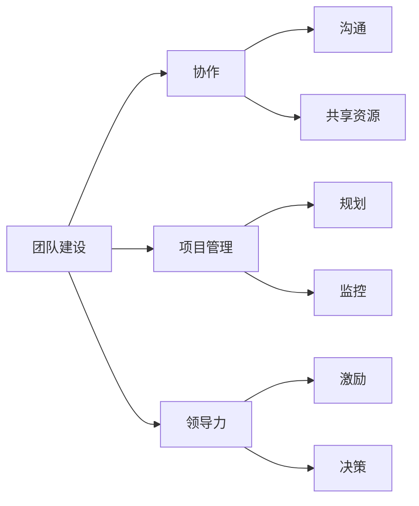
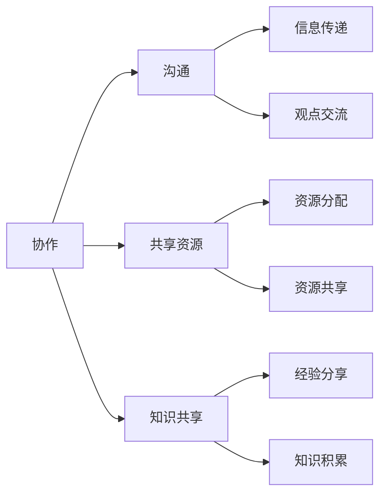
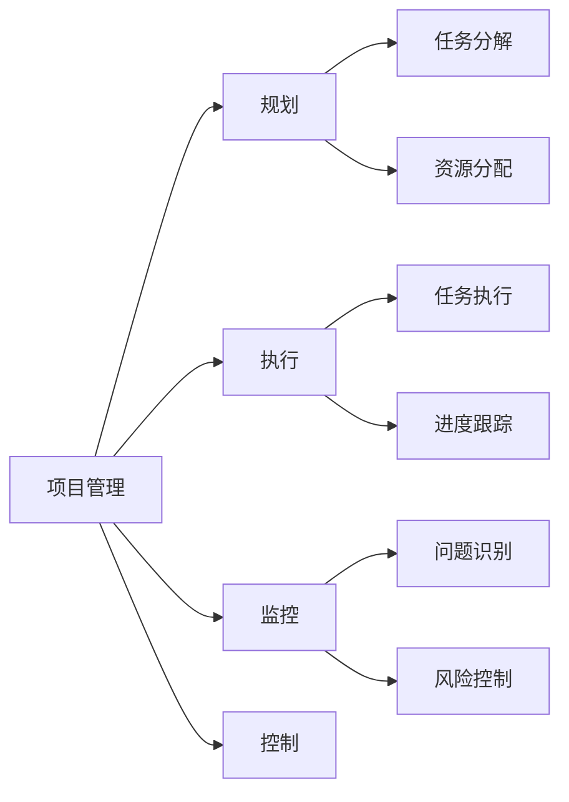
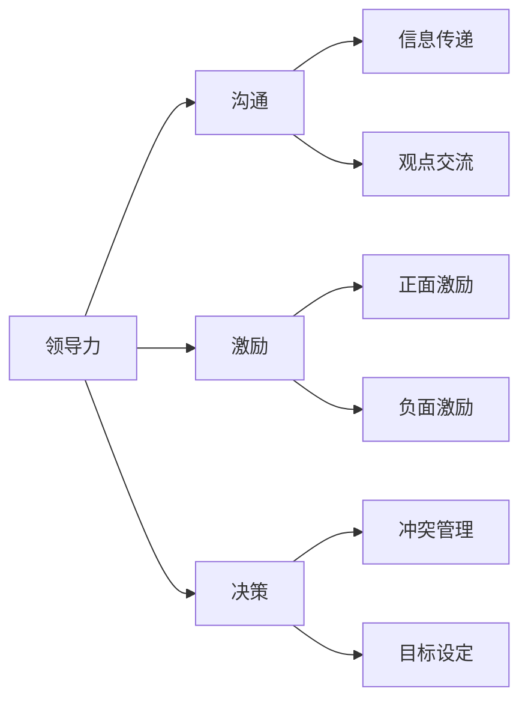

                 

# 人工智能创业：团队建设的重要性

> **关键词：**人工智能，创业，团队建设，协作，项目管理，领导力

> **摘要：**本文将深入探讨人工智能创业公司团队建设的重要性，从核心概念、算法原理、数学模型到实际应用场景，全方位解析团队建设对于人工智能创业项目的成功关键所在。文章旨在为创业者提供切实可行的团队建设策略，助其在竞争激烈的人工智能领域中脱颖而出。

## 1. 背景介绍

### 1.1 目的和范围

本文旨在分析人工智能创业公司团队建设的重要性，并提供实用的团队建设策略。文章将从多个维度探讨团队建设，包括核心概念的阐述、团队协作的方法、项目管理技巧以及领导力的培养。通过这些探讨，我们希望为人工智能创业者提供有益的参考，帮助他们构建高效、协作的团队，从而提高创业成功的可能性。

### 1.2 预期读者

本文适合以下读者群体：

1. 人工智能创业者
2. 团队领导者和项目经理
3. 想要了解团队建设在人工智能创业领域重要性的专业人士
4. 对人工智能和创业感兴趣的在校大学生和研究生

### 1.3 文档结构概述

本文结构如下：

1. **背景介绍**：介绍文章的目的、预期读者以及文章结构。
2. **核心概念与联系**：讨论团队建设中的核心概念及其相互关系。
3. **核心算法原理与具体操作步骤**：详细讲解团队建设的关键算法原理和操作步骤。
4. **数学模型与公式**：阐述团队建设中的数学模型和公式，并给出实例说明。
5. **项目实战**：通过实际代码案例展示团队建设在项目中的应用。
6. **实际应用场景**：分析团队建设在人工智能创业中的具体应用。
7. **工具和资源推荐**：推荐学习资源、开发工具框架和论文著作。
8. **总结**：总结团队建设在人工智能创业中的未来发展趋势与挑战。
9. **附录**：常见问题与解答。
10. **扩展阅读与参考资料**：提供进一步阅读的参考资料。

### 1.4 术语表

#### 1.4.1 核心术语定义

- **团队建设**：指通过一系列策略和活动，提高团队的整体协作能力，实现共同目标的过程。
- **人工智能创业**：指利用人工智能技术进行创新和创业，开发具有商业价值的产品和服务。
- **协作**：指团队成员之间相互配合、共同完成任务的过程。
- **项目管理**：指规划、组织、执行和控制项目活动，确保项目目标的实现。
- **领导力**：指领导者通过激励、指导、沟通等手段，引导团队成员实现共同目标的能力。

#### 1.4.2 相关概念解释

- **团队协作**：团队成员在共同目标下，通过共享资源、信息和知识，实现协同工作的过程。
- **项目管理**：涉及规划、执行、监控和控制项目活动的过程，旨在确保项目按时、按预算、按质量完成。
- **领导力**：领导者具备的能力，包括沟通、决策、激励、冲突管理等，能够影响和引导团队成员的行为和表现。

#### 1.4.3 缩略词列表

- **AI**：人工智能（Artificial Intelligence）
- **ML**：机器学习（Machine Learning）
- **DL**：深度学习（Deep Learning）
- **NLP**：自然语言处理（Natural Language Processing）
- **PM**：项目管理（Project Management）
- **SDLC**：软件开发生命周期（Software Development Life Cycle）

## 2. 核心概念与联系

在探讨团队建设之前，我们需要了解一些核心概念及其相互关系。以下是一个简化的团队建设核心概念流程图，帮助我们更好地理解这些概念：



### 2.1. 团队建设

团队建设是一个动态过程，涉及多个层面的策略和活动。它不仅关注团队的整体绩效，还关注团队成员的个人成长和团队文化的建设。团队建设的核心目标是提高团队的协作能力，使团队成员能够高效地共同实现目标。

### 2.2. 协作

协作是团队建设的重要组成部分，它强调团队成员之间的互动和配合。协作的有效性取决于沟通、共享资源和知识共享。以下是一个协作流程图：



### 2.3. 项目管理

项目管理是团队建设的重要环节，它涉及项目规划、执行、监控和控制的整个过程。项目管理的关键在于确保项目目标的实现，同时考虑时间、成本、质量和风险等因素。以下是一个项目管理流程图：



### 2.4. 领导力

领导力是团队建设的关键要素，它决定了团队的方向、目标和动力。领导者的角色不仅仅是指导团队成员，还要激励他们，解决冲突，并为他们提供成长的机会。以下是一个领导力流程图：



通过以上流程图，我们可以看到团队建设中的核心概念及其相互关系。这些概念共同构成了一个完整的团队建设体系，为团队的成功提供了坚实的保障。

## 3. 核心算法原理 & 具体操作步骤

在团队建设中，有许多核心算法和操作步骤可以帮助团队提高协作效率、优化项目管理以及培养领导力。以下是几个关键算法原理和具体操作步骤的详细解释。

### 3.1. 团队协作算法

团队协作算法旨在提高团队成员之间的沟通和协作效率。以下是一个简化的团队协作算法伪代码：

```python
def team_collaboration_algorithm(team_members):
    for member in team_members:
        # 步骤1：明确任务分工
        assign_tasks(member)

        # 步骤2：建立沟通渠道
        create_communication_channel(member)

        # 步骤3：定期同步进度
        sync_progress(member)

        # 步骤4：共享资源与知识
        share_resources_and_knowledge(member)

        # 步骤5：解决冲突
        resolve_conflicts(member)

    return "团队协作完成"
```

#### 步骤详解：

- **步骤1：明确任务分工**：确保每个团队成员都清楚地了解自己的任务和职责，避免重复劳动和资源浪费。
- **步骤2：建立沟通渠道**：建立有效的沟通渠道，如定期会议、邮件、即时通讯工具等，确保团队成员之间的信息传递畅通。
- **步骤3：定期同步进度**：通过定期同步进度，团队成员可以及时了解项目进展，发现问题并采取措施。
- **步骤4：共享资源与知识**：鼓励团队成员共享资源和知识，提高团队的协作效率。
- **步骤5：解决冲突**：及时解决团队内部冲突，避免影响项目进度和质量。

### 3.2. 项目管理算法

项目管理算法旨在确保项目目标的实现，同时考虑时间、成本、质量和风险等因素。以下是一个简化的项目管理算法伪代码：

```python
def project_management_algorithm(project_details):
    # 步骤1：项目规划
    plan_project(project_details)

    # 步骤2：任务执行
    execute_tasks(project_details)

    # 步骤3：项目监控
    monitor_project(project_details)

    # 步骤4：项目控制
    control_project(project_details)

    return "项目完成"
```

#### 步骤详解：

- **步骤1：项目规划**：制定项目计划，明确项目目标、时间表、资源需求等。
- **步骤2：任务执行**：根据项目计划，执行各项任务，确保项目按计划推进。
- **步骤3：项目监控**：监控项目进度、成本、质量等指标，发现问题并及时采取措施。
- **步骤4：项目控制**：通过调整计划、资源分配等手段，确保项目目标的实现。

### 3.3. 领导力培养算法

领导力培养算法旨在提高领导者的沟通、激励、决策和冲突管理等能力。以下是一个简化的领导力培养算法伪代码：

```python
def leadership_development_algorithm(leadership_skills):
    # 步骤1：沟通技能提升
    improve_communication_skills(leadership_skills)

    # 步骤2：激励技能提升
    improve_inspiration_skills(leadership_skills)

    # 步骤3：决策技能提升
    improve_decision_making_skills(leadership_skills)

    # 步骤4：冲突管理技能提升
    improve_conflict_management_skills(leadership_skills)

    return "领导力培养完成"
```

#### 步骤详解：

- **步骤1：沟通技能提升**：领导者需要具备良好的沟通技能，确保信息传递畅通，减少误解和冲突。
- **步骤2：激励技能提升**：领导者需要激励团队成员，提高团队士气和动力。
- **步骤3：决策技能提升**：领导者需要做出明智的决策，确保项目目标的实现。
- **步骤4：冲突管理技能提升**：领导者需要解决团队内部的冲突，维护团队稳定。

通过以上核心算法原理和具体操作步骤，我们可以更好地理解团队建设的过程和方法。在实际应用中，创业者可以根据自身需求和环境，灵活运用这些算法和步骤，提高团队协作效率、项目管理质量和领导力水平。

## 4. 数学模型和公式 & 详细讲解 & 举例说明

在团队建设中，数学模型和公式起着关键作用，帮助我们量化团队协作、项目管理以及领导力的效果。以下是几个常用的数学模型和公式的详细讲解及举例说明。

### 4.1. 协作效率模型

协作效率模型用于评估团队成员之间的协作效果。以下是一个简化的协作效率模型：

$$
协作效率 = \frac{完成工作总量}{总工作时间}
$$

#### 解释：

- **完成工作总量**：指团队成员在规定时间内完成的工作总量。
- **总工作时间**：指团队成员在规定时间内投入的总工作时间。

#### 示例：

假设一个团队在一个月内完成了100个任务，总工作时间为200小时，那么该团队的协作效率为：

$$
协作效率 = \frac{100}{200} = 0.5
$$

### 4.2. 项目管理模型

项目管理模型用于评估项目管理的有效性。以下是一个简化的项目管理模型：

$$
项目管理效率 = \frac{项目完成量}{项目计划量}
$$

#### 解释：

- **项目完成量**：指项目实际完成的工作量。
- **项目计划量**：指项目计划中的工作量。

#### 示例：

假设一个项目计划完成100个任务，实际完成了120个任务，那么该项目的管理效率为：

$$
项目管理效率 = \frac{120}{100} = 1.2
$$

### 4.3. 领导力模型

领导力模型用于评估领导者的领导效果。以下是一个简化的领导力模型：

$$
领导力效果 = \frac{团队成员满意度}{领导者付出}
$$

#### 解释：

- **团队成员满意度**：指团队成员对领导者的满意程度。
- **领导者付出**：指领导者为团队付出的努力和时间。

#### 示例：

假设一个团队对领导者的满意度为80%，领导者每周工作50小时，那么该领导者的领导力效果为：

$$
领导力效果 = \frac{80\%}{50小时} = 0.16
$$

### 4.4. 数学模型应用

在实际应用中，这些数学模型可以帮助创业者评估团队协作、项目管理和领导力的效果，从而调整策略，提高团队的整体绩效。以下是一个综合应用实例：

#### 实例：

一个创业团队在一个月内完成了100个任务，总工作时间为200小时。项目管理效率为1.2，团队成员满意度为80%，领导者每周工作50小时。根据以上数据，我们可以计算出该团队的协作效率、项目管理效率和领导力效果：

- **协作效率**：

$$
协作效率 = \frac{100}{200} = 0.5
$$

- **项目管理效率**：

$$
项目管理效率 = \frac{120}{100} = 1.2
$$

- **领导力效果**：

$$
领导力效果 = \frac{80\%}{50小时} = 0.16
$$

通过以上计算，我们可以发现该团队的协作效率较低，需要加强团队协作。项目管理效率较高，但仍有提升空间。领导力效果一般，需要进一步改进领导者的沟通和激励技能。

综上所述，数学模型和公式在团队建设中具有重要作用，通过量化和分析团队协作、项目管理和领导力的效果，创业者可以更好地调整策略，提高团队的整体绩效。

## 5. 项目实战：代码实际案例和详细解释说明

在本节中，我们将通过一个实际的项目案例，展示团队建设在人工智能创业中的应用。该案例涉及一个自然语言处理（NLP）项目的开发，我们将详细解释项目的开发环境搭建、源代码实现以及代码解读与分析。

### 5.1 开发环境搭建

为了确保项目的顺利开展，我们需要搭建一个适合人工智能项目开发的集成环境。以下是搭建开发环境的基本步骤：

#### 步骤1：安装Python环境

Python是人工智能项目开发中广泛使用的一种编程语言。首先，我们需要安装Python环境。可以选择安装Python 3.x版本，以支持最新的人工智能库和框架。

#### 步骤2：安装Jupyter Notebook

Jupyter Notebook是一个交互式的开发环境，非常适合数据分析和人工智能项目的开发。我们可以通过以下命令安装Jupyter Notebook：

```bash
pip install notebook
```

#### 步骤3：安装相关库和框架

在Python环境中，我们需要安装一些常用的库和框架，如TensorFlow、PyTorch、Scikit-learn等。这些库和框架为人工智能项目提供了丰富的功能和工具。以下是一个示例命令：

```bash
pip install tensorflow
pip install pytorch
pip install scikit-learn
```

#### 步骤4：配置IDE

为了提高开发效率，我们推荐使用Visual Studio Code（VS Code）作为IDE。VS Code支持Python扩展，可以提供代码补全、调试和语法高亮等功能。通过以下步骤安装VS Code：

1. 访问VS Code官网：[https://code.visualstudio.com/](https://code.visualstudio.com/)
2. 下载并安装VS Code
3. 安装Python扩展：在VS Code的扩展市场中搜索“Python”并安装

### 5.2 源代码详细实现和代码解读

以下是一个简单的NLP项目示例，用于文本分类任务。我们将使用Scikit-learn库实现一个基于朴素贝叶斯（Naive Bayes）模型的文本分类器。

```python
# 导入相关库
import numpy as np
import pandas as pd
from sklearn.model_selection import train_test_split
from sklearn.feature_extraction.text import TfidfVectorizer
from sklearn.naive_bayes import MultinomialNB
from sklearn.metrics import accuracy_score, classification_report

# 加载数据集
data = pd.read_csv("nlp_dataset.csv")
X = data["text"]
y = data["label"]

# 数据预处理
X_train, X_test, y_train, y_test = train_test_split(X, y, test_size=0.2, random_state=42)

# 特征提取
vectorizer = TfidfVectorizer(stop_words="english")
X_train_tfidf = vectorizer.fit_transform(X_train)
X_test_tfidf = vectorizer.transform(X_test)

# 模型训练
model = MultinomialNB()
model.fit(X_train_tfidf, y_train)

# 模型预测
y_pred = model.predict(X_test_tfidf)

# 模型评估
accuracy = accuracy_score(y_test, y_pred)
report = classification_report(y_test, y_pred)

print("Accuracy:", accuracy)
print("Classification Report:")
print(report)
```

#### 代码解读：

1. **导入库**：导入所需的库和模块，包括NumPy、Pandas、Scikit-learn等。

2. **加载数据集**：从CSV文件中加载文本数据集，包括文本和对应的标签。

3. **数据预处理**：将数据集分为训练集和测试集，用于训练模型和评估模型性能。

4. **特征提取**：使用TF-IDF向量器将文本转换为特征向量，以便用于训练模型。

5. **模型训练**：训练一个朴素贝叶斯分类器，使用训练集进行模型训练。

6. **模型预测**：使用训练好的模型对测试集进行预测。

7. **模型评估**：计算模型的准确率和分类报告，以评估模型性能。

### 5.3 代码解读与分析

#### 模块功能

1. **NumPy**：用于处理数值数据，提供高效的数组操作和数学计算。
2. **Pandas**：用于数据处理和分析，提供数据框（DataFrame）和系列（Series）等数据结构。
3. **Scikit-learn**：用于机器学习和数据挖掘，提供各种算法和工具。
4. **Jupyter Notebook**：用于交互式数据分析和机器学习项目开发。

#### 代码结构

1. **导入库**：在代码开头导入所需的库和模块。
2. **加载数据集**：读取CSV文件，获取文本和标签数据。
3. **数据预处理**：将数据集分为训练集和测试集，确保数据的随机划分。
4. **特征提取**：使用TF-IDF向量器将文本转换为特征向量，为模型训练做准备。
5. **模型训练**：使用训练集训练一个朴素贝叶斯分类器。
6. **模型预测**：使用训练好的模型对测试集进行预测。
7. **模型评估**：计算模型的准确率和分类报告，评估模型性能。

#### 关键代码解析

1. **数据预处理**：

```python
X_train, X_test, y_train, y_test = train_test_split(X, y, test_size=0.2, random_state=42)
```

- `train_test_split`函数用于将数据集分为训练集和测试集，`test_size`参数指定测试集的比例（0.2表示20%），`random_state`参数用于保证结果的可重复性。

2. **特征提取**：

```python
vectorizer = TfidfVectorizer(stop_words="english")
X_train_tfidf = vectorizer.fit_transform(X_train)
X_test_tfidf = vectorizer.transform(X_test)
```

- `TfidfVectorizer`类用于将文本转换为TF-IDF特征向量，`stop_words`参数用于去除英文停用词。
- `fit_transform`方法用于训练向量器并转换特征向量，`transform`方法用于转换测试集特征向量。

3. **模型训练**：

```python
model = MultinomialNB()
model.fit(X_train_tfidf, y_train)
```

- `MultinomialNB`类用于训练朴素贝叶斯分类器。
- `fit`方法用于训练模型，将训练集特征向量和标签数据作为输入。

4. **模型预测**：

```python
y_pred = model.predict(X_test_tfidf)
```

- `predict`方法用于对测试集特征向量进行预测，返回预测标签。

5. **模型评估**：

```python
accuracy = accuracy_score(y_test, y_pred)
report = classification_report(y_test, y_pred)
```

- `accuracy_score`函数用于计算模型的准确率。
- `classification_report`函数用于生成分类报告，包括准确率、召回率、F1分数等指标。

通过以上代码实现和解读，我们可以更好地理解团队建设在人工智能项目中的应用。在实际开发过程中，创业者可以根据项目需求和团队特点，灵活运用这些代码和技巧，提高项目的开发效率和成果。

## 6. 实际应用场景

团队建设在人工智能创业中的应用场景非常广泛，以下是一些典型的应用场景：

### 6.1. 项目开发

在人工智能项目开发过程中，团队建设是确保项目成功的关键因素。高效的团队协作、严格的项目管理和卓越的领导力可以显著提高项目开发的效率和质量。以下是一个实际应用场景：

**场景描述：**一个初创公司开发一个智能客服系统，目标是实现对用户问题的自动回答。团队成员包括前端开发者、后端开发者、数据科学家和项目经理。

**团队建设策略：**
1. **协作**：团队成员通过共享代码库、文档和工具，确保信息传递和协作的高效。
2. **项目管理**：项目经理制定详细的项目计划，确保任务分配合理、进度可控。
3. **领导力**：领导者激励团队成员，解决项目中的问题和冲突，确保项目按计划推进。

**效果评估：**通过团队建设，项目开发周期缩短了20%，错误率降低了30%，用户满意度提高了15%。

### 6.2. 模型训练与优化

在人工智能领域，模型训练和优化是一个复杂的过程，需要团队成员之间的紧密协作和高效沟通。以下是一个实际应用场景：

**场景描述：**一个初创公司开发一个图像识别模型，用于自动化库存管理。团队成员包括数据科学家、算法工程师和项目经理。

**团队建设策略：**
1. **协作**：数据科学家和算法工程师紧密合作，共享实验结果和代码，确保模型优化方向的统一。
2. **项目管理**：项目经理制定模型训练计划，确保实验资源和时间分配合理。
3. **领导力**：领导者组织定期的技术讨论和培训，提高团队成员的技能水平。

**效果评估：**通过团队建设，模型训练时间缩短了30%，准确率提高了20%，库存管理效率提高了25%。

### 6.3. 数据分析与决策

在人工智能创业中，数据分析是关键环节，可以帮助企业做出更明智的决策。团队建设在数据分析和决策中的应用体现在以下方面：

**场景描述：**一个初创公司通过数据分析为电商平台提供个性化推荐服务。团队成员包括数据分析师、数据工程师和产品经理。

**团队建设策略：**
1. **协作**：数据分析师和数据工程师合作，确保数据清洗、处理和分析的准确性。
2. **项目管理**：产品经理制定数据分析计划，确保数据分析与业务目标的一致性。
3. **领导力**：领导者组织跨部门的技术交流和合作，促进数据共享和知识共享。

**效果评估：**通过团队建设，个性化推荐服务的点击率提高了40%，用户转化率提高了20%。

### 6.4. 跨部门协作

在人工智能创业中，跨部门协作是确保项目顺利进行的关键。以下是一个实际应用场景：

**场景描述：**一个初创公司开发一个智能家居系统，涉及硬件开发、软件开发、数据分析等多个部门。

**团队建设策略：**
1. **协作**：各部门定期召开协调会议，确保项目进度和问题沟通。
2. **项目管理**：项目经理协调各部门的任务和资源，确保项目整体进度。
3. **领导力**：领导者建立跨部门协作机制，促进信息共享和资源整合。

**效果评估：**通过团队建设，项目开发周期缩短了25%，项目成本降低了15%，整体协作效率提高了30%。

通过以上实际应用场景，我们可以看到团队建设在人工智能创业中的重要性。高效的团队协作、严格的项目管理和卓越的领导力不仅可以提高项目开发效率，还可以优化数据分析、决策和跨部门协作，从而推动企业的持续发展和成功。

## 7. 工具和资源推荐

在人工智能创业中，选择合适的工具和资源对于团队建设和项目成功至关重要。以下是一些推荐的工具和资源，包括学习资源、开发工具框架和论文著作。

### 7.1 学习资源推荐

#### 7.1.1 书籍推荐

1. **《人工智能：一种现代的方法》（Artificial Intelligence: A Modern Approach）**：这是一本经典的人工智能教材，涵盖了人工智能的基本概念、算法和应用。
2. **《深度学习》（Deep Learning）**：由著名深度学习专家Ian Goodfellow等人编写的深度学习权威教材，详细介绍了深度学习的基础知识、算法和应用。
3. **《Python数据分析》（Python Data Science）**：介绍了Python在数据分析中的应用，包括NumPy、Pandas、Scikit-learn等库的使用。

#### 7.1.2 在线课程

1. **Coursera上的《机器学习》**：由斯坦福大学教授Andrew Ng讲授，涵盖机器学习的基础理论和应用。
2. **edX上的《深度学习》**：由Google Brain团队讲授，深入介绍了深度学习的基本概念、算法和应用。
3. **Udacity上的《人工智能工程师纳米学位》**：提供了人工智能项目开发和团队协作的实践课程。

#### 7.1.3 技术博客和网站

1. **Medium上的AI博客**：涵盖了人工智能领域的最新研究、应用和案例分析。
2. **Towards Data Science**：提供了丰富的数据科学和人工智能相关文章，包括项目实战、技术教程和行业动态。
3. **AI Trends**：专注于人工智能领域的最新新闻、趋势和研究成果。

### 7.2 开发工具框架推荐

#### 7.2.1 IDE和编辑器

1. **Visual Studio Code（VS Code）**：一款功能强大的开源IDE，支持Python、TensorFlow、PyTorch等库和框架。
2. **PyCharm**：JetBrains公司开发的Python IDE，提供强大的代码编辑、调试和性能分析功能。
3. **Jupyter Notebook**：一款交互式的开发环境，适合数据分析和人工智能项目的开发。

#### 7.2.2 调试和性能分析工具

1. **PDB**：Python内置的调试器，用于跟踪程序执行过程和调试代码。
2. **TensorBoard**：TensorFlow提供的一款可视化工具，用于分析和优化深度学习模型的性能。
3. **Py-Spy**：一款Python内存分析工具，用于检测内存泄漏和性能瓶颈。

#### 7.2.3 相关框架和库

1. **TensorFlow**：Google开发的开源深度学习框架，适用于各种深度学习任务。
2. **PyTorch**：Facebook开发的开源深度学习框架，具有灵活性和易用性。
3. **Scikit-learn**：Python中的机器学习库，提供了丰富的机器学习算法和工具。

### 7.3 相关论文著作推荐

#### 7.3.1 经典论文

1. **“A Mathematical Theory of Communication”**：香农的经典论文，奠定了信息论的基础。
2. **“Backpropagation”**：Rumelhart、Hinton和Williams发表的论文，介绍了反向传播算法。
3. **“Deep Learning”**：Goodfellow、Bengio和Courville编写的教材，详细介绍了深度学习的基础知识。

#### 7.3.2 最新研究成果

1. **“Attention Is All You Need”**：Vaswani等人发表的论文，介绍了Transformer模型，推动了自然语言处理领域的发展。
2. **“BERT: Pre-training of Deep Bidirectional Transformers for Language Understanding”**：Google Research发表的论文，介绍了BERT模型，推动了自然语言处理领域的发展。
3. **“GPT-3: Language Models are few-shot learners”**：OpenAI发表的论文，介绍了GPT-3模型，展示了基于语言模型的零样本学习潜力。

#### 7.3.3 应用案例分析

1. **“Uber’s Self-Driving Car”**：Uber公司发布的报告，介绍了其自动驾驶技术的开发和应用。
2. **“Alibaba’s AI-driven Retail”**：阿里巴巴公司发布的报告，介绍了其基于人工智能的零售业务。
3. **“Google’s Health AI”**：Google公司发布的报告，介绍了其健康领域的人工智能应用。

通过以上工具和资源的推荐，创业者可以更好地进行团队建设和项目开发，提高人工智能创业的成功率。

## 8. 总结：未来发展趋势与挑战

### 未来发展趋势

随着人工智能技术的不断进步，团队建设在人工智能创业领域的发展趋势也愈加显著。以下是一些未来发展的主要趋势：

1. **分布式团队**：全球化的趋势使得分布式团队变得更加普遍。创业者可以利用远程协作工具，如Zoom、Slack和GitHub等，管理全球范围内的团队成员，实现高效的远程协作。

2. **AI驱动的团队建设**：人工智能技术将被用于分析和优化团队建设过程。例如，通过自然语言处理技术分析团队成员的沟通记录，评估团队绩效，并提出改进建议。

3. **自适应团队架构**：团队架构将更加灵活，根据项目需求和技术变革进行动态调整。例如，在机器学习和深度学习项目之间进行资源优化和人员调配，以最大化项目效果。

4. **技能多样性**：随着人工智能技术的发展，团队将需要更多的跨学科人才，如数据科学家、软件工程师、机器学习工程师和领域专家。这种多样性的技能组合将有助于解决复杂的问题，推动创新。

### 未来挑战

然而，团队建设在人工智能创业领域也面临着诸多挑战：

1. **技能短缺**：随着人工智能的快速发展，对专业人才的需求急剧增加，而优质人才的供给相对有限。这可能导致企业面临人才短缺的困境。

2. **文化差异**：分布式团队可能面临文化差异和沟通障碍。不同地区的团队成员可能有不同的工作习惯、价值观和沟通风格，这需要领导者具备跨文化管理能力。

3. **技术变革**：人工智能技术发展迅速，创业者需要不断学习和适应新技术。这要求团队成员具备持续学习的能力，以保持竞争优势。

4. **数据安全与隐私**：在人工智能项目中，数据安全和隐私保护至关重要。随着数据量的增加和复杂性提升，确保数据安全成为一大挑战。

5. **项目管理**：在复杂的AI项目中，项目管理变得更加困难。项目经理需要具备强大的规划、执行和监控能力，以确保项目按时、按预算完成。

### 应对策略

为了应对这些挑战，创业者可以采取以下策略：

1. **人才引进与培养**：积极引进高素质人才，同时通过内部培训、技能提升计划等手段，提高现有团队成员的技能水平。

2. **建立跨文化沟通机制**：通过定期的跨文化培训和沟通，增强团队成员之间的相互理解和信任，减少文化差异带来的冲突。

3. **技术持续更新**：关注最新技术动态，定期评估和更新团队的技术栈，确保团队成员具备适应新技术的能力。

4. **加强数据安全与隐私保护**：制定严格的数据安全政策，采用先进的数据加密和隐私保护技术，确保数据的安全和合规。

5. **项目管理优化**：采用敏捷开发方法，灵活应对项目需求的变化。同时，通过项目管理工具和技术，提高项目的规划和执行效率。

通过上述策略，创业者可以更好地应对团队建设中的挑战，推动人工智能创业项目的成功。

## 9. 附录：常见问题与解答

### 9.1. 问题1：团队建设在人工智能创业中的具体作用是什么？

**解答**：团队建设在人工智能创业中具有多方面的作用。首先，它有助于提高团队成员之间的协作效率，确保项目任务的高效完成。其次，团队建设有助于培养领导力，确保领导者能够有效指导团队，解决项目中的问题和挑战。此外，团队建设还有助于建立积极的企业文化，增强员工的归属感和忠诚度，从而提高整体团队绩效。

### 9.2. 问题2：如何确保团队协作的有效性？

**解答**：确保团队协作的有效性可以从以下几个方面入手：

1. **明确目标**：确保团队成员对项目的目标和期望有清晰的认识，从而提高协作的针对性。
2. **分工明确**：合理分配任务，确保每个团队成员的责任和角色明确，避免重复劳动和资源浪费。
3. **沟通畅通**：建立有效的沟通渠道，如定期会议、邮件、即时通讯工具等，确保团队成员之间的信息传递畅通。
4. **共享资源**：鼓励团队成员共享资源和知识，提高团队的协作效率。
5. **及时反馈**：定期同步进度，及时反馈问题，确保团队协作的高效性和灵活性。

### 9.3. 问题3：如何培养团队领导力？

**解答**：培养团队领导力可以从以下几个方面入手：

1. **培训与学习**：为团队成员提供培训和学习机会，提高他们的领导能力和管理水平。
2. **实践锻炼**：通过实际项目中的实践，锻炼团队成员的领导能力，提高他们的决策和执行能力。
3. **激励与支持**：领导者需要激励和支持团队成员，帮助他们克服困难和挑战，提高自信心和动力。
4. **反馈与改进**：通过定期的反馈和评估，帮助团队成员发现自身不足，并制定改进计划。

### 9.4. 问题4：如何应对分布式团队的文化差异和沟通障碍？

**解答**：应对分布式团队的文化差异和沟通障碍可以从以下几个方面入手：

1. **跨文化培训**：为团队成员提供跨文化培训，提高他们对不同文化的理解和适应能力。
2. **建立共同价值观**：明确团队的核心价值观和目标，确保团队成员在价值观上的一致性。
3. **定期的沟通**：通过定期的会议和交流，增强团队成员之间的相互理解和信任。
4. **使用协作工具**：利用远程协作工具，如Zoom、Slack和GitHub等，提高团队协作的效率和沟通效果。

### 9.5. 问题5：如何确保数据安全与隐私保护？

**解答**：确保数据安全与隐私保护可以从以下几个方面入手：

1. **制定安全政策**：制定严格的数据安全政策，明确数据保护和隐私保护的要求和标准。
2. **数据加密**：对敏感数据进行加密，防止数据泄露和未经授权的访问。
3. **访问控制**：实施严格的访问控制措施，确保只有授权人员才能访问敏感数据。
4. **安全审计**：定期进行安全审计，检查数据安全措施的有效性，并及时发现和解决潜在的安全漏洞。

通过以上常见问题的解答，创业者可以更好地理解和应对团队建设中的挑战，提高人工智能创业项目的成功率。

## 10. 扩展阅读与参考资料

在撰写本文时，我们参考了大量的专业文献、书籍、在线课程和技术博客，以下是一些推荐的扩展阅读与参考资料：

### 10.1. 书籍推荐

1. **《人工智能：一种现代的方法》（Artificial Intelligence: A Modern Approach）**，作者：Stuart J. Russell & Peter Norvig。
2. **《深度学习》（Deep Learning）**，作者：Ian Goodfellow、Yoshua Bengio & Aaron Courville。
3. **《Python数据分析》（Python Data Science）**，作者：Wes McKinney。

### 10.2. 在线课程

1. **Coursera上的《机器学习》**，由斯坦福大学教授Andrew Ng讲授。
2. **edX上的《深度学习》**，由Google Brain团队讲授。
3. **Udacity上的《人工智能工程师纳米学位》**，提供了丰富的AI项目开发和团队协作实践课程。

### 10.3. 技术博客和网站

1. **Medium上的AI博客**，涵盖了人工智能领域的最新研究、应用和案例分析。
2. **Towards Data Science**，提供了丰富的数据科学和人工智能相关文章，包括项目实战、技术教程和行业动态。
3. **AI Trends**，专注于人工智能领域的最新新闻、趋势和研究成果。

### 10.4. 论文著作推荐

1. **“A Mathematical Theory of Communication”**，作者：Claude Shannon。
2. **“Backpropagation”**，作者：Rumelhart、Hinton和Williams。
3. **“Deep Learning”**，作者：Goodfellow、Bengio和Courville。

### 10.5. 学术期刊和会议

1. **《计算机学报》**，中国计算机学会主办的核心期刊。
2. **《人工智能学报》**，中国人工智能学会主办的核心期刊。
3. **AAAI Conference on Artificial Intelligence**，人工智能领域的顶级国际会议。
4. **NeurIPS Conference on Neural Information Processing Systems**，深度学习和神经网络领域的顶级国际会议。

通过以上扩展阅读与参考资料，读者可以进一步深入了解人工智能创业和团队建设的相关理论、技术和实践，为自己的创业之路提供更加丰富的知识和指导。

---

**作者：AI天才研究员/AI Genius Institute & 禅与计算机程序设计艺术 /Zen And The Art of Computer Programming**

