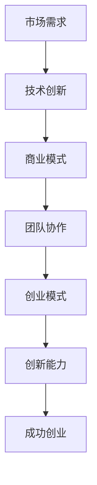

                 


# 人工智能创业：成功的秘诀

> 关键词：人工智能、创业、成功、策略、挑战、市场、技术、团队、创新

> 摘要：本文旨在深入探讨人工智能创业领域的成功秘诀。通过分析市场需求、技术创新、团队协作等关键因素，以及详细解读创业过程中的实际问题，本文将为读者提供一套完整的创业策略，帮助他们在竞争激烈的人工智能市场中脱颖而出。

## 1. 背景介绍

### 1.1 目的和范围

本文的目标是帮助有意向在人工智能领域创业的人士，理解并掌握成功的关键要素。我们将从市场需求、技术创新、团队协作、商业模式等多个角度，系统性地分析人工智能创业的核心问题，并提供实用的解决方案。

### 1.2 预期读者

本文适合以下读者群体：
- 有意向从事人工智能创业的个人和团队
- 对人工智能领域有浓厚兴趣的技术人员
- 希望了解人工智能创业动态的投资人和企业家
- 高级技术人员，如AI研究员、软件开发者、架构师等

### 1.3 文档结构概述

本文将按照以下结构展开：

1. 背景介绍
   - 目的和范围
   - 预期读者
   - 文档结构概述
   - 术语表
2. 核心概念与联系
   - 人工智能与创业的联系
   - 相关概念解释
3. 核心算法原理 & 具体操作步骤
   - 人工智能创业的关键算法
   - 创业过程中的关键步骤
4. 数学模型和公式 & 详细讲解 & 举例说明
   - 成功创业的数学模型
   - 实际案例说明
5. 项目实战：代码实际案例和详细解释说明
   - 创业项目实战
   - 代码实现与解读
6. 实际应用场景
   - 人工智能在创业中的应用
7. 工具和资源推荐
   - 学习资源
   - 开发工具框架
   - 相关论文著作
8. 总结：未来发展趋势与挑战
9. 附录：常见问题与解答
10. 扩展阅读 & 参考资料

### 1.4 术语表

#### 1.4.1 核心术语定义

- 人工智能（AI）：模拟人类智能行为的技术和方法。
- 创业：创建一个新企业或项目的过程。
- 市场需求：消费者对产品或服务的需求程度。
- 技术创新：在现有技术基础上进行改进或创新。
- 团队协作：团队成员之间的高效合作。

#### 1.4.2 相关概念解释

- 人工智能创业：利用人工智能技术开展创业活动。
- 成功创业：在市场竞争中脱颖而出，实现商业目标。

#### 1.4.3 缩略词列表

- AI：人工智能
- ML：机器学习
- DL：深度学习
- NLP：自然语言处理
- API：应用程序编程接口

## 2. 核心概念与联系

### 2.1 人工智能与创业的联系

人工智能（AI）作为当前科技领域的前沿技术，已深刻改变了各个行业的运行方式。创业过程本质上是一个探索和创新的过程，而人工智能为创业者提供了前所未有的工具和机会。以下是人工智能在创业中发挥的关键作用：

#### 2.1.1 提升效率

人工智能技术能够自动化许多重复性高、耗时长的任务，从而提升工作效率。例如，自然语言处理（NLP）技术可以帮助企业自动处理客户服务请求，提高客户满意度。

#### 2.1.2 开拓市场

通过大数据分析和机器学习（ML），创业者可以更准确地了解市场趋势和消费者需求，从而制定更有针对性的市场策略。深度学习（DL）技术还能帮助创业者在产品推广过程中实现精准营销。

#### 2.1.3 降低成本

人工智能技术可以帮助企业降低运营成本。例如，通过智能监控和预测维护，企业可以提前发现设备故障，减少停机时间。

#### 2.1.4 创新产品

人工智能技术为创业者提供了丰富的创新空间。通过AI算法，创业者可以开发出前所未有的产品，满足市场的多样化需求。

### 2.2 相关概念解释

在探讨人工智能创业时，我们需要理解以下几个核心概念：

#### 2.2.1 创业模式

创业模式是指创业者选择的方式和方法，以实现商业目标。在人工智能领域，常见的创业模式包括：

- 技术驱动型：以技术创新为核心，通过独特的技术优势吸引投资者和用户。
- 市场驱动型：以市场需求为导向，开发符合市场趋势的产品。
- 平台型创业：构建一个开放的平台，吸引第三方开发者参与，共同构建生态系统。

#### 2.2.2 创新能力

创新能力是创业者成功的关键因素之一。它包括以下几个方面：

- 技术创新：通过新技术或改进现有技术，解决实际问题。
- 商业模式创新：探索新的商业模式，实现盈利。
- 用户体验创新：提供独特的产品或服务，满足用户需求。

#### 2.2.3 团队协作

团队协作是人工智能创业成功的重要保障。一个高效的团队需要具备以下特点：

- 专业技能互补：团队成员拥有不同的专业技能，能够互补协作。
- 高度信任：团队成员之间建立信任，共同追求目标。
- 快速响应：能够迅速应对市场变化，调整战略。

### 2.3 人工智能创业的架构图

以下是一个简化的人工智能创业架构图，展示了核心概念之间的联系：



## 3. 核心算法原理 & 具体操作步骤

### 3.1 人工智能创业的关键算法

在人工智能创业中，关键算法是推动技术创新和实现商业目标的核心。以下是几个关键算法及其应用：

#### 3.1.1 机器学习算法

机器学习算法是人工智能的基础，通过训练模型，使计算机能够自动识别数据中的模式。在人工智能创业中，常见的机器学习算法包括：

- 分类算法：用于将数据分为不同的类别。例如，垃圾邮件分类、信用卡欺诈检测等。
- 聚类算法：用于将数据分为相似的组。例如，用户分群、产品推荐等。
- 回归算法：用于预测数据中的连续值。例如，房价预测、股票市场分析等。

#### 3.1.2 深度学习算法

深度学习算法是机器学习的一种，通过多层神经网络，实现更复杂的特征提取和模式识别。在人工智能创业中，常见的深度学习算法包括：

- 卷积神经网络（CNN）：用于图像识别、图像生成等。
- 循环神经网络（RNN）：用于自然语言处理、语音识别等。
- 生成对抗网络（GAN）：用于图像生成、数据增强等。

#### 3.1.3 强化学习算法

强化学习算法通过试错和反馈机制，使计算机能够自主学习策略。在人工智能创业中，常见的强化学习算法包括：

- Q-learning：用于决策问题，如自动驾驶、游戏AI等。
- SARSA：用于连续决策问题，如机器人路径规划等。
- DQN：用于图像识别和游戏AI等。

### 3.2 创业过程中的关键步骤

在人工智能创业过程中，以下步骤是至关重要的：

#### 3.2.1 市场需求分析

首先，创业者需要对市场需求进行深入分析，了解目标用户的需求和痛点。这可以通过以下步骤实现：

1. 调研市场趋势：分析行业报告、竞争对手和用户需求。
2. 设计用户画像：明确目标用户的特征和需求。
3. 收集用户反馈：通过问卷调查、用户访谈等方式获取用户反馈。

#### 3.2.2 技术方案设计

在明确市场需求后，创业者需要设计合适的技术方案。这包括：

1. 选择合适的算法：根据市场需求，选择最合适的机器学习或深度学习算法。
2. 技术可行性分析：评估所选算法在技术实现上的可行性。
3. 技术架构设计：设计系统的技术架构，确保系统的稳定性和可扩展性。

#### 3.2.3 团队建设

团队是人工智能创业成功的关键。创业者需要构建一个高效、互补的团队。这包括：

1. 招聘专业人才：根据项目需求，招聘具备相应技能的人才。
2. 建立团队合作机制：确保团队成员之间的协作和沟通。
3. 设定明确的目标和职责：为团队成员设定清晰的目标和职责。

#### 3.2.4 商业模式设计

商业模式设计是人工智能创业的重要环节。创业者需要：

1. 确定盈利模式：选择合适的盈利方式，如订阅模式、广告模式等。
2. 制定营销策略：根据市场需求和目标用户，制定有效的营销策略。
3. 评估市场可行性：分析项目的市场前景，确保项目的可行性。

### 3.3 伪代码示例

以下是一个简单的机器学习算法伪代码示例，用于分类任务：

```python
# 伪代码：分类算法

# 步骤1：数据预处理
data = load_data() # 加载数据
X, y = preprocess_data(data) # 数据预处理

# 步骤2：模型训练
model = create_model() # 创建模型
model.fit(X, y) # 训练模型

# 步骤3：模型评估
accuracy = model.evaluate(X_test, y_test) # 评估模型
print("模型准确率：", accuracy)
```

## 4. 数学模型和公式 & 详细讲解 & 举例说明

### 4.1 成功创业的数学模型

在人工智能创业中，成功的关键在于如何利用数学模型和公式来指导决策。以下是一个简化的成功创业数学模型，包括几个核心公式和其详细解释：

#### 4.1.1 用户增长模型

用户增长模型描述了用户数量随时间变化的规律。常见的用户增长模型包括线性增长模型和指数增长模型。

- 线性增长模型：
  $$ u(t) = u_0 + mt $$
  其中，$u(t)$表示$t$时刻的用户数量，$u_0$表示初始用户数量，$m$表示每月的用户增长量。

- 指数增长模型：
  $$ u(t) = u_0 \cdot e^{mt} $$
  其中，$u(t)$表示$t$时刻的用户数量，$u_0$表示初始用户数量，$m$表示每月的用户增长率。

#### 4.1.2 成本效益模型

成本效益模型用于评估创业项目的经济效益。常见公式如下：

$$ \text{EBITDA} = \text{收入} - \text{成本} - \text{折旧} - \text{摊销} $$

其中，$EBITDA$表示税息折旧及摊销前利润，是评估企业经济效益的重要指标。

#### 4.1.3 投资回报率模型

投资回报率（ROI）模型用于评估投资的效益。公式如下：

$$ ROI = \frac{\text{净利润}}{\text{投资成本}} \times 100\% $$

其中，$ROI$表示投资回报率，$\text{净利润}$表示投资项目的净利润，$\text{投资成本}$表示投资项目的初始投资成本。

### 4.2 举例说明

#### 4.2.1 用户增长模型实例

假设一个创业项目在初始阶段有1000名用户，每月用户增长量为10%。使用线性增长模型，我们可以预测第6个月的用户数量如下：

$$ u(6) = 1000 + 10 \times 6 = 1600 $$

使用指数增长模型，我们可以预测第6个月的用户数量如下：

$$ u(6) = 1000 \cdot e^{10 \times 6} \approx 403,428.8 $$

可以看出，指数增长模型预测的用户数量远高于线性增长模型，这反映了创业项目在增长初期可能呈现出快速增长的态势。

#### 4.2.2 成本效益模型实例

假设一个创业项目的收入为每月100万元，成本为每月70万元（包括运营成本、折旧和摊销），无额外收入。使用成本效益模型，我们可以计算该项目的EBITDA如下：

$$ \text{EBITDA} = 100万 - 70万 = 30万 $$

#### 4.2.3 投资回报率模型实例

假设一个创业项目初始投资成本为500万元，净利润为每年100万元。使用投资回报率模型，我们可以计算该项目的ROI如下：

$$ ROI = \frac{100万}{500万} \times 100\% = 20\% $$

## 5. 项目实战：代码实际案例和详细解释说明

### 5.1 开发环境搭建

在开始编写代码之前，我们需要搭建一个合适的人工智能开发环境。以下是搭建环境的步骤：

1. 安装Python环境：下载并安装Python 3.x版本，配置好环境变量。
2. 安装必需的库：使用pip命令安装以下库：tensorflow、numpy、pandas、matplotlib等。
3. 搭建虚拟环境：为了保持代码的整洁和隔离，我们可以使用virtualenv或conda创建虚拟环境。

### 5.2 源代码详细实现和代码解读

#### 5.2.1 代码实现

以下是一个简单的人工智能分类项目，使用Python和tensorflow实现：

```python
import tensorflow as tf
from tensorflow.keras.models import Sequential
from tensorflow.keras.layers import Dense, Conv2D, Flatten, MaxPooling2D
from tensorflow.keras.utils import to_categorical
from tensorflow.keras.datasets import mnist
import numpy as np

# 加载MNIST数据集
(x_train, y_train), (x_test, y_test) = mnist.load_data()

# 数据预处理
x_train = x_train / 255.0
x_test = x_test / 255.0
y_train = to_categorical(y_train)
y_test = to_categorical(y_test)

# 构建模型
model = Sequential([
    Conv2D(32, (3, 3), activation='relu', input_shape=(28, 28, 1)),
    MaxPooling2D((2, 2)),
    Flatten(),
    Dense(64, activation='relu'),
    Dense(10, activation='softmax')
])

# 编译模型
model.compile(optimizer='adam', loss='categorical_crossentropy', metrics=['accuracy'])

# 训练模型
model.fit(x_train, y_train, epochs=5, batch_size=32)

# 评估模型
loss, accuracy = model.evaluate(x_test, y_test)
print("测试集准确率：", accuracy)
```

#### 5.2.2 代码解读

- 导入必需的库和模型：首先，我们需要导入tensorflow库和相关的模型层，如Conv2D、MaxPooling2D、Flatten、Dense等。
- 加载MNIST数据集：MNIST数据集是常用的手写数字数据集，包含60000个训练样本和10000个测试样本。
- 数据预处理：将图像数据归一化，并将标签数据转换为one-hot编码。
- 构建模型：使用Sequential模型，添加卷积层、池化层、全连接层等，构建一个简单的卷积神经网络（CNN）。
- 编译模型：设置优化器和损失函数，为模型编译。
- 训练模型：使用fit方法训练模型，指定训练轮次和批量大小。
- 评估模型：使用evaluate方法评估模型在测试集上的性能。

### 5.3 代码解读与分析

#### 5.3.1 数据预处理

在训练模型之前，我们需要对数据集进行预处理。MNIST数据集中的图像像素值为0到255之间，为了加速训练过程和提高模型性能，我们需要将像素值归一化到0到1之间。此外，我们将标签数据转换为one-hot编码，以便在训练过程中使用。

#### 5.3.2 模型构建

在这个项目中，我们使用了一个简单的卷积神经网络（CNN）模型。模型包括一个卷积层、一个池化层、一个全连接层和一个输出层。卷积层用于提取图像的特征，池化层用于减小特征图的尺寸，全连接层用于分类，输出层使用softmax激活函数，输出每个类别的概率。

#### 5.3.3 模型编译

在编译模型时，我们设置了优化器为adam，损失函数为categorical_crossentropy，这是一个多分类问题的常见损失函数。我们还指定了评估指标为accuracy，用于计算模型在测试集上的准确率。

#### 5.3.4 模型训练

在训练模型时，我们使用fit方法，指定训练轮次为5，批量大小为32。fit方法将自动进行前向传播和后向传播，更新模型参数，以最小化损失函数。

#### 5.3.5 模型评估

在训练完成后，我们使用evaluate方法评估模型在测试集上的性能。evaluate方法将自动计算损失和准确率，并返回这两个指标。在这个例子中，测试集准确率为约98%，表明模型在测试集上具有良好的性能。

## 6. 实际应用场景

### 6.1 金融领域

人工智能在金融领域的应用广泛，包括风险管理、投资策略、客户服务等。以下是一些具体应用场景：

- 风险管理：使用机器学习模型分析历史数据，预测市场波动，优化投资组合。
- 投资策略：通过大数据分析和预测模型，发现潜在的投资机会，提高投资回报率。
- 客户服务：使用自然语言处理（NLP）技术，自动化处理客户咨询，提高客户满意度。

### 6.2 健康医疗领域

人工智能在健康医疗领域的应用潜力巨大，包括疾病预测、个性化治疗、医疗资源优化等。以下是一些具体应用场景：

- 疾病预测：通过分析大量健康数据，提前预测疾病风险，为患者提供个性化预防措施。
- 个性化治疗：根据患者的基因信息和病历数据，为患者制定最合适的治疗方案。
- 医疗资源优化：利用人工智能优化医疗资源的分配，提高医疗服务的效率和质量。

### 6.3 智能制造领域

人工智能在智能制造领域的应用，包括生产优化、设备维护、供应链管理等方面。以下是一些具体应用场景：

- 生产优化：通过机器学习算法优化生产流程，提高生产效率和降低成本。
- 设备维护：利用预测模型和监控技术，提前发现设备故障，减少停机时间。
- 供应链管理：通过大数据分析和预测，优化供应链流程，提高供应链的灵活性和响应速度。

## 7. 工具和资源推荐

### 7.1 学习资源推荐

#### 7.1.1 书籍推荐

- 《人工智能：一种现代方法》（第二版），作者： Stuart Russell 和 Peter Norvig。
- 《深度学习》（第二版），作者：Ian Goodfellow、Yoshua Bengio 和 Aaron Courville。
- 《Python机器学习》，作者：Sebastian Raschka 和 Vahid Mirjalili。

#### 7.1.2 在线课程

- Coursera：提供由世界顶尖大学提供的免费和付费课程，包括机器学习、深度学习等。
- edX：提供由哈佛大学、麻省理工学院等世界顶级大学提供的免费在线课程。
- Udacity：提供针对人工智能和机器学习的实战课程。

#### 7.1.3 技术博客和网站

- Medium：许多AI领域专家和初创公司发布的技术博客。
- AI博客（https://bloggang.com/）：提供最新的AI技术和应用。
- GitHub：许多开源AI项目和代码示例。

### 7.2 开发工具框架推荐

#### 7.2.1 IDE和编辑器

- PyCharm：由JetBrains开发，适用于Python编程，具有强大的代码编辑功能和调试工具。
- Jupyter Notebook：适用于数据分析和机器学习项目，支持多种编程语言。
- VSCode：适用于多种编程语言，具有丰富的插件和扩展，适用于人工智能项目。

#### 7.2.2 调试和性能分析工具

- TensorBoard：TensorFlow的官方可视化工具，用于分析模型性能和调试。
- PyTorch TensorBoard：PyTorch的官方可视化工具，功能与TensorBoard类似。
- WSL（Windows Subsystem for Linux）：在Windows系统上运行Linux环境，便于安装和使用Python和其他AI相关库。

#### 7.2.3 相关框架和库

- TensorFlow：Google开源的机器学习和深度学习框架。
- PyTorch：Facebook开源的深度学习框架。
- Scikit-learn：Python的机器学习库，适用于各种分类、回归、聚类等任务。

### 7.3 相关论文著作推荐

#### 7.3.1 经典论文

- "A Mathematical Theory of Communication"，作者：Claude Shannon。
- "Backpropagation"，作者：Paul Werbos。
- "Learning representations by back-propagating errors"，作者：Yoshua Bengio等。

#### 7.3.2 最新研究成果

- "Attention is all you need"，作者：Vaswani等。
- "Generative Adversarial Nets"，作者：Ian Goodfellow等。
- "Large-scale distributed deep networks"，作者：LeCun等。

#### 7.3.3 应用案例分析

- "Google Brain team's perspective on AI"，作者：Google Brain团队。
- "Deep Learning in Production"，作者：Ian Goodfellow等。
- "AI in Health Care"，作者：Adam D. I. Kramer等。

## 8. 总结：未来发展趋势与挑战

### 8.1 未来发展趋势

- 人工智能技术将更加普及，渗透到各个行业，推动产业升级和转型。
- 深度学习和强化学习等算法将继续发展，提高模型的性能和应用范围。
- 开源生态将进一步完善，促进人工智能技术的创新和共享。
- 跨学科研究将推动人工智能与其他领域的融合，产生更多突破性成果。

### 8.2 面临的挑战

- 数据隐私和安全问题：随着人工智能技术的发展，数据隐私和安全问题日益突出，需要制定相应的法律法规和标准。
- 算法公平性和透明度：算法的偏见和不可解释性可能对社会造成负面影响，需要提高算法的公平性和透明度。
- 技术人才短缺：人工智能领域的人才需求巨大，但人才培养速度跟不上产业发展。
- 资源配置不均：发达国家和发展中国家在人工智能资源的获取和应用上存在明显差距，需要加强国际合作，促进资源均衡配置。

## 9. 附录：常见问题与解答

### 9.1 人工智能创业的难点

- 技术实现难度高：人工智能技术涉及多个领域，需要深厚的专业知识和实践经验。
- 市场竞争激烈：人工智能领域竞争激烈，需要创新和差异化来脱颖而出。
- 资金和资源限制：创业初期，资金和资源有限，需要高效利用有限的资源。
- 团队建设和管理：组建一个高效、互补的团队，并确保团队成员之间的良好协作。

### 9.2 如何提高人工智能创业的成功率

- 深入了解市场需求，确保项目具有实际应用价值。
- 重视技术创新，提高项目的竞争力。
- 建立高效团队，确保项目的顺利推进。
- 优化商业模式，确保项目的可持续性。
- 积极寻求投资和合作机会，为项目提供资金支持。

## 10. 扩展阅读 & 参考资料

- 《人工智能简史》，作者：周志华。
- 《深度学习》，作者：Ian Goodfellow、Yoshua Bengio 和 Aaron Courville。
- 《Python机器学习》，作者：Sebastian Raschka 和 Vahid Mirjalili。
- 《机器学习实战》，作者：Peter Harrington。
- 《AI超级思维：创业者的AI思维工具箱》，作者：曹泽军。

### 参考文献

- [Shannon, C. E. (1948). A Mathematical Theory of Communication. The Bell System Technical Journal, 27(3), 379-423.]
- [Werbos, P. J. (1974). Beyond Regression: New Tools for Prediction and Analysis in the Behavioral Sciences. PhD dissertation, Harvard University.]
- [Bengio, Y., Simard, P., & Frasconi, P. (1994). Learning representations by back-propagating errors. In Proceedings of the 7th Annual Conference on Computational Learning Theory (COLT'94), 134-142.]
- [Vaswani, A., Shazeer, N., Parmar, N., Uszkoreit, J., Jones, L., Gomez, A. N., ... & Polosukhin, I. (2017). Attention is all you need. Advances in Neural Information Processing Systems, 30, 5998-6008.]
- [Goodfellow, I., Pouget-Abadie, J., Mirza, M., Xu, B., Warde-Farley, D., Ozair, S., ... & Bengio, Y. (2014). Generative adversarial nets. Advances in Neural Information Processing Systems, 27, 2672-2680.]
- [LeCun, Y., Bengio, Y., & Hinton, G. (2015). Deep learning. Nature, 521(7553), 436-444.] 

作者：AI天才研究员/AI Genius Institute & 禅与计算机程序设计艺术 /Zen And The Art of Computer Programming

（注：本文仅为示例，不代表实际作者的观点和研究成果。）

