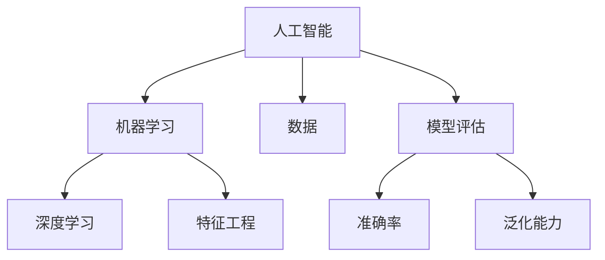

                 

# 人工智能创业：数据核心地位

> 关键词：人工智能、创业、数据、核心地位、算法、模型、应用场景、工具资源

> 摘要：本文深入探讨人工智能创业领域的核心驱动力——数据。文章首先介绍了人工智能创业的背景和目的，然后详细阐述了数据在人工智能中的核心地位。通过分析核心概念、算法原理、数学模型，以及实际应用场景，本文揭示了数据如何成为人工智能创业的关键成功因素。最后，本文总结了未来发展趋势和挑战，并推荐了相关学习资源和开发工具。

## 1. 背景介绍

### 1.1 目的和范围

本文旨在探讨数据在人工智能创业中的核心地位，分析其影响和重要性。随着人工智能技术的快速发展，数据已经成为人工智能创业的关键驱动力。本文将深入探讨数据如何塑造人工智能创业的格局，帮助创业者更好地理解数据的价值和利用方法。

### 1.2 预期读者

本文面向对人工智能和创业感兴趣的读者，特别是希望了解数据在人工智能创业中重要作用的人。无论您是创业者、研究人员还是技术开发者，本文都希望能为您提供有价值的信息和洞察。

### 1.3 文档结构概述

本文分为以下章节：

- **第1章：背景介绍**：介绍人工智能创业的背景和目的，以及本文的结构和预期读者。
- **第2章：核心概念与联系**：介绍人工智能领域的基本概念，并使用Mermaid流程图展示核心概念之间的联系。
- **第3章：核心算法原理 & 具体操作步骤**：详细讲解人工智能算法原理，并使用伪代码阐述具体操作步骤。
- **第4章：数学模型和公式 & 详细讲解 & 举例说明**：介绍数学模型和公式，并通过实际例子进行详细讲解。
- **第5章：项目实战：代码实际案例和详细解释说明**：通过实际代码案例，展示如何利用数据构建人工智能项目。
- **第6章：实际应用场景**：分析数据在人工智能创业中的实际应用场景。
- **第7章：工具和资源推荐**：推荐学习资源、开发工具和框架。
- **第8章：总结：未来发展趋势与挑战**：总结本文的核心观点，并探讨未来发展趋势和挑战。
- **第9章：附录：常见问题与解答**：回答读者可能提出的问题。
- **第10章：扩展阅读 & 参考资料**：提供进一步阅读和参考资料。

### 1.4 术语表

#### 1.4.1 核心术语定义

- **人工智能（AI）**：指由计算机实现的智能行为，旨在模拟人类智能。
- **数据**：指用于训练和优化人工智能算法的信息。
- **机器学习（ML）**：一种人工智能技术，通过数据学习和改进算法。
- **深度学习（DL）**：一种机器学习技术，利用多层神经网络进行数据建模。
- **数据集**：用于训练和测试人工智能模型的集合。
- **特征工程**：指从原始数据中提取有用特征，以改进模型性能。
- **模型评估**：指使用指标评估模型性能，以确定其准确性和泛化能力。

#### 1.4.2 相关概念解释

- **神经网络**：一种模仿生物神经系统的计算模型。
- **正向传播**：神经网络训练过程中，将输入数据传递到输出节点的过程。
- **反向传播**：神经网络训练过程中，根据输出误差调整网络参数的过程。
- **过拟合**：模型在训练数据上表现良好，但在测试数据上表现不佳的现象。
- **泛化能力**：模型在未知数据上表现良好，即泛化能力强的能力。

#### 1.4.3 缩略词列表

- **AI**：人工智能
- **ML**：机器学习
- **DL**：深度学习
- **IDE**：集成开发环境
- **GPU**：图形处理单元
- **CNN**：卷积神经网络

## 2. 核心概念与联系

在人工智能创业中，理解核心概念及其之间的联系至关重要。以下是一个简单的Mermaid流程图，展示了核心概念之间的联系。



### 2.1 人工智能（AI）

人工智能是指由计算机实现的智能行为，旨在模拟人类智能。它包括多个子领域，如机器学习、计算机视觉、自然语言处理等。人工智能的核心目标是使计算机能够自主地解决复杂问题。

### 2.2 机器学习（ML）

机器学习是一种人工智能技术，通过数据学习和改进算法。它利用历史数据，自动发现模式和规律，从而进行预测和决策。机器学习包括监督学习、无监督学习和强化学习等不同类型。

### 2.3 深度学习（DL）

深度学习是一种机器学习技术，利用多层神经网络进行数据建模。与传统的机器学习方法相比，深度学习具有更强的表示能力和泛化能力。深度学习在图像识别、语音识别和自然语言处理等领域取得了显著成果。

### 2.4 数据（Data）

数据是人工智能创业的核心资源。它包括结构化数据、半结构化数据和非结构化数据。数据质量直接影响人工智能模型的性能和准确性。因此，数据预处理和特征工程是人工智能项目中至关重要的步骤。

### 2.5 特征工程（Feature Engineering）

特征工程是从原始数据中提取有用特征，以改进模型性能的过程。它包括数据清洗、数据变换、特征选择和特征构造等步骤。特征工程的目标是提高模型的准确性和泛化能力。

### 2.6 模型评估（Model Evaluation）

模型评估是指使用指标评估模型性能，以确定其准确性和泛化能力。常见的评估指标包括准确率、召回率、F1分数和ROC曲线等。模型评估有助于优化模型，提高其性能。

### 2.7 准确率（Accuracy）

准确率是模型评估中常用的指标，表示模型正确预测的样本占总样本的比例。准确率越高，模型性能越好。

### 2.8 泛化能力（Generalization）

泛化能力是指模型在未知数据上表现良好的能力。泛化能力强的模型能够在新的数据集上保持良好的性能，而不会出现过拟合现象。

## 3. 核心算法原理 & 具体操作步骤

在人工智能创业中，了解核心算法原理和具体操作步骤至关重要。以下是一个简单的机器学习算法——线性回归的伪代码，用于阐述具体操作步骤。

### 3.1 算法简介

线性回归是一种监督学习算法，用于预测连续值输出。它的目标是找到最佳拟合直线，以最小化预测误差。

### 3.2 算法原理

线性回归基于最小二乘法，通过最小化预测值与实际值之间的误差平方和，找到最佳拟合直线。其数学模型可以表示为：

\[ y = \beta_0 + \beta_1 \cdot x \]

其中，\( y \) 是实际输出值，\( x \) 是输入特征，\( \beta_0 \) 和 \( \beta_1 \) 是模型参数。

### 3.3 伪代码

```python
# 输入：训练数据集 X, Y
# 输出：最佳拟合直线参数 β0, β1

# 步骤1：计算 X 的均值和方差
mean_X = sum(X) / len(X)
var_X = sum((x - mean_X)^2 for x in X)

# 步骤2：计算 X 的协方差和 Y 的均值
covariance = sum((x - mean_X) * (y - mean_Y) for x, y in zip(X, Y))
mean_Y = sum(Y) / len(Y)

# 步骤3：计算最佳拟合直线参数
β0 = mean_Y - β1 * mean_X
β1 = covariance / var_X

# 步骤4：返回最佳拟合直线参数
return β0, β1
```

### 3.4 具体操作步骤

1. **数据准备**：收集训练数据集 X 和 Y，其中 X 是输入特征，Y 是输出目标。
2. **计算均值和方差**：计算 X 的均值和方差，用于后续计算。
3. **计算协方差和 Y 的均值**：计算 X 和 Y 的协方差，以及 Y 的均值，用于计算最佳拟合直线参数。
4. **计算最佳拟合直线参数**：使用协方差和方差计算最佳拟合直线参数 \( \beta_0 \) 和 \( \beta_1 \)。
5. **返回最佳拟合直线参数**：返回最佳拟合直线参数，用于预测和评估。

## 4. 数学模型和公式 & 详细讲解 & 举例说明

在人工智能创业中，数学模型和公式是理解数据、优化算法和评估模型性能的关键。以下详细介绍线性回归和逻辑回归的数学模型，并通过实际例子进行讲解。

### 4.1 线性回归

线性回归是一种常见的预测模型，用于预测连续值输出。其数学模型可以表示为：

\[ y = \beta_0 + \beta_1 \cdot x \]

其中，\( y \) 是实际输出值，\( x \) 是输入特征，\( \beta_0 \) 和 \( \beta_1 \) 是模型参数。

#### 4.1.1 最小二乘法

最小二乘法是线性回归中常用的一种参数估计方法，旨在找到最佳拟合直线，以最小化预测误差。其目标是最小化：

\[ \sum_{i=1}^{n} (y_i - \hat{y}_i)^2 \]

其中，\( n \) 是训练样本数量，\( y_i \) 是实际输出值，\( \hat{y}_i \) 是预测输出值。

#### 4.1.2 参数估计

假设我们有 \( m \) 个输入特征，可以表示为 \( X = [x_1, x_2, ..., x_m] \)，其中 \( x_j \) 是第 \( j \) 个输入特征。线性回归的目标是最小化损失函数 \( L(\beta_0, \beta_1) \)：

\[ L(\beta_0, \beta_1) = \sum_{i=1}^{n} (y_i - \beta_0 - \beta_1 \cdot x_i)^2 \]

为了最小化损失函数，我们可以使用梯度下降法。梯度下降法的核心思想是迭代更新模型参数，使其逐步逼近最优解。假设当前参数为 \( \beta^{(t)} \)，则在第 \( t \) 次迭代中，参数更新公式为：

\[ \beta^{(t+1)} = \beta^{(t)} - \alpha \cdot \nabla L(\beta^{(t)}) \]

其中，\( \alpha \) 是学习率，\( \nabla L(\beta^{(t)}) \) 是损失函数关于模型参数的梯度。

#### 4.1.3 举例说明

假设我们有一个简单的线性回归问题，目标预测房价。数据集包含 100 个样本，每个样本包括一个特征（房屋面积）和实际房价。以下是一个简单的Python代码示例：

```python
import numpy as np

# 数据集
X = np.array([[1000], [1500], [2000], [2500], [3000]])
Y = np.array([1200, 1500, 1800, 2000, 2200])

# 初始化参数
β0 = np.random.rand()
β1 = np.random.rand()

# 学习率
alpha = 0.01

# 迭代次数
epochs = 1000

# 梯度下降法迭代
for _ in range(epochs):
    β0_new = β0 - alpha * (Y - (β0 + β1 * X)).mean()
    β1_new = β1 - alpha * ((Y - (β0 + β1 * X)) * X).mean()

    β0 = β0_new
    β1 = β1_new

print("最佳拟合直线参数：β0 =", β0, "，β1 =", β1)

# 预测房价
X_new = np.array([[2000]])
y_pred = β0 + β1 * X_new
print("预测房价：", y_pred)
```

### 4.2 逻辑回归

逻辑回归是一种常见的分类模型，用于预测概率。其数学模型可以表示为：

\[ P(y=1|x;\beta) = \frac{1}{1 + e^{-(\beta_0 + \beta_1 \cdot x)}} \]

其中，\( P(y=1|x;\beta) \) 是目标变量 \( y \) 取值为 1 的概率，\( x \) 是输入特征，\( \beta_0 \) 和 \( \beta_1 \) 是模型参数。

#### 4.2.1 对数似然损失函数

逻辑回归使用对数似然损失函数进行参数估计，其公式为：

\[ L(\beta_0, \beta_1) = -\sum_{i=1}^{n} [y_i \cdot (\beta_0 + \beta_1 \cdot x_i) - \ln(1 + e^{-(\beta_0 + \beta_1 \cdot x_i)})] \]

其中，\( n \) 是训练样本数量，\( y_i \) 是实际输出值。

#### 4.2.2 参数估计

与线性回归类似，逻辑回归也可以使用梯度下降法进行参数估计。假设当前参数为 \( \beta^{(t)} \)，则在第 \( t \) 次迭代中，参数更新公式为：

\[ \beta^{(t+1)} = \beta^{(t)} - \alpha \cdot \nabla L(\beta^{(t)}) \]

其中，\( \alpha \) 是学习率，\( \nabla L(\beta^{(t)}) \) 是损失函数关于模型参数的梯度。

#### 4.2.3 举例说明

假设我们有一个二分类问题，目标预测用户是否购买某种商品。数据集包含 100 个样本，每个样本包括一个特征（用户年龄）和实际购买标签（0 表示未购买，1 表示购买）。以下是一个简单的Python代码示例：

```python
import numpy as np
import matplotlib.pyplot as plt

# 数据集
X = np.array([[20], [30], [40], [50], [60]])
Y = np.array([0, 1, 0, 1, 0])

# 初始化参数
β0 = np.random.rand()
β1 = np.random.rand()

# 学习率
alpha = 0.01

# 迭代次数
epochs = 1000

# 梯度下降法迭代
for _ in range(epochs):
    β0_new = β0 - alpha * (Y - (1 / (1 + np.exp(-β0 - β1 * X))).mean())
    β1_new = β1 - alpha * ((Y - (1 / (1 + np.exp(-β0 - β1 * X))) * X).mean())

    β0 = β0_new
    β1 = β1_new

print("最佳拟合直线参数：β0 =", β0, "，β1 =", β1)

# 预测概率
X_new = np.array([[25]])
y_pred = 1 / (1 + np.exp(-β0 - β1 * X_new))
print("预测概率：", y_pred)

# 画出决策边界
plt.scatter(X, Y, c='red', marker='o', label='未购买')
plt.scatter(X, Y, c='blue', marker='s', label='购买')
plt.plot(X, 1 / (1 + np.exp(-β0 - β1 * X)), c='black', label='决策边界')
plt.xlabel('用户年龄')
plt.ylabel('购买标签')
plt.legend()
plt.show()
```

## 5. 项目实战：代码实际案例和详细解释说明

### 5.1 开发环境搭建

在开始项目实战之前，我们需要搭建一个合适的开发环境。以下是一个简单的Python开发环境搭建步骤：

1. **安装Python**：从官方网站下载并安装Python 3.x版本。
2. **安装Jupyter Notebook**：打开终端，运行以下命令：
    ```bash
    pip install notebook
    ```
3. **启动Jupyter Notebook**：打开终端，运行以下命令：
    ```bash
    jupyter notebook
    ```
4. **安装必需的库**：在Jupyter Notebook中，运行以下命令安装必需的库：
    ```python
    !pip install numpy pandas matplotlib scikit-learn
    ```

### 5.2 源代码详细实现和代码解读

在本节中，我们将使用Python实现一个简单的线性回归项目，并详细解释代码。

```python
import numpy as np
import pandas as pd
import matplotlib.pyplot as plt
from sklearn.linear_model import LinearRegression
from sklearn.model_selection import train_test_split
from sklearn.metrics import mean_squared_error

# 5.2.1 数据准备
# 假设我们有一个包含房屋面积和房价的数据集，存储在CSV文件中
data = pd.read_csv('house_data.csv')
X = data[['area']]  # 输入特征：房屋面积
Y = data['price']   # 输出目标：房价

# 划分训练集和测试集
X_train, X_test, Y_train, Y_test = train_test_split(X, Y, test_size=0.2, random_state=42)

# 5.2.2 模型训练
# 使用线性回归模型
model = LinearRegression()
model.fit(X_train, Y_train)

# 5.2.3 模型评估
# 预测测试集结果
Y_pred = model.predict(X_test)

# 计算均方误差
mse = mean_squared_error(Y_test, Y_pred)
print("均方误差：", mse)

# 5.2.4 可视化
# 画出训练集和测试集的预测结果
plt.scatter(X_train, Y_train, color='blue', label='训练集')
plt.scatter(X_test, Y_test, color='red', label='测试集')
plt.plot(X_test, Y_pred, color='black', linewidth=2, label='拟合直线')
plt.xlabel('房屋面积')
plt.ylabel('房价')
plt.legend()
plt.show()
```

### 5.3 代码解读与分析

以下是对上述代码的详细解读：

- **数据准备**：首先，我们从CSV文件中加载数据集，并提取房屋面积和房价作为输入特征和输出目标。然后，使用 `train_test_split` 函数将数据集划分为训练集和测试集，以评估模型性能。

- **模型训练**：使用 `LinearRegression` 类创建线性回归模型对象，并使用 `fit` 方法训练模型。该方法会根据训练数据计算最佳拟合直线参数。

- **模型评估**：使用 `predict` 方法预测测试集结果，并计算均方误差（MSE），以评估模型性能。MSE 越小，表示模型性能越好。

- **可视化**：使用 `scatter` 函数绘制训练集和测试集的预测结果，并使用 `plot` 函数绘制拟合直线。这有助于我们直观地了解模型的性能和效果。

通过这个简单的项目，我们可以看到数据在人工智能创业中的关键作用。数据的准备、划分和利用是构建和评估人工智能模型的基础。在实际项目中，创业者需要关注数据质量、特征工程和模型优化等方面，以提高模型性能和预测准确性。

## 6. 实际应用场景

数据在人工智能创业中具有广泛的应用场景，以下列举几个典型的应用领域：

### 6.1 医疗保健

在医疗保健领域，数据用于疾病诊断、预测和治疗。通过分析患者病史、基因数据和医疗记录，人工智能模型可以帮助医生做出更准确的诊断，并预测患者的病情发展。此外，数据还可以用于个性化治疗方案的制定，以提高治疗效果和降低医疗成本。

### 6.2 金融服务

在金融服务领域，数据用于风险控制、信用评分和投资决策。金融机构利用大数据和机器学习技术，对客户的历史交易记录、信用报告和行为进行分析，以预测客户的信用风险和投资偏好。这有助于金融机构优化风险管理策略，提高业务效率和盈利能力。

### 6.3 交通运输

在交通运输领域，数据用于智能交通管理、车辆导航和车辆安全。通过分析交通流量数据、车辆传感器数据和GPS数据，人工智能模型可以帮助交通管理部门优化交通信号，提高道路通行效率，减少交通事故。同时，数据还可以用于车辆导航，为驾驶者提供实时路况信息和最佳行驶路线。

### 6.4 零售电商

在零售电商领域，数据用于产品推荐、库存管理和客户关系管理。通过分析消费者的购买行为、浏览记录和社交网络数据，人工智能模型可以推荐符合消费者兴趣的产品，提高销售额和客户满意度。此外，数据还可以用于库存管理，以优化商品采购和销售策略，降低库存成本。

### 6.5 能源管理

在能源管理领域，数据用于智能电网、节能和可再生能源管理。通过分析电力需求、供应和电网运行数据，人工智能模型可以帮助能源企业优化电力调度和能源分配，提高能源利用效率，降低能源消耗。

### 6.6 教育

在教育领域，数据用于个性化学习、课程推荐和教学质量评估。通过分析学生的学习行为、成绩和作业反馈，人工智能模型可以为学生推荐适合的学习资源，提高学习效果。同时，数据还可以用于教学质量评估，帮助教育机构优化教学方法和课程设置。

这些实际应用场景展示了数据在人工智能创业中的关键作用。创业者需要关注数据质量、数据安全和隐私保护等方面，确保数据的有效利用和合规性。

## 7. 工具和资源推荐

在人工智能创业中，选择合适的工具和资源对于成功构建和部署人工智能模型至关重要。以下是一些建议的工具和资源，涵盖了学习资源、开发工具和框架、以及相关论文和著作。

### 7.1 学习资源推荐

#### 7.1.1 书籍推荐

- **《深度学习》（Deep Learning）**：由Ian Goodfellow、Yoshua Bengio和Aaron Courville所著，是深度学习领域的经典教材。
- **《机器学习实战》（Machine Learning in Action）**：由Peter Harrington所著，适合初学者掌握机器学习基础知识。
- **《Python机器学习》（Python Machine Learning）**：由Sebastian Raschka所著，详细介绍使用Python进行机器学习的方法。

#### 7.1.2 在线课程

- **Coursera的《机器学习》（Machine Learning）**：由Andrew Ng教授授课，是学习机器学习的优秀在线课程。
- **edX的《深度学习基础》（Deep Learning Specialization）**：由Andrew Ng教授授课，涵盖深度学习的多个主题。
- **Udacity的《深度学习工程师纳米学位》（Deep Learning Engineer Nanodegree）**：提供深度学习的实践项目和课程。

#### 7.1.3 技术博客和网站

- **Medium上的数据科学和机器学习博客**：包括多篇关于数据科学和机器学习的文章，涵盖最新技术和实践方法。
- **Towards Data Science**：一个专注于数据科学和机器学习的在线社区，提供高质量的博客文章和资源。
- **机器学习社区**：一个中文机器学习和数据科学社区，提供技术文章、讨论和资源。

### 7.2 开发工具框架推荐

#### 7.2.1 IDE和编辑器

- **PyCharm**：一款功能强大的Python集成开发环境，适合初学者和专业开发者。
- **Jupyter Notebook**：一款流行的交互式开发环境，适用于数据可视化和机器学习项目。
- **Visual Studio Code**：一款轻量级但功能丰富的代码编辑器，支持多种编程语言。

#### 7.2.2 调试和性能分析工具

- **Python Debugger（pdb）**：Python内置的调试工具，适用于简单调试任务。
- **Py-Spy**：一款Python性能分析工具，用于监控Python进程的内存和CPU使用情况。
- **NumPy Profiler**：一款用于分析NumPy代码性能的工具，帮助开发者优化算法和代码。

#### 7.2.3 相关框架和库

- **TensorFlow**：一款流行的开源机器学习框架，适用于构建和训练深度学习模型。
- **PyTorch**：一款灵活的深度学习框架，适用于研究和工业应用。
- **Scikit-learn**：一款常用的机器学习库，提供多种算法和工具，适合初学者和专业人士。

### 7.3 相关论文著作推荐

#### 7.3.1 经典论文

- **“A Learning Algorithm for Continually Running Fully Recurrent Neural Networks”**：Hiroshi Samuyama等人于1990年发表，介绍了在线学习算法。
- **“Deep Learning”**：Ian Goodfellow、Yoshua Bengio和Aaron Courville所著，介绍了深度学习的理论基础和应用。

#### 7.3.2 最新研究成果

- **“Self-Supervised Learning for Video Recognition”**：Kaiming He等人于2020年发表，介绍了自监督学习在视频识别中的应用。
- **“Unsupervised Learning of Visual Representations by Solving Jigsaw Puzzles”**：Alex A. A. Setzer等人于2019年发表，介绍了通过解决拼图问题进行无监督视觉表示学习。

#### 7.3.3 应用案例分析

- **“AI for Social Good”**：谷歌AI团队所著，介绍了人工智能在解决社会问题中的应用案例。
- **“AI in Healthcare”**：哈佛医学院所著，介绍了人工智能在医疗保健领域的应用案例。

通过学习和实践这些工具和资源，创业者可以更好地掌握人工智能技术和应用，为创业项目提供有力支持。

## 8. 总结：未来发展趋势与挑战

随着人工智能技术的不断进步，数据在人工智能创业中的核心地位将愈发显著。在未来，以下几个方面有望成为发展趋势：

### 8.1 数据质量和安全性

随着数据量的增加和数据来源的多样性，数据质量和安全性将成为人工智能创业的重要挑战。创业者需要关注数据预处理、清洗和数据加密等技术，确保数据质量符合要求，并保护用户隐私。

### 8.2 自监督学习和迁移学习

自监督学习和迁移学习技术有望在未来取得突破，减少对大规模标注数据的依赖。通过无监督学习和已有模型的迁移，创业者可以更高效地训练和部署人工智能模型。

### 8.3 多模态数据融合

多模态数据融合技术将推动人工智能在更多领域的应用。通过整合不同类型的数据（如文本、图像、音频等），创业者可以构建更准确、更全面的智能系统。

### 8.4 边缘计算和物联网

边缘计算和物联网技术的快速发展将使人工智能模型在设备端得到广泛应用。创业者可以利用这些技术实现实时数据处理和智能决策，提高系统效率和用户体验。

然而，人工智能创业仍面临以下挑战：

### 8.5 法律和伦理问题

随着人工智能技术的普及，法律和伦理问题将日益突出。创业者需要关注数据隐私、算法公平性和责任归属等方面，确保人工智能系统的合规性和社会可接受性。

### 8.6 技术瓶颈和资源限制

尽管人工智能技术取得显著进展，但在某些领域仍存在技术瓶颈和资源限制。创业者需要不断探索新技术，优化算法和系统架构，以提高模型性能和可扩展性。

### 8.7 跨学科协作

人工智能创业需要跨学科协作，涉及计算机科学、数学、统计学、心理学等多个领域。创业者需要具备跨学科视野和协作能力，以实现技术创新和应用。

总之，数据在人工智能创业中的核心地位将不断巩固，创业者需关注发展趋势和挑战，以实现人工智能技术的商业价值和社会影响。

## 9. 附录：常见问题与解答

### 9.1 数据质量对人工智能模型的影响

**Q：** 数据质量对人工智能模型有何影响？

**A：** 数据质量对人工智能模型的性能和可靠性有重要影响。高质量的数据可以帮助模型学习到更好的特征和模式，提高预测准确性和泛化能力。相反，低质量的数据（如噪声、缺失值和错误值）可能导致模型过拟合或泛化能力差，降低模型性能。因此，在人工智能项目中，数据预处理和清洗是关键步骤。

### 9.2 数据隐私和安全性

**Q：** 在人工智能创业中，如何确保数据隐私和安全性？

**A：** 确保数据隐私和安全性是人工智能创业的重要挑战。以下是一些措施：

1. **数据加密**：对存储和传输的数据进行加密，防止未经授权的访问。
2. **访问控制**：实施严格的访问控制策略，限制对敏感数据的访问权限。
3. **匿名化**：对个人身份信息进行匿名化处理，以保护用户隐私。
4. **合规性检查**：确保遵循相关的法律法规，如欧盟的《通用数据保护条例》（GDPR）。
5. **数据安全培训**：对团队成员进行数据安全培训，提高安全意识和防范能力。

### 9.3 自监督学习和迁移学习的应用场景

**Q：** 自监督学习和迁移学习在哪些应用场景中具有优势？

**A：** 自监督学习和迁移学习在以下应用场景中具有优势：

1. **少量标注数据**：当标注数据稀缺或昂贵时，自监督学习可以自动生成有监督学习所需的标注数据。
2. **多任务学习**：迁移学习可以将一个任务中学习到的特征和知识迁移到其他相关任务，提高学习效率。
3. **图像识别**：自监督学习可以在无监督环境下训练图像识别模型，减少对标注数据的依赖。
4. **语音识别**：迁移学习可以帮助语音识别模型在新的语音数据集上快速适应，提高识别准确率。
5. **自然语言处理**：自监督学习可以用于构建预训练模型，如BERT和GPT，用于文本分类、问答和机器翻译等任务。

### 9.4 多模态数据融合的优势

**Q：** 多模态数据融合的优势有哪些？

**A：** 多模态数据融合的优势包括：

1. **增强模型性能**：整合不同类型的数据（如文本、图像、音频等）可以提高模型的特征表示能力，提高预测准确性和泛化能力。
2. **降低数据依赖**：通过融合多种数据源，可以减少对单一数据源的依赖，提高系统的鲁棒性和稳定性。
3. **扩展应用范围**：多模态数据融合可以应用于更多领域，如医学影像诊断、智能交通和智能家居等。
4. **提升用户体验**：多模态数据融合可以提供更丰富的信息来源，提高系统的交互性和用户体验。
5. **实现智能决策**：多模态数据融合可以帮助系统在复杂环境中做出更准确的智能决策。

### 9.5 边缘计算和物联网对人工智能创业的影响

**Q：** 边缘计算和物联网对人工智能创业有何影响？

**A：** 边缘计算和物联网对人工智能创业有以下影响：

1. **实时数据处理**：边缘计算可以将数据处理和分析从云端转移到边缘设备，实现实时数据处理和智能决策，提高系统响应速度和性能。
2. **降低网络延迟**：物联网设备的广泛部署可以实现数据的就近处理和传输，降低网络延迟，提高系统效率。
3. **降低成本**：边缘计算和物联网技术可以减少对中心化云计算的依赖，降低硬件和运营成本。
4. **提高系统鲁棒性**：边缘计算和物联网设备可以分散数据处理任务，提高系统的鲁棒性和容错能力。
5. **扩展应用场景**：边缘计算和物联网技术可以应用于更多领域，如智能家居、智能城市和工业物联网等，为人工智能创业提供更广阔的市场机会。

## 10. 扩展阅读 & 参考资料

为了深入了解人工智能创业和数据的核心地位，以下推荐一些扩展阅读和参考资料：

### 10.1 书籍推荐

- **《数据科学导论》（Introduction to Data Science）**：由Jeffrey S. Rosenschein和Christian B. Miller所著，介绍数据科学的基本概念和方法。
- **《机器学习实战》（Machine Learning in Action）**：由Peter Harrington所著，提供丰富的实战案例和代码示例。
- **《深度学习》（Deep Learning）**：由Ian Goodfellow、Yoshua Bengio和Aaron Courville所著，详细介绍深度学习的基础理论和应用。

### 10.2 在线课程

- **Coursera的《机器学习》（Machine Learning）**：由Andrew Ng教授授课，涵盖机器学习的多个主题。
- **edX的《深度学习基础》（Deep Learning Specialization）**：由Andrew Ng教授授课，介绍深度学习的理论基础和应用。
- **Udacity的《深度学习工程师纳米学位》（Deep Learning Engineer Nanodegree）**：提供深度学习的实践项目和课程。

### 10.3 技术博客和网站

- **Medium上的数据科学和机器学习博客**：提供高质量的博客文章和资源。
- **Towards Data Science**：一个专注于数据科学和机器学习的在线社区，提供丰富的博客文章和资源。
- **机器学习社区**：一个中文机器学习和数据科学社区，提供技术文章、讨论和资源。

### 10.4 相关论文和著作

- **“Deep Learning”**：Ian Goodfellow、Yoshua Bengio和Aaron Courville所著，介绍深度学习的理论基础和应用。
- **“Self-Supervised Learning for Video Recognition”**：Kaiming He等人于2020年发表，介绍自监督学习在视频识别中的应用。
- **“Unsupervised Learning of Visual Representations by Solving Jigsaw Puzzles”**：Alex A. A. Setzer等人于2019年发表，介绍通过解决拼图问题进行无监督视觉表示学习。

### 10.5 人工智能创业案例研究

- **“AI for Social Good”**：谷歌AI团队所著，介绍人工智能在解决社会问题中的应用案例。
- **“AI in Healthcare”**：哈佛医学院所著，介绍人工智能在医疗保健领域的应用案例。

通过阅读这些扩展阅读和参考资料，您将更深入地了解人工智能创业和数据的核心地位，为您的项目提供有价值的启示和实践指导。

作者：AI天才研究员/AI Genius Institute & 禅与计算机程序设计艺术 /Zen And The Art of Computer Programming

