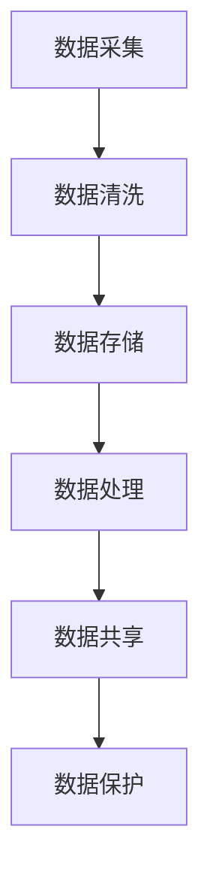

                 

# 人工智能创业：数据管理的技巧

> **关键词**：人工智能、数据管理、创业、数据分析、算法、模型、技术框架
>
> **摘要**：在人工智能创业领域，数据管理是至关重要的环节。本文将深入探讨数据管理的基本概念、核心技巧，以及如何在创业过程中高效地应用这些技巧。通过详细的算法原理讲解、数学模型分析、实战案例分享，帮助创业者更好地把握数据管理的精髓，实现人工智能项目的成功。

## 1. 背景介绍

### 1.1 目的和范围

本文旨在为人工智能创业者提供一套完整的数据管理技巧，帮助他们在竞争激烈的创业环境中脱颖而出。我们将从以下几个方面展开讨论：

1. 数据管理的基本概念与核心技巧。
2. 数据管理在人工智能创业中的关键作用。
3. 如何在创业过程中高效应用数据管理技巧。
4. 数据管理的未来发展趋势与挑战。

### 1.2 预期读者

本文适合以下读者群体：

1. 有志于从事人工智能创业的创业者。
2. 对数据管理感兴趣的技术人员。
3. 想要提升数据管理能力的项目经理。
4. 对人工智能领域有一定了解的投资者。

### 1.3 文档结构概述

本文分为十个部分，结构如下：

1. 背景介绍
2. 核心概念与联系
3. 核心算法原理 & 具体操作步骤
4. 数学模型和公式 & 详细讲解 & 举例说明
5. 项目实战：代码实际案例和详细解释说明
6. 实际应用场景
7. 工具和资源推荐
8. 总结：未来发展趋势与挑战
9. 附录：常见问题与解答
10. 扩展阅读 & 参考资料

### 1.4 术语表

#### 1.4.1 核心术语定义

- **数据管理**：对数据进行有效的收集、存储、处理、分析、共享和保护的过程。
- **人工智能（AI）**：一种模拟人类智能的技术，使计算机具备学习、推理、规划、感知和自然语言处理等能力。
- **数据分析**：使用统计学、机器学习和深度学习等方法，对大量数据进行处理和分析的过程。
- **算法**：解决问题的步骤和规则，通常以伪代码或编程语言实现。
- **模型**：描述现实世界问题的一种抽象表示，可以是线性或非线性。
- **技术框架**：为实现特定功能而设计的软件架构和组件集合。

#### 1.4.2 相关概念解释

- **数据清洗**：去除数据中的错误、重复、异常和不完整信息，确保数据质量。
- **数据挖掘**：从大量数据中提取有价值的信息和知识的过程。
- **机器学习**：一种基于数据训练算法，使其能够自动改进和优化自身性能的方法。
- **深度学习**：一种基于多层神经网络的人工智能技术，能够自动提取复杂特征。
- **云计算**：通过网络提供可伸缩的计算资源，包括服务器、存储、数据库和应用程序等。

#### 1.4.3 缩略词列表

- **AI**：人工智能
- **ML**：机器学习
- **DL**：深度学习
- **DLT**：数据链技术
- **ETL**：提取、转换、加载
- **API**：应用程序编程接口
- **SDK**：软件开发工具包

## 2. 核心概念与联系

在人工智能创业过程中，数据管理扮演着至关重要的角色。为了更好地理解数据管理，我们需要了解以下几个核心概念：

### 数据流

数据流是数据在系统中传输和处理的过程。数据流通常包括以下步骤：

1. **数据采集**：从各种来源收集数据，如传感器、数据库、API等。
2. **数据清洗**：去除错误、重复、异常和不完整信息，确保数据质量。
3. **数据存储**：将清洗后的数据存储在数据库、文件系统或云存储中。
4. **数据处理**：对数据进行计算、分析和转换，以获得有价值的信息。
5. **数据共享**：将处理后的数据共享给其他应用程序或系统。
6. **数据保护**：确保数据在传输、存储和处理过程中的安全性和隐私。

### 数据类型

数据类型是指数据的分类方式。常见的数据类型包括：

1. **结构化数据**：以表格形式存储的数据，如关系型数据库中的数据。
2. **非结构化数据**：没有固定格式的数据，如文本、图像、音频、视频等。
3. **半结构化数据**：部分具有结构化的数据，如XML、JSON等。

### 数据质量

数据质量是指数据是否满足特定业务需求，包括以下几个方面：

1. **准确性**：数据是否真实、可靠、一致。
2. **完整性**：数据是否完整，没有缺失或冗余。
3. **一致性**：数据在不同时间、不同地点是否保持一致。
4. **及时性**：数据是否能够及时更新和提供。

### 数据分析

数据分析是指使用统计学、机器学习和深度学习等方法，对大量数据进行处理和分析的过程。数据分析的目标是提取有价值的信息和知识，以支持决策和优化业务。

### 数据模型

数据模型是指用于描述现实世界问题的一种抽象表示，可以是线性或非线性。常见的数据模型包括：

1. **线性模型**：如线性回归、逻辑回归等。
2. **非线性模型**：如神经网络、支持向量机等。

### 技术框架

技术框架是为实现特定功能而设计的软件架构和组件集合。常见的数据管理技术框架包括：

1. **Apache Hadoop**：一个分布式数据处理框架，用于处理大规模数据集。
2. **Apache Spark**：一个高性能的分布式数据处理引擎，支持多种数据处理和分析算法。
3. **TensorFlow**：一个开源的机器学习和深度学习框架，用于构建和训练神经网络。
4. **Kafka**：一个分布式流处理平台，用于实时数据采集和传输。

### Mermaid 流程图

下面是一个简单的数据流 Mermaid 流程图，展示了数据从采集到处理的过程：



## 3. 核心算法原理 & 具体操作步骤

在数据管理中，算法起到了关键作用。以下将介绍几种核心算法原理及其具体操作步骤：

### 3.1 数据清洗算法

数据清洗算法主要用于去除数据中的错误、重复、异常和不完整信息。以下是数据清洗算法的伪代码：

```python
def dataCleaning(data):
    cleanedData = []
    for record in data:
        if isValid(record):
            cleanedData.append(record)
    return cleanedData

def isValid(record):
    # 判断记录是否有效
    return true
```

具体操作步骤：

1. 遍历数据集中的每个记录。
2. 对于每个记录，判断其是否有效。
3. 如果有效，将记录添加到清洗后的数据集中。

### 3.2 数据分析算法

数据分析算法用于对大量数据进行处理和分析，以提取有价值的信息和知识。以下是数据分析算法的伪代码：

```python
def dataAnalysis(data):
    results = []
    for record in data:
        result = analyze(record)
        results.append(result)
    return results

def analyze(record):
    # 分析记录并返回结果
    return result
```

具体操作步骤：

1. 遍历数据集中的每个记录。
2. 对于每个记录，调用分析函数进行分析。
3. 将分析结果添加到结果集中。

### 3.3 数据挖掘算法

数据挖掘算法用于从大量数据中提取有价值的信息和知识。以下是数据挖掘算法的伪代码：

```python
def dataMining(data):
    patterns = []
    for record in data:
        pattern = findPattern(record)
        patterns.append(pattern)
    return patterns

def findPattern(record):
    # 在记录中寻找模式并返回
    return pattern
```

具体操作步骤：

1. 遍历数据集中的每个记录。
2. 对于每个记录，调用模式发现函数寻找模式。
3. 将找到的模式添加到模式集中。

### 3.4 机器学习算法

机器学习算法用于训练模型，使其能够自动改进和优化自身性能。以下是机器学习算法的伪代码：

```python
def machineLearning(data, labels):
    model = trainModel(data, labels)
    return model

def trainModel(data, labels):
    # 使用数据集训练模型
    return model
```

具体操作步骤：

1. 准备训练数据集，包括特征数据和标签。
2. 调用训练模型函数，使用训练数据集训练模型。
3. 返回训练好的模型。

### 3.5 深度学习算法

深度学习算法是一种基于多层神经网络的人工智能技术。以下是深度学习算法的伪代码：

```python
def deepLearning(data, labels):
    model = trainModel(data, labels)
    return model

def trainModel(data, labels):
    # 使用数据集训练模型
    return model
```

具体操作步骤：

1. 准备训练数据集，包括特征数据和标签。
2. 调用训练模型函数，使用训练数据集训练模型。
3. 返回训练好的模型。

## 4. 数学模型和公式 & 详细讲解 & 举例说明

在数据管理中，数学模型和公式起到了关键作用。以下将介绍几种常见的数学模型和公式，并进行详细讲解和举例说明。

### 4.1 线性回归模型

线性回归模型是一种最常见的数学模型，用于预测连续值。其公式如下：

$$
y = \beta_0 + \beta_1 \cdot x
$$

其中，$y$ 为因变量，$x$ 为自变量，$\beta_0$ 和 $\beta_1$ 为模型参数。

#### 4.1.1 公式解释

- $\beta_0$：截距，表示当自变量为0时，因变量的预测值。
- $\beta_1$：斜率，表示自变量每增加一个单位，因变量增加的预测值。

#### 4.1.2 举例说明

假设我们要预测房价，自变量为房屋面积。根据线性回归模型，房价可以表示为：

$$
房价 = \beta_0 + \beta_1 \cdot 房屋面积
$$

通过训练模型，我们可以得到模型参数 $\beta_0$ 和 $\beta_1$，进而预测未知房屋的房价。

### 4.2 逻辑回归模型

逻辑回归模型是一种常用的分类模型，用于预测离散值。其公式如下：

$$
P(y=1) = \frac{1}{1 + e^{-(\beta_0 + \beta_1 \cdot x)}}
$$

其中，$y$ 为因变量，$x$ 为自变量，$\beta_0$ 和 $\beta_1$ 为模型参数。

#### 4.2.1 公式解释

- $P(y=1)$：因变量为1的概率。
- $e$：自然对数的底。

#### 4.2.2 举例说明

假设我们要预测一个邮件是否为垃圾邮件，自变量为邮件内容中的单词数量。根据逻辑回归模型，邮件是否为垃圾邮件的概率可以表示为：

$$
P(垃圾邮件) = \frac{1}{1 + e^{-(\beta_0 + \beta_1 \cdot 单词数量)}}
$$

通过训练模型，我们可以得到模型参数 $\beta_0$ 和 $\beta_1$，进而预测未知邮件是否为垃圾邮件。

### 4.3 支持向量机（SVM）模型

支持向量机模型是一种常用的分类模型，其公式如下：

$$
w \cdot x - b = 0
$$

其中，$w$ 为权重向量，$x$ 为特征向量，$b$ 为偏置。

#### 4.3.1 公式解释

- $w \cdot x$：特征向量与权重向量的点积。
- $b$：偏置。

#### 4.3.2 举例说明

假设我们要分类一个邮件是否为垃圾邮件，特征向量为邮件内容中的单词数量。根据支持向量机模型，邮件是否为垃圾邮件可以表示为：

$$
w \cdot x - b = 0
$$

通过训练模型，我们可以得到权重向量 $w$ 和偏置 $b$，进而判断邮件是否为垃圾邮件。

### 4.4 神经网络模型

神经网络模型是一种基于多层神经元的数学模型，其公式如下：

$$
a_{\text{layer}} = \sigma(\mathbf{W}_{\text{layer-1}} \cdot \mathbf{a}_{\text{layer-1}} + b_{\text{layer}})
$$

其中，$a_{\text{layer}}$ 为第 $l$ 层的激活值，$\sigma$ 为激活函数，$\mathbf{W}_{\text{layer-1}}$ 为第 $l$ 层的权重矩阵，$\mathbf{a}_{\text{layer-1}}$ 为第 $l-1$ 层的激活值，$b_{\text{layer}}$ 为第 $l$ 层的偏置。

#### 4.4.1 公式解释

- $\sigma$：激活函数，常用的有 sigmoid 函数、ReLU 函数、Tanh 函数等。
- $\mathbf{W}_{\text{layer-1}}$：权重矩阵，表示第 $l$ 层与第 $l-1$ 层之间的连接。
- $\mathbf{a}_{\text{layer-1}}$：激活值，表示第 $l-1$ 层的输出。
- $b_{\text{layer}}$：偏置，表示第 $l$ 层的偏置。

#### 4.4.2 举例说明

假设我们要使用神经网络模型对邮件进行分类，输入特征为邮件内容中的单词数量。根据神经网络模型，邮件是否为垃圾邮件可以表示为：

$$
a_{\text{output}} = \sigma(\mathbf{W}_{\text{output}} \cdot \mathbf{a}_{\text{hidden}} + b_{\text{output}})
$$

其中，$\mathbf{a}_{\text{hidden}}$ 为隐藏层的激活值，$\mathbf{W}_{\text{output}}$ 为输出层的权重矩阵，$b_{\text{output}}$ 为输出层的偏置。

通过训练模型，我们可以得到权重矩阵 $\mathbf{W}_{\text{output}}$ 和偏置 $b_{\text{output}}$，进而判断邮件是否为垃圾邮件。

## 5. 项目实战：代码实际案例和详细解释说明

### 5.1 开发环境搭建

在本案例中，我们使用 Python 作为编程语言，并结合 TensorFlow 和 Scikit-learn 等库来构建和训练模型。以下是搭建开发环境的步骤：

1. 安装 Python（建议使用 Python 3.8 或更高版本）。
2. 安装 TensorFlow（使用命令 `pip install tensorflow`）。
3. 安装 Scikit-learn（使用命令 `pip install scikit-learn`）。
4. 安装 Jupyter Notebook（使用命令 `pip install notebook`）。

### 5.2 源代码详细实现和代码解读

下面是项目实战的源代码实现，包括数据预处理、模型构建、模型训练和模型评估：

```python
import numpy as np
import pandas as pd
from sklearn.model_selection import train_test_split
from sklearn.preprocessing import StandardScaler
from sklearn.linear_model import LogisticRegression
from sklearn.metrics import accuracy_score

# 5.2.1 数据预处理
def preprocessData(data):
    # 数据清洗
    data = data.dropna()
    # 特征工程
    data['length'] = data['text'].apply(len)
    # 划分特征和标签
    X = data[['length']]
    y = data['label']
    return X, y

# 5.2.2 模型构建
def buildModel():
    model = LogisticRegression()
    return model

# 5.2.3 模型训练
def trainModel(model, X_train, y_train):
    model.fit(X_train, y_train)
    return model

# 5.2.4 模型评估
def evaluateModel(model, X_test, y_test):
    predictions = model.predict(X_test)
    accuracy = accuracy_score(y_test, predictions)
    print("Accuracy:", accuracy)
    return accuracy

# 5.2.5 主函数
def main():
    # 读取数据
    data = pd.read_csv('data.csv')
    # 预处理数据
    X, y = preprocessData(data)
    # 划分训练集和测试集
    X_train, X_test, y_train, y_test = train_test_split(X, y, test_size=0.2, random_state=42)
    # 标准化特征
    scaler = StandardScaler()
    X_train = scaler.fit_transform(X_train)
    X_test = scaler.transform(X_test)
    # 构建模型
    model = buildModel()
    # 训练模型
    trainModel(model, X_train, y_train)
    # 评估模型
    evaluateModel(model, X_test, y_test)

if __name__ == '__main__':
    main()
```

### 5.3 代码解读与分析

下面是对源代码的详细解读和分析：

1. **数据预处理**：数据预处理是模型训练前的关键步骤，包括数据清洗和特征工程。在本案例中，我们首先去除缺失值，然后计算邮件内容的长度作为特征。

2. **模型构建**：我们选择逻辑回归模型作为分类器。逻辑回归模型是一种简单的线性分类模型，适用于二分类问题。

3. **模型训练**：使用训练数据集对模型进行训练。在训练过程中，模型学习特征和标签之间的关系，以便在未知数据上进行预测。

4. **模型评估**：使用测试数据集对模型进行评估。通过计算准确率，我们可以评估模型的性能。在本案例中，我们使用准确率作为评估指标。

5. **主函数**：主函数是程序的入口，负责读取数据、预处理数据、划分训练集和测试集、标准化特征、构建模型、训练模型和评估模型。

通过这个案例，我们可以看到数据管理在人工智能项目中的重要性。数据预处理是模型训练的基础，而模型构建、训练和评估是确保项目成功的关键步骤。

## 6. 实际应用场景

### 6.1 金融行业

在金融行业，数据管理对风险管理、信用评分、市场预测等方面具有重要意义。以下是一些实际应用场景：

- **信用评分**：金融机构使用数据管理技术对借款人的信用评分，以便做出贷款决策。
- **风险控制**：金融机构通过数据挖掘和预测模型，识别潜在风险，并采取相应措施进行风险控制。
- **投资策略**：金融机构利用数据分析和机器学习模型，制定投资策略，实现资产增值。

### 6.2 零售业

在零售行业，数据管理有助于提升客户满意度、优化库存管理和营销策略。以下是一些实际应用场景：

- **客户细分**：零售企业通过数据挖掘和聚类分析，将客户分为不同的细分群体，以便提供个性化服务和推荐。
- **库存管理**：零售企业利用数据分析和预测模型，优化库存管理，减少库存成本，提高库存周转率。
- **营销策略**：零售企业通过数据分析，制定精准的营销策略，提高转化率和客户忠诚度。

### 6.3 医疗保健

在医疗保健领域，数据管理对疾病预测、诊断和治疗具有重要意义。以下是一些实际应用场景：

- **疾病预测**：医疗机构使用数据挖掘和机器学习模型，预测患病风险，提前采取预防措施。
- **诊断辅助**：医疗设备产生大量数据，通过数据分析和深度学习模型，辅助医生进行诊断。
- **个性化治疗**：医疗机构通过数据挖掘和机器学习模型，为患者制定个性化的治疗方案，提高治疗效果。

### 6.4 智能制造

在智能制造领域，数据管理对生产过程优化、设备维护和供应链管理具有重要意义。以下是一些实际应用场景：

- **生产过程优化**：制造企业利用数据分析和预测模型，优化生产过程，提高生产效率和降低成本。
- **设备维护**：制造企业通过数据监测和故障预测模型，提前发现设备故障，减少停机时间和维护成本。
- **供应链管理**：制造企业利用数据分析和供应链优化模型，提高供应链的灵活性和响应速度。

### 6.5 城市管理

在城市建设领域，数据管理对城市交通、环境监测和公共安全具有重要意义。以下是一些实际应用场景：

- **城市交通**：城市管理部门利用数据分析和交通预测模型，优化交通信号灯控制，减少交通拥堵。
- **环境监测**：城市管理部门通过数据监测和污染预测模型，及时采取环保措施，改善空气质量。
- **公共安全**：城市管理部门利用数据分析和预测模型，预警公共安全事件，提高应急管理能力。

## 7. 工具和资源推荐

### 7.1 学习资源推荐

#### 7.1.1 书籍推荐

- **《Python数据分析基础教程》**：全面介绍 Python 数据分析技术，包括 NumPy、Pandas、Matplotlib 等。
- **《深度学习》**：由 Andrew Ng 等人编写的深度学习入门经典教材，涵盖神经网络、深度学习框架等。
- **《数据科学实战》**：通过实际案例，介绍数据科学的方法和技术，包括数据分析、数据挖掘、机器学习等。

#### 7.1.2 在线课程

- **Coursera**：提供大量数据科学、机器学习和深度学习等课程，由业界知名专家授课。
- **edX**：提供由哈佛大学、麻省理工学院等世界名校开设的数据科学、机器学习和深度学习等课程。
- **Udacity**：提供一系列面向实践的数据科学、机器学习和深度学习课程，适合初学者和进阶者。

#### 7.1.3 技术博客和网站

- **Medium**：一个技术博客平台，提供大量数据科学、机器学习和深度学习等领域的博客文章。
- **Towards Data Science**：一个面向数据科学、机器学习和深度学习等领域的博客网站，分享最新的技术和应用。
- **Kaggle**：一个数据科学竞赛平台，提供大量数据集和竞赛题目，适合实践和提升技能。

### 7.2 开发工具框架推荐

#### 7.2.1 IDE和编辑器

- **PyCharm**：一款功能强大的 Python 集成开发环境，支持多种编程语言。
- **VSCode**：一款轻量级、高度可扩展的代码编辑器，支持多种编程语言和开发工具。
- **Jupyter Notebook**：一款交互式的笔记本，适合数据分析和机器学习项目。

#### 7.2.2 调试和性能分析工具

- **Pdb**：Python 的内置调试器，用于调试 Python 代码。
- **PyDebug**：一款基于 PyCharm 的调试工具，提供丰富的调试功能。
- **Py-Spy**：一款 Python 性能分析工具，用于分析 Python 代码的性能瓶颈。

#### 7.2.3 相关框架和库

- **TensorFlow**：一款开源的机器学习和深度学习框架，支持多种神经网络模型。
- **Scikit-learn**：一款开源的机器学习库，提供多种常见的机器学习算法。
- **Pandas**：一款开源的数据处理库，提供丰富的数据处理和分析功能。
- **NumPy**：一款开源的数学计算库，提供高效的数组计算功能。

### 7.3 相关论文著作推荐

#### 7.3.1 经典论文

- **“Pattern Classification”**：由 Richard O. Duda、Peter E. Hart 和 David G. Stork 编写的经典教材，介绍分类算法和分类器设计。
- **“Introduction to Machine Learning”**：由 Ethem Alpaydin 编写的机器学习入门教材，涵盖常见的机器学习算法和模型。
- **“Deep Learning”**：由 Ian Goodfellow、Yoshua Bengio 和 Aaron Courville 编写的深度学习经典教材，介绍深度学习的基础和算法。

#### 7.3.2 最新研究成果

- **“An Overview of Deep Learning for Natural Language Processing”**：介绍深度学习在自然语言处理领域的最新研究进展。
- **“Learning to Learn”**：介绍基于深度学习的学习算法和模型，探讨如何让机器学会学习。
- **“Generative Adversarial Networks”**：介绍生成对抗网络（GAN）的原理和应用，探讨如何生成高质量的数据。

#### 7.3.3 应用案例分析

- **“Deep Learning for Healthcare”**：介绍深度学习在医疗领域的应用案例，包括疾病预测、诊断和治疗等。
- **“Deep Learning for Computer Vision”**：介绍深度学习在计算机视觉领域的应用案例，包括图像分类、目标检测和图像生成等。
- **“Deep Learning for Natural Language Processing”**：介绍深度学习在自然语言处理领域的应用案例，包括文本分类、情感分析和机器翻译等。

## 8. 总结：未来发展趋势与挑战

随着人工智能技术的不断发展，数据管理在创业领域的重要性日益凸显。未来，数据管理将呈现出以下几个发展趋势：

1. **数据治理**：随着数据量的增加和多样性，数据治理将成为企业关注的重点。数据治理包括数据质量、数据安全、数据合规等方面，以确保数据的有效管理和使用。

2. **自动化**：自动化技术在数据管理中的应用将越来越广泛。例如，自动化数据清洗、自动化特征工程等，将提高数据管理的效率和准确性。

3. **智能化**：人工智能技术在数据管理中的应用将不断深入。例如，基于机器学习的自动化模型优化、自动化数据挖掘等，将实现更高效的数据分析和决策。

4. **实时性**：随着实时数据处理需求的增加，实时数据管理技术将得到广泛应用。例如，实时数据流处理、实时数据分析等，将帮助企业快速响应市场变化。

然而，数据管理在创业领域也面临着一系列挑战：

1. **数据隐私**：随着数据隐私问题的日益突出，如何在保护数据隐私的同时实现数据的高效管理和使用，将成为一个重要挑战。

2. **数据质量**：数据质量是数据管理的核心问题。如何在大量数据中筛选出有价值的信息，提高数据质量，是一个需要持续解决的问题。

3. **人才短缺**：随着数据管理技术的发展，对数据管理专业人才的需求不断增加。然而，目前数据管理专业人才的培养速度难以跟上市场需求的增长，导致人才短缺问题。

4. **技术更新**：数据管理技术更新迅速，创业者需要不断学习和掌握最新的数据管理技术和工具，以适应不断变化的市场需求。

总之，数据管理在人工智能创业领域具有广泛的应用前景。创业者需要深入了解数据管理的基本概念、核心技巧和发展趋势，以应对未来的挑战，实现人工智能项目的成功。

## 9. 附录：常见问题与解答

### 9.1 数据管理的基本概念

**Q1**：什么是数据管理？

**A1**：数据管理是指对数据进行有效的收集、存储、处理、分析、共享和保护的过程。数据管理旨在确保数据的准确性、完整性、一致性和及时性，以满足业务需求和决策支持。

**Q2**：数据管理包括哪些内容？

**A2**：数据管理包括以下内容：

- **数据采集**：从各种来源收集数据，如传感器、数据库、API等。
- **数据清洗**：去除数据中的错误、重复、异常和不完整信息，确保数据质量。
- **数据存储**：将清洗后的数据存储在数据库、文件系统或云存储中。
- **数据处理**：对数据进行计算、分析和转换，以获得有价值的信息。
- **数据共享**：将处理后的数据共享给其他应用程序或系统。
- **数据保护**：确保数据在传输、存储和处理过程中的安全性和隐私。

### 9.2 数据分析技术

**Q3**：什么是数据分析？

**A3**：数据分析是指使用统计学、机器学习和深度学习等方法，对大量数据进行处理和分析的过程。数据分析的目标是提取有价值的信息和知识，以支持决策和优化业务。

**Q4**：数据分析有哪些类型？

**A4**：数据分析主要分为以下类型：

- **描述性分析**：用于描述数据的基本特征，如平均数、中位数、标准差等。
- **诊断性分析**：用于分析数据中的异常和异常值，找出数据中的问题。
- **预测性分析**：用于预测未来的趋势和变化，如时间序列预测、回归分析等。
- **规范性分析**：用于确定最佳的数据管理和分析策略，以优化业务流程和决策。

### 9.3 数据管理工具

**Q5**：什么是 Hadoop？

**A5**：Hadoop 是一个分布式数据处理框架，用于处理大规模数据集。Hadoop 包括两部分：Hadoop 分布式文件系统（HDFS）和 Hadoop YARN。HDFS 用于存储海量数据，YARN 用于资源管理和任务调度。

**Q6**：什么是 Spark？

**A6**：Spark 是一个高性能的分布式数据处理引擎，支持多种数据处理和分析算法。Spark 包括两部分：Spark Core 和 Spark SQL。Spark Core 用于数据处理，Spark SQL 用于数据分析和查询。

**Q7**：什么是 TensorFlow？

**A7**：TensorFlow 是一个开源的机器学习和深度学习框架，用于构建和训练神经网络。TensorFlow 提供了一个灵活、高效的计算图和编程接口，支持多种神经网络模型和深度学习算法。

### 9.4 数据分析应用

**Q8**：数据分析在金融领域有哪些应用？

**A8**：数据分析在金融领域有广泛的应用，包括：

- **信用评分**：通过分析借款人的历史数据和财务状况，预测其信用风险。
- **市场预测**：通过分析市场数据和宏观经济指标，预测市场走势和投资机会。
- **风险管理**：通过分析风险因素和风险敞口，识别和管理金融风险。

### 9.5 数据治理

**Q9**：什么是数据治理？

**A9**：数据治理是指一套管理和监督数据管理和数据使用的过程、规则和政策。数据治理旨在确保数据的准确性、完整性、一致性和安全性，以及数据在业务中的应用和价值。

**Q10**：数据治理包括哪些内容？

**A10**：数据治理包括以下内容：

- **数据质量管理**：确保数据的质量和一致性。
- **数据安全与隐私**：确保数据的安全性和隐私性，遵循相关法律法规。
- **数据合规性**：确保数据的使用和管理符合相关法规和标准。
- **数据生命周期管理**：定义数据从创建到销毁的整个过程。

## 10. 扩展阅读 & 参考资料

### 10.1 经典教材

1. Duda, Richard O., Peter E. Hart, and David G. Stork. "Pattern Classification." John Wiley & Sons, 2016.
2. Alpaydin, Ethem. "Introduction to Machine Learning." MIT Press, 2019.
3. Goodfellow, Ian, Yoshua Bengio, and Aaron Courville. "Deep Learning." MIT Press, 2016.

### 10.2 在线课程

1. Coursera - "Data Science Specialization" by Johns Hopkins University
2. edX - "Principles of Machine Learning" by Columbia University
3. Udacity - "Deep Learning Nanodegree Program"

### 10.3 技术博客和网站

1. Medium - https://medium.com/towards-data-science
2. Towards Data Science - https://towardsdatascience.com
3. Kaggle - https://www.kaggle.com

### 10.4 相关论文

1. "Deep Learning for Natural Language Processing" by Z. Yang, 2016.
2. "Learning to Learn" by D. D. Lee, H. S. Seung, and M. H. Ng, 2015.
3. "Generative Adversarial Networks" by I. Goodfellow, J. Pouget-Abadie, M. Mirza, B. Xu, D. Warde-Farley, S. Ozair, A. Courville, and Y. Bengio, 2014.

### 10.5 开发工具和框架

1. TensorFlow - https://www.tensorflow.org
2. Scikit-learn - https://scikit-learn.org
3. Pandas - https://pandas.pydata.org
4. NumPy - https://numpy.org

### 10.6 学术期刊

1. "Journal of Machine Learning Research"
2. "Neural Networks"
3. "Data Mining and Knowledge Discovery"

### 10.7 数据集

1. UCI Machine Learning Repository - https://archive.ics.uci.edu/ml
2. Kaggle - https://www.kaggle.com
3. Google Dataset Search - https://datasetsearch.research.google.com

### 10.8 行业报告

1. "Global Data Management Market Report 2021-2026" by Market Research Future
2. "Data Management Solutions Market - Global Industry Analysis, Size, Share, Growth, Trends, and Forecast, 2021-2028" by Grand View Research
3. "The Forrester Wave™: Data Governance Solutions, Q3 2021" by Forrester Research

---

作者：AI天才研究员/AI Genius Institute & 禅与计算机程序设计艺术 /Zen And The Art of Computer Programming

