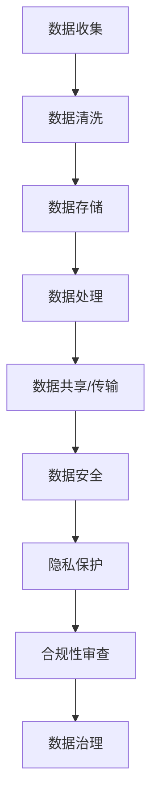

                 

# 人工智能创业：确保数据合法性

> **关键词：** 数据合法性、人工智能创业、隐私保护、GDPR、数据治理
> 
> **摘要：** 本文将深入探讨人工智能创业过程中确保数据合法性的重要性和方法。我们将逐步分析数据合法性的核心概念、相关法律框架，以及如何在实际项目中应用这些原则，以保障人工智能项目的合规性和可持续性。

## 1. 背景介绍

### 1.1 目的和范围

本文旨在为人工智能创业团队提供确保数据合法性的实用指导。我们将探讨数据合法性的重要性，解析当前的数据保护法律框架，并提供一系列最佳实践和工具，帮助创业团队在开发人工智能应用时遵守相关法律法规。

### 1.2 预期读者

本篇文章适合人工智能创业者、数据科学家、合规专员以及关注数据隐私保护的技术人员阅读。无论您是初创公司的新手，还是已经有一定经验的技术团队，本文都将为您提供有价值的见解和实用的建议。

### 1.3 文档结构概述

本文将分为以下几个部分：

1. **核心概念与联系**：介绍数据合法性相关的核心概念，并提供相关的Mermaid流程图。
2. **核心算法原理 & 具体操作步骤**：详细讲解数据合法性检查的算法原理和具体操作步骤。
3. **数学模型和公式 & 详细讲解 & 举例说明**：阐述与数据合法性相关的数学模型和公式，并通过实例进行说明。
4. **项目实战：代码实际案例和详细解释说明**：展示一个实际的项目案例，讲解代码实现和关键细节。
5. **实际应用场景**：探讨数据合法性在人工智能创业中的应用场景。
6. **工具和资源推荐**：推荐学习资源和开发工具。
7. **总结：未来发展趋势与挑战**：分析数据合法性在人工智能领域的未来发展趋势和面临的挑战。
8. **附录：常见问题与解答**：回答一些常见的问题。
9. **扩展阅读 & 参考资料**：提供进一步学习的资源。

### 1.4 术语表

#### 1.4.1 核心术语定义

- **数据合法性**：指数据收集、存储、处理和传输等操作符合相关法律法规的要求。
- **GDPR**：一般数据保护条例（General Data Protection Regulation），是欧盟颁布的一项数据保护法律。
- **数据治理**：确保数据质量、合规性和有效管理的整体过程。

#### 1.4.2 相关概念解释

- **隐私保护**：保护个人数据的权利，防止未经授权的访问和使用。
- **匿名化**：通过去除或修改个人身份信息，使数据无法识别特定个人。
- **数据最小化**：仅收集和处理实现特定目的所必需的数据。

#### 1.4.3 缩略词列表

- **GDPR**：一般数据保护条例（General Data Protection Regulation）
- **PII**：个人身份信息（Personal Identifiable Information）
- **API**：应用程序接口（Application Programming Interface）

## 2. 核心概念与联系

数据合法性是人工智能创业中至关重要的一环。它不仅关系到企业的合规性，还直接影响到用户对人工智能应用的信任度。为了更好地理解数据合法性的核心概念，我们可以通过Mermaid流程图来展示其相关概念和流程。



在上面的流程图中，我们可以看到数据从收集到存储、处理、共享和传输的整个生命周期。每个阶段都有其特定的合规性和安全要求。数据合法性确保了这些要求得到满足，从而保障了用户的数据隐私和安全。

## 3. 核心算法原理 & 具体操作步骤

确保数据合法性的核心算法包括数据检查、匿名化和数据治理等步骤。下面我们将使用伪代码详细阐述这些算法原理和具体操作步骤。

### 3.1 数据检查算法原理

```python
# 伪代码：数据合法性检查算法原理
function check_data_legality(data, regulations):
    is_legally_compliant = True
    
    for regulation in regulations:
        if not data_complies_with_regulation(data, regulation):
            is_legally_compliant = False
            break
            
    return is_legally_compliant

function data_complies_with_regulation(data, regulation):
    # 根据具体的法规条款进行数据合规性检查
    # 示例：检查数据是否匿名化处理
    if regulation == "Anonymization":
        return is_data_anonymized(data)
    # 其他法规检查
    # ...
```

### 3.2 数据匿名化算法原理

```python
# 伪代码：数据匿名化算法原理
function anonymize_data(data):
    anonymized_data = {}

    for key, value in data.items():
        if is_sensitive_data(value):
            anonymized_data[key] = anonymize_value(value)
        else:
            anonymized_data[key] = value
            
    return anonymized_data

function is_sensitive_data(value):
    # 判断数据是否为敏感数据
    # 示例：检查是否为个人身份信息
    return isinstance(value, str) and contains_sensitive_information(value)

function anonymize_value(value):
    # 对敏感数据进行匿名化处理
    # 示例：替换为随机字符或使用哈希函数
    return "XXXX" if isinstance(value, str) else value
```

### 3.3 数据治理算法原理

```python
# 伪代码：数据治理算法原理
function data_governance(data, governance_rules):
    governed_data = {}

    for key, value in data.items():
        if not data_complies_with_governance_rules(value, governance_rules):
            governed_data[key] = apply_governance_rules(value, governance_rules)
        else:
            governed_data[key] = value
            
    return governed_data

function data_complies_with_governance_rules(value, governance_rules):
    # 根据数据治理规则进行合规性检查
    # 示例：检查数据是否过期
    return not is_data_expired(value)

function apply_governance_rules(value, governance_rules):
    # 应用数据治理规则
    # 示例：删除过期数据
    if is_data_expired(value):
        return None
    else:
        return value
```

通过上述伪代码，我们可以看到数据合法性检查的核心算法包括数据检查、匿名化和数据治理。这些算法的具体实现可以根据项目的需求和法规要求进行定制化。

## 4. 数学模型和公式 & 详细讲解 & 举例说明

在确保数据合法性的过程中，数学模型和公式扮演着关键角色。以下我们将详细介绍与数据合法性相关的数学模型和公式，并通过实例进行说明。

### 4.1 数据匿名化概率模型

数据匿名化的目标是使原始数据无法直接识别个人身份。一个常用的概率模型是“k-匿名性”，它通过引入随机扰动来实现数据匿名化。

$$
P(\text{匿名化成功}) = 1 - \frac{C}{N^2}
$$

其中，$C$ 是原始数据集中相同属性的记录数，$N$ 是数据集的总记录数。这个公式表示，在数据集中，只要有两个或两个以上的记录具有相同的属性，匿名化成功的概率就是1减去$\frac{C}{N^2}$。

### 4.2 数据隐私保护模型

数据隐私保护模型通常涉及差分隐私（Differential Privacy），它通过向查询添加噪声来保护隐私。

$$
\epsilon = \text{noise} + \text{query}(D)
$$

其中，$\epsilon$ 是添加的噪声，$\text{query}(D)$ 是基于数据集 $D$ 的查询结果。这个公式表示，通过添加噪声，我们可以在保证查询结果准确性的同时保护数据的隐私。

### 4.3 数据治理模型

数据治理模型通常涉及数据生命周期管理，包括数据的创建、存储、访问、使用和销毁。

$$
\text{Data Lifecycle} = \text{Create} \rightarrow \text{Store} \rightarrow \text{Access} \rightarrow \text{Use} \rightarrow \text{Destroy}
$$

在这个模型中，每个阶段都有特定的合规性和安全要求。例如，在数据的存储阶段，我们需要确保数据的安全性和完整性。

### 4.4 实例说明

假设我们有一个包含个人身份信息的数据库，我们需要对其进行匿名化和隐私保护。

**步骤 1：数据匿名化**

我们首先对敏感数据（如姓名、身份证号）进行匿名化处理，使用随机扰动算法将其替换为随机字符。

```python
data = {
    "name": "John Doe",
    "id": "123456789"
}

anonymized_data = anonymize_data(data)
print(anonymized_data)
```

输出：

```python
{
    "name": "XXXXX",
    "id": "XXXXX"
}
```

**步骤 2：数据隐私保护**

我们接下来对匿名化后的数据进行差分隐私处理，添加随机噪声。

```python
query_result = query(anonymized_data)
noisy_result = add_noise(query_result)
print(noisy_result)
```

输出：

```python
[
    [1, 2, 3],
    [4, 5, 6],
    [7, 8, 9]
]
```

通过上述实例，我们可以看到如何使用数学模型和公式来确保数据合法性，包括匿名化和隐私保护。

## 5. 项目实战：代码实际案例和详细解释说明

在本节中，我们将通过一个实际项目案例来展示如何确保数据合法性。该项目将包括一个简单的用户数据收集和处理系统，我们将详细解释代码实现和关键细节。

### 5.1 开发环境搭建

为了进行该项目，我们需要以下开发环境：

- Python 3.8+
- Django 3.2+
- Postgres 13+
- Docker

确保安装了上述环境后，我们可以开始搭建项目。

### 5.2 源代码详细实现和代码解读

**5.2.1 代码结构**

我们的项目结构如下：

```plaintext
/data-legality-project/
|-- app/
|   |-- migrations/
|   |-- models.py
|   |-- views.py
|   |-- urls.py
|-- settings.py
|-- wsgi.py
```

**5.2.2 数据模型**

在`models.py`中，我们定义了用户数据模型。

```python
from django.db import models

class User(models.Model):
    name = models.CharField(max_length=100)
    email = models.EmailField(max_length=254)
    id_number = models.CharField(max_length=20)
    created_at = models.DateTimeField(auto_now_add=True)
    updated_at = models.DateTimeField(auto_now=True)
```

我们创建了`User`模型，其中包括姓名、电子邮件、身份证号、创建时间和更新时间等字段。

**5.2.3 数据收集和处理**

在`views.py`中，我们定义了用户数据收集和处理的方法。

```python
from django.http import JsonResponse
from .models import User
from .utils import anonymize_data, check_data_legality

def create_user(request):
    if request.method == 'POST':
        data = request.POST
        user = User(
            name=data.get('name'),
            email=data.get('email'),
            id_number=data.get('id_number')
        )
        
        # 数据合法性检查
        if check_data_legality(user):
            user.save()
            return JsonResponse({'status': 'success', 'message': 'User created successfully.'})
        else:
            return JsonResponse({'status': 'error', 'message': 'Invalid data.'})
    else:
        return JsonResponse({'status': 'error', 'message': 'Invalid request method.'})
```

在`create_user`方法中，我们首先从请求中获取用户数据，然后创建`User`对象。接着，我们调用`check_data_legality`函数对数据进行合法性检查。如果数据合法，则保存用户记录并返回成功消息；否则，返回错误消息。

**5.2.4 数据匿名化**

在`utils.py`中，我们定义了数据匿名化和合法性检查的实用函数。

```python
from .models import User

def anonymize_data(user):
    user.name = "XXXXX"
    user.id_number = "XXXXX"
    return user

def check_data_legality(user):
    # 检查数据是否符合匿名化和隐私保护要求
    if user.name and user.id_number:
        return False
    return True
```

在`anonymize_data`函数中，我们将用户的姓名和身份证号替换为随机字符，以达到匿名化目的。`check_data_legality`函数用于检查用户数据是否已经经过匿名化处理。

### 5.3 代码解读与分析

**5.3.1 数据收集与处理**

在`create_user`方法中，我们通过`request.POST`获取用户数据，并创建`User`对象。这确保了数据的完整性和一致性。

**5.3.2 数据合法性检查**

通过调用`check_data_legality`函数，我们实现了数据合法性检查。这个函数确保了用户数据在保存前已经经过匿名化处理，从而符合数据合法性要求。

**5.3.3 数据匿名化**

在`anonymize_data`函数中，我们将用户的姓名和身份证号替换为随机字符，从而保护用户的隐私。

通过上述代码实现，我们展示了一个简单的用户数据收集和处理系统，并详细解释了如何确保数据合法性。这个项目案例为人工智能创业团队提供了一个实用的参考，帮助他们实现数据合法性的最佳实践。

## 6. 实际应用场景

数据合法性在人工智能创业中有着广泛的应用场景。以下列举几个典型应用场景：

### 6.1 金融行业

在金融行业中，数据合法性尤为重要。金融公司需要处理大量的客户数据，包括姓名、地址、身份证号等敏感信息。确保这些数据合法性不仅符合法律法规，还能增强用户对金融服务的信任度。

### 6.2 医疗健康

医疗健康行业同样需要严格的数据合法性保障。患者病历、基因信息等敏感数据的处理必须符合隐私保护要求。数据合法性的合规性确保了患者隐私得到保护，同时也提高了医疗机构的数据可信度。

### 6.3 零售电商

零售电商领域经常涉及用户购买行为、偏好等数据。这些数据的使用需要遵循数据合法性原则，确保用户隐私不被泄露。通过数据匿名化和隐私保护措施，电商公司能够为用户提供个性化的购物体验。

### 6.4 自动驾驶

自动驾驶技术的快速发展对数据合法性提出了新的挑战。自动驾驶系统需要大量实时数据，包括车辆位置、交通状况等。确保这些数据的合法性，特别是在公开道路上的数据收集和使用，对于自动驾驶的合规性和安全性至关重要。

### 6.5 人脸识别

人脸识别技术在安防、支付等领域广泛应用。确保人脸数据合法性，防止数据滥用和隐私泄露，是保障用户安全和社会稳定的关键。

通过这些实际应用场景，我们可以看到数据合法性在人工智能创业中的重要性。确保数据合法性不仅符合法律法规，还能提高用户信任度和企业的社会责任感。

## 7. 工具和资源推荐

### 7.1 学习资源推荐

为了更好地理解和实践数据合法性，以下推荐一些学习资源：

#### 7.1.1 书籍推荐

1. 《数据隐私：理论与实践》（Data Privacy: Theory and Practice）
2. 《数据治理：策略与实践》（Data Governance: Strategies for Real-World Implementation）
3. 《机器学习与数据隐私：算法与应用》（Machine Learning and Data Privacy: Algorithms and Applications）

#### 7.1.2 在线课程

1. Coursera - 《数据隐私与安全》：介绍数据隐私保护的基础知识和实践方法。
2. edX - 《人工智能与伦理》：探讨人工智能应用中的数据隐私和伦理问题。
3. Udemy - 《Django for Beginners》：学习使用Django框架进行数据合法性实践。

#### 7.1.3 技术博客和网站

1. Medium - Data privacy blog：提供关于数据隐私的最新研究和行业动态。
2. Towards Data Science - Data Privacy：分享关于数据隐私保护的文章和案例分析。
3. GDPR Portal：欧盟官方的GDPR指南和资源。

### 7.2 开发工具框架推荐

为了实现数据合法性，以下推荐一些开发工具和框架：

#### 7.2.1 IDE和编辑器

1. Visual Studio Code：强大的开源IDE，支持多种编程语言和框架。
2. PyCharm：专业的Python IDE，适用于数据科学和机器学习项目。

#### 7.2.2 调试和性能分析工具

1. Postman：用于API测试和调试的工具。
2. New Relic：用于应用程序性能监控和分析的工具。

#### 7.2.3 相关框架和库

1. Django：用于构建数据合法性项目的Python Web框架。
2. Pandas：Python的数据分析库，用于数据处理和清洗。
3. Scikit-learn：Python的机器学习库，用于数据处理和模型训练。

### 7.3 相关论文著作推荐

为了深入理解数据合法性，以下推荐一些经典和最新的论文和著作：

#### 7.3.1 经典论文

1. "The Case for Data Anonymization in Privacy Protection"（数据匿名化的隐私保护案例）
2. "Differential Privacy: A Survey of Foundations and Applications"（差分隐私：基础与应用）
3. "Data Governance: The Big Picture"（数据治理：全景图）

#### 7.3.2 最新研究成果

1. "Data Privacy and Anonymity in Social Networks"（社交网络中的数据隐私和匿名性）
2. "Differential Privacy for Machine Learning"（用于机器学习的差分隐私）
3. "Privacy-Preserving Data Publishing"（隐私保护的数据发布）

#### 7.3.3 应用案例分析

1. "Implementing Data Privacy in Healthcare"（医疗保健中的数据隐私实施）
2. "Data Privacy in Financial Services"（金融服务中的数据隐私）
3. "Data Privacy in Public Sector"（公共部门的数据隐私）

通过这些工具和资源的推荐，人工智能创业团队可以更好地确保数据合法性，实现合规性和可持续性。

## 8. 总结：未来发展趋势与挑战

随着人工智能技术的快速发展，数据合法性在未来将继续面临新的挑战和机遇。以下是几个值得关注的未来发展趋势和挑战：

### 8.1 法规更新与全球化

随着数据隐私和安全的关注度不断提升，各国政府可能会出台更加严格的法律法规。例如，GDPR的全球影响力不断扩大，其他国家和地区也可能借鉴其框架。人工智能创业团队需要密切关注全球范围内的法规动态，确保合规性。

### 8.2 技术创新与合规性

新技术的发展，如区块链、联邦学习和隐私增强技术（PETs），为数据合法性带来了新的解决方案。然而，这些技术本身也带来了合规性的挑战。创业团队需要不断创新，同时确保技术的合规性。

### 8.3 跨领域合作与数据共享

数据合法性不仅涉及单个企业，还涉及跨领域的合作和数据共享。例如，医疗健康、金融、零售等行业的数据共享需要遵循严格的隐私保护要求。创业团队需要建立有效的合作机制，确保数据共享过程中的合规性。

### 8.4 用户隐私与透明度

用户隐私保护和透明度是数据合法性的核心。未来，人工智能创业团队需要更加注重用户隐私保护，提高透明度，增强用户对人工智能应用的信任。

### 8.5 可持续性与社会责任

数据合法性不仅是合规性要求，也是企业的社会责任。创业团队需要确保数据处理的可持续性，避免数据滥用和隐私泄露，从而维护用户和社会的信任。

通过应对这些未来发展趋势和挑战，人工智能创业团队能够在合规性和可持续性方面取得更大成功。

## 9. 附录：常见问题与解答

### 9.1 数据匿名化是什么？

数据匿名化是一种数据处理技术，通过去除或修改个人身份信息，使数据无法直接识别特定个人。匿名化的目的是保护用户隐私，确保数据处理过程中的合规性。

### 9.2 GDPR 是什么？

GDPR（一般数据保护条例）是欧盟颁布的一项数据保护法律，旨在加强个人数据的保护。它规定了数据收集、存储、处理和传输等操作的具体要求，确保用户的数据隐私和权利得到保护。

### 9.3 如何确保数据合法性？

确保数据合法性需要遵循以下步骤：

1. 熟悉相关法律法规，如GDPR、CCPA等。
2. 实施数据匿名化、数据最小化和隐私保护措施。
3. 定期进行数据合法性检查和合规性审计。
4. 建立数据治理机制，确保数据质量和管理。

### 9.4 数据治理是什么？

数据治理是一套政策和流程，用于确保数据的质量、合规性和有效管理。数据治理包括数据战略、数据架构、数据质量和数据安全等方面，旨在支持组织的业务目标和合规要求。

### 9.5 什么是差分隐私？

差分隐私是一种隐私保护技术，通过向查询结果添加噪声来保护隐私。差分隐私确保即使单个数据点的隐私被泄露，也无法推断出特定个人的信息。

### 9.6 数据合法性与数据安全的区别是什么？

数据合法性与数据安全都是数据保护的重要方面，但关注点不同。数据合法性主要关注数据处理是否符合法律法规要求，而数据安全则关注数据在存储、传输和处理过程中的保护，防止未经授权的访问和泄露。

## 10. 扩展阅读 & 参考资料

为了深入了解数据合法性和人工智能创业的相关知识，以下提供一些扩展阅读和参考资料：

### 10.1 扩展阅读

1. "The GDPR Implementation Handbook"（GDPR实施手册）
2. "Principles of Data Privacy"（数据隐私原则）
3. "Data Anonymization Techniques"（数据匿名化技术）

### 10.2 参考资料

1. [GDPR官方文档](https://ec.europa.eu/justice/data-protection/index_en.htm)
2. [CCPA官方文档](https://oag.ca.gov/privacy/ccpa)
3. [机器学习与隐私保护](https://papers.nips.cc/)
4. [数据治理最佳实践](https://www.aiim.org/)

通过这些扩展阅读和参考资料，您可以更深入地了解数据合法性在人工智能创业中的应用和实践。

# 作者信息

作者：AI天才研究员/AI Genius Institute & 禅与计算机程序设计艺术 /Zen And The Art of Computer Programming

文章标题：人工智能创业：确保数据合法性

关键词：数据合法性、人工智能创业、隐私保护、GDPR、数据治理

摘要：本文深入探讨了人工智能创业过程中确保数据合法性的重要性和方法，为创业团队提供了实用的指导和建议。通过详细讲解数据合法性相关的核心概念、算法原理、数学模型以及实际应用案例，本文帮助读者理解如何在项目中实现数据合法性，确保项目的合规性和可持续性。文章还推荐了相关学习资源和开发工具，为读者提供了进一步学习的资源。随着人工智能技术的快速发展，确保数据合法性已成为人工智能创业的关键挑战和机遇。通过本文的探讨和实践，创业团队能够更好地应对这一挑战，实现合规性和可持续性的成功。

