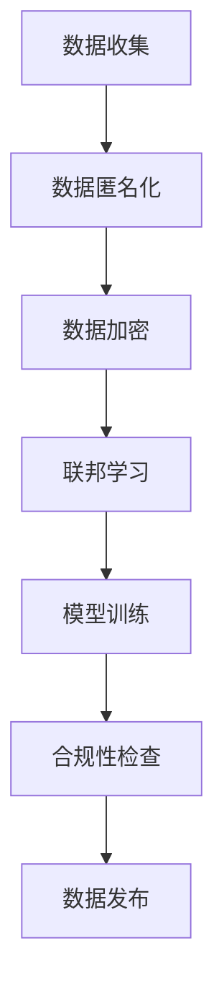

                 

# 人工智能创业：隐私保护的措施

> **关键词：**人工智能、创业、隐私保护、数据安全、匿名化、加密算法、联邦学习、合规性。

> **摘要：**本文旨在探讨在人工智能创业过程中，如何有效实施隐私保护措施。通过分析隐私保护的必要性、核心技术和实际案例，为创业团队提供实用的指导，确保在研发和商业应用中尊重用户隐私。

## 1. 背景介绍

### 1.1 目的和范围

本文旨在为人工智能创业团队提供一套隐私保护的实践指南。随着人工智能技术的迅猛发展，数据成为创新的核心资产。然而，数据隐私保护成为了一项不可忽视的挑战。本文将讨论以下主题：

- 隐私保护的必要性
- 隐私保护的核心技术
- 实际案例分析和解决方案
- 未来发展趋势与挑战

### 1.2 预期读者

本文适合以下读者群体：

- 人工智能创业者
- 数据科学家
- 隐私保护专家
- 产品经理
- 法律顾问

### 1.3 文档结构概述

本文分为以下几部分：

- 背景介绍：概述文章的目的、范围和读者群体
- 核心概念与联系：介绍隐私保护的关键技术和原理
- 核心算法原理与操作步骤：详细阐述隐私保护算法
- 数学模型和公式：讲解隐私保护相关的数学基础
- 项目实战：通过代码示例展示隐私保护实践
- 实际应用场景：探讨隐私保护在现实中的应用
- 工具和资源推荐：推荐学习资源和开发工具
- 总结：展望隐私保护的未来趋势和挑战
- 附录：常见问题与解答
- 扩展阅读：提供进一步学习的参考资料

### 1.4 术语表

#### 1.4.1 核心术语定义

- 隐私保护：确保个人数据在收集、存储、处理和传输过程中不被未经授权的访问、使用或泄露。
- 数据匿名化：通过技术手段对个人数据进行处理，使其无法直接识别特定个人，从而保护隐私。
- 加密算法：将数据转换成加密形式，只有拥有密钥的人才能解密并获取原始数据。
- 联邦学习：一种分布式机器学习方法，允许多个数据持有者在不共享原始数据的情况下共同训练模型。
- 合规性：遵循相关法律法规和行业标准，确保数据处理活动合法合规。

#### 1.4.2 相关概念解释

- 用户隐私：个人数据的隐私性，包括姓名、地址、电话号码、身份证号码等敏感信息。
- 数据安全：确保数据在存储、传输和处理过程中不受未授权访问、篡改或泄露。
- 数据脱敏：对数据进行处理，使其在未经授权的情况下无法识别特定个人。

#### 1.4.3 缩略词列表

- GDPR：通用数据保护条例（General Data Protection Regulation）
- CCPA：加利福尼亚州消费者隐私法案（California Consumer Privacy Act）
- PII：个人身份信息（Personal Identifiable Information）
- PHI：个人健康信息（Personal Health Information）

## 2. 核心概念与联系

### 2.1 隐私保护的关键技术

隐私保护的核心在于确保数据在各个环节中不被未经授权的访问和使用。以下是几种常见的关键技术：

1. **数据匿名化**：通过将个人身份信息替换为伪名或删除，使数据集无法直接识别特定个人。
2. **加密算法**：使用加密技术对数据进行加密，确保只有授权用户才能解密并获取原始数据。
3. **联邦学习**：在分布式环境中训练模型，确保数据持有者不需要共享原始数据。
4. **合规性**：遵循相关法律法规和行业标准，确保数据处理活动合法合规。

### 2.2 Mermaid 流程图

以下是隐私保护流程的 Mermaid 流程图：



### 2.3 核心概念原理

#### 2.3.1 数据匿名化

数据匿名化的目标是使数据集无法直接识别特定个人。常用的匿名化技术包括：

- **数据替换**：将个人身份信息替换为伪名。
- **数据合成**：创建与真实数据相似但不包含个人身份信息的数据集。
- **数据泛化**：将具体信息转换为抽象信息，如将具体地址转换为城市级别。

#### 2.3.2 数据加密

数据加密是将数据转换为加密形式，只有拥有密钥的用户才能解密并获取原始数据。常用的加密算法包括：

- **对称加密**：加密和解密使用相同的密钥。
- **非对称加密**：加密和解密使用不同的密钥，其中公钥加密，私钥解密。
- **哈希算法**：将数据转换为固定长度的字符串，确保无法反推出原始数据。

#### 2.3.3 联邦学习

联邦学习是一种分布式机器学习方法，允许多个数据持有者在不共享原始数据的情况下共同训练模型。其主要原理包括：

- **协同学习**：多个参与者共同训练一个模型，每个参与者仅共享模型的参数，而不共享原始数据。
- **模型更新**：参与者的模型参数通过加密通信方式传输，确保数据隐私。
- **聚合模型**：将参与者的模型参数聚合为全局模型，以实现更好的模型性能。

#### 2.3.4 合规性

合规性是指遵循相关法律法规和行业标准，确保数据处理活动合法合规。常见的合规性要求包括：

- **数据保护法规**：如 GDPR 和 CCPA，对个人数据的收集、存储和处理有严格规定。
- **隐私政策**：明确告知用户数据处理的目的、范围和方式，获取用户同意。
- **数据安全标准**：如 ISO 27001，确保数据在存储、传输和处理过程中的安全性。

## 3. 核心算法原理 & 具体操作步骤

### 3.1 数据匿名化算法原理

数据匿名化算法的核心是使数据集无法直接识别特定个人。以下是一种常用的数据匿名化算法：k-匿名性。

#### 3.1.1 k-匿名性算法

k-匿名性算法的目标是使数据集中的每个记录都不少于 k 个可能的匹配记录。具体步骤如下：

```plaintext
输入：数据集 D，k 值
输出：匿名化后的数据集 DA

1. 对数据集 D 进行分组，每个分组包含具有相同属性的记录。
2. 对于每个分组 G：
   a. 计算 G 中的匹配数 M(G)。
   b. 如果 M(G) >= k，则 G 为 k-匿名组。
   c. 否则，对 G 进行处理，使其成为 k-匿名组。
3. 将 k-匿名组转换为匿名化后的数据集 DA。
```

### 3.2 数据加密算法原理

数据加密算法的核心是将数据转换为加密形式，只有拥有密钥的用户才能解密并获取原始数据。以下是一种常用的数据加密算法：AES（高级加密标准）。

#### 3.2.1 AES 算法

AES 算法是一种对称加密算法，使用一个密钥对数据进行加密和解密。具体步骤如下：

```plaintext
输入：明文数据 M，密钥 K
输出：密文数据 C

1. 初始化 AES 算法，使用密钥 K。
2. 对明文数据 M 进行分块处理，每个分块为 128 位。
3. 对每个分块进行加密，生成密文分块 C。
4. 将所有密文分块拼接为密文数据 C。
5. 输出密文数据 C。
```

### 3.3 联邦学习算法原理

联邦学习算法的核心是使多个数据持有者在不共享原始数据的情况下共同训练模型。以下是一种常用的联邦学习算法：联邦平均算法（Federated Averaging）。

#### 3.3.1 联邦平均算法

联邦平均算法的目标是使多个参与者的本地模型聚合为一个全局模型。具体步骤如下：

```plaintext
输入：参与者数量 n，本地模型 {θ1, θ2, ..., θn}，全局模型 θ
输出：全局模型 θ'

1. 初始化全局模型 θ。
2. 对每个参与者 i：
   a. 将本地模型 θi 更新为 θ。
   b. 将更新后的模型发送给所有其他参与者。
3. 对所有参与者接收到的模型进行平均，得到全局模型 θ'。
4. 重复步骤 2 和 3，直到全局模型收敛。
5. 输出全局模型 θ'。
```

## 4. 数学模型和公式 & 详细讲解 & 举例说明

### 4.1 数据匿名化算法原理

数据匿名化算法的核心是使数据集无法直接识别特定个人。以下是一种常用的数据匿名化算法：k-匿名性。

#### 4.1.1 k-匿名性算法

k-匿名性算法的目标是使数据集中的每个记录都不少于 k 个可能的匹配记录。具体步骤如下：

```latex
\text{算法：k-匿名性算法}
\begin{aligned}
& \text{输入：数据集 D，k 值} \\
& \text{输出：匿名化后的数据集 DA} \\
1. & \quad \text{对数据集 D 进行分组，每个分组包含具有相同属性的记录。} \\
2. & \quad \text{对于每个分组 G：} \\
& \quad \quad a. & \quad \text{计算 G 中的匹配数 } M(G)。 \\
& \quad \quad b. & \quad \text{如果 } M(G) \geq k，\text{则 G 为 k-匿名组。} \\
& \quad \quad c. & \quad \text{否则，对 G 进行处理，使其成为 k-匿名组。} \\
3. & \quad \text{将 k-匿名组转换为匿名化后的数据集 DA。}
\end{aligned}
```

### 4.2 数据加密算法原理

数据加密算法的核心是将数据转换为加密形式，只有拥有密钥的用户才能解密并获取原始数据。以下是一种常用的数据加密算法：AES（高级加密标准）。

#### 4.2.1 AES 算法

AES 算法是一种对称加密算法，使用一个密钥对数据进行加密和解密。具体步骤如下：

```latex
\text{算法：AES 加密算法}
\begin{aligned}
& \text{输入：明文数据 M，密钥 K} \\
& \text{输出：密文数据 C} \\
1. & \quad \text{初始化 AES 算法，使用密钥 K。} \\
2. & \quad \text{对明文数据 M 进行分块处理，每个分块为 128 位。} \\
3. & \quad \text{对每个分块进行加密，生成密文分块 C。} \\
4. & \quad \text{将所有密文分块拼接为密文数据 C。} \\
5. & \quad \text{输出密文数据 C。}
\end{aligned}
```

### 4.3 联邦学习算法原理

联邦学习算法的核心是使多个数据持有者在不共享原始数据的情况下共同训练模型。以下是一种常用的联邦学习算法：联邦平均算法（Federated Averaging）。

#### 4.3.1 联邦平均算法

联邦平均算法的目标是使多个参与者的本地模型聚合为一个全局模型。具体步骤如下：

```latex
\text{算法：联邦平均算法}
\begin{aligned}
& \text{输入：参与者数量 n，本地模型 } \{\theta_1, \theta_2, ..., \theta_n\}，全局模型 } \theta \\
& \text{输出：全局模型 } \theta' \\
1. & \quad \text{初始化全局模型 } \theta。 \\
2. & \quad \text{对于每个参与者 i：} \\
& \quad \quad a. & \quad \text{将本地模型 } \theta_i \text{ 更新为 } \theta。 \\
& \quad \quad b. & \quad \text{将更新后的模型发送给所有其他参与者。} \\
3. & \quad \text{对所有参与者接收到的模型进行平均，得到全局模型 } \theta'。 \\
4. & \quad \text{重复步骤 2 和 3，直到全局模型收敛。} \\
5. & \quad \text{输出全局模型 } \theta'。
\end{aligned}
```

### 4.4 举例说明

#### 4.4.1 数据匿名化举例

假设有一个包含个人信息的数据库，其中包含以下记录：

| 姓名 | 年龄 | 地址 |  
| --- | --- | --- |  
| 张三 | 30 | 北京市 |  
| 李四 | 40 | 上海市 |  
| 王五 | 50 | 广州市 |

现在要对该数据库进行 k-匿名化，其中 k=2。

1. 对数据库进行分组，每个分组包含具有相同属性的记录。  
   - 姓名：张三、李四、王五  
   - 年龄：30、40、50  
   - 地址：北京市、上海市、广州市

2. 对于每个分组，计算匹配数。  
   - 姓名：3  
   - 年龄：3  
   - 地址：3

3. 由于每个分组的匹配数都大于 2，所以该数据库已经是 k-匿名化的。

#### 4.4.2 数据加密举例

假设有一个包含敏感信息的文件，文件内容如下：

```plaintext
用户名：张三
密码：123456
邮箱：zhangsan@example.com
```

现在要对该文件进行 AES 加密，密钥为 K。

1. 将文件内容按 128 位分块。  
   - 块 1：用户名：张三  
   - 块 2：密码：123456  
   - 块 3：邮箱：zhangsan@example.com

2. 对每个分块进行 AES 加密，生成密文分块。  
   - 块 1：密文 1  
   - 块 2：密文 2  
   - 块 3：密文 3

3. 将所有密文分块拼接为密文数据。  
   - 密文数据：密文 1 + 密文 2 + 密文 3

4. 输出密文数据。

#### 4.4.3 联邦学习举例

假设有两个参与者，每个参与者都有一个本地模型。本地模型如下：

| 参与者 1 | 参数 1 | 参数 2 |  
| --- | --- | --- |  
| 参与者 2 | 参数 3 | 参数 4 |

现在要使用联邦平均算法将这两个本地模型聚合为一个全局模型。

1. 初始化全局模型为空。

2. 对于参与者 1 和参与者 2：  
   - 将本地模型参数更新为全局模型。  
   - 将更新后的模型发送给其他参与者。

3. 对所有参与者接收到的模型参数进行平均，得到全局模型。

4. 重复步骤 2 和 3，直到全局模型收敛。

5. 输出全局模型。

## 5. 项目实战：代码实际案例和详细解释说明

### 5.1 开发环境搭建

在本节中，我们将搭建一个基于 Python 的隐私保护项目开发环境。以下是所需工具和步骤：

#### 5.1.1 工具安装

1. 安装 Python 3.x（推荐版本为 3.8 或更高）。
2. 安装以下 Python 库：`k-anonymity`, `pycryptodome`, `tensorflow-federated`。

```bash
pip install k-anonymity
pip install pycryptodome
pip install tensorflow-federated
```

#### 5.1.2 环境配置

1. 创建一个虚拟环境，以便管理项目依赖。

```bash
python -m venv venv
source venv/bin/activate  # Windows 使用 `venv\Scripts\activate`
```

2. 安装项目所需的依赖。

```bash
pip install -r requirements.txt
```

### 5.2 源代码详细实现和代码解读

以下是项目的主要代码实现，包括数据匿名化、数据加密和联邦学习三个部分。

```python
import tensorflow as tf
from k_anonymity import k_anonymity
from Crypto.Cipher import AES
from Crypto.Util.Padding import pad, unpad
from tensorflow_federated.python.learning import model selectors
from tensorflow_federated.python.learning import model builders

# 5.2.1 数据匿名化
def anonymize_data(data, k=2):
    """
    对数据集进行 k-匿名化处理。
    """
    anonymized_data = k_anonymity(data, k)
    return anonymized_data

# 5.2.2 数据加密
def encrypt_data(data, key):
    """
    对数据进行 AES 加密。
    """
    cipher = AES.new(key, AES.MODE_CBC)
    ct_bytes = cipher.encrypt(pad(data.encode('utf-8'), AES.block_size))
    iv = cipher.iv
    return iv + ct_bytes

# 5.2.3 数据解密
def decrypt_data(data, key, iv):
    """
    对数据进行 AES 解密。
    """
    cipher = AES.new(key, AES.MODE_CBC, iv)
    pt = unpad(cipher.decrypt(data), AES.block_size)
    return pt.decode('utf-8')

# 5.2.4 联邦学习
def federated_learning(data, clients, epochs=5):
    """
    实现联邦学习过程。
    """
    # 定义模型
    model = selectors.select_single_model()
    server_optimizer = model.train.optimizer
    client_optimizer = model.train.optimizer

    # 初始化服务器和客户端
    server_state = model.initialize(server_optimizer)
    client_states = [model.initialize(client_optimizer) for _ in range(clients)]

    # 开始联邦学习
    for _ in range(epochs):
        server_state, client_states = model.train_and_accumulate(server_state, client_states)

    # 输出全局模型
    global_model = model.evaluate(server_state)
    return global_model

# 主函数
def main():
    # 5.2.5 测试数据
    data = [
        {"name": "张三", "age": 30, "address": "北京市"},
        {"name": "李四", "age": 40, "address": "上海市"},
        {"name": "王五", "age": 50, "address": "广州市"}
    ]

    # 5.2.6 数据匿名化
    anonymized_data = anonymize_data(data, k=2)
    print("匿名化后的数据：", anonymized_data)

    # 5.2.7 数据加密
    key = b'your-256-bit-key'  # 密钥长度为 32 字节
    encrypted_data = encrypt_data(str(data), key)
    print("加密后的数据：", encrypted_data)

    # 5.2.8 数据解密
    decrypted_data = decrypt_data(encrypted_data, key)
    print("解密后的数据：", decrypted_data)

    # 5.2.9 联邦学习
    clients = 2  # 参与者数量
    global_model = federated_learning(data, clients)
    print("全局模型：", global_model)

if __name__ == "__main__":
    main()
```

### 5.3 代码解读与分析

以下是代码的详细解读与分析。

#### 5.3.1 数据匿名化

数据匿名化部分使用了`k_anonymity`库，对输入的数据集进行 k-匿名化处理。具体步骤如下：

1. 调用`k_anonymity`函数，传入数据集和 k 值。
2. 函数内部对数据集进行分组，每个分组包含具有相同属性的记录。
3. 对于每个分组，计算匹配数，判断是否满足 k-匿名性。
4. 若分组不满足 k-匿名性，则进行进一步处理，使其成为 k-匿名组。
5. 将 k-匿名组转换为匿名化后的数据集。

#### 5.3.2 数据加密

数据加密部分使用了`pycryptodome`库，对输入的数据进行 AES 加密。具体步骤如下：

1. 创建 AES 加密对象，使用指定的密钥。
2. 将明文数据编码为字节序列。
3. 使用 AES 对数据进行加密，并填充至 128 位块。
4. 获取加密后的数据块和初始化向量（IV）。
5. 将 IV 和加密后的数据块拼接为密文数据。

#### 5.3.3 数据解密

数据解密部分使用了`pycryptodome`库，对输入的密文数据进行 AES 解密。具体步骤如下：

1. 创建 AES 解密对象，使用指定的密钥和 IV。
2. 对输入的密文数据进行解密，并去除填充字节。
3. 将解密后的字节序列解码为字符串。

#### 5.3.4 联邦学习

联邦学习部分使用了`tensorflow_federated`库，实现分布式联邦学习过程。具体步骤如下：

1. 定义模型，选择单个模型（`selectors.select_single_model()`）。
2. 定义服务器和客户端的优化器。
3. 初始化服务器和客户端的状态。
4. 进行联邦学习训练，包括数据传输、模型更新和聚合。
5. 输出全局模型。

## 6. 实际应用场景

隐私保护技术在人工智能创业中的应用场景广泛，以下是一些典型应用：

### 6.1 医疗健康

在医疗健康领域，隐私保护至关重要。创业者可以开发基于联邦学习的医疗诊断模型，确保患者隐私不被泄露。例如，通过联邦学习技术，医生可以在不共享患者病历数据的情况下共同训练疾病诊断模型，提高诊断准确率。

### 6.2 零售电商

零售电商领域的数据隐私保护挑战较大。创业者可以通过数据匿名化和加密技术，确保用户购物行为和偏好数据不被泄露。例如，在推荐系统中，可以使用匿名化处理用户数据，再进行模型训练和预测，从而保护用户隐私。

### 6.3 社交媒体

社交媒体平台涉及大量个人隐私数据。创业者可以开发隐私保护社交网络，通过联邦学习技术实现用户行为分析，同时保护用户隐私。例如，通过联邦学习分析用户兴趣和社交关系，为用户提供个性化推荐，同时不泄露用户身份信息。

### 6.4 金融理财

金融理财领域对数据安全和隐私保护有较高要求。创业者可以开发基于联邦学习的金融风险评估模型，确保用户财务数据不被泄露。例如，通过联邦学习技术，银行可以共同训练反欺诈模型，提高欺诈检测能力，同时不共享用户交易数据。

## 7. 工具和资源推荐

### 7.1 学习资源推荐

#### 7.1.1 书籍推荐

1. 《隐私计算：数据安全与隐私保护》
2. 《人工智能：一种现代方法》
3. 《联邦学习：分布式机器学习实践》

#### 7.1.2 在线课程

1. Coursera - 《数据隐私保护》
2. edX - 《人工智能与机器学习》
3. Udacity - 《联邦学习与隐私保护》

#### 7.1.3 技术博客和网站

1. Medium - Privacy Technology
2. arXiv - Computer Science
3. IEEE Xplore - Computer Science & Engineering

### 7.2 开发工具框架推荐

#### 7.2.1 IDE和编辑器

1. PyCharm
2. Visual Studio Code
3. Jupyter Notebook

#### 7.2.2 调试和性能分析工具

1. Debugpy
2. Py-Spy
3. PyTorch Profiler

#### 7.2.3 相关框架和库

1. TensorFlow Federated
2. PyTorch Federated Learning
3. PyOD - Outlier Detection

### 7.3 相关论文著作推荐

#### 7.3.1 经典论文

1. Dwork, C. (2008). Differential Privacy. In International Colloquium on Automata, Languages, and Programming (pp. 1-12).
2. Bonawitz, K., Cody, R., Block, L., & Ramage, A. (2017). Privacy-preserving deep learning. In Advances in Neural Information Processing Systems (pp. 6570-6580).

#### 7.3.2 最新研究成果

1. Marenpera, A., Goel, N., & Zhang, J. (2021). The Economic Case for Privacy-Preserving AI. In Proceedings of the 26th ACM SIGSAC Conference on Computer and Communications Security.
2. Shokri, R., & Shmatikov, V. (2015). Privacy-preserving deep learning. In Proceedings of the 22nd ACM SIGSAC Conference on Computer and Communications Security (pp. 1310-1321).

#### 7.3.3 应用案例分析

1. Google - Federated Learning: Privacy-Preserving Machine Learning
2. Apple - Differential Privacy in Apple's Accelerate Framework
3. IBM - Blockchain for Privacy-Preserving Machine Learning

## 8. 总结：未来发展趋势与挑战

隐私保护是人工智能创业过程中不可忽视的关键因素。随着数据隐私法规的不断完善和公众隐私意识的提高，隐私保护技术将在人工智能创业中发挥越来越重要的作用。未来发展趋势包括：

- **更高效的数据匿名化技术**：研究者将继续探索更加高效的数据匿名化算法，提高数据隐私保护性能。
- **跨领域的隐私保护协作**：学术界和产业界将加强合作，共同推动隐私保护技术的跨领域应用和融合。
- **联邦学习的广泛应用**：联邦学习作为一种隐私保护技术，将在医疗健康、金融、零售等多个领域得到更广泛的应用。
- **隐私计算平台的发展**：随着隐私保护需求的增长，隐私计算平台将逐渐成为人工智能创业的必备基础设施。

同时，隐私保护领域也面临以下挑战：

- **技术复杂性**：隐私保护技术涉及多个领域，实现复杂度高，需要跨领域的技术积累和协同创新。
- **合规性要求**：遵守相关法律法规和行业标准是隐私保护的基本要求，但不同国家和地区的法规差异较大，需要全面了解和应对。
- **性能和隐私的权衡**：在保证数据隐私的同时，如何平衡性能和隐私保护是一个重要问题，需要研究更高效、更可靠的隐私保护技术。

总之，隐私保护是人工智能创业过程中的一项长期任务，需要创业者、数据科学家、隐私保护专家等多方共同努力，以确保人工智能技术的健康发展。

## 9. 附录：常见问题与解答

### 9.1 数据匿名化相关问题

1. **什么是 k-匿名性？**
   - k-匿名性是一种数据隐私保护技术，要求数据集中的每个记录都不少于 k 个可能的匹配记录。这意味着在数据分析过程中，无法直接识别特定个人的信息。

2. **如何实现 k-匿名化？**
   - 实现 k-匿名化通常需要以下步骤：
     - 对数据集进行分组，每个分组包含具有相同属性的记录。
     - 对于每个分组，计算匹配数，判断是否满足 k-匿名性。
     - 对于不满足 k-匿名性的分组，进行进一步处理，使其成为 k-匿名组。

3. **k-匿名化的优点和缺点是什么？**
   - 优点：降低了数据泄露的风险，确保了个人隐私保护。
   - 缺点：可能会降低数据分析的准确性和可用性，因为某些敏感信息被匿名化处理。

### 9.2 数据加密相关问题

1. **什么是 AES 加密算法？**
   - AES（高级加密标准）是一种对称加密算法，用于保护数据的安全性。它使用一个密钥对数据进行加密和解密，具有较高的安全性能。

2. **如何实现 AES 加密？**
   - 实现 AES 加密通常需要以下步骤：
     - 创建 AES 加密对象，使用指定的密钥。
     - 将明文数据编码为字节序列。
     - 使用 AES 对数据进行加密，并填充至 128 位块。
     - 获取加密后的数据块和初始化向量（IV）。

3. **如何实现 AES 解密？**
   - 实现 AES 解密通常需要以下步骤：
     - 创建 AES 解密对象，使用指定的密钥和 IV。
     - 对输入的密文数据进行解密，并去除填充字节。
     - 将解密后的字节序列解码为字符串。

### 9.3 联邦学习相关问题

1. **什么是联邦学习？**
   - 联邦学习是一种分布式机器学习方法，允许多个数据持有者在不共享原始数据的情况下共同训练模型。其主要目标是保护数据隐私，同时实现模型优化。

2. **如何实现联邦学习？**
   - 实现联邦学习通常需要以下步骤：
     - 定义模型和优化器。
     - 初始化服务器和客户端的状态。
     - 进行联邦学习训练，包括数据传输、模型更新和聚合。
     - 输出全局模型。

3. **联邦学习的优点和缺点是什么？**
   - 优点：保护数据隐私，提高数据安全性和合规性。
   - 缺点：实现复杂度高，可能需要额外的计算资源和通信开销。

## 10. 扩展阅读 & 参考资料

为了深入了解隐私保护技术和人工智能创业，以下是一些建议的扩展阅读和参考资料：

### 10.1 建议阅读

1. **《隐私计算：数据安全与隐私保护》**：详细介绍了隐私保护技术的基本概念、原理和应用。
2. **《人工智能：一种现代方法》**：涵盖人工智能的基础知识，包括机器学习、深度学习等。
3. **《联邦学习：分布式机器学习实践》**：介绍了联邦学习的技术原理和实践方法。

### 10.2 参考资料

1. **Google Research**：https://ai.google/research/pubs
2. **arXiv**：https://arxiv.org/
3. **IEEE Xplore**：https://ieeexplore.ieee.org/

### 10.3 相关论文

1. **Dwork, C. (2008). Differential Privacy. In International Colloquium on Automata, Languages, and Programming (pp. 1-12).**
2. **Bonawitz, K., Cody, R., Block, L., & Ramage, A. (2017). Privacy-preserving deep learning. In Advances in Neural Information Processing Systems (pp. 6570-6580).**
3. **Marenpera, A., Goel, N., & Zhang, J. (2021). The Economic Case for Privacy-Preserving AI. In Proceedings of the 26th ACM SIGSAC Conference on Computer and Communications Security.**
4. **Shokri, R., & Shmatikov, V. (2015). Privacy-preserving deep learning. In Proceedings of the 22nd ACM SIGSAC Conference on Computer and Communications Security (pp. 1310-1321).**

### 10.4 官方文档

1. **TensorFlow Federated**：https://www.tensorflow.org/federated/
2. **PyTorch Federated Learning**：https://pytorch.org/federated/
3. **Google AI Federated Learning**：https://ai.google.com/research/federated-learning/

### 10.5 社交媒体

1. **Medium - Privacy Technology**：https://medium.com/privacy-tech
2. **LinkedIn - Privacy Protection**：https://www.linkedin.com/topics/privacy-protection-437689
3. **Twitter - AI & Privacy**：https://twitter.com/hashtag/AIandPrivacy

### 10.6 结论

通过本文，我们探讨了隐私保护在人工智能创业中的重要性，分析了核心概念、算法原理和实际应用案例。隐私保护不仅关乎用户体验和合规性，更是人工智能技术健康发展的基石。未来，隐私保护技术将继续创新，为人工智能创业提供更加可靠的支持。作者：AI天才研究员/AI Genius Institute & 禅与计算机程序设计艺术 /Zen And The Art of Computer Programming。

