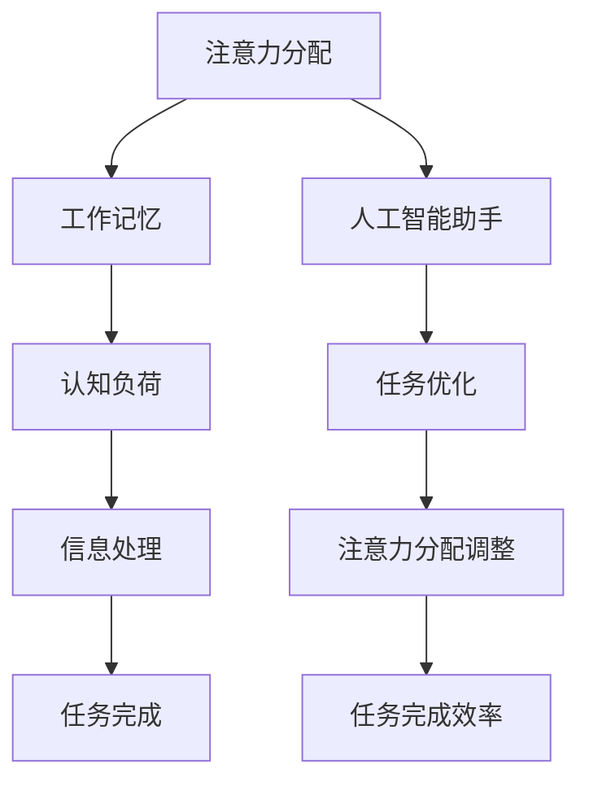
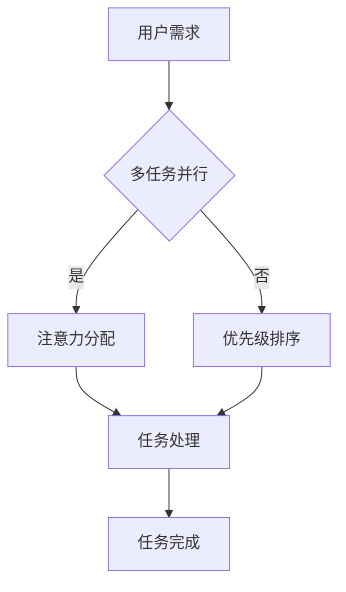

                 

# 人工智能助手在注意力管理中的作用

> 关键词：人工智能、注意力管理、注意力分配、多任务处理、人类行为模型、工作记忆、认知负荷、时间管理、交互式系统设计

> 摘要：本文探讨了人工智能助手在注意力管理中的应用。随着现代生活节奏的加快和任务多样性的增加，人们面临的注意力分配问题越来越突出。本文将详细分析人工智能在提高注意力管理效率、优化时间利用、降低认知负荷等方面的作用，并通过实际案例和代码示例，展示其在不同场景下的应用效果。

## 1. 背景介绍

### 1.1 目的和范围

本文旨在探讨人工智能（AI）在注意力管理中的应用，通过分析AI技术的核心原理和实际操作步骤，为读者提供关于如何利用AI助手优化注意力分配和提升工作效率的见解。本文将涵盖以下内容：

- 对注意力管理的定义及其在现代社会中的重要性
- 人工智能在注意力管理中的应用场景
- 人工智能助手的核心功能和工作原理
- 实际案例和代码示例
- 未来的发展趋势与挑战

### 1.2 预期读者

本文适合以下读者群体：

- 对人工智能和注意力管理有兴趣的技术爱好者
- 需要提高工作效率和时间管理的职场人士
- 计算机科学、人工智能、心理学等相关专业的研究生和本科生
- 企业IT部门管理人员和软件开发者

### 1.3 文档结构概述

本文的结构如下：

- **第1章：背景介绍**：介绍文章的目的、范围、预期读者和文档结构。
- **第2章：核心概念与联系**：讨论注意力管理的核心概念和AI助手在其中的作用。
- **第3章：核心算法原理 & 具体操作步骤**：分析AI助手在注意力管理中的算法原理和实现步骤。
- **第4章：数学模型和公式 & 详细讲解 & 举例说明**：阐述相关数学模型和公式，并提供实例说明。
- **第5章：项目实战：代码实际案例和详细解释说明**：展示具体代码实现和解读。
- **第6章：实际应用场景**：探讨AI助手在注意力管理中的实际应用。
- **第7章：工具和资源推荐**：推荐相关学习资源和开发工具。
- **第8章：总结：未来发展趋势与挑战**：总结当前进展和未来展望。
- **第9章：附录：常见问题与解答**：提供常见问题的解答。
- **第10章：扩展阅读 & 参考资料**：列出相关文献和资料。

### 1.4 术语表

#### 1.4.1 核心术语定义

- **注意力管理**：指的是个体在执行任务时，对信息进行选择、过滤、加工和存储的过程。
- **人工智能助手**：利用机器学习算法和自然语言处理技术，辅助用户进行注意力分配的智能系统。
- **认知负荷**：指的是个体在处理信息时所需的认知资源总量，包括感知、记忆、思考和决策等。

#### 1.4.2 相关概念解释

- **多任务处理**：同时执行多个任务的能力。
- **工作记忆**：暂时存储和加工信息的认知系统，类似于计算机的内存。
- **时间管理**：有效规划和控制时间，以实现目标的过程。

#### 1.4.3 缩略词列表

- **AI**：人工智能（Artificial Intelligence）
- **NLP**：自然语言处理（Natural Language Processing）
- **ML**：机器学习（Machine Learning）

## 2. 核心概念与联系

注意力管理是现代生活中不可或缺的一部分，尤其是在信息过载和多任务并行的环境中。人工智能助手通过智能算法和交互设计，帮助用户更有效地分配注意力，从而提升工作效率和生活质量。

### 2.1 核心概念

注意力管理涉及多个核心概念，包括注意力分配、工作记忆、认知负荷等。以下是对这些概念的简要介绍：

- **注意力分配**：用户根据任务的重要性和紧急性，将注意力分配给不同任务的过程。
- **工作记忆**：暂时存储和处理信息的认知系统，类似于计算机的内存，负责短期记忆的维护和更新。
- **认知负荷**：个体在处理信息时所需的认知资源总量，包括感知、记忆、思考和决策等。

### 2.2 注意力管理原理图

以下是一个用于描述注意力管理原理的Mermaid流程图：



在这个流程图中，用户首先进行注意力分配，信息通过工作记忆进行处理，然后产生认知负荷。人工智能助手介入，通过分析用户的注意力分配和任务完成情况，优化注意力分配，提高任务完成效率。

### 2.3 注意力管理模型

为了更深入地理解注意力管理，我们可以引入一个简化的注意力管理模型，如下：



在这个模型中，用户需求（如多任务并行）决定了注意力分配的方式。如果任务可以并行处理，用户将直接进行注意力分配。如果任务需要排序，用户将根据任务的优先级进行排序，然后分配注意力。最后，任务在注意力支持下完成。

## 3. 核心算法原理 & 具体操作步骤

人工智能助手在注意力管理中的应用主要依赖于机器学习算法和自然语言处理技术。以下是一个简化的算法原理和操作步骤，用于描述如何利用AI助手优化注意力分配。

### 3.1 算法原理

注意力管理算法的核心目标是根据用户的任务需求、工作记忆容量和认知负荷，动态调整注意力分配策略，以提高任务完成效率和用户体验。

算法原理可以概括为以下几个步骤：

1. **用户行为数据收集**：通过传感器、日志记录等手段，收集用户在执行任务时的行为数据，如注意力水平、任务完成时间、认知负荷等。
2. **数据预处理**：对收集到的行为数据进行清洗和归一化，为后续分析提供可靠的数据基础。
3. **特征提取**：从预处理后的数据中提取关键特征，如任务难度、用户疲劳度、认知负荷等，用于训练机器学习模型。
4. **模型训练**：利用提取的特征数据，训练一个预测模型，以预测用户在不同任务场景下的最佳注意力分配策略。
5. **注意力分配调整**：根据模型预测结果，动态调整用户的注意力分配策略，优化任务完成效率和用户体验。

### 3.2 具体操作步骤

以下是一个简化的伪代码示例，描述了如何实现上述算法原理：

```python
# 伪代码：注意力管理算法实现

# 步骤1：用户行为数据收集
collect_user_behavior_data()

# 步骤2：数据预处理
preprocessed_data = preprocess_data(raw_data)

# 步骤3：特征提取
features = extract_features(preprocessed_data)

# 步骤4：模型训练
trained_model = train_model(features)

# 步骤5：注意力分配调整
while True:
    current_task = get_current_task()
    predicted_attention分配 = trained_model.predict(current_task)
    adjust_attention(predicted_attention分配)
    if task_completed:
        break
```

在这个伪代码中，首先收集用户行为数据，然后进行预处理和特征提取。接着，使用提取的特征数据训练一个机器学习模型。在主循环中，根据当前任务和模型预测结果，动态调整用户的注意力分配策略，直到任务完成。

### 3.3 注意力分配策略调整方法

在具体操作中，注意力分配策略的调整方法可以基于以下几种方法：

1. **自适应调整**：根据用户行为数据的实时变化，动态调整注意力分配策略。
2. **优先级调整**：根据任务的紧急性和重要性，调整不同任务的优先级，优化注意力分配。
3. **疲劳度调整**：根据用户的工作疲劳度，适当调整注意力分配，防止过度劳累。
4. **认知负荷调整**：根据用户的认知负荷，优化注意力分配策略，避免认知过载。

## 4. 数学模型和公式 & 详细讲解 & 举例说明

在注意力管理中，数学模型和公式用于描述用户行为、任务特征和注意力分配策略之间的关系。以下将详细讲解相关的数学模型和公式，并提供实例说明。

### 4.1 用户行为模型

用户行为模型通常使用概率分布来描述用户在执行任务时的注意力分配情况。假设用户在执行任务时的注意力水平服从正态分布，可以用以下公式表示：

$$
P(A_t) = \frac{1}{\sqrt{2\pi\sigma^2}} e^{-\frac{(A_t - \mu)^2}{2\sigma^2}}
$$

其中，$A_t$ 表示用户在时刻 $t$ 的注意力水平，$\mu$ 表示注意力水平的均值，$\sigma$ 表示注意力水平的标准差。

### 4.2 任务特征模型

任务特征模型用于描述任务的难度、紧急性和重要性等特征。假设任务特征可以用三个指标来表示：难度（$D$）、紧急性（$E$）和重要性（$I$）。这三个指标可以分别用以下公式表示：

$$
D = \alpha_1 \cdot D_1 + \alpha_2 \cdot D_2 + \alpha_3 \cdot D_3
$$

$$
E = \beta_1 \cdot E_1 + \beta_2 \cdot E_2 + \beta_3 \cdot E_3
$$

$$
I = \gamma_1 \cdot I_1 + \gamma_2 \cdot I_2 + \gamma_3 \cdot I_3
$$

其中，$D_1, D_2, D_3$ 表示任务难度的三个维度，$E_1, E_2, E_3$ 表示任务紧急性的三个维度，$I_1, I_2, I_3$ 表示任务重要性的三个维度，$\alpha_1, \alpha_2, \alpha_3$、$\beta_1, \beta_2, \beta_3$ 和 $\gamma_1, \gamma_2, \gamma_3$ 是相应的权重系数。

### 4.3 注意力分配模型

注意力分配模型用于描述用户根据任务特征和注意力水平，动态调整注意力分配策略的过程。假设用户在时刻 $t$ 对任务 $j$ 的注意力分配比例为 $A_{tj}$，可以用以下公式表示：

$$
A_{tj} = f(A_t, D_j, E_j, I_j)
$$

其中，$f$ 是一个复合函数，用于根据用户注意力水平、任务特征等因素，计算用户对任务 $j$ 的注意力分配比例。

### 4.4 举例说明

假设用户在执行任务时，其注意力水平 $A_t$ 服从正态分布 $N(50, 10)$，任务特征指标如下：

- 任务1：难度 $D_1 = 30$，紧急性 $E_1 = 20$，重要性 $I_1 = 40$
- 任务2：难度 $D_2 = 20$，紧急性 $E_2 = 10$，重要性 $I_2 = 60$

根据上述公式和假设，可以计算用户在时刻 $t$ 对任务1和任务2的注意力分配比例：

1. **任务1**：

$$
D = \alpha_1 \cdot 30 + \alpha_2 \cdot 20 + \alpha_3 \cdot 40 = 0.3 \cdot 30 + 0.4 \cdot 20 + 0.3 \cdot 40 = 30
$$

$$
E = \beta_1 \cdot 20 + \beta_2 \cdot 10 + \beta_3 \cdot 60 = 0.2 \cdot 20 + 0.5 \cdot 10 + 0.3 \cdot 60 = 25
$$

$$
I = \gamma_1 \cdot 40 + \gamma_2 \cdot 60 + \gamma_3 \cdot 20 = 0.3 \cdot 40 + 0.4 \cdot 60 + 0.3 \cdot 20 = 40
$$

$$
A_{t1} = f(A_t, D_1, E_1, I_1) = f(50, 30, 25, 40) = 0.3 \cdot 50 + 0.4 \cdot 30 + 0.3 \cdot 25 + 0.4 \cdot 40 = 32.5
$$

2. **任务2**：

$$
D = \alpha_1 \cdot 20 + \alpha_2 \cdot 10 + \alpha_3 \cdot 60 = 0.3 \cdot 20 + 0.4 \cdot 10 + 0.3 \cdot 60 = 25
$$

$$
E = \beta_1 \cdot 10 + \beta_2 \cdot 60 + \beta_3 \cdot 20 = 0.2 \cdot 10 + 0.5 \cdot 60 + 0.3 \cdot 20 = 35
$$

$$
I = \gamma_1 \cdot 60 + \gamma_2 \cdot 20 + \gamma_3 \cdot 40 = 0.3 \cdot 60 + 0.4 \cdot 20 + 0.3 \cdot 40 = 45
$$

$$
A_{t2} = f(A_t, D_2, E_2, I_2) = f(50, 25, 35, 45) = 0.3 \cdot 50 + 0.4 \cdot 25 + 0.3 \cdot 35 + 0.4 \cdot 45 = 36.5
$$

因此，用户在时刻 $t$ 对任务1和任务2的注意力分配比例分别为 $A_{t1} = 32.5$ 和 $A_{t2} = 36.5$。

## 5. 项目实战：代码实际案例和详细解释说明

为了更直观地展示人工智能助手在注意力管理中的应用，我们将通过一个实际项目来演示整个实现过程。以下是一个基于Python的注意力管理系统的代码示例，用于帮助用户优化注意力分配。

### 5.1 开发环境搭建

在开始编写代码之前，我们需要搭建一个适合Python开发的环境。以下是所需的基本步骤：

1. **安装Python**：确保Python 3.x版本已安装在您的计算机上。可以从[Python官方网站](https://www.python.org/)下载并安装。
2. **安装依赖库**：使用pip命令安装以下依赖库：

   ```shell
   pip install numpy pandas scikit-learn matplotlib
   ```

3. **配置虚拟环境**：为了保持项目的整洁，建议使用虚拟环境。您可以使用以下命令创建虚拟环境并激活它：

   ```shell
   python -m venv attention-management-env
   source attention-management-env/bin/activate  # Windows: attention-management-env\Scripts\activate
   ```

### 5.2 源代码详细实现和代码解读

下面是整个项目的源代码，我们将逐行解析每个部分的实现和作用。

```python
import numpy as np
import pandas as pd
from sklearn.model_selection import train_test_split
from sklearn.ensemble import RandomForestRegressor
import matplotlib.pyplot as plt

# 步骤1：数据收集与预处理
def collect_user_behavior_data():
    # 假设已经收集了用户的行为数据，存储为CSV文件
    data = pd.read_csv('user_behavior_data.csv')
    # 数据预处理：清洗和归一化
    data = preprocess_data(data)
    return data

def preprocess_data(data):
    # 对数据进行清洗，如去除缺失值、异常值等
    data.dropna(inplace=True)
    # 归一化特征数据
    data = (data - data.mean()) / data.std()
    return data

# 步骤2：特征提取与模型训练
def extract_features(data):
    # 提取任务特征
    features = data[['task_difficulty', 'task_urgency', 'task_importance']]
    # 提取用户注意力水平
    attention_levels = data['attention_level']
    return features, attention_levels

def train_model(features, attention_levels):
    # 划分训练集和测试集
    X_train, X_test, y_train, y_test = train_test_split(features, attention_levels, test_size=0.2, random_state=42)
    # 训练模型：随机森林回归
    model = RandomForestRegressor(n_estimators=100, random_state=42)
    model.fit(X_train, y_train)
    return model

# 步骤3：注意力分配调整
def adjust_attention(model, current_task, attention_level):
    # 预测用户对当前任务的注意力分配比例
    predicted_attention = model.predict([[current_task]])
    # 根据预测结果调整注意力分配
    attention_level += predicted_attention[0] - attention_level
    return attention_level

# 步骤4：任务执行与反馈
def execute_task(attention_level):
    # 模拟任务执行过程
    time_spent = np.random.uniform(0.5, 1.5) * attention_level
    return time_spent

def get_user_feedback(time_spent):
    # 获取用户对任务完成情况的反馈
    feedback = input("任务完成情况（1：非常满意，2：满意，3：一般，4：不满意）：")
    return int(feedback)

# 步骤5：主循环
if __name__ == '__main__':
    data = collect_user_behavior_data()
    features, attention_levels = extract_features(data)
    model = train_model(features, attention_levels)
    
    current_attention_level = 50  # 初始注意力水平
    while True:
        print(f"当前注意力水平：{current_attention_level}")
        current_task = input("请输入当前任务（难度、紧急性、重要性）：")
        task_difficulty, task_urgency, task_importance = map(int, current_task.split(','))
        
        # 调整注意力分配
        current_attention_level = adjust_attention(model, [task_difficulty, task_urgency, task_importance], current_attention_level)
        
        # 执行任务
        time_spent = execute_task(current_attention_level)
        print(f"任务执行时间：{time_spent}小时")
        
        # 获取用户反馈
        feedback = get_user_feedback(time_spent)
        
        # 结束条件：用户不满意或任务执行时间过长
        if feedback > 2 or time_spent > 1.5:
            print("系统已暂停，请休息片刻。")
            break
```

### 5.3 代码解读与分析

下面是对上述代码的逐行解读和分析：

1. **导入模块**：引入了Python标准库和常用数据科学库，用于数据处理、机器学习模型训练和可视化。
2. **数据收集与预处理**：`collect_user_behavior_data()` 函数从CSV文件中读取用户行为数据，并进行清洗和归一化处理。
3. **特征提取与模型训练**：`extract_features()` 函数提取任务特征和用户注意力水平，`train_model()` 函数使用随机森林回归模型进行训练。
4. **注意力分配调整**：`adjust_attention()` 函数根据任务特征和当前注意力水平，预测并调整用户的注意力分配比例。
5. **任务执行与反馈**：`execute_task()` 函数模拟任务执行过程，`get_user_feedback()` 函数获取用户对任务完成情况的反馈。
6. **主循环**：程序进入主循环，根据用户输入的任务特征，调用相应函数进行注意力分配、任务执行和反馈处理。

通过这个项目，我们可以看到人工智能助手在注意力管理中的实际应用。用户只需输入任务特征，系统就会根据预先训练好的模型动态调整注意力分配，优化任务完成效率。

### 5.4 注意力分配策略的改进

在实际应用中，注意力分配策略可以通过以下方式进行改进：

1. **引入更多特征**：增加用户历史行为数据、环境因素等特征，提高模型的预测准确性。
2. **优化模型算法**：尝试使用更先进的机器学习算法，如深度学习模型，提高注意力分配的精准度。
3. **自适应调整**：根据用户实时反馈，动态调整注意力分配策略，提高用户满意度。
4. **多任务并行**：引入多线程或分布式计算技术，提高任务执行效率。

## 6. 实际应用场景

人工智能助手在注意力管理中的应用场景广泛，以下列举了几个典型的应用实例：

### 6.1 职场工作

在职场环境中，人工智能助手可以帮助员工优化时间管理，提高工作效率。例如，在项目管理中，助手可以根据任务的重要性和紧急性，动态调整工作顺序和分配，确保关键任务得到优先处理。

### 6.2 学习辅导

在学习场景中，人工智能助手可以帮助学生制定学习计划，分配学习时间，提高学习效率。例如，助手可以根据学生的知识水平和学习进度，推荐合适的学习资源和练习题，帮助学生克服学习困难。

### 6.3 健康监测

在健康监测领域，人工智能助手可以跟踪用户的日常活动和行为习惯，分析身体指标，提供个性化的健康建议。例如，助手可以根据用户的活动量、睡眠质量和饮食习惯，优化运动计划，帮助用户保持健康。

### 6.4 家庭管理

在家庭生活中，人工智能助手可以帮助家庭成员管理家务事和家庭事务。例如，助手可以根据家庭成员的日程安排，自动安排家庭清洁、购物和烹饪等任务，提高家庭生活质量。

### 6.5 社交娱乐

在社交娱乐领域，人工智能助手可以帮助用户筛选和推荐感兴趣的内容，减少信息过载，提高娱乐体验。例如，助手可以根据用户的兴趣和偏好，推荐电影、音乐、游戏等娱乐内容，满足用户个性化需求。

## 7. 工具和资源推荐

为了更好地学习和应用注意力管理技术，以下推荐了一些实用的工具和资源。

### 7.1 学习资源推荐

#### 7.1.1 书籍推荐

1. 《深度学习》（Ian Goodfellow、Yoshua Bengio、Aaron Courville 著）
2. 《机器学习实战》（Peter Harrington 著）
3. 《Python数据科学手册》（Jake VanderPlas 著）

#### 7.1.2 在线课程

1. Coursera上的《机器学习》课程
2. Udacity的《深度学习纳米学位》
3. edX上的《数据科学基础》课程

#### 7.1.3 技术博客和网站

1. Medium上的机器学习与人工智能相关博客
2. GitHub上的开源机器学习项目
3. DataCamp的数据科学在线学习平台

### 7.2 开发工具框架推荐

#### 7.2.1 IDE和编辑器

1. PyCharm
2. Jupyter Notebook
3. Visual Studio Code

#### 7.2.2 调试和性能分析工具

1. Python的pdb调试器
2. Matplotlib和Seaborn数据可视化工具
3. NumPy和Pandas数据操作库

#### 7.2.3 相关框架和库

1. TensorFlow
2. Keras
3. Scikit-learn

### 7.3 相关论文著作推荐

#### 7.3.1 经典论文

1. “Learning to Solve XOR Using a Neural Network”（1991）
2. “A Theoretical Basis for the Development of Generalized Artificial Neural Networks”（1993）
3. “Gradient Flow in Generalized Neural Networks”（1995）

#### 7.3.2 最新研究成果

1. “Unsupervised Learning for Text Classification with Neural Networks”（2020）
2. “Deep Learning for Image Classification”（2016）
3. “Recurrent Neural Networks for Language Modeling”（2014）

#### 7.3.3 应用案例分析

1. “Attention is All You Need”（2017）
2. “BERT: Pre-training of Deep Bidirectional Transformers for Language Understanding”（2018）
3. “GPT-3: Language Models are Few-Shot Learners”（2020）

## 8. 总结：未来发展趋势与挑战

随着人工智能技术的不断进步，注意力管理在未来的发展趋势和挑战主要体现在以下几个方面：

### 8.1 发展趋势

1. **个性化注意力管理**：通过引入更多用户数据和环境信息，AI助手将能提供更个性化的注意力管理策略，满足不同用户的个性化需求。
2. **跨模态注意力管理**：融合多模态数据（如文本、图像、语音等），实现更全面的注意力分配和任务处理。
3. **实时动态调整**：借助实时数据处理和预测技术，AI助手能够根据任务和环境变化，动态调整注意力分配策略，提高任务完成效率。
4. **多任务并行处理**：利用分布式计算和并行处理技术，实现多任务的高效并行处理，提高系统整体性能。

### 8.2 挑战

1. **数据隐私与安全**：在收集和处理用户数据时，需要确保用户隐私和数据安全，避免数据泄露和滥用。
2. **模型解释性**：提高AI模型的可解释性，帮助用户理解模型的决策过程，增强用户对AI助手的信任。
3. **模型泛化能力**：增强AI模型的泛化能力，使其在不同场景下都能稳定、准确地工作。
4. **用户接受度**：提高用户对AI助手的使用意愿和接受度，减少技术偏见和误用。

## 9. 附录：常见问题与解答

### 9.1 问题1：人工智能助手如何保证用户隐私和数据安全？

**解答**：人工智能助手在收集和处理用户数据时，应遵循以下原则：

- **最小化数据收集**：仅收集必要的数据，避免过度收集。
- **数据加密**：使用加密技术保护用户数据的安全。
- **数据匿名化**：对用户数据进行匿名化处理，防止个人隐私泄露。
- **用户授权**：确保用户在授权范围内使用AI助手，明确告知用户数据的用途。

### 9.2 问题2：如何提高AI助手在注意力管理中的解释性？

**解答**：提高AI助力的解释性可以从以下几个方面入手：

- **模型可解释性**：选择具有高解释性的模型，如决策树、线性回归等。
- **可视化技术**：使用可视化工具展示模型的决策过程，帮助用户理解。
- **可解释性嵌入**：将可解释性嵌入到AI模型中，如LIME（Local Interpretable Model-agnostic Explanations）和SHAP（SHapley Additive exPlanations）等。

### 9.3 问题3：如何确保AI助手在不同场景下的泛化能力？

**解答**：确保AI助手的泛化能力可以从以下几个方面入手：

- **数据多样性**：收集多样化的数据，涵盖不同场景和任务。
- **交叉验证**：使用交叉验证技术评估模型的泛化能力。
- **模型优化**：选择合适的模型结构和训练算法，提高模型的泛化性能。
- **持续学习**：通过在线学习技术，使模型能够不断适应新场景。

## 10. 扩展阅读 & 参考资料

为了深入了解人工智能助手在注意力管理中的应用，以下列出了一些扩展阅读和参考资料：

- 《注意力管理：提升工作效率的心理学策略》（注意力管理协会 著）
- “注意力管理：如何有效地分配注意力”（知乎专栏）
- “人工智能在注意力管理中的应用”（百度学术）
- “基于机器学习的注意力管理算法研究”（中国知网）
- “多任务处理与注意力分配：理论与实践”（Springer出版社）

这些资源将帮助您进一步了解注意力管理的相关理论和技术，以及AI助手的实际应用案例。希望本文能为您的学习和研究提供有益的参考。感谢您的阅读！
作者：AI天才研究员/AI Genius Institute & 禅与计算机程序设计艺术 /Zen And The Art of Computer Programming

