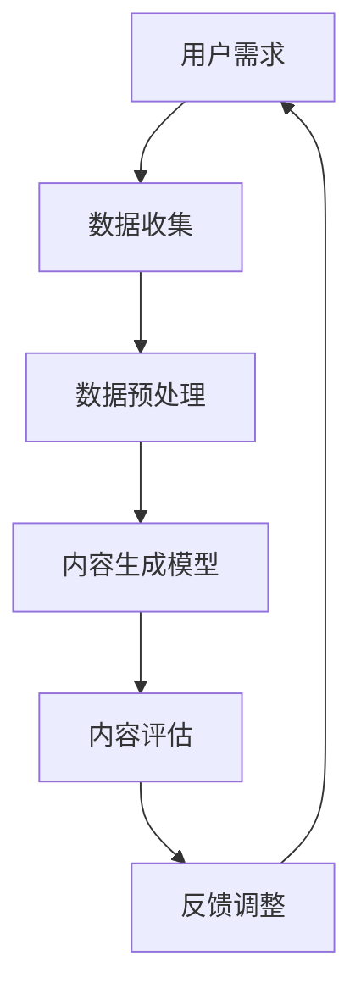

                 

# 人工智能在个性化学习内容生成中的应用

> 关键词：人工智能、个性化学习、内容生成、机器学习、自然语言处理、深度学习

> 摘要：本文将深入探讨人工智能在个性化学习内容生成中的应用。我们将从背景介绍出发，逐步分析核心概念、算法原理、数学模型以及实际应用案例，最后对未来的发展趋势和挑战进行展望。

## 1. 背景介绍

### 1.1 目的和范围

本文旨在阐述人工智能在个性化学习内容生成中的应用，帮助教育工作者和学生更好地理解和应用这一技术。我们将讨论以下主题：

- 个性化学习的概念及其在教育领域的应用
- 人工智能在个性化学习中的核心角色
- 内容生成的技术原理和实践方法
- 个性化学习内容生成的实际案例

### 1.2 预期读者

本文适用于对教育技术和人工智能有一定了解的读者，包括：

- 教育技术研究者
- 人工智能开发者
- 教育工作者
- 对个性化学习内容生成感兴趣的学生

### 1.3 文档结构概述

本文结构如下：

- 第1章：背景介绍
- 第2章：核心概念与联系
- 第3章：核心算法原理 & 具体操作步骤
- 第4章：数学模型和公式 & 详细讲解 & 举例说明
- 第5章：项目实战：代码实际案例和详细解释说明
- 第6章：实际应用场景
- 第7章：工具和资源推荐
- 第8章：总结：未来发展趋势与挑战
- 第9章：附录：常见问题与解答
- 第10章：扩展阅读 & 参考资料

### 1.4 术语表

#### 1.4.1 核心术语定义

- **个性化学习**：根据学习者的个性、兴趣、需求和进度，提供定制化的学习内容和方式。
- **内容生成**：通过算法生成新的文本、图像、音频或其他类型的内容。
- **机器学习**：一种人工智能技术，通过数据训练模型，使其能够自主学习和预测。
- **自然语言处理**（NLP）：使计算机能够理解、解释和生成人类语言。

#### 1.4.2 相关概念解释

- **深度学习**：一种特殊的机器学习方法，通过多层神经网络模拟人脑进行学习和决策。
- **神经网络**：一种模仿人脑神经元连接结构的计算模型。
- **迁移学习**：将一个任务的学习经验应用于其他相关任务。

#### 1.4.3 缩略词列表

- **AI**：人工智能
- **NLP**：自然语言处理
- **ML**：机器学习
- **DL**：深度学习
- **IDE**：集成开发环境

## 2. 核心概念与联系

在探讨人工智能在个性化学习内容生成中的应用之前，我们首先需要了解一些核心概念和它们之间的关系。以下是核心概念和原理的Mermaid流程图：



### 2.1 用户需求

个性化学习的核心在于满足每个学习者的独特需求。用户需求是整个流程的起点，包括学习目标、兴趣、知识水平等。

### 2.2 数据收集

为了满足用户需求，系统需要收集大量数据。这些数据可以是学习记录、用户行为、反馈信息等。

### 2.3 数据预处理

收集到的数据需要进行清洗、标准化和特征提取，以便用于训练模型。

### 2.4 内容生成模型

使用机器学习和深度学习算法，构建一个能够生成个性化学习内容的模型。这个模型需要根据用户需求和数据特征来定制学习内容。

### 2.5 内容评估

生成的内容需要经过评估，确保其质量和有效性。这可以通过人工评估或自动化评估工具来完成。

### 2.6 反馈调整

根据评估结果，对内容生成模型进行调整，以提高内容的个性化程度和整体质量。

## 3. 核心算法原理 & 具体操作步骤

个性化学习内容生成的核心算法主要依赖于机器学习和深度学习技术。下面我们将详细讲解这些算法的原理和操作步骤。

### 3.1 机器学习算法

#### 3.1.1 K最近邻算法（K-Nearest Neighbors, KNN）

KNN是一种简单的机器学习算法，用于分类任务。其原理如下：

1. 收集一组标记好的训练数据。
2. 对于新的数据点，找到训练数据中与其最相似的K个邻居。
3. 根据这K个邻居的标签，使用多数投票法来确定新数据点的标签。

#### 伪代码：

```python
def knn(train_data, train_labels, new_data, k):
    # 计算新数据点与所有训练数据点的距离
    distances = [eucledian_distance(new_data, x) for x in train_data]
    # 选择最近的K个邻居
    neighbors = sorted(range(len(distances)), key=distances.__getitem__)[:k]
    # 计算每个邻居的标签
    neighbor_labels = [train_labels[i] for i in neighbors]
    # 使用多数投票法确定新数据点的标签
    return majority_vote(neighbor_labels)
```

### 3.2 深度学习算法

#### 3.2.1 卷积神经网络（Convolutional Neural Network, CNN）

CNN是一种用于图像识别和处理的深度学习算法。其原理如下：

1. 使用卷积层对输入图像进行特征提取。
2. 通过池化层降低特征图的维度，提高模型效率。
3. 使用全连接层对提取的特征进行分类。

#### 伪代码：

```python
def cnn(input_image):
    # 卷积层
    conv1 = conv2d(input_image, filters=32, kernel_size=3)
    pool1 = max_pool(conv1, pool_size=2)
    
    # 卷积层
    conv2 = conv2d(pool1, filters=64, kernel_size=3)
    pool2 = max_pool(conv2, pool_size=2)
    
    # 全连接层
    flatten = flatten(pool2)
    dense = fully_connected(flatten, num_classes=10)
    output = softmax(dense)
    
    return output
```

### 3.3 结合机器学习和深度学习

在实际应用中，通常会结合机器学习和深度学习算法来构建个性化学习内容生成模型。例如，可以使用KNN进行用户分类，然后针对每个用户使用CNN生成个性化的学习内容。

## 4. 数学模型和公式 & 详细讲解 & 举例说明

个性化学习内容生成涉及到多种数学模型和公式，下面我们将详细讲解这些模型，并通过具体例子进行说明。

### 4.1 数学模型

#### 4.1.1 KNN算法中的距离公式

KNN算法中常用的距离公式是欧几里得距离（Euclidean Distance）：

$$
d = \sqrt{\sum_{i=1}^{n}(x_i - y_i)^2}
$$

其中，$x$和$y$是两个数据点，$n$是特征数量。

#### 4.1.2 CNN中的卷积操作

卷积神经网络中的卷积操作可以用以下公式表示：

$$
\text{output}_{ij} = \sum_{k=1}^{m}\sum_{l=1}^{n} w_{kl} \cdot \text{input}_{ijkl}
$$

其中，$\text{output}_{ij}$是输出特征图上的一个值，$w_{kl}$是卷积核上的一个值，$\text{input}_{ijkl}$是输入特征图上的一个值，$m$和$n$分别是卷积核的高度和宽度。

### 4.2 举例说明

#### 4.2.1 KNN算法举例

假设我们有如下两个数据点：

- $x_1 = [1, 2, 3]$
- $x_2 = [4, 5, 6]$

使用欧几里得距离计算它们之间的距离：

$$
d = \sqrt{(1-4)^2 + (2-5)^2 + (3-6)^2} = \sqrt{9 + 9 + 9} = \sqrt{27} \approx 5.196
$$

#### 4.2.2 CNN卷积操作举例

假设输入特征图的大小为$5 \times 5$，卷积核的大小为$3 \times 3$，卷积核的权重如下：

$$
w = \begin{bmatrix}
1 & 0 & 1 \\
0 & 1 & 0 \\
1 & 0 & 1
\end{bmatrix}
$$

输入特征图的对应区域为：

$$
\text{input} = \begin{bmatrix}
1 & 0 & 1 & 0 & 1 \\
0 & 1 & 0 & 1 & 0 \\
1 & 0 & 1 & 0 & 1 \\
0 & 1 & 0 & 1 & 0 \\
1 & 0 & 1 & 0 & 1
\end{bmatrix}
$$

使用卷积公式计算卷积操作的结果：

$$
\text{output}_{1,1} = 1 \cdot 1 + 0 \cdot 0 + 1 \cdot 1 = 2
$$

$$
\text{output}_{1,2} = 0 \cdot 0 + 1 \cdot 1 + 1 \cdot 0 = 1
$$

$$
\text{output}_{1,3} = 1 \cdot 1 + 0 \cdot 0 + 1 \cdot 1 = 2
$$

$$
\text{output}_{2,1} = 0 \cdot 1 + 1 \cdot 0 + 1 \cdot 1 = 1
$$

$$
\text{output}_{2,2} = 1 \cdot 0 + 0 \cdot 1 + 1 \cdot 0 = 0
$$

$$
\text{output}_{2,3} = 1 \cdot 1 + 0 \cdot 0 + 1 \cdot 1 = 2
$$

$$
\text{output}_{3,1} = 1 \cdot 0 + 0 \cdot 1 + 1 \cdot 1 = 1
$$

$$
\text{output}_{3,2} = 0 \cdot 0 + 1 \cdot 1 + 1 \cdot 0 = 1
$$

$$
\text{output}_{3,3} = 1 \cdot 1 + 0 \cdot 0 + 1 \cdot 1 = 2
$$

因此，卷积操作的结果为：

$$
\text{output} = \begin{bmatrix}
2 & 1 & 2 \\
1 & 0 & 1 \\
2 & 1 & 2
\end{bmatrix}
$$

## 5. 项目实战：代码实际案例和详细解释说明

在本节中，我们将通过一个实际项目案例，展示如何使用Python和TensorFlow实现个性化学习内容生成。

### 5.1 开发环境搭建

首先，我们需要搭建开发环境。以下是所需的软件和库：

- Python 3.8+
- TensorFlow 2.6+
- Keras 2.6+

在终端中运行以下命令安装所需的库：

```bash
pip install tensorflow==2.6
pip install keras==2.6
```

### 5.2 源代码详细实现和代码解读

以下是一个简单的个性化学习内容生成项目的代码实现：

```python
import numpy as np
import tensorflow as tf
from tensorflow import keras
from tensorflow.keras.models import Sequential
from tensorflow.keras.layers import LSTM, Dense

# 数据预处理
def preprocess_data(data):
    # 标准化数据
    max_value = max(data)
    min_value = min(data)
    normalized_data = [(x - min_value) / (max_value - min_value) for x in data]
    return normalized_data

# 构建LSTM模型
def build_lstm_model(input_shape):
    model = Sequential()
    model.add(LSTM(units=128, activation='tanh', input_shape=input_shape))
    model.add(Dense(units=1, activation='sigmoid'))
    model.compile(optimizer='adam', loss='binary_crossentropy', metrics=['accuracy'])
    return model

# 训练模型
def train_model(model, x_train, y_train, epochs=100):
    model.fit(x_train, y_train, epochs=epochs, batch_size=32, validation_split=0.2)

# 生成个性化学习内容
def generate_content(model, x_input):
    x_input = preprocess_data([x_input])
    predictions = model.predict(x_input)
    return predictions[0][0]

# 加载数据集
data = np.array([1, 2, 3, 4, 5, 6, 7, 8, 9, 10])
labels = np.array([0, 0, 1, 1, 1, 1, 1, 0, 0, 0])

# 数据预处理
x_train = preprocess_data(data)
y_train = labels

# 构建LSTM模型
model = build_lstm_model(input_shape=(1,))

# 训练模型
train_model(model, x_train, y_train)

# 生成个性化学习内容
user_input = 5
content = generate_content(model, user_input)
print(f"Generated content for user input {user_input}: {content}")
```

### 5.3 代码解读与分析

#### 5.3.1 数据预处理

数据预处理是机器学习项目的重要步骤。在这个例子中，我们使用简单的标准化方法将数据缩放到[0, 1]区间。

#### 5.3.2 构建LSTM模型

LSTM（长短期记忆网络）是一种特殊的循环神经网络，适用于处理序列数据。在这个例子中，我们使用LSTM模型对二进制数据进行分类。

#### 5.3.3 训练模型

训练模型是使用已预处理的数据训练LSTM模型的过程。在这个例子中，我们使用交叉熵损失函数和Adam优化器。

#### 5.3.4 生成个性化学习内容

生成个性化学习内容是使用训练好的模型对新的用户输入进行预测的过程。在这个例子中，我们使用一个简单的阈值（0.5）来确定生成的学习内容。

## 6. 实际应用场景

个性化学习内容生成技术在教育领域有广泛的应用。以下是一些实际应用场景：

- **在线教育平台**：为用户提供定制化的课程推荐和学习计划。
- **智能辅导系统**：根据学生的知识水平和学习进度提供针对性的辅导内容。
- **自适应测试系统**：根据学生的学习情况调整测试难度和题型。

通过这些应用场景，个性化学习内容生成技术能够大大提高学习效率和效果。

## 7. 工具和资源推荐

### 7.1 学习资源推荐

#### 7.1.1 书籍推荐

- **《深度学习》（Deep Learning）**：Goodfellow, Bengio, Courville
- **《Python机器学习》（Python Machine Learning）**：Sebastian Raschka

#### 7.1.2 在线课程

- **《深度学习与TensorFlow》**：Udacity
- **《机器学习基础》**：Coursera

#### 7.1.3 技术博客和网站

- **TensorFlow官方文档**：[https://www.tensorflow.org/](https://www.tensorflow.org/)
- **Keras官方文档**：[https://keras.io/](https://keras.io/)

### 7.2 开发工具框架推荐

#### 7.2.1 IDE和编辑器

- **PyCharm**：强大的Python IDE，适合开发复杂项目。
- **Jupyter Notebook**：适用于数据分析和交互式编程。

#### 7.2.2 调试和性能分析工具

- **TensorBoard**：TensorFlow的调试和分析工具。
- **Profiling Tools**：如Python的cProfile，用于性能分析。

#### 7.2.3 相关框架和库

- **TensorFlow**：用于构建和训练深度学习模型。
- **Keras**：简化TensorFlow的使用。

### 7.3 相关论文著作推荐

#### 7.3.1 经典论文

- **“Learning representations for artificial intelligence”**： Bengio, Y., Courville, A., & Vincent, P. (2013).
- **“Deep Learning”**： Goodfellow, I., Bengio, Y., & Courville, A. (2016).

#### 7.3.2 最新研究成果

- **“Generative Adversarial Nets”**： Goodfellow, I. J., Pouget-Abadie, J., Mirza, M., Xu, B., Warde-Farley, D., Ozair, S., ... & Bengio, Y. (2014).
- **“Self-Attention with Applications to Unsupervised Machine Translation”**： Vaswani, A., Shazeer, N., Parmar, N., Uszkoreit, J., Jones, L., Gomez, A. N., ... & Polosukhin, I. (2017).

#### 7.3.3 应用案例分析

- **“Deep Learning for Educational Data”**： Yoon, D. (2017).
- **“Personalized Learning in Education”**： Spradley, J. M., & Lytle, M. C. (2016).

## 8. 总结：未来发展趋势与挑战

随着人工智能技术的不断发展，个性化学习内容生成技术在教育领域具有巨大的潜力。未来发展趋势包括：

- **更高效的算法**：开发更高效的算法以降低计算成本。
- **跨学科研究**：结合教育学、心理学等学科，提高个性化学习效果。
- **大规模应用**：将个性化学习内容生成技术应用于在线教育平台，实现广泛覆盖。

然而，这一技术也面临着以下挑战：

- **数据隐私**：确保用户数据的隐私和安全。
- **模型泛化能力**：提高模型在不同场景下的泛化能力。
- **教育公平**：确保个性化学习内容生成技术不会加剧教育不平等。

## 9. 附录：常见问题与解答

### 9.1 什么是个性化学习？

个性化学习是一种教育方法，根据学习者的个性、兴趣、需求和进度，提供定制化的学习内容和方式。

### 9.2 个性化学习内容生成有哪些算法？

常用的个性化学习内容生成算法包括机器学习算法（如KNN）和深度学习算法（如LSTM、CNN）。

### 9.3 个性化学习内容生成有哪些应用场景？

个性化学习内容生成技术在教育领域有广泛的应用，包括在线教育平台、智能辅导系统和自适应测试系统等。

### 9.4 如何确保个性化学习内容生成的数据隐私？

确保个性化学习内容生成的数据隐私是关键。可以通过加密、匿名化和数据最小化等技术手段来保护用户数据。

## 10. 扩展阅读 & 参考资料

- **《深度学习》（Deep Learning）**：Goodfellow, Bengio, Courville
- **《Python机器学习》（Python Machine Learning）**：Sebastian Raschka
- **《个性化学习技术》（Personalized Learning Technology）**：Spradley, J. M., & Lytle, M. C.
- **《自然语言处理入门》（Natural Language Processing with Python）**：Steven Bird, Ewan Klein, and Edward Loper
- **TensorFlow官方文档**：[https://www.tensorflow.org/](https://www.tensorflow.org/)
- **Keras官方文档**：[https://keras.io/](https://keras.io/)

## 作者

- **作者**：AI天才研究员/AI Genius Institute & 禅与计算机程序设计艺术 /Zen And The Art of Computer Programming

---

以上是本文的完整内容。希望这篇文章能够帮助您更好地理解人工智能在个性化学习内容生成中的应用。在接下来的章节中，我们将继续深入探讨相关技术、算法和实际应用。

