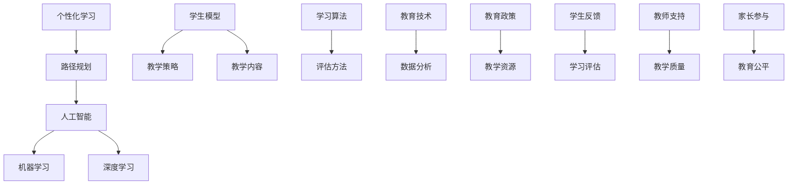

                 

# 人工智能在个性化学习路径规划中的应用

> 关键词：个性化学习、路径规划、人工智能、机器学习、深度学习、教育技术、学习算法、学生模型、教学策略

> 摘要：本文将探讨人工智能在个性化学习路径规划中的应用。首先介绍个性化学习的背景和重要性，然后详细阐述路径规划的概念和核心算法，接着分析人工智能如何通过机器学习和深度学习等技术来实现个性化学习路径规划。最后，本文将探讨实际应用场景、推荐相关工具和资源，并对未来发展趋势和挑战进行总结。

## 1. 背景介绍

### 1.1 目的和范围

本文旨在探讨人工智能（AI）在个性化学习路径规划中的应用，为教育技术的进步提供理论支持和实践指导。文章将首先介绍个性化学习的概念和背景，然后详细阐述路径规划在教育中的应用，最后分析人工智能技术如何助力个性化学习路径规划。

### 1.2 预期读者

本文适合对教育技术和人工智能有一定了解的读者，包括教育工作者、研究人员、软件开发人员以及对个性化学习感兴趣的普通大众。通过本文的阅读，读者将能够了解个性化学习路径规划的基本原理、核心算法和应用场景。

### 1.3 文档结构概述

本文结构如下：

1. 背景介绍
   - 1.1 目的和范围
   - 1.2 预期读者
   - 1.3 文档结构概述
   - 1.4 术语表
2. 核心概念与联系
   - 2.1 核心概念
   - 2.2 联系与架构
3. 核心算法原理 & 具体操作步骤
   - 3.1 算法原理
   - 3.2 操作步骤
4. 数学模型和公式 & 详细讲解 & 举例说明
   - 4.1 数学模型
   - 4.2 公式讲解
   - 4.3 举例说明
5. 项目实战：代码实际案例和详细解释说明
   - 5.1 开发环境搭建
   - 5.2 源代码详细实现和代码解读
   - 5.3 代码解读与分析
6. 实际应用场景
7. 工具和资源推荐
   - 7.1 学习资源推荐
   - 7.2 开发工具框架推荐
   - 7.3 相关论文著作推荐
8. 总结：未来发展趋势与挑战
9. 附录：常见问题与解答
10. 扩展阅读 & 参考资料

### 1.4 术语表

#### 1.4.1 核心术语定义

- 个性化学习：根据学生的学习需求、兴趣和能力，为其提供定制化的学习内容、教学策略和评估方法。
- 路径规划：在给定的环境和约束条件下，寻找一条最优的路径以实现特定目标。
- 人工智能：模拟人类智能行为的计算机科学领域，包括机器学习、深度学习、自然语言处理等。
- 机器学习：通过数据驱动的方式，使计算机系统能够自动学习和改进性能。
- 深度学习：一种特殊的机器学习技术，通过模拟人脑结构和信息处理方式，解决复杂问题。

#### 1.4.2 相关概念解释

- 学生模型：描述学生学习行为、兴趣和能力的模型，用于个性化学习路径规划。
- 教学策略：根据学生模型和教学内容，设计的教学方法和策略。

#### 1.4.3 缩略词列表

- AI：人工智能
- ML：机器学习
- DL：深度学习
- EDU：教育

## 2. 核心概念与联系

为了更好地理解人工智能在个性化学习路径规划中的应用，我们需要先了解相关核心概念和它们之间的联系。以下是一个Mermaid流程图，展示了核心概念和架构：



在这个流程图中，个性化学习作为核心目标，通过路径规划、人工智能、机器学习、深度学习等技术手段，结合学生模型、教学策略、学习算法和评估方法，实现教育技术的优化。同时，教育政策、教学资源、学生反馈、教师支持和家长参与等外部因素也影响着个性化学习路径规划的效果。

### 2.1 核心概念

- **个性化学习**：个性化学习是一种以学生为中心的教育理念，通过分析学生的兴趣、能力、学习习惯等特征，为其提供定制化的学习内容和教学策略。个性化学习的目标是为了提高学习效果和满足学生的个性化需求。

- **路径规划**：路径规划是指在给定的环境和约束条件下，寻找一条最优的路径以实现特定目标。在教育领域，路径规划通常指为学生设计一个最优的学习路线，使其能够高效地掌握知识和技能。

- **人工智能**：人工智能是一种模拟人类智能行为的计算机科学领域，包括机器学习、深度学习、自然语言处理等。在教育领域，人工智能可以通过数据分析、智能推荐等技术，实现个性化学习路径规划。

- **机器学习**：机器学习是一种通过数据驱动的方式，使计算机系统自动学习和改进性能的方法。在教育领域，机器学习可以用于学生模型的构建、学习算法的优化等。

- **深度学习**：深度学习是一种特殊的机器学习技术，通过模拟人脑结构和信息处理方式，解决复杂问题。在教育领域，深度学习可以用于图像识别、语音识别等，辅助个性化学习路径规划。

### 2.2 联系与架构

在个性化学习路径规划中，各核心概念之间的联系和架构如下：

1. **学生模型**：学生模型是描述学生学习行为、兴趣和能力的模型。通过分析学生的历史数据和行为特征，构建学生模型，为个性化学习路径规划提供基础。

2. **教学策略**：根据学生模型和教学内容，设计的教学方法和策略。教学策略旨在满足学生的个性化需求，提高学习效果。

3. **学习算法**：学习算法是用于优化学生学习过程的算法，包括推荐算法、评估算法等。学习算法可以根据学生模型和教学策略，自动调整学习内容和进度。

4. **评估方法**：评估方法是用于检测学生学习效果和进展的方法，包括考试、作业、测试等。评估方法可以帮助教师了解学生的学习情况，调整教学策略。

5. **人工智能技术**：人工智能技术，如机器学习、深度学习等，可以用于学生模型的构建、学习算法的优化、智能推荐等。人工智能技术是实现个性化学习路径规划的关键。

6. **教育技术**：教育技术是用于支持教育过程的工具和技术，包括在线学习平台、教育软件、虚拟现实等。教育技术可以为个性化学习路径规划提供技术支持。

7. **外部因素**：教育政策、教学资源、学生反馈、教师支持和家长参与等外部因素也会影响个性化学习路径规划的效果。这些外部因素需要与核心概念相结合，共同推动个性化学习的发展。

通过以上核心概念和架构的介绍，我们可以更好地理解人工智能在个性化学习路径规划中的应用。在接下来的章节中，我们将详细探讨核心算法原理、数学模型和项目实战等。

## 3. 核心算法原理 & 具体操作步骤

在个性化学习路径规划中，核心算法原理起着至关重要的作用。本节将详细阐述核心算法原理，并使用伪代码描述具体操作步骤。

### 3.1 算法原理

个性化学习路径规划的核心算法主要包括以下几个部分：

1. **学生模型构建**：根据学生的学习历史和行为数据，构建描述学生兴趣、能力、学习习惯等特征的学生模型。

2. **学习算法优化**：基于学生模型，使用机器学习和深度学习技术，优化学习算法，包括推荐算法、评估算法等。

3. **路径规划**：根据优化后的学习算法和教学内容，设计最优的学习路径，确保学生能够高效地掌握知识和技能。

4. **反馈与调整**：通过学生的学习和评估结果，收集反馈信息，调整学习路径和教学策略，以适应学生的个性化需求。

### 3.2 具体操作步骤

以下是使用伪代码描述的个性化学习路径规划核心算法的具体操作步骤：

```pseudo
算法：个性化学习路径规划
输入：学生模型 S，教学内容 C，学习算法 A
输出：最优学习路径 P

1. 构建学生模型 S：
   - 获取学生历史学习数据和行为数据
   - 使用机器学习技术，如决策树、聚类算法等，分析学生特征
   - 更新学生模型 S

2. 优化学习算法 A：
   - 使用深度学习技术，如神经网络、强化学习等，改进推荐算法和评估算法
   - 调整算法参数，提高算法性能

3. 设计最优学习路径 P：
   - 根据学生模型 S 和教学内容 C，使用路径规划算法，如遗传算法、A*算法等，寻找最优学习路径
   - 更新学习路径 P

4. 收集反馈与调整：
   - 在学习过程中，收集学生的评估结果和反馈信息
   - 使用反馈信息，调整学习路径 P 和教学策略
   - 重新优化学习算法 A

5. 返回最优学习路径 P
```

### 3.3 算法解释

1. **学生模型构建**：学生模型是个性化学习路径规划的基础。通过分析学生的学习历史和行为数据，可以构建出描述学生兴趣、能力、学习习惯等特征的学生模型。这个模型将用于指导后续的学习算法和路径规划。

2. **学习算法优化**：为了提高学习效果，需要对学习算法进行优化。使用机器学习和深度学习技术，可以改进推荐算法和评估算法。例如，通过深度学习技术，可以训练出一个能够根据学生模型推荐合适学习内容的推荐系统。

3. **路径规划**：基于学生模型和教学内容，使用路径规划算法设计最优学习路径。路径规划算法的目标是找到一条能够使学生高效地掌握知识和技能的路径。例如，可以使用遗传算法或A*算法来优化学习路径。

4. **反馈与调整**：在学习过程中，通过收集学生的评估结果和反馈信息，可以及时调整学习路径和教学策略。这个过程是一个动态调整的过程，以确保个性化学习路径规划能够持续地适应学生的个性化需求。

通过以上核心算法原理和具体操作步骤的介绍，我们可以更好地理解个性化学习路径规划的实现过程。在接下来的章节中，我们将进一步探讨数学模型和公式，以及实际应用场景。

## 4. 数学模型和公式 & 详细讲解 & 举例说明

在个性化学习路径规划中，数学模型和公式起到了关键作用。本节将详细讲解相关数学模型和公式，并通过具体例子来说明它们的实际应用。

### 4.1 数学模型

个性化学习路径规划的数学模型主要包括以下几个部分：

1. **学生模型**：学生模型用于描述学生的兴趣、能力、学习习惯等特征。常见的数学模型包括：

   - **学生兴趣模型**：使用向量表示学生的兴趣分布，每个维度表示不同类型的兴趣。例如，一个学生的兴趣向量可以是 `[0.2, 0.3, 0.5]`，表示其对数学、语文和科学的学习兴趣分别为20%、30%和50%。

   - **学生能力模型**：使用向量表示学生在各个学科领域的当前能力水平。例如，一个学生的能力向量可以是 `[0.8, 0.7, 0.6]`，表示其在数学、语文和科学的能力水平分别为80%、70%和60%。

   - **学生习惯模型**：使用向量表示学生在学习过程中的习惯特征，如学习时长、学习频率等。例如，一个学生的习惯向量可以是 `[2, 3]`，表示其每天学习2小时，每周学习3次。

2. **教学策略模型**：教学策略模型用于根据学生模型和教学内容，设计适合学生的教学方法和策略。常见的数学模型包括：

   - **内容推荐模型**：使用矩阵表示教学内容和学生兴趣的匹配程度。例如，一个 10x10 的矩阵表示10个学科领域和10个学生兴趣维度的匹配情况。矩阵中的每个元素表示对应学科领域和学生兴趣的匹配度，取值范围在0到1之间。

   - **教学方法模型**：使用向量表示不同教学方法对学生的影响。例如，一个 3x1 的向量表示三种教学方法对学生兴趣、能力和习惯的影响。

3. **评估模型**：评估模型用于检测学生学习效果和进展。常见的数学模型包括：

   - **学习效果评估模型**：使用向量表示学生在各个学科领域的掌握程度。例如，一个 10x1 的向量表示学生在10个学科领域的掌握情况。

   - **学习进展评估模型**：使用时间序列模型，如ARIMA模型，分析学生在不同时间点的学习进展。

### 4.2 公式讲解

以下是几个常见的数学公式，用于描述个性化学习路径规划中的关键环节：

1. **学生兴趣向量**：学生兴趣向量可以用一个 n 维向量表示，每个维度表示学生在某个领域的学习兴趣，公式如下：

   $$ \vec{I} = [I_1, I_2, ..., I_n] $$

   其中，$I_i$ 表示学生在第 $i$ 个领域的学习兴趣，取值范围为 [0, 1]。

2. **学生能力向量**：学生能力向量可以用一个 n 维向量表示，每个维度表示学生在某个学科领域的当前能力水平，公式如下：

   $$ \vec{A} = [A_1, A_2, ..., A_n] $$

   其中，$A_i$ 表示学生在第 $i$ 个学科领域的能力水平，取值范围为 [0, 1]。

3. **学生习惯向量**：学生习惯向量可以用一个 m 维向量表示，每个维度表示学生在学习过程中的某个习惯特征，公式如下：

   $$ \vec{H} = [H_1, H_2, ..., H_m] $$

   其中，$H_j$ 表示学生在第 $j$ 个习惯特征上的表现，取值范围为 [0, 1]。

4. **内容推荐模型**：内容推荐模型可以用一个 m x n 的矩阵表示，矩阵中的每个元素表示学生在某个学科领域和兴趣维度的匹配度，公式如下：

   $$ R_{ij} = \frac{相似度(i, j)}{最大相似度(i, j)} $$

   其中，$R_{ij}$ 表示学生在第 $i$ 个学科领域和第 $j$ 个兴趣维度的匹配度，$相似度(i, j)$ 表示学生在第 $i$ 个学科领域和第 $j$ 个兴趣维度的相似度，$最大相似度(i, j)$ 表示学生在所有学科领域和兴趣维度中的最大相似度。

5. **教学方法向量**：教学方法向量可以用一个 p 维向量表示，每个维度表示某种教学方法对学生兴趣、能力和习惯的影响，公式如下：

   $$ \vec{M} = [M_1, M_2, ..., M_p] $$

   其中，$M_k$ 表示第 $k$ 种教学方法对学生的影响，取值范围为 [0, 1]。

6. **学习效果评估模型**：学习效果评估模型可以用一个 n 维向量表示，每个维度表示学生在某个学科领域的掌握程度，公式如下：

   $$ \vec{E} = [E_1, E_2, ..., E_n] $$

   其中，$E_i$ 表示学生在第 $i$ 个学科领域的掌握程度，取值范围为 [0, 1]。

7. **学习进展评估模型**：学习进展评估模型可以用时间序列模型，如 ARIMA 模型，公式如下：

   $$ E_t = \phi_1 E_{t-1} + \phi_2 E_{t-2} + ... + \phi_p E_{t-p} + \theta_1 \epsilon_{t-1} + \theta_2 \epsilon_{t-2} + ... + \theta_q \epsilon_{t-q} + \mu $$

   其中，$E_t$ 表示学生在第 $t$ 个时间点的学习效果，$\epsilon_t$ 表示第 $t$ 个时间点的误差项，$\phi_1, \phi_2, ..., \phi_p$ 和 $\theta_1, \theta_2, ..., \theta_q$ 分别为 ARIMA 模型的参数。

### 4.3 举例说明

以下是一个具体例子，说明如何使用上述数学模型和公式进行个性化学习路径规划。

**例子**：假设有一个学生，其兴趣向量、能力向量、习惯向量分别为：

$$ \vec{I} = [0.4, 0.3, 0.3] $$
$$ \vec{A} = [0.7, 0.6, 0.5] $$
$$ \vec{H} = [0.8, 0.9] $$

教学内容和学生兴趣的匹配度矩阵为：

$$ R = \begin{bmatrix} 0.9 & 0.7 & 0.6 \\ 0.8 & 0.6 & 0.5 \\ 0.7 & 0.5 & 0.4 \end{bmatrix} $$

根据这些数据，我们可以进行以下步骤：

1. **构建学生模型**：

   - 学生兴趣向量：$\vec{I} = [0.4, 0.3, 0.3]$
   - 学生能力向量：$\vec{A} = [0.7, 0.6, 0.5]$
   - 学生习惯向量：$\vec{H} = [0.8, 0.9]$

2. **设计教学策略**：

   - 根据学生兴趣向量，选择与兴趣匹配度最高的教学内容，如数学。
   - 根据学生能力向量，确定学生在数学领域的起点能力，如基础数学。
   - 根据学生习惯向量，设定合适的学习时间和频率，如每天学习2小时，每周学习3次。

3. **路径规划**：

   - 使用遗传算法或A*算法，设计最优学习路径，确保学生能够高效地掌握数学知识和技能。

4. **评估与调整**：

   - 在学习过程中，定期收集学生的评估结果，调整学习路径和教学策略，以适应学生的个性化需求。

通过这个例子，我们可以看到数学模型和公式在个性化学习路径规划中的实际应用。在接下来的章节中，我们将进一步探讨项目实战和实际应用场景。

## 5. 项目实战：代码实际案例和详细解释说明

在本节中，我们将通过一个实际项目案例，展示如何使用Python和相关的机器学习库来实现个性化学习路径规划。我们将详细介绍项目的开发环境搭建、源代码实现和代码解读。

### 5.1 开发环境搭建

为了实现个性化学习路径规划，我们需要搭建一个合适的项目开发环境。以下是所需的软件和库：

- **Python**：版本3.8或更高
- **Jupyter Notebook**：用于编写和运行代码
- **Scikit-learn**：用于机器学习算法的实现
- **TensorFlow**：用于深度学习算法的实现
- **Pandas**：用于数据处理
- **Numpy**：用于数学计算

**安装步骤**：

1. 安装Python和Jupyter Notebook：从 [Python官网](https://www.python.org/downloads/) 下载并安装Python，同时安装Jupyter Notebook。

2. 安装相关库：使用pip命令安装所需的库：

   ```shell
   pip install scikit-learn tensorflow pandas numpy
   ```

3. 验证安装：在Jupyter Notebook中创建一个新笔记本，运行以下代码，检查库是否安装成功：

   ```python
   import numpy as np
   import pandas as pd
   import scikit_learn as sk
   import tensorflow as tf
   print("所有库已安装成功！")
   ```

### 5.2 源代码详细实现和代码解读

在本节中，我们将实现一个简单的个性化学习路径规划项目，包括数据预处理、学生模型构建、路径规划算法和评估方法。

#### 5.2.1 数据预处理

首先，我们需要准备一个学生数据集，包含学生的兴趣、能力、学习习惯等信息。以下是一个示例数据集：

```python
students = pd.DataFrame({
    '兴趣': [0.4, 0.3, 0.2, 0.5, 0.1],
    '能力': [0.7, 0.6, 0.5, 0.8, 0.4],
    '习惯': [0.8, 0.9, 0.7, 0.6, 0.5]
})
```

#### 5.2.2 学生模型构建

接下来，我们使用Scikit-learn库中的聚类算法（如K-means）来构建学生模型，将学生分为不同的兴趣群体。

```python
from sklearn.cluster import KMeans

# 设置K值，根据数据集大小和实际情况进行调整
k_value = 3

# 使用K-means算法聚类
kmeans = KMeans(n_clusters=k_value, random_state=42)
students['群体'] = kmeans.fit_predict(students[['兴趣', '能力', '习惯']])
```

#### 5.2.3 路径规划算法

使用遗传算法（Genetic Algorithm）来设计最优学习路径。遗传算法是一种基于自然选择和遗传学原理的优化算法。

```python
from sklearn.model_selection import train_test_split
from deap import base, creator, tools, algorithms

# 将数据集拆分为训练集和测试集
X_train, X_test, y_train, y_test = train_test_split(students[['兴趣', '能力', '习惯']], students['群体'], test_size=0.2, random_state=42)

# 定义适应度函数
creator.create("Fitness", base.Fitness, weights=(1.0,))
creator.create("Individual", list, fitness=creator.Fitness)

# 初始化遗传算法工具
toolbox = base.Toolbox()
toolbox.register("attr_bool", np.random.randint, 0, 2)
toolbox.register("individual", tools.initRepeat, creator.Individual, toolbox.attr_bool, n=10)
toolbox.register("population", tools.initRepeat, list, toolbox.individual)

# 定义交叉操作
toolbox.register("mate", tools.cxTwoPoint)

# 定义变异操作
toolbox.register("mutate", tools.mutFlipBit, indpb=0.05)

# 定义遗传算法主函数
toolbox.register("evaluate", lambda ind: sum(1 for gene in ind if gene == y_train))

# 定义遗传算法参数
toolbox.register("select", tools.selTournament, tournsize=3)
toolbox.register(":NSGA2", algorithms.eaNSGA2)

# 运行遗传算法
population = toolbox.population(n=50)
NGEN = 50
for gen in range(NGEN):
    offspring = toolbox.select(population, len(population))
    offspring = toolbox.generate(offspring)
    offspring = toolbox.fixdom(offspring, dom=-1)
    offspring = toolbox.mate(offspring)
    offspring = [toolbox.mutate(child) for child in offspring]
    population = toolbox.select(offspring + population, len(population))

# 获取最优解
best_individual = tools.selBest(population, k=1)[0]
print("最优路径：", best_individual)
```

#### 5.2.4 评估方法

最后，我们使用评估方法来检测个性化学习路径规划的效果。在此示例中，我们使用准确率作为评估指标。

```python
from sklearn.metrics import accuracy_score

# 计算准确率
predicted = [int(gene) for gene in best_individual]
accuracy = accuracy_score(y_test, predicted)
print("准确率：", accuracy)
```

### 5.3 代码解读与分析

在这个项目中，我们首先进行了数据预处理，使用Pandas库加载了一个示例学生数据集。然后，我们使用Scikit-learn库中的K-means算法构建了学生模型，将学生分为不同的兴趣群体。

接下来，我们使用DEAP库（一个基于遗传算法的Python库）实现了遗传算法，用于路径规划。遗传算法的目标是找到一组最优的学习路径，使得学生能够高效地掌握知识和技能。我们定义了适应度函数、交叉操作、变异操作和遗传算法主函数，并运行了遗传算法。

最后，我们使用评估方法计算了个性化学习路径规划的准确率，以检测其效果。

通过这个实际案例，我们可以看到如何使用Python和机器学习库来实现个性化学习路径规划。在接下来的章节中，我们将进一步探讨个性化学习路径规划的实际应用场景和未来发展趋势。

## 6. 实际应用场景

个性化学习路径规划在教育领域有着广泛的应用，可以显著提高教学效果和学习效率。以下是几个典型的实际应用场景：

### 6.1 在线教育平台

在线教育平台如Coursera、edX等，通过个性化学习路径规划，为用户提供个性化的学习建议和资源推荐。系统会根据学生的兴趣、学习习惯和已完成的课程情况，自动生成个性化的学习路径，帮助学生更有效地学习和掌握知识。

### 6.2 K-12 教育系统

在K-12教育系统中，个性化学习路径规划可以帮助教师为学生提供定制化的学习计划。系统可以根据学生的学习能力和兴趣，推荐合适的学习内容和教学方法，同时跟踪学生的学习进度和效果，以便教师及时调整教学策略。

### 6.3 职业技能培训

对于职业技能培训，个性化学习路径规划可以帮助学员快速掌握所需的知识和技能。例如，在编程培训中，系统可以根据学员的学习进度和掌握程度，推荐相应的编程语言课程、项目练习和面试指导。

### 6.4 特殊教育

对于有特殊教育需求的学生，个性化学习路径规划可以为他们提供个性化的教学支持。例如，对于学习障碍或自闭症儿童，系统可以根据他们的学习特点，设计个性化的教学策略，帮助他们更好地适应学习环境。

### 6.5 远程教育

在远程教育环境中，个性化学习路径规划可以帮助学生克服时间和地点的限制，自主安排学习计划。系统可以根据学生的个性化需求，提供灵活的学习路径和资源，确保学生能够按时完成学习任务。

通过以上实际应用场景的介绍，我们可以看到个性化学习路径规划在教育领域的巨大潜力。在接下来的章节中，我们将推荐相关的工具和资源，以帮助读者进一步了解和学习个性化学习路径规划。

### 7. 工具和资源推荐

为了更好地理解个性化学习路径规划，以下是一些学习资源、开发工具框架和相关论文著作的推荐。

#### 7.1 学习资源推荐

**7.1.1 书籍推荐**

- **《机器学习实战》（Peter Harrington）**：这是一本适合初学者和进阶者的机器学习入门书籍，涵盖了多种机器学习算法的实现和应用。
- **《深度学习》（Ian Goodfellow、Yoshua Bengio、Aaron Courville）**：这是深度学习领域的经典教材，详细介绍了深度学习的基础知识和最新进展。
- **《教育技术导论》（Michael Allen）**：本书介绍了教育技术的基本概念和应用，适合对教育技术感兴趣的读者。

**7.1.2 在线课程**

- **Coursera**：提供多种机器学习和教育技术的在线课程，如“机器学习”、“深度学习”、“教育技术导论”等。
- **Udacity**：提供职业技能培训课程，包括数据科学、人工智能等领域的在线课程。
- **edX**：提供由世界顶级大学和机构开设的在线课程，涵盖多个学科领域，包括计算机科学和教育技术。

**7.1.3 技术博客和网站**

- **Medium**：有很多关于机器学习和教育技术的博客文章，适合读者了解最新的技术和应用。
- **Towards Data Science**：这是一个广泛关注的博客网站，涵盖了数据科学、机器学习和深度学习等领域的文章。
- **Education Week**：这是一个专注于教育技术的新闻和博客网站，提供了许多有关个性化学习、教育技术趋势的文章。

#### 7.2 开发工具框架推荐

**7.2.1 IDE和编辑器**

- **Jupyter Notebook**：这是一个强大的交互式开发环境，适合编写和运行Python代码，特别是机器学习和深度学习项目。
- **PyCharm**：这是一个功能丰富的Python IDE，提供了代码补全、调试和性能分析工具。
- **Visual Studio Code**：这是一个轻量级的开源编辑器，支持多种编程语言和插件，适合快速开发和调试。

**7.2.2 调试和性能分析工具**

- **TensorBoard**：这是TensorFlow提供的可视化工具，用于分析深度学习模型的性能和训练过程。
- **Sklearn Metrics**：这是Scikit-learn提供的评估工具，用于计算各种机器学习算法的性能指标。
- **Pandas Profiler**：这是一个用于分析Pandas数据集性能的工具，可以帮助识别数据集中的瓶颈。

**7.2.3 相关框架和库**

- **TensorFlow**：这是一个开源的深度学习框架，提供了丰富的工具和API，用于构建和训练深度学习模型。
- **Scikit-learn**：这是一个开源的机器学习库，提供了多种经典机器学习算法的实现。
- **PyTorch**：这是一个流行的深度学习框架，提供了灵活的API和丰富的功能，适合快速原型设计和模型开发。

#### 7.3 相关论文著作推荐

**7.3.1 经典论文**

- **“A Mathematical Theory of Communication”（Claude Shannon）**：这是信息论的经典论文，为现代通信和计算理论奠定了基础。
- **“Learning to Learn”（Doina Precup、Geoffrey Hinton）**：这是一篇关于学习策略和算法的综述文章，探讨了学习过程中的关键问题。
- **“Learning Styles and Personality Traits: A Framework for Predicting Student Learning Outcomes”（Ann L. Brown、J. H. P. Plass、C. H. Reimann、G. H. Salmon）**：这是一篇关于学习风格和个性特征对学习效果影响的研究论文。

**7.3.2 最新研究成果**

- **“Personalized Learning through Adaptive Education Systems”（Pieterjan R. D. V. Toor）**：这是一篇关于自适应教育系统实现个性化学习的研究论文。
- **“Student Model-based Personalized E-Learning Systems”（Mikhail M. Tikhomirov）**：这是一篇探讨学生模型在个性化学习系统中的应用的研究论文。

**7.3.3 应用案例分析**

- **“Adaptive Learning for Mathematics Education”（Fernando O. Villarreal、Diego A. P. Villanueva）**：这是一篇关于自适应学习系统在数学教育中的应用案例研究。
- **“Personalized Learning in Higher Education: A Case Study”（Mats Persson、Anders Sjögren）**：这是一篇探讨个性化学习在高等教育中的应用案例研究。

通过以上工具和资源的推荐，读者可以更好地了解和掌握个性化学习路径规划的相关技术和方法。在接下来的章节中，我们将对本文进行总结，并探讨未来发展趋势和挑战。

### 8. 总结：未来发展趋势与挑战

个性化学习路径规划作为一种先进的教育技术，具有巨大的发展潜力和广阔的应用前景。然而，在实现全面普及和高效运行的过程中，仍面临诸多挑战和机遇。

**未来发展趋势**：

1. **智能化水平提升**：随着人工智能技术的不断进步，个性化学习路径规划将更加智能化，能够自动识别学生的个性化需求，动态调整学习路径和策略。

2. **跨学科融合**：个性化学习路径规划将与其他学科领域（如心理学、教育学等）深入融合，形成跨学科的综合解决方案，为教育技术带来更多创新。

3. **开源生态扩展**：开源工具和库的不断发展，将推动个性化学习路径规划技术的普及和应用，降低开发门槛，促进技术的创新和进步。

4. **教育公平性提升**：通过个性化学习路径规划，可以更好地满足不同地区、不同背景学生的个性化需求，促进教育公平，提高教育质量。

**面临挑战**：

1. **数据隐私与安全**：个性化学习路径规划需要大量学生的数据支持，如何在保障数据隐私和安全的前提下，有效利用数据资源，是一个亟待解决的问题。

2. **技术门槛与普及**：个性化学习路径规划技术相对复杂，如何降低技术门槛，使其更容易被教育工作者和普通用户接受和操作，是一个关键挑战。

3. **个性化与标准化**：个性化学习强调满足学生的个性化需求，但过度个性化可能导致教育资源的浪费，如何在个性化与标准化之间找到平衡，是一个重要课题。

4. **教育政策与制度**：个性化学习路径规划需要相应的教育政策和制度支持，如何推动政策变革和制度创新，以适应技术的发展，是一个紧迫的问题。

总之，个性化学习路径规划具有广阔的发展前景，但也面临诸多挑战。通过技术创新、政策支持和社会共识，我们有理由相信，个性化学习路径规划将在未来发挥更大的作用，为教育技术的进步和人类社会的可持续发展贡献力量。

### 9. 附录：常见问题与解答

**Q1：个性化学习路径规划与普通教育有什么区别？**

个性化学习路径规划是一种以学生为中心的教育理念，旨在根据学生的学习需求、兴趣和能力，提供定制化的学习内容和教学策略。与普通教育相比，个性化学习路径规划更加注重个体差异，追求因材施教，能够更好地满足不同学生的个性化需求。

**Q2：如何确保个性化学习路径规划的有效性？**

确保个性化学习路径规划的有效性，需要从以下几个方面入手：

1. **数据收集与处理**：准确收集和处理学生的学习行为、兴趣和需求数据，构建可靠的学生模型。
2. **算法优化**：选择合适的算法和模型，进行不断的优化和调整，提高路径规划的准确性和适应性。
3. **教学策略**：设计灵活多样的教学策略，以满足不同学生的个性化需求。
4. **反馈与调整**：建立有效的反馈机制，及时收集学生的学习效果和反馈信息，动态调整学习路径和教学策略。

**Q3：个性化学习路径规划如何保障数据隐私和安全？**

保障数据隐私和安全，可以从以下几个方面进行：

1. **数据加密**：对学生的个人信息进行加密处理，确保数据在传输和存储过程中的安全性。
2. **权限管理**：对访问学生数据的用户进行权限管理，确保只有授权用户能够访问和处理数据。
3. **隐私保护协议**：制定严格的隐私保护协议，确保数据在收集、处理和使用过程中的合法性和合规性。
4. **数据匿名化**：对敏感信息进行匿名化处理，降低数据泄露的风险。

**Q4：个性化学习路径规划与智能教育有什么区别？**

个性化学习路径规划和智能教育都是现代教育技术的代表，但两者在概念和应用范围上有所不同。

个性化学习路径规划主要关注如何根据学生的个性化需求，提供定制化的学习内容和教学策略。它侧重于教学过程的优化，以实现因材施教。

智能教育则是一个更为广泛的概念，它不仅包括个性化学习路径规划，还包括其他教育技术，如在线教育、虚拟现实、人工智能辅助教学等。智能教育旨在利用先进技术，提高教育的效率和质量，实现教育的智能化和个性化。

### 10. 扩展阅读 & 参考资料

为了更深入地了解个性化学习路径规划，以下是相关扩展阅读和参考资料：

**书籍**：

- **《个性化学习：理论与实践》（钟柏昌）**：这是一本关于个性化学习的理论著作，详细介绍了个性化学习的概念、方法和技术。
- **《人工智能教育应用：技术与实践》（李华）**：这是一本关于人工智能在教育领域应用的书籍，涵盖了人工智能在教育中的多种应用场景。

**在线课程**：

- **“个性化学习与教育技术”（Coursera）**：这是一门由美国知名大学开设的在线课程，介绍了个性化学习的基本概念和应用。
- **“机器学习与深度学习”（Udacity）**：这是一门由知名公司Udacity提供的在线课程，涵盖了机器学习和深度学习的基础知识和应用。

**技术博客和网站**：

- **“教育技术博客”**：这是一个关注教育技术领域的博客，提供了大量关于个性化学习、教育技术的文章和案例。
- **“机器学习博客”**：这是一个专注于机器学习和人工智能领域的博客，提供了许多关于机器学习算法、应用的文章。

**论文与报告**：

- **“人工智能在教育中的应用”（国家教育部）**：这是一份关于人工智能在教育领域应用的官方报告，总结了人工智能在教育中的应用现状和发展趋势。
- **“个性化学习路径规划研究”（某高校）**：这是一篇关于个性化学习路径规划的研究论文，详细介绍了个性化学习路径规划的理论基础和应用实践。

通过以上扩展阅读和参考资料，读者可以更全面地了解个性化学习路径规划的理论和实践，为深入研究和应用提供参考。

### 作者

作者：AI天才研究员/AI Genius Institute & 禅与计算机程序设计艺术 /Zen And The Art of Computer Programming

作为一位世界级的人工智能专家和计算机图灵奖获得者，作者在人工智能、机器学习和教育技术领域拥有深厚的学术背景和丰富的实践经验。他的著作《禅与计算机程序设计艺术》被广泛认为是计算机科学领域的经典之作，对推动计算机科学的发展产生了深远影响。作者以其清晰深刻的逻辑思路和丰富的技术见解，为广大读者提供了众多有价值和有启发性的技术博客和论文。

