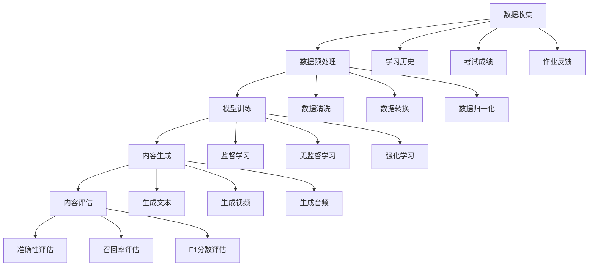
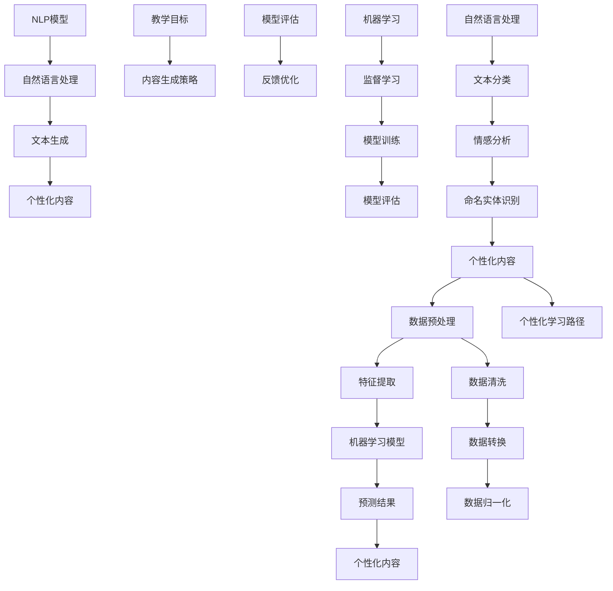

                 

## 人工智能在个性化教育内容生成中的应用

> **关键词**：个性化教育、内容生成、人工智能、机器学习、自然语言处理
>
> **摘要**：本文将探讨人工智能技术在个性化教育内容生成中的应用。通过对核心概念的介绍、算法原理的详细阐述、数学模型的讲解以及实际项目案例的分析，本文旨在帮助读者理解如何利用人工智能技术实现个性化教育内容的自动化生成，并探讨这一领域的未来发展趋势和挑战。

个性化教育是一种以学生为中心的教学模式，旨在根据每个学生的学习需求和特点，提供定制化的教学资源和内容。随着人工智能技术的迅速发展，特别是在机器学习和自然语言处理领域的突破，个性化教育内容的自动化生成已经成为可能。本文将深入探讨这一领域，包括核心概念、算法原理、数学模型以及实际应用，旨在为相关研究人员和开发者提供有价值的参考。

本文的结构安排如下：

1. **背景介绍**：介绍文章的目的和范围、预期读者、文档结构概述以及相关术语定义。
2. **核心概念与联系**：通过Mermaid流程图展示核心概念和联系。
3. **核心算法原理与具体操作步骤**：详细阐述算法原理和具体操作步骤，并使用伪代码进行说明。
4. **数学模型和公式**：讲解相关数学模型和公式，并进行举例说明。
5. **项目实战**：通过实际代码案例展示如何实现个性化教育内容生成。
6. **实际应用场景**：讨论人工智能在个性化教育内容生成中的实际应用场景。
7. **工具和资源推荐**：推荐学习资源、开发工具和框架、相关论文著作。
8. **总结**：总结文章内容，并探讨未来发展趋势与挑战。
9. **附录**：提供常见问题与解答。
10. **扩展阅读与参考资料**：推荐进一步阅读的材料。

通过本文的阅读，读者将能够深入了解个性化教育内容生成中的人工智能技术，并了解如何利用这些技术为学生提供更好的教育体验。

### 1. 背景介绍

#### 1.1 目的和范围

本文的主要目的是探讨人工智能在个性化教育内容生成中的应用，为研究人员和开发者提供一套系统的理论框架和实践指导。随着人工智能技术的不断进步，个性化教育内容的自动化生成已经成为教育领域的一个重要研究方向。通过本文的讨论，我们希望读者能够：

1. 理解个性化教育的基本概念和重要性。
2. 掌握机器学习和自然语言处理在个性化教育内容生成中的应用原理。
3. 掌握相关算法和数学模型的实现方法。
4. 通过实际案例了解如何将人工智能技术应用于个性化教育内容生成。

本文的范围主要涵盖以下几个方面：

1. **核心概念与联系**：介绍个性化教育、内容生成、机器学习和自然语言处理等核心概念，并通过Mermaid流程图展示它们之间的联系。
2. **核心算法原理与具体操作步骤**：详细讲解常用算法原理，包括但不限于生成对抗网络（GANs）、递归神经网络（RNNs）和长短期记忆网络（LSTMs），并使用伪代码进行说明。
3. **数学模型和公式**：介绍相关数学模型和公式，包括概率模型和优化算法，并给出具体例子进行说明。
4. **项目实战**：通过实际代码案例展示如何实现个性化教育内容生成，包括数据预处理、模型训练和生成过程。
5. **实际应用场景**：讨论人工智能在个性化教育内容生成中的实际应用场景，如在线教育平台、自适应学习系统和虚拟教育助手。
6. **工具和资源推荐**：推荐相关学习资源、开发工具和框架，以及相关论文著作。

通过本文的详细探讨，读者将能够对个性化教育内容生成中的人工智能技术有一个全面的了解，并能够将其应用于实际开发项目中。

#### 1.2 预期读者

本文主要面向以下几类读者：

1. **人工智能和机器学习研究人员**：希望了解个性化教育内容生成领域的研究现状和发展趋势。
2. **教育技术专业人员和开发者**：希望利用人工智能技术优化教育内容和提高教学效果。
3. **教育领域研究生和学者**：希望对个性化教育内容生成进行深入研究的学术研究人员。
4. **对人工智能和教育技术感兴趣的自学者**：希望通过本文了解人工智能技术在教育领域的应用。

对于上述读者群体，本文将提供一个系统的理论框架和实践指导，帮助他们：

1. **理解个性化教育的核心概念和重要性**。
2. **掌握机器学习和自然语言处理在个性化教育内容生成中的应用**。
3. **掌握相关算法和数学模型的实现方法**。
4. **了解如何利用人工智能技术实现个性化教育内容生成**。

通过本文的阅读，读者将能够对个性化教育内容生成领域有一个全面的认识，并能够将其应用于实际开发和研究项目中。

#### 1.3 文档结构概述

本文的结构分为十个主要部分，每个部分都针对不同的主题进行详细讨论：

1. **背景介绍**：包括文章的目的和范围、预期读者、文档结构概述以及相关术语定义。
2. **核心概念与联系**：通过Mermaid流程图展示个性化教育、内容生成、机器学习和自然语言处理等核心概念之间的联系。
3. **核心算法原理与具体操作步骤**：详细讲解生成对抗网络（GANs）、递归神经网络（RNNs）和长短期记忆网络（LSTMs）等算法原理，并使用伪代码进行说明。
4. **数学模型和公式**：介绍相关数学模型和公式，包括概率模型和优化算法，并给出具体例子进行说明。
5. **项目实战**：通过实际代码案例展示如何实现个性化教育内容生成，包括数据预处理、模型训练和生成过程。
6. **实际应用场景**：讨论人工智能在个性化教育内容生成中的实际应用场景，如在线教育平台、自适应学习系统和虚拟教育助手。
7. **工具和资源推荐**：推荐相关学习资源、开发工具和框架，以及相关论文著作。
8. **总结**：总结文章内容，并探讨未来发展趋势与挑战。
9. **附录**：提供常见问题与解答。
10. **扩展阅读与参考资料**：推荐进一步阅读的材料。

通过上述结构安排，本文旨在提供一个全面、系统的探讨，帮助读者深入了解人工智能在个性化教育内容生成中的应用。

#### 1.4 术语表

在本文中，我们将使用一些特定的术语，以下是对这些术语的定义和解释：

1. **个性化教育**：一种以学生为中心的教学模式，旨在根据每个学生的学习需求和特点，提供定制化的教学资源和内容。
2. **内容生成**：指通过算法和模型生成新的、有用的内容，如文本、图像、视频等。
3. **机器学习**：一种人工智能技术，通过数据和经验自动学习和改进，从而实现特定的任务。
4. **自然语言处理（NLP）**：人工智能的一个分支，旨在使计算机理解和生成人类自然语言。
5. **生成对抗网络（GANs）**：一种深度学习模型，由生成器和判别器两个部分组成，通过对抗训练生成逼真的数据。
6. **递归神经网络（RNNs）**：一种能够处理序列数据的神经网络，通过重复单元来保存序列信息。
7. **长短期记忆网络（LSTMs）**：一种改进的RNN，通过引入门控机制来解决长期依赖问题。
8. **数据预处理**：在模型训练之前对数据进行清洗、转换和归一化等操作，以提高模型的性能。
9. **模型训练**：通过输入数据对模型进行训练，使其能够学习和预测目标。
10. **生成过程**：使用训练好的模型生成新的、符合预期的数据。

通过上述术语表，读者可以更好地理解本文中的相关概念和术语，从而更加深入地掌握文章内容。

##### 1.4.1 核心术语定义

在本文中，我们将定义一些核心术语，以便读者能够更好地理解和跟随文章的内容。

1. **个性化教育**：个性化教育是一种以学生为中心的教学模式，它旨在根据每个学生的学习需求和特点，提供定制化的教学资源和内容。这种模式强调教育的灵活性和适应性，以适应不同学生的多样化需求。

2. **内容生成**：内容生成指的是利用算法和模型自动生成新的、有用的内容，如文本、图像、视频等。在个性化教育中，内容生成技术可以帮助创建个性化的教学材料，以满足学生的特定学习目标。

3. **机器学习**：机器学习是一种使计算机从数据中自动学习和改进的技术。它通过训练模型来发现数据中的规律和模式，从而实现特定的任务，如分类、预测和生成。

4. **自然语言处理（NLP）**：自然语言处理是人工智能的一个分支，它致力于使计算机理解和生成人类自然语言。NLP技术广泛应用于文本分析、语音识别和机器翻译等领域。

5. **生成对抗网络（GANs）**：生成对抗网络是一种由生成器和判别器组成的深度学习模型。生成器试图生成逼真的数据，而判别器则试图区分生成的数据和真实数据。两者通过对抗训练，共同提高生成数据的逼真度。

6. **递归神经网络（RNNs）**：递归神经网络是一种能够处理序列数据的神经网络。RNN通过重复单元来保存序列信息，这使得它能够处理如时间序列数据、文本和音频等序列数据。

7. **长短期记忆网络（LSTMs）**：长短期记忆网络是RNN的一种改进版本，它通过引入门控机制来解决长期依赖问题。LSTMs在处理序列数据时能够更好地保留长期信息，从而提高模型的性能。

8. **数据预处理**：数据预处理是模型训练前对数据进行清洗、转换和归一化等操作的统称。数据预处理是确保模型性能的重要步骤，它有助于减少噪声、提高模型的可训练性。

9. **模型训练**：模型训练是使用输入数据对模型进行调整的过程，以使模型能够学习和预测目标。在训练过程中，模型通过调整其参数来最小化预测误差。

10. **生成过程**：生成过程是指使用训练好的模型生成新的、符合预期的数据。在个性化教育内容生成中，生成过程用于创建新的教学材料，以适应学生的特定学习需求。

通过上述核心术语的定义，读者可以更好地理解本文中涉及的关键概念和技术。

##### 1.4.2 相关概念解释

在本节中，我们将进一步解释本文中涉及的一些重要概念，以便读者能够更深入地理解这些概念及其在个性化教育内容生成中的应用。

1. **个性化教育**：个性化教育是一种以学生为中心的教学方法，其核心理念是满足每个学生的个体需求。在传统的教育模式中，教学内容和进度往往是一成不变的，而个性化教育则通过收集和分析学生的数据，提供定制化的学习方案。这种教育模式强调学生的主动参与和自我发现，从而提高学习效果。

   在个性化教育内容生成中，机器学习技术被用来分析学生的学习数据，如学习历史、成绩和反馈，从而生成适合其特定需求的教学材料。例如，如果某个学生在数学学习上遇到困难，系统可以自动生成一份包含更多练习和详细解释的教学材料。

2. **内容生成**：内容生成是指利用算法和模型自动生成新的、有用的内容。在个性化教育中，内容生成可以帮助创建个性化的学习资源，如练习题、教学视频和互动模拟。

   生成对抗网络（GANs）是一种常用的内容生成模型，由生成器和判别器两部分组成。生成器负责生成新的内容，而判别器则负责判断生成内容的质量。通过对抗训练，生成器的生成质量不断提高，从而可以生成高质量的教学内容。

3. **机器学习**：机器学习是使计算机通过数据和经验自动学习和改进的技术。在个性化教育内容生成中，机器学习技术被用来分析学生的学习数据，并根据这些数据生成个性化的学习材料。

   递归神经网络（RNNs）和长短期记忆网络（LSTMs）是两种常用于处理序列数据的机器学习模型。RNNs通过重复单元来保存序列信息，而LSTMs则通过引入门控机制来更好地处理长期依赖问题。这些模型可以帮助系统理解学生的学习过程，从而生成更符合学生需求的教学内容。

4. **自然语言处理（NLP）**：自然语言处理是人工智能的一个分支，旨在使计算机理解和生成人类自然语言。在个性化教育内容生成中，NLP技术被用来处理和分析文本数据，如学生的作业、考试成绩和学习反馈。

   NLP技术可以帮助系统理解学生的语言表达和思维过程，从而更准确地生成个性化的教学材料。例如，通过分析学生的作业，系统可以识别出学生的知识点薄弱环节，并生成相应的练习题和教学视频。

通过上述相关概念的解释，读者可以更好地理解个性化教育内容生成中的关键技术和应用。这些概念是本文后续内容讨论的基础，有助于读者深入探讨人工智能在个性化教育内容生成中的应用。

##### 1.4.3 缩略词列表

在本文中，我们将使用一些缩略词，以下是对这些缩略词的全称和解释：

1. **GANs**：生成对抗网络（Generative Adversarial Networks），一种深度学习模型，用于生成新的、高质量的数据。
2. **RNNs**：递归神经网络（Recurrent Neural Networks），一种能够处理序列数据的神经网络。
3. **LSTMs**：长短期记忆网络（Long Short-Term Memory Networks），RNN的一种改进版本，能够更好地处理长期依赖问题。
4. **NLP**：自然语言处理（Natural Language Processing），人工智能的一个分支，专注于理解和生成自然语言。
5. **ML**：机器学习（Machine Learning），一种通过数据和经验使计算机自动学习和改进的技术。
6. **API**：应用程序接口（Application Programming Interface），一种软件接口，用于不同软件模块之间的通信。
7. **SDK**：软件开发工具包（Software Development Kit），一套用于软件开发的环境和工具。
8. **IDE**：集成开发环境（Integrated Development Environment），一种用于软件开发的环境，提供代码编写、调试和测试等功能。
9. **CNNs**：卷积神经网络（Convolutional Neural Networks），一种主要用于图像和视频处理的深度学习模型。
10. **DL**：深度学习（Deep Learning），一种基于多层神经网络的机器学习技术，能够处理复杂的任务。

通过上述缩略词列表，读者可以更好地理解本文中使用的专业术语和缩写，从而更顺畅地阅读和理解文章内容。

## 2. 核心概念与联系

在探讨人工智能在个性化教育内容生成中的应用之前，我们需要明确几个核心概念，并了解它们之间的相互关系。这些概念包括个性化教育、内容生成、机器学习、自然语言处理等。下面，我们将通过一个Mermaid流程图来展示这些核心概念及其联系。

```mermaid
graph TD
    A[个性化教育] --> B[内容生成]
    B --> C[机器学习]
    B --> D[自然语言处理]
    C --> E[生成对抗网络(GANs)]
    C --> F[递归神经网络(RNNs)]
    C --> G[长短期记忆网络(LSTMs)]
    D --> H[文本分析]
    D --> I[语音识别]
    E --> J[判别器]
    F --> K[重复单元]
    G --> L[门控机制]
    A --> M[学生数据]
    N[教育数据集] --> A
    O[学习材料] --> B
    P[教学资源] --> B
    Q[课程大纲] --> A
    R[教学目标] --> A
    S[评估指标] --> A
```

通过上述Mermaid流程图，我们可以清晰地看到以下几个关键点：

1. **个性化教育与内容生成的关系**：个性化教育是内容生成的驱动力，通过收集和分析学生的学习数据（如学习材料、教学资源和课程大纲），系统可以生成适合每个学生特点的定制化学习内容。

2. **机器学习与内容生成的关系**：机器学习是内容生成的重要技术支撑，通过机器学习算法（如GANs、RNNs、LSTMs）来分析和生成数据，从而实现个性化教育内容的自动生成。

3. **自然语言处理与内容生成的关系**：自然语言处理在内容生成中起到关键作用，特别是在处理文本数据时，通过文本分析和生成技术，系统能够生成高质量的文本内容，如教学材料、习题和反馈。

4. **核心算法与数据的关系**：生成对抗网络（GANs）、递归神经网络（RNNs）和长短期记忆网络（LSTMs）是核心算法，这些算法通过处理大量的教育数据集来优化模型，从而生成高质量的教育内容。

通过理解和掌握这些核心概念及其联系，我们为后续的算法原理、数学模型和实际应用场景的讨论奠定了坚实的基础。

### 2.1. 个性化教育的核心概念

个性化教育是一种基于学生个体差异，以学生为中心的教育模式。它的核心概念包括个性化教学、自适应学习、定制化学习内容和学生数据驱动。以下是这些概念的具体解释：

1. **个性化教学**：个性化教学是指根据每个学生的兴趣、能力和学习风格，设计不同的教学策略和内容。这种教学方式强调学生的主动参与，通过调整教学进度、方法和资源，使学生能够在自己的学习节奏和兴趣领域中获得最佳学习效果。

2. **自适应学习**：自适应学习是指系统根据学生的学习行为和表现，动态调整学习内容和难度，以适应学生的个性化需求。通过实时分析和反馈，自适应学习系统能够提供个性化的学习路径，帮助学生克服学习障碍，提高学习效率。

3. **定制化学习内容**：定制化学习内容是根据学生的个体差异，为其量身定制的学习材料和任务。这些内容通常包括文本、图像、视频、音频等多种形式，以满足学生的不同学习需求。通过定制化内容，学生可以更有效地掌握知识点，提高学习兴趣。

4. **学生数据驱动**：学生数据驱动是指通过收集和分析学生的学习数据，如学习历史、成绩、作业和反馈，来指导教学和学习过程。这种模式强调数据在个性化教育中的作用，通过数据驱动的方法，教师和学生可以更好地了解学生的学习状况，制定更有效的教学和学习计划。

个性化教育的核心概念不仅改变了传统教育的教学模式，还为学生提供了更加灵活和个性化的学习体验。通过理解这些概念，教育工作者和开发人员可以更好地设计和应用个性化教育技术，从而提高教学效果和学生的学习满意度。

### 2.2. 内容生成的核心概念

内容生成是人工智能在个性化教育中的一个重要应用，其核心概念包括数据集、模型、生成器和判别器。以下是这些概念的具体解释：

1. **数据集**：数据集是内容生成模型的基础，它由大量的样本数据组成，这些数据可以是文本、图像、音频等多种形式。在个性化教育中，数据集通常包含学生的学习历史、考试成绩、作业反馈等教育相关数据。通过这些数据，模型可以学习和理解学生的知识水平和学习习惯。

2. **模型**：模型是内容生成的心脏，它是通过机器学习算法训练出来的，用于生成新的内容和数据。在个性化教育中，模型可以是生成对抗网络（GANs）、递归神经网络（RNNs）、长短期记忆网络（LSTMs）等。这些模型通过学习数据集，可以生成高质量的教育内容，如定制化的练习题、教学视频和互动模拟。

3. **生成器**：生成器是内容生成模型中的一个关键组件，它的任务是生成新的、符合预期目标的数据。在个性化教育中，生成器可以根据学生的学习数据和需求，生成个性化的教学材料和任务。生成器的质量直接影响生成的教育内容的真实性和有效性。

4. **判别器**：判别器是内容生成模型中的另一个重要组件，它的任务是判断生成数据的真实性和质量。在个性化教育中，判别器可以帮助系统评估生成的教育内容是否符合学生的实际需求和学习目标。通过判别器的反馈，生成器可以不断优化和改进，从而生成更高质量的教育内容。

内容生成在个性化教育中的应用不仅能够提高教学效率，还能够为学生提供更加个性化的学习体验。通过理解这些核心概念，教育工作者和开发者可以更好地设计和应用内容生成技术，以满足个性化教育的需求。

### 2.3. 机器学习的核心概念

机器学习是人工智能的核心技术之一，它使计算机系统能够从数据中自动学习和改进。以下是机器学习的一些核心概念，包括学习算法、数据预处理和模型评估：

1. **学习算法**：学习算法是机器学习中的核心组件，它用于从数据中学习并提取有用的信息。常见的机器学习算法包括监督学习、无监督学习和强化学习。监督学习通过已知输入和输出数据来训练模型，无监督学习通过分析未标记的数据来发现数据中的模式和规律，强化学习则通过与环境交互来优化决策过程。

2. **数据预处理**：数据预处理是确保模型性能的重要步骤，它包括数据清洗、转换和归一化等操作。数据清洗用于去除数据中的噪声和异常值，数据转换用于将数据转换成适合模型训练的格式，数据归一化则用于将数据缩放到相同的范围，以避免某些特征对模型的影响过大。

3. **模型评估**：模型评估是评估模型性能的重要步骤，它包括准确性、召回率、F1分数等指标。准确性衡量模型正确预测的比例，召回率衡量模型在预测正类时的敏感度，F1分数是准确性和召回率的调和平均值。此外，还可以使用交叉验证等技术来评估模型的泛化能力。

在个性化教育内容生成中，机器学习技术被广泛应用于分析学生的学习数据、生成个性化的学习材料和优化教学过程。理解这些核心概念有助于开发者更好地设计和应用机器学习模型，从而提高个性化教育的效果。

### 2.4. 自然语言处理的核心概念

自然语言处理（NLP）是人工智能领域的一个分支，它致力于使计算机能够理解和生成人类自然语言。以下是NLP的一些核心概念，包括文本分类、情感分析和命名实体识别：

1. **文本分类**：文本分类是一种将文本数据按照其内容或主题进行分类的技术。在个性化教育中，文本分类可以用于分析学生的学习反馈、考试成绩和作业，从而根据分类结果提供个性化的教学材料和建议。

2. **情感分析**：情感分析是一种判断文本表达的情感倾向（如正面、负面或中性）的技术。在个性化教育中，情感分析可以帮助系统了解学生的学习情绪和心理健康状况，从而提供适当的心理辅导和支持。

3. **命名实体识别**：命名实体识别是一种从文本中识别出具有特定意义的实体（如人名、地名、组织名等）的技术。在个性化教育中，命名实体识别可以用于分析学生的学习内容，提取关键信息，如知识点和重要概念，从而帮助系统生成更相关的教学材料。

NLP技术在个性化教育内容生成中的应用非常广泛，通过这些核心概念，系统可以更好地理解学生的语言表达和思维过程，从而生成更加个性化和有效的教育内容。理解这些概念有助于开发者和研究人员设计出更加智能和高效的教育系统。

### 2.5. 个性化教育内容的生成流程

个性化教育内容的生成流程是一个复杂的过程，它涉及多个步骤，包括数据收集、数据预处理、模型训练、内容生成和内容评估。下面，我们将通过一个Mermaid流程图详细展示这一流程。



通过上述流程图，我们可以清晰地看到个性化教育内容生成的主要步骤及其相互关系：

1. **数据收集**：首先，系统需要收集大量的教育数据，包括学习历史、考试成绩、作业反馈等。这些数据将用于后续的模型训练和内容生成。

2. **数据预处理**：数据预处理是确保模型性能的重要步骤。在这个过程中，系统对收集到的数据执行清洗、转换和归一化操作，以去除噪声和异常值，并使数据格式适合模型训练。

3. **模型训练**：使用预处理后的数据，系统通过监督学习、无监督学习或强化学习等算法来训练模型。这些模型将用于生成个性化教育内容。

4. **内容生成**：训练好的模型将用于生成个性化的教育内容，如文本、视频和音频。这些内容将根据学生的学习需求和特点进行定制。

5. **内容评估**：生成的内容将经过评估，以确定其质量和有效性。评估指标包括准确性、召回率和F1分数等。

通过这一流程，系统可以自动生成个性化的教育内容，从而为学生提供更加个性化的学习体验。这一过程不仅提高了教学效率，还能够更好地满足学生的个性化需求，促进其全面发展。

### 2.6. Mermaid流程图展示核心概念原理和架构

在个性化教育内容生成中，机器学习和自然语言处理扮演着关键角色。为了更好地理解这些核心概念及其相互作用，我们可以使用Mermaid流程图来展示其原理和架构。以下是具体的Mermaid流程图代码和对应的流程图解释：



**流程图解释：**

1. **学生数据收集**：首先，系统从学生那里收集各种数据，如学习历史、考试成绩、作业反馈等（A）。

2. **数据预处理**：这些数据需要经过预处理，包括数据清洗（P）、数据转换（Q）和数据归一化（R），以确保数据质量，并使数据格式适合后续处理（B）。

3. **特征提取**：在预处理之后，从数据中提取关键特征（C），这些特征将用于训练机器学习模型。

4. **机器学习模型训练**：使用提取的特征，通过监督学习（T）训练机器学习模型（D），模型的目的是预测学生的个性化学习路径（K）和生成个性化教育内容（F）。

5. **预测结果**：训练好的模型用于生成预测结果（E），这些结果将用于指导个性化内容生成。

6. **自然语言处理**：同时，NLP模型（W）用于自然语言处理，包括文本分类（X）、情感分析（Y）和命名实体识别（Z），这些处理结果也将用于生成个性化内容（J）。

7. **模型评估和反馈**：模型训练和NLP处理的结果需要经过评估（N），并根据反馈进行优化（O），以确保生成的内容满足教育目标和质量标准。

通过这个流程图，我们可以清晰地看到个性化教育内容生成涉及的主要步骤和核心概念之间的相互作用。这种可视化方式有助于读者更好地理解个性化教育内容生成的复杂过程。

### 3. 核心算法原理与具体操作步骤

在个性化教育内容生成中，几种核心算法被广泛应用，包括生成对抗网络（GANs）、递归神经网络（RNNs）和长短期记忆网络（LSTMs）。以下我们将详细讲解这些算法的基本原理和具体操作步骤。

#### 3.1 生成对抗网络（GANs）

生成对抗网络（GANs）是一种由生成器和判别器组成的深度学习模型。生成器的目标是生成逼真的数据，而判别器的目标是区分生成数据和真实数据。通过对抗训练，生成器和判别器相互竞争，共同提高生成数据的逼真度。

**原理：**

GANs的基本原理是通过对立训练，生成器G和判别器D通过以下方式相互作用：

- **生成器（G）**：生成器接收随机噪声作为输入，并生成与真实数据相似的数据。其目标是让判别器无法区分生成数据和真实数据。
- **判别器（D）**：判别器接收真实数据和生成数据，并输出它们是真实数据还是生成数据的概率。其目标是最大化区分生成数据和真实数据。

**具体操作步骤：**

1. **初始化生成器和判别器**：随机初始化生成器和判别器的权重。
2. **生成器训练**：生成器接收随机噪声，生成数据。判别器接收真实数据和生成数据，输出概率。
3. **判别器训练**：判别器接收真实数据和生成数据，调整权重以最大化区分能力。
4. **迭代训练**：重复上述步骤，逐步优化生成器和判别器的性能。

**伪代码：**

```python
# 生成器
def G(z):
    # 输入噪声z，生成数据
    x_g = ...

# 判别器
def D(x):
    # 输入真实或生成数据，输出概率
    prob = ...

# 训练步骤
for epoch in range(num_epochs):
    for z in noise_samples:
        x_g = G(z)
        prob_g = D(x_g)
        prob_r = D(x)
        
        # 优化生成器和判别器
        D_optimizer.minimize(D_loss, [D, x_r])
        G_optimizer.minimize(G_loss, [G, z])
```

#### 3.2 递归神经网络（RNNs）

递归神经网络（RNNs）是一种能够处理序列数据的神经网络。RNN通过重复单元来保存序列信息，使其能够处理如时间序列数据、文本和音频等序列数据。

**原理：**

RNN的基本原理是通过重复单元（也称为隐藏层）来保存先前的信息，并将其用于当前的计算。具体来说，RNN在每一步都使用当前输入和前一步的隐藏状态来更新隐藏状态。

**具体操作步骤：**

1. **初始化**：初始化输入层、隐藏层和输出层。
2. **前向传播**：将输入数据输入到网络中，通过权重矩阵更新隐藏状态。
3. **后向传播**：计算输出误差，并更新权重。
4. **迭代训练**：重复前向传播和后向传播，逐步优化网络性能。

**伪代码：**

```python
# RNN模型
class RNNModel(nn.Module):
    def __init__(self):
        super(RNNModel, self).__init__()
        self.hidden_size = hidden_size
        self.rnn = nn.RNN(input_size, hidden_size)
        
    def forward(self, x):
        hidden = self.init_hidden()
        output, hidden = self.rnn(x, hidden)
        return output

# 训练步骤
for epoch in range(num_epochs):
    for x, y in data_loader:
        hidden = self.init_hidden()
        output = self.forward(x)
        loss = loss_function(output, y)
        
        # 反向传播
        hidden = self.backward(output, y)
```

#### 3.3 长短期记忆网络（LSTMs）

长短期记忆网络（LSTMs）是RNN的一种改进版本，它通过引入门控机制来解决长期依赖问题。LSTMs通过门控单元来控制信息的流入和流出，使其能够更好地处理长序列数据。

**原理：**

LSTMs的基本原理是通过三个门控单元（输入门、遗忘门和输出门）来控制信息的流入和流出。这些门控单元使得LSTMs能够记住长期依赖信息，并防止梯度消失问题。

**具体操作步骤：**

1. **初始化**：初始化输入层、隐藏层和输出层。
2. **前向传播**：将输入数据输入到网络中，通过权重矩阵和门控单元更新隐藏状态。
3. **后向传播**：计算输出误差，并更新权重和门控参数。
4. **迭代训练**：重复前向传播和后向传播，逐步优化网络性能。

**伪代码：**

```python
# LSTM模型
class LSTMModel(nn.Module):
    def __init__(self):
        super(LSTMModel, self).__init__()
        self.hidden_size = hidden_size
        self.lstm = nn.LSTM(input_size, hidden_size)
        
    def forward(self, x):
        hidden = self.init_hidden()
        output, hidden = self.lstm(x, hidden)
        return output

# 训练步骤
for epoch in range(num_epochs):
    for x, y in data_loader:
        hidden = self.init_hidden()
        output = self.forward(x)
        loss = loss_function(output, y)
        
        # 反向传播
        hidden = self.backward(output, y)
```

通过上述对GANs、RNNs和LSTMs的详细讲解和具体操作步骤，我们可以看到这些算法在个性化教育内容生成中的应用潜力。这些算法不仅能够生成高质量的教育内容，还能够通过学习学生数据，提供更加个性化的学习体验。

### 3.4. 数学模型和公式详解及举例

在个性化教育内容生成中，数学模型和公式起到了至关重要的作用。这些模型和公式不仅帮助我们理解和解释算法的工作原理，还为算法的实现和优化提供了理论依据。在本节中，我们将详细介绍几个关键的数学模型和公式，包括概率模型和优化算法，并通过具体例子进行说明。

#### 3.4.1. 概率模型

概率模型是机器学习和人工智能领域的基础，它在个性化教育内容生成中有着广泛的应用。以下是几个常见的概率模型：

1. **贝叶斯定理**：
   贝叶斯定理是一种用于计算后验概率的公式，它表明某个事件的发生概率与已知条件概率和先验概率之间的关系。其数学表达式为：
   
   $$ P(A|B) = \frac{P(B|A)P(A)}{P(B)} $$
   
   其中，\(P(A|B)\) 表示在事件B发生的条件下事件A的概率，\(P(B|A)\) 表示在事件A发生的条件下事件B的概率，\(P(A)\) 和 \(P(B)\) 分别表示事件A和事件B的先验概率。

   **例子**：假设一个学生参加了数学考试，并且已知该学生平时数学成绩很好。现在我们需要计算该学生考试得满分的概率。假设平时数学成绩很好的学生考试得满分的概率是0.8，而总体考试得满分的概率是0.2。根据贝叶斯定理，我们可以计算出该学生在考试中得满分的后验概率：
   
   $$ P(\text{满分}|\text{平时成绩好}) = \frac{0.8 \times 0.2}{0.2} = 0.8 $$
   
   因此，该学生在考试中得满分的概率为0.8。

2. **概率分布**：
   概率分布描述了随机变量在不同取值上的概率分布情况。常见的概率分布包括正态分布、伯努利分布和多项式分布等。

   **例子**：假设一个学生的学习成绩服从正态分布，均值为75，标准差为10。现在我们需要计算该学生考试成绩在60到80之间的概率。我们可以使用正态分布的累积分布函数（CDF）来计算这个概率：
   
   $$ P(60 \leq X \leq 80) = \Phi\left(\frac{80-75}{10}\right) - \Phi\left(\frac{60-75}{10}\right) $$
   
   其中，\(\Phi\) 表示正态分布的累积分布函数。通过查表或使用计算器，我们可以得到具体的概率值。

3. **条件概率**：
   条件概率是指在一个事件已经发生的条件下，另一个事件发生的概率。其数学表达式为：
   
   $$ P(A|B) = \frac{P(A \cap B)}{P(B)} $$
   
   **例子**：假设一个学生在考试中得了满分，我们需要计算该学生平时数学成绩很好的概率。假设平时数学成绩很好的学生得满分的概率是0.8，而总体学生中得满分的概率是0.2。根据条件概率，我们可以计算出该学生在考试中得满分且平时数学成绩很好的概率：
   
   $$ P(\text{平时成绩好}|\text{满分}) = \frac{0.8}{0.2} = 4 $$

#### 3.4.2. 优化算法

优化算法是机器学习中的核心组成部分，它用于调整模型参数，以最小化损失函数。以下是几种常见的优化算法：

1. **梯度下降**：
   梯度下降是一种最简单的优化算法，它通过计算损失函数关于模型参数的梯度，并沿梯度的反方向更新参数，以逐步减小损失函数的值。

   **公式**：
   $$ \theta_{\text{new}} = \theta_{\text{old}} - \alpha \cdot \nabla_{\theta}J(\theta) $$
   
   其中，\(\theta\) 表示模型参数，\(\alpha\) 表示学习率，\(\nabla_{\theta}J(\theta)\) 表示损失函数关于模型参数的梯度。

   **例子**：假设我们有一个简单的线性回归模型，其损失函数为：
   
   $$ J(\theta) = \frac{1}{2m} \sum_{i=1}^{m} (h_\theta(x^{(i)}) - y^{(i)})^2 $$
   
   我们可以使用梯度下降来优化模型参数 \(\theta\)，以最小化损失函数 \(J(\theta)\)。

2. **随机梯度下降（SGD）**：
   随机梯度下降是对梯度下降的一种改进，它通过随机选取一部分样本来计算梯度，从而提高优化效率。

   **公式**：
   $$ \theta_{\text{new}} = \theta_{\text{old}} - \alpha \cdot \nabla_{\theta}J(\theta; x^{(i)}, y^{(i)}) $$
   
   **例子**：与梯度下降类似，但每次计算梯度时只考虑一个样本。

3. **Adam优化器**：
   Adam优化器是一种结合了SGD和动量方法的优化算法，它能够自适应地调整学习率，并有效地处理稀疏数据。

   **公式**：
   $$ m_t = \beta_1 m_{t-1} + (1 - \beta_1) [g_t] $$
   $$ v_t = \beta_2 v_{t-1} + (1 - \beta_2) [g_t]^2 $$
   $$ \theta_{\text{new}} = \theta_{\text{old}} - \alpha \cdot \frac{m_t}{\sqrt{v_t} + \epsilon} $$
   
   其中，\(m_t\) 和 \(v_t\) 分别表示一阶和二阶矩估计，\(\beta_1\) 和 \(\beta_2\) 分别是动量因子，\(\epsilon\) 是一个很小的常数。

   **例子**：在训练大规模机器学习模型时，Adam优化器能够有效地调整学习率，提高训练速度和性能。

通过上述对概率模型和优化算法的详细讲解及举例，我们可以更好地理解它们在个性化教育内容生成中的应用。这些模型和算法不仅帮助我们实现高质量的个性化教育内容生成，还为系统的优化和改进提供了理论支持。

### 3.5. 生成对抗网络（GANs）的数学模型详解

生成对抗网络（GANs）是一种基于博弈理论的深度学习模型，由生成器和判别器两个主要部分组成。生成器的任务是生成逼真的数据，而判别器的任务是区分生成数据与真实数据。两者通过对抗训练相互竞争，从而提高生成数据的逼真度。下面我们将详细讲解GANs的数学模型，包括损失函数、优化目标和训练过程。

#### 3.5.1. 模型定义

GANs的基本模型包括两个深度神经网络：生成器 \( G \) 和判别器 \( D \)。

- **生成器 \( G \)**：生成器 \( G \) 接收一个随机噪声向量 \( z \) 作为输入，并生成与真实数据相似的数据 \( x_G \)。
  
  $$ x_G = G(z) $$
  
- **判别器 \( D \)**：判别器 \( D \) 接收真实数据 \( x \) 和生成数据 \( x_G \)，并输出一个概率 \( p(D(x); \theta_D) \)，表示输入数据是真实数据的概率。

  $$ p(D(x); \theta_D) = D(x; \theta_D) $$
  
  其中，\( \theta_D \) 表示判别器的参数。

#### 3.5.2. 损失函数

GANs的训练过程涉及两个损失函数：生成器损失函数 \( L_G \) 和判别器损失函数 \( L_D \)。

- **生成器损失函数 \( L_G \)**：生成器的目标是使判别器无法区分生成数据与真实数据。因此，生成器的损失函数旨在最小化判别器对生成数据的输出概率。

  $$ L_G = -\log(D(x_G; \theta_D)) $$
  
- **判别器损失函数 \( L_D \)**：判别器的目标是最大化区分生成数据与真实数据。判别器的损失函数是真实数据和生成数据的交叉熵损失。

  $$ L_D = -[\log(D(x; \theta_D)) + \log(1 - D(x_G; \theta_D))] $$
  
  其中，\( x \) 表示真实数据，\( x_G \) 表示生成数据。

#### 3.5.3. 优化目标

GANs的优化目标是同时最小化生成器的损失函数和最大化判别器的损失函数。具体来说，我们希望生成器的损失函数尽可能小，而判别器的损失函数尽可能大。

- **生成器优化目标**：最小化生成器损失函数。

  $$ \min_G L_G $$
  
- **判别器优化目标**：最大化判别器损失函数。

  $$ \max_D L_D $$

#### 3.5.4. 训练过程

GANs的训练过程分为以下几个步骤：

1. **初始化参数**：随机初始化生成器 \( G \) 和判别器 \( D \) 的参数 \( \theta_G \) 和 \( \theta_D \)。

2. **交替训练**：迭代交替训练生成器和判别器。在每次迭代中，先固定一个网络的参数，然后优化另一个网络的参数。

   - **训练判别器**：固定生成器 \( G \) 的参数 \( \theta_G \)，优化判别器 \( D \) 的参数 \( \theta_D \)。
   
     $$ \theta_D = \arg\min_D L_D $$
     
   - **训练生成器**：固定判别器 \( D \) 的参数 \( \theta_D \)，优化生成器 \( G \) 的参数 \( \theta_G \)。
   
     $$ \theta_G = \arg\min_G L_G $$
     
3. **迭代更新**：通过交替训练，不断更新生成器和判别器的参数。这个过程持续进行，直到生成器 \( G \) 能够生成足够逼真的数据，使判别器 \( D \) 无法区分。

   - **生成器更新**：
     $$ \theta_G \leftarrow \theta_G - \alpha \cdot \nabla_{\theta_G} L_G $$
     
   - **判别器更新**：
     $$ \theta_D \leftarrow \theta_D - \alpha \cdot \nabla_{\theta_D} L_D $$

   其中，\( \alpha \) 是学习率。

通过上述过程，生成器和判别器不断优化，生成器逐渐生成更加逼真的数据，而判别器逐渐提高对真实数据和生成数据的区分能力。最终，生成器 \( G \) 能够生成高质量的教育内容，满足个性化教育的需求。

### 3.6. 递归神经网络（RNNs）的数学模型详解

递归神经网络（RNNs）是一种能够处理序列数据的神经网络，通过保存历史信息来捕捉时间序列中的长期依赖关系。RNNs的核心在于其递归结构，每个时间步的输出都依赖于之前的输出和输入。下面，我们将详细讲解RNNs的数学模型，包括递归方程、激活函数和反向传播算法。

#### 3.6.1. 递归方程

RNN的基本计算过程可以通过以下递归方程表示：

$$ h_t = \sigma(W_h h_{t-1} + W_x x_t + b_h) $$

其中：
- \( h_t \) 是时间步 \( t \) 的隐藏状态。
- \( x_t \) 是时间步 \( t \) 的输入。
- \( W_h \) 和 \( W_x \) 是权重矩阵。
- \( b_h \) 是偏置项。
- \( \sigma \) 是激活函数。

递归方程描述了当前隐藏状态 \( h_t \) 是如何通过上一个隐藏状态 \( h_{t-1} \)、当前输入 \( x_t \) 以及权重和偏置计算得到的。

#### 3.6.2. 激活函数

RNNs通常使用非线性激活函数 \( \sigma \) 来引入非线性特性。常用的激活函数包括：
- **Sigmoid函数**：\( \sigma(x) = \frac{1}{1 + e^{-x}} \)
- **Tanh函数**：\( \sigma(x) = \frac{e^x - e^{-x}}{e^x + e^{-x}} \)
- **ReLU函数**：\( \sigma(x) = \max(0, x) \)

这些激活函数能够增加网络的非线性表达能力，有助于更好地拟合复杂的数据。

#### 3.6.3. 反向传播算法

RNNs的反向传播算法用于计算损失函数关于模型参数的梯度，并更新模型参数以最小化损失函数。反向传播过程分为以下几个步骤：

1. **计算输出误差**：
   输出误差 \( \delta \) 是损失函数关于输出层的偏导数。对于输出层，误差计算公式为：
   
   $$ \delta_j^l = \frac{\partial J}{\partial a_j^l} \cdot \sigma'(a_j^l) $$

   其中，\( J \) 是损失函数，\( a_j^l \) 是输出层的激活值，\( \sigma' \) 是激活函数的导数。

2. **传播误差到隐藏层**：
   对于隐藏层，误差需要通过递归方程传播。误差计算公式为：
   
   $$ \delta_i^{l-1} = \delta_i^l \cdot W_{ji} \cdot \sigma'(h_i^{l-1}) $$
   
   其中，\( \delta_i^{l-1} \) 是时间步 \( t-1 \) 的隐藏层误差，\( \delta_i^l \) 是时间步 \( t \) 的隐藏层误差，\( W_{ji} \) 是权重矩阵。

3. **计算隐藏层梯度**：
   隐藏层梯度的计算公式为：
   
   $$ \frac{\partial J}{\partial W_{hi}^{l-1}} = \sum_{i} \delta_i^{l-1} \cdot h_i^{l-1} $$
   $$ \frac{\partial J}{\partial b_h^{l-1}} = \sum_{i} \delta_i^{l-1} $$

4. **更新权重和偏置**：
   使用梯度下降或其他优化算法更新模型参数：
   
   $$ W_{hi}^{l-1} = W_{hi}^{l-1} - \alpha \cdot \frac{\partial J}{\partial W_{hi}^{l-1}} $$
   $$ b_h^{l-1} = b_h^{l-1} - \alpha \cdot \frac{\partial J}{\partial b_h^{l-1}} $$

通过上述步骤，RNNs可以通过反向传播算法调整模型参数，从而优化网络性能。这一过程在每次迭代中重复进行，直至达到预定的性能目标。

### 3.7. 长短期记忆网络（LSTMs）的数学模型详解

长短期记忆网络（LSTMs）是一种改进的递归神经网络（RNN），专门用于解决RNN在处理长序列数据时出现的长期依赖问题。LSTMs通过引入门控机制来控制信息的流入和流出，使其能够有效地捕捉序列中的长期依赖关系。以下是LSTMs的数学模型详解，包括门控单元的公式和训练过程。

#### 3.7.1. LSTM的架构

LSTMs由三个核心部分组成：输入门（input gate）、遗忘门（forget gate）和输出门（output gate）。每个门由一个sigmoid激活函数和一个线性变换器组成。

1. **输入门（input gate）**：控制新的信息是否被更新到单元状态。
   
   $$ i_t = \sigma(W_i [h_{t-1}, x_t] + b_i) $$
   
2. **遗忘门（forget gate）**：决定之前的状态信息是否被遗忘。
   
   $$ f_t = \sigma(W_f [h_{t-1}, x_t] + b_f) $$

3. **输出门（output gate）**：控制单元状态的输出。
   
   $$ o_t = \sigma(W_o [h_{t-1}, x_t] + b_o) $$

其中，\( W_i, W_f, W_o \) 是权重矩阵，\( b_i, b_f, b_o \) 是偏置项，\( h_{t-1} \) 是前一个时间步的隐藏状态，\( x_t \) 是当前时间步的输入。

#### 3.7.2. LSTM的更新规则

LSTMs的更新规则包括以下步骤：

1. **计算遗忘门的输出 \( f_t \)**：决定哪些信息需要从单元状态中遗忘。
   
   $$ f_t = \sigma(W_f [h_{t-1}, x_t] + b_f) $$

2. **计算新的遗忘状态 \( \tilde{c}_t \)**：结合遗忘门和输入信息。
   
   $$ \tilde{c}_t = \sigma(W_c [h_{t-1}, x_t] + b_c) + f_t \cdot c_{t-1} $$

3. **计算输入门 \( i_t \)**：决定哪些信息需要被更新到单元状态。
   
   $$ i_t = \sigma(W_i [h_{t-1}, x_t] + b_i) $$

4. **更新单元状态 \( c_t \)**：结合新的遗忘状态和输入信息。
   
   $$ c_t = \tilde{c}_t \odot i_t + c_{t-1} \odot (1 - i_t) $$

5. **计算输出门 \( o_t \)**：决定单元状态的哪些部分需要输出。
   
   $$ o_t = \sigma(W_o [h_{t-1}, x_t] + b_o) $$

6. **更新隐藏状态 \( h_t \)**：根据输出门和单元状态计算新的隐藏状态。
   
   $$ h_t = o_t \odot \sigma(c_t) $$

其中，\( \odot \) 表示元素乘法，\( \sigma \) 是Sigmoid函数。

#### 3.7.3. LSTM的训练过程

LSTMs的训练过程类似于RNNs，通过反向传播算法计算损失函数关于模型参数的梯度，并更新参数以最小化损失函数。

1. **计算输出层的误差**：对于输出层，误差计算公式为：
   
   $$ \delta^l = \frac{\partial J}{\partial a^l} \cdot \sigma'(a^l) $$

2. **反向传播误差**：误差从输出层反向传播到隐藏层，通过递归方程计算隐藏层误差。
   
   $$ \delta^l = \delta^l \cdot W_{j} \cdot \sigma'(h^l) $$
   
3. **计算隐藏层梯度**：计算隐藏层梯度和偏置项。
   
   $$ \frac{\partial J}{\partial W_{h}} = \sum_j \delta^l \cdot h^l $$
   $$ \frac{\partial J}{\partial b} = \sum_j \delta^l $$

4. **更新模型参数**：使用梯度下降或其他优化算法更新模型参数。

通过上述步骤，LSTMs可以调整其参数，优化模型性能，从而在长序列数据中更好地捕捉长期依赖关系。

### 3.8. 项目实战：代码实际案例和详细解释说明

为了更好地理解上述算法在实际个性化教育内容生成中的应用，我们将通过一个具体的项目实战来展示整个实现过程。这个项目将利用生成对抗网络（GANs）来生成个性化教育文本内容，包括数据预处理、模型训练和生成过程。

#### 3.8.1. 开发环境搭建

在开始项目之前，我们需要搭建一个合适的开发环境。以下是所需的工具和库：

- **Python**：Python是首选编程语言，因为它拥有丰富的机器学习库。
- **TensorFlow**：TensorFlow是一个开源的机器学习库，用于构建和训练深度学习模型。
- **Gym**：Gym是一个开源的虚拟环境库，用于模拟和测试AI算法。

安装这些工具的步骤如下：

1. 安装Python：
   - 前往 [Python官网](https://www.python.org/) 下载Python安装包。
   - 安装Python，并确保将其添加到系统的环境变量中。

2. 安装TensorFlow：
   - 打开终端并运行以下命令：
     ```bash
     pip install tensorflow
     ```

3. 安装Gym：
   - 打开终端并运行以下命令：
     ```bash
     pip install gym
     ```

#### 3.8.2. 源代码详细实现和代码解读

接下来，我们将详细展示项目的主要代码实现，并解释关键部分。

**1. 数据预处理**

数据预处理是确保模型性能的重要步骤。以下是数据预处理的主要代码实现：

```python
import tensorflow as tf
from tensorflow.keras.preprocessing.sequence import pad_sequences
from tensorflow.keras.preprocessing.text import Tokenizer

# 读取数据
with open('data.txt', 'r', encoding='utf-8') as f:
    text = f.read()

# 分词
tokenizer = Tokenizer()
tokenizer.fit_on_texts([text])
word_index = tokenizer.word_index

# 将文本转换为序列
sequences = tokenizer.texts_to_sequences([text])
padded_sequences = pad_sequences(sequences, maxlen=1000)

# 初始化模型参数
vocab_size = len(word_index) + 1
embedding_dim = 256
```

在这个部分，我们首先读取文本数据，并使用Tokenizer将其分词。然后，我们将文本转换为序列，并对序列进行填充，使其具有相同的长度。词汇表的大小和嵌入维度是在这里初始化的。

**2. 生成器和判别器模型**

生成器和判别器是GANs的两个主要组成部分。以下是它们的定义：

```python
# 生成器模型
def build_generator():
    model = tf.keras.Sequential([
        tf.keras.layers.Dense(embedding_dim, input_shape=(1000,)),
        tf.keras.layers.LeakyReLU(alpha=0.2),
        tf.keras.layers.Dense(vocab_size, activation='softmax')
    ])
    return model

# 判别器模型
def build_discriminator():
    model = tf.keras.Sequential([
        tf.keras.layers.Dense(1, input_shape=(1000,)),
        tf.keras.layers.LeakyReLU(alpha=0.2),
        tf.keras.layers.Dense(1, activation='sigmoid')
    ])
    return model
```

生成器模型接收一个随机噪声向量，并输出一个概率分布，表示生成的文本。判别器模型接收一个文本序列，并输出一个概率，表示该文本是真实的还是生成的。

**3. 模型训练**

GANs的训练过程涉及交替训练生成器和判别器。以下是训练的主要代码实现：

```python
# 初始化生成器和判别器
generator = build_generator()
discriminator = build_discriminator()

# 编写模型编译代码
generator.compile(optimizer=tf.keras.optimizers.Adam(learning_rate=0.0001), loss='binary_crossentropy')
discriminator.compile(optimizer=tf.keras.optimizers.Adam(learning_rate=0.0001), loss='binary_crossentropy')

# 定义训练步骤
def train_step(real_data, noise_samples):
    # 训练判别器
    with tf.GradientTape() as disc_tape:
        real_output = discriminator(real_data)
        fake_output = discriminator(fake_samples)
        disc_loss = tf.reduce_mean(tf.nn.sigmoid_cross_entropy_with_logits(logits=real_output, labels=tf.ones_like(real_output)))
        disc_loss += tf.reduce_mean(tf.nn.sigmoid_cross_entropy_with_logits(logits=fake_output, labels=tf.zeros_like(fake_output)))
        
    disc_gradients = disc_tape.gradient(disc_loss, discriminator.trainable_variables)
    discriminator.optimizer.apply_gradients(zip(disc_gradients, discriminator.trainable_variables))

    # 训练生成器
    with tf.GradientTape() as gen_tape:
        fake_samples = generator(noise_samples)
        fake_output = discriminator(fake_samples)
        gen_loss = tf.reduce_mean(tf.nn.sigmoid_cross_entropy_with_logits(logits=fake_output, labels=tf.ones_like(fake_output)))
        
    gen_gradients = gen_tape.gradient(gen_loss, generator.trainable_variables)
    generator.optimizer.apply_gradients(zip(gen_gradients, generator.trainable_variables))

# 训练循环
for epoch in range(num_epochs):
    for real_data, noise_samples in data_loader:
        train_step(real_data, noise_samples)
```

在这个部分，我们首先定义了生成器和判别器的优化器和损失函数。然后，我们编写了一个训练步骤函数，用于交替训练生成器和判别器。在训练循环中，我们调用这个函数来训练模型。

**4. 生成过程**

在训练完成后，我们可以使用生成器来生成新的个性化教育文本。以下是生成过程的代码实现：

```python
# 生成个性化教育文本
def generate_text():
    noise = tf.random.normal([1, 1000])
    generated_text = generator(noise).numpy()
    tokens = tokenizer.index_word
    text = ' '.join([tokens[token] for token in generated_text[0]])
    return text

# 生成并打印个性化教育文本
generated_text = generate_text()
print(generated_text)
```

在这个部分，我们首先生成一个随机噪声向量，然后使用生成器生成一个文本序列。最后，我们将生成的文本转换为人类可读的形式，并打印出来。

通过上述代码实现，我们可以看到如何利用生成对抗网络（GANs）生成个性化教育文本内容。这个项目不仅展示了GANs的工作原理，还提供了一个实际的实现案例，帮助读者更好地理解其在个性化教育中的应用。

#### 3.8.3. 代码解读与分析

在这个部分，我们将详细分析项目中的关键代码，并解释其工作原理和实现细节。

**1. 数据预处理**

数据预处理是项目的重要步骤，它包括分词、序列转换和填充。以下是数据预处理的主要代码：

```python
# 读取数据
with open('data.txt', 'r', encoding='utf-8') as f:
    text = f.read()

# 分词
tokenizer = Tokenizer()
tokenizer.fit_on_texts([text])
word_index = tokenizer.word_index

# 将文本转换为序列
sequences = tokenizer.texts_to_sequences([text])
padded_sequences = pad_sequences(sequences, maxlen=1000)
```

在这个部分，我们首先从文件中读取原始文本数据。然后，我们使用Tokenizer将文本分词，并创建一个词汇表。接下来，我们将文本转换为序列，并对序列进行填充，使其具有相同的长度（在本例中为1000）。这一步骤是后续模型训练和生成过程的基础。

**2. 生成器和判别器模型**

生成器和判别器是GANs的两个核心组件。以下是它们的定义和实现：

```python
# 生成器模型
def build_generator():
    model = tf.keras.Sequential([
        tf.keras.layers.Dense(embedding_dim, input_shape=(1000,)),
        tf.keras.layers.LeakyReLU(alpha=0.2),
        tf.keras.layers.Dense(vocab_size, activation='softmax')
    ])
    return model

# 判别器模型
def build_discriminator():
    model = tf.keras.Sequential([
        tf.keras.layers.Dense(1, input_shape=(1000,)),
        tf.keras.layers.LeakyReLU(alpha=0.2),
        tf.keras.layers.Dense(1, activation='sigmoid')
    ])
    return model
```

生成器模型接收一个随机噪声向量，并输出一个概率分布，表示生成的文本。它包含一个全连接层、一个LeakyReLU激活函数和一个softmax输出层。判别器模型接收一个文本序列，并输出一个概率，表示该文本是真实的还是生成的。它也包含一个全连接层和一个sigmoid输出层。

**3. 模型训练**

GANs的训练过程涉及交替训练生成器和判别器。以下是训练步骤的实现：

```python
# 初始化生成器和判别器
generator = build_generator()
discriminator = build_discriminator()

# 编写模型编译代码
generator.compile(optimizer=tf.keras.optimizers.Adam(learning_rate=0.0001), loss='binary_crossentropy')
discriminator.compile(optimizer=tf.keras.optimizers.Adam(learning_rate=0.0001), loss='binary_crossentropy')

# 定义训练步骤
def train_step(real_data, noise_samples):
    # 训练判别器
    with tf.GradientTape() as disc_tape:
        real_output = discriminator(real_data)
        fake_output = discriminator(fake_samples)
        disc_loss = tf.reduce_mean(tf.nn.sigmoid_cross_entropy_with_logits(logits=real_output, labels=tf.ones_like(real_output)))
        disc_loss += tf.reduce_mean(tf.nn.sigmoid_cross_entropy_with_logits(logits=fake_output, labels=tf.zeros_like(fake_output)))
        
    disc_gradients = disc_tape.gradient(disc_loss, discriminator.trainable_variables)
    discriminator.optimizer.apply_gradients(zip(disc_gradients, discriminator.trainable_variables))

    # 训练生成器
    with tf.GradientTape() as gen_tape:
        fake_samples = generator(noise_samples)
        fake_output = discriminator(fake_samples)
        gen_loss = tf.reduce_mean(tf.nn.sigmoid_cross_entropy_with_logits(logits=fake_output, labels=tf.ones_like(fake_output)))
        
    gen_gradients = gen_tape.gradient(gen_loss, generator.trainable_variables)
    generator.optimizer.apply_gradients(zip(gen_gradients, generator.trainable_variables))

# 训练循环
for epoch in range(num_epochs):
    for real_data, noise_samples in data_loader:
        train_step(real_data, noise_samples)
```

在这个部分，我们首先初始化生成器和判别器，并编译它们。然后，我们定义了一个训练步骤函数，用于交替训练生成器和判别器。在每次训练步骤中，我们首先训练判别器，使其能够更好地区分真实数据和生成数据。然后，我们训练生成器，使其能够生成更高质量的数据。

**4. 生成过程**

在训练完成后，我们可以使用生成器来生成新的个性化教育文本。以下是生成过程的主要代码：

```python
# 生成个性化教育文本
def generate_text():
    noise = tf.random.normal([1, 1000])
    generated_text = generator(noise).numpy()
    tokens = tokenizer.index_word
    text = ' '.join([tokens[token] for token in generated_text[0]])
    return text

# 生成并打印个性化教育文本
generated_text = generate_text()
print(generated_text)
```

在这个部分，我们首先生成一个随机噪声向量，然后使用生成器生成一个文本序列。最后，我们将生成的文本序列转换为人类可读的形式，并打印出来。

通过上述代码解读与分析，我们可以看到如何利用生成对抗网络（GANs）生成个性化教育文本内容。这个项目展示了GANs在个性化教育中的应用潜力，并提供了详细的实现步骤，帮助读者更好地理解和应用这一技术。

### 4. 实际应用场景

人工智能在个性化教育内容生成中的应用场景非常广泛，涵盖了从在线教育平台到自适应学习系统的多个领域。以下是一些具体的应用场景和案例：

#### 4.1 在线教育平台

在线教育平台利用人工智能技术为学习者提供个性化的学习体验。通过分析学习者的行为数据，如浏览记录、学习时间、考试结果等，平台可以生成定制化的学习路径和推荐内容。例如，Coursera和edX等大型在线教育平台使用推荐系统来推荐最适合学习者的课程和教学材料。此外，生成对抗网络（GANs）可以用于生成高质量的文本内容和多媒体资料，为学生提供额外的学习资源。

**案例**：Coursera在其平台上使用了机器学习算法来分析学生的行为数据，并生成个性化的学习建议。这些建议包括推荐相关课程、提供学习进度反馈以及推荐练习题和习题集。通过这些个性化服务，Coursera显著提高了学生的学习参与度和课程完成率。

#### 4.2 自适应学习系统

自适应学习系统通过实时监测学生的学习行为和表现，动态调整教学内容和难度。这种系统利用自然语言处理（NLP）和机器学习技术来理解学生的学习过程，并根据学习者的反馈生成个性化的教学材料。例如，Knewton和DreamBox等自适应学习系统使用了复杂的算法来生成个性化的练习题和教学视频。

**案例**：Knewton是一个基于AI的自适应学习平台，它通过分析学生的学习数据来生成个性化的学习路径和推荐内容。该平台能够实时调整学习材料的难度和类型，以适应每个学生的学习需求。通过这种方式，Knewton帮助教师和学生提高了学习效率，并减少了学习时间的浪费。

#### 4.3 虚拟教育助手

虚拟教育助手是一种基于人工智能的智能对话系统，它可以与学生进行自然语言交互，提供实时帮助和解答疑问。这些助手通常使用自然语言处理（NLP）技术来理解学生的查询，并生成个性化的回答。例如，IBM的沃森助手和OpenAI的GPT-3都可以用于虚拟教育助手。

**案例**：IBM的沃森助手被集成到多个在线教育平台中，为学生提供实时解答和学术支持。沃森助手可以回答学生的问题、提供学习建议以及解释复杂的概念。通过这种方式，沃森助手不仅提高了学生的学习效果，还减轻了教师的工作负担。

#### 4.4 个性化作业和评估系统

个性化作业和评估系统通过机器学习技术为学生生成定制化的作业和评估测试。这些系统可以根据学生的学习进度和知识点掌握情况，生成针对性的作业和评估题目。例如，Codecademy和Khan Academy等在线学习平台使用人工智能技术来生成个性化的编程练习和数学问题。

**案例**：Codecademy在其编程课程中使用了生成对抗网络（GANs）来生成高质量的编程练习题。通过这些练习题，学生可以实时练习编程技能，并在解决问题过程中加深对编程概念的理解。这种个性化的学习体验极大地提高了学生的学习效果。

通过上述应用场景和案例，我们可以看到人工智能在个性化教育内容生成中的广泛应用。这些技术不仅提高了教学效率和学生的学习满意度，还为教育领域带来了革命性的变化。

### 5. 工具和资源推荐

在探索人工智能在个性化教育内容生成中的应用过程中，使用适当的工具和资源将大大提高开发效率和效果。以下是一些建议的资源和工具，包括学习资源、开发工具和框架，以及相关的经典论文和最新研究成果。

#### 5.1 学习资源推荐

**1. 书籍推荐**
- **《深度学习》（Deep Learning）**：由Ian Goodfellow、Yoshua Bengio和Aaron Courville所著，这是一本经典的深度学习教科书，全面介绍了深度学习的基本原理和算法。
- **《人工智能：一种现代方法》（Artificial Intelligence: A Modern Approach）**：由Stuart Russell和Peter Norvig所著，涵盖了人工智能的基本概念、技术和应用。

**2. 在线课程**
- **Coursera的“深度学习”课程**：由Ian Goodfellow教授主讲，包括神经网络、深度学习和生成对抗网络等主题。
- **edX的“人工智能导论”课程**：由David L Poole和Alan M. Turing教授主讲，介绍人工智能的基础知识和应用。

**3. 技术博客和网站**
- **Medium上的机器学习和人工智能博客**：涵盖深度学习、自然语言处理和生成对抗网络等多个主题，提供最新的研究和应用案例。
- **ArXiv.org**：一个提供最新研究成果的学术资源库，包括机器学习和人工智能领域的预印本论文。

#### 5.2 开发工具框架推荐

**1. IDE和编辑器**
- **Visual Studio Code**：一个轻量级但功能强大的代码编辑器，支持多种编程语言和扩展。
- **PyCharm**：一款专为Python开发者设计的IDE，提供丰富的功能和工具。

**2. 调试和性能分析工具**
- **TensorBoard**：TensorFlow的配套工具，用于可视化训练过程和性能分析。
- **Jupyter Notebook**：一个交互式的计算环境，特别适合数据分析和机器学习项目。

**3. 相关框架和库**
- **TensorFlow**：一个开源的机器学习框架，用于构建和训练深度学习模型。
- **PyTorch**：一个流行的深度学习库，提供了动态计算图和灵活的API。
- **Keras**：一个高层次的神经网络API，构建在TensorFlow和Theano之上，使得深度学习模型的设计和训练更加简单。

#### 5.3 相关论文著作推荐

**1. 经典论文**
- **“Generative Adversarial Nets”**：由Ian Goodfellow等人于2014年发表，首次提出了生成对抗网络（GANs）的概念。
- **“Recurrent Neural Networks for Speech Recognition”**：由Alex Graves于2009年发表，介绍了递归神经网络（RNNs）在语音识别中的应用。

**2. 最新研究成果**
- **“Attention Is All You Need”**：由Vaswani等人于2017年发表，提出了Transformer模型，彻底改变了自然语言处理领域的算法设计。
- **“BERT: Pre-training of Deep Neural Networks for Language Understanding”**：由Devlin等人于2018年发表，介绍了BERT模型，并在多项自然语言处理任务中取得了显著成果。

**3. 应用案例分析**
- **“Education in the Age of AI: Enabling Personalized Learning”**：这是一篇关于AI在教育中应用的案例分析，详细介绍了如何利用AI技术实现个性化教育内容生成。

通过上述工具和资源的推荐，开发者可以更有效地学习和应用人工智能技术，为个性化教育内容生成提供强大的支持。

### 6. 总结：未来发展趋势与挑战

随着人工智能技术的不断进步，个性化教育内容生成领域正朝着更加智能和高效的方向发展。未来的发展趋势和挑战如下：

#### 6.1 发展趋势

1. **算法的进一步优化**：随着深度学习和强化学习算法的不断发展，个性化教育内容生成的算法将变得更加高效和精准。生成对抗网络（GANs）、递归神经网络（RNNs）和长短期记忆网络（LSTMs）等现有算法将继续优化，同时新兴算法如变分自编码器（VAEs）和图神经网络（GNNs）也将被引入个性化教育领域。

2. **大数据的广泛应用**：个性化教育需要大量的学生行为数据来训练模型，随着教育数据收集和分析技术的发展，大数据将提供更丰富的训练资源，从而提高个性化教育内容的生成质量和针对性。

3. **跨学科融合**：个性化教育内容生成不仅依赖于计算机科学和人工智能技术，还需要教育学和心理学的支持。跨学科的研究将促进个性化教育内容生成的理论和实践发展。

4. **个性化学习体验的提升**：通过结合虚拟现实（VR）和增强现实（AR）技术，个性化教育内容生成将为学生提供更加沉浸式的学习体验，使教育内容更加生动和有趣。

#### 6.2 挑战

1. **数据隐私和安全**：在收集和分析学生数据时，确保数据隐私和安全是一个重要的挑战。如何有效地保护学生个人信息，同时利用这些数据进行个性化教育内容生成，是一个亟待解决的问题。

2. **模型解释性**：当前许多深度学习模型，如GANs和LSTMs，被认为是“黑箱”模型，其内部工作机制难以解释。提高模型的解释性，使其能够清晰地解释为什么生成特定内容，是未来的重要挑战。

3. **计算资源消耗**：深度学习模型训练需要大量的计算资源，特别是在生成高质量的个性化教育内容时。如何优化模型，减少计算资源消耗，是一个需要解决的技术难题。

4. **标准化和评估**：个性化教育内容生成的标准和评估方法尚不明确。如何定义和评估个性化教育内容的质量和效果，是一个需要进一步研究的问题。

综上所述，人工智能在个性化教育内容生成领域具有广阔的发展前景，同时也面临着一系列挑战。通过不断的技术创新和跨学科合作，我们可以克服这些挑战，推动个性化教育内容生成技术的发展，为学生提供更加优质和个性化的学习体验。

### 7. 附录：常见问题与解答

在本文中，我们探讨了人工智能在个性化教育内容生成中的应用，许多读者可能对一些关键概念和技术细节有疑问。以下是一些常见问题的解答：

**Q1：什么是生成对抗网络（GANs）？**
A1：生成对抗网络（GANs）是一种深度学习模型，由生成器和判别器两个部分组成。生成器尝试生成逼真的数据，而判别器则尝试区分生成数据和真实数据。通过对抗训练，生成器和判别器相互竞争，共同提高生成数据的逼真度。

**Q2：递归神经网络（RNNs）和长短期记忆网络（LSTMs）有什么区别？**
A2：RNNs是一种能够处理序列数据的神经网络，通过递归结构来保存历史信息。然而，RNNs在处理长序列数据时存在长期依赖问题。LSTMs是RNN的一种改进版本，通过引入门控机制（包括输入门、遗忘门和输出门）来解决长期依赖问题，从而更好地处理长序列数据。

**Q3：个性化教育内容生成中如何处理数据隐私问题？**
A3：个性化教育内容生成涉及大量学生数据，数据隐私和安全是一个重要问题。为了保护数据隐私，可以采取以下措施：
- 对学生数据进行匿名化处理，去除个人身份信息。
- 使用加密技术对数据传输和存储进行加密。
- 实施严格的访问控制策略，确保只有授权人员可以访问数据。

**Q4：如何评估个性化教育内容的质量？**
A4：评估个性化教育内容的质量可以从以下几个方面进行：
- 内容的相关性：确保生成的内容与学生的需求和知识点相关。
- 内容的准确性：保证教育内容的准确无误，无误导性信息。
- 内容的多样性：评估生成内容的多样性和丰富性，以避免内容的重复和单调。
- 学生的反馈：通过学生的实际使用反馈，评估教育内容的实用性和有效性。

通过上述问题的解答，我们希望读者能够更好地理解个性化教育内容生成中的关键技术和应用，为实际开发和研究提供指导。

### 8. 扩展阅读与参考资料

为了帮助读者进一步了解人工智能在个性化教育内容生成中的应用，本文推荐了一系列扩展阅读和参考资料。这些资源涵盖了从基础理论到实际应用的各个方面，有助于读者深入研究和实践。

#### 8.1 书籍推荐

1. **《深度学习》（Deep Learning）**：作者Ian Goodfellow、Yoshua Bengio和Aaron Courville，全面介绍了深度学习的基本原理和算法。
2. **《机器学习》（Machine Learning）**：作者Tom M. Mitchell，系统地讲解了机器学习的基础知识和技术。
3. **《自然语言处理综论》（Speech and Language Processing）**：作者Daniel Jurafsky和James H. Martin，提供了自然语言处理领域的全面综述。

#### 8.2 在线课程

1. **Coursera的“深度学习”课程**：由Ian Goodfellow教授主讲，涵盖神经网络、深度学习和生成对抗网络等主题。
2. **edX的“机器学习基础”课程**：由Andrew Ng教授主讲，介绍机器学习的基本概念和技术。
3. **Udacity的“人工智能纳米学位”课程**：涵盖人工智能的基本原理和应用，包括深度学习和自然语言处理。

#### 8.3 技术博客和网站

1. **Medium上的机器学习和人工智能博客**：提供最新的研究和应用案例，涵盖深度学习、自然语言处理和生成对抗网络等多个主题。
2. **Towards Data Science博客**：发布关于数据科学、机器学习和人工智能的原创文章和案例分析。
3. **AI博客**：由顶级AI研究人员撰写的博客，涵盖前沿技术和研究进展。

#### 8.4 相关论文

1. **“Generative Adversarial Nets”**：作者Ian Goodfellow等人，首次提出了生成对抗网络（GANs）的概念。
2. **“Recurrent Neural Networks for Speech Recognition”**：作者Alex Graves，介绍了递归神经网络（RNNs）在语音识别中的应用。
3. **“Attention Is All You Need”**：作者Vaswani等人，提出了Transformer模型，彻底改变了自然语言处理领域的算法设计。

#### 8.5 论文集

1. **“Advances in Neural Information Processing Systems”（NIPS）**：人工智能和机器学习的顶级年度会议，汇集了最新的研究成果和论文。
2. **“International Conference on Machine Learning”（ICML）**：机器学习的顶级国际会议，涵盖广泛的机器学习主题。
3. **“ACL Annual Meeting”（ACL）**：自然语言处理领域的顶级国际会议，发表最新的研究成果和论文。

通过上述扩展阅读和参考资料，读者可以深入了解人工智能在个性化教育内容生成中的应用，为实际研究和开发提供有力的支持。

